[← 返回 README](../README.md)

# 3 Exact Posterior Score (EPS)

## 📌 预览

这是全文的核心。推导链分两步：**(1) 高斯乘积** 找到正确的 pivot $\mu_\star$ 和协方差 $\Sigma_\star$；**(2) 各向异性 Tweedie 恒等式** 把这个被平滑的密度变回一个去噪器。得到 Theorem 1（闭式后验 score）后，作者：用它精确定位 training-free 方法的偏差（3.3）、把恒等式变成训练目标 EPS（3.4，Prop 3 让训练可高效模拟）、说明推理如何复用 backbone 采样器并给出高噪声极限下的一步后验均值估计（3.5）。

> 💡 **本节数据流总览 (Hao 批注)**: 沿"输入 → 中间量 → 目标 → 训练 → 采样"读：
> - **输入**：$(x_t,y,t)$ + 已知算子参数 $(A,\sigma_y)$。
> - **中间量（闭式、无需学）**：precision 加权融合得到 pivot $\mu_\star(x_t,y,t)$ 与各向异性协方差 $\Sigma_\star(t)$。
> - **要学的唯一对象**：各向异性去噪器 $D_{\Sigma_\star(t)}(\mu_\star)=\mathbb{E}[x_0\mid x_t,y]$。
> - **训练**：回归 $D_\theta(\mu_\star,y,t)\to x_0$，平方损失（Eq. 16）。
> - **采样**：把 backbone 每次去噪调用换成 $D_\theta(\mu_\star,y,t)$，其余不变。

---

We now derive the posterior score and convert it into a training objective. The derivation has two pieces. First, a Gaussian product identifies the correct pivot and covariance. Second, an anisotropic Tweedie identity turns the resulting smoothed density into a denoiser.

## 3.1 Anisotropic Tweedie Identity

For a positive definite covariance matrix Σ, define the Gaussian-smoothed data density

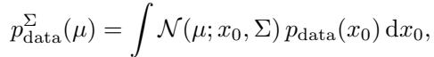

and the corresponding optimal denoiser

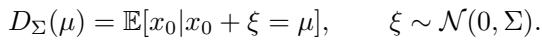

Then, by the anisotropic form of Tweedie's formula [39, 40],

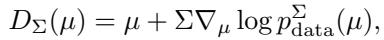

which is the usual Tweedie formula when Σ is a scalar multiple of the identity. EPS uses this identity with a covariance that is not chosen by hand, but rather is derived from the inverse problem formulation.

> 💡 **公式批读：把标量噪声换成矩阵噪声 (Hao 批注)**: 这一小节是纯工具准备。标准 Tweedie（Eq. 3）里噪声是标量 $\beta_t^2$；这里推广到**满协方差 $\Sigma$**：用 $\Sigma$ 平滑数据密度得到 $p_{\text{data}}^\Sigma$（Eq. 7），对应的最优去噪器 $D_\Sigma(\mu)=\mathbb{E}[x_0\mid x_0+\xi=\mu],\ \xi\sim\mathcal{N}(0,\Sigma)$（Eq. 8），则 $D_\Sigma(\mu)=\mu+\Sigma\nabla_\mu\log p_{\text{data}}^\Sigma(\mu)$（Eq. 9）。当 $\Sigma=\sigma^2 I$ 时退化回普通 Tweedie。**关键差别**（作者最后一句强调）：这里的 $\Sigma$ 不是手调的标量噪声等级，而是**由逆问题本身导出的满协方差**——这正是 EPS 与 GLASS 等"等效时间"方法的分水岭（见附录 A.6：只有 $A^\top A$ 是标量倍单位阵时 $\Sigma_\star$ 才各向同性，才能用一个标量时间近似）。

## 3.2 Closed-Form Posterior Score

The posterior marginal can be written as

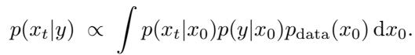

Both factors inside the integral are Gaussian in $x_0$. Completing the square gives the following result.

**Theorem 1 (Exact posterior score).** Under the linear Gaussian inverse problem (5) and the interpolant (1), the posterior score at time t is

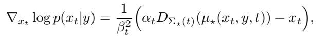

where

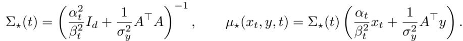

Equivalently, $D_{\Sigma_\star(t)}(\mu_\star(x_t, y, t)) = \mathbb{E}[x_0 | x_t, y]$.

> 💡 **公式批读：Theorem 1 —— 全文的定海神针 (Hao 批注)**: 这是整篇论文的中心结果。逐项拆：
> - **后验 score（Eq. 11）**：$\nabla_{x_t}\log p(x_t\mid y)=\frac{1}{\beta_t^2}\big(\alpha_t D_{\Sigma_\star(t)}(\mu_\star)-x_t\big)$。把它和无条件 Tweedie（Eq. 3）对比，形式**完全一样**——只是去噪器从 $D_t(x_t)$ 换成了后验去噪器 $D_{\Sigma_\star}(\mu_\star)$。这就是"后验采样仍是去噪问题"的严格含义。
> - **协方差（Eq. 12 左）**：$\Sigma_\star(t)=\big(\frac{\alpha_t^2}{\beta_t^2}I_d+\frac{1}{\sigma_y^2}A^\top A\big)^{-1}$。第一项是 prior precision（当前扩散噪声等级决定），第二项是 data precision（测量给的），两者相加再求逆 → 后验协方差。被 $A$ 强观测的方向（$A^\top A$ 大特征值）→ 协方差小（确定）；零空间方向 → 只剩 prior precision → 协方差大（不确定）。
> - **pivot（Eq. 12 右）**：$\mu_\star=\Sigma_\star\big(\frac{\alpha_t}{\beta_t^2}x_t+\frac{1}{\sigma_y^2}A^\top y\big)$。这是 $x_t$（当前状态）和 $A^\top y$（测量回投）的 **precision 加权融合**。
> - **最关键的等价（末行）**：$D_{\Sigma_\star(t)}(\mu_\star)=\mathbb{E}[x_0\mid x_t,y]$。这一行说明：要学的对象恰好是**融合了测量之后的后验去噪器**，而不是 DPS/moment-matching 用的 $p(x_0\mid x_t)$（融合测量之前）。这是 Section 3.3 精确定位偏差的依据。

The proof is given in Appendix A.2. The theorem says that posterior sampling is still a denoising problem, but not the isotropic one seen in unconditional pretraining. The denoiser must be queried at a measurement-aware input $\mu_\star$ under a measurement-aware anisotropic noise covariance $\Sigma_\star$.

**Proposition 2 (Posterior velocity).** The posterior velocity associated with the interpolant (1) is

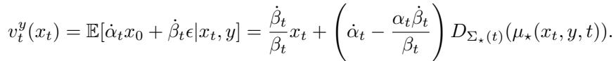

Thus estimating the exact posterior denoiser is equivalent to estimating the exact posterior flow.

The proof is given in Appendix A.3.

> 💡 **Prop 2 批读：flow backbone 也能用 (Hao 批注)**: Prop 2 把 Theorem 1 从 score/diffusion 推广到 velocity/flow。后验 velocity $v_t^y(x_t)$ 也是 $D_{\Sigma_\star}(\mu_\star)$ 的线性函数（形式与无条件 velocity Eq. 4 一模一样）。结论：**估计后验去噪器 ⟺ 估计后验 flow**。所以不管 backbone 是 DDPM、rectified flow 还是 EDM，EPS 只需学一个去噪器，采样器（ODE/SDE）照旧。

Posterior pivot. We call $\mu_\star$ the posterior pivot because the proof of Theorem 1 (Appendix A.2) shows that the joint quadratic form in $(x_t, y, x_0)$ pivots about $\mu_\star(x_t, y, t)$: Completing the square sends the entire dependence on $x_0$ into a single Gaussian centered at $\mu_\star$ with covariance $\Sigma_\star(t)$ while $x_t$ and $y$ enter only through this pivot and a multiplicative normalizer. Equivalently, $\mu_\star$ is the precision-weighted Bayesian fusion of the current state and the measurement under the two Gaussian likelihoods, before the data prior $p_{\text{data}}$ is folded in by the denoiser $D_{\Sigma_\star(t)}$. The pivot is therefore the only summary statistic of $(x_t, y)$ that the posterior denoiser needs to see.

> 💡 **机制拆解：为什么叫 "pivot"（枢轴）(Hao 批注)**: 名字来自证明里的"配方"操作——把 $(x_t,y,x_0)$ 的联合二次型对 $x_0$ 配方后，**所有对 $x_0$ 的依赖都塌进一个以 $\mu_\star$ 为中心的高斯**，$x_t,y$ 只通过 $\mu_\star$ 和一个乘性归一化常数进入。这带来一个极强的结论：**对固定算子，$\mu_\star$ 是 $(x_t,y)$ 关于后验去噪的充分统计量**。这就是为什么 EPS 只喂 $\mu_\star$（而非 $x_t$ 和 $y$ 各自）给网络在理论上就够了——注意 $\mu_\star$ 是"折入数据先验之前"的贝叶斯融合，先验部分由学到的去噪器 $D_{\Sigma_\star}$ 负责补。

Computing $\mu_\star$. Although (12) involves inverting a $d \times d$ matrix in general, every operator we consider admits a fast structured solve. For binary inpainting masks $A^\top A$ is diagonal, for downsampling it is block-diagonal, and for circular convolutions used in deblurring it is diagonalized by the FFT. The per-step cost of computing $\mu_\star$ is therefore negligible relative to a denoiser forward pass. For more general operators, $\mu_\star$ can still be obtained efficiently via conjugate gradient applied to the symmetric positive-definite system $(\alpha_t^2/\beta_t^2 I + \sigma_y^{-2} A^\top A)\mu_\star = (\alpha_t/\beta_t^2) x_t + \sigma_y^{-2} A^\top y$, which only requires matrix-vector products with A and $A^\top$. We measure these costs directly in Appendix D.12, where the structured $\mu_\star$ solve adds only sub-millisecond overhead per sampling step.

> 💡 **工程可行性：$\mu_\star$ 怎么算得快 (Hao 批注)**: Eq. 12 名义上要解 $d\times d$ 线性系统，但本文的算子都有结构：inpaint 掩码 → $A^\top A$ 对角；下采样 → 块对角；循环卷积去模糊 → FFT 对角化。所以每步只是逐元素除或一次 FFT，**亚毫秒级**（附录 D.12：<1 ms vs U-Net 前向 ~19 ms）。通用算子可用共轭梯度（CG）解 SPD 系统，只需 $A,A^\top$ 的矩阵-向量乘。**对我们盲逆问题的启示**：如果 $\varphi$ 让 $A(\varphi)$ 保持这类结构（掩码/卷积/下采样），pivot 求解仍然便宜；但联合估计 $\varphi$ 时 $A$ 每步变，需要重算 $\Sigma_\star$——这是把 EPS 思路搬到盲设定要付的额外代价。

## 3.3 What was missing in Training-Free Methods

Theorem 1 also pinpoints what existing training-free methods miss. Combining (11) with the unconditional Tweedie identity (3), the measurement-matching score can be written as a difference of two denoisers,

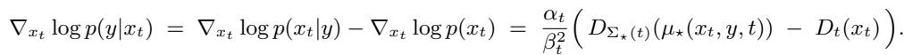

The exact guidance is the gap between the posterior denoiser evaluated at the pivot $\mu_\star$ under the anisotropic covariance $\Sigma_\star(t)$, and the unconditional denoiser evaluated at $x_t$. Methods that follow the template from [28], including DPS, DDNM, ΠGDM, and moment-matching variants [18–20, 26, 27], all approximate the first denoiser using only the second, by differentiating a measurement loss through $D_t(x_t)$, projecting $D_t(x_t)$ onto an affine subspace, or fitting a Gaussian to $p(x_0 | x_t)$ and comparing it to $y$. They thus evaluate the network at a different input than the exact identity, querying $D_\theta$ at $x_t$ rather than at the pivot $\mu_\star$, which itself depends on $y$. Even moment-matching methods that use anisotropic information approximate $p(x_0 | x_t)$, the denoising distribution before the measurement is incorporated, whereas the exact object is $p(x_0 | x_t, y)$, the denoising distribution after the measurement is fused into the kernel. The two coincide only in degenerate cases such as isotropic $A^\top A$ or high-noise limits, but not generically.

> 💡 **公式批读：Eq. 14 —— 精确 guidance 的真身，与 DPS 差在哪 (Hao 批注)**: 这是本文对已有方法最锋利的一刀。把 Eq. 11 减去无条件 Tweedie（Eq. 3），measurement-matching score 精确等于**两个去噪器之差** $\nabla_{x_t}\log p(y\mid x_t)=\frac{\alpha_t}{\beta_t^2}\big(D_{\Sigma_\star(t)}(\mu_\star)-D_t(x_t)\big)$：
> - **正确对象**：后验去噪器在 pivot $\mu_\star$、各向异性 $\Sigma_\star$ 下。
> - **DPS/DDNM/ΠGDM/moment-matching 实际做的**：只用第二个去噪器 $D_t(x_t)$——对它求测量 loss 梯度、投影到仿射子空间、或对 $p(x_0\mid x_t)$ 拟高斯。**它们在错误的点（$x_t$）评估网络**，而正确的点 $\mu_\star$ 依赖 $y$。
> - **两处偏差**：(a) 评估点错（$x_t$ vs $\mu_\star$）；(b) 用的是**融合测量前**的 $p(x_0\mid x_t)$，而非**融合测量后**的 $p(x_0\mid x_t,y)$。二者只在退化情形（$A^\top A$ 各向同性 或 高噪声极限）重合。
> - **这对校准的意义**：正因为已有方法系统性地在错误几何上做近似，它们的后验**不可能校准良好**——这解释了实验里 EPS 在 CRPS/MMD 上的全面优势。EPS 提供的正是"无近似 baseline"，可作为我们校准实验的参考后验构造依据。

## 3.4 The EPS Training Objective

Theorem 1 reduces posterior sampling to a single object, the anisotropic posterior denoiser $D_{\Sigma_\star(t)}(\mu_\star(x_t, y, t))$. Two of the three quantities involved are analytically tractable. Given $(x_t, y, t)$ and the operator parameters $(A, \sigma_y)$, the pivot $\mu_\star(x_t, y, t)$ and covariance $\Sigma_\star(t)$ are deterministic, closed-form functions defined by (12), and for the structured operators we consider, both can be computed in essentially the cost of an FFT or an element-wise solve (Section 3.2). What we cannot compute analytically is the denoiser itself. The expression $D_{\Sigma_\star(t)}(\mu) = \mathbb{E}[x_0 | x_0 + \xi = \mu]$ with $\xi \sim \mathcal{N}(0, \Sigma_\star(t))$ requires the data distribution $p_{\text{data}}$, which is accessible only through data samples, while the pretrained unconditional denoiser was trained with isotropic noise so is not directly applicable (but can be used to initialize the EPS training).

> 💡 **机制拆解：三个量里只有一个要学 (Hao 批注)**: 后验去噪器 $D_{\Sigma_\star}(\mu_\star)$ 拆成三个量：$\mu_\star$、$\Sigma_\star$（都由 Eq. 12 闭式给出、便宜）+ 去噪映射本身（要 $p_{\text{data}}$，只能从数据学）。预训练无条件去噪器为什么不能直接用？因为它是在**各向同性噪声**下训的，而 $\mu_\star$ 上的残留噪声是**各向异性 $\Sigma_\star$**——但它可以做初始化（warm-start）。这就把"解逆问题"彻底归约成"在新噪声几何下学一个去噪器"，是全文效率论证的核心。

Following standard approaches for training diffusion models, we therefore learn it by regression. To enable efficient noising of $x_0$ using the anistropic noise covariance, we note the following result:

**Proposition 3 (Isotropic simulation of the anisotropic pivot).** Let $x_t = \alpha_t x_0 + \beta_t \epsilon$ with $\epsilon \sim \mathcal{N}(0, I_d)$ and $y = A x_0 + \sigma_y \eta$ with $\eta \sim \mathcal{N}(0, I_m)$, independently. Define $\mu_\star(x_t, y, t)$ and $\Sigma_\star(t)$ as in (12). Then, conditional on $x_0$

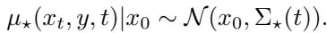

Thus the anisotropic corruption required by the exact posterior denoiser is induced by the closed-form pivot construction itself; it is not necessary to sample anisotropic noise directly.

The proof is given in Appendix A.4. This result is related to existing GP and linear regression literature (Appendix A.7), and shows that the required anistropic noising can be computed efficiently.

> 💡 **Prop 3 批读：训练里最漂亮的一招 (Hao 批注)**: 各向异性噪声 $\mathcal{N}(0,\Sigma_\star)$ 直接采样需要 $\Sigma_\star^{1/2}$（对满协方差很贵）。Prop 3 说：**你根本不用直接采**。只要按 Eq. 1、Eq. 5 用**各向同性**噪声 $\epsilon,\eta$ 生成 $x_t,y$，再按 Eq. 12 的闭式构造 $\mu_\star$，那么 $\mu_\star\mid x_0\sim\mathcal{N}(x_0,\Sigma_\star)$ **自动**就是要的各向异性腐蚀。即：pivot 构造过程本身就"免费"注入了正确的各向异性噪声。这让 EPS 训练和普通去噪训练一样简单——采两个高斯、算一个 $\mu_\star$、回归到 $x_0$。附录 A.7 指出这与岭回归/GP 的贝叶斯更新同源。

The objective. EPS regresses a denoising network $D_\theta$ onto clean targets given the pivot input,

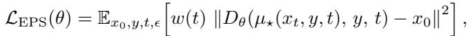

where $x_t = \alpha_t x_0 + \beta_t \epsilon$ and $y \sim \mathcal{N}(A x_0, \sigma_y^2 I_m)$. Standard arguments show that the squared-loss minimizer of (16) is $\mathbb{E}[x_0 | \mu_\star, y, t]$, which by Theorem 1 equals $D_{\Sigma_\star(t)}(\mu_\star) = \mathbb{E}[x_0 | x_t, y]$. Once trained, the posterior score and posterior velocity follow without further effort from (11) and (13). While strictly unnecessary, note that EPS also passes y to the learned denoiser so that the network is explicitly conditioned on the observed measurement while learning the posterior denoising map; for a fixed operator, the closed-form pivot is a sufficient statistic, but conditioning on $y$ makes the dependence on the particular inverse-problem instance explicit in the learned model, and slightly improves results (Appendix D.1).

> 💡 **公式批读：EPS 损失 = 换了输入的标准去噪回归 (Hao 批注)**: Eq. 16：$\mathcal{L}_{\text{EPS}}(\theta)=\mathbb{E}\big[w(t)\|D_\theta(\mu_\star,y,t)-x_0\|^2\big]$。和标准扩散去噪损失的差别**只有一处**：输入从 $x_t$ 换成 $\mu_\star$。平方损失最小化解 = $\mathbb{E}[x_0\mid\mu_\star,y,t]$，由 Theorem 1 = $\mathbb{E}[x_0\mid x_t,y]$，正是要的后验去噪器。训完后 score/velocity 由 Eq. 11/13 自动出。
> - **为什么额外喂 $y$？** 理论上固定算子时 $\mu_\star$ 已是充分统计量，喂 $y$ 冗余。但显式条件化让网络对"具体这一个逆问题实例"的依赖更清楚，实测略好（附录 D.1 的 ablation：$[\mu_\star,y,t]$ 优于 $[\mu_\star,t]$）。这也是 amortized 变体（一个网络吃所有算子）可行的原因——$y$ 携带了算子实例信息。

The upshot. The minimizer of (16) has the same target type (a clean image $x_0 \in \mathbb{R}^d$) and the same squared-loss regression structure as the standard pretrained denoiser $D_{\theta_0}(x_t, t)$. The structural changes are (i) the input is the pivot $\mu_\star$ rather than $x_t$, and (ii) implicitly, through the pivot construction, the input is corrupted by anisotropic noise of covariance $\Sigma_\star(t)$ rather than isotropic noise of scale $\beta_t$. Why does this matter? At the same input $\mu_\star$, the unconditional denoiser $D_{\theta_0}$ would return a biased estimate, because it implicitly assumes its input is corrupted by isotropic noise, whereas the true noise on $\mu_\star$ is operator-dependent and anisotropic. The network must therefore learn how to denoise under this measurement-induced anisotropic geometry.

> 💡 **机制拆解：为什么不能直接把 $\mu_\star$ 喂给预训练模型 (Hao 批注)**: 这段回答了一个自然的偷懒念头——"既然 $\mu_\star$ 是充分统计量，把它塞给现成的预训练去噪器不就行了？"不行。预训练去噪器**隐式假设输入是各向同性噪声腐蚀**的，而 $\mu_\star$ 上的噪声是各向异性 $\Sigma_\star$。在同一个 $\mu_\star$ 上，预训练器会给出**有偏**估计。所以必须 fine-tune 让网络学会"在测量诱导的各向异性几何下去噪"。附录 D.2 的 zero-shot pivoting 实验直接验证了这点：不 fine-tune 直接喂 $\mu_\star$，每个任务每个指标都不如 fine-tuned EPS。

Empirically, when warm-started from the pretrained unconditional denoiser, EPS converges in a small fraction of the iterations needed by other training-based posterior solvers (Appendix D.3). We attribute this to its proximity to the pretraining task. Conditional methods such as Palette [32] and InvFusion [34] preserve the noise schedule and noisy intermediates of pretraining but condition the score on the raw measurement, so the network must spend capacity learning the operator dependence on top of the pretrained denoising prior. Bridge methods such as InDI [35] and I2SB [36] go further by replacing the noise-to-data forward process with a measurement-to-data one, so the network must learn a different conditional mapping from scratch. EPS preserves the forward process and the per-time denoising query, and only adapts to operator-induced anisotropic geometry $\Sigma_\star(t)$.

> 💡 **消融解读：EPS vs Palette vs Bridge 的收敛差异 (Hao 批注)**: 这段是"为什么 EPS 收敛快"的机制论证，按"离预训练任务多远"排序：
> - **EPS**：保留前向过程 + 每个时刻的去噪查询类型，只需适应 $\Sigma_\star$ 的各向异性几何 → 离预训练最近 → warm-start 后极快收敛。
> - **Palette/InvFusion**：保留噪声调度和含噪中间态，但把 score 条件在**原始 $y$** 上 → 网络要在预训练先验之上额外花容量学算子依赖。
> - **Bridge（InDI/I2SB）**：直接把"噪声→数据"前向换成"测量→数据" → 完全不同的条件映射，几乎从头学。
>
> 附录 D.3 的收敛曲线佐证：EPS 在迭代 0（warm-start）时 PSNR/SSIM 已接近收敛值，Palette 要从无条件先验爬起。**这是 EPS 相对同为 training-based 的 Palette 的核心竞争力**。

Algorithm 1 EPS training

```
Require: Pretrained denoiser D_θ0 (or random init), data distribution p_data, operator distribution
         p(A), observation noise σ_y, noise schedule (α_t, β_t)
1: Initialize θ ← θ0 (or randomly).
2: while not converged do
3:   Sample x0 ~ p_data, A ~ p(A), t ~ p(t), ϵ ~ N(0, I_d), and η ~ N(0, I_m)
4:   Form y ← A x0 + σ_y η and x_t ← α_t x0 + β_t ϵ.
5:   Compute Σ_⋆(t) and μ_⋆(x_t, y, t) from (12) via the structured solve for A.
6:   Evaluate the posterior denoising loss L = w(t) ‖D_θ(μ_⋆, y, t) − x0‖²
7:   Update θ by gradient descent on L, and update EMA weights if used by the base sampler.
8: end while
9: return Trained denoiser D_θ.
```

> 💡 **Algorithm 1 批读：训练循环里藏着算子分布 $p(A)$ (Hao 批注)**: 注意第 3 行 sample 里有 $A\sim p(A)$——EPS 训练时**每个 minibatch 重采算子**（附录 B：随机 inpaint 掩码密度 $\mathcal{U}(50\%,70\%)$、随机 box、随机运动核角度长度等）。这有两个后果：(1) 网络对"一类算子"泛化，是 amortized 变体的基础；(2) 但 OOD 算子（如训练 70% 掩码、测试 90%）会退化（附录 D.9）——因为 pivot 的 precision 加权是按训练算子校准的。**对盲逆问题的直接启示**：把 $p(A)$ 换成 $p(A\mid\varphi)$、$\varphi$ 从先验采，就得到一个对 $\varphi$ amortize 的后验去噪器——这正是把 EPS 搬向我们 gauge-aware 联合采样的桥。

## 3.5 Sampling

At inference, EPS uses the same deterministic or stochastic sampler as the underlying diffusion backbone, replacing every denoiser call by $D_\theta(\mu_\star(x_t, y, t), y, t)$. No likelihood gradient, projection, or inner optimization is required during sampling. Since $\mu_\star$ is obtained by a structured linear solve, the per-step overhead is negligible relative to a denoiser forward pass (see Section 3.2).

> 💡 **机制拆解：推理零额外梯度 (Hao 批注)**: 采样时把 backbone 每次 $D_\theta(x_t,t)$ 调用换成 $D_\theta(\mu_\star,y,t)$，采样器（EDM Euler ODE 等）完全不动。**没有似然梯度、没有投影、没有内层优化**——这是 EPS 相对 DPS/ΠGDM（每步要反传，~2.3× 成本）的速度来源。附录 D.12：EPS 每步 wall-clock ≈ 裸无条件 EDM 的 1.006×。

The High-Noise Limit. Theorem 1 also characterizes the sampler at the start of the reverse trajectory, where the noise scale $\sigma_t$ is largest. In this regime both the pivot and its anisotropic denoiser take a particularly simple form:

**Observation 4 (High-noise posterior-mean limit).** With EDM parameterization $\alpha_t = 1, \beta_t = \sigma_t$ and let $P_{\mathcal{N}(A)} = I - A^\dagger A$ be the orthogonal projector onto the nullspace of A. Then, as $\sigma_t \to \infty$,

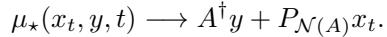

Moreover, the corresponding anisotropic denoiser satisfies

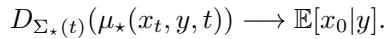

Thus a single high-noise EPS denoiser evaluation is a posterior-mean estimator.

The proof is given in Appendix A.5. The pivot limit (17) is the EPS-specific part of the statement: at the start of sampling, the network is queried at the pseudo-inverse reconstruction $A^\dagger y$ plus pure noise in the nullspace of A. The posterior-mean limit (18), by contrast, is generic rather than a contribution of EPS: by Theorem 1 it is equivalent to $\mathbb{E}[x_0 | x_t, y] \to \mathbb{E}[x_0 | y]$, which holds simply because $x_t$ carries vanishing information about $x_0$ as $\sigma_t \to \infty$. Under perfect learning, the same is therefore true of any training-based method whose denoiser targets $\mathbb{E}[x_0 | x_t, y]$ along the same path, e.g., Palette [32]; Appendix D.11 confirms this empirically. We nevertheless find it a useful way to read the sampling path of all such methods: it starts at the posterior mean $\mathbb{E}[x_0 | y]$ and ends at a sample from $p(x_0 | y)$.

> 💡 **公式批读：Observation 4 —— 一步出后验均值 (Hao 批注)**: 高噪声极限 $\sigma_t\to\infty$ 时：
> - **pivot 极限（Eq. 17）**：$\mu_\star\to A^\dagger y+P_{\mathcal{N}(A)}x_t$——即"伪逆重建 $A^\dagger y$（行空间，测量决定）+ 零空间纯噪声"。这是 EPS 特有的部分：采样起点网络被 query 在伪逆重建 + 零空间噪声上。
> - **去噪器极限（Eq. 18）**：$D_{\Sigma_\star}(\mu_\star)\to\mathbb{E}[x_0\mid y]$，即**后验均值**。所以**单次高噪声 EPS 去噪调用（1 NFE）就是一个后验均值/MMSE 估计器**。
> - **诚实的边界**：作者明确说 Eq. 18 是**通用的**（不是 EPS 独有）——任何沿同一路径 target $\mathbb{E}[x_0\mid x_t,y]$ 的 training-based 方法（如 Palette）在完美学习下都成立，因为 $\sigma_t\to\infty$ 时 $x_t$ 对 $x_0$ 无信息。附录 D.11 实证：NFE=1 时 Palette 和 EPS 几乎重合。EPS 独有的只是 pivot 极限 Eq. 17。
> - **读法**：整条采样路径"从后验均值 $\mathbb{E}[x_0\mid y]$ 起、到后验样本 $p(x_0\mid y)$ 止"——这解释了 Table 1 里 1-NFE 行 PSNR 最高（MMSE 最优）但 CRPS/FID 差（不是样本），即感知-失真权衡。

> 💡 **Section 3 小结 (Hao 批注)**:
> - **关键变量**：pivot $\mu_\star$（precision 加权融合，充分统计量）、各向异性协方差 $\Sigma_\star$（Eq. 12）、后验去噪器 $D_{\Sigma_\star}(\mu_\star)=\mathbb{E}[x_0\mid x_t,y]$。
> - **核心洞察**：后验采样 = 换了输入几何的去噪；已有 training-free 方法在 $x_t$（错点）用 $p(x_0\mid x_t)$（错分布）近似，精确对象是 $\mu_\star$ 处的 $p(x_0\mid x_t,y)$。
> - **可复用招式**：Prop 3（各向同性模拟各向异性噪声，训练免开方）、Observation 4（1-NFE 后验均值）。
> - **对本课题的可追问点**：Theorem 1 给出的是**算子已知**时的精确后验去噪核。要用作参考后验，需在低维 $x_0$ + 已知 $A,\sigma_y$ 下让 $D_{\Sigma_\star}$ 近似精确（或用高斯先验闭式化）；盲设定需把 $A$ 换成 $A(\varphi)$ 并对 $\varphi$ 边缘化，闭式性一般不再成立（见 Conclusion 的 Limitations）。
