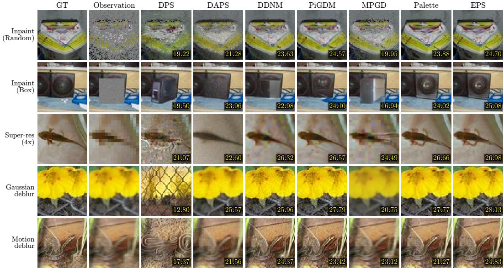
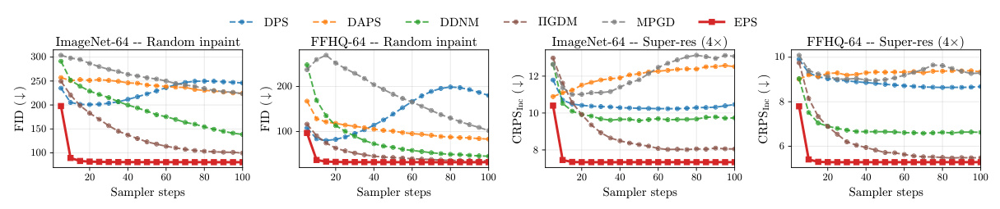
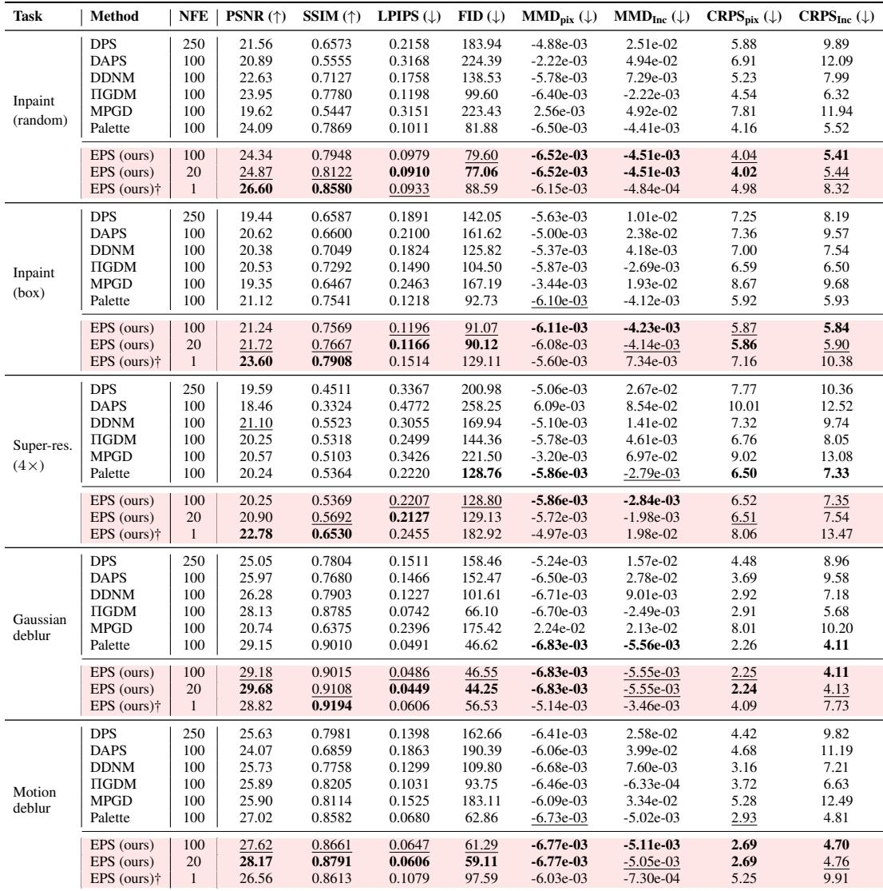

[← 返回 README](../README.md)

# 4 Experiments

## 📌 预览

本节在 FFHQ 和 ImageNet 上、五个线性逆问题上评测 EPS。主对比在 64×64（所有方法同 backbone、同协议、可公平算分布指标），256×256 在附录 D.10。证据链分三块：主结果表（Table 1/6，三类指标全覆盖）、采样效率曲线（Figure 3，~20 NFE 收敛）、定性对比（Figure 2）。最关键的对照组是 **Palette**——它就是"把 EPS 输入的 $\mu_\star$ 换回 $x_t$"，用来隔离 shifted pivot 的贡献。

---

We evaluate EPS on five linear inverse problems across two datasets. The main comparison is at 64×64, where every baseline is run under the same backbone, task, and evaluation protocol and where distributional metrics can be computed fairly. Additional 256×256 results are in Appendix D.10.

## 4.1 Experimental Setup

Datasets, backbones, and tasks. We use FFHQ and ImageNet. For ImageNet we use the publicly available class-conditional EDM [17] checkpoint released with the original codebase. For FFHQ we train an EDM checkpoint from scratch because the released FFHQ model does not reserve images for validation. All methods that require training or fine-tuning use the same backbone as EPS, and all zero-shot solvers use the same pretrained denoiser. We consider five linear inverse problems: random inpainting with 70% missing pixels, centered box inpainting, 4× super-resolution, Gaussian deblurring, and motion deblurring. In all cases we add Gaussian observation noise with standard deviation $\sigma_y = 0.05$. Operator details and randomization protocols are in Appendix B.

> 💡 **实验设置批读：公平性设计 (Hao 批注)**: 这里的对照做得很干净——**所有 training-based 方法（Palette、EPS）共享同一 backbone，所有 zero-shot 方法共享同一预训练去噪器**。这样任何差距都归因于方法本身而非 backbone 强弱。FFHQ 特意从头训 EDM（因为公开 FFHQ 模型没留验证集），避免数据泄漏。五个任务覆盖了不同的算子结构：inpaint（掩码，$A^\top A$ 对角）、超分（下采样，块对角）、去模糊（卷积，FFT 对角）——正好都是 $\mu_\star$ 能快解的结构。$\sigma_y=0.05$ 固定。

*Figure 2: Qualitative reconstructions across the five inverse problems. Numbers indicate PSNR values.*

> 💡 **Figure 2 批读 (Hao 批注)**: 五任务的定性重建，角标是 PSNR。要看的是**未观测方向的处理**：作者在正文强调 DPS/DAPS/MPGD 在激进 inpaint/deblur 下过平滑或幻觉出不符合观测的纹理，DDNM/ΠGDM 匹配了观测方向但零空间仍模糊。EPS 既贴合观测又保留锐利先验结构——机制上因为 $\mu_\star$ 显式分离了观测/未观测方向、$\Sigma_\star$ 指定了每个方向该去噪多少。这与 Figure 1 的几何直觉闭环。

*Figure 3: EPS converges in ∼20 NFE; baselines never catch up. Sampling-step sensitivity for FID and CRPS-Inception on random inpainting and 4× super-resolution, across both ImageNet-64 and FFHQ-64. EPS plateaus within ∼20 NFE on every panel, while DPS, DAPS, DDNM, ΠGDM, and MPGD continue to improve out to 100 NFE without reaching the EPS asymptote.*

> 💡 **Figure 3 批读：效率证据链核心 (Hao 批注)**: 这四个 panel（FID/CRPS-Inception × random inpaint/4× 超分 × 两数据集）是"少一个数量级 NFE"的直接证据。读法：EPS 曲线在 ~20 NFE 就压平到渐近线，而 DPS/DAPS/DDNM/ΠGDM/MPGD 一路涨到 100 NFE 都够不到 EPS 的渐近水平。关键不是"EPS 收敛快"，而是"**基线即使用更多算力也达不到 EPS 的天花板**"——因为它们的 measurement-matching score 是有偏近似（Eq. 14），偏差不会随 NFE 增加而消失。CRPS-Inception 这条分布校准指标同样如此，说明 EPS 的优势不只在 fidelity，更在**后验校准**。

Baselines and metrics. The sampling-based family comprises DPS [18], DAPS [22], DDNM [19], ΠGDM [20], and MPGD [23]. The training-based family is represented by Palette [32], implemented under the same EDM backbone and compute budget; Palette can be viewed as the EPS pipeline with $x_t$ replacing $\mu_\star$, isolating the contribution of the shifted pivot. We report PSNR and SSIM [41], LPIPS [42], and FID [43] for pointwise and perceptual quality, and CRPS [44] and MMD [45] in pixel and Inception feature space [46, 47] for distributional calibration. We use raw Inception features rather than the L2-normalized features of Mammadov et al. [46], so absolute values differ but relative comparisons across methods are preserved. Definitions are in Appendix F.

> 💡 **消融解读：Palette 是完美的对照组 (Hao 批注)**: 这段点出了全文最有说服力的设计——**Palette = EPS pipeline，但输入用 $x_t$ 而非 $\mu_\star$**。同 backbone、同算力、同数据，唯一差别是 shifted pivot。所以 EPS − Palette 的差距**精确隔离出 pivot 的贡献**，排除了"EPS 只是训得多/网络大"的解释。指标分三类，正是我们校准课题该照抄的评测协议：
> - **fidelity/pointwise**：PSNR、SSIM。
> - **perceptual**：LPIPS、FID。
> - **distributional calibration**：CRPS、MMD（pixel + Inception 两种空间）。
>
> 第三类是重点：CRPS 和 MMD 衡量的是"采出的后验样本分布"是否贴近真值分布，是校准而非单点保真。多数 SR 论文只报前两类，本文把校准指标提到一等公民位置。

## 4.2 Main Results

Tables 1 and 6 report all five tasks, all baselines, and all metrics in a single view per dataset. We include EPS at 100, 20, and 1 NFE: the first two correspond to the posterior-sampling regime at different budgets, and the 1-NFE row tests the posterior-mean prediction from Section 3.5.

*Table 1: Quantitative comparison on ImageNet-64. Five linear inverse problems, 100 images × 10 seeds. Baselines follow the sampler and hyperparameters from their respective papers; Palette and EPS use the EDM Euler sampler at 1 NFE per step. Best in bold, second-best underlined; EPS rows highlighted in light pink. † The NFE=1 row applies a single Tweedie evaluation $D_\theta(\mu_\star, \sigma_{\max})$ returning the conditional posterior mean $\mathbb{E}[x_0 | y]$ in one shot rather than a posterior sample.*

> 💡 **Table 1 批读：主结果的三行 EPS 怎么读 (Hao 批注)**: 每个任务给出 EPS 的三个预算：
> - **EPS 100/20 NFE**：后验采样，是真正的样本。20 NFE 往往比 100 NFE 还略好（因为 Euler ODE 步数适中，见 Figure 3 平台期），且比所有基线好。
> - **EPS 1 NFE†**：单次 Tweedie 调用，返回后验均值 $\mathbb{E}[x_0\mid y]$。**PSNR/SSIM 最高**（如 random inpaint 26.60 vs 100-NFE 的 24.34），但 FID/CRPS 变差——因为它是均值不是样本，符合 Observation 4 和感知-失真权衡。
> - **读表要点**：EPS 在每个任务每个指标都是最好或次好；最强对手始终是 Palette（隔离出 pivot 贡献）；采样类基线（ΠGDM、DPS 等）即使 NFE 更大也落后，且在**最病态的算子**（70% 随机 inpaint、4× 超分）差距最大——这正是零空间最大、近似 guidance 最失效的地方。

Quantitative comparison and sampling efficiency. EPS attains the best or second-best score on every metric and task in Tables 1 and 6, across pointwise fidelity (PSNR, SSIM), perceptual quality (LPIPS, FID), and distributional calibration (CRPS, MMD). The closest competitor is consistently Palette, which shares the EPS pipeline except that the network input is $x_t$ rather than $\mu_\star$; holding the backbone, compute budget, and training data fixed, EPS still outperforms Palette on every task, isolating the contribution of the shifted pivot. Sampling-based baselines that approximate the measurement-matching score (ΠGDM, DPS, DDNM, DAPS, MPGD) lag further behind, even at substantially larger NFE budgets (ΠGDM, DDNM, DAPS, MPGD at 100 NFE; DPS at 250), and the gap widens where the operator is most ill-conditioned, namely random inpainting with 70% missing pixels and 4× super-resolution. Figure 3 confirms the same trend across budgets: EPS plateaus within ∼20 NFE on every panel, while every baseline keeps improving out to 100 NFE without reaching the EPS asymptote. The 1-NFE row is the strongest pointwise estimator on PSNR and SSIM (e.g., 26.60 PSNR on ImageNet random inpainting against 24.34 at 100 NFE), consistent with Observation 4, and trades distributional calibration for that pointwise sharpness in line with the perception-distortion trade-off [48].

> 💡 **证据链批读：主结果支撑了哪些 claim (Hao 批注)**: 逐条对齐贡献：
> - **"EPS 全面最好"** ← 三类指标每任务最好/次好。
> - **"pivot 是关键"** ← EPS > Palette（唯一差别是 $\mu_\star$ vs $x_t$）。这条最硬，因为其余变量全控住了。
> - **"近似 guidance 有本质偏差"** ← 采样基线更大 NFE 也追不上，且病态算子差距更大（呼应 Eq. 14 的偏差分析）。
> - **"1-NFE = 后验均值"** ← PSNR/SSIM 最高但 CRPS/FID 差，是均值不是样本（Observation 4 + 感知-失真权衡 [48]）。

Qualitative comparison and ablations. Figure 2 shows reconstructions on the five tasks. The largest visual gaps appear under aggressive inpainting and deblurring, where DPS, DAPS, and MPGD oversmooth or introduce texture inconsistent with the measurement, and DDNM and ΠGDM match measured directions but leave the unmeasured subspace blurry. EPS preserves sharp prior structure while matching the observation, since the pivot $\mu_\star$ explicitly separates measured and unmeasured directions and $\Sigma_\star(t)$ specifies how much to denoise along each. Appendix D studies the input pivot, zero-shot behavior, warm-start convergence, sampling-step sensitivity, amortization across tasks, and 256×256 scaling, and confirms the two central mechanisms: the shifted pivot is the right input, and preserving pretrained denoising marginals explains the fast convergence.

> 💡 **Section 4 小结 (Hao 批注)**:
> - **关键数字**：EPS ~20 NFE 收敛（基线 100–250 NFE 追不上）；ImageNet random inpaint EPS-20 PSNR 24.87 vs Palette 24.09 vs ΠGDM 23.95；1-NFE PSNR 26.60（后验均值）。
> - **两个被证实的机制**：(1) shifted pivot 是正确输入（EPS>Palette，附录 D.1 逐步 ablation $x_t\to\mu_\star\to\mu_\star{+}\Sigma_\star\to$EPS 单调变好）；(2) 保留预训练去噪边缘分布解释快收敛（附录 D.3）。
> - **对本课题最有用的一点**：本文把 **CRPS/MMD 分布校准指标**作为主表一等公民，且给出了"pivot 换 $x_t$"这种干净的隔离性 ablation——这套评测设计可直接迁移到我们对联合后验采样器的 SBC/coverage/CRPS 校准检验中。
