[← 返回 README](../README.md)

# Appendix

## 📌 预览

附录分六大块：**A** 完整推导（各向异性 Tweedie、Theorem 1、Prop 2、Prop 3、Observation 4、GLASS 特例、与岭回归/GP 的联系）；**B** 实现细节（架构、pivot 求解器、优化、算子随机化、采样）；**C** Broader Impact；**D** 大量补充实验（输入配置消融、zero-shot pivoting、Palette vs EPS 收敛、采样效率、amortized 变体、一步后验均值验证、更多 64×64/256×256 结果、极端任务、OOD 掩码密度、运行时、后验多样性、采样预算）；**E** 基线配置；**F** 指标定义。对本课题最有价值的是 A.2（Theorem 1 证明——参考后验构造依据）、A.7（与 GP/岭回归的贝叶斯更新同源）、D.1（pivot 是正确输入的隔离性证据）。

---

## A Theory and Derivations

This appendix gives the full derivation of the EPS score identity, the posterior velocity, the equivalent-time special case, and the one-step posterior-mean limit. We keep the assumptions of the main text: $x_t = \alpha_t x_0 + \beta_t \epsilon$ with $\epsilon \sim \mathcal{N}(0, I_d)$ and $y = A x_0 + \eta$ with $\eta \sim \mathcal{N}(0, \sigma_y^2 I_m)$.

## A.1 Anisotropic Tweedie Formula

For any positive definite $\Sigma$, define

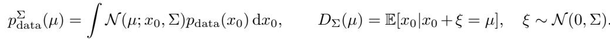

Then

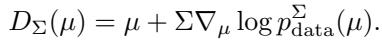

Indeed, differentiating under the integral gives

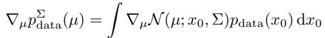

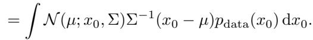

Dividing by $p_{\text{data}}^\Sigma(\mu)$ yields

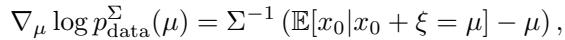

which proves (20). The key point for EPS is that Σ is a full covariance matrix fixed by the inverse problem, not a scalar noise level chosen to match an unconditional diffusion time.

> 💡 **A.1 批读：各向异性 Tweedie 的一行证明 (Hao 批注)**: 证明就是"在积分号下求导 + 除以归一化"。对高斯核 $\mathcal{N}(\mu;x_0,\Sigma)$ 求 $\mu$ 的梯度得到 $\Sigma^{-1}(x_0-\mu)$ 因子（Eq. 22），除以 $p_{\text{data}}^\Sigma$ 后左边是 $\nabla_\mu\log p_{\text{data}}^\Sigma$、右边是 $\Sigma^{-1}(\mathbb{E}[x_0\mid x_0+\xi=\mu]-\mu)$（Eq. 23），移项即得 Eq. 20。最后一句是 EPS 与 GLASS 类"等效标量时间"方法的本质分界：这里 $\Sigma$ 是**逆问题固定的满协方差**，不是为匹配某个扩散时间而挑的标量噪声——只有满协方差才能刻画"不同方向不等确定性"。

## A.2 Proof of Theorem 1

Theorem 1 restated. Under the linear Gaussian inverse problem (5) and the interpolant (1), the posterior score at time t is

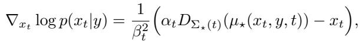

where

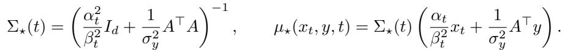

Equivalently, $D_{\Sigma_\star(t)}(\mu_\star(x_t, y, t)) = \mathbb{E}[x_0 | x_t, y]$.

Proof. By conditional independence of $x_t$ and y given $x_0$,

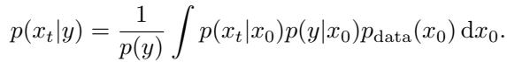

The two Gaussian factors are

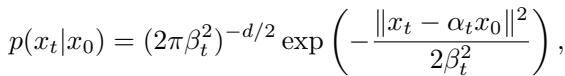

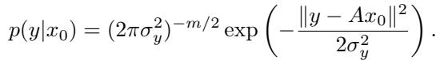

Collect the exponent terms that depend on $x_0$:

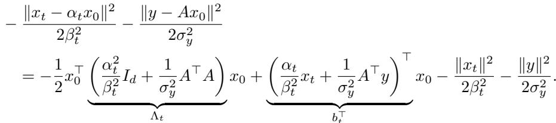

Because $\beta_t \gt 0$, the matrix $\Lambda_t$ is positive definite even when A is rank deficient. Let $\Sigma_\star = \Lambda_t^{-1}$ and $\mu_\star = \Sigma_\star b_t$. Completing the square in (30),

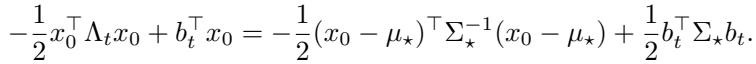

Therefore the product of the two likelihoods can be factored as

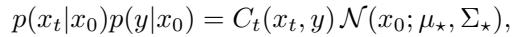

where all dependence on $x_0$ is contained in the displayed Gaussian and

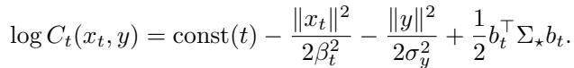

> 💡 **A.2 批读（上）：配方是整个证明的心脏 (Hao 批注)**: 这一半是"高斯乘积 → 配方"。两个似然 $p(x_t\mid x_0)$（Eq. 27）和 $p(y\mid x_0)$（Eq. 28）在指数上对 $x_0$ 都是二次型。把依赖 $x_0$ 的项收集起来（Eq. 29），二次项系数矩阵就是 $\Lambda_t=\frac{\alpha_t^2}{\beta_t^2}I_d+\frac{1}{\sigma_y^2}A^\top A$（precision 之和），一次项系数就是 $b_t=\frac{\alpha_t}{\beta_t^2}x_t+\frac{1}{\sigma_y^2}A^\top y$。**关键点**：因为 $\beta_t\gt 0$，即使 $A$ 秩亏（零空间存在），$\Lambda_t$ 仍正定可逆——这就是为什么后验协方差 $\Sigma_\star=\Lambda_t^{-1}$ 永远良定义。令 $\mu_\star=\Sigma_\star b_t$ 配方（Eq. 31），两个似然的乘积恰好因式分解成 $C_t(x_t,y)\cdot\mathcal{N}(x_0;\mu_\star,\Sigma_\star)$（Eq. 32）：**所有 $x_0$ 的依赖塌进一个中心在 $\mu_\star$、协方差 $\Sigma_\star$ 的高斯**，$x_t,y$ 只通过 $\mu_\star$ 和归一化常数 $C_t$（Eq. 33）进入——这正是"pivot（枢轴）"名字的由来。

Substituting (32) into (26) gives

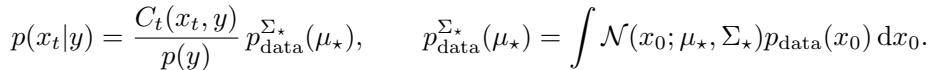

Now differentiate (34) with respect to $x_t$. Since $\Sigma_\star$ does not depend on $x_t$ and $\partial b_t / \partial x_t = (\alpha_t / \beta_t^2) I_d$

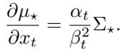

The normalizer derivative is

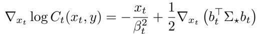

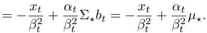

The smoothed-density derivative is, by the chain rule and (35),

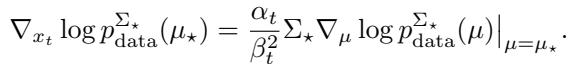

Using the anisotropic Tweedie identity (20),

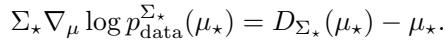

Combining (37), (38), and (39), the pivot terms cancel:

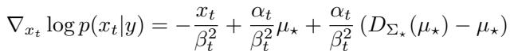

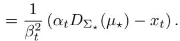

Finally, under the joint density proportional to $\mathcal{N}(x_0; \mu_\star, \Sigma_\star) p_{\text{data}}(x_0)$, the posterior mean of $x_0$ is exactly $D_{\Sigma_\star}(\mu_\star)$, so $D_{\Sigma_\star(t)}(\mu_\star(x_t, y, t)) = \mathbb{E}[x_0 | x_t, y]$ □

> 💡 **A.2 批读（下）：pivot 项奇迹般抵消 (Hao 批注)**: 后半是"对 $x_t$ 求导"。代入积分后 $p(x_t\mid y)\propto C_t(x_t,y)\,p_{\text{data}}^{\Sigma_\star}(\mu_\star)$（Eq. 34），对 $x_t$ 取对数梯度分两块：(1) 归一化常数 $\log C_t$ 的梯度给出 $-\frac{x_t}{\beta_t^2}+\frac{\alpha_t}{\beta_t^2}\mu_\star$（Eq. 37）；(2) 平滑密度的梯度经链式法则 + 各向异性 Tweedie（Eq. 20）给出 $\frac{\alpha_t}{\beta_t^2}(D_{\Sigma_\star}(\mu_\star)-\mu_\star)$（Eq. 38-39）。两块相加时，**$\mu_\star$ 项精确抵消**（Eq. 40 → 41），只剩 $\frac{1}{\beta_t^2}(\alpha_t D_{\Sigma_\star}(\mu_\star)-x_t)$，即 Theorem 1。这个抵消不是巧合——它是"pivot 是充分统计量"的代数体现。最后一步：联合密度 $\propto\mathcal{N}(x_0;\mu_\star,\Sigma_\star)p_{\text{data}}(x_0)$ 的后验均值恰是 $D_{\Sigma_\star}(\mu_\star)$，所以 $D_{\Sigma_\star}(\mu_\star)=\mathbb{E}[x_0\mid x_t,y]$。**对本课题的用法**：这条闭式在低维 + 已知线性 $A$ + 可解析 $p_{\text{data}}$（如 GMM/高斯）下能给出完全解析的真后验，是参考后验实验的构造依据。

## A.3 Proof of Proposition 2

For brevity in this proof we write $D^\star(x_t, y, t) := D_{\Sigma_\star(t)}(\mu_\star(x_t, y, t))$, which by Theorem 1 equals $\mathbb{E}[x_0 | x_t, y]$. The interpolant satisfies $x_t = \alpha_t x_0 + \beta_t \epsilon$, hence conditional on $(x_t, y)$,

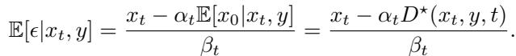

The posterior velocity is the conditional expectation of the path derivative:

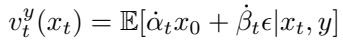

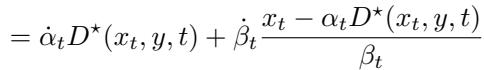

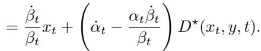

Thus estimating the exact posterior denoiser is equivalent to estimating the exact posterior velocity for the interpolant.

> 💡 **A.3 批读：velocity 也只是去噪器的线性函数 (Hao 批注)**: 证明很短——由 $x_t=\alpha_t x_0+\beta_t\epsilon$ 得 $\mathbb{E}[\epsilon\mid x_t,y]=\frac{x_t-\alpha_t D^\star}{\beta_t}$（Eq. 42），代入 velocity 的条件期望 $v_t^y=\mathbb{E}[\dot\alpha_t x_0+\dot\beta_t\epsilon\mid x_t,y]$（Eq. 43-45）即得。结论：后验 velocity 是后验去噪器 $D^\star$ 的线性函数，形式与无条件 velocity（Eq. 4）完全一致。**工程含义**：flow-matching backbone（rectified flow 等）同样只需学一个去噪器，ODE/SDE 采样器原样复用，不用为 flow 单独设计。

## A.4 Proof of Proposition 3

Let

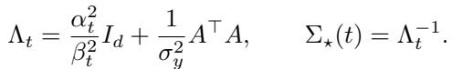

Using $x_t = \alpha_t x_0 + \beta_t \epsilon$ and $y = A x_0 + \sigma_y \eta$, the pivot is

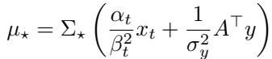

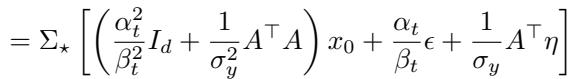

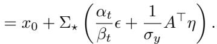

The noise term is Gaussian with mean zero and covariance

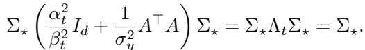

Therefore $\mu_\star | x_0, t \sim \mathcal{N}(x_0, \Sigma_\star(t))$, as claimed.

> 💡 **A.4 批读：为什么各向异性噪声"免费" (Hao 批注)**: 这是 Prop 3（训练里最省事的一招）的证明。把 $x_t,y$ 的表达式代进 pivot 定义（Eq. 47），$\mu_\star$ 展开后**确定性部分恰好凑成 $\Lambda_t x_0$**，被 $\Sigma_\star=\Lambda_t^{-1}$ 左乘后就是 $x_0$（Eq. 48-49），剩下的是噪声项 $\Sigma_\star(\frac{\alpha_t}{\beta_t}\epsilon+\frac{1}{\sigma_y}A^\top\eta)$。这个噪声项的协方差算出来是 $\Sigma_\star\Lambda_t\Sigma_\star=\Sigma_\star$（Eq. 50，用了 $\Lambda_t=\Sigma_\star^{-1}$）。所以 $\mu_\star\mid x_0\sim\mathcal{N}(x_0,\Sigma_\star)$——**用两个各向同性高斯 $\epsilon,\eta$ 生成的 pivot，自动带上了正确的各向异性协方差 $\Sigma_\star$**，训练时完全不用对 $\Sigma_\star$ 开方或采各向异性噪声。这是 EPS 训练能像普通去噪一样简单的技术关键。

## A.5 Proof of Observation 4

For EDM, $\alpha_t = 1$ and $\beta_t = \sigma_t$. Let

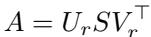

be the compact SVD of A, where $S = \text{diag}(s_1, \ldots, s_r)$ contains the positive singular values. Let $V_0$ be an orthonormal basis for $\mathcal{N}(A)$. Then

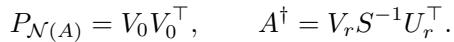

With $\lambda = \sigma_y^2 / \sigma_t^2$, the pivot can be written as

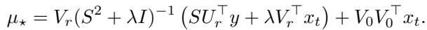

Taking $\lambda \to 0$ gives

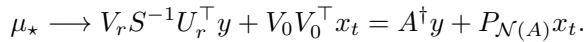

It remains to show that the corresponding anisotropic denoiser converges to the posterior mean $\mathbb{E}[x_0 | y]$. In the same SVD coordinates, the covariance is

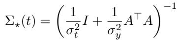

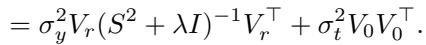

Thus, as $\sigma_t \to \infty$, the row-space covariance converges to

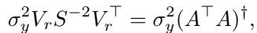

while the nullspace variance diverges. Therefore the limiting denoising query contains finite information only in the row space of A and no information in the nullspace.

More explicitly, the limiting finite-noise observation is

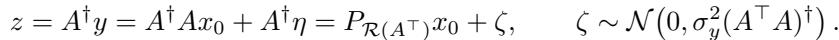

Since $A^\dagger$ is a deterministic function of $y$, conditioning on y implies conditioning on $z$. Conversely, for Gaussian measurement noise with known covariance, $z = A^\dagger y$ is a sufficient statistic for $y$ with respect to $x_0$: the remaining component of $y$ orthogonal to $\mathcal{R}(A)$ carries no information about $x_0$. Hence

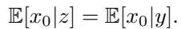

The limiting anisotropic denoiser is exactly the Bayes estimator associated with this row-space observation and infinite nullspace uncertainty. Therefore

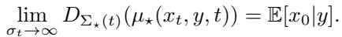

This proves Observation 4.

> 💡 **A.5 批读：高噪声极限为什么退化成伪逆 + 后验均值 (Hao 批注)**: 用紧凑 SVD $A=U_r S V_r^\top$ 把一切拆到奇异方向上。令 $\lambda=\sigma_y^2/\sigma_t^2$（噪声比），pivot 写成 Eq. 53。$\sigma_t\to\infty$ 即 $\lambda\to 0$：pivot → $A^\dagger y+P_{\mathcal{N}(A)}x_t$（Eq. 54）——**行空间被伪逆重建 $A^\dagger y$ 占据，零空间只剩纯噪声 $x_t$**。协方差（Eq. 55-57）在行空间收敛到 $\sigma_y^2(A^\top A)^\dagger$（有限），零空间方差发散（无限不确定）。关键论证（Eq. 58-59）：$z=A^\dagger y$ 是 $y$ 关于 $x_0$ 的充分统计量（$y$ 中正交于 $\mathcal{R}(A)$ 的分量对 $x_0$ 无信息），所以 $\mathbb{E}[x_0\mid z]=\mathbb{E}[x_0\mid y]$，极限去噪器就是后验均值（Eq. 60）。**注意作者的诚实**（正文 Section 3.5 已强调）：Eq. 60 是通用的（任何 target $\mathbb{E}[x_0\mid x_t,y]$ 的方法都成立），EPS 独有的只是 pivot 极限 Eq. 54。这解释了 1-NFE 行为什么 PSNR 高（是 MMSE 均值）但不是样本。

## A.6 Equivalent-Time and GLASS Limit

When $A^\top A = \gamma^2 I_d$, the covariance in (12) is isotropic:

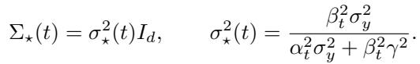

In this special case the posterior denoising query can be represented by an equivalent scalar noise level. If the base denoiser is trained for isotropic corruptions with effective noise ratio $\beta_s^2 / \alpha_s^2$, we choose $s = t^\star$ such that

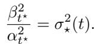

Then $D_{\Sigma_\star(t)}(\mu_\star)$ can be approximated by the pretrained isotropic denoiser at time $t^\star$. This is the setting in which an equivalent-time, training-free reduction such as GLASS [52] is available. For a general inverse problem, however, $A^\top A$ has different eigenvalues and often a nontrivial nullspace; $\Sigma_\star$ is then anisotropic and no single scalar time can represent the posterior denoising kernel. EPS fine-tuning is introduced precisely to learn this missing anisotropic denoising geometry.

> 💡 **A.6 批读：GLASS 是 EPS 的各向同性特例 (Hao 批注)**: 这一节精确定位了 EPS 与训练自由方法 GLASS 的边界。当 $A^\top A=\gamma^2 I_d$（算子各向同性、无零空间偏好）时，$\Sigma_\star$ 退化成标量 $\sigma_\star^2(t) I$（Eq. 61），此时后验去噪查询可以用一个**等效标量时间 $t^\star$**（Eq. 62）表示——预训练去噪器在 $t^\star$ 处的调用就近似了后验去噪器，**根本不用训练**（这就是 GLASS）。但一般算子 $A^\top A$ 特征值不同且常有零空间，$\Sigma_\star$ 各向异性，**没有单一标量时间能表示这个后验核**。EPS 的一步 fine-tune 存在的意义就是学这块"缺失的各向异性去噪几何"。一句话：**EPS = GLASS（各向同性、免训练）的各向异性推广（用一步训练换通用算子）**。

## A.7 Connection to ridge regression and Gaussian processes.

Equation (12) is exactly the linear-Gaussian Bayesian update familiar from ridge regression and Gaussian process regression. Here $\sigma_y^{-2} A^\top A$ plays the role of the data precision, $(\alpha_t^2 / \beta_t^2) I_d$ plays the role of the prior precision (set by the current diffusion noise level), and $\mu_\star$ is their precision-weighted mean. As $\sigma_t$ grows the prior precision vanishes and $\mu_\star$ converges to the data-only ridge solution, while as $\sigma_t$ shrinks $\mu_\star$ collapses onto $x_t$. The covariance $\Sigma_\star(t)$ is the corresponding posterior covariance, which shrinks along measured directions (large eigenvalues of $A^\top A$) and remains diffuse along weakly observed directions, mirroring the heteroscedastic uncertainty of GP posteriors [54].

> 💡 **A.7 批读：pivot 就是 GP/岭回归的贝叶斯更新 (Hao 批注)**: 这一节对本课题极有价值——它把 Eq. 12 解释成一个**标准线性高斯贝叶斯更新**：$\sigma_y^{-2}A^\top A$ 是 data precision，$(\alpha_t^2/\beta_t^2)I_d$ 是 prior precision（由当前扩散噪声等级设定），$\mu_\star$ 是二者的 precision 加权均值，$\Sigma_\star$ 是对应的后验协方差。极限直觉：$\sigma_t$ 大 → prior precision 消失 → $\mu_\star$ 收敛到纯数据的岭回归解；$\sigma_t$ 小 → $\mu_\star$ 塌回 $x_t$。$\Sigma_\star$ 沿强观测方向收缩、沿弱观测方向弥散，正是 GP 后验的异方差不确定性。**对我们校准课题的直接启示**：既然 EPS 的 pivot/协方差就是 GP 贝叶斯更新，那么在"高斯/GP 先验 + 已知线性算子"的低维玩具设定下，$p(x_0\mid y)$ 是**完全解析的高斯后验**——这正是构造"低维可知真后验"参考实验、跑 SBC/coverage/CRPS 的最干净起点。

## B Implementation Details

Architecture. We use the EDM-ADM checkpoint [17] for ImageNet-64×64 (edm-imagenet-64x64-cond-adm.pkl, ∼296M parameters, class-conditional with 1000-way one-hot embedding), and an EDM-DDPM++ checkpoint we trained from scratch for FFHQ-64×64. EPS extends the first conv from 3 to 6 input channels: the mean pivot $\mu_\star$ (3 channels) concatenated with a task-specific observation tensor (3 channels). The added input channels are zero-initialised so the network reproduces the unconditional pretrained mapping at step zero of fine-tuning. The observation tensor is the masked observation $y$ for inpainting, the nearest-neighbour upsampling of $y$ for super-resolution, and the blurred observation $y$ for deblurring; the total input width is therefore 6 channels for every task.

> 💡 **B 批读：warm-start 的工程细节最值得抄 (Hao 批注)**: 架构改动极小——把首层卷积从 3 通道扩到 6 通道（$\mu_\star$ 的 3 通道 + 任务相关的观测张量 3 通道）。**关键技巧**：新增通道**零初始化**，使得 fine-tune 第 0 步网络精确复现无条件预训练映射——这是"warm-start 不破坏预训练先验"的实现保证，也是收敛快的另一半原因（另一半是 Section 3.4 的结构对齐）。观测张量按任务定制：inpaint 用掩码观测、超分用最近邻上采样、去模糊用模糊观测。

Pivot solver. For binary masks $\Sigma_\star$ is diagonal and the pivot solve is element-wise. For 4× superresolution the structured solve uses average-pool / nearest-upsample primitives in $O(d)$. For circular blur kernels we diagonalize $A^\top A$ by the 2D FFT; the per-step solve is then a complex element-wise divide plus an inverse FFT, O(d log d). Empirically the pivot solve contributes <1 ms per step compared to a U-Net forward of ∼19 ms at batch 1.

Optimization. We use the EDM optimizer stack unchanged: Adam $(\beta_1{=}0.9, \beta_2{=}0.999, \varepsilon{=}10^{-8})$; log-normal noise sampling with $P_{\text{mean}} = -1.2, P_{\text{std}} = 1.2, \sigma_{\text{data}} = 0.5$; schedule extrema $\sigma_{\min}{=}0.002$, $\sigma_{\max}{=}80, \rho{=}7$. Learning rate is $10^{-4}$ with $12{\times}10^6$-image linear warm-up. EMA uses a half-life of 500 kimg with a $5\%$ ramp-up ratio. We weight the loss by the standard EDM weighting $\lambda(\sigma) = (\sigma^2 + \sigma_{\text{data}}^2) / (\sigma \sigma_{\text{data}})^2$. Per-task fine-tuning runs for 10 epochs (∼25k iterations) on ImageNet-64 at batch 128 across 4 NVIDIA B200 GPUs (gradient accumulation=1); FFHQ-64 trains for the same iteration budget at batch 192. End-to-end fine-tuning takes ∼24 h on ImageNet and ∼10 h on FFHQ per task.

Operator randomization during training. We re-sample the operator at every minibatch step. Random inpainting samples a per-pixel Bernoulli mask with mask-density $\sim \mathcal{U}(50\%, 70\%)$ (default training density 70%). Box inpainting samples a uniformly random rectangle whose side lengths are drawn from $\mathcal{U}([H/4, H/2]) \times \mathcal{U}([W/4, W/2])$ with margins $H/16$ at every edge. Motion-deblur kernels are generated with random length $\in \{7, 9, 11, 13, 15\}$ and random angle $\in [0, 180°]$; Gaussian-deblur kernels use a fixed bandwidth $\sigma_{\text{blur}}{=}0.75$ at length 11. Super-resolution applies a fixed 4× average-pool. Observation noise is fixed at $\sigma_y{=}0.05$ throughout both training and evaluation.

Sampling at inference. We use the deterministic EDM Euler ODE sampler for the 20- and 100-NFE variants (second_order=False). The 1-NFE variant evaluates the denoiser once at the highest noise level $\sigma_{\max}$ via the high-noise pivot of Observation 4; the resulting single forward pass returns the conditional MMSE estimator $\mathbb{E}[x_0 | y]$ directly. Class labels at inference time use the ground-truth ImageNet-1k class for ImageNet-64 and are not used for FFHQ-64.

Reproducibility. All random seeds are fixed; the same 100 evaluation images and 10 posterior seeds per image are used for every method. The structured-solve, training-loop, and sampler implementations will be released as open-source upon acceptance, along with all per-task fine-tuned checkpoints.

> 💡 **B 批读：算子随机化 = 对一类算子 amortize (Hao 批注)**: 训练每个 minibatch 重采算子（掩码密度 $\mathcal{U}(50\%,70\%)$、随机 box、随机运动核角度/长度）。这让网络对"一类算子"而非单个 $A$ 泛化，是 amortized 变体（D.5）的基础，也埋下 OOD 退化的伏笔（D.9：测试 90% 掩码时 pivot 的 precision 加权按 70% 校准，会失配）。**对盲逆问题的映射**：把这里的算子分布 $p(A)$ 替换成 $p(A\mid\varphi),\ \varphi\sim p(\varphi)$，就得到一个对参数 $\varphi$ amortize 的后验去噪器——但正如 D.9 警示，$\varphi$ 越偏离训练分布，闭式 pivot 外推越差。评测协议值得抄：100 张图 × 10 个后验 seed，固定种子，公平对齐所有方法。

## C Broader Impact

EPS provides a principled, calibrated approach to posterior sampling for linear inverse problems. Because it preserves the input/output structure of standard denoising pretraining, an existing pretrained prior can be repurposed into an uncertainty-aware posterior sampler with a lightweight fine-tune rather than a from-scratch retraining. This makes the method straightforward to adapt across scientific imaging applications where reliable reconstructions and quantified posterior uncertainty are valuable, and the closed-form pivot and covariance offer a transparent handle for analyzing the sampler in any downstream pipeline. Beyond these benefits, our work does not introduce societal impacts that go meaningfully beyond those of the existing generative diffusion priors it builds on; the standard considerations around dual-use of high-fidelity image generation and the demographic or domain biases of the underlying training data continue to apply.

> 💡 **C 批读 (Hao 批注)**: 作者强调 EPS 的"可校准 + 透明"——闭式 pivot/协方差给了下游分析一个可解释的把手，且轻量 fine-tune 就能把现成先验改造成"不确定性感知的后验采样器"。这与我们课题的价值主张（可靠重建 + 量化后验不确定性）高度一致。

## D Additional Experiments

We collect ablations and extended tables that support the main claims.

## D.1 Input Configuration Ablation

The central input ablation compares raw-state conditioning to shifted-pivot conditioning while keeping the backbone, compute budget, and EDM warm start fixed. We evaluate four input streams to the denoiser: (a) $[x_t, y, t]$ (Palette-style), the standard conditional baseline that feeds the noised latent alongside the observation and exposes no closed-form posterior structure; (b) $[\mu_\star, t]$, which replaces $x_t$ with the closed-form posterior mean $\mu_\star(x_t, y, \sigma_t)$ obtained by Gaussian-merging $p(x_t \mid x_0)$ and $p(y \mid x_0)$ inside the integral, dropping y from the input; (c) $[\mu_\star, \Sigma_\star, t]$, which additionally passes the per-component posterior covariance $\Sigma_\star$ as a side channel, giving the network explicit access to the local anisotropic uncertainty; and (d) $[\mu_\star, y, t]$ (EPS, ours), the full EPS input where the posterior mean is concatenated with the raw observation, allowing the network to use $y$ both directly and through the analytical pivot.

Table 2 reports this ablation on FFHQ-64 (DDPM++/EDM backbone) and ImageNet-64 (EDM-ADM backbone) at NFE=100 with the EDM Euler sampler. Both backbones are warm-started from the same pretrained checkpoint and fine-tuned under matched protocols. The progression Palette $\to \mu_\star \to \mu_\star{+}\Sigma_\star \to$ EPS is monotone on every distortion and distributional metric in the average and on most tasks individually, on both datasets. Replacing $x_t$ by $\mu_\star$ explains most of the gain, and the auxiliary observation channel provides an additional anchor.

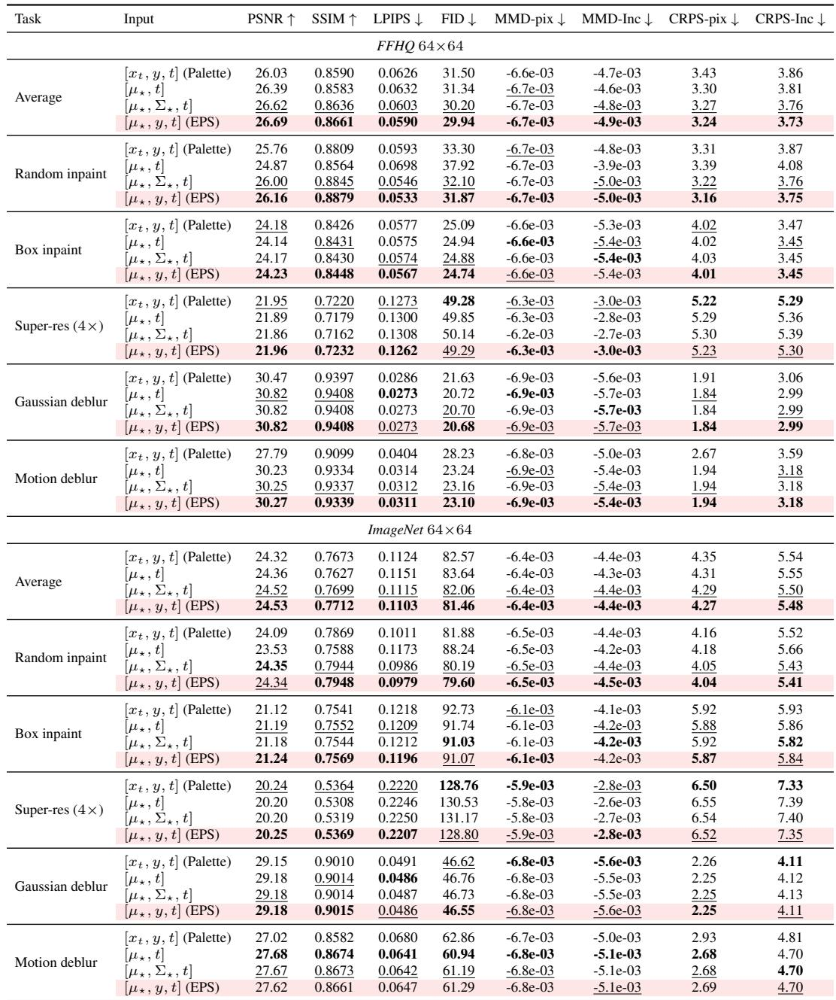

*Table 2: The shifted pivot $\mu_\star$ is the right input. Input-configuration ablation on FFHQ-64 (top) and ImageNet-64 (bottom) at NFE=100 with the EDM Euler sampler. The Palette → $\mu_\star$ → $\mu_\star{+}\Sigma_\star$ → EPS progression is monotone on every metric in the average and on most tasks individually, on both datasets. Best in bold, second-best underlined; the EPS row is highlighted in light pink.*

> 💡 **Table 2 批读：全文最硬的隔离性证据 (Hao 批注)**: 这是"pivot 是正确输入"这一 claim 的核心消融。四种输入流在同 backbone、同算力、同 warm-start 下对比：
> - **(a) $[x_t,y,t]$ = Palette**：无闭式后验结构。
> - **(b) $[\mu_\star,t]$**：把 $x_t$ 换成闭式后验均值 $\mu_\star$，丢掉 $y$。
> - **(c) $[\mu_\star,\Sigma_\star,t]$**：再把逐分量协方差 $\Sigma_\star$ 作为 side channel 喂进去。
> - **(d) $[\mu_\star,y,t]$ = EPS**：$\mu_\star$ + 原始 $y$。
>
> 结论：**Palette → $\mu_\star$ → $\mu_\star{+}\Sigma_\star$ → EPS 单调变好**（两数据集平均 + 多数单任务）。最大跃升来自 $x_t\to\mu_\star$（证明 shifted pivot 是主功臣），$\Sigma_\star$ side channel 和额外 $y$ 各再贡献一点。这条单调链把"EPS 的优势来自 pivot 而非训练技巧"钉死了。

## D.2 Zero-Shot Pivoting

Before fine-tuning, we can feed $\mu_\star$ directly to the pretrained denoiser (with the closest available EDM noise level, or the exact equivalent time in isotropic cases). This is not exact for general A because the pretrained model has not learned anisotropic denoising, but it tests whether the pivot already carries useful posterior information.

Table 3 compares zero-shot pivoting to fine-tuned EPS and to Palette under the same 100-step Euler sampler on FFHQ-64 and ImageNet-64. Zero-shot pivoting feeds $\mu_\star$ directly to the pretrained EDM denoiser at the current $\sigma_t$ (no fine-tuning) and runs the standard 100-step Euler loop; fine-tuned EPS uses the same sampler but with the denoiser adapted to take $[\mu_\star, y]$ on each task. Zero-shot pivoting underperforms both Palette and fine-tuned EPS on every task, confirming that the pretrained denoiser does not natively handle the anisotropic geometry of $\Sigma_\star(t)$, and that the EPS fine-tuning step is what unlocks the benefit of the pivot.

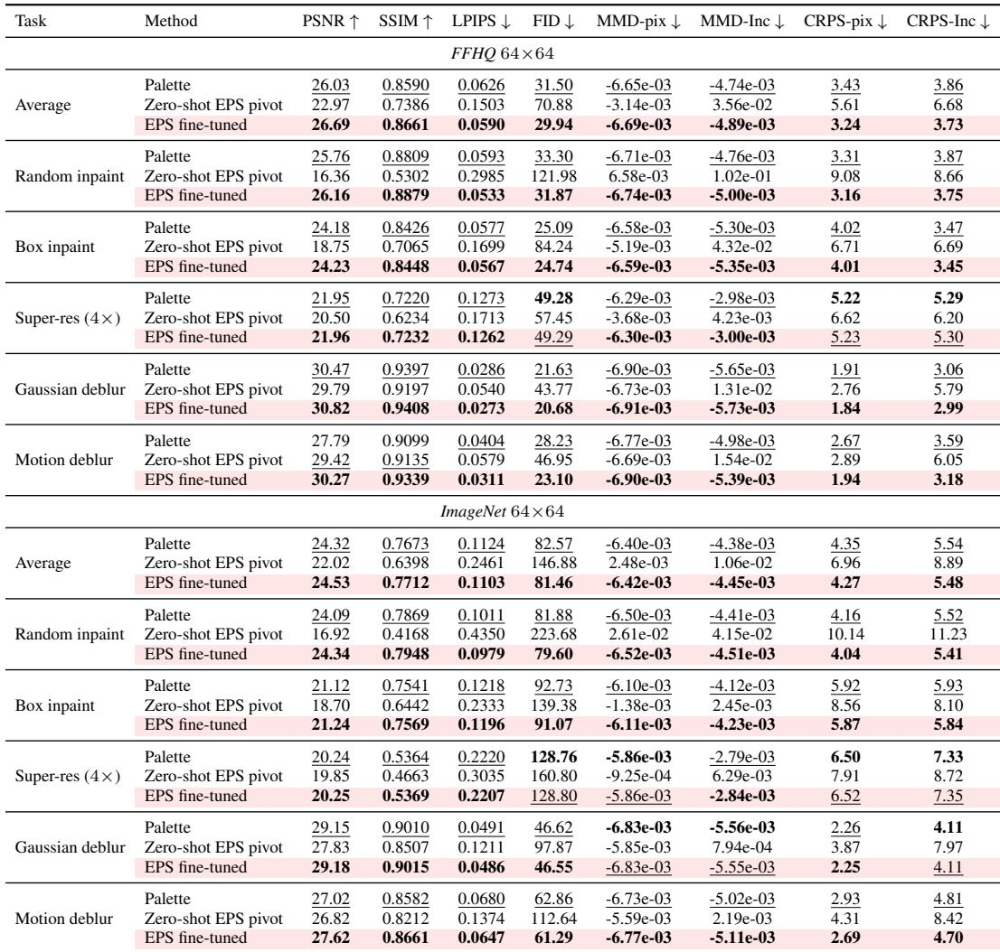

*Table 3: The pivot needs the fine-tuning step. Zero-shot pivoting vs. fine-tuned EPS at NFE=100 (Euler sampler) on FFHQ-64 (top) and ImageNet-64 (bottom). Feeding $\mu_\star$ to the pretrained denoiser without adaptation underperforms Palette and fine-tuned EPS on every task and every metric, on both datasets. Best in bold, second-best underlined; the EPS row is highlighted in light pink.*

> 💡 **Table 3 批读：pivot 好，但必须配 fine-tune (Hao 批注)**: 这是对 Section 3.4"为什么不能直接把 $\mu_\star$ 塞给预训练模型"的实证。zero-shot pivoting（不 fine-tune，直接喂 $\mu_\star$）在每个任务每个指标都**输给** Palette 和 fine-tuned EPS。原因正是 Section 3.4 说的：预训练去噪器隐式假设各向同性噪声，而 $\mu_\star$ 上是各向异性 $\Sigma_\star$，直接喂会有偏。所以"pivot 是正确输入"和"需要一步 fine-tune 学各向异性几何"是**互补的两个结论**——缺一不可。

## D.3 Palette vs EPS

Figure 4 reports fine-tuning convergence curves for EPS and Palette warm-started from the same pretrained EDM checkpoint. Rows index five (dataset, task) pairs (ImageNet-64 random inpainting, ImageNet-64 motion deblurring, FFHQ-64 random inpainting, FFHQ-64 motion deblurring, FFHQ-64 Gaussian deblurring); columns track training loss, PSNR, SSIM, LPIPS, and FID against the number of fine-tuning iterations under the matched 100-step Euler sampler. Three patterns hold across all rows. First, EPS starts from a much better initialization on every metric: at iteration zero, the shifted pivot $\mu_\star$ already encodes enough of the measurement geometry that PSNR and SSIM are within a few units of their converged values, while Palette has to climb from the unconditional prior. Second, EPS reaches its asymptotic LPIPS and FID in a small fraction of the iterations Palette needs and stays at least as low for the rest of training. Third, the gap is largest on the deblurring tasks, where the pivot provides the strongest measurement signal at initialization, and on the perceptual and distributional metrics (LPIPS, FID), where the conditioning structure matters most. This is consistent with the structural-locality argument: EPS preserves the input/output type and Gaussian-corrupted-target geometry of the pretrained denoising task, and only adapts to the operator-induced anisotropic covariance Σ⋆(t).

*Figure 4: EPS converges faster than Palette from the same warm start. Fine-tuning curves for EPS and Palette, both initialized from the same pretrained EDM checkpoint, on five (dataset, task) pairs (rows) and five metrics (columns: training loss, PSNR, SSIM, LPIPS, FID) under the matched 100-step Euler sampler. EPS starts from a markedly better initialization on every metric and reaches its asymptote in a small fraction of the iterations Palette needs.*

> 💡 **Figure 4 批读：收敛速度差异的机制证据 (Hao 批注)**: 同一 warm-start 出发，EPS vs Palette 的 fine-tune 曲线。三个模式：(1) **迭代 0 起点就好得多**——$\mu_\star$ 在初始化时已编码足够测量几何，PSNR/SSIM 离收敛值只差几个单位，Palette 得从无条件先验爬；(2) EPS 用 Palette 一小部分迭代就到达渐近 LPIPS/FID；(3) 差距在去模糊任务（pivot 初始信号最强）和感知/分布指标（条件结构最关键）上最大。这张图把"结构邻近 → 快收敛"的论证可视化了，是 EPS 相对同为 training-based 的 Palette 的核心效率证据。

## D.4 Sampling Efficiency

We sweep NFE at inference from 5 to 100 across all five tasks, with all methods using a 1-NFE-per-step Euler sampler under matched conditions.

Figures 5 and 6 report PSNR, FID, and Inception-feature CRPS as a function of sampler iterations on FFHQ-64 and ImageNet-64 respectively. Rows index the five tasks (random inpaint, box inpaint, 4× super-resolution, Gaussian deblur, motion deblur); columns track the three reported metrics. EPS reaches its asymptotic FID and CRPS within roughly 15-20 steps on every task and stays flat thereafter, while sampling-based baselines either fail to reach the same level (DPS, MPGD) or are slower to converge (DDNM, ΠGDM). The flat right tail of the EPS curves is the practical justification for the 20-NFE setting reported in the main results (Tables 1 and 6), and the gap to the strongest sampling-based baseline (ΠGDM) widens on the deblurring tasks under the more diverse ImageNet distribution.

*Figure 5: EPS plateaus by 15-20 steps on FFHQ-64. Sampling-step sensitivity on FFHQ-64 across the five tasks (rows). Columns report PSNR (↑), FID (↓), and Inception-feature CRPS (↓) versus sampler iterations under a 1-NFE-per-step Euler sampler. EPS reaches its asymptote within roughly 15-20 steps on every task and remains best or tied-best on FID and CRPS thereafter.*

*Figure 6: The plateau transfers to ImageNet-64. Sampling-step sensitivity on ImageNet-64; same layout as Fig. 5. EPS plateaus at the same step count on a more diverse class-conditional distribution, and the gap between EPS and the strongest sampling-based baseline (ΠGDM) widens on the deblurring tasks.*

> 💡 **Figure 5/6 批读：20-NFE 设定的依据 (Hao 批注)**: 这两张图把 NFE 从 5 扫到 100（FFHQ / ImageNet）。EPS 在每个任务 ~15-20 步就压平 FID/CRPS 并保持最好，采样类基线要么达不到同水平（DPS/MPGD），要么慢（DDNM/ΠGDM）。EPS 曲线的"平尾"就是主表用 20-NFE 的理由——再加算力也无收益。ImageNet（类条件、更多样）上 EPS 与最强基线 ΠGDM 的差距在去模糊任务进一步拉大。这条 CRPS 曲线尤其重要：它说明 EPS 的优势不只在 fidelity，**分布校准也在少 NFE 下就收敛到更好的水平**。

## D.5 Amortized Variant Across All Five Tasks

As a deployment-friendly alternative to per-task fine-tuning, we train a single EPS checkpoint across all five tasks using uniformly sampled operators per training step and no task indicator at the input.

Table 4 compares per-task EPS, amortized EPS, and Palette under matched compute on FFHQ-64 (top) and ImageNet-64 (bottom). On FFHQ-64 we report two amortized snapshots, at 55k and 160k training steps; the 160k checkpoint surpasses per-task EPS on every task and every metric, indicating that a single network can absorb all five operators without loss. On ImageNet-64, the amortized model is within 0.1-0.2 dB PSNR of per-task EPS and matches Palette or better on the distributional metrics, while requiring 5× less storage and a single set of weights at deployment.

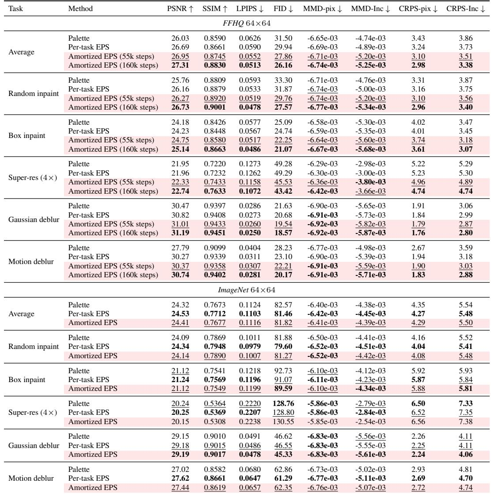

*Table 4: Amortization works. Amortized EPS vs. per-task EPS on FFHQ-64 (top) and ImageNet-64 (bottom) at NFE=100 with the EDM Euler sampler. The FFHQ amortized model is reported at two training-step snapshots (55k, 160k); the 160k snapshot surpasses per-task EPS across every task and metric. The ImageNet amortized model (single 296M-param ADM checkpoint, ∼60 epochs) matches per-task EPS within 0.1–0.2 dB PSNR and matches Palette or better on the distributional metrics. Best in bold, second-best underlined; amortized rows are highlighted in light pink.*

> 💡 **Table 4 批读：一个网络吞下五种算子 (Hao 批注)**: amortized 变体用**单一 checkpoint** 覆盖所有五任务（每步均匀采算子、输入无任务指示符）。FFHQ 上 160k 步的 amortized 模型在每任务每指标**超过** per-task EPS；ImageNet 上落后 per-task 仅 0.1-0.2 dB PSNR，分布指标追平或超 Palette，且部署时存储少 5×。**对本课题的直接价值**：amortized EPS 证明了"对一族算子学一个共享后验去噪器"可行——把算子分布 $p(A)$ 换成 $p(A\mid\varphi)$ 就是通往"对 $\varphi$ amortize 的联合后验采样器"的原型路径。网络能从 $y$（携带算子实例信息）隐式推断当前算子。

## D.6 One-Step Posterior Mean Check

Section 3.5 predicts that a single high-noise evaluation returns a posterior-mean estimator. We compare EPS at 1 NFE (a single direct Tweedie call $D_\theta(\mu_\star, \sigma_{\max})$ at $\sigma_{\max}{=}80$, no sampler loop) to the empirical mean of J=10 multi-step posterior samples drawn with the standard 100-step Euler sampler (1000 NFE per image), and to a single posterior sample from the same multi-step sampler (the EPS NFE=100 row used in our main results).

Table 5 reports this comparison on FFHQ-64 (top) and ImageNet-64 (bottom) across all five tasks. The 1-NFE Tweedie call recovers most of the PSNR/SSIM gain that the multi-step empirical mean attains while using 1000× fewer denoiser evaluations, confirming the high-noise posterior-mean prediction. As expected, both rows that target the conditional mean (the 1-NFE row and the empirical-mean row) score better on distortion (PSNR, SSIM) than the single-sample row, while the single-sample row scores better on perceptual and distributional metrics (LPIPS, FID, CRPS, MMD). Note that MMD/CRPS for the empirical-mean row degenerate to deterministic distances since the per-image ensemble has size J=1 after averaging.

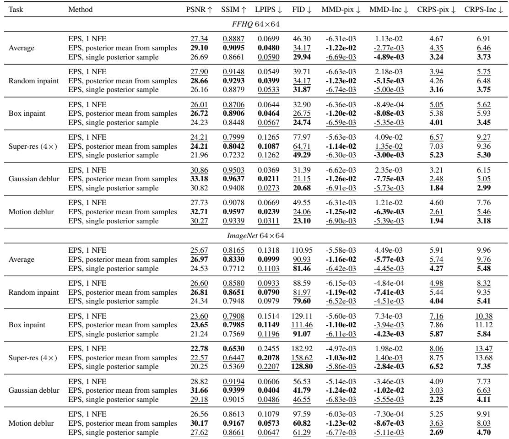

*Table 5: One Tweedie call recovers most of the multi-step gain. One-step EPS vs. empirical posterior mean from multi-step EPS samples on FFHQ-64 (top) and ImageNet-64 (bottom). The 1-NFE row is a single direct Tweedie call at $\sigma_{\max}{=}80$ (no sampler loop). The posterior-mean row averages 10 independent 100-step Euler samples (1000 NFE per image). The single-sample row reports per-seed metrics from the same 100-step sampler (matching the main-text NFE=100 row). The 1-NFE row matches or trails the empirical-mean row by a small margin on distortion metrics while using 1000× fewer denoiser calls. Best in bold, second-best underlined.*

> 💡 **Table 5 批读：Observation 4 的实证 (Hao 批注)**: 验证"单次高噪声调用 = 后验均值估计器"。三行对比：1-NFE（单 Tweedie 调用）、multi-step 经验均值（10 个 100 步样本平均 = 1000 NFE）、单个后验样本（100 NFE）。结论：**1-NFE 用 1000× 更少的评估就拿到经验均值绝大部分 PSNR/SSIM 收益**。两个 target 均值的行（1-NFE、经验均值）在失真指标上强，单样本行在感知/分布指标上强——这就是感知-失真权衡。注意经验均值行的 MMD/CRPS 退化成确定性距离（平均后每图只剩 1 个样本）。这条对我们校准很关键：**1-NFE 是点估计（不校准），要跑校准检验必须用多步采样的样本行。**

## D.7 Additional 64×64 Results

For completeness, Table 6 reproduces the FFHQ-64 main-table comparison from the body of the paper, broken out by task with all metrics. EPS at NFE=20 is the strongest configuration on perceptual and distributional metrics across all five tasks, while the NFE=1 Tweedie variant trades distributional fidelity for distortion (PSNR, SSIM), as predicted by the high-noise posterior-mean limit of Section 3.5.

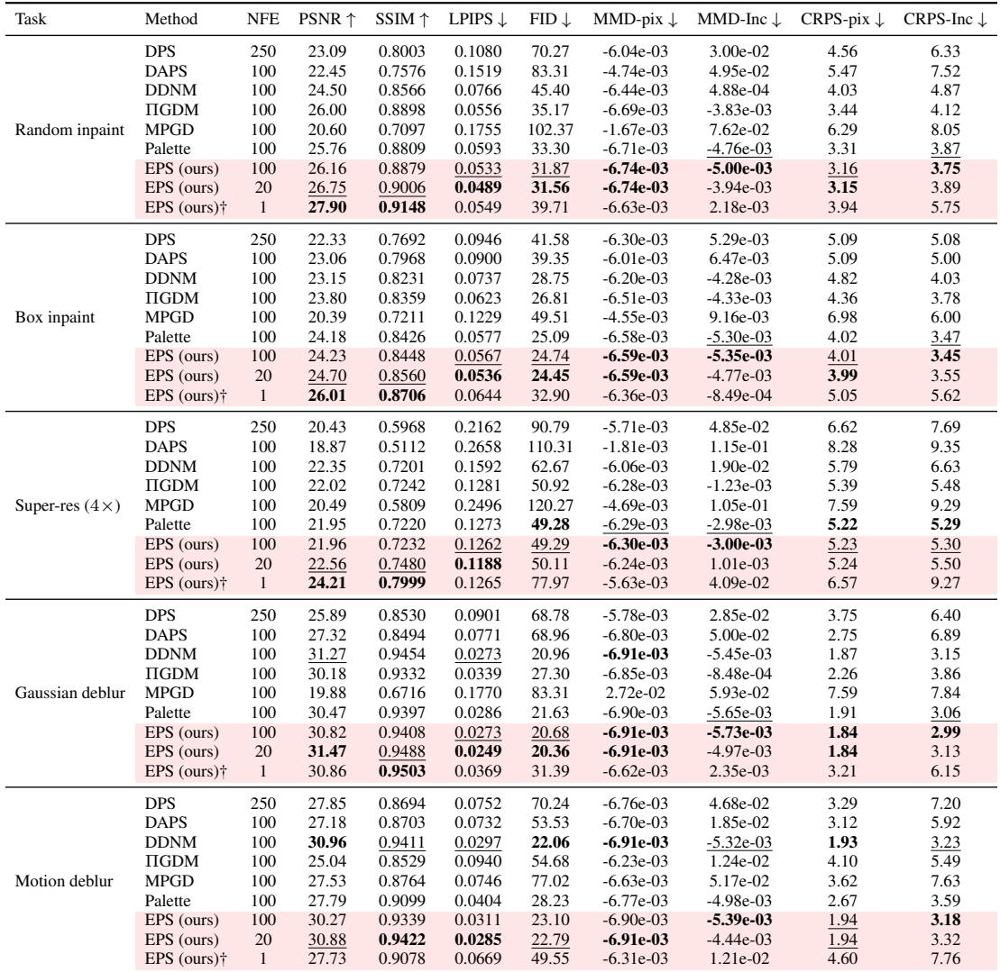

*Table 6: Detailed FFHQ-64 results. Quantitative comparison across the five inverse problems on FFHQ 64×64. All methods use a 1-NFE-per-step Euler sampler; reported NFE equals the number of sampler iterations. Best in bold, second-best underlined; EPS rows highlighted in light pink. † The NFE=1 row evaluates the deterministic high-noise posterior-mean limit (one direct Tweedie call $D_\theta(\mu_\star, \sigma_{\max})$); MMSE-optimal in pixel space but does not produce posterior samples, hence its strong PSNR/SSIM but weaker distributional metrics.*

> 💡 **Table 6 批读 (Hao 批注)**: FFHQ-64 版主表，与 ImageNet 的 Table 1 结论一致：EPS-20 在五任务的感知/分布指标上最强，1-NFE 用分布保真换失真锐度。两数据集结论同向，说明 EPS 的优势不依赖特定数据集。

Figures 7 and 8 show qualitative reconstructions on FFHQ-64 and ImageNet-64 across the five inverse problems, comparing EPS against DPS, DAPS, DDNM, ΠGDM, MPGD, and Palette. Two example observations per task; numbers in the bottom-right corner of each panel are per-image PSNR. On FFHQ-64, EPS recovers facial structure (eyes, mouth, hairline) under aggressive random inpainting and box inpainting, and produces sharper texture and edge geometry on super-resolution and deblurring than the sampling-based and Palette baselines. On ImageNet-64 the same pattern holds on a more diverse class-conditional distribution, with EPS preserving operator-consistent structure where DPS, DAPS, and MPGD oversmooth or hallucinate texture inconsistent with the measurement.

*Figure 7: Qualitative reconstructions on FFHQ-64. Two example observations per task across the five inverse problems; numbers in the bottom-right corner of each panel are per-image PSNR. EPS recovers facial structure under aggressive random inpainting and box inpainting, and produces sharper texture and edge geometry on super-resolution and deblurring than the sampling-based and Palette baselines.*

*Figure 8: Qualitative reconstructions on ImageNet-64. Same layout as Fig. 7. EPS preserves operator-consistent structure where DPS, DAPS, and MPGD oversmooth or hallucinate texture inconsistent with the measurement.*

> 💡 **Figure 7/8 批读 (Hao 批注)**: 两数据集定性对比（每任务两例，角标 PSNR）。要点与正文 Figure 2 一致：EPS 在激进 inpaint 下恢复面部结构（眼/嘴/发际线）、在超分/去模糊上比基线更锐利，且**不幻觉出与观测矛盾的纹理**——这是"pivot 显式分离观测/未观测方向"的视觉体现。

## D.8 Extreme Tasks 64×64

We test EPS on two extreme regimes that fall outside the main-text protocol: random inpainting with 95% of pixels missing (only 5% observed) and 16× super-resolution (a 4×4 low-resolution observation upsampled to 64×64). Both push the operator nullspace to occupy almost the entire signal space, so the prior must do most of the reconstruction work and the measurement-matching score is correspondingly noisier.

Table 7 reports this comparison on ImageNet-64 against DPS, DAPS, DDNM, ΠGDM, and MPGD; Palette is omitted because no Palette checkpoint was trained for these regimes. EPS at NFE=20 is the strongest method on perceptual and distributional metrics across both tasks (LPIPS, FID, MMD, CRPS), and is competitive on PSNR/SSIM with the strongest sampling-based baselines despite their having access to a full sampler trajectory. On 95% inpainting, EPS-20 reduces FID by roughly 25% over the best sampling-based baseline (ΠGDM at 195) and roughly 30% over DPS. On 16× super-resolution, the perceptual gap is smaller because the operator preserves only a single anchor pixel per 4×4 block, leaving little measurement signal in the pivot to exploit.

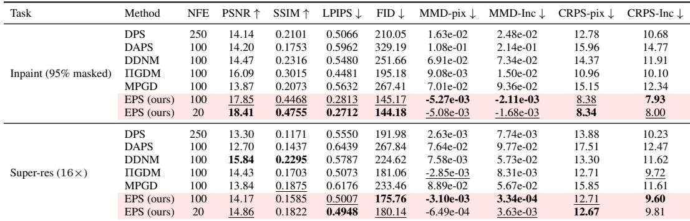

*Table 7: EPS holds up under extreme operator nullspace. Quantitative comparison on ImageNet-64 in two extreme inverse-problem regimes: 95% random inpainting (only 5% of pixels observed) and 16× super-resolution (a 4×4 low-resolution observation upsampled to 64×64). All baselines use a 1-NFE-per-step Euler/DDIM sampler; EPS uses the EDM Euler sampler. Reported NFE equals the number of sampler iterations. Best in bold, second-best underlined; EPS rows highlighted in light pink. Palette is omitted because no Palette checkpoint was trained for these regimes.*

Figure 9 shows EPS reconstructions across six independent latent seeds on three 95%-inpainting and three 16× super-resolution observations. Samples agree on the broad spatial layout dictated by the few observed pixels but diverge sharply in fine structure and unobserved content (foreground identity, background texture, occluded geometry), which is the qualitative signature of a calibrated posterior in a regime where the operator nullspace dominates.

*Figure 9: Posterior diversity under extreme operator nullspace. EPS reconstructions on ImageNet-64 across six independent latent seeds. Top three rows: 95% random inpainting (only 5% of pixels observed). Bottom three rows: 16× super-resolution (a 4×4 low-resolution observation upsampled to 64×64). Samples agree on the broad spatial layout consistent with the measurement but vary substantially in unobserved directions, illustrating that EPS produces genuinely distinct posterior samples rather than near-duplicates of a single conditional mean.*

> 💡 **Table 7 + Figure 9 批读：零空间主导时的校准信号 (Hao 批注)**: 两个极端设定（95% 掩码、16× 超分）把算子零空间推到几乎占满信号空间，先验得干大部分活。EPS-20 在两任务的感知/分布指标最好，95% inpaint 的 FID 比最强基线 ΠGDM 降约 25%、比 DPS 降约 30%。**Figure 9 是对校准最直观的定性证据**：六个独立 seed 的重建在少数观测像素决定的大布局上一致，但在未观测内容（前景身份、背景纹理、遮挡几何）上显著发散——这正是"零空间主导时校准良好的后验"应有的样子（观测方向锁定、未观测方向保持多样）。这与我们用 coverage/多样性检验校准的思路完全对齐：**好的后验应在零空间里给出真实的样本多样性，而非塌成一个均值。**

## D.9 OOD Mask-Density Experiments

We test how EPS and Palette generalize when the test-time mask density differs from training. Both checkpoints are trained on random inpainting at 70% masking and frozen; at evaluation we re-sample masks at five densities, ranging from 50% (easier than training) through 70% (in-distribution) to 90% (much harder than training). All results use NFE=100 with the EDM Euler sampler over 100 images × 10 seeds, with $\sigma_y{=}0.05$.

Table 8 reports this comparison on ImageNet-64 (top) and FFHQ-64 (bottom). On ImageNet, EPS wins on every metric at every density except 80% (near-tie). On FFHQ, EPS dominates in- and near-distribution (50%-70%) but degrades faster than Palette on PSNR/SSIM at heavily-OOD densities (80%-90%); EPS still wins on the distributional metrics (MMD-pix, CRPS) at every density. The PSNR/SSIM crossover at high mask fraction is consistent with the closed-form pivot µ⋆ extrapolating poorly when the operator shifts far from training at test time, since the precision weighting of the pivot is calibrated to a 70% mask under $\sigma_y{=}0.05$ and is mismatched when the actual mask density changes.

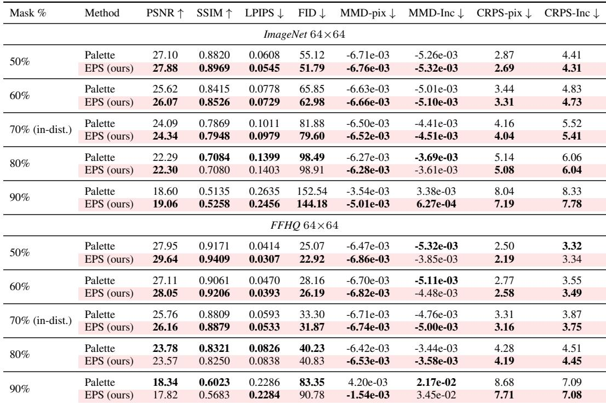

*Table 8: OOD generalization across mask density. Both checkpoints are trained on random inpainting at 70% masking and frozen; evaluation re-samples masks at five densities (50%, 60%, 70% in-distribution, 80%, 90%) on the same eval $x_0$ at $\sigma_y{=}0.05$. ImageNet-64 (top): EPS wins on every metric at every density except 80% (near-tie). FFHQ-64 (bottom): EPS dominates in- and near-distribution but degrades faster than Palette on PSNR/SSIM at heavily-OOD densities, while still winning on MMD and CRPS at every density. All numbers at NFE=100 (EDM Euler). Best per row in bold; EPS rows highlighted in light pink.*

Figure 10 shows qualitative reconstructions from EPS and Palette across the five mask densities on both datasets. The visual gap between the two methods is largest in the in-distribution regime and narrows at the extremes: at 50% masking both methods recover most of the image structure, while at 90% both methods struggle and the reconstructions diverge sharply from the ground truth.

*Figure 10: Qualitative OOD generalization across mask density. EPS and Palette reconstructions on ImageNet-64 and FFHQ-64 across five mask densities (50%, 60%, 70% in-distribution, 80%, 90%). Both checkpoints were trained on 70% masking and frozen at evaluation. EPS preserves operator-consistent structure best in- and near-distribution; degradation at heavily-OOD densities (80%, 90%) is consistent with the pivot $\mu_\star$ being calibrated to a 70% mask.*

> 💡 **Table 8 + Figure 10 批读：OOD 算子暴露闭式 pivot 的软肋 (Hao 批注)**: 这是对本课题最有警示价值的实验。训练固定 70% 掩码、冻结，测试 50%-90%。ImageNet 上 EPS 几乎全胜；但 FFHQ 上重度 OOD（80%-90%）时 EPS 的 PSNR/SSIM **退化比 Palette 快**（虽仍赢分布指标 MMD/CRPS）。作者给出的机制很关键：**pivot 的 precision 加权是按训练算子（70% 掩码、$\sigma_y=0.05$）校准的**，测试算子偏离时闭式 $\mu_\star$ 外推失配。**对盲逆问题的直接教训**：如果我们把 EPS 思路搬到联合估计 $\varphi$，pivot 用的 $A(\varphi)$ 必须用**当前推断的 $\varphi$** 而非训练时的固定算子——否则 precision 加权就错了。这恰恰说明"gauge-aware / 联合估计 $\varphi$"不是可选项，而是保证 pivot 校准的必要条件。分布指标（MMD/CRPS）比 PSNR 更 robust 于 OOD，也支持我们把校准指标放在评测核心。

## D.10 Additional 256×256 Results

Table 9 reports EPS at NFE∈ {1, 20, 100} against sampling-based and training-based baselines on ImageNet 256×256 across five inverse problems. EDM-DDPM++ architecture is used, and trained from scratch on each task (no pretrained backbone). Baseline numbers are taken directly from the DAPS paper [22]; we did not re-run them under our protocol, and distributional metrics (CRPS, MMD) are not reported because they are not available in the source paper. EPS leads on both inpainting tasks and on Gaussian deblurring, particularly on perceptual metrics (LPIPS, FID), and is competitive with DAPS on motion deblurring (taking second place on SSIM, LPIPS, and FID at NFE=20). DAPS retains an edge on 4× super-resolution. As at 64×64, the 1-NFE EPS row is consistently the strongest EPS variant on PSNR/SSIM, mirroring the high-noise posterior-mean check of Section 3.5.

*Table 9: ImageNet 256×256 results. EPS vs. sampling-based and training-based baselines on five linear inverse problems at 256×256 resolution. Baseline numbers are taken from the DAPS paper [22]. Best in bold, second-best underlined; EPS rows highlighted in light pink. † The NFE=1 row applies a single direct Tweedie evaluation $D_\theta(\mu_\star, \sigma_{\max})$, returning the conditional posterior mean rather than a posterior sample.*

Figure 11 shows qualitative reconstructions of EPS on ImageNet 256×256 across the five inverse problems, with one example observation per task. EPS recovers sharp object structure under aggressive random inpainting and box inpainting, and produces texture and edge geometry consistent with the measurement on super-resolution and deblurring at this higher resolution.

*Figure 11: Qualitative reconstructions on ImageNet-256. EPS reconstructions across the five inverse problems on ImageNet 256×256. Numbers in the bottom-right corner of each panel are per-image PSNR. EPS preserves operator-consistent structure under aggressive inpainting and produces sharp texture and edges on super-resolution and deblurring at this higher resolution.*

> 💡 **Table 9 + Figure 11 批读：256×256 从头训也成立 (Hao 批注)**: 高分辨率上（EDM-DDPM++，**每任务从头训、无预训练 backbone**）EPS 在两个 inpaint 和高斯去模糊上领先（尤其感知指标），运动去模糊与 DAPS 相当，4× 超分 DAPS 略胜。基线数字直接引自 DAPS 论文，故无 CRPS/MMD。要点：**EPS 不依赖预训练 warm-start 也能工作**（从头训验证了训练目标本身的正确性，warm-start 只是加速）。1-NFE 行仍是最强 PSNR/SSIM 变体，与 64×64 一致。

## D.11 Palette vs. EPS at Matched NFE

The one-step posterior-mean check in Section D.6 showed that a single Tweedie call recovers most of the multi-step PSNR/SSIM gain. Here we ask the matched question for Palette: does the same one-step shortcut close the gap to EPS? Concretely, we evaluate Palette $[x_t, y, t]$ and EPS $[\mu_\star, y, t]$ at NFE=1 (a single direct denoiser call at $\sigma_{\max}{=}80$, no sampler loop) and at NFE=100 (EDM Euler sampler), on both datasets and all five tasks.

Table 10 reports this comparison on FFHQ-64 (top) and ImageNet-64 (bottom). Two patterns dominate. First, at NFE=1 the two methods coincide, as predicted by Observation 4: at $\sigma_{\max}$ the noisy state carries vanishing information about $x_0$, so both the Palette input $(x_t, y)$ and the EPS input $(\mu_\star, y)$ are informationally equivalent to y alone, and both networks estimate $\mathbb{E}[x_0 | y]$; the small differences here are training noise rather than methodological difference. Second, at NFE=100 the EPS pivot becomes informative and EPS dominates Palette across distortion and distributional metrics on every task. Both 1-NFE rows trade perceptual quality for distortion: PSNR/SSIM jump sharply because the conditional mean is the MMSE-optimal estimator under squared error, but FID, LPIPS, CRPS, and MMD all degrade because no actual sample is produced.

*Table 10: Palette vs. EPS at NFE=1 and NFE=100. One-step (single Tweedie call at $\sigma_{\max}{=}80$) vs. 100-step (EDM Euler) generation for Palette $[x_t, y, t]$ and EPS $[\mu_\star, y, t]$ on FFHQ-64 (top) and ImageNet-64 (bottom). At NFE=1, the two methods receive nearly identical inputs since µ⋆ ≈ x_t at $\sigma_{\max}$; at NFE=100 the pivot becomes informative and EPS dominates across distortion and distributional metrics. Best in bold, second-best underlined; EPS rows highlighted in light pink.*

> 💡 **Table 10 批读：为什么 1-NFE 时 EPS≈Palette、100-NFE 时 EPS≫Palette (Hao 批注)**: 这张表精确验证了 Observation 4 的通用性论断。在 $\sigma_{\max}$（NFE=1）时，$x_t$ 对 $x_0$ 无信息，所以 $(x_t,y)$ 和 $(\mu_\star,y)$ 都退化成只含 $y$ 的信息 → Palette 和 EPS **几乎重合**（差异只是训练噪声）。这坐实了作者的诚实声明："1-NFE 后验均值不是 EPS 独有贡献"。而在 NFE=100 时，pivot 变得 informative，EPS 在每任务的失真和分布指标上**全面碾压** Palette——**pivot 的价值只有在多步采样中才显现**。这也提醒我们：评估后验采样器的校准必须用多步样本，1-NFE 只是 MMSE 点估计。

## D.12 Runtime Analysis

We measure single-image wall-clock sampling latency on ImageNet 64×64 at NFE=100 with batch size 1. All methods use the same EDM-ADM [17] denoiser checkpoint (edm-imagenet-64x64-cond-adm.pkl, ∼296M parameters) on a single NVIDIA B200 GPU, with class labels set to the evaluation-set ground-truth ImageNet-1k classes. Each cell in Table 11 is the mean of five independent sampling runs after two warm-up runs that amortise CUDA kernel JIT and cuDNN auto-tuning. All methods use the Euler ODE schedule (second_order=False) so NFE equals the number of sampler steps; for DAPS we set annealing_steps=20 and ode_steps=5 so total NFE matches.

The dominant cost in all methods is the U-Net forward, and for DPS and ΠGDM the U-Net backward as well. EDM (uncond.) runs the bare pretrained denoiser with no measurement-aware updates and is task-independent. DPS and ΠGDM require a backward pass per step (likelihood gradient / Jacobian-vector product), $\sim 2.2\times$ the EDM unconditional cost. DAPS runs a nested ODE rollout plus Langevin correction at each annealing step, ∼ 2.0× unconditional cost. DDNM and MPGD (∼ 1.1×) add only a closed-form nullspace or manifold projection on top of a single denoiser forward. EPS is the fastest sampler in the comparison: at batch 1 it runs $\sim 0.8\times$ the wall-clock of EDM unconditional. EPS's freshly constructed preconditioning wrapper avoids deserialisation overhead present in the pretrained EDMPrecond pickle, while the structured solve for $\mu_\star$ (FFT for deblurring; element-wise for inpainting and super-resolution) is sub-millisecond. EPS runtime is essentially task-independent: all five tasks land within ±0.04 s of the average. Palette shares EPS's architecture and per-step forward cost, so its runtime is well approximated by the EPS row. At larger batch sizes the per-image gap closes (at batch 8, EPS is only ∼ 3.5% slower than EDM unconditional), so EPS is the right pick for low-latency single-image inference and is essentially free vs. EDM unconditional in throughput terms.

*Table 11: EPS matches the bare denoiser in wall-clock cost. Per-image sampling latency (s, lower is better) on ImageNet-64 at NFE=100, batch size 1, on a single B200 GPU. Among methods that solve the inverse problem, EPS is fastest on every task and on average, at essentially the same cost as the bare EDM unconditional sampler (1.006×). Sampling-based baselines that require a backward pass (DPS, ΠGDM) are $\sim 2.3\times$ slower; nested-rollout methods (DAPS) are $\sim 2.2\times$ slower. † EDM (uncond.) is shown as a reference: it runs the bare pretrained denoiser without any measurement-aware update, so it does not actually solve the inverse problem.*

> 💡 **Table 11 批读：EPS 每步几乎等于裸去噪器 (Hao 批注)**: 运行时坐实"无梯度"的红利。EPS 每步 = 裸无条件 EDM 的 **1.006×**（pivot 结构求解亚毫秒），而 DPS/ΠGDM 因每步要反传（似然梯度/JVP）是 ~2.3×，DAPS（嵌套 ODE + Langevin）~2.2×。也就是说 EPS **同时**在质量（Table 1）、采样步数（Figure 3）、每步成本（Table 11）三个维度都占优——这三重效率优势叠起来就是摘要说的"少约一个数量级去噪器评估"。

## D.13 Posterior diversity.

Figures 12 and 13 show four EPS reconstructions of the same observation drawn with independent latent seeds, alongside the ground truth, on box inpainting and 4× super-resolution. Samples agree on observed structure while differing in the unobserved directions (skin texture, hair detail, background, occluded foreground content) - the qualitative signature of a calibrated posterior under a non-trivial operator nullspace.

*Figure 12: Posterior diversity from EPS on FFHQ-64. Four reconstructions per observation drawn with independent latent seeds, alongside the ground truth, on box inpainting and 4× super-resolution. Samples agree on observed structure while differing in unobserved directions (skin texture, hair detail, background) — the qualitative signature of a calibrated posterior under a non-trivial operator nullspace.*

*Figure 13: Posterior diversity from EPS on ImageNet-64. Same layout as Fig. 12. Diversity is concentrated in the operator nullspace: occluded foreground content varies under box inpainting, while sharp high-frequency detail varies under 4× super-resolution.*

> 💡 **Figure 12/13 批读：多样性集中在零空间 = 校准的定性签名 (Hao 批注)**: 同一观测四个独立 seed 的重建：观测方向一致、未观测方向（皮肤纹理、发丝、背景、遮挡前景）发散。作者反复强调"diversity is concentrated in the operator nullspace"——这是校准良好后验的定性签名。**对我们最直接**：这正是 coverage/SBC 想量化的东西——后验样本应该在**可辨识方向锁定、不可辨识方向按真实不确定性铺开**。EPS 提供了这种定性行为的一个（近似）无偏参考。

## D.14 Sampling Budget

Figure 14 compares EPS reconstructions at NFE=1, 20, and 100 on the same observation across all five tasks, on both ImageNet-64 (left) and FFHQ-64 (right). The NFE=1 column is the deterministic high-noise posterior-mean limit (Section 3.5), which is MMSE-optimal in pixel space and yields the highest per-image PSNR. The NFE=20 and NFE=100 columns target posterior samples and trade pointwise fidelity for distributional sharpness, in line with the perception-distortion pattern visible in Table 5.

*Figure 14: EPS reconstructions at varying sampling budgets. ImageNet-64 (left) and FFHQ-64 (right) across the five inverse problems. For each observation, columns show NFE=1, 20, and 100. The NFE=1 column is the deterministic high-noise posterior-mean limit (Section 3.5), MMSE-optimal in pixel space; NFE=20 and NFE=100 target posterior samples and trade pointwise fidelity for distributional sharpness.*

> 💡 **Figure 14 批读：一张图看懂 NFE 权衡 (Hao 批注)**: NFE=1/20/100 三列直观呈现感知-失真权衡：1-NFE 是 MMSE 后验均值（PSNR 最高但平滑），20/100-NFE 是后验样本（细节锐、分布指标好）。这与 Figure 1 的"从后验均值起、到后验样本止"闭环。实用建议：要点估计用 1-NFE，要校准/多样性用 20-NFE（性价比最优）。

## E Baseline Configurations

Table 12 reports per-task hyperparameters for the sampling-based and training-based baselines (DPS, DAPS, DDNM, ΠGDM, MPGD, Palette), including NFE, step size or guidance scale, noise schedule, projection or correction rule, and additional notes. Each baseline is tuned on a disjoint validation split, and the values reported are those used in the main and appendix tables.

*Table 12: Baseline hyperparameter configurations. Per-task hyperparameters for the sampling-based (DPS, DAPS, DDNM, ΠGDM, MPGD) and training-based (Palette) baselines. NFE is the number of denoiser forward passes per image (DAPS NFE=annealing×ode Euler steps). All samplers use the EDM VE noise schedule with $\sigma_{\max}{=}80, \sigma_{\min}{=}0.002, \rho{=}7$ unless noted. Observation noise is $\sigma_y{=}0.05$ for every cell. Identical settings are used on ImageNet-64 and FFHQ-64; only the underlying denoiser changes.*

> 💡 **Table 12 批读：基线调参是公平的 (Hao 批注)**: 每个基线在**独立验证集**上调参，主表用的就是这些值——排除了"基线没调好"的质疑。所有采样器同 EDM VE 调度、同 $\sigma_y=0.05$，两数据集同设置只换 backbone。这套严谨的基线配置是 Table 1 结论可信的前提。

## F Metric Definitions

CRPS. For a scalar target z and a predictive distribution with CDF F, $\text{CRPS}(F, z) = \int_{\mathbb{R}} (F(u) - \mathbf{1}\{u \ge z\})^2 \mathrm{d}u$. For our multivariate settings we report the average per-coordinate CRPS, in pixel space (CRPS-pixel) and in the Inception feature space used for FID (CRPS-inception), each averaged over the evaluation images and over the posterior samples drawn for each observation [44].

MMD. With a Gaussian kernel $k(u, v) = \exp(-\| u - v \|^2 / (2 \ell^2))$, we estimate $\text{MMD}^2(P, Q)$ between the EPS sample distribution P and the empirical distribution Q of the evaluation ground truths using the unbiased U-statistic of Gretton et al. [45]. We report MMD-pixel (kernel in pixel space) and MMD-inception (kernel in Inception feature space). The bandwidth ℓ is chosen via the median heuristic on the combined sample.

> 💡 **F 批读：两个分布校准指标怎么读 (Hao 批注)**: 这两个指标是本文相对普通 restoration 论文的差异化，也是我们校准课题的核心工具：
> - **CRPS**：对每个坐标算预测 CDF 与真值指示函数的平方距离积分，在 pixel 空间和 Inception 特征空间各报一次，对图像和每观测的多个后验样本平均。CRPS 越低说明**预测分布越贴合真值**，是逐点概率校准的严格打分规则（proper scoring rule）。
> - **MMD**：用高斯核（median heuristic 定带宽）算 EPS 样本分布 $P$ 与真值经验分布 $Q$ 的最大均值差异，无偏 U-统计量估计，pixel/Inception 两空间。MMD 衡量**整体分布距离**。
>
> **注意**：CRPS 需要每观测多个后验样本才有意义（所以 1-NFE 点估计的 CRPS 会退化）。这两个指标 + SBC/coverage 正是我们检验 gauge-aware 联合后验采样器校准的量化武器。
