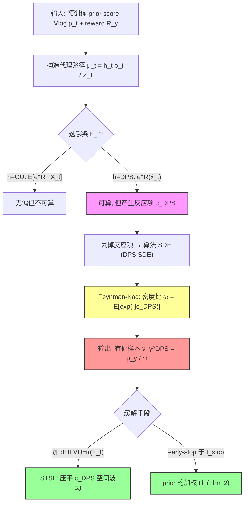

# Diffusion-Based Posterior Sampling: A Feynman-Kac Analysis of Bias and Stability

**作者**: Matias G. Delgadino, Sebastien Motsch, Advait Parulekar, William Porteous, Sanjay Shakkottai (UT Austin / ASU)
**会议**: Preprint | **年份**: 2026
**链接**: [arXiv:2605.06538](https://arxiv.org/abs/2605.06538) · [Connected Papers](https://www.connectedpapers.com/main/2605.06538)

**本课题定位（ROLE）**: 采样器偏差理论核心。用 Feynman–Kac 表示证明——**即使 prior score 精确，扩散后验采样（DPS 类）仍是有偏的**，并显式刻画偏差从哪一步进入、为什么漏模态。这是本项目"用扩散模型 ≠ 得到贝叶斯后验"的理论依据。

---

## 一句话总结

扩散后验采样把"含反应项（reaction term）的代理路径 PDE"简化成"无反应项的算法 SDE"来换取可计算性，而**丢掉的这个反应项 $c_{\text{DPS}}$ 就是全部偏差**；Feynman–Kac 公式把它变成一个显式的路径期望权重 $\omega(x)$，揭示 DPS 在"数据流形宽 × reward 敏感"的方向系统性漏模态，并把 STSL 减偏与 early-stopping 都统一进同一框架。

## 核心贡献

1. **DPS 的精确偏差公式（Theorem 1）**：真后验 $\mu_y(x)=\omega(x)\,\nu_y^{DPS}(x)$，权重 $\omega$ 有 backward/forward 两种 Feynman–Kac 表示，仅需 score oracle 及其 Jacobian 即可（原则上）计算；用 $\omega$ 重要性加权可**精确**纠回真后验。
2. **反应项的谱结构**：$\tilde c_{DPS}=\frac{1}{(e^t-e^{-t})^2}\sum_i\lambda_i^2\gamma_R^i$，偏差在条件协方差本征值 $\lambda_i$（流形不确定性）大、且 reward 沿同方向敏感（$\gamma_R^i$ 大）处被放大——这是漏模态的定量机制。
3. **STSL 的理论解释（Section 4）**：把经验成功的 STSL 重释为辅助势 drift $U=\text{tr}(\Sigma_t)$，将轨迹推向低不确定区，压平 $c_{DPS}$ 的空间波动。
4. **低温不稳定与 early-stopping（Theorem 2）**：证明标准 DPS 在约束流形附近**必然**违反 forward-Euler 稳定判据（切向周期-2 极限环），并首次把 early guidance-stopping 刻画为 prior 的显式加权 tilt。

## 📖 批读导航

| Section | 内容 |
|---------|------|
| [00 - Abstract](sections/00-abstract.md) | 摘要 + 三大结论 + 对盲联合采样的延伸 |
| [01 - Introduction](sections/01-introduction.md) | DPS 近似的偏差种子、两个开放问题、三点贡献 |
| [02 - Background & Related Work](sections/02-background.md) | OU/Anderson、后验采样偏差入口、Feynman–Kac 引擎（Eq 1-6） |
| [03 - Surrogate Path & Bias of DPS](sections/03-surrogate-path-bias.md) | **核心**：代理路径、$c_{DPS}$（Eq 8）、Theorem 1、Fig 1/2 漏模态 |
| [04 - Bias Reduction](sections/04-bias-reduction.md) | drift↔reaction 恒等式、STSL = $\text{tr}(\Sigma_t)$、Remark 1 |
| [05 - Numerical Instabilities](sections/05-numerical-instabilities.md) | forward-Euler 极限环、early-stopping、Theorem 2、Fig 3 |
| [06 - Appendix A–H + References](sections/06-appendix.md) | Lemma 2（FK 证明）、Tweedie/零噪声几何、Thm 1/2 完整证明、DDPM 换算、不稳定推导、MNIST 证据（Fig 4/5） |

## 关键数字

| 指标 | 数值 |
|------|------|
| DPS reaction 前缀 | $\frac{1}{(e^t-e^{-t})^2}$，低温 $\sim1/4t^2$ 爆炸 |
| 退火 schedule $\eta_t$ | $\approx\frac{10^5}{1+300\sqrt t}$，$t\to0$ 约 $10^5$ |
| guidance 超参 $\alpha$ | $[0.2,1]$ |
| 极限环周期 | 2（$\delta_t\approx-\delta_{t-1}$，$\alpha_t\to-1$） |
| 极限环振幅 | $\sim\sigma_{max}(\nabla A P_{T\mathcal{M}})^2$，切于流形 |
| Fig 2 权重估计 | 20 条轨迹，2D 高斯混合 toy |
| MNIST 实验 | 单张 H100，几分钟 |

## 数据流：输入 → 中间表示 → 输出

## 优缺点与还能做什么

### 优点
- **理论范式转向**：不追 vacuous 的 KL 上界，改用 Feynman–Kac 逐点追踪 Radon–Nikodym 导数，回答"偏在哪、偏向谁"而非"偏多大"。
- **统一框架**：一套代理路径 + 反应项语言同时解释 DPS 偏差、STSL 减偏、early-stopping 三件事，互相不矛盾。
- **可操作纠偏**：$\omega$ 只需 score + Jacobian，重要性加权原则上精确纠回真后验。
- **理论-实验闭合**：Fig 2（漏模态）、Fig 4/5（极限环 $\alpha_t\to-1$）分别验证偏差与不稳定两条主线。

### 局限 / 风险
- **$\omega$ 估计昂贵**：Fig 2 仅 2D toy 用 20 条轨迹；高维图像上路径期望的蒙特卡洛方差与代价未验证。
- **理想假设**：全文假设 prior score 精确（Appendix B.1 把 score 误差清零），真实场景 score 有误差，联合偏差会叠加。
- **正则性假设**：Lemma 2 需 Hölder + 二次增长，真实图像 score（流形支撑、非光滑）是否满足存疑。
- **只分析 image-conditioning**：未涉及盲逆问题中算子参数 $\varphi$、噪声 $\sigma$ 的联合条件步。

### 还能做什么（对本项目 gauge-aware 联合后验采样与校准）
- **联合偏差分解**：把 reward 换成 $R_{y,\varphi,\sigma}$，$c_{DPS}$ 会多出 $\varphi/\sigma$-条件的交叉反应项——图像条件步近似 + 算子条件步误差如何在 Feynman–Kac 路径期望里叠加/相乘，是可直接推导的延伸。
- **校准诊断量**：用 forward 表示（Eq 11）算 $1/\omega$ 空间图谱，预测哪些维度会 over/under-sampling，指导 SBC/coverage 的分辨重点。
- **减偏与覆盖率的张力**：STSL 减位置偏差但压缩后验方差（"reduced output uncertainty"），需用 CRPS/coverage 而非点估计误差检验——这是我们校准协议要专门监控的。
- **超参入协议**：early-stop 的 $t_*$ 直接决定目标分布（Thm 2），应作为校准报告的显式自由度扫描。

## 📊 Citation Landscape

> ⚠️ **数据来源说明**: Semantic Scholar API 对 `ArXiv:2605.06538` 返回 429（rate-limited），且该 arXiv id 属 2026 年新文，S2 大概率尚未收录。因此 TLDR/被引统计**跳过 API**，以下引用分组与推荐**改用论文自带 References 手工归类**（按主题 + 影响力），并注明为人工整理。

**手工 TLDR**: 用经典 Feynman–Kac 公式刻画扩散后验采样器（DPS/STSL）相对真后验的逐点偏差与低温数值不稳定，把偏差写成耦合"条件协方差 × reward 曲率"的路径期望权重，统一解释减偏与 early-stopping。

**引用统计（人工）**: References ≈ 38 篇 | 被引 / influential citations: S2 未收录，暂无。

### 参考文献分组（每组 Top 5，按主题与影响力人工排序）

**A. 扩散/score-based 生成基础**
1. Ho, Jain, Abbeel. Denoising diffusion probabilistic models (DDPM), 2020.
2. Song et al. Score-based generative modeling through SDEs, ICLR 2021.
3. Song & Ermon. Generative modeling by estimating gradients of the data distribution, 2020.
4. Sohl-Dickstein et al. Deep unsupervised learning using nonequilibrium thermodynamics, 2015.
5. Anderson. Reverse-time diffusion equation models, 1982.

**B. 扩散后验采样 / 逆问题（本文直接对话对象）**
1. Chung et al. Diffusion posterior sampling for general (noisy) inverse problems (DPS), ICLR 2023 / 2024.
2. Rout et al. RB-modulation: training-free personalization via stochastic optimal control (STSL), ICLR 2025.
3. Song et al. Pseudoinverse-guided diffusion models for inverse problems, ICLR 2023.
4. Kawar et al. Denoising diffusion restoration models (DDRM), NeurIPS 2022.
5. Daras et al. A survey on diffusion models for inverse problems, 2024.

**C. 采样偏差/复杂度理论**
1. Gupta et al. Diffusion posterior sampling is computationally intractable, ICML 2024.
2. Xu & Chi. Provably robust score-based DPS for plug-and-play reconstruction, 2024.
3. Parulekar et al. Efficient approximate posterior sampling with annealed Langevin MC, 2025.
4. Moitra, Risteski, Rohatgi. Steering diffusion models with quadratic rewards, 2026.
5. Chen et al. Sampling is as easy as learning the score, 2023.

**D. Drift-control / guidance 的随机分析视角（本文补充对象）**
1. Ren et al. DriftLite: lightweight drift control for inference-time scaling, ICLR 2026.
2. Guo, Tang, Xu. Conditional diffusion guidance under hard constraint: a stochastic analysis approach, 2026.
3. Bruna & Han. Posterior sampling with denoising oracles via tilted transport, 2024.
4. Anil et al. Fine-tuning diffusion models via intermediate distribution shaping, 2026.
5. Huang et al. How to guide your flow: few-step alignment via flow map reward guidance, 2026.

**E. 数学工具（FK / Tweedie / 大偏差）**
1. Karatzas & Shreve. Brownian motion and stochastic calculus, 1991.
2. Robbins. An empirical Bayes approach to statistics (Tweedie), 1956.
3. Ladyženskaja et al. Linear and quasi-linear equations of parabolic type, 1968.
4. Varadhan. Asymptotic probabilities and differential equations, 1966.
5. Vempala & Wibisono. Rapid convergence of unadjusted Langevin (isoperimetry), 2022.

### 推荐相关论文（10 篇，人工挑选，供延伸阅读）

1. Chung et al., *Improving diffusion models for inverse problems using manifold constraints*, NeurIPS 2022 — DPS 的 manifold-constrained 变体。
2. Rout et al., *Beyond first-order Tweedie: solving inverse problems using latent diffusion*, 2023 — 二阶 Tweedie 修正。
3. Boys et al., *Tweedie moment projected diffusions for inverse problems*, 2024 — 矩投影减偏。
4. Dou & Song, *DPS: a filtering perspective*, ICLR 2024 — SMC/滤波重加权纠偏。
5. Wu et al., *Practical and asymptotically exact conditional sampling in diffusion models*, 2024 — 渐近精确条件采样。
6. Moufad et al., *Variational diffusion posterior sampling with midpoint guidance*, ICLR 2025 — 变分中点 guidance。
7. Rout et al., *Solving inverse problems provably via posterior sampling with latent diffusion*, NeurIPS 2023 — 带保证的 latent DPS。
8. Ren et al., *DriftLite*, ICLR 2026 — 近似最优 drift $U^*$ 的线性网络（Remark 1）。
9. Guo, Tang, Xu, *Conditional diffusion guidance under hard constraint*, 2026 — 硬约束下的非线性 drift-control。
10. Gupta et al., *Diffusion posterior sampling is computationally intractable*, ICML 2024 — "偏差不可避免"的复杂度基础。

## 阅读 Q&A 记录

- **Q: 偏差到底从哪一步进入？**
  A: 从"把含 reaction term 的代理路径 PDE（DPS Surrogate PDE）简化成无 reaction 的算法 SDE（DPS SDE）"这一步。丢掉的 $-c_{DPS}$ 通过 Feynman–Kac 变成密度比 $\omega=\mathbb{E}[\exp(-\int c_{DPS})]$（Section 3 / Appendix D Lemma 5）。

- **Q: Feynman–Kac 表示如何刻画偏差？**
  A: 两条路径（surrogate vs algorithm）只差一个 reaction 项，则其密度比满足抛物 PDE（Lemma 2 Eq 19），该 PDE 的解 = 沿特征线 SDE 的 $\exp(-\int c)$ 加权期望（Eq 20）。代入 $c=c_{DPS}$ 即得 Theorem 1 的 $\omega$，有 backward（沿 DPS-SDE，Eq 10）与 forward（沿 OU，Eq 11）两种等价写法。

- **Q: 为什么会漏模态？**
  A: $\tilde c_{DPS}\propto\sum_i\lambda_i^2\gamma_R^i$（Eq 12）在"条件协方差本征值 $\lambda_i$ 大（数据流形宽/高不确定）× reward 沿该方向敏感（$\gamma_R^i$ 大）"处被放大；由 $1/\omega=\mathbb{E}[\exp(+\int c_{DPS})]$，$c_{DPS}$ 主体为负使这些方向 $\omega$ 变大 → 欠采样。Fig 2(d) 显示 2D 高斯混合里 $x_1$ 极端模态几乎消失。

- **Q: 即使 prior score 精确也有偏吗？**
  A: 是。Appendix B.1 已把 score 近似误差清零假设掉，偏差纯来自 tilt 那一步（用点估计 $\hat x_t$ 代替 $X_0$ 的整个条件分布，Jensen gap ∝ 方差 × 曲率，Lemma 4 关键消去后只剩二阶项）。且 Gupta et al. 2024 证明无偏后验采样最坏情况多项式时间不可算——**可算与无偏不可兼得**。

- **Q: STSL 为什么有效？代价是什么？**
  A: STSL 取辅助势 $U=\text{tr}(\Sigma_t)$，drift 把轨迹推向低不确定（$\sum\lambda_i$ 小）区，压平 $c_{DPS}$ 的空间波动（Section 4）。代价：output uncertainty 减小——可能压窄后验、降低 coverage，需用 CRPS/coverage 检验。

- **Q: early-stopping 改变了什么分布？**
  A: Theorem 2——输出是 prior $\rho_*$ 的显式加权 tilt：$(0,t_{stop})$ 段积累常规 DPS 偏差权重 $w_{t_*}$，$[t_{stop},T)$ 段用无偏 prior 去噪收尾。$t_*$ 直接决定目标分布，是校准必须报告的超参。

- **Q: 低温不稳定的根源？能治吗？**
  A: forward-Euler 对 unsquared 残差 $\|A(x)-y\|_2$ 的标准病态：梯度在约束处不消失只归一化，退火 $\eta_t=1/\Delta t$ 抵消步长，稳定判据 $\sigma_{max}(AP_{TM})^2\le2\|AY-y\|_2$（Eq 66）必被违反 → 切向周期-2 极限环（Fig 5 $\alpha_t\to-1$）。**隐式积分 bias 项即可根治**（Appendix G 末句，Rout 2025）。
