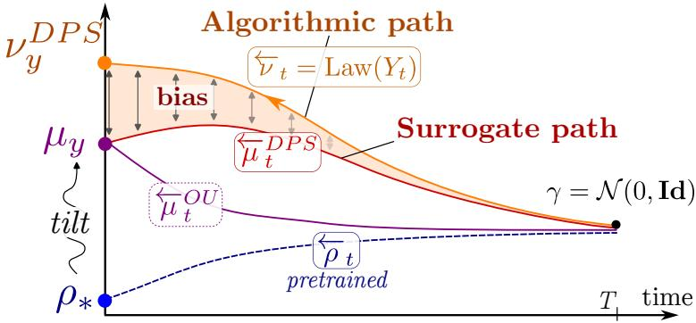
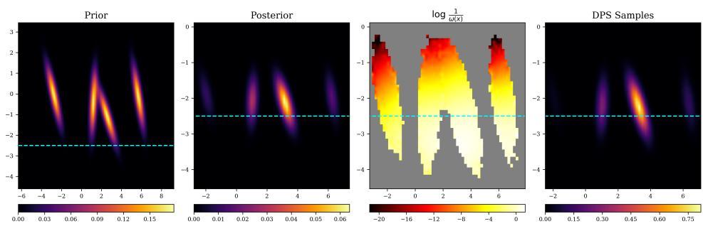
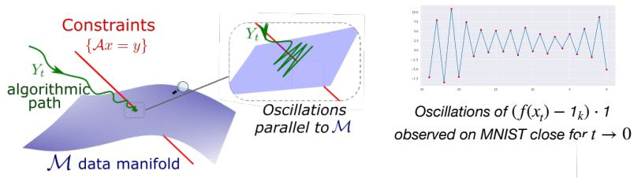
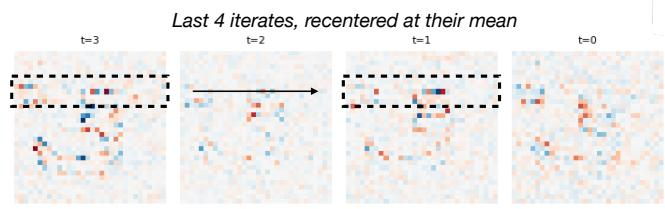
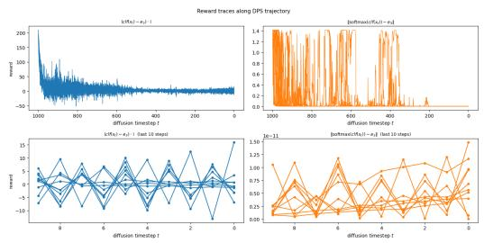
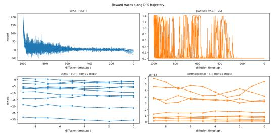
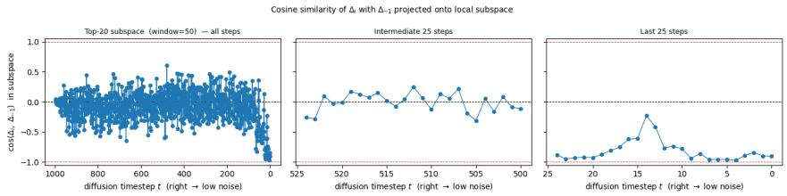
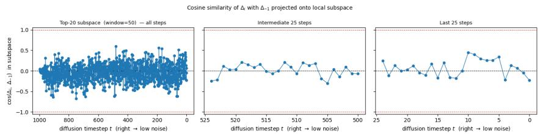

# Difusion-Based Posterior Sampling: A Feynman-Kac Analysis of Bias and Stability

Matias G. Delgadino∗ Sebastien Motsch Advait Parulekar†

William Porteous∗

Sanjay Shakkottai†

## Abstract

Difusion-based posterior samplers use pretrained difusion priors to sample from measurement- or reward-conditioned posteriors, and are widely used for inverse problems. Yet their theoretical behavior remains poorly understood: even with exact prior scores, their outputs are biased, and in low-temperature regimes their discretizations can become unstable. We characterize this bias by introducing a tractable surrogate path connecting the true posterior to a standard Gaussian and comparing it to the sampler’s path. Their density ratio satisfies a parabolic PDE whose reaction term measures the accumulated bias. A Feynman-Kac representation then expresses the Radon-Nikodym correction as an explicit path expectation, identifying which posterior regions are over- or under-sampled.

We apply this framework to DPS and STSL, a related sampler. For DPS, the correction is an Ornstein-Uhlenbeck path expectation coupling the data conditional covariance with the reward curvature, revealing where DPS overor under-samples. Next, we reinterpret STSL as an auxiliary drift that steers trajectories toward low-uncertainty regions, flattening the spatially varying part of the DPS reaction term. Finally, we characterize early guidancestopping, a common mitigation for low-temperature instabilities caused by forward-Euler integration of the vector field. Together, these results clarify sampler bias, explain existing correctives, and guide stable variant designs.

## 1 Introduction

Difusion and score-based generative models [Sohl-Dickstein et al., 2015, Ho et al., 2020, Song and Ermon, 2020, Song et al., 2021] have become the workhorse of modern generative modeling, powering text-to-image systems [Rombach et al., 2022, Ramesh et al., 2021, Saharia et al., 2022, Dhariwal and Nichol, 2021] and an expanding range of scientific and medica inverse problems [Song et al., 2022]. Their flexibility hinges on a single learned object (the score ∇ log ρ of the noised data distribution) which can be repurposed across downstream tasks without retraining.

A canonical such task is sampling from a posterior of the form $\mu _ { y } ( x ) \propto e ^ { R _ { y } ( x ) } \rho _ { * } ( x )$ , encompassing both classical inverse problems $y = A ( x )$ +ϵ and reward-tilted generation [Daras et al., 2024]. Even granting access to a perfect score oracle, posterior sampling is computationally intractable in the worst case [Gupta et al., 2024], so practical algorithms rely on heuristic guidance that approximates the time-dependent posterior score. An early and influential such heuristic is Difusion Posterior Sampling (DPS) [Chung et al., 2023]: it replaces the intractable conditional score $\nabla _ { x _ { t } } \log p ( y \mid x _ { t } )$ by the gradient of the reward evaluated at the Tweedie posterior mean $\hat { x } _ { 0 } ( x _ { t } ) \stackrel { \cdot } { = } \mathbb { E } [ X _ { 0 } \mid X _ { t } = x _ { t } ]$ [Robbins, 1956], yielding a plug-and-play guidance compatible with any pretrained score network. Its simplicity has made DPS the de-facto baseline for inverse problems and inspired a line of research targeting its known weaknesses: manifold-constrained gradients [Chung et al., 2022], denoising restoration [Kawar et al., 2022], pseudoinverse-guided difusion [Song et al., 2023], latent-space extensions [Rout et al., 2023b], second-order Tweedie corrections [Rout et al., 2023a, Boys et al., 2024], proximal approaches to decrease the gradient computation burden [Rout et al., 2025], filtering and SMC-based reweightings [Dou and Song, 2024, Wu et al., 2024, MOUFAD et al., 2025], and recent drift-control schemes [Ren et al., 2026, Guo et al., 2026, Anil et al., 2026].

Yet despite this flurry of activity, two basic questions remain open. First, the DPS approximation is biased even for Gaussian-mixture priors with quadratic rewards; but which samples does this bias over- or under-represent, and why do correctives like STSL improve performance? Existing analyses establish convergence under restrictive assumptions on the prior or measurement operator [Xu and Chi, 2024, Parulekar et al., 2025, Moitra et al., 2026] or treat the algorithm as a black box, leaving its preferred classes unexplained. Second, in the low-temperature regime needed for hard measurement constraints in image inverse problems, standard DPS is numerically unstable. Practitioners routinely fall back on early guidance-stopping and trajectory-dependent step sizes, but the efect of these heuristics on the sampled distribution has never been quantified.

Contributions. We close both gaps with a unified analysis based on the classical Feynman-Kac formula [Karatzas and Shreve, 1991], complementing recent stochastic-analytic perspectives on guidance [Bruna and Han, 2024, Ren et al., 2026, Guo et al., 2026].

(i) An exact bias formula for DPS. In Section 3, we derive a pointwise Radon–Nikodym weight ω(x) relating the DPS-induced distribution to the true posterior. Using trajectory reversal, this weight can be written as an expectation over Ornstein–Uhlenbeck paths. The spatially varying part of the reaction term cDPS captures the alignment between conditional covariance and reward curvature, identifying where DPS over- or under-samples.

(ii) STSL-type bias reduction. We identify the spectral structure of the DPS bias: it is amplified where the data manifold has high conditional uncertainty along rewardsensitive directions. This motivates an auxiliary potential drift ∇U that steers trajectories toward lower-uncertainty regions and flattens the spatially varying part of the DPS reaction term. The trace-of-covariance choice $U ( t , x ) = \mathrm { t r } ( \hat { \Sigma } _ { t } ( x ) )$ recovers the empirically successful STSL correction [Rout et al., 2025] and connects naturally to recent neural drift-control approaches [Ren et al., 2026, Guo et al., 2026].

(iii) Quantifying low-temperature instability and early stopping. Finally, in Section 5 we show that the standard implementation of DPS systematically violates the stability condition of the forward-Euler of the bias vector field, leading to oscillations. Practitioners have implemented early-guidance-stoppin $\mathrm { { l g } ^ { 2 } }$ as a way to mitigate them. We are the first to characterize the early-guidance-stopping heuristic as a weighted version of the prior.

## 2 Background and Related Work

Score Based Generative Models. We consider the problem of sampling from a distribution whose density is given by $\rho _ { * } ( x )$ . Score based generative models use a trained score network $s _ { \theta _ { * } } ( x , t ) \approx \sigma _ { t } ^ { 2 } \nabla \log p _ { t } ( x ) \dot { + } x$ to approximate the denoising process

$$
d X _ { t } = ( X _ { t } + 2 \nabla \log \rho _ { t } ( X _ { t } ) ) \ d t + \sqrt { 2 } \ d B _ { t }\tag{1}
$$

The key to implementing this is that the score network $s \theta _ { * } \left( x , t \right)$ can be trained from samples $X \sim p { \mathrm { ~ a s } } \colon \theta _ { * } = \operatorname { a r g m i n } _ { \theta } \mathbb { E } _ { X , \eta } \left[ \left\| X - s _ { \theta } ( e ^ { - t } X + { \sqrt { 1 - e ^ { - 2 t } \eta } } , t ) \right\| ^ { 2 } \right] .$

Throughout, we use a subscript t to denote a noised distribution, so $p _ { t } : = e ^ { d t } p ( e ^ { t } x ) * \mathcal { N } ( 0 , 1 -$ $e ^ { - 2 t } )$ is the marginal of the standard Ornstein-Uhlenbeck (OU) noising process

$$
d X _ { t } = - X _ { t } d t + \sqrt { 2 } d B _ { t } , \qquad X _ { 0 } \sim \rho _ { * } ,\tag{2}
$$

which interpolates between $\rho _ { * }$ at $t = 0$ and the standard Gaussian $\gamma = \mathcal { N } ( 0 , I )$ as $t \to \infty$

Equation (1) is the Anderson reversal of Equation (2) [Anderson, 1982a], and sampling via this reverse process runs in polynomial time [Rombach et al., 2022, Song and Ermon, 2020, Ramesh et al., 2021, Saharia et al., 2022], provided the score network has been trained in advance on samples from the target distribution. This compares favorably to classical approaches such as Langevin dynamics [Vempala and Wibisono, 2022], whose convergence rate is instance-dependent and can be arbitrarily slow, see Section B.1.

Posterior Sampling. A natural application of score-based models is to inverse problems and posterior sampling. The score network characterizes a prior $\rho _ { * }$ , and at test time one tilts the samples by a log-likelihood $R _ { y } ( x )$ to target the posterior $\mu _ { y } : = e ^ { R _ { y } } \rho _ { * } / Z$ . The main challenge is that the posterior score $\nabla \log ( \mu _ { y } ) _ { t }$ cannot be easily computed from ∇ log $\mathit { p _ { t } . } ^ { 3 }$ A range of approximate algorithms have been proposed to circumvent this. A central theme is the use of the prior scores ∇ log $p _ { t }$ through Tweedie’s formula to obtain realistic-looking samples even when posterior sampling. Specifically, E $\mathsf { \xi } _ { \mathsf { \xi } } [ X _ { 0 } \mid X _ { t } = x _ { t } ]$ is used4 as a computationally tractable proxy for the initial condition $X _ { 0 } ~ ( \mathrm { i . e . }$ , the value that would result if the reverse difusion were run to completion starting from $X _ { t } = x _ { t } )$ and is fed into the reward model $R _ { y } ( \cdot )$ when modifying the drift at test time, see Section B.2. Although the resulting samples are not formally drawn from $\mu _ { y }$ , this heuristic performs well in practice.

Feynman-Kac formulas. The sampling literature often focuses on error bounds for approximate sampling algorithms [Lee et al., 2023, Chen et al., 2023, Vempala and Wibisono, 2022], see Section B.1. These are instantiated as upper bounds on the $\mathrm { K \bar { L } / T V / \chi ^ { 2 } }$ distance between the distribution of the sampling algorithm and the ground truth, and under favorable circumstances can be shown to be polynomially or exponentially small in the parameters of the instance. In posterior sampling, such an error is known to be large As such, a KL bound is often vacuous, unless it is accompanied by strong assumptions about the instance. Rather than focusing on bounding this error, we apply machinery that allows us to explicitly track the Radon-Nikodym derivative of approximate posterior sampling algorithm with respect to the true posterior.

In particular, we will exploit the Feynman-Kac representation. Consider two time-dependent densities evolving under possibly diferent transport and reaction fields:

$$
\left\{ \begin{array} { l } { \displaystyle \partial _ { t } \pi _ { t } = - \nabla \cdot \left( v _ { t } \pi _ { t } \right) + \Delta \pi _ { t } + f _ { t } \pi _ { t } } \\ { \displaystyle \partial _ { t } \pi _ { t } ^ { \prime } = \underbrace { - \nabla \cdot \left( v _ { t } ^ { \prime } \pi _ { t } ^ { \prime } \right) } _ { \mathrm { t r a n s p o r t } } + \underbrace { \Delta \pi _ { t } ^ { \prime } } _ { \mathrm { d i f f u s i o n } } + \underbrace { f _ { t } ^ { \prime } \pi _ { t } ^ { \prime } } _ { \mathrm { r e a c t i o n } } } \end{array} \right.\tag{3}
$$

PDEs containing only the transport and difusion terms are Fokker-Planck equations, and their solutions can be represented as the marginal densities of an SDE with corresponding drift and difusion. The reaction term $f _ { t } \pi _ { t }$ introduces a path-dependent weighting. In the special case $f _ { t } = - \kappa _ { t }$ with $ \kappa _ { t } \geq 0 ,$ , this corresponds to killing, or early termination, of the SDE at rate $\kappa _ { t }$ . When $f _ { t }$ is positive, the reaction term may instead be interpreted as spawning, birth, or branching at rate $f _ { t } .$ Thus the resulting solution is generally not a probability density: it is an unnormalized measure, whose total mass evolves according to the cumulative efect of killing and spawning. After normalization, it gives the density of the corresponding weighted process at the terminal time. We can write the PDE for the ratio of the marginals $g _ { t } : = \pi _ { t } ^ { \prime } / \pi _ { t }$ as

$$
\partial _ { t } g _ { t } = \Delta g _ { t } + \boldsymbol { b } _ { t } \cdot \nabla g _ { t } - c _ { t } \boldsymbol { g } _ { t } ,\tag{4}
$$

for an appropriate choice of $b _ { t } , c _ { t }$ . Letting $( Z _ { s } ) _ { s \in [ 0 , t ] }$ be the difusion process associated to the stochastic characteristics

$$
d Z _ { s } = b _ { s } ( Z _ { s } ) d s + \sqrt { 2 } d W _ { s } ,\tag{5}
$$

the Feynman-Kac representation of (4) reads

$$
g _ { t } ( x ) = \mathbb { E } \biggl [ g _ { 0 } ( Z _ { t } ) \exp \biggl ( - \int _ { 0 } ^ { t } c _ { t - s } ( Z _ { s } ) d s \biggr ) \biggm | Z _ { 0 } = x \biggr ] ,\tag{6}
$$

Please see Appendix A for some elaboration of these techniques.

## 3 Surrogate path and the Bias of DPS

This section develops a general surrogate-path framework for analyzing difusion-based posterior samplers. Given a reward $R _ { y } : \mathbb { R } ^ { \dot { d } }  \mathbb { R }$ our goal is to sample from the posterior that arises as an exponential tilt of the prior: $\begin{array} { r } { \mu _ { y } = \frac { e ^ { R _ { y } } \rho _ { * } } { Z } } \end{array}$ , where $Z \in \mathbb { R }$ is a normalization constant. Our starting point is to create a surrogate path $\overrightarrow { \mu } _ { t } : [ 0 , \infty )  \mathcal { P } ( \mathbb { R } ^ { d } )$ , that interpolates $\mu _ { y }$ with the standard Gaussian. This path is designed such that we can track the Radon-Nikodym derivative between the marginals of this path, and the marginals of the sampler using the Feynman-Kac machinery. As we will see, the algorithm can often be fruitfully instantiated as the SDE that results from dropping the reaction term from the PDE describing the evolution of the surrogate path.

A natural (and almost exhaustive) family of paths is given by $\begin{array} { r } { t \mapsto \vec { \mu } _ { t } : = \frac { h _ { t } \rho _ { t } } { Z _ { t } } } \end{array}$ , where the function $h . : [ 0 , \infty ) \times \mathbb { R } ^ { d } \to$ R only needs to satisfy $h _ { 0 } = e ^ { R _ { y } }$ and $h _ { \infty } \equiv C$ to match the end points of the interpolation. We first describe the evolution for the surrogate path $t \mapsto \overleftarrow { \mu } _ { t } .$

Lemma 1 (Informal, see Lemma 3). For any time horizon $T _ { i }$ , the reverse trajectory $\scriptstyle { \vec { \mu } } _ { T - t }$ satisfies

$$
\left\{ \begin{array} { l l } { \partial _ { t } \overleftarrow { \mu } _ { t } = - \nabla \cdot ( x \overleftarrow { \mu } _ { t } ) - 2 \nabla \cdot ( \nabla \log \overrightarrow { \mu } _ { T - t } \overleftarrow { \mu } _ { t } ) + \Delta \overleftarrow { \mu } _ { t } - c [ h _ { T - t } , \overrightarrow { \mu } _ { T - t } ] \overleftarrow { \mu } _ { t } } \\ { \overleftarrow { \mu } _ { 0 } = \overrightarrow { \mu } _ { T } } \end{array} \right.
$$

where $c [ h _ { t } , \rho _ { t } ]$ is an appropriate scalar field that depends on noised prior $\vec { \rho } _ { t }$ and the specific choice $o f h _ { t }$

Because we have access to a score network $\boldsymbol { s } _ { \boldsymbol { \theta } } ( \boldsymbol { x } , t ) = \boldsymbol { \nabla }$ log $\rho _ { t } ( x )$ , fixing a specific surrogate trajectory $\smash { \vec { \mu } _ { t } }$ , or equivalently a function $h _ { t }$ , we have direct access to the score ∇ log $\vec { \mu } _ { t } =$ ∇ log $h _ { t } + \nabla$ log $\vec { \rho } _ { t }$ . The algorithm path we consider does not contain a reaction term and solves directly

$$
\left\{ \begin{array} { l l } { \partial _ { t } \overleftarrow { \nu } _ { t } = - \nabla \cdot ( x \overleftarrow { \nu } _ { t } ) - 2 \nabla \cdot ( \nabla \log \overrightarrow { \mu } _ { T - t } \overleftarrow { \nu } _ { t } ) + \Delta \nu _ { t } } \\ { \qquad \overleftarrow { \nu } _ { 0 } = N ( 0 , I ) . } \end{array} \right.\tag{Algorithm Path}
$$

The solution $\left\{ \overline { { \nu } } _ { t } = L a w ( Y _ { t } ) \right.$ is obtained as the law of the associated SDE

$$
\begin{array} { r } { \left\{ \begin{array} { l } { d Y _ { t } = Y _ { t } + 2 \nabla \log \overrightarrow { \mu } _ { T - t } ( Y _ { t } ) + \sqrt { 2 } d B _ { t } } \\ { Y _ { 0 } \sim \mathcal { N } ( 0 , I ) . } \end{array} \right. } \end{array}\tag{Algorithm SDE}
$$

The diference between (Surrogate Path) and (Algorithm Path) is merely the presence/absence of the reaction term. Using the Feymann-Kac formula (6) we can express their ratio as weighted expectation over the paths (Algorithm SDE):

$$
\frac { \mu _ { T } ( x ) } { \nu _ { T } ( x ) } \approx \mathbb { E } _ { Y \sim ( \mathrm { A l g o r i t h m } \ \mathrm { S D E } ) } \left[ \exp \left( - \int _ { 0 } ^ { T } c [ h _ { T - t } , \vec { \rho } _ { T - t } ] ( Y _ { t } ) \ d t \right) \Big | Y _ { T } = x \right] ,
$$

and characterizes how the reaction term creates a mismatch between the output of the algorithm $L a w ( Y _ { T } )$ and the true posterior $\mu _ { y } .$ . Note that due to this modification in (Algorithm Path), some amount of bias is unavoidable. Indeed in the worst case, any path beginning at the posterior $\mu _ { y }$ and ending in a tractable distribution like $\mathcal { N } ( 0 , I )$ , is generated by a evolution that we cannot compute in polynomial time, see Remark 1 and [Gupta et al., 2024]. Nevertheless, some paths inspire useful approximations, that yield good empirical results; see for instance [Bruna and Han, 2024, Parulekar et al., 2025, Ren et al., 2026].

  
Figure 1: The blue dotted line illustrates the path taken by the standard forward OU process from $\rho _ { * } , \vec { \rho _ { t } }$ and its reversal $\{ { \overline { { \rho } } } _ { t }$ . The violet line illustrates the OU process $\overleftarrow { \mu } { } _ { t } ^ { O U }$ , whose reversal µ we cannot track at inference time. The red line illustrates the surrogate path $\vec { \mu } _ { t } ^ { D P S } = \stackrel { \prime } { e } ^ { \tilde { R } _ { y } ( \hat { x } _ { t } ) } \rho _ { * } \big / Z$ we construct, with the same beginning and end points as $\vec { \mu } _ { t }$ . The orange line denotes the algorithm path $\nu _ { t } ^ { \mathrm { D P S } }$ which disregards the reaction term results in a sample from $\nu _ { y } ^ { \mathrm { D P S } }$ with an unavoidable bias.

OU Interpolation. A canonical (Surrogate Path) is given by the solution to the OU dynamics: $\overrightarrow { \mu } _ { t } ^ { O U } = h _ { t } ^ { O U } \rho _ { t } / { \cal Z } _ { t }$ from $\mu _ { y }$ to $\mathcal { N } ( 0 , I )$ . This is in fact, the only case where the reaction coeficient $c [ h _ { t } , \vec { \rho } _ { t } ] = 0$ . In this case, we can use the Feymann-Kac formula to express the quotient $\dot { h } _ { t } ^ { O U } = \overrightarrow { \mu } _ { t } ^ { O U } / \overrightarrow { \rho } _ { \mathrm { ~ } }$ t through the representation

$$
h _ { t } ^ { O U } ( x ) = \mathbb { E } \Big [ e ^ { R _ { y } ( X _ { 0 } ) } \ \big | \ X _ { t } = x \Big ] .\tag{7}
$$

To solve for (Algorithm Path) $\overleftarrow { \mu } _ { t } ^ { O U } = \overrightarrow { \mu } _ { T - t } ^ { O U }$ , we need access to the score ∇ log $\vec { \mu } _ { t } =$ ∇ log $h _ { t } ^ { O U } + \nabla$ log $\vec { \rho } _ { t }$ t. Solving (7) at test-time is not tractable, and therefore we cannot eficiently get an acceptable approximation to ∇ log $h _ { t } ^ { O U }$

This discussion motivates the design problem: create a surrogate path $t \mapsto \vec { \mu } _ { t }$ with both a tractable score and a small reaction term.

Difusion Posterior Sampling. We show below that the DPS algorithm [Chung et al., 2023] can be interpreted as stemming from the following (Surrogate Path).

$$
\overrightarrow { \mu } _ { t } ^ { D P S } ( x ) = \frac { 1 } { Z _ { t } } e ^ { R _ { y } ( \hat { x } _ { t } ( x ) ) } \rho _ { t } ( x ) ,\tag{DPS Surrogate path}
$$

which retains the correct endpoints $\vec { \mu } _ { 0 } = \mu _ { y } , \vec { \mu } _ { \infty } = \gamma$ . Crucially, the score ∇ log $\overrightarrow { \mu } _ { t } ^ { D P S }$ can be written in terms of

$$
\hat { x } _ { s } ( x ) : = \mathbb { E } [ X _ { 0 } \mid X _ { s } = x ] , \qquad \Sigma _ { s } ( x ) : = \operatorname { C o v } ( X _ { 0 } \mid X _ { s } = x ) ,
$$

both of which are computable from the difusion score oracle sθ and its Jacobian $\nabla s _ { \theta }$ via Tweedie’s formula [Robbins, 1956], see Appendix D.1. Heuristically, the (DPS Surrogate path) is obtained from the OU interpolation by swapping the conditional expectation inside the exponential (7) for

$$
h _ { t } ^ { D P S } ( x ) = e ^ { R ( \mathbb { E } [ X _ { 0 } | X _ { t } = x ] ) } \neq h _ { t } ^ { O U } ( x ) = \mathbb { E } [ e ^ { R ( X _ { 0 } ) } | X _ { t } = x ] .
$$

We can identify the true reversal of the (DPS Surrogate path),

$$
\begin{array} { r } { \partial _ { t } \overleftarrow { \mu } _ { t } ^ { D P S } = \Delta ^ { \star } \overline { { \mu } } _ { t } ^ { D P S } - 2 \nabla \cdot \left( \nabla \log \overrightarrow { \mu } _ { T - t } ^ { D P S } \overleftarrow { \mu } _ { t } ^ { D P S } \right) - \nabla \cdot ( x ^ { \star } \overleftarrow { \mu } _ { t } ^ { D P S } ) - c _ { D P S } ( T - t , x ) \overleftarrow { \mu } _ { t } ^ { D P S } , } \\ { ( \mathrm { D P S ~ S u r r o g a t e ~ P D E ) } } \end{array}
$$

with an explicit reaction coeficient

$$
c _ { D P S } ( t , x ) = - \left[ \frac { 1 } { \left( e ^ { t } - e ^ { - t } \right) ^ { 2 } } \mathrm { t r } \big ( \Sigma _ { t } ( x ) ( D ^ { 2 } R _ { y } ) ( \hat { x } _ { t } ( x ) ) \Sigma _ { t } ( x ) \big ) + \left| \Sigma _ { t } ( x ) \nabla R _ { y } ( \hat { x } _ { t } ( x ) ) \right| ^ { 2 } \right] - \frac { d } { d t } \log Z _ { t } ,\tag{8}
$$

The DPS algorithmic path. The dificulty with implementing Equation (DPS Surrogate PDE) as an SDE is the reaction term. We can construct an alternate PDE that has the same transport and difusion term but no reaction term

$$
\partial _ { t } \overleftarrow { \nu } _ { t } = \Delta \overleftarrow { \nu } _ { t } - 2 \nabla \cdot \left( \nabla \log \overrightarrow { \mu } _ { T - t } ^ { D P S } \overleftarrow { \nu } _ { t } \right) - \nabla \cdot ( x \overleftarrow { \nu } _ { t } ) ,\tag{DPS path}
$$

Using the identities of Appendix D.1, for the score ∇ log $\overrightarrow { \mu } _ { t } ^ { D P S }$ , we get the (Algorithm SDE) approximated by the DPS algorithm as

$$
\begin{array} { r l } & { \left\{ d Y _ { t } = \left( Y _ { t } + 2 \nabla \log \rho _ { T - t } ( Y _ { t } ) + \frac { 2 } { e ^ { t } - e ^ { - t } } \Sigma _ { T - t } ( Y _ { t } ) \nabla R _ { y } ( \hat { x } _ { T - t } ( Y _ { t } ) ) \right) d t + \sqrt { 2 } d B _ { t } , \right. } \\ & { \left. \vphantom { \sum _ { t } } Y _ { 0 } \sim \gamma , \right. } \end{array}\tag{DPS SDE}
$$

Applying the Feynman-Kac formula (6) to the quotient $\frac { \overleftarrow { \nu } _ { \mathit { \Delta T } } ^ { \mathit { D P S } } } { \overleftarrow { \mu } _ { \mathit { \Delta T } } ^ { \mathit { D P S } } }$ , we obtain the following characterization of the bias of the DPS algorithm.

Theorem 1. The terminal law $\nu _ { y } ^ { D P S } : = \overleftarrow { \nu } _ { T } ^ { D P S }$ of the DPS-SDE (DPS SDE) difers from the true posterior $\mu _ { y }$ by a pointwise multiplicative weight:

$$
\mu _ { y } ( x ) = \omega ( x ) \nu _ { y } ^ { D P S } ( x ) .\tag{9}
$$

The weight $\omega$ admits two equivalent Feynman–Kac representations in terms of the reaction term cDP S defined in (8):

(i) Backward path (condition on the DPS denoising process arriving at $Y _ { T } = x ) \mathrm { : }$

$$
\omega ( x ) = \mathbb { E } _ { Y \sim ( \mathrm { D P S ~ S D E } ) } \left[ \frac { \overrightarrow { \mu } _ { T } ( Y _ { 0 } ) } { \gamma ( Y _ { 0 } ) } \exp \Bigl ( - \int _ { 0 } ^ { T } c _ { D P S } ( T - s , Y _ { s } ) d s \Bigr ) \ \Big | \ Y _ { T } = x \right] .\tag{10}
$$

(ii) Forward path (condition on the OU process (2) starting at $X _ { 0 } = x )$ :

$$
\frac { 1 } { \omega ( x ) } = \mathbb { E } _ { X \sim O U } \left[ \frac { \gamma ( X _ { T } ) } { \overrightarrow { \mu } _ { T } ( X _ { T } ) } \exp \Bigl ( \int _ { 0 } ^ { T } { c _ { D P S } ( s , X _ { s } ) d s } \Bigr ) \ \Big | \ X _ { 0 } = x \right] .\tag{11}
$$

Both path functionals are expressible in terms of quantities obtainable from the score oracle and its Jacobian via Tweedie’s formula. Importance-weighting DPS samples by ω recovers $\mu _ { y }$ exactly.

Discussion of Theorem 1. Equations (10) and (11) give us an explicit handle on the distribution of the DPS sampler. Writing Equation (9) as $\begin{array} { r } { \dot { \frac { 1 } { \omega ( x ) } } \mu _ { y } ( x ) = \dot { \nu } _ { y } ^ { D P S } ( x ) } \end{array}$ shows that, relative to ground truth, DPS under-samples points x where $\omega ( x ) > 1$ and oversamples where $\omega ( x ) < 1$ . We illustrate this with a simple mixture-of-gaussians prior in Fig. 2.

We can also simplify the expression for $\omega$ to get an approximate expression with a geometric interpretation. Using the fact that $Z _ { t }$ does not depend on x, and considering that $\begin{array} { r } { \vec { \mu } _ { T } \approx \gamma } \end{array}$ for large T , we get the following approximation:

$$
\frac { 1 } { \omega ( x ) } \approx \frac { Z _ { 0 } } { Z _ { T } } \mathbb { E } _ { X \sim \mathrm { O U } } \left[ \exp \int _ { 0 } ^ { T } \tilde { c } _ { D P S } ( s , Y _ { s } ) \ d s \ \middle | X _ { 0 } = x \right]
$$

where $\begin{array} { r } { \tilde { c } _ { D P S } ( s , x ) = \frac { \mathrm { t r } \left( \Sigma _ { s } ( x ) ( D ^ { 2 } R _ { y } ) ( \hat { x } _ { s } ( x ) ) \Sigma _ { s } ( x ) \right) } { ( e ^ { s } - e ^ { - s } ) ^ { 2 } } + \left| \Sigma _ { s } ( x ) \nabla R _ { y } ( \hat { x } _ { s } ( x ) ) \right| ^ { 2 } } \end{array}$ . c˜DP S formalizes an interplay between the prior and the reward model. Concretely, diagonalizing the conditional covariance,

$$
\Sigma _ { t } ( x ) = \sum _ { i = 1 } ^ { d } \lambda _ { i } ( t , x ) u _ { i } ( t , x ) u _ { i } ( t , x ) ^ { \top } , \qquad \lambda _ { i } ( t , x ) \geq 0 , \ \left\{ u _ { i } ( t , x ) \right\} _ { i = 1 } ^ { d } \subset \mathbb { R } ^ { d } \ \mathrm { o r t h o n o r m a l } ,
$$

  
Figure 2: True Posterior versus DPS Samples: Dashed line is measurement constraint $A x = y .$ $A ( x _ { 1 } , x _ { 2 } ) = ( 0 , x _ { 2 } ) , \ y = ( 0 , - 2 . 5 )$ . (a) Prior (analytic): $\rho _ { 0 } ,$ 4-component, equal-weight, Gaussian mixture; (b) Posterior (analytic): $\begin{array} { r } { \mu ^ { y } = \frac { \exp ( R ) } { Z } \rho _ { 0 } } \end{array}$ where $R ( x _ { 1 } , x _ { 2 } ) = - 2 \left\| A x - y \right\| ^ { 2 }$ (c) Weight (log-scale): $\displaystyle \frac { 1 } { \omega ( { \boldsymbol { x } } ) }$ , 20 trajectory estimate, darkest is undersampling, lightest is oversampling, gray background not computed; (d) DPS Samples: $5 \times 1 0 ^ { 5 }$ samples show $x _ { 1 } -$ extremal modes are nearly absent while $x _ { 2 } < y _ { 2 }$ is over-sampled and $x _ { 2 } > y _ { 2 }$ undersampled.

we can rewrite the reaction coeficient (8) as

$$
\tilde { c } _ { D P S } ( t , x ) = \frac { 1 } { ( e ^ { t } - e ^ { - t } ) ^ { 2 } } \sum _ { i = 1 } ^ { d } \lambda _ { i } ^ { 2 } ( t , x ) \gamma _ { R } ^ { i } ( t , x ) ,\tag{12}
$$

where the coeficients

$$
\gamma _ { R } ^ { i } ( t , x ) : = u _ { i } ( t , x ) ^ { \top } ( D ^ { 2 } R ) ( \hat { x } _ { t } ( x ) ) u _ { i } ( t , x ) + \big ( u _ { i } ( t , x ) \cdot \nabla R ( \hat { x } _ { t } ( x ) ) \big ) ^ { 2 }
$$

quantify how sharply the reward R varies along the eigendirection $u _ { i } . ~ \lambda _ { i } ( t , x )$ is large along directions of high posterior uncertainty about $X _ { 0 }$ given $X _ { t } = x$ (the local tangent directions of the data manifold at $\hat { x } _ { t } ( x ) )$ ), while $\gamma _ { R } ^ { i }$ measures the reward sensitivity along those same directions. The term $\tilde { c } _ { D P S }$ is hence amplified precisely where the data manifold is broad and the reward landscape is active along the same axes.

## 4 Bias Reduction

We see in Theorem 1 that the ratio between the density of the DPS sampler and the true posterior can be expressed (approximately) as: $\mathbb { E } _ { X \sim \mathrm { D P S } }$ SDE $\left\lceil e ^ { - \int c _ { \mathrm { D P S } } ( s , X _ { s } ) \ d s } \vert X _ { 0 } = x \right\rceil$ This gives a clear design goal: it is beneficial to design paths that result in small variations in cDPS over the trajectories. This would correspond to a smaller reaction term in Equation (Surrogate Path), and a smaller bias when we implement the corresponding algorithm. For instance, we can add an extra potential vector field ∇U to the SDE (Algorithm SDE), that drives trajectories to regions where $c _ { D P S }$ has small oscillations. In terms of the algorithm (Algorithm Path), this amounts to solving

$$
\partial _ { t } \overleftarrow { \nu } _ { t } = \underbrace { \Delta \overleftarrow { \nu } _ { t } - \nabla \cdot ( x \overleftarrow { \nu } _ { t } ) - 2 \nabla \cdot ( \nabla \log \overrightarrow { \mu } _ { T - t } ^ { D P S } \overleftarrow { \nu } _ { t } ) } _ { \mathrm { E q u a t i o n ~ ( D P S ~ p a t h ) } } + \underbrace { r \nabla \cdot ( \nabla U \overleftarrow { \nu } _ { t } ) } _ { \mathrm { e x t r a ~ g u i d a n c e } } ,
$$

where the drift intensity $r \geq 0$ is a hyperparameter. As we see below, such a change in drift can readily be matched with a corresponding change in reaction term that reinterprets the Surrogate Path with the updated drift and a modified reaction term.

Interpreting the drift as a reaction term. Just as difusion can be recast as a drift involving the score, $\Delta \vec { \rho } _ { t } = \nabla$ · (∇ log $\vec { \rho } _ { t } \vec { \rho } _ { t } )$ , the additional drift ∇U can be recast as a reaction term through the tautological identity:

$$
c _ { U } ~ = ~ \frac { \nabla \cdot ( \nabla U \overleftarrow { \nu } _ { t } ) } { \overleftarrow { \nu } _ { t } } ~ = ~ \Delta U + \nabla U \cdot \nabla \log { \overleftarrow { \nu } _ { t } } .
$$

In other words, we can rewrite the DPS Surrogate PDE as:

$$
\partial _ { t } \overleftarrow { \mu } _ { t } ^ { D P S } = \Delta ^ { } \overleftarrow { \mu } _ { t } ^ { D P S } - 2 \nabla \cdot \left( \left( \nabla \log \overrightarrow { \mu } _ { T - t } ^ { D P S } + x + r \nabla U \right) \overleftarrow { \mu } _ { t } ^ { D P S } \right) - \left( c _ { D P S } ( T - t , x ) + r c _ { U } \right) \overleftarrow { \mu } _ { t } ^ { D P S }
$$

In the language of Theorem 1, this modifies the reaction term to $c _ { \mathrm { e f f } } = c _ { D P S } + r c _ { U }$ . As a consequence, excessively large r is counterproductive: the reaction term becomes dominated by $r c _ { U }$ and the original bias structure is lost.

Remark 1. There exists in principle a potential $U ^ { * }$ satisfying $c _ { D P S } + c _ { U ^ { * } } = 0$ , which would eliminate the bias exactly. Computing $\bar { U } ^ { * }$ directly is exponentially slow; recent work instead approximates it via a variational characterizations, training a non-linear [Guo et al., 2026] or linear [Ren et al., 2026] neural network for each specific reward.

STSL as a special case. STSL [Rout et al., 2025] chooses a potential U that drives the trajectory toward low-uncertainty regions of the initial condition $X _ { 0 }$ . Up to constants, the choice is

$$
U ( t , x ) = \mathrm { t r } \big ( \Sigma _ { t } ( x ) \big ) = \sum _ { i = 1 } ^ { d } \lambda _ { i } ( t , x ) \ \geq \ 0 .
$$

Since the $\lambda _ { i }$ are non-negative, smaller values of $U$ correspond to smaller spread in the dominant eigendirections of $\Sigma _ { t } ( x )$ , which in turn flattens the spatially varying part of cDP S in (12). In practice this yields a better algorithm with reduced output uncertainty [Rout et al., 2023a].

## 5 Numerical Instabilities of the DPS Algorithm

As discussed in earlier sections, the algorithm evolution introduces a bias when compared to the surrogate evolution. In this section, we study a diferent issue with the actual implementation of the DPS algorithm, namely instability of the evolution close to the constraint manifold. In the context of the DPS algorithm proposed in Chung et al. [2024], we show that the instability unavoidably occur in the space parallel to the data manifold due to the systematic violation of the forward Euler stability condition. This phenomenon has indeed been observed in practice. To mitigate this, a common practice is to “turn of” reward guidance close to the data manifold, which we refer to as early guidance stopping. In other words, the stochastic evolution starts with both the score (corresponding to the untilted prior) and reward guidance drift terms until some intermediate time $t _ { s t o p } \in ( 0 , T )$ after which the difusion proceeds with only the untilted score. We show that early guidance stopping can be explicitly characterized as an appropriately weighted tilt of the prior.

Instability of DPS. We first examine the algorithmic implementation of the DPS algorithm, which is conceptualized as an approximation to the solution of the SDE (DPS SDE). The exact algorithm proposed by the authors of [Chung et al., 2024] is given in Appendix C. The DPS algorithm progressively denoises over discrete time-steps, with the reward guidance weighted at each time-step through a guidance schedule $\{ \zeta _ { i } \} _ { i = 1 } ^ { N }$ that is taken to be trajectorydependent,

$$
\zeta _ { i } = \frac { \alpha } { \| y - \mathcal { A } ( x ) \| _ { 2 } } ,\tag{13}
$$

where $\mathcal { A } : \mathbb { R } ^ { d }  \mathbb { R } ^ { L }$ is a general observation operator, $y \in \mathbb { R } ^ { L }$ is the observation, and $\alpha \in [ 0 . 2 , 1 ]$ is a hyperparameter chosen depending on the inverse problem to be solved. In practice, the choice of bias schedule significantly afects the performance of the algorithm. A first observation is that (13) does not account for the time discretization $\Delta t _ { i }$ of the SDE (DPS SDE); efectively, this corresponds to multiplying the biasing vector field by a time-dependent factor. In terms of the surrogate (Surrogate Path), this corresponds to the curve

$$
t \mapsto \vec { \mu } _ { t } = \frac { e ^ { - \alpha \eta _ { t } \| A ( \hat { x } _ { t } ( x ) ) - y \| _ { 2 } } \rho _ { t } } { Z _ { t } } ,\tag{14}
$$

with annealing schedule (for the linear noising schedule $\{ \beta _ { i } \} _ { i = 1 } ^ { 1 0 0 0 }$ used in the classical DDPM, see Appendix F for details) given by

$$
\eta _ { t } \approx \frac { 1 0 ^ { 5 } } { 1 + 3 0 0 \sqrt { t } } .\tag{15}
$$

  
Figure 3: (Top Left) A pictorial depiction of instability - as the trajectory approaches the data manifold, the large efective guidance schedule triggers oscillations in the trajectory. (Top Right) An exhibition of these oscillation on a posterior sampling task with an MNIST prior. (Bottom) A plot of the last four iterates of DPS, re-centered about their mean. The guidance tilted the distribution towards the digit 3. We observe periodic oscillations in pixel space (the deviations from the mean at alternate time steps are similar to each other). Please see Figure 4 and Appendix H for details.

The key takeaway is that that schedule weight is large for a reasonable choice of hyperparameters, with the qualitatative implication of strong enforcement of measurement constraints as we approach the data manifold (small $t ~ /$ low-temperature regime). Indeed notice that this path-dependent bias schedule yields the target density of:

$$
\mu _ { y } ^ { \mathrm { T a r g e t } } = \frac { e ^ { - \alpha 1 0 ^ { 5 } \| \boldsymbol { A } ( \hat { x } _ { t } ( x ) ) - \boldsymbol { y } \| _ { 2 } } \rho _ { t } } { Z } ,\tag{16}
$$

in which the reward is unsquared and the constraint $\{ \mathcal { A } ( x ) = y \}$ has a large weight.

Inevitable Oscillations. The unsquared residual in target (16) distorts the dynamics in a way that no choice of step size can repair. To see this, consider the one-dimensional example where gradient flow on |x| under forward Euler is: $x _ { n + 1 } = x _ { n } - \Delta t \mathrm { s i g n } ( x _ { n } )$ . The gradient sign(x) has unbounded Lipschitz constant at the origin, so any $\Delta t > 0$ produces a limit cycle of amplitude $\sim \Delta t$ around the minimum; this is bounded but non-convergent. The DPS bias integration is the multidimensional analogue.

As Yt approaches the constraint $\{ \mathcal { A } ( Y ) = y \}$ , the gradient $\nabla \| A ( Y ) - y \| _ { 2 } = \nabla { A ( Y ) } ^ { \top } ( A ( Y ) -$ $y ) / \| \bar { \mathcal { A } } ( \bar { Y } ) - y \| _ { 2 }$ does not vanish, while the annealing schedule (15) multiplying the drift cancels the Euler step size exactly (see Appendix G). The forward Euler stability criterion is therefore inevitably violated near the constraint, and the iteration enters a limit cycle of amplitude $\sim \sigma _ { \mathrm { m a x } } ( \nabla \mathcal { A } P _ { T \mathcal { M } } ) ^ { 2 }$ tangent to M. The advantage of $\| \cdot \| _ { 2 }$ over $\| \cdot \| _ { 2 } ^ { 2 }$ as the reward is that the iterates remain semi-stable in the sense of Lyapunov: they settle into a limit cycle at distance utmost $\alpha \parallel \nabla \mathcal { A } \parallel _ { \mathrm { o p } }$ from the constraint manifold. By contrast, when the forward Euler stability criterion is violated for $\| \cdot \| _ { 2 } ^ { 2 }$ , the oscillations diverge.

Early Guidance Stopping. To avoid these numerical instabilities, practitioners apply early guidance stopping Algorithm 2, terminating the guidance at some intermediate time $t _ { s t o p } \in [ 0 , T ]$ . Combining this with the bias result of Theorem 1, we recover the output of the standard DPS algorithm with early guidance stopping.

Theorem 2. [Early Guidance Stopping] If guidance is stopped at time $t _ { s t o p } = T - t _ { * }$ , the output of the DPS algorithm is given by

$$
\nu _ { y } ^ { D P S , t _ { * } } ( x ) = \frac { \mathbb { E } _ { X _ { t } \sim O U } \left[ w _ { t _ { * } } ( X _ { t _ { * } } ) e ^ { \eta _ { t _ { * } } R _ { y } ( \hat { x } _ { t _ { * } } ( X _ { t _ { * } } ) ) } \Big \vert X _ { 0 } = x \right] } { Z _ { * } } \rho _ { * } ( x ) ,
$$

where

$$
w _ { t _ { * } } ( x ) : = \mathbb { E } _ { O U } \left[ \frac { \gamma \left( X _ { T - t _ { * } } \right) } { \overrightarrow { \mu } _ { T } \left( X _ { T - t _ { * } } \right) } \exp \left( \int _ { 0 } ^ { T - t _ { * } } c _ { * } ^ { D P S } ( t _ { * } + s , X _ { s } ) d s \right) \Bigg | X _ { 0 } = x \right] ,\tag{17}
$$

with

$$
c _ { D P S } ^ { * } ( t , x ) = c _ { D P S } ( t , x ) \eta _ { t } + \alpha \| \boldsymbol { A } ( \boldsymbol { x } ) - \boldsymbol { y } \| _ { 2 } \frac { d \eta _ { t } } { d t } ,
$$

where $\eta _ { t }$ is annealing schedule (15) and $\alpha > 0$ is a hyper-parameter.

See for instance [Huang et al., 2026, Proposition 2.6] for the efect of early guidance stopping in the simpler linear-quadratic case.

## 6 Acknowledgments

The research of AP and SS has been partially supported by NSF Grants 2019844, 2505865 and 2112471, and the UT Austin Machine Learning Lab. The research of MGD was partially supported by NSF-DMS-2205937.

## A Feynman-Kac representations of the Radon-Nikodym derivative

We consider $\pi _ { t } ^ { \prime } , \pi _ { t } \in C ^ { 2 } ( ( 0 , T ) \times \mathbb R ^ { d } )$ satisfying a problem of the form (4): ν (Surrogate Path) and $\left. \right.$ (Algorithm Path) are such an example.

Lemma 2 (Feynman-Kac for Density Ratio). Let $T > 0$ and $\alpha \in ( 0 , 1 )$ . Consider two initial measures, with Lebesgue densities $\pi _ { 0 } ( x ) ( x ) , \pi _ { 0 } ^ { \prime } ( x ) d x$ with $\pi _ { 0 } , \pi _ { 0 } ^ { \prime } \in C _ { l } ^ { 2 + \alpha } o c (  { \mathbb { R } } ^ { d } )$ . Suppose $\pi _ { 0 } ( x ) > 0$ for al l $x \in \mathbb { R } ^ { d }$ , and the Radon-Nikodym derivative $d \pi _ { t } ^ { \prime } / d \pi _ { t } = \stackrel { \cdot } { g _ { 0 } } ( x ) \in C ^ { 2 } ( \mathbb R ^ { d } )$ with sub-Gaussian growth $| g _ { 0 } ( x ) | + | \nabla g _ { 0 } ( x ) | + | D ^ { 2 } g _ { 0 } ( x ) | \le C e ^ { \lambda | x | ^ { 2 } }$ for some $C , \lambda$ . Suppose also that $v , v ^ { \prime } , f , f ^ { \prime }$ satisfy,

$$
\begin{array} { r l } & { v , v ^ { \prime } \in C _ { \mathrm { l o c } } ^ { \alpha / 2 , 1 + \alpha } \bigl ( ( 0 , T ) \times \mathbb { R } ^ { d } \bigr ) } \\ & { f , f ^ { \prime } \in C _ { \mathrm { l o c } } ^ { \alpha / 2 , \alpha } \bigl ( ( 0 , T ) \times \mathbb { R } ^ { d } \bigr ) } \end{array}
$$

and growth conditions, for some fixed $K _ { 1 } , K _ { 2 }$ (independent of t),

$$
\begin{array} { r l r l } & { | v _ { t } ( x ) | + | v _ { t } ^ { \prime } ( x ) | \leq K _ { 1 } ( 1 + | x | ) , } & & { ( t , x ) \in ( 0 , T ) \times \mathbb { R } ^ { d } } \\ & { | f _ { t } ( x ) | + | f _ { t } ^ { \prime } ( x ) | \leq K _ { 2 } ( 1 + | x | ^ { 2 } ) , } & & { ( t , x ) \in ( 0 , T ) \times \mathbb { R } ^ { d } } \end{array}
$$

. Then we have the following:

(i) There exist unique classical solutions $\pi , \pi ^ { \prime } \in C ^ { 1 , 2 } \big ( ( 0 , T ) \times \mathbb { R } ^ { d } \big )$ to

$$
\begin{array} { r } { \left\{ \partial _ { t } \pi _ { t } = - \nabla \cdot ( v _ { t } \pi _ { t } ) + \Delta \pi _ { t } + f _ { t } \pi _ { t } , \quad \pi | _ { t = 0 } = \pi _ { 0 } , \right. } \\ { \left. \partial _ { t } \pi _ { t } ^ { \prime } = - \nabla \cdot ( v _ { t } ^ { \prime } \pi _ { t } ^ { \prime } ) + \Delta \pi _ { t } ^ { \prime } + f _ { t } ^ { \prime } \pi _ { t } ^ { \prime } , \quad \pi ^ { \prime } | _ { t = 0 } = \pi _ { 0 } ^ { \prime } , \right. } \end{array}\tag{18}
$$

$\pi _ { t } , \pi _ { t } ^ { \prime } > 0$ for al l $t \in ( 0 , T )$

(ii) The ratio $g _ { t } ( x ) : = \pi _ { t } ^ { \prime } ( x ) / \pi _ { t } ( x )$ belongs to $C ^ { 1 , 2 } \big ( ( 0 , T ) \times \mathbb { R } ^ { d } \big )$ and is the unique classical solution to

$$
\partial _ { t } g _ { t } = \Delta g _ { t } + b _ { t } \cdot \nabla g _ { t } - c _ { t } g _ { t } , \qquad g \big | _ { t = 0 } = g _ { 0 } ,\tag{19}
$$

with

$$
b _ { t } ( \boldsymbol { x } ) : = 2 \nabla \log \pi _ { t } ( \boldsymbol { x } ) - v _ { t } ^ { \prime } ( \boldsymbol { x } ) + v _ { t } ( \boldsymbol { x } ) , \qquad c _ { t } ( \boldsymbol { x } ) : = f _ { t } ^ { \prime } ( \boldsymbol { x } ) - f _ { t } ( \boldsymbol { x } ) + \nabla \cdot \big ( v _ { t } ( \boldsymbol { x } ) - v _ { t } ^ { \prime } ( \boldsymbol { x } ) \big ) .
$$

(iii) The ratio admits the Feynman–Kac representation

$$
g _ { t } ( x ) = \mathbb { E } ^ { x } \bigg [ g _ { 0 } ( X _ { t } ) \exp \bigg ( - \int _ { 0 } ^ { t } c _ { t - s } ( X _ { s } ) d s \bigg ) \bigg ] ,\tag{20}
$$

where $( X _ { s } ) _ { s \in [ 0 , t ] }$ is the unique strong solution of the SDE

$$
d X _ { s } = b _ { s } ( X _ { s } ) d s + \sqrt { 2 } d W _ { s } , \qquad X _ { 0 } = x ,
$$

and W is a standard d-dimensional Brownian motion.

Proof. That the assumptions on the coeficients and measures $\pi _ { 0 } ^ { \prime } , \pi _ { 0 }$ imply (i) is a classical result [Ladyženskaja et al., 1968, Ch. IV, Thm. 5.1]. Consequently, gt is well defined, positive, and $C ^ { 2 } ( ( 0 , T ) \times  { \mathbb { R } } ^ { d } )$ : we seek to prove (ii) and (iii). First, write $g _ { t } = \exp ( \log g _ { t } )$ in the broader context of Hamilton-Jacobi-Bellman equations, this is sometimes called the Cole-Hopf transformation. For never-vanishing $\varphi \in C ^ { \dot { 2 } } (  { \mathbb { R } } ^ { d } )$ , this transformation yields the identity $\begin{array} { r } { \frac { \Delta \varphi } { \varphi } = \Delta \log \varphi + | \nabla \varphi | ^ { 2 } } \end{array}$ . Together with (4), the Laplacian-identity gives the equations for ∂t log π′ and $\partial _ { t } \log \pi _ { t }$ , taking the diference to obtain

$$
\begin{array} { r } { \partial _ { t } \log g _ { t } = \Delta \log g _ { t } + ( - v _ { t } ^ { \prime } + v _ { t } ) \nabla \log g _ { t } + | \nabla \log \pi _ { t } ^ { \prime } | ^ { 2 } - | \nabla \log \pi _ { t } | ^ { 2 } + ( - \nabla \cdot v _ { t } ^ { \prime } + \nabla \cdot v _ { t } + f _ { t } ^ { \prime } - f _ { t } ) } \end{array}
$$

Introduce $\nabla \log \pi _ { t }$ to write $| \nabla \log \pi _ { t } ^ { \prime } | ^ { 2 } = | \nabla \log g _ { t } | ^ { 2 } + 2 \nabla \log \pi _ { t } \nabla \log g _ { t } + | \nabla \log \pi _ { t } | ^ { 2 }$ and thus

$$
\begin{array} { r } { \partial _ { t } \log g _ { t } = \Delta \log g _ { t } + | \nabla \log g _ { t } | ^ { 2 } + \underbrace { ( 2 \nabla \log \pi _ { t } - v _ { t } ^ { \prime } + v _ { t } ) } _ { b _ { t } ( x ) } \cdot \nabla \log g _ { t } + \underbrace { ( - \nabla \cdot v _ { t } ^ { \prime } + \nabla \cdot v _ { t } + f _ { t } ^ { \prime } - f _ { t } ) } _ { - c _ { t } ( x ) } } \end{array}
$$

where $b _ { t } ( x )$ and $c _ { t } ( x )$ are spatially dependent coeficients. Multiply by $g _ { t }$ and apply again the identity for $\frac { \Delta g _ { t } } { g _ { t } }$ to conclude

$$
\begin{array} { c } { \partial _ { t } g _ { t } = \Delta g _ { t } + b _ { t } ( x ) \cdot \nabla g _ { t } - c ( t , x ) g _ { t } ( x ) } \\ { g _ { 0 } ( t , x ) = \displaystyle \frac { \pi _ { 0 } ^ { \prime } } { \pi _ { 0 } } ( t , x ) } \end{array}
$$

Now consider consider the SDE

$$
d X _ { s } = b ( s , X _ { s } ) d s + \sqrt { 2 } d W _ { s } , \qquad X _ { 0 } = x ,
$$

which has generator $\mathcal { L } _ { s } = \Delta + b ( s , \cdot ) \cdot \nabla$ . Fix now $t \in ( 0 , T )$ and define the process, which depends on the whole trajectory,

$$
M _ { s } : = g _ { t - s } ( X _ { s } ) \exp \left( - \int _ { 0 } ^ { s } c ( t - r , X _ { r } ) d r \right) .
$$

Applying the Ito formula and the equation for $g _ { t } ( x )$ , the drift term vanishes:

$$
d M _ { s } = \sqrt { 2 } e ^ { - \int _ { 0 } ^ { s } c ( t - r , X _ { r } ) d r } \nabla g _ { t - s } ( X _ { s } ) \cdot d W _ { s } ,
$$

so M is a martingale (see [Karatzas and Shreve, 1991, Theorem $5 . 7 . 6 ]$ for standard presentation). At endpoints, the martingale property gives $\mathbb { E } ^ { x } [ M _ { t } ] = M _ { 0 } = { \dot { g } } _ { t } ( x ) \ ( 2 0 )$ □

## B Bounds and Identities on the OU process

## B.1 The efective sample backward path

The starting point for sampling from a prior in score-based generative models is the forward path $t \mapsto \vec { \rho } _ { t }$ that interpolates between the prior $\rho _ { 0 } = \rho _ { * }$ and the Gaussian $\rho _ { \infty } = \mathcal { N } ( 0 , I )$ This is obtained by solving the OU process $\rho _ { t } = \operatorname { L a w } ( X _ { t } )$ , where $\{ X _ { t } \} _ { t \ge 0 }$ satisfies the SDE

$$
\begin{array} { l } { { \left\{ \begin{array} { l l } { { d X _ { t } = - X _ { t } d t + \sqrt { 2 } d B _ { t } , } } \\ { { X _ { 0 } \sim \rho _ { * } , } } \end{array} \right. } } \end{array}
$$

or, equivalently, the Fokker–Planck equation

$$
\left\{ \begin{array} { l l } { \partial _ { t } \overrightarrow { \rho } _ { t } = \Delta \overrightarrow { \rho } _ { t } + \nabla \cdot ( x \overrightarrow { \rho } _ { t } ) , } \\ { \overrightarrow { \rho } _ { 0 } = \rho _ { * } . } \end{array} \right.\tag{21}
$$

By the log-Sobolev inequality for $\rho _ { \infty }$ and the relative-entropy decay along the OU flow, we have the exponentially decaying bound for $t > 1$

$$
\mathcal { H } ( \rho _ { t } | \rho _ { \infty } ) \leq C e ^ { - t } ,\tag{22}
$$

where C is a universal constant independent of dimension.

To obtain approximate samples from $\rho _ { * }$ , we fix a time horizon T and reverse the path: set $\overleftarrow { \rho } _ { t } = \overrightarrow { \rho } _ { T - t }$ . The reverse path satisfies

$$
\left\{ \begin{array} { l } { \partial _ { t } \overleftarrow { \boldsymbol { \rho } } _ { t } = \Delta ^ { \middle / } \overline { { \boldsymbol { \rho } } } _ { t } - 2 \nabla \cdot ( \nabla \log \overrightarrow { \boldsymbol { \rho } } _ { T - t } \overleftarrow { \boldsymbol { \rho } } _ { t } ) - \nabla \cdot ( x \overleftarrow { \boldsymbol { \rho } } _ { t } ) , } \\ { \overleftarrow { \boldsymbol { \rho } } _ { 0 } = \overrightarrow { \boldsymbol { \rho } } _ { T } , } \end{array} \right.\tag{23}
$$

where we have used the difusion-to-drift identity

$$
\Delta \overrightarrow { \rho } _ { t } = - \Delta \overleftarrow { \rho } _ { t } + 2 \nabla \cdot ( \nabla \log \overrightarrow { \rho } _ { T - t } \overleftarrow { \rho } _ { t } ) .
$$

In practice, the initial condition is replaced by a standard Gaussian $\overleftarrow { \rho } _ { 0 } ^ { \mathrm { e f f } } = \mathcal { N } ( 0 , I )$ . The computationally intensive part of this strategy is obtaining a good approximation $s _ { \theta } ( t , x )$ ≈ ∇ log $\vec { \rho } _ { t } ( x )$ from samples; see Section 2. The efective samples are then obtained by approximating the solution of

$$
\left\{ \begin{array} { l } { \partial _ { t } \overleftarrow { \rho } _ { t } ^ { \mathrm { e f f } } = \Delta \overleftarrow { \rho } _ { t } ^ { \mathrm { e f f } } - 2 \nabla \cdot ( s _ { \theta } ( T - t , \cdot ) \overleftarrow { \rho } _ { t } ^ { \mathrm { e f f } } ) - \nabla \cdot ( x \overleftarrow { \rho } _ { t } ^ { \mathrm { e f f } } ) , } \\ { \overleftarrow { \rho } _ { 0 } ^ { \mathrm { e f f } } = \mathcal { N } ( 0 , I ) , } \end{array} \right.\tag{24}
$$

which arises as the law of

$$
\begin{array} { r } { \left\{ \begin{array} { l } { d \tilde { X } _ { t } = \tilde { X } _ { t } d t + 2 s _ { \theta } ( T - t , \tilde { X } _ { t } ) d t + \sqrt { 2 } d B _ { t } , } \\ { \tilde { X } _ { 0 } \sim \mathcal { N } ( 0 , I ) . } \end{array} \right. } \end{array}
$$

Diferentiating the relative entropy $\begin{array} { r } { \frac { d } { d t } \mathcal { H } ( \overleftarrow { \rho } _ { \textit { t } } ^ { \mathrm { e f f } } \mid \overleftarrow { \rho } _ { \textit { t } } ) } \end{array}$ along the flow yields the relative-entropy bound between the efective samples $\tilde { X } _ { T } \sim \overleftarrow { \rho } _ { T } ^ { \mathrm { e f f } }$ and the true distribution $X _ { 0 } \sim \rho _ { * }$

$$
\mathcal H ( \overleftarrow \rho _ { T } ^ { \mathrm { e f f } } | \rho _ { * } ) \leq \underbrace { \mathcal H ( \overrightarrow \rho _ { T } | \rho _ { \infty } ) } _ { \leq C e ^ { - T } } + \underbrace { \int _ { 0 } ^ { T } \int _ { \mathbb R ^ { d } } \| \nabla \log \rho _ { t } ( x ) - s _ { \theta } ( t , x ) \| ^ { 2 } \rho _ { t } ( x ) d x d t } _ { \mathrm { S c o r e - a p p r o x i m a t i o n ~ e r r o r } } .\tag{25}
$$

In what follows, we assume the score-approximation error is negligible, so the samples obtained by denoising are for practical purposes indistinguishable from $\rho _ { * }$

## B.2 Tweedie’s identities

A widely used heuristic is to estimate $X _ { 0 }$ from a noisy observation $X _ { t }$ via the conditional expectation

$$
\hat { x } _ { t } ( x ) \ : = \ \mathbb { E } [ X _ { 0 } \mid X _ { t } = x ] ,\tag{26}
$$

which, under the negligible-score-approximation assumption of Section B.1, also equals $\mathbb { E } [ \tilde { X } _ { T } \ | \ \tilde { X } _ { T - t } = x ]$ for the efective backward process. Tweedie’s formula expresses (26) in closed form via the score:

$$
\hat { x } _ { t } ( x ) = e ^ { t } x + ( e ^ { t } - e ^ { - t } ) \nabla \log \rho _ { t } ( x ) .\tag{27}
$$

Derivation. The OU semigroup admits the Gaussian kernel

$$
\rho _ { t | 0 } ( x \mid x _ { 0 } ) = \frac { 1 } { ( 2 \pi ( 1 - e ^ { - 2 t } ) ) ^ { d / 2 } } \exp \left( - \frac { \| x - e ^ { - t } x _ { 0 } \| ^ { 2 } } { 2 ( 1 - e ^ { - 2 t } ) } \right) ,\tag{28}
$$

so $\nabla _ { x }$ log $\rho _ { t | 0 } ( x ~ \vert ~ x _ { 0 } ) ~ = ~ - ( x - e ^ { - t } x _ { 0 } ) / ( 1 - e ^ { - 2 t } )$ . Diferentiating $\begin{array} { r } { \rho _ { t } ( x ) \ = \ \int \rho _ { t | 0 } ( x \ | } \end{array}$ $x _ { 0 } ) \rho _ { * } ( x _ { 0 } )$ dx0 in x and dividing by $\rho _ { t } ( x )$

$$
\nabla \log \rho _ { t } ( x ) = - \frac { x - e ^ { - t } \hat { x } _ { t } ( x ) } { 1 - e ^ { - 2 t } } .
$$

Solving for ${ \hat { x } } _ { t } ( x )$ and using $e ^ { t } ( 1 - e ^ { - 2 t } ) = e ^ { t } - e ^ { - t }$ yields (27).

Second-order identity. Diferentiating (27) in $x _ { \mathrm { { i } } }$

$$
\nabla \hat { x } _ { t } ( x ) = e ^ { t } I + ( e ^ { t } - e ^ { - t } ) \nabla ^ { 2 } \log \rho _ { t } ( x ) .\tag{29}
$$

The right-hand side admits a probabilistic interpretation as a rescaled conditional covariance:

$$
\Sigma _ { t } ( x ) \ : = \ \mathrm { C o v } ( X _ { 0 } \mid X _ { t } = x ) \ = \ ( e ^ { t } - e ^ { - t } ) \nabla \hat { x } _ { t } ( x ) .\tag{30}
$$

Proof of (30). Diferentiating $\rho _ { t }$ twice via (28) and subtracting $( \nabla \log \rho _ { t } ) ( \nabla \log \rho _ { t } ) ^ { \top }$ to convert from $\nabla ^ { 2 } \rho _ { t } / \rho _ { t }$ to $\nabla ^ { 2 } \log \rho _ { t }$

$$
\nabla ^ { 2 } \log \rho _ { t } ( x ) ~ = ~ - { \frac { I } { 1 - e ^ { - 2 t } } } ~ + ~ { \frac { e ^ { - 2 t } } { ( 1 - e ^ { - 2 t } ) ^ { 2 } } } \Sigma _ { t } ( x ) .\tag{31}
$$

Substituting into (29), the identity $( e ^ { t } - e ^ { - t } ) / ( 1 - e ^ { - 2 t } ) = e ^ { t }$ cancels the etI contribution, and the identity $( e ^ { t } - e ^ { - t } ) e ^ { - 2 t } / ( \bar { 1 } - e ^ { - 2 t } ) ^ { 2 } = e ^ { - t } / ( 1 - e ^ { - 2 t } ) = 1 / ( e ^ { t } - e ^ { - t } )$ collapses the covariance term, giving

$$
\nabla { \hat { x } } _ { t } ( x ) = { \frac { \Sigma _ { t } ( x ) } { e ^ { t } - e ^ { - t } } } ,
$$

which rearranges to (30).

## B.2.1 The zero-noise limit

Throughout this subsection we assume $\rho _ { * }$ is supported on a smooth, compact, k-dimensional submanifold $\mathcal { M } \subset \mathbb { R } ^ { d }$ of positive reach $\tau _ { \mathcal { M } } > 0 ,$ , with a smooth positive density with respect to the volume measure on $\mathcal { M }$ . The orthogonal projection $P _ { \mathcal { M } } : x \mapsto$ arg min $_ { x _ { 0 } \in \mathcal { M } } \left\| x - x _ { 0 } \right\|$ is then well-defined and smooth on the tubular neighborhood $\mathcal { N } _ { \tau _ { \mathcal { M } } } : = \{ \boldsymbol { x } \in \mathbb { R } ^ { d }$ : dist $( x , { \mathcal { M } } ) < \tau _ { { \mathcal { M } } } \}$ and the case $x \in \mathcal { M }$ corresponds to dist $( x , { \bar { M } } ) = 0$ . We compute the small-t behavior of $\hat { x } _ { t }$ and $\nabla \hat { x } _ { t }$ via Laplace’s method on $\mathcal { M } ;$ standard references include Varadhan [1966], Dembo and Zeitouni [2010].

Setup. As $t \to 0 ^ { + } , 1 - e ^ { - 2 t } = 2 t + O ( t ^ { 2 } )$ and $e ^ { - t } = 1 + O ( t )$ , so the OU kernel (28) concentrates as

$$
\rho _ { t | 0 } ( x \mid x _ { 0 } ) = { \frac { 1 + O ( t ) } { ( 4 \pi t ) ^ { d / 2 } } } \exp \biggl ( - { \frac { \| x - x _ { 0 } \| ^ { 2 } } { 4 t } } + O ( 1 ) \biggr ) \qquad \mathrm { a s } t  0 ^ { + } .
$$

The integrals defining $\hat { x } _ { t } ( x )$ are of Laplace form on M with phase $\Phi ( x _ { 0 } ) = \| x - x _ { 0 } \| ^ { 2 }$ at temperature $4 t$

Local geometry. Fix $\boldsymbol { x } \in \mathcal { N } _ { \tau _ { \mathcal { M } } }$ , set $p : = P _ { \mathcal { M } } ( x )$ , and let $T : = T \mathcal M _ { p }$ with $P _ { T }$ the orthogonal projection onto T . Parametrize M near $p$ by tangent vectors,

$$
\varphi ( v ) \ : = \ : p + v + O ( \Vert v \Vert ^ { 2 } ) , \qquad v \in T ,
$$

where the $O ( \| v \| ^ { 2 } )$ correction lies in the normal space $N : = T ^ { \perp }$ and is bounded by the second fundamental form. Since $x - p \in N$ is orthogonal to $v \in T$ ，

$$
\| x - \varphi ( v ) \| ^ { 2 } = \| x - p \| ^ { 2 } + \| v \| ^ { 2 } + O ( \| v \| ^ { 3 } ) ,\tag{32}
$$

so the phase $\Phi ( x _ { 0 } ) = \| x - x _ { 0 } \| ^ { 2 }$ is locally quadratic in tangent coordinates with Hessian $2 I _ { T }$ at the minimizer $p .$

Limit of $\hat { x } _ { t }$ . On $\mathcal { N } _ { \tau _ { M } } ,$ , the phase $\Phi | _ { \mathcal { M } }$ has unique global minimizer p with $\Phi ( p ) = \| x - p \| ^ { 2 }$ Laplace’s method on $\mathcal { M }$ , applied with the local expansion (32), gives the asymptotic

$$
\int _ { \mathcal { M } } f ( x _ { 0 } ) e ^ { - \Phi ( x _ { 0 } ) / ( 4 t ) } \rho _ { * } ( x _ { 0 } ) d \mathrm { v o l } ( x _ { 0 } ) \ = \ ( 4 \pi t ) ^ { k / 2 } e ^ { - \Phi ( p ) / ( 4 t ) } \rho _ { * } ( p ) \left( f ( p ) + O ( t ) \right)
$$

for any $C ^ { 1 }$ function $f$ on $\mathcal { M } .$ . Recall that the Tweedie estimate is the ratio

$$
\hat { x } _ { t } ( x ) = \frac { \int _ { \mathcal { M } } x _ { 0 } e ^ { - \Phi ( x _ { 0 } ) / ( 4 t ) } \rho _ { * } ( x _ { 0 } ) d \mathrm { v o l } ( x _ { 0 } ) } { \int _ { \mathcal { M } } e ^ { - \Phi ( x _ { 0 } ) / ( 4 t ) } \rho _ { * } ( x _ { 0 } ) d \mathrm { v o l } ( x _ { 0 } ) } .
$$

Applying the asymptotic to numerator and denominator, the common prefactor $( 4 { \dot { \pi } } { \dot { t } } ) ^ { { \dot { k } } / 2 } e ^ { - \Phi ( p ) / ( 4 t ) ^ { \nu } } \rho _ { * } { \dot { ( p ) } }$ cancels, leaving $\hat { x } _ { t } ( x ) = p + O ( t )$ , where the $O ( t )$ remainder collects the next-order Laplace corrections. The $O ( { \sqrt { t } } )$ contributions from tangential fluctuations vanish by Gaussian symmetry on $T ,$ since the linear function $v \mapsto v$ has zero mean under a centered Gaussian. Hence

$$
{ \hat { x } } _ { t } ( x ) = P _ { { \cal M } } ( x ) + { \cal O } ( t ) , \qquad \operatorname * { l i m } _ { t  0 ^ { + } } { \hat { x } } _ { t } ( x ) = P _ { { \cal M } } ( x ) .\tag{33}
$$

Limit of $\nabla \hat { x } _ { t }$ . By (30) and $e ^ { t } - e ^ { - t } = 2 t + O ( t ^ { 3 } )$

$$
\nabla \widehat { x } _ { t } ( x ) = \frac { \Sigma _ { t } ( x ) } { e ^ { t } - e ^ { - t } } = \frac { \Sigma _ { t } ( x ) } { 2 t } \bigl ( 1 + O ( t ^ { 2 } ) \bigr ) ,\tag{34}
$$

so it sufices to compute $\Sigma _ { t } ( x )$ to leading order. By (32), the conditional law $\rho _ { 0 | t }$ is asymptotically Gaussian on $T$ with covariance $2 t I _ { T }$ , and the normal component of $X _ { 0 } - p$ is of order $\| v \| ^ { 2 } = O ( t )$ and contributes only at order $t ^ { 2 }$ . Hence

$$
\Sigma _ { t } ( x ) = 2 t P _ { T } + O ( t ^ { 2 } ) ,\tag{35}
$$

and substituting into (34) yields

$$
\operatorname * { l i m } _ { t  0 ^ { + } } \nabla \hat { x } _ { t } ( x ) = P _ { T \mathcal { M } _ { P _ { \mathcal { M } } } ( x ) } .\tag{36}
$$

Consequence. In the small-noise regime relevant near the constraint set, $\hat { x } _ { t }$ acts as the orthogonal projection onto the data manifold and $\nabla \hat { x } _ { t }$ acts as the projection onto the corresponding tangent space. This is the geometric structure that drives the manifold-tangent oscillations of the DPS guidance analyzed in Section 5.

## C The DPS Algorithm [Chung et al., 2024]

Algorithm 1 DPS   
Require: $N , \mathbf { y } , \{ \zeta _ { i } \} _ { i = 1 } ^ { N } , \{ \tilde { \sigma } _ { i } \} _ { i = 1 } ^ { N }$   
1: $\mathbf { x } _ { N } \sim \mathcal { N } ( \mathbf { 0 } , I )$   
2: for $i = \dot { N } - \dot { 1 }$ to 0 do   
3: $\hat { \mathbf { s } } \gets \mathbf { s } _ { \theta } ( \mathbf { x } _ { i } , i )$   
4: $\begin{array} { r } { \hat { \mathbf { x } } _ { 0 } \gets \frac { 1 } { \sqrt { \bar { \alpha } _ { i } } } ( \check { \mathbf { x } } _ { i } + ( 1 - \bar { \alpha } _ { i } ) \hat { \mathbf { s } } ) } \end{array}$   
5: $\mathbf { z } \sim \mathcal { N } ( \mathbf { 0 } , \bar { \cal { I } } )$   
6: $\begin{array} { r } { \mathbf { x } _ { i - 1 } ^ { \prime } \xleftarrow { } \frac { \sqrt { \alpha _ { i } } ( 1 - \bar { \alpha } _ { i - 1 } ) } { 1 - \bar { \alpha } _ { i } } \mathbf { x } _ { i } + \frac { \sqrt { \bar { \alpha } _ { i - 1 } } \beta _ { i } } { 1 - \bar { \alpha } _ { i } } \hat { \mathbf { x } } _ { 0 } + \tilde { \sigma } _ { i } \mathbf { z } } \end{array}$   
7: $\mathbf { x } _ { i - 1 }  \mathbf { x } _ { i - 1 } ^ { \prime } - \zeta _ { i } \nabla _ { \mathbf { x } _ { i } } \| y - A ( x ) \| _ { 2 } ^ { 2 }$   
8: end for   
9: return $\hat { \mathbf { x } } _ { 0 }$

Here $\mathcal { A } : \mathbb { R } ^ { d }  \mathbb { R } ^ { L }$ is a general linear or non-linear observation operator and $\boldsymbol { y } \in \mathbb { R } ^ { L }$ is the observation. The bias schedule $\{ \zeta _ { i } \} _ { i = 1 } ^ { N }$ is taken to be trajectory-dependent,

$$
\zeta _ { i } = \frac { \alpha } { \| y - \mathcal { A } ( x ) \| _ { 2 } } ,\tag{37}
$$

where $\alpha \in [ 0 . 2 , 1 ]$ is a hyperparameter chosen depending on the inverse problem to be solved.   
In practice, the choice of bias schedule significantly afects the performance of the algorithm.

## D Proof of Theorem 1

In this section, we will prove the following theorem

Theorem 1. The terminal law $\nu _ { y } ^ { D P S } : = \overleftarrow { \nu } _ { T } ^ { D P S }$ of the DPS-SDE (DPS SDE) difers from the true posterior $\mu _ { y }$ by a pointwise multiplicative weight:

$$
\mu _ { y } ( x ) = \omega ( x ) \nu _ { y } ^ { D P S } ( x ) .\tag{9}
$$

The weight $\omega$ admits two equivalent Feynman–Kac representations in terms of the reaction term cDP S defined in (8):

(i) Backward path (condition on the DPS denoising process arriving at $Y _ { T } = x ) \colon$

$$
\omega ( x ) = \mathbb { E } _ { Y \sim ( \mathrm { D P S ~ S D E } ) } \left[ \frac { \overrightarrow { \mu } _ { T } ( Y _ { 0 } ) } { \gamma ( Y _ { 0 } ) } \exp \Bigl ( - \int _ { 0 } ^ { T } c _ { D P S } ( T - s , Y _ { s } ) d s \Bigr ) \ \Big | \ Y _ { T } = x \right] .\tag{10}
$$

(ii) Forward path (condition on the OU process (2) starting at $X _ { 0 } = x )$

$$
\frac { 1 } { \omega ( x ) } = \mathbb { E } _ { X \sim O U } \left[ \frac { \gamma ( X _ { T } ) } { \overrightarrow { \mu } _ { T } ( X _ { T } ) } \exp \Bigl ( \int _ { 0 } ^ { T } { c _ { D P S } ( s , X _ { s } ) d s } \Bigr ) \ \Big | \ X _ { 0 } = x \right] .\tag{11}
$$

Both path functionals are expressible in terms of quantities obtainable from the score oracle and its Jacobian via Tweedie’s formula. Importance-weighting DPS samples by ω recovers $\mu _ { y }$ exactly.

Sketch. The proof has three steps (elaborated below).

Step 1. We record an evolution equation satisfied by any tilted prior path $t \mapsto \mu _ { t } : = h _ { t } \rho _ { t } / Z _ { t }$

$$
\begin{array} { r } { \partial _ { t } \mu _ { t } = \Delta ( \mu _ { t } ) + \nabla \cdot ( x \mu _ { t } ) + \big ( c [ h ] ( t , x ) - \partial _ { t } \log Z _ { t } \big ) \mu _ { t } , } \end{array}
$$

for an appropriate choice of $c [ h ]$ (Lemma 3).

Step 2. Specializing to the DPS tilt $h _ { t } = e ^ { R _ { y } \circ \hat { x } _ { t } }$ and using the Kolmogorov backward equation for the conditional mean $\hat { x } _ { t } ( x ) = \mathbb { E } [ X _ { 0 } \mid X _ { t } = x ]$ , we identify the reaction term as exactly cDP S from (8) (Lemma 4).

Step 3. In Lemma $5 ,$ we use Lemmas 3 and 4 and apply the Feynman-Kac formula Lemma 2 to the resulting evolution equation to obtain an expression for the weights $\frac { \mu _ { y } } { \mu _ { D P S } }$ . Reversing the path integral, in Lemma 6 we recast the path expectation along the DPS reverse SDE (DPS SDE) with the forward OU path measure. □

## D.1 Two Tweedie identities and the Kolmogorov backward equation

We collect three facts used repeatedly. Throughout, $\rho _ { t }$ denotes the marginal of the OU forward process (2) starting at $X _ { 0 } \sim \rho _ { * }$ , and $\hat { x } _ { t } , \Sigma _ { t }$ are the conditional mean and covariance of $X _ { 0 }$ given $X _ { t }$

(F1) First-order Tweedie. A direct integration of the OU semigroup yields

$$
\hat { x } _ { t } ( x ) = e ^ { t } x + ( e ^ { t } - e ^ { - t } ) \nabla \log \rho _ { t } ( x ) .\tag{38}
$$

(F2) Second-order Tweedie. Diferentiating (38) in x and using the standard identity $\dot { \Sigma } _ { t } ( \acute { x } ) = ( e ^ { t } - e ^ { - t } ) ^ { 2 } D ^ { 2 } \log \rho _ { t } ( x ) + ( e ^ { t } - e ^ { - t } ) e ^ { t } I$ (which follows from a second-order expansion of the OU posterior, or equivalently from diferentiating Tweedie under Bayes’ rule):

$$
\nabla \hat { x } _ { t } ( x ) = \frac { 1 } { e ^ { t } - e ^ { - t } } \Sigma _ { t } ( x ) .\tag{39}
$$

In particular, $\nabla \hat { x } _ { t }$ is symmetric and positive semidefinite.

(F3) Kolmogorov backward equation for $\hat { x } _ { t }$ . By Anderson’s reversal [Anderson, 1982b], the time-reversed OU process $\tilde { X } _ { s } : = X _ { T - s }$ satisfies the SDE

$$
\begin{array} { r } { d \tilde { X } _ { s } = ( \tilde { X } _ { s } + 2 \nabla \log \rho _ { T - s } ( \tilde { X } _ { s } ) ) d s + \sqrt { 2 } d \tilde { B } _ { s } , } \end{array}\tag{40}
$$

with generator $\tilde { L } _ { t } f : = \Delta f + ( x + 2 \nabla \log \rho _ { t } ( x ) ) \cdot \nabla f$ . Since

$$
\hat { x } _ { t } ( x ) = \mathbb { E } [ X _ { 0 } \mid X _ { t } = x ] = \mathbb { E } [ \tilde { X } _ { T } \mid \tilde { X } _ { T - t } = x ] ,
$$

$\hat { x } _ { t }$ is a Kolmogorov backward solution along $\tilde { X }$ , and hence

$$
\partial _ { t } \hat { x } _ { t } ( x ) = \Delta \hat { x } _ { t } ( x ) + \nabla \hat { x } _ { t } ( x ) \cdot \big ( x + 2 \nabla \log \rho _ { t } ( x ) \big ) .\tag{41}
$$

## D.2 Step 1: Evolution of tilted prior paths

Lemma 3 (Tilted-prior Fokker-Planck). Let $h \in C ^ { 1 , 2 } ( [ 0 , T ] \times \mathbb { R } ^ { d } )$ be positive with $h _ { t } \in$ $L ^ { 1 } ( \rho _ { t } d x )$ , and define the tilted prior path

$$
\pi _ { t } ( x ) : = { \frac { h _ { t } ( x ) \rho _ { t } ( x ) } { Z _ { t } } } , \qquad Z _ { t } : = \int h _ { t } ( x ) \rho _ { t } ( x ) d x .
$$

Then $\pi _ { t }$ obeys

$$
\partial _ { t } \pi _ { t } = L ^ { \dagger } \pi _ { t } + \bigl ( c [ h ] ( t , x ) - \partial _ { t } \log Z _ { t } \bigr ) \pi _ { t } ,\tag{42}
$$

where $L ^ { \dagger } \pi : = \Delta \pi + \nabla \cdot ( x \pi )$ is the OU Fokker-Planck operator and the reaction term is

$$
\begin{array} { r } { c [ h ] ( t , x ) : = \partial _ { t } \log h _ { t } - \left( 2 \nabla \log \rho _ { t } + x \right) \cdot \nabla \log h _ { t } - | \nabla \log h _ { t } | ^ { 2 } - \Delta \log h _ { t } . } \end{array}\tag{43}
$$

Proof. Using the product rule and writing $Z _ { t }$ terms as log-derivatives:

$$
\partial _ { t } \pi _ { t } = \frac { ( \partial _ { t } h _ { t } ) \rho _ { t } } { Z _ { t } } + \frac { h _ { t } ( \partial _ { t } \rho _ { t } ) } { Z _ { t } } - \frac { \dot { Z } _ { t } } { Z _ { t } } \pi _ { t } .
$$

Writing $\partial _ { t } h _ { t } = h _ { t } \partial _ { t }$ log $h _ { t }$ and substituting the OU Fokker–Planck equation $\partial _ { t } \rho _ { t } = L ^ { \dagger } \rho _ { t }$

$$
\partial _ { t } \pi _ { t } = \left( \partial _ { t } \log h _ { t } \right) \pi _ { t } + \frac { h _ { t } } { Z _ { t } } L ^ { \dagger } \rho _ { t } - \left( \partial _ { t } \log Z _ { t } \right) \pi _ { t } .
$$

The OU Fokker–Planck operator is $L ^ { \dagger } \rho = \Delta \rho + \nabla \cdot ( x \rho )$ . Using $\Delta \rho _ { t } = \rho _ { t } \big ( | \nabla \log \rho _ { t } | ^ { 2 } + \Delta \log \rho _ { t } \big )$ and $\nabla \cdot ( x \rho _ { t } ) = \rho _ { t } ( d + x \cdot \nabla \log \rho _ { t } )$

$$
\begin{array} { r } { h _ { t } L ^ { \dagger } \rho _ { t } = h _ { t } \rho _ { t } \Bigl [ | \nabla \log \rho _ { t } | ^ { 2 } + \Delta \log \rho _ { t } + d + x \cdot \nabla \log \rho _ { t } \Bigr ] . } \end{array}
$$

Set $\varphi = h _ { t } / Z _ { t }$ so that $\pi _ { t } = \varphi \rho _ { t }$ . We compute $L ^ { \dagger } \pi _ { t } = L ^ { \dagger } ( \varphi \rho _ { t } )$ via the product rule applied to each term of $L ^ { \dagger } = \Delta + \nabla \cdot ( x \cdot )$

$$
\begin{array} { r l } & { \quad \Delta ( \varphi \rho _ { t } ) = \varphi \Delta \rho _ { t } + 2 \nabla \varphi \cdot \nabla \rho _ { t } + \rho _ { t } \Delta \varphi , } \\ & { \nabla \cdot ( x \varphi \rho _ { t } ) = \varphi \nabla \cdot ( x \rho _ { t } ) + \rho _ { t } x \cdot \nabla \varphi . } \end{array}
$$

Summing, we have

$$
L ^ { \dagger } ( \varphi \rho _ { t } ) = \varphi L ^ { \dagger } \rho _ { t } + 2 \nabla \varphi \cdot \nabla \rho _ { t } + \rho _ { t } \Delta \varphi + \rho _ { t } x \cdot \nabla \varphi .
$$

Rearranging to isolate $\varphi L ^ { \dagger } \rho _ { t } \mathbf { ; }$

$$
\begin{array} { r } { \varphi L ^ { \dagger } \rho _ { t } = L ^ { \dagger } ( \varphi \rho _ { t } ) - 2 \nabla \varphi \cdot \nabla \rho _ { t } - \rho _ { t } ( \Delta \varphi + x \cdot \nabla \varphi ) . } \end{array}
$$

Since $Z _ { t }$ does not depend on $x ,$ we have $\nabla \varphi = \nabla h _ { t } / Z _ { t }$ and $\Delta \varphi = \Delta h _ { t } / Z _ { t }$ . Substituting $\varphi \rho _ { t } = \pi _ { t } , \nabla \rho _ { t } = \rho _ { t } \nabla \log \rho _ { t } .$ , and $\rho _ { t } / Z _ { t } = \pi _ { t } / h _ { t } .$ , and using the identities $\nabla h _ { t } / h _ { t } = \nabla \log h _ { t }$ and $\Delta h _ { t } / h _ { t } = | \nabla \log h _ { t } | ^ { 2 } + \Delta \log h _ { t } \colon$

$$
\frac { h _ { t } } { Z _ { t } } L ^ { \dagger } \rho _ { t } = L ^ { \dagger } \pi _ { t } - \pi _ { t } \Bigl [ 2 \nabla \log \rho _ { t } \cdot \nabla \log h _ { t } + | \nabla \log h _ { t } | ^ { 2 } + \Delta \log h _ { t } + x \cdot \nabla \log h _ { t } \Bigr ] .
$$

Collecting all $\pi _ { t }$ terms:

$$
\partial _ { t } \pi _ { t } = L ^ { \dagger } \pi _ { t } + ( c [ h ] ( t , x ) - \partial _ { t } \log Z _ { t } ) ~ \pi _ { t } ,
$$

where the reaction coeficient is

$$
\begin{array} { r } { c [ h ] ( t , x ) = \partial _ { t } \log h _ { t } - ( 2 \nabla \log \rho _ { t } + x ) \cdot \nabla \log h _ { t } - | \nabla \log h _ { t } | ^ { 2 } - \Delta \log h _ { t } } \end{array}
$$

## D.3 Step 2: Specialization to the DPS tilt

Lemma 4 (Reaction term for the DPS tilt). With $h _ { t } ( x ) = \exp ( R _ { y } ( \hat { x } _ { t } ( x ) ) )$ , so that $\pi _ { t } = { \vec { \mu } } _ { i }$ in (DPS Surrogate path), the reaction $c [ h ]$ from (43) reduces to

$$
c [ h ] ( t , x ) = - \frac { 1 } { ( e ^ { t } - e ^ { - t } ) ^ { 2 } } \Big [ t r \big ( \Sigma _ { t } ( x ) D ^ { 2 } R _ { y } ( \hat { x } _ { t } ( x ) ) \Sigma _ { t } ( x ) \big ) + | \Sigma _ { t } ( x ) \nabla R _ { y } ( \hat { x } _ { t } ( x ) ) | ^ { 2 } \Big ] .\tag{44}
$$

Equivalently, $c [ h ] ( t , x ) - \partial _ { t }$ log $Z _ { t } = c _ { D P S } ( t , x )$ with

$$
c _ { D P S } ( t , x ) = - \left[ \frac { 1 } { ( e ^ { t } - e ^ { - t } ) ^ { 2 } } t r ( \Sigma _ { t } ( x ) ( D ^ { 2 } R _ { y } ) ( \hat { x } _ { t } ( x ) ) \Sigma _ { t } ( x ) ) + \left| \Sigma _ { t } ( x ) \nabla R _ { y } ( \hat { x } _ { t } ( x ) ) \right| ^ { 2 } \right] - \frac { d } { d t } \log Z _ { t }
$$

Proof. Set log $h _ { t } = R _ { y } \circ \hat { x } _ { t }$ and apply the chain rule component-wise:

$$
\begin{array} { r l } & { \partial _ { t } \log h _ { t } = \nabla R _ { y } ( \hat { x } _ { t } ) \cdot \partial _ { t } \hat { x } _ { t } , } \\ & { \nabla \log h _ { t } = ( \nabla \hat { x } _ { t } ) \nabla R _ { y } ( \hat { x } _ { t } ) , } \\ & { \Delta \log h _ { t } = \nabla R _ { y } ( \hat { x } _ { t } ) \cdot \Delta \hat { x } _ { t } + \mathrm { t r } \big ( \nabla \hat { x } _ { t } D ^ { 2 } R _ { y } ( \hat { x } _ { t } ) \nabla \hat { x } _ { t } \big ) , } \end{array}
$$

using symmetry of $\nabla \hat { x } _ { t }$ from (39). Substituting into (43) and grouping terms by their dependence on $\nabla R _ { y }$ and $D ^ { 2 } R _ { y }$ , we get the following expression for $c [ h ]$

$$
\begin{array} { r l } & { c [ h ] ( t , x ) = \nabla R _ { y } ( \hat { x } _ { t } ) \cdot \partial _ { t } \hat { x } _ { t } - ( 2 \nabla \log \rho _ { t } + x ) \cdot ( \nabla \hat { x } _ { t } ) \nabla R _ { y } ( \hat { x } _ { t } ) } \\ & { \qquad - | ( \nabla \hat { x } _ { t } ) \nabla R _ { y } ( \hat { x } _ { t } ) | ^ { 2 } - \nabla R _ { y } ( \hat { x } _ { t } ) \cdot \Delta \hat { x } _ { t } + \mathrm { t r } \big ( \nabla \hat { x } _ { t } D ^ { 2 } R _ { y } ( \hat { x } _ { t } ) \nabla \hat { x } _ { t } \big ) } \end{array}
$$

Grouping the terms of $\nabla R$ together, we have

$$
\begin{array} { r l } & { c [ h ] ( t , x ) = \nabla R _ { y } ( \hat { x } _ { t } ) \cdot [ \partial _ { t } \hat { x } _ { t } - \Delta \hat { x } _ { t } - ( 2 \nabla \log \rho _ { t } + x ) \cdot ( \nabla \hat { x } _ { t } ) ] } \\ & { \qquad - \left. | ( \nabla \hat { x } _ { t } ) \nabla R _ { y } ( \hat { x } _ { t } ) \right| ^ { 2 } + \mathrm { t r } \big ( \nabla \hat { x } _ { t } D ^ { 2 } R _ { y } ( \hat { x } _ { t } ) \nabla \hat { x } _ { t } \big ) } \end{array}
$$

By the Kolmogorov backward equation (41), we have $\begin{array} { r } { \partial _ { t } \hat { x } _ { t } - \nabla \hat { x } _ { t } \left( x + 2 \nabla \log \rho _ { t } \right) - \Delta \hat { x } _ { t } = 0 } \end{array}$ This is the key cancellation underlying the bias formula. The remaining contributions are $- | \nabla \log h _ { t } | ^ { 2 }$ and the trace piece of $- \Delta$ log $h _ { t } \colon$

$$
- | ( \nabla \hat { x } _ { t } ) \nabla R _ { y } ( \hat { x } _ { t } ) | ^ { 2 } - \operatorname { t r } \big ( \nabla \hat { x } _ { t } D ^ { 2 } R _ { y } ( \hat { x } _ { t } ) \nabla \hat { x } _ { t } \big ) .
$$

Using (39) to substitute $\nabla \hat { x } _ { t } = \Sigma _ { t } / ( e ^ { t } - e ^ { - t } )$ and pulling out the common scalar factor yields (44). □

## D.4 Step 3: Feynman-Kac two ways

We now combine Lemmas 3 and 4 to prove Theorem 1(ii).

Lemma 5. The terminal law $\nu _ { y } ^ { D P S } : = \overleftarrow { \nu } _ { T } ^ { D P S }$ of the DPS-SDE (DPS SDE) difers from the true posterior $\mu _ { y }$ by a pointwise multiplicative weight:

$$
\mu _ { y } ( x ) = \omega ( x ) \nu _ { y } ^ { D P S } ( x ) .
$$

The weight ω admits a Feynman–Kac representations in terms of the reaction term cDP S defined in (8):

$$
\omega ( x ) = \mathbb { E } _ { Y \sim ( \mathrm { D P S ~ S D E } ) } \left[ \frac { \overrightarrow { \mu } _ { T } ( Y _ { 0 } ) } { \gamma ( Y _ { 0 } ) } \exp \Bigl ( - \int _ { 0 } ^ { T } c _ { D P S } ( T - s , Y _ { s } ) d s \Bigr ) \ \Big | \ Y _ { T } = x \right] .
$$

Proof. Setting $\overleftarrow { \mu } _ { t } : = \overrightarrow { \mu } _ { T - t }$ and applying (42) together with the Anderson identity

$$
- L ^ { \dagger } \overleftarrow { \mu } _ { t } = \Delta \overleftarrow { \mu } _ { t } - \nabla \cdot \left( \left( x + 2 \nabla \log \overleftarrow { \mu } _ { t } \right) \overleftarrow { \mu } _ { t } \right)
$$

gives exactly

$$
\{ \begin{array} { l l } { \partial _ { t } \overleftarrow \mu _ { t } = \Delta ^ { \middle \langle \mu  } _ { t } - 2 \nabla \cdot ( \nabla \log \overrightarrow { \mu } _ { T - t } \overleftarrow \mu _ { t } ) - \nabla \cdot ( x \overleftarrow \mu _ { t } ) - c _ { D P S } ( t , x ) \overleftarrow \mu _ { t } , } \\ { \overleftarrow \mu _ { 0 } ( x ) = \overrightarrow { \mu } _ { T } ( x ) , } \end{array}\tag{45}
$$

with reaction $- c _ { D P S }$ by Lemma 4, which is (DPS Surrogate PDE). By construction, $\overleftarrow { \mu } _ { t } =$ $\vec { \mu } _ { 0 } = \mu _ { y }$ . Equation (45) is the Fokker-Planck equation associated with the DPS reverse SDE

$$
\left\{ { { d Y } _ { t } } = \left( { { Y } _ { t } } + 2 \nabla \log \rho _ { T - t } ( { { Y } _ { t } } ) + \frac { 2 } { { { e } ^ { t } } - { { e } ^ { - t } } } \Sigma _ { T - t } ( { { Y } _ { t } } ) \nabla R _ { y } ( \hat { x } _ { T - t } ( { { Y } _ { t } } ) ) \right) d t + \sqrt { 2 } d B _ { t } , \right.\tag{46}
$$

augmented by a multiplicative reaction $- c _ { D P S }$ . The DPS algorithm itself directly simulates (46) from $Y _ { 0 } \sim \gamma .$ , that is, without the source. This produces a marginal $\smash { \overleftarrow { \nu } _ { t } }$ with $\overleftarrow { \overline { { \nu } } } _ { T } = \mu _ { y } ^ { D P S }$ Efectively, the DPS algorithm solves

$$
\left\{ \begin{array} { l } { \partial _ { t } \overleftarrow { \nu } _ { t } = \Delta \overleftarrow { \nu } _ { t } - 2 \nabla \cdot ( \nabla \log \overrightarrow { \mu } _ { T - t } \overleftarrow { \nu } _ { t } ) - \nabla \cdot \big ( x \overleftarrow { \nu } _ { t } \big ) , } \\ { \mu _ { 0 } ^ { D P S } ( x ) = \gamma ( x ) , } \end{array} \right.\tag{47}
$$

Two operators (45) and (47) difer only by a multiplicative reaction and an initial condition. They can be related by a Feynman-Kac formula of Lemma 2. The ground truth satisfies $\mu _ { y } ( \dot { x } ) = \overleftarrow { \mu } _ { t } ( x )$ , for any test function $\varphi ( x )$ we have

$$
\begin{array} { r l } & { \displaystyle \int _ { \mathbb R ^ { d } } \varphi ( x ) \mu _ { y } ( x ) d x = \int _ { \mathbb R ^ { d } } \varphi ( x ) \nu _ { T } ^ { G T } ( x ) d x } \\ & { \quad \quad \quad = \mathbb E _ { Y \sim ( 4 \oplus \mathbb { E } ) } \left[ \varphi ( Y _ { T } ) \frac { \overline { { \mu } } _ { T } ( Y _ { 0 } ) } { \gamma ( Y _ { 0 } ) } e ^ { - \int _ { 0 } ^ { T } c _ { D P S } ( T - s , Y _ { s } ) d s } \right] } \\ & { \quad \quad = \mathbb E _ { Y \sim ( 4 \oplus \mathbb { E } ) } \left[ \varphi ( Y _ { T } ) \mathbb E \underbrace { \left[ \frac { \overline { { \mu } } _ { T } ( Y _ { 0 } ) } { \gamma ( Y _ { 0 } ) } e ^ { - \int _ { 0 } ^ { T } c _ { D P S } ( T - s , Y _ { s } ) d s } | Y _ { T } \right] } _ { w ( Y _ { T } ) } \right] } \\ & { \quad \quad = \int _ { \mathbb R ^ { d } } \varphi ( x ) w ( x ) \mu _ { y } ^ { D P S } ( x ) d x , } \end{array}
$$

where we conditioned on the value of $Y _ { T }$ , used the law of total expectation, and the observation $Y _ { T } \sim \overleftarrow { \nu } _ { T }$ . Concretely,

$$
\frac { \mu _ { y } ( x ) } { \mu _ { y } ^ { D P S } ( x ) } = \frac { \overleftarrow { \mu } _ { t } ( x ) } { \overleftarrow { \mu } _ { T } ^ { D P S } ( x ) } = \mathbb { E } _ { Y \sim ( 4 6 ) } \biggl [ \frac { \overrightarrow { \mu } _ { T } ( Y _ { 0 } ) } { \gamma ( Y _ { 0 } ) } e ^ { - \int _ { 0 } ^ { T } c _ { D P S } ( T - s , Y _ { s } ) d s } \biggm | Y _ { T } = x \biggr ] .\tag{48}
$$

The boundary factor $\vec { \mu } _ { T } / \gamma$ accounts for the mismatch between $\overleftarrow { \nu } _ { 0 } ^ { G T } = \overrightarrow { \mu } _ { T }$ and $\overleftarrow { \mu } _ { 0 } ^ { D P S } =$ γ. □

The formula for the weight using OU, can now be derived using Anderson the time reversal of SDEs. For clarity and brevity, we instead provide a derivation using PDE satisfied by the ratio of the algorithmic path to the PDE for the ratio of the algorithmic path to the surrogate path. As in Surrogate Path and Algorithm Path we here define

$$
\begin{array} { r l } & { \overleftarrow { \mu } _ { t } : = \overleftarrow { \mu } _ { t } ^ { D P S } = \frac { 1 } { Z _ { T - t } } \exp ( R _ { y } \circ \hat { x } _ { T - t } ( x ) ) \rho _ { T - t } ( x ) } \\ & { \overleftarrow { \nu } _ { t } : = \nu ^ { D P S } = \mathrm { L a w } ( Y _ { t } ) . } \end{array}
$$

and for $0 \leq t < T$ , as in A define the density ratio $\psi _ { t } ( x )$

$$
\psi _ { t } \overleftarrow { \mu } _ { t } = \overleftarrow { \nu } _ { t }\tag{49}
$$

noting lim $\begin{array} { r } { { } _ { t  T } \psi _ { t } = \psi _ { T } = \frac { 1 } { \omega ( x ) } } \end{array}$ as in (11).

Lemma 6. The ratio $\psi _ { t } ( x )$ solves the parabolic initial value problem,

$$
\left\{ \begin{array} { l } { \partial _ { t } \psi _ { t } = \Delta \psi _ { t } - x \nabla \psi _ { t } + c _ { T - t } ^ { D P S } ( x ) \psi _ { t } } \\ { \psi _ { 0 } ( x ) = \frac { \gamma ( x ) } { \overline { { \nu } } _ { 0 } ^ { G T } ( x ) } , } \end{array} \right.
$$

and thus, by Feynman-Kac formula, with $t < T$

$$
\psi _ { t } ( x ) : = \mathbb { E } _ { O U } \left[ \frac { \gamma ( X _ { t } ) } { \overrightarrow { \mu } _ { T } ( X _ { t } ) } \exp \left( \int _ { 0 } ^ { t } c _ { T - t + s } ( X _ { s } ) d s \right) \Bigg | X _ { 0 } = x \right]\tag{50}
$$

Taking the limit $t \to T$ yields the statement of Theorem 1 with $\begin{array} { r } { \frac { 1 } { \omega ( x ) } : = \psi _ { T } ( x ) } \end{array}$ as the ratio.

Proof. The following calculations are justified classically, since for $t < T$ , both $\overleftarrow { \mu } _ { t } ( x )$ and $ { \cal D } _ { t } ^ { p s } ( x )$ are smooth, positive densities. Note log $\psi _ { t } = \log \overleftarrow { \nu } _ { t } - \log \overleftarrow { \mu } _ { t } ,$ , using (45) and (47) we have

$$
\begin{array} { r l } & { \partial _ { t } \log \overleftarrow { \nu } _ { t } = \Delta \log \overleftarrow { \nu } _ { t } + | \nabla \log \overleftarrow { \nu } _ { t } | ^ { 2 } - d - 2 \Delta \log \overleftarrow { \mu } _ { t } } \\ & { \qquad - x \nabla \log \overleftarrow { \nu } _ { t } - 2 \nabla \log \overleftarrow { \mu } _ { t } \nabla \log \overleftarrow { \nu } _ { t } } \\ & { \partial _ { t } \log \overleftarrow { \mu } _ { t } = \Delta \log \overleftarrow { \mu } _ { t } + | \nabla \log \overleftarrow { \mu } _ { t } | ^ { 2 } - d - 2 \Delta \log \overleftarrow { \mu } _ { t } } \\ & { \qquad - x \nabla \log \overleftarrow { \mu } _ { t } - 2 | \nabla \log \overleftarrow { \mu } _ { t } | ^ { 2 } - c _ { T - t } ^ { D P S } } \end{array}
$$

Taking the diference and completing the square shows

$$
\begin{array} { r l } & { \partial _ { t } \log \psi _ { t } = \partial _ { t } \log \overleftarrow \nu _ { t } - \partial _ { t } \log \overleftarrow \mu _ { t } } \\ & { \qquad = \Delta \log \psi _ { t } + | \nabla \log \psi _ { t } | ^ { 2 } - x \nabla \log \psi _ { t } + c _ { T - t } ^ { D P S } } \end{array}\tag{51}
$$

Applying the Cole-Hopf transformation $( \log \psi _ { t } \stackrel { \exp ( \cdot ) } { \mapsto } \psi _ { t } )$ obtains (51). Finally, applying Feynman-Kac to an initial-value problem (rather than terminal-value) induces time-reversal of the multiplier $c _ { T - t + s } ^ { D P S } ( X _ { s } )$ in the path-functional. □

## E Early Guidance Stopping, Proof of Theorem 2

Algorithm 2 DPS with Early Guidance Stopping   
Require: istop, N , y, {ζi}Ni=1, {σ˜i}Ni=1   
1: xN ∼ N (0, I)   
2: for i = N − 1 to 0 do   
3: ˆs ← sθ(xi, i)   
5: z ∼ N (0, I)   
6: $\begin{array} { r } { \mathbf { x } _ { i - 1 } ^ { \prime } \xleftarrow { } \frac { \sqrt { \alpha _ { i } } ( 1 - \bar { \alpha } _ { i - 1 } ) } { 1 - \bar { \alpha } _ { i } } \mathbf { x } _ { i } + \frac { \sqrt { \bar { \alpha } _ { i - 1 } } \beta _ { i } } { 1 - \bar { \alpha } _ { i } } \hat { \mathbf { x } } _ { 0 } + \tilde { \sigma } _ { i } \mathbf { z } } \end{array}$   
7: if i > istop then   
8: xi−1 ← x′i−1 − ζi ∇x ∥y − A(xi)∥22   
9: else   
10: xi−1 ← x′i−1   
11: end if   
12: end for   
13: return xˆ0

The output Algorithm 2, up to discretization error, is characterized in the following result.

Theorem 2. [Early Guidance Stopping] If guidance is stopped at time $t _ { s t o p } = T - t _ { * }$ , the output of the DPS algorithm is given by

$$
\nu _ { y } ^ { D P S , t _ { * } } ( x ) = \frac { \mathbb { E } _ { X _ { t } \sim O U } \left[ w _ { t _ { * } } ( X _ { t _ { * } } ) e ^ { \eta _ { t _ { * } } R _ { y } ( \hat { x } _ { t _ { * } } ( X _ { t _ { * } } ) ) } \Big \vert X _ { 0 } = x \right] } { Z _ { * } } \rho _ { * } ( x ) ,
$$

where

$$
w _ { t _ { * } } ( x ) : = \mathbb { E } _ { O U } \left[ \frac { \gamma ( X _ { T - t _ { * } } ) } { \overrightarrow { \mu } _ { T } ( X _ { T - t _ { * } } ) } \exp \left( \int _ { 0 } ^ { T - t _ { * } } c _ { * } ^ { D P S } ( t _ { * } + s , X _ { s } ) d s \right) \Bigg | X _ { 0 } = x \right] ,\tag{17}
$$

with

$$
c _ { D P S } ^ { * } ( t , x ) = c _ { D P S } ( t , x ) \eta _ { t } + \alpha \| \boldsymbol { A } ( \boldsymbol { x } ) - \boldsymbol { y } \| _ { 2 } \frac { d \eta _ { t } } { d t } ,
$$

where $\eta _ { t }$ is annealing schedule (15) and $\alpha > 0$ is a hyper-parameter.

Proof. We apply (Surrogate Path) to the annealed path (14):

$$
t \mapsto \vec { \mu } _ { t } = \frac { e ^ { - \alpha \eta _ { t } \| A ( \hat { x } _ { t } ( x ) ) - y \| _ { 2 } } \rho _ { t } } { Z _ { t } } .
$$

By Lemma 3, the reverse equation reads

$$
\begin{array} { r l } & { \partial _ { t } \overleftarrow { \mu } _ { t } = \Delta \overleftarrow { \mu } _ { t } - \nabla \cdot ( x \overleftarrow { \mu } _ { t } ) - 2 \nabla \cdot ( \nabla \log \overrightarrow { \rho } _ { T - t } \overleftarrow { \mu } _ { t } ) + 2 \alpha \eta _ { T - t } \nabla \cdot \left( \nabla ( R \circ \hat { x } _ { T - t } ) \overleftarrow { \mu } _ { t } \right) } \\ & { \qquad - \underbrace { \left( \alpha \eta _ { T - t } c _ { D P S } - \alpha \frac { d } { d t } \eta _ { T - t } R \circ \hat { x } _ { T - t } \right) } _ { c _ { s } ^ { D P S } ( T - t ) } \overleftarrow { \mu } _ { t } , } \end{array}
$$

where $R ( x ) = \lVert A ( x ) - y \rVert _ { 2 }$ for the (possibly non-linear) observation operator A.

The corresponding algorithmic SDE (Algorithm Path) with early stopping at time $t _ { \mathrm { s t o p } } : =$ $T - t _ { * }$ ∗ is

$$
\partial _ { t } \overset  { \ } { \nu } _ { t } = \{ \Delta \overset {  } { \nu } _ { t } - \nabla \cdot ( x \overset  { \nu } _ { t } ) - 2 \nabla \cdot ( \nabla \log \overset {  } { \rho } _ { T - t } \overset {  } { \nu } _ { t } ) + 2 \alpha \eta _ { T - t } \nabla \cdot ( \nabla ( R \circ \hat { x } _ { T - t } ) \overset {  } { \nu } _ { t } ) , \quad t \in ( 0 , t _ { \mathrm { s t o p } } ) ,\tag{52}
$$

On $( 0 , t _ { \mathrm { s t o p } } )$ , both $\left. \right.$ and $\smash { \overleftarrow { \nu } } _ { t }$ satisfy the same equation, so Theorem 1 applies directly and yields

$$
\overleftarrow { \overline { { \mu } } } _ { t _ { \mathrm { s t o p } } } ( x ) \implies = \omega _ { t _ { * } } ( x ) = \mathbb { E } _ { \mathrm { O U } } \left[ \frac { \gamma \left( X _ { T - t _ { * } } \right) } { \overrightarrow { \mu } _ { T } \left( X _ { T - t _ { * } } \right) } \exp \left( \int _ { 0 } ^ { T - t _ { * } } c _ { * } ^ { D P S } ( t _ { * } + s , X _ { s } ) d s \right) \Biggm | X _ { 0 } = x \right] .
$$

Substituting the explicit form of $\overleftarrow { \mu } _ { t _ { \mathrm { s t o p } } }$

$$
\overleftarrow { \psi } _ { T - t _ { * } } ( x ) = \omega _ { t _ { * } } ( x ) \overleftarrow { \mu } _ { t _ { * } \mathrm { t o p } } ( x ) = \omega _ { t _ { * } } ( x ) e ^ { \alpha \eta t _ { * } \ R o \hat { x } _ { t _ { * } } ( x ) } \overleftarrow { \rho } _ { T - t _ { * } } ( x ) .\tag{53}
$$

On $[ t _ { \mathrm { s t o p } } , T )$ , the SDE for $\left. \right.$ is the unbiased reverse OU equation, started from (53). Setting $s = T - t$ for the corresponding forward time, the Radon–Nikodym derivative of the initial condition with respect to the OU forward marginal $\vec { \rho } _ { t _ { * } }$ is

$$
g _ { t _ { * } } ( x ) : = \frac { d \overleftarrow { \nu } _ { T - t _ { * } } } { d \overleftarrow { \rho } _ { T - t _ { * } } } ( x ) = \omega _ { t _ { * } } ( x ) e ^ { \alpha \eta _ { t _ { * } } R ( \hat { x } _ { t _ { * } } ( x ) ) } .
$$

Applying the Feynman–Kac identity for ratios (Lemma 2),

$$
\frac { d \overleftarrow { \nu } _ { T } } { d \rho _ { * } } ( x _ { 0 } ) = \frac { d \overleftarrow { \nu } _ { T } } { d \overleftarrow { \rho } _ { T } } ( x _ { 0 } ) \ = \ \mathbb { E } \Big [ g _ { t _ { * } } ( X _ { t _ { * } } ) \Big | X _ { 0 } = x _ { 0 } \Big ] ,\tag{54}
$$

where $\{ X _ { s } \} _ { s \ge 0 }$ is the OU process started from $X _ { 0 } \sim \rho _ { * }$ . Substituting the expression for $g _ { t _ { * } }$ yields the claim. □

## F Time discretization of DDPM

To establish the correspondence between the discrete variance schedule $\beta _ { i }$ used in Denoising Difusion Probabilistic Models (DDPM) Ho et al. [2020] and the continuous time steps $\Delta t _ { i }$ of the underlying Ornstein-Uhlenbeck (OU) process, we compare their respective transition kernels.

The forward Markov jump process in DDPM defines the transition from step i to $i + 1$ as:

$$
q ( x _ { i + 1 } | x _ { i } ) = \mathcal { N } ( x _ { i + 1 } ; \sqrt { 1 - \beta _ { i } } x _ { i } , \beta _ { i } \mathbf { I } )\tag{55}
$$

The continuous-time reverse SDE under consideration is given by:

$$
d X _ { t } = - X _ { t } d t + \sqrt { 2 } d B _ { t }\tag{56}
$$

For a finite time increment $\Delta t _ { i }$ , the exact solution to this SDE yields the transition:

$$
p ( x _ { t + \Delta t _ { i } } | x _ { t } ) = \mathcal { N } ( x _ { t + \Delta t _ { i } } ; e ^ { - \Delta t _ { i } } x _ { t } , ( 1 - e ^ { - 2 \Delta t _ { i } } ) \mathbf { I } )\tag{57}
$$

For the discrete Markov chain to exactly discretize the continuous SDE, the coeficients of the mean and variance must be consistent across regimes:

$$
e ^ { - \Delta t _ { i } } = \sqrt { 1 - \beta _ { i } } 1 - e ^ { - 2 \Delta t _ { i } } = \beta _ { i } .\tag{58}
$$

Solving for $\Delta t _ { i }$ we obtain

$$
\Delta t _ { i } = - \frac { 1 } { 2 } \ln ( 1 - \beta _ { i } )\tag{59}
$$

The linear noise schedule of DDPM is given by

$$
\beta _ { i } = \beta _ { m i n } + i \frac { \beta _ { m a x } - \beta _ { m i n } } { N } \approx 1 0 ^ { - 4 } + 2 i 1 0 ^ { - 5 } \qquad \mathrm { f o r } \ i = 1 , \dots , 1 0 0 0 ,
$$

with the choices $\beta _ { m i n } = 1 0 ^ { - 4 } , \beta _ { m a x } = 0 . 0 2$ , and $N = 1 0 0 0$ steps. Applying the first-order Taylor expansion ln $( 1 - \epsilon ) \approx - \epsilon$ , we obtain the approximately linear relationship between $\Delta t _ { i }$ and $\bar { \beta _ { i } }$ :

$$
\Delta t _ { i } \approx \frac { 1 } { 4 } \beta _ { i }\tag{60}
$$

Next, we derive a relationship in time between the discrete steps $t _ { i }$ and the continuous time t by summing over the increments:

$$
t _ { i } = \sum _ { j = 1 } ^ { i } \Delta t _ { j } \approx \frac { 1 } { 4 } \sum _ { j = 1 } ^ { i } \beta _ { j } = \frac { 1 } { 4 } \sum _ { j = 1 } ^ { i } \left( 1 0 ^ { - 4 } + 2 j 1 0 ^ { - 5 } \right) = \frac { 1 } { 4 } \left( 1 0 ^ { - 4 } i + 2 \cdot 1 0 ^ { - 5 } \frac { i ( i + 1 ) } { 2 } \right) .\tag{61}
$$

Next, we solve for a function $i ( t )$ that maps continuous time to discrete steps by inverting the quadratic relationship ${ \begin{array} { r l } { { \frac { 1 } { 4 } } \left( 1 0 ^ { - 4 } i + 2 \cdot 1 0 ^ { - 5 } { \frac { i ( i + 1 ) } { 2 } } \right) = t { \mathrm { : } } } \end{array} }$

$$
i ( t ) = \frac { \sqrt { 1 2 1 + 1 6 t 1 0 ^ { 5 } } - 1 1 } { 2 }\tag{62}
$$

This function $i ( t )$ provides a mapping from continuous time t to the corresponding discrete step index i in the DDPM framework, allowing us to understand the time step behavior in the continuum limit. Substituting i(t) into (60), we obtain

$$
\begin{array} { l } { \displaystyle \Delta t ( t ) \approx \frac { 1 } { 4 } \beta _ { i ( t ) } = \frac { 1 } { 4 } \left( 1 0 ^ { - 4 } + 2 \cdot 1 0 ^ { - 5 } i ( t ) \right) } \\ { \displaystyle = \frac { 1 } { 4 } \left( 1 0 ^ { - 4 } + 1 0 ^ { - 5 } \left( \sqrt { 1 2 1 + 1 6 \cdot 1 0 ^ { 5 } t } - 1 1 \right) \right) } \\ { \displaystyle = \frac { 1 0 ^ { - 5 } } { 4 } \left( \sqrt { 1 2 1 + 1 6 \cdot 1 0 ^ { 5 } t } - 1 \right) . } \end{array}\tag{63}
$$

A naive large-t approximation $\Delta t ( t ) \sim \sqrt { 1 0 ^ { - 5 } t }$ would incorrectly vanish at $t = 0$ . To preserve the nonzero constant floor at the origin, we drop the small −1 term (negligible compared to ${ \sqrt { 1 2 1 } } = 1 1 )$ but keep the constant 121 inside the square root. Pulling the prefactor $\frac { 1 0 ^ { - 5 } } { 4 }$ inside the radical yields the compact form

$$
\Delta t ( t ) \approx \sqrt { 1 0 ^ { - 5 } t + \Delta t _ { 0 } ^ { 2 } } \approx 3 \cdot 1 0 ^ { - 5 } + 3 \cdot 1 0 ^ { - 3 } \sqrt { t } .\tag{64}
$$

## G Forward Euler instability

In terms of implementation, DPS Algorithm 1 integrates the diferent terms of (DPS SDE) in diferent ways. The denoising step, corresponding to the terms $Y _ { t } + 2 \nabla$ log $\rho _ { T - t } ( Y _ { t } ) + \sqrt { 2 } d B _ { t }$ is integrated implicitly via DDPM in Step 6, avoiding numerical instabilities. The bias term $\begin{array} { r } { \alpha \eta _ { t } \frac { \breve { 2 } } { e ^ { t } - e ^ { - t } } \sum _ { T - i } \bar { ( Y _ { t } ) } \breve { \nabla } R _ { y } ( \hat { x } _ { T - t } ( Y _ { t } ) ) } \end{array}$ , however, is integrated explicitly via forward Euler in Step 7. The annealing schedule $\eta _ { t } = 1 / \Delta t ( t )$ in (15) is an auxiliary quantity we introduce to compensate for the missing time step $\Delta t$ in Step 7. In place of $\Delta t$ , the algorithm multiplies by the path-dependent factor

$$
\zeta _ { i } = \frac { \alpha } { \lVert \boldsymbol { A } ( \boldsymbol { x } ) - \boldsymbol { y } \rVert _ { 2 } } ,
$$

when the reward is $R _ { y } ( x ) = \| A ( x ) - y \| _ { 2 } ^ { 2 }$ . In our analysis, this is equivalent to using the modified reward $R _ { y } ^ { \mathrm { { e f f } } } ( \bar { x } ) = 2 \| A ( x ) - y \| _ { 2 }$ together with the annealing schedule (15).

To derive the oscillations, we assume that the prior $\rho _ { * }$ is a smooth distribution supported on   
a smooth lower-dimensional manifold $\mathcal { M } \subset \mathbb { R } ^ { \bar { d } }$ embedded in the ambient space. In the limit   
$t \to 0 ^ { + }$ ，

$$
\hat { x } _ { t } ( x )  P _ { \mathcal { M } } ( x ) , \qquad \nabla \hat { x } _ { t } ( x )  P _ { T \mathcal { M } _ { P _ { \mathcal { M } } ( x ) } } ,
$$

where $P _ { \mathcal { M } }$ denotes the orthogonal projection onto $\mathcal { M }$ and $P _ { T \mathcal { M } _ { P _ { \mathcal { M } } ( x ) } }$ denotes the orthogonal projection onto the tangent space at $P _ { \mathcal { M } } ( x )$ , see Section B.2.1. Consequently, as $t \to 0 ^ { + }$ ， the bias guidance is well-approximated by a flow on $\mathcal { M }$

$$
d Y _ { t } = - \frac { 1 } { \Delta t _ { 0 } } P _ { T \mathcal { M } _ { Y _ { t } } } \nabla \| A Y _ { t } - y \| _ { 2 } d t ,
$$

where $P _ { T \mathcal M _ { Y _ { t } } }$ denotes the orthogonal projection onto the tangent space at $Y _ { t } .$ Taking a forward Euler step of size $\Delta t _ { 0 }$ , the prefactor $1 / \Delta t _ { 0 }$ cancels the step size exactly, so one Euler step corresponds to one full projected-gradient step on $\mathcal { M }$ , independently of $\Delta t _ { 0 }$

Local Lipschitz constant. The local Lipschitz constant of the projected drift on $\mathcal { M }$ scales as

$$
L _ { \mathrm { l i p } } ~ \sim ~ \frac { 1 } { \Delta t _ { 0 } } \frac { \sigma _ { \operatorname* { m a x } } ( A P _ { T M _ { Y } } ) ^ { 2 } } { \| A Y - y \| _ { 2 } } ,\tag{65}
$$

where the residual in the denominator originates from the gradient of the unsquared norm, which renormalizes to unit magnitude as $\breve { Y }$ approaches the constraint.

Stability criterion and inevitable oscillations. Forward Euler stability requires $\Delta t _ { 0 } \cdot L _ { \mathrm { l i p } } \leq 2 .$ , i.e.,

$$
\sigma _ { \operatorname* { m a x } } ( { A P _ { T \ : M _ { Y } } } ) ^ { 2 } \leq 2 \ : \lVert { A Y - y } \rVert _ { 2 } .\tag{66}
$$

As Y approaches the constraint set $\{ Y : \mathcal { A } Y = y \}$ , the right-hand side tends to zero while the left-hand side depends only on A and the local geometry of $\mathcal { M } .$ . The criterion is therefore inevitably violated near the constraint. This is the standard pathology of forward Euler applied to the unsquared norm: the gradient does not vanish as the residual shrinks, but merely renormalizes to unit magnitude along $\mathcal { A } ^ { \top } ( \mathcal { A } Y - y ) / \| \mathcal { A } Y - y \| _ { 2 }$ . The iteration overshoots and oscillates around the constraint, and no choice of step size can restore stability/convergence. We note that these oscillations occur only parallel to the data manifold. Implicit integration of the bias drift, as in Rout et al. [2025], avoids these numerical instabilities.

## H Empirical Evidence of Instability

Conditional Guidance for MNIST digits We consider the setting of posterior sampling with the MNIST prior. This dataset consists of paired images of handwritten digits and their corresponding labels, denoted $( x , y )$ . We train a simple MLP classifier softmax $( f ( x ) ) \approx \mathbb { 1 } _ { y }$ over the MNIST dataset, and set the reward to be $R \hat { ( } x ) = \| f ( x ) - \mathbb { 1 } _ { k } \|$ for some fixed target k. We run DPS with guidance schedule constant at 0.1. The evolution of $\| f ( x _ { t } ) - \mathbb { 1 } _ { k } \|$ as well as $( f ( x _ { t } ) - \mathbb { 1 } _ { k } ) \cdot \tilde { \mathbb { 1 } }$ is plotted below.

  
Figure 4: We plot a projected discrepancy $( f ( x _ { t } ) - \mathbb { 1 } _ { k } )$ · 1 ((Columns 1 and 3)) and the reward $\left\| \boldsymbol { f } ( \boldsymbol { x } _ { t } ) ^ { \top } - \mathbb { 1 } _ { k } \right\|$ ((Columns 2 and 4)) across t where denoising proceeds from left (most noise) to right (least noise). The second row depicts a close-up plot of just the last 10 steps to highlight the oscillations. (Columns 1 and 2) are run with a constant guidance schedule Algorithm 1, while (Column 3 and 4) are run with early guidance stopping Algorithm 2 with parameter $i _ { s t o p } = 1 0 0$

  
Figure 5: Top Are plots associated to the standard DPS algorithm Algorithm 1, Top Left We plot $\alpha _ { t } = ( \mathcal { P } _ { t } ^ { : k } \delta _ { t } ) \cdot ( \mathcal { P } _ { t } ^ { : k } \delta _ { t - 1 } )$ along the DPS trajectories for a constant guidance schedule $\zeta = 0 . 1$ . Top Middle A close-up of steps $5 2 5  5 0 0$ . Top Right A close-up of steps $2 5  0$ Note that $\alpha _ { t }$ is close to 0 at the intermediate noise levels, but drops to $\approx - 1$ towards the low noise levels. Bottom Are the same plots associated to Algorithm 2 with $i _ { s t o p } = 1 0 0$ We observe that $\alpha _ { t }$ remains close to 0 both at intermediate noise levels and low noise levels.

We see a distinct oscillatory pattern is sustained throughout the trajectory when the guidance schedule is constant Algorithm 1. Turning of the guidance schedule Algorithm 2 at time-step $i _ { s t o p } = 1 0 0$ eliminates the oscillations in that period, though now the reward is not pulled toward 0. This indicates that the instability is associated with the reward guidance. We see in either case that a softmax applied to the logits of the classifier results in a very high confidence prediction of the correct class despite these oscillations.

We also plot the alignment between consecutive steps of the algorithm $\delta _ { t } = x _ { t } - x _ { t - 1 }$ Because these vectors lie in 784 dimensions, to emphasize the step over step alignment we maintain a subspace described by the most recent $\ell = 5 0$ such steps. In particular, let $\mathcal { P } _ { t } = [ \delta _ { t - \ell + 1 } , \delta _ { t - \ell + 2 } , \cdot \cdot \cdot \delta _ { t } ] \in \mathbb { R } ^ { 7 8 4 \times \ell } ,$ , and let $\mathcal { P } _ { t } ^ { : k }$ denote just the projection onto the top k principle axis. We plot $\alpha _ { t } = ( \mathcal { P } _ { s } ^ { : k } \delta _ { s - 1 } ) \cdot ( \mathcal { P } _ { s } ^ { : k } \delta _ { s } )$ over the trajectory in Fig. 5. For a purely oscillating trajectory, we expect $\delta _ { t } \approx - \delta _ { t - 1 }$ , resulting in $\alpha _ { t } \approx - 1$ . When the $\delta _ { t }$ is “unrelated” to $\delta _ { t }$ , we expect $\alpha _ { t } \approx 0$

All experiments were run in a few minutes on a single NVIDIA H100 GPU.

## References

Brian D. O. Anderson. Reverse-time difusion equation models. Stochastic Processes and their Applications, 12:313–326, 1982a. URL https://api.semanticscholar.org/CorpusID: 3897405.

Brian D.O. Anderson. Reverse-time difusion equation models. Stochastic Processes and their Applications, 12(3):313–326, 1982b. ISSN 0304-4149. doi: https://doi.org/10.1016/ 0304-4149(82)90051-5. URL https://www.sciencedirect.com/science/article/pii/ 0304414982900515.

Gautham Govind Anil, Shaan Ul Haque, Nithish Kannen, Dheeraj Nagaraj, Sanjay Shakkottai, and Karthikeyan Shanmugam. Fine-tuning difusion models via intermediate distribution shaping, 2026. URL https://arxiv.org/abs/2510.02692.

Benjamin Boys, Mark Girolami, Jakiw Pidstrigach, Sebastian Reich, Alan Mosca, and O. Deniz Akyildiz. Tweedie moment projected difusions for inverse problems, 2024. URL https://arxiv.org/abs/2310.06721.

Joan Bruna and Jiequn Han. Posterior sampling with denoising oracles via tilted transport, 2024. URL https://arxiv.org/abs/2407.00745.

Sitan Chen, Sinho Chewi, Jerry Li, Yuanzhi Li, Adil Salim, and Anru R. Zhang. Sampling is as easy as learning the score: theory for difusion models with minimal data assumptions, 2023. URL https://arxiv.org/abs/2209.11215.

Hyungjin Chung, Byeongsu Sim, Dohoon Ryu, and Jong Chul Ye. Improving difusion models for inverse problems using manifold constraints. In Alice H. Oh, Alekh Agarwal, Danielle Belgrave, and Kyunghyun Cho, editors, Advances in Neural Information Processing Systems, 2022. URL https://openreview.net/forum?id=nJJjv0JDJju.

Hyungjin Chung, Jeongsol Kim, Michael T Mccann, Marc L Klasky, and Jong Chul Ye. Difusion posterior sampling for general inverse problems. In International Conference on Learning Representations, 2023.

Hyungjin Chung, Jeongsol Kim, Michael T. Mccann, Marc L. Klasky, and Jong Chul Ye. Difusion posterior sampling for general noisy inverse problems, 2024. URL https: //arxiv.org/abs/2209.14687.

Giannis Daras, Hyungjin Chung, Chieh-Hsin Lai, Yuki Mitsufuji, Jong Chul Ye, Peyman Milanfar, Alexandros G Dimakis, and Mauricio Delbracio. A survey on difusion models for inverse problems. arXiv preprint arXiv:2410.00083, 2024.

Amir Dembo and Ofer Zeitouni. Large Deviations Techniques and Applications, volume 38 of Stochastic Modelling and Applied Probability. Springer, Berlin, Heidelberg, 2nd edition, 2010. doi: 10.1007/978-3-642-03311-7. Corrected reprint of the second (1998) edition.

Prafulla Dhariwal and Alex Nichol. Difusion models beat gans on image synthesis. 2021. URL https://arxiv.org/abs/2105.05233.

Zehao Dou and Yang Song. Difusion posterior sampling for linear inverse problem solving: A filtering perspective. In The Twelfth International Conference on Learning Representations, 2024. URL https://openreview.net/forum?id=tplXNcHZs1.

Zhengyi Guo, Wenpin Tang, and Renyuan Xu. Conditional difusion guidance under hard constraint: A stochastic analysis approach. arXiv preprint arXiv:2602.05533, 2026.

Shivam Gupta, Ajil Jalal, Aditya Parulekar, Eric Price, and Zhiyang Xun. Difusion posterior sampling is computationally intractable. In Ruslan Salakhutdinov, Zico Kolter, Katherine Heller, Adrian Weller, Nuria Oliver, Jonathan Scarlett, and Felix Berkenkamp, editors, Proceedings of the 41st International Conference on Machine Learning, volume 235 of Proceedings of Machine Learning Research, pages 17020–17059. PMLR, 21–27 Jul 2024. URL https://proceedings.mlr.press/v235/gupta24a.html.

Jonathan Ho, Ajay Jain, and Pieter Abbeel. Denoising difusion probabilistic models, 2020. URL https://arxiv.org/abs/2006.11239.

Jerry Y Huang, Justin Lin, Sheel Shah, Kartik Nair, and Nicholas M Bofi. How to guide your flow: Few-step alignment via flow map reward guidance. arXiv preprint arXiv:2604.27147, 2026.

Ioannis Karatzas and Steven E. Shreve. Brownian motion and stochastic calculus, volume 113 of Graduate Texts in Mathematics. Springer-Verlag, New York, second edition, 1991. ISBN 0-387-97655-8. doi: 10.1007/978-1-4612-0949-2. URL https://doi.org/10.1007/ 978-1-4612-0949-2.

Bahjat Kawar, Michael Elad, Stefano Ermon, and Jiaming Song. Denoising difusion restoration models. In Advances in Neural Information Processing Systems, volume 35, pages 23593–23606, 2022.

O. A. Ladyženskaja, V. A. Solonnikov, and N. N. Ural’ceva. Linear and Quasi-linear Equations of Parabolic Type, volume 23 of Translations of Mathematical Monographs. American Mathematical Society, Providence, RI, 1968.

Holden Lee, Jianfeng Lu, and Yixin Tan. Convergence for score-based generative modeling with polynomial complexity, 2023. URL https://arxiv.org/abs/2206.06227.

Ankur Moitra, Andrej Risteski, and Dhruv Rohatgi. Steering difusion models with quadratic rewards: a fine-grained analysis, 2026. URL https://arxiv.org/abs/2602.16570.

Badr MOUFAD, Yazid Janati, Lisa Bedin, Alain Oliviero Durmus, randal douc, Eric Moulines, and Jimmy Olsson. Variational difusion posterior sampling with midpoint guidance. In The Thirteenth International Conference on Learning Representations, 2025. URL https://openreview.net/forum?id=6EUtjXAvmj.

Advait Parulekar, Litu Rout, Karthikeyan Shanmugam, and Sanjay Shakkottai. Eficient approximate posterior sampling with annealed langevin monte carlo, 2025. URL https: //arxiv.org/abs/2508.07631.

Aditya Ramesh, Mikhail Pavlov, Gabriel Goh, Scott Gray, Chelsea Voss, Alec Radford, Mark Chen, and Ilya Sutskever. Zero-shot text-to-image generation. In International Conference on Machine Learning, pages 8821–8831. PMLR, 2021.

Yinuo Ren, Wenhao Gao, Lexing Ying, Grant M. Rotskof, and Jiequn Han. Driftlite: Lightweight drift control for inference-time scaling of difusion models. In The Fourteenth International Conference on Learning Representations, 2026. URL https://openreview. net/forum?id=l01eG3Qikl.

H. Robbins. An empirical bayes approach to statistics. Proc. 3rd Berkeley Symp. Math. Statist. Probab., 1956, 1:157–163, 1956. URL https://cir.nii.ac.jp/crid/ 1572824500694511232.

Robin Rombach, Andreas Blattmann, Dominik Lorenz, Patrick Esser, and Björn Ommer. High-resolution image synthesis with latent difusion models, 2022. URL https://arxiv. org/abs/2112.10752.

Litu Rout, Yujia Chen, Abhishek Kumar, Constantine Caramanis, Sanjay Shakkottai, and Wen-Sheng Chu. Beyond first-order tweedie: Solving inverse problems using latent difusion, 2023a. URL https://arxiv.org/abs/2312.00852.

Litu Rout, Negin Raoof, Giannis Daras, Constantine Caramanis, Alexandros G Dimakis, and Sanjay Shakkottai. Solving inverse problems provably via posterior sampling with latent difusion models. In Thirty-seventh Conference on Neural Information Processing Systems, 2023b.

Litu Rout, Yujia Chen, Nataniel Ruiz, Abhishek Kumar, Constantine Caramanis, Sanjay Shakkottai, and Wen-Sheng Chu. RB-modulation: Training-free personalization using stochastic optimal control. In The Thirteenth International Conference on Learning Representations, 2025. URL https://openreview.net/forum?id=bnINPG5A32.

Chitwan Saharia, William Chan, Saurabh Saxena, Lala Li, Jay Whang, Emily Denton, Seyed Kamyar Seyed Ghasemipour, Burcu Karagol Ayan, S Sara Mahdavi, Rapha Gontijo Lopes, et al. Photorealistic text-to-image difusion models with deep language understanding. arXiv preprint arXiv:2205.11487, 2022.

Jascha Sohl-Dickstein, Eric A. Weiss, Niru Maheswaranathan, and Surya Ganguli. Deep unsupervised learning using nonequilibrium thermodynamics, 2015. URL https://arxiv. org/abs/1503.03585.

Jiaming Song, Arash Vahdat, Morteza Mardani, and Jan Kautz. Pseudoinverse-guided difusion models for inverse problems. In International Conference on Learning Representations (ICLR), May 2023.

Yang Song and Stefano Ermon. Generative modeling by estimating gradients of the data distribution, 2020. URL https://arxiv.org/abs/1907.05600.

Yang Song, Jascha Sohl-Dickstein, Diederik P Kingma, Abhishek Kumar, Stefano Ermon, and Ben Poole. Score-based generative modeling through stochastic diferential equations. In International Conference on Learning Representations, 2021.

Yang Song, Liyue Shen, Lei Xing, and Stefano Ermon. Solving inverse problems in medical imaging with score-based generative models, 2022. URL https://arxiv.org/abs/2111. 08005.

S. R. S. Varadhan. Asymptotic probabilities and diferential equations. Communications on Pure and Applied Mathematics, 19(3):261–286, 1966. doi: 10.1002/cpa.3160190303.

Santosh S. Vempala and Andre Wibisono. Rapid convergence of the unadjusted langevin algorithm: Isoperimetry sufices, 2022. URL https://arxiv.org/abs/1903.08568.

Luhuan Wu, Brian L. Trippe, Christian A. Naesseth, David M. Blei, and John P. Cunningham. Practical and asymptotically exact conditional sampling in difusion models, 2024. URL https://arxiv.org/abs/2306.17775.

Xingyu Xu and Yuejie Chi. Provably robust score-based difusion posterior sampling for plug-and-play image reconstruction, 2024. URL https://arxiv.org/abs/2403.17042.