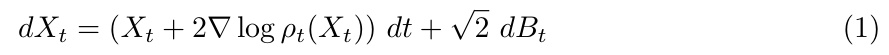
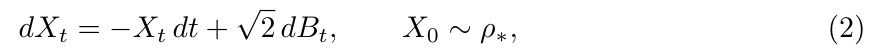
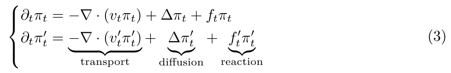
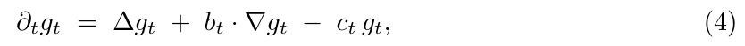
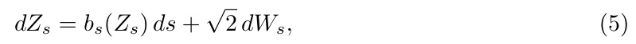
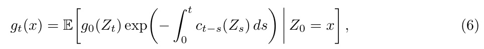

[← 返回 README](../README.md)

# 2 Background and Related Work

## 📌 预览

本节铺三块背景：**① Score-based 生成模型**（OU 加噪 + Anderson 反演，Eq 1-2）；**② 后验采样**（在 prior 上乘 $e^{R_y}$ tilt，难点是后验 score 不能直接从 prior score 算，DPS 用 Tweedie 均值做代理）；**③ Feynman–Kac 公式**（这是全文的数学武器，Eq 3-6）。第③块最关键：作者不去证 KL/TV 上界（在后验采样里这些界通常 vacuous），而是直接**追踪算法分布相对真后验的 Radon–Nikodym 导数**。

---

## Score Based Generative Models

We consider the problem of sampling from a distribution whose density is given by $\rho _ { * } ( x )$ . Score based generative models use a trained score network $s _ { \theta _ { * } } ( x , t ) \approx \sigma _ { t } ^ { 2 } \nabla \log p _ { t } ( x ) \dot { + } x$ to approximate the denoising process

*Eq. (1)：denoising（反向）过程的 SDE。*

The key to implementing this is that the score network $s \theta _ { * } \left( x , t \right)$ can be trained from samples $X \sim p { \mathrm { ~ a s } } \colon \theta _ { * } = \operatorname { a r g m i n } _ { \theta } \mathbb { E } _ { X , \eta } \left[ \left\| X - s _ { \theta } ( e ^ { - t } X + { \sqrt { 1 - e ^ { - 2 t } \eta } } , t ) \right\| ^ { 2 } \right] .$

Throughout, we use a subscript t to denote a noised distribution, so $p _ { t } : = e ^ { d t } p ( e ^ { t } x ) * \mathcal { N } ( 0 , 1 -$ $e ^ { - 2 t } )$ is the marginal of the standard Ornstein-Uhlenbeck (OU) noising process

*Eq. (2)：标准 OU 加噪过程，$t=0$ 时是 $\rho_*$，$t\to\infty$ 收敛到 $\gamma=\mathcal{N}(0,I)$。*

which interpolates between $\rho _ { * }$ at $t = 0$ and the standard Gaussian $\gamma = \mathcal { N } ( 0 , I )$ as $t \to \infty$

Equation (1) is the Anderson reversal of Equation (2) [Anderson, 1982a], and sampling via this reverse process runs in polynomial time [Rombach et al., 2022, Song and Ermon, 2020, Ramesh et al., 2021, Saharia et al., 2022], provided the score network has been trained in advance on samples from the target distribution. This compares favorably to classical approaches such as Langevin dynamics [Vempala and Wibisono, 2022], whose convergence rate is instance-dependent and can be arbitrarily slow, see Section B.1.

> 💡 **机制拆解：加噪-反演骨架（Hao 批注）**: 这是全文的坐标系，务必看懂 forward/reverse 的对偶——
> - **Forward（Eq 2）**：OU 过程 $dX_t=-X_t\,dt+\sqrt2\,dB_t$ 把数据 $\rho_*$ 逐渐推向高斯 $\gamma$。这是"加噪"，无需学习。
> - **Reverse（Eq 1）**：Anderson 反演给出对应的反向 SDE，drift 里含 $\nabla\log\rho_t$（score）。这是"去噪/采样"，需要训练好的 score network。
> - 关键对比：score-based 采样是**多项式时间**的（前提是 score 训好），而 Langevin 的收敛速率 instance-dependent 可以任意慢。这解释了为什么大家宁愿用扩散 prior。
> 
> **注意本文的时间约定**：这里用的是"variance-exploding-free"的 OU 归一化，$\hat{x}_t=e^t x+(e^t-e^{-t})\nabla\log\rho_t$（后面 Tweedie 会反复用），$(e^t-e^{-t})$ 这个因子会在偏差公式的分母里反复出现，它 $\to 0$（$t\to0$，低温）时会放大 reaction term——这是 Section 5 不稳定的伏笔。

## Posterior Sampling

A natural application of score-based models is to inverse problems and posterior sampling. The score network characterizes a prior $\rho _ { * }$ , and at test time one tilts the samples by a log-likelihood $R _ { y } ( x )$ to target the posterior $\mu _ { y } : = e ^ { R _ { y } } \rho _ { * } / Z$ . The main challenge is that the posterior score $\nabla \log ( \mu _ { y } ) _ { t }$ cannot be easily computed from ∇ log $\mathit { p _ { t } . } ^ { 3 }$ A range of approximate algorithms have been proposed to circumvent this. A central theme is the use of the prior scores ∇ log $p _ { t }$ through Tweedie’s formula to obtain realistic-looking samples even when posterior sampling. Specifically, E $\mathsf { \xi } _ { \mathsf { \xi } } [ X _ { 0 } \mid X _ { t } = x _ { t } ]$ is used4 as a computationally tractable proxy for the initial condition $X _ { 0 } ~ ( \mathrm { i . e . }$ , the value that would result if the reverse difusion were run to completion starting from $X _ { t } = x _ { t } )$ and is fed into the reward model $R _ { y } ( \cdot )$ when modifying the drift at test time, see Section B.2. Although the resulting samples are not formally drawn from $\mu _ { y }$ , this heuristic performs well in practice.

> 💡 **机制拆解：偏差从这里进入（Hao 批注）**: 这段是"偏差入口"的最精确定位。逻辑链：
> 1. 目标后验 $\mu_y=e^{R_y}\rho_*/Z$，其**时间相关的后验 score** $\nabla\log(\mu_y)_t$ 才是反向 SDE 真正需要的量；
> 2. 但 $(\mu_y)_t$ 的 score **不能**从 prior score $\nabla\log p_t$ 简单算出（因为加噪与 tilt 不交换）；
> 3. 于是 DPS 用 $\hat{x}_0=\mathbb{E}[X_0\mid X_t]$（Tweedie 均值，可算）当作 $X_0$ 的代理喂给 reward。
> 
> 作者已直言："the resulting samples are **not formally drawn from** $\mu_y$"——这就是本文要精确刻画的那个"not formally"。**对我们盲逆问题**：$R_y$ 换成 $R_{y,\varphi,\sigma}$，第 3 步的代理误差会同时污染 $x$ 和 $\varphi$ 的条件步；本文框架说明这个污染是结构性的、不因 $\varphi$ 估准而消失。

## Feynman-Kac formulas

The sampling literature often focuses on error bounds for approximate sampling algorithms [Lee et al., 2023, Chen et al., 2023, Vempala and Wibisono, 2022], see Section B.1. These are instantiated as upper bounds on the $\mathrm { K \bar { L } / T V / \chi ^ { 2 } }$ distance between the distribution of the sampling algorithm and the ground truth, and under favorable circumstances can be shown to be polynomially or exponentially small in the parameters of the instance. In posterior sampling, such an error is known to be large As such, a KL bound is often vacuous, unless it is accompanied by strong assumptions about the instance. Rather than focusing on bounding this error, we apply machinery that allows us to explicitly track the Radon-Nikodym derivative of approximate posterior sampling algorithm with respect to the true posterior.

> 💡 **方法论转向（Hao 批注）**: 这是全文最重要的"方法论选择"。传统采样理论追求 $\text{KL}(\text{algo}\|\text{truth})\le\epsilon$ 的上界，但在后验采样里这个误差本来就大（Gupta et al. 证明后验采样最坏情况不可行），所以 KL 界要么 vacuous、要么得靠强假设。作者放弃"界"，转而**逐点追踪 Radon–Nikodym 导数 $d\mu_y/d\nu_y^{DPS}=\omega(x)$**。这个转向对我们校准工作是范式级的启发：**不要问"偏多大"，要问"偏在哪、偏向谁"**——这正是 SBC/coverage 检查的空间分辨精神。

In particular, we will exploit the Feynman-Kac representation. Consider two time-dependent densities evolving under possibly diferent transport and reaction fields:

*Eq. (3)：两条密度演化，各含 transport（输运）、diffusion（扩散）、reaction（反应）三项。*

PDEs containing only the transport and difusion terms are Fokker-Planck equations, and their solutions can be represented as the marginal densities of an SDE with corresponding drift and difusion. The reaction term $f _ { t } \pi _ { t }$ introduces a path-dependent weighting. In the special case $f _ { t } = - \kappa _ { t }$ with $ \kappa _ { t } \geq 0 ,$ , this corresponds to killing, or early termination, of the SDE at rate $\kappa _ { t }$ . When $f _ { t }$ is positive, the reaction term may instead be interpreted as spawning, birth, or branching at rate $f _ { t } .$ Thus the resulting solution is generally not a probability density: it is an unnormalized measure, whose total mass evolves according to the cumulative efect of killing and spawning. After normalization, it gives the density of the corresponding weighted process at the terminal time. We can write the PDE for the ratio of the marginals $g _ { t } : = \pi _ { t } ^ { \prime } / \pi _ { t }$ as

*Eq. (4)：密度比 $g_t=\pi_t'/\pi_t$ 满足的抛物型 PDE，含 reaction 系数 $c_t$。*

for an appropriate choice of $b _ { t } , c _ { t }$ . Letting $( Z _ { s } ) _ { s \in [ 0 , t ] }$ be the difusion process associated to the stochastic characteristics

*Eq. (5)：与 $g_t$ 的 PDE 对应的随机特征线 SDE。*

the Feynman-Kac representation of (4) reads

*Eq. (6)：Feynman–Kac 表示——$g_t$ = 沿特征线路径、以 $\exp(-\int c\,ds)$ 加权的初值期望。*

Please see Appendix A for some elaboration of these techniques.

> 💡 **公式批读：Feynman–Kac 的三项分解（Hao 批注）**: 这是全文的引擎，逐项拆解 Eq (3)-(6)：
> - **transport $-\nabla\cdot(v_t\pi_t)$**：把质量按 drift $v_t$ 搬运；
> - **diffusion $\Delta\pi_t$**：布朗涨落，抹平密度；
> - **reaction $f_t\pi_t$**：**这一项才是关键**。$f_t=-\kappa_t\le0$ 表示以速率 $\kappa_t$ "杀死/提前终止"轨迹（killing）；$f_t\gt0$ 表示"生成/分裂"（spawning）。含 reaction 的解**不再是概率密度**，而是一个未归一化测度，总质量随 kill/spawn 累积效果变化。
> - **Eq (4) 的密度比 PDE**：两条路径若只差一个 reaction，则它们的密度比 $g_t$ 满足一个纯抛物 PDE，reaction 系数 $c_t=f_t'-f_t+\nabla\cdot(v_t-v_t')$（见 Appendix A Lemma 2）。
> - **Eq (6) 的 FK 表示**：$g_t(x)=\mathbb{E}[g_0(Z_t)\exp(-\int_0^t c_{t-s}(Z_s)ds)\mid Z_0=x]$。**这就是把"两条路径的密度比"变成"沿一条可模拟的特征线 SDE、用反应项做指数加权的期望"**。
> 
> **全文即将做的事**：让 $\pi$ = surrogate path（能连到真后验），$\pi'$ = algorithm path（DPS 实际走的、丢掉了 reaction）。两者只差 reaction $c_{\text{DPS}}$，于是它们的密度比（=偏差权重 $\omega$）就由 Eq (6) 显式给出：$\omega=\mathbb{E}[\exp(-\int c_{\text{DPS}}\,dt)]$。**这就是"Feynman–Kac 表示如何刻画偏差"的完整答案。**

---

## 🔖 Section 总结

### 关键数字/变量速查
| 变量 | 含义 |
|------|------|
| $\rho_*$ / $\gamma=\mathcal{N}(0,I)$ | 数据 prior / 终端高斯 |
| $\rho_t$ | OU 加噪 $t$ 时刻的边际 |
| $\mu_y=e^{R_y}\rho_*/Z$ | 目标后验 |
| $\hat{x}_0(x_t)=\mathbb{E}[X_0\mid X_t]$ | Tweedie 后验均值（DPS 代理） |
| $c_t$ | reaction 系数 = 偏差累积速率 |
| $\omega$ | Radon–Nikodym 权重 = 偏差的逐点身份 |

### 核心洞察
1. Forward OU 加噪 + Anderson 反演 = 扩散采样骨架；$(e^t-e^{-t})$ 因子是低温放大器。
2. 偏差入口：后验 score 不能从 prior score 简单算，DPS 用 Tweedie 均值代理导致 not-formally-posterior。
3. 方法论：不求 KL 界（vacuous），改追 Radon–Nikodym 导数 $\omega$。
4. Feynman–Kac：把"两路径密度比"写成"沿特征线 SDE 的指数加权期望"，reaction 项即偏差。

### 可追问点
- 为什么 KL 界在后验采样里 vacuous？（Gupta et al. 2024 的 intractability + Appendix B.1）
- reaction 项 $c_t$ 的符号在 DPS 里是什么？（Section 3 会看到 $c_{\text{DPS}}$ 一般为负 → $\exp(-\int c)$ 放大 → over/under 混合）
