[← 返回 README](../README.md)

# 3 Surrogate path and the Bias of DPS

## 📌 预览

本节是全文内核，回答"偏差从哪来、长什么样"。路线：**① 构造 surrogate path**（代理路径）$\vec{\mu}_t=h_t\rho_t/Z_t$，只要 $h_0=e^{R_y}$、$h_\infty=C$ 就能把真后验 $\mu_y$ 连到高斯 $\gamma$（Lemma 1）；**② 算法路径**就是把 surrogate 的演化 PDE**丢掉 reaction term** 后得到的 SDE（Algorithm SDE）；**③** 用 Feynman–Kac 把两者密度比写成 $\exp(-\int c)$ 的路径期望。然后作者证明 **DPS 恰好对应 $h_t^{DPS}=e^{R_y(\hat{x}_t)}$ 这条特定 surrogate path**，其 reaction 系数 $c_{\text{DPS}}$（Eq 8）显式耦合了条件协方差 $\Sigma_t$ 与 reward 曲率/梯度。**Theorem 1** 给出偏差权重 $\omega$ 的两种 FK 表示。Fig 2 用高斯混合 toy 直观展示漏模态。

---

This section develops a general surrogate-path framework for analyzing difusion-based posterior samplers. Given a reward $R _ { y } : \mathbb { R } ^ { \dot { d } } \to \mathbb { R }$ our goal is to sample from the posterior that arises as an exponential tilt of the prior: $\begin{array} { r } { \mu _ { y } = \frac { e ^ { R _ { y } } \rho _ { * } } { Z } } \end{array}$ , where $Z \in \mathbb { R }$ is a normalization constant. Our starting point is to create a surrogate path $\overrightarrow { \mu } _ { t } : [ 0 , \infty ) \to \mathcal { P } ( \mathbb { R } ^ { d } )$ , that interpolates $\mu _ { y }$ with the standard Gaussian. This path is designed such that we can track the Radon-Nikodym derivative between the marginals of this path, and the marginals of the sampler using the Feynman-Kac machinery. As we will see, the algorithm can often be fruitfully instantiated as the SDE that results from dropping the reaction term from the PDE describing the evolution of the surrogate path.

> 💡 **机制拆解：surrogate path 的设计意图（Hao 批注）**: 这段把全文策略讲透了，是理解偏差来源的钥匙。核心一句：**"算法 = surrogate path 的 PDE 丢掉 reaction term 后得到的 SDE"**。为什么这样设计？
> - surrogate path $\vec{\mu}_t$ 是我们**人为设计**的、从真后验 $\mu_y$ 平滑连到高斯 $\gamma$ 的一条插值。它满足一个含 reaction 的 PDE（因为 tilt 后的路径不是纯 Fokker–Planck）。
> - 要把它变成能跑的采样 SDE，必须去掉 reaction（reaction 项对应 kill/spawn，不能用普通 SDE 模拟）。
> - **丢掉 reaction 这一步 = 引入全部偏差**。丢掉的 reaction 项 $c$ 通过 Feynman–Kac 变成密度比 $\omega=\mathbb{E}[\exp(-\int c)]$。
> 
> 所以"偏差从哪一步进入"的答案精确到动作级：**从"把含 reaction 的 surrogate PDE 简化为无 reaction 的算法 SDE"这一步进入**。设计一条好的 surrogate path（reaction 小、score 可算）就是减小偏差的全部艺术。

A natural (and almost exhaustive) family of paths is given by $\begin{array} { r } { t \mapsto \vec { \mu } _ { t } : = \frac { h _ { t } \rho _ { t } } { Z _ { t } } } \end{array}$ , where the function $h . : [ 0 , \infty ) \times \mathbb { R } ^ { d } \to$ R only needs to satisfy $h _ { 0 } = e ^ { R _ { y } }$ and $h _ { \infty } \equiv C$ to match the end points of the interpolation. We first describe the evolution for the surrogate path $t \mapsto \overleftarrow { \mu } _ { t } .$

**Lemma 1** (Informal, see Lemma 3). For any time horizon $T _ { i }$ , the reverse trajectory $\scriptstyle { \vec { \mu } } _ { T - t }$ satisfies

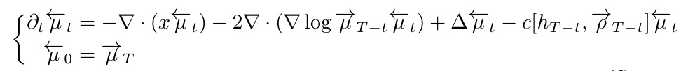

*Lemma 1（非正式）：反向 surrogate 轨迹的 PDE，末项 $-c[h_{T-t},\vec\rho_{T-t}]\overleftarrow\mu_t$ 就是 reaction 项。*

where $c [ h _ { t } , \rho _ { t } ]$ is an appropriate scalar field that depends on noised prior $\vec { \rho } _ { t }$ and the specific choice $o f h _ { t }$

> 💡 **引理批读：Lemma 1（Hao 批注）**: 这是"假设→引理"的第一步。**假设**：任何形如 $\vec\mu_t=h_t\rho_t/Z_t$、端点匹配（$h_0=e^{R_y}$ 起于后验，$h_\infty=C$ 终于高斯）的 tilted-prior 路径。**引理结论**：它的反向演化 PDE 除了标准的 transport（$-\nabla\cdot(x\cdot)$）+ score drift（$-2\nabla\cdot(\nabla\log\vec\mu\,\cdot)$）+ diffusion（$\Delta$），一定还多一个 **reaction 项 $-c[h_{T-t},\vec\rho_{T-t}]$**。这个 $c$ 只依赖于 noised prior 和你选的 $h_t$。**"almost exhaustive"** 是关键措辞：这一族路径几乎穷尽了所有合理的采样器设计，所以下面对 DPS 的分析不是特例而是这个统一框架的一个实例。

Because we have access to a score network $\boldsymbol { s } _ { \boldsymbol { \theta } } ( \boldsymbol { x } , t ) = \boldsymbol { \nabla }$ log $\rho _ { t } ( x )$ , fixing a specific surrogate trajectory $\smash { \vec { \mu } _ { t } }$ , or equivalently a function $h _ { t }$ , we have direct access to the score ∇ log $\vec { \mu } _ { t } =$ ∇ log $h _ { t } + \nabla$ log $\vec { \rho } _ { t }$ . The algorithm path we consider does not contain a reaction term and solves directly

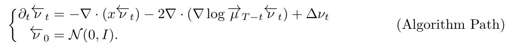

*(Algorithm Path)：把 Lemma 1 的 PDE 去掉 reaction 项、初值改成 $\mathcal{N}(0,I)$。*

The solution $\left\{ \overline { { \nu } } _ { t } = L a w ( Y _ { t } ) \right.$ is obtained as the law of the associated SDE

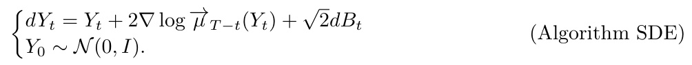

*(Algorithm SDE)：算法真正模拟的反向 SDE，drift = $Y_t+2\nabla\log\vec\mu_{T-t}$。*

The diference between (Surrogate Path) and (Algorithm Path) is merely the presence/absence of the reaction term. Using the Feymann-Kac formula (6) we can express their ratio as weighted expectation over the paths (Algorithm SDE):

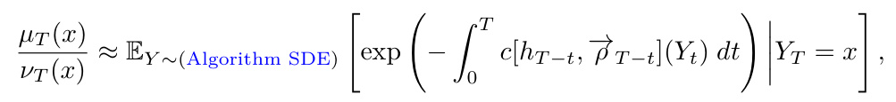

*surrogate 与 algorithm 的密度比 = 沿 Algorithm SDE 的 $\exp(-\int c)$ 加权期望。*

and characterizes how the reaction term creates a mismatch between the output of the algorithm $L a w ( Y _ { T } )$ and the true posterior $\mu _ { y } .$ . Note that due to this modification in (Algorithm Path), some amount of bias is unavoidable. Indeed in the worst case, any path beginning at the posterior $\mu _ { y }$ and ending in a tractable distribution like $\mathcal { N } ( 0 , I )$ , is generated by a evolution that we cannot compute in polynomial time, see Remark 1 and [Gupta et al., 2024]. Nevertheless, some paths inspire useful approximations, that yield good empirical results; see for instance [Bruna and Han, 2024, Parulekar et al., 2025, Ren et al., 2026].

> 💡 **机制拆解：偏差为何"不可避免"（Hao 批注）**: 这段是全文对我们课题最有分量的论断。**"some amount of bias is unavoidable"** 的证明逻辑：
> - 唯一能让 reaction 项恒为零（即无偏）的路径是 OU 插值（下面 Eq 7 会看到），但它的 score 含 $h_t^{OU}=\mathbb{E}[e^{R_y(X_0)}\mid X_t]$，这个条件期望在测试时**不可算**。
> - 反过来，任何 score 可算的 surrogate path 都必然有非零 reaction，即有偏。
> - 更强：Gupta et al. 2024 证明，任何从 $\mu_y$ 连到 $\mathcal{N}(0,I)$ 的无偏演化在最坏情况下都是多项式时间不可算的。
> 
> 所以**"可算"与"无偏"在最坏情况下不可兼得**——这就是"用扩散模型 ≠ 得到贝叶斯后验"的硬核理论依据。不同算法（DPS、Bruna-Han tilted transport、Parulekar annealed Langevin）的区别只在于**选了哪条 surrogate path、reaction 项多小**。这给我们的 calibration 定了基调：偏差不是 bug，是这类方法的内禀属性，只能测量和缓解，不能假装没有。

*Figure 1: The blue dotted line illustrates the path taken by the standard forward OU process from $\rho_*$, $\vec\rho_t$ and its reversal $\overleftarrow\rho_t$. The violet line illustrates the OU process $\overleftarrow\mu_t^{OU}$, whose reversal $\mu$ we cannot track at inference time. The red line illustrates the surrogate path $\vec\mu_t^{DPS}=e^{\tilde R_y(\hat x_t)}\rho_*/Z$ we construct, with the same beginning and end points as $\vec\mu_t$. The orange line denotes the algorithm path $\nu_t^{DPS}$ which disregards the reaction term results in a sample from $\nu_y^{DPS}$ with an unavoidable bias.*

> 💡 **Figure 1 批读（Hao 批注）**: 这张图是全文的"地图"，四条线各有确切含义，看懂它整篇论文的几何就清楚了：
> - **蓝虚线（$\vec\rho_t$ 及反演 $\overleftarrow\rho_t$）**：无条件 prior 的加噪/去噪路径，这是我们训练好的 score 能精确跑的路径。
> - **紫线（$\overleftarrow\mu_t^{OU}$）**：理论上无偏的后验路径（OU 插值，reaction=0），但其反演 $\mu$ 在推理时**无法追踪**（因为需要 $\mathbb{E}[e^{R}\mid X_t]$）。这是"理想但不可达"的路径。
> - **红线（$\vec\mu_t^{DPS}$）**：作者构造的 DPS surrogate path，起点终点与紫线相同（都连接 $\mu_y$ 和 $\gamma$），但中间路径不同、且 score 可算。
> - **橙线（$\nu_t^{DPS}$）**：DPS 算法实际走的路径 = 红线丢掉 reaction 项。它终点落在 $\nu_y^{DPS}\neq\mu_y$，**橙线与红线终点的偏离就是 unavoidable bias**。
> 
> 一句话：**紫线=真理但不可达，红线=可算的近似，橙线=丢了 reaction 的实际算法输出**。本文量化的正是"橙线终点 vs 紫线/红线终点"的差 $\omega$。

## OU Interpolation

A canonical (Surrogate Path) is given by the solution to the OU dynamics: $\overrightarrow { \mu } _ { t } ^ { O U } = h _ { t } ^ { O U } \rho _ { t } / { \cal Z } _ { t }$ from $\mu _ { y }$ to $\mathcal { N } ( 0 , I )$ . This is in fact, the only case where the reaction coeficient $c [ h _ { t } , \vec { \rho } _ { t } ] = 0$ . In this case, we can use the Feymann-Kac formula to express the quotient $\dot { h } _ { t } ^ { O U } = \overrightarrow { \mu } _ { t } ^ { O U } / \overrightarrow { \rho } _ { \mathrm { ~ } }$ t through the representation

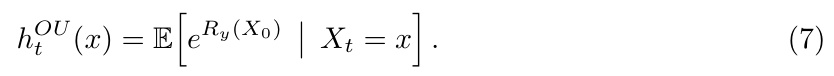

*Eq. (7)：OU 插值下 $h_t^{OU}(x)=\mathbb{E}[e^{R_y(X_0)}\mid X_t=x]$——无偏但不可算。*

To solve for (Algorithm Path) $\overleftarrow { \mu } _ { t } ^ { O U } = \overrightarrow { \mu } _ { T - t } ^ { O U }$ , we need access to the score ∇ log $\vec { \mu } _ { t } =$ ∇ log $h _ { t } ^ { O U } + \nabla$ log $\vec { \rho } _ { t }$ t. Solving (7) at test-time is not tractable, and therefore we cannot eficiently get an acceptable approximation to ∇ log $h _ { t } ^ { O U }$

This discussion motivates the design problem: create a surrogate path $t \mapsto \vec { \mu } _ { t }$ with both a tractable score and a small reaction term.

> 💡 **公式批读：Eq (7) 是"无偏基准"（Hao 批注）**: OU 插值是唯一 reaction=0 的路径（因为它就是把后验直接用 OU 加噪，天然满足 Fokker–Planck，无需 tilt 修正）。它的 $h_t^{OU}=\mathbb{E}[e^{R_y(X_0)}\mid X_t=x]$ 是"**先对 $X_0$ 的整个条件分布评 reward 的指数、再取期望**"。对比 DPS 的 $h_t^{DPS}=e^{R_y(\hat x_t)}$（先取均值再评 reward）——这正是引言里说的 Jensen 顺序交换。**设计问题被精确定义**：找一条 score 可算（像 DPS）但 reaction 尽量小（像 OU）的路径。Section 4 的 STSL 就是往这个方向调。

## Difusion Posterior Sampling

We show below that the DPS algorithm [Chung et al., 2023] can be interpreted as stemming from the following (Surrogate Path).

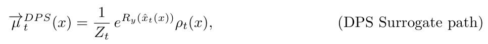

*(DPS Surrogate path)：$\vec\mu_t^{DPS}(x)=\frac1{Z_t}e^{R_y(\hat x_t(x))}\rho_t(x)$，端点 $\vec\mu_0=\mu_y$、$\vec\mu_\infty=\gamma$。*

which retains the correct endpoints $\vec { \mu } _ { 0 } = \mu _ { y } , \vec { \mu } _ { \infty } = \gamma$ . Crucially, the score ∇ log $\overrightarrow { \mu } _ { t } ^ { D P S }$ can be written in terms of

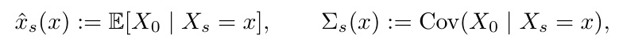

*$\hat x_s(x)=\mathbb{E}[X_0\mid X_s=x]$、$\Sigma_s(x)=\text{Cov}(X_0\mid X_s=x)$，均可由 score 及其 Jacobian 算出。*

both of which are computable from the difusion score oracle sθ and its Jacobian $\nabla s _ { \theta }$ via Tweedie’s formula [Robbins, 1956], see Appendix D.1. Heuristically, the (DPS Surrogate path) is obtained from the OU interpolation by swapping the conditional expectation inside the exponential (7) for

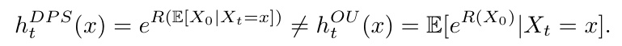

*DPS 的 tilt $h_t^{DPS}=e^{R(\mathbb{E}[X_0\mid X_t])}\neq h_t^{OU}=\mathbb{E}[e^{R(X_0)}\mid X_t]$——偏差的代数身份。*

> 💡 **机制拆解：DPS = 一条特定 surrogate path（Hao 批注）**: 本文最漂亮的一步——**把 DPS 反向工程成一条 surrogate path**。DPS 原本是"denoise 出 $\hat x_0$ 再加 reward 梯度"的算法配方，作者证明它恰好等价于选 $h_t^{DPS}(x)=e^{R_y(\hat x_t(x))}$ 这条路径。好处：
> 1. 这条路径的 score 完全可算——$\nabla\log\vec\mu_t^{DPS}=\nabla\log\rho_t+\nabla(R_y\circ\hat x_t)$，只需 score $s_\theta$ 及其 Jacobian（后者给出 $\Sigma_t$）。
> 2. 端点正确（起后验、终高斯）。
> 3. **代价是非零 reaction**：$h_t^{DPS}=e^{R(\mathbb{E}[X_0])}$ 与无偏的 $h_t^{OU}=\mathbb{E}[e^{R(X_0)}]$ 不等，差的那部分就凝结成 reaction 系数 $c_{\text{DPS}}$（下一式）。
> 
> **这就把"DPS 有偏"从一句直觉变成一个可微分、可计算的对象。** 对我们盲问题：同样可以把"联合 $(x,\varphi)$ 的 plug-and-play guidance"反向工程成一条 surrogate path，其 reaction 会多出 $\varphi$-条件项——这是本文框架天然支持的扩展。

We can identify the true reversal of the (DPS Surrogate path),

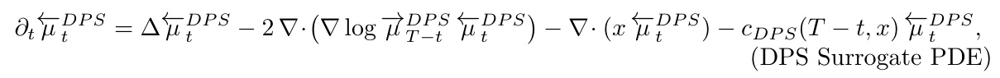

*(DPS Surrogate PDE)：DPS surrogate path 的反向 PDE，含 reaction $-c_{DPS}(T-t,x)$。*

with an explicit reaction coeficient

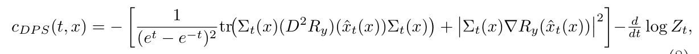

*Eq. (8)：DPS 的显式 reaction 系数 $c_{DPS}(t,x)$。*

> 💡 **公式批读：Eq (8) 是全文最重要的公式（Hao 批注）**: $c_{\text{DPS}}$ 就是"偏差的累积速率密度"，逐项拆开看它讲什么：
> 
> $$c_{DPS}(t,x)=-\left[\frac{1}{(e^t-e^{-t})^2}\text{tr}\big(\Sigma_t(x)(D^2R_y)(\hat x_t(x))\Sigma_t(x)\big)+\big|\Sigma_t(x)\nabla R_y(\hat x_t(x))\big|^2\right]-\frac{d}{dt}\log Z_t$$
> 
> - **第一项 $\text{tr}(\Sigma_t D^2R_y\Sigma_t)$**：条件协方差与 **reward 曲率（Hessian）** 的二次耦合。在数据流形宽（$\Sigma_t$ 大）且 reward 弯（$D^2R_y$ 大）的地方大。
> - **第二项 $|\Sigma_t\nabla R_y|^2$**：条件协方差与 **reward 梯度** 的耦合，恒非负。在流形宽且 reward 陡的方向大。
> - **前缀 $\frac{1}{(e^t-e^{-t})^2}$**：$t\to0$（低温）时爆炸，说明偏差在接近数据流形时被剧烈放大——与 Section 5 的不稳定同源。
> - **$-\frac{d}{dt}\log Z_t$**：归一化项，**不依赖 $x$**，所以只影响整体尺度不影响 over/under 的空间分布（下面简化 $\tilde c_{DPS}$ 会丢掉它）。
> - **整体负号**：方括号内非负，故 $c_{DPS}\le -\frac{d}{dt}\log Z_t$。在 FK 权重 $\exp(-\int c_{DPS})$ 里，负的 $c$ 让指数放大——对应质量的 spawn/kill 空间不均，从而造成 over/under-sampling 的分布扭曲。
> 
> **这一式把偏差的物理来源锁死为"$\Sigma_t$（先验的局部不确定性/流形几何）× reward 的一阶二阶变化"**。对盲逆问题：$D^2R_y$ 和 $\nabla R_y$ 会依赖未知 $A_\varphi$，若 $\varphi$ 估偏，reward 曲率被算错，$c_{DPS}$ 就整体挪位——这正是"算子条件步误差如何进入联合后验偏差"的形式化通道。

## The DPS algorithmic path

The dificulty with implementing Equation (DPS Surrogate PDE) as an SDE is the reaction term. We can construct an alternate PDE that has the same transport and difusion term but no reaction term

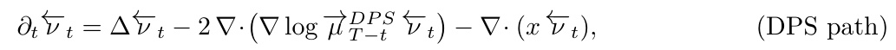

*(DPS path)：与 DPS Surrogate PDE 同 transport/diffusion 但去掉 reaction。*

Using the identities of Appendix D.1, for the score ∇ log $\overrightarrow { \mu } _ { t } ^ { D P S }$ , we get the (Algorithm SDE) approximated by the DPS algorithm as

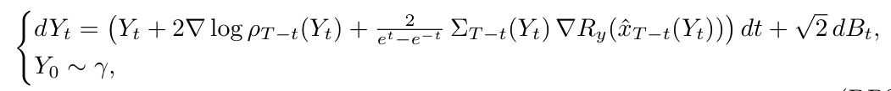

*(DPS SDE)：DPS 实际模拟的 SDE，guidance drift = $\frac{2}{e^t-e^{-t}}\Sigma_{T-t}\nabla R_y(\hat x_{T-t})$。*

> 💡 **公式批读：DPS SDE 的 drift 结构（Hao 批注）**: 注意 guidance 项 $\frac{2}{e^t-e^{-t}}\Sigma_{T-t}(Y_t)\nabla R_y(\hat x_{T-t}(Y_t))$——它不是简单的 $\nabla R_y$，而是**被条件协方差 $\Sigma_{T-t}$ 预条件（preconditioned）过的** reward 梯度。这解释了标准 DPS 实现里那个"$\Sigma$ 权重"从哪来：它是 surrogate path 的 score 自然带出来的。$\frac{2}{e^t-e^{-t}}$ 因子又是低温放大器。**关键**：DPS 算法从 $Y_0\sim\gamma$ 出发直接跑这个 SDE，**不带 reaction 源项**——丢掉的 $-c_{DPS}$ 就是偏差。

Applying the Feynman-Kac formula (6) to the quotient $\frac { \overleftarrow { \nu } _ { \mathit { \Delta T } } ^ { \mathit { D P S } } } { \overleftarrow { \mu } _ { \mathit { \Delta T } } ^ { \mathit { D P S } } }$ , we obtain the following characterization of the bias of the DPS algorithm.

**Theorem 1.** The terminal law $\nu _ { y } ^ { D P S } : = \overleftarrow { \nu } _ { T } ^ { D P S }$ of the DPS-SDE (DPS SDE) difers from the true posterior $\mu _ { y }$ by a pointwise multiplicative weight:

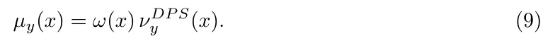

*Eq. (9)：$\mu_y(x)=\omega(x)\,\nu_y^{DPS}(x)$——真后验 = 偏差权重 × DPS 输出。*

The weight $\omega$ admits two equivalent Feynman–Kac representations in terms of the reaction term cDP S defined in (8):

(i) Backward path (condition on the DPS denoising process arriving at $Y _ { T } = x ) \mathrm { : }$

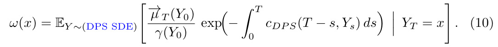

*Eq. (10)：backward 表示——沿 DPS SDE 反向、条件到 $Y_T=x$ 的 $\exp(-\int c_{DPS})$ 期望。*

(ii) Forward path (condition on the OU process (2) starting at $X _ { 0 } = x )$ :

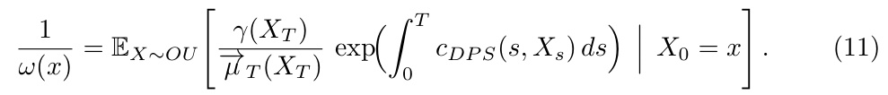

*Eq. (11)：forward 表示——沿 OU 正向、从 $X_0=x$ 出发的 $\exp(+\int c_{DPS})$ 期望，给出 $1/\omega$。*

Both path functionals are expressible in terms of quantities obtainable from the score oracle and its Jacobian via Tweedie’s formula. Importance-weighting DPS samples by ω recovers $\mu _ { y }$ exactly.

> 💡 **定理批读：Theorem 1（Hao 批注）**: 这是本文的主定理，也是我们课题引用它的核心理由。逐条拆：
> - **结论形式 $\mu_y=\omega\cdot\nu_y^{DPS}$**：真后验与 DPS 输出只差一个**逐点乘性权重** $\omega(x)$。这比 KL 界强得多——它告诉你**每个点**偏了多少、朝哪偏。
> - **两种 FK 表示的对偶（Eq 10 vs 11）**：
>   - Backward（10）：从 DPS 采样轨迹出发，条件到终点 $x$，反向积 $-c_{DPS}$，还带一个边界因子 $\vec\mu_T/\gamma$（修正 DPS 从纯高斯起步而非 $\vec\mu_T$ 起步的失配）。
>   - Forward（11）：从 OU 正向过程出发，积 $+c_{DPS}$，给 $1/\omega$。两者等价（Appendix D 用 Anderson 反演证明）。
> - **两者都只需 score + Jacobian**：因为 $c_{DPS}$ 里的 $\Sigma_t,\hat x_t$ 都能由 Tweedie 从 score 算。**这意味着 $\omega$ 原则上可估。**
> - **最后一句是金句**："Importance-weighting DPS samples by $\omega$ recovers $\mu_y$ **exactly**"——**DPS + $\omega$ 重要性加权 = 无偏后验采样器**。这正是我们 posterior-calibration 想要的东西：一个把有偏采样器纠回真后验的显式修正。代价是 $\omega$ 要蒙特卡洛估计（Fig 2 用 20 条轨迹），高维图像上昂贵，但理论上闭合。

**Discussion of Theorem 1.** Equations (10) and (11) give us an explicit handle on the distribution of the DPS sampler. Writing Equation (9) as $\begin{array} { r } { \dot { \frac { 1 } { \omega ( x ) } } \mu _ { y } ( x ) = \dot { \nu } _ { y } ^ { D P S } ( x ) } \end{array}$ shows that, relative to ground truth, DPS under-samples points x where $\omega ( x ) \gt 1$ and oversamples where $\omega ( x ) \lt 1$ . We illustrate this with a simple mixture-of-gaussians prior in Fig. 2.

> 💡 **机制拆解：over/under-sampling 判据（Hao 批注）**: 把 Eq (9) 改写成 $\nu_y^{DPS}=\frac1\omega\mu_y$，判据一目了然：
> - $\omega(x)\gt1$ → DPS 在 $x$ 处质量 = $\mu_y/\omega\lt\mu_y$ → **欠采样（under-sample）**；
> - $\omega(x)\lt1$ → **过采样（over-sample）**。
> 
> 结合 Eq (11)：$1/\omega=\mathbb{E}[\exp(+\int c_{DPS})]$，而 $c_{DPS}$ 主体为负，在"$\Sigma_t$ 大 × reward 敏感"处更负 → $\int c_{DPS}$ 更负 → $1/\omega$ 更小 → $\omega$ 更大 → **这些高不确定+高 reward 敏感的区域被欠采样**。这就是漏模态的定量机制。

We can also simplify the expression for $\omega$ to get an approximate expression with a geometric interpretation. Using the fact that $Z _ { t }$ does not depend on x, and considering that $\begin{array} { r } { \vec { \mu } _ { T } \approx \gamma } \end{array}$ for large T , we get the following approximation:

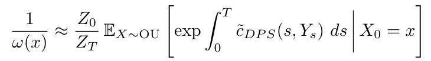

*$1/\omega(x)\approx\frac{Z_0}{Z_T}\mathbb{E}_{OU}[\exp\int_0^T\tilde c_{DPS}\,ds]$，$\tilde c_{DPS}$ 去掉了 $x$-无关的归一化项。*

where $\begin{array} { r } { \tilde { c } _ { D P S } ( s , x ) = \frac { \mathrm { t r } \left( \Sigma _ { s } ( x ) ( D ^ { 2 } R _ { y } ) ( \hat { x } _ { s } ( x ) ) \Sigma _ { s } ( x ) \right) } { ( e ^ { s } - e ^ { - s } ) ^ { 2 } } + \left| \Sigma _ { s } ( x ) \nabla R _ { y } ( \hat { x } _ { s } ( x ) ) \right| ^ { 2 } } \end{array}$ . c˜DP S formalizes an interplay between the prior and the reward model. Concretely, diagonalizing the conditional covariance,

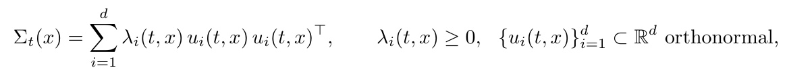

*条件协方差谱分解 $\Sigma_t(x)=\sum_i\lambda_i(t,x)u_iu_i^\top$，$\lambda_i\ge0$，$u_i$ 正交。*

*Figure 2: True Posterior versus DPS Samples: Dashed line is measurement constraint $Ax=y$. $A(x_1,x_2)=(0,x_2)$, $y=(0,-2.5)$. (a) Prior (analytic): $\rho_0$, 4-component, equal-weight, Gaussian mixture; (b) Posterior (analytic): $\mu^y=\frac{\exp(R)}{Z}\rho_0$ where $R(x_1,x_2)=-2\|Ax-y\|^2$ (c) Weight (log-scale): $\frac{1}{\omega(x)}$, 20 trajectory estimate, darkest is undersampling, lightest is oversampling, gray background not computed; (d) DPS Samples: $5\times10^5$ samples show $x_1$-extremal modes are nearly absent while $x_2\lt y_2$ is over-sampled and $x_2\gt y_2$ undersampled.*

> 💡 **Figure 2 批读：漏模态的直接证据（Hao 批注）**: 这是本文对我们最有说服力的一张图，也是"为什么会漏模态"的可视化答案。四个面板：
> - **(a) Prior**：4 个等权高斯分量，沿对角线排布（多模态）。
> - **(b) 真后验**：measurement $A(x_1,x_2)=(0,x_2)$、$y_2=-2.5$ 只约束 $x_2$，所以真后验应保留多个 $x_1$ 模态、把 $x_2$ 拉向 $-2.5$ 附近。**关键：真后验仍是多模态的。**
> - **(c) 权重 $1/\omega$（log 尺度，20 条轨迹估计）**：暗=欠采样、亮=过采样。清楚看到空间上 $\omega$ 极不均匀。
> - **(d) DPS 样本（$5\times10^5$ 个）**：**$x_1$ 方向的极端模态几乎消失**（漏模态！），且 $x_2\lt y_2$ 被过采样、$x_2\gt y_2$ 被欠采样。
> 
> **这就是"为什么会漏模态"的完整回答**：DPS 的 reaction 项 $\tilde c_{DPS}$ 在流形宽（$\lambda_i$ 大）× reward 敏感方向被放大，使得那些方向上的模态在 FK 权重下被系统性 kill 掉。**注意这是在一个可解析的 2D toy 上——连最干净的高斯混合都漏模态，真实图像 prior 只会更糟。** 对盲逆问题：如果 $A_\varphi$ 的参数不确定又被边缘化，等效 reward 更"宽"，漏模态风险更高，这正是我们必须用 coverage/SBC 逐维检查校准的理由。

we can rewrite the reaction coeficient (8) as

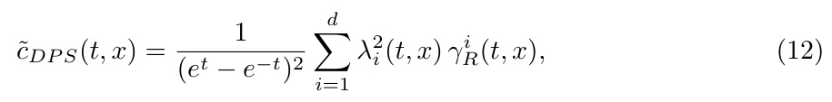

*Eq. (12)：谱形式 $\tilde c_{DPS}(t,x)=\frac{1}{(e^t-e^{-t})^2}\sum_i\lambda_i^2(t,x)\gamma_R^i(t,x)$。*

where the coeficients

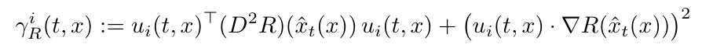

*$\gamma_R^i=u_i^\top(D^2R)u_i+(u_i\cdot\nabla R)^2$，度量 reward 沿本征方向 $u_i$ 的变化剧烈程度。*

quantify how sharply the reward R varies along the eigendirection $u _ { i } . ~ \lambda _ { i } ( t , x )$ is large along directions of high posterior uncertainty about $X _ { 0 }$ given $X _ { t } = x$ (the local tangent directions of the data manifold at $\hat { x } _ { t } ( x ) )$ ), while $\gamma _ { R } ^ { i }$ measures the reward sensitivity along those same directions. The term $\tilde { c } _ { D P S }$ is hence amplified precisely where the data manifold is broad and the reward landscape is active along the same axes.

> 💡 **公式批读：Eq (12) 的谱结构 = 偏差的"配方表"（Hao 批注）**: 这是全文对"偏差在哪被放大"最锋利的表述，也是 Section 4 STSL 补救的理论靶心：
> 
> $$\tilde c_{DPS}=\frac{1}{(e^t-e^{-t})^2}\sum_{i=1}^d\lambda_i^2(t,x)\,\gamma_R^i(t,x)$$
> 
> - **$\lambda_i$**：$\Sigma_t$ 的本征值 = $X_0$ 在方向 $u_i$ 上的条件不确定性 = **数据流形在 $\hat x_t$ 处沿 $u_i$ 的局部切向宽度**。流形"宽"的方向 $\lambda_i$ 大。
> - **$\gamma_R^i=u_i^\top D^2R\,u_i+(u_i\cdot\nabla R)^2$**：reward 沿 $u_i$ 的一阶（梯度平方）+ 二阶（曲率）敏感度。
> - **乘积 $\lambda_i^2\gamma_R^i$**：偏差在**"流形宽 × reward 活跃"同一方向对齐**时被平方级放大。
> 
> 直觉总结：**当"我对 $X_0$ 最不确定的方向"恰好是"reward 最在意的方向"时，DPS 偏得最厉害。** 因为这时用点估计 $\hat x_t$ 代替整个条件分布的误差最大（Jensen gap ∝ 方差 × 曲率）。Section 4 的 STSL 就是加一个 drift 把轨迹推向 $\lambda_i$ 小的低不确定区，从而压平这个 $\tilde c_{DPS}$。**这个"$\Sigma$-reward 对齐"判据可直接搬到我们的盲问题做偏差诊断：算出 $\Sigma_t$ 谱与 $\nabla R_{y,\varphi}$ 的对齐度，就能预测哪些维度的 posterior 会失校准。**

---

## 🔖 Section 总结

### 关键变量速查
| 变量 | 含义 |
|------|------|
| $\vec\mu_t=h_t\rho_t/Z_t$ | surrogate path（可算近似） |
| $h_t^{OU}=\mathbb{E}[e^R\mid X_t]$ | 无偏但不可算的 tilt |
| $h_t^{DPS}=e^{R(\hat x_t)}$ | DPS 用的可算 tilt（有偏） |
| $c_{DPS}$ (Eq 8) | reaction 系数 = 偏差累积速率，耦合 $\Sigma_t$ 与 $D^2R,\nabla R$ |
| $\omega(x)$ (Thm 1) | 逐点偏差权重，$\omega\gt1$ 欠采样、$\omega\lt1$ 过采样 |
| $\tilde c_{DPS}=\frac{1}{(e^t-e^{-t})^2}\sum\lambda_i^2\gamma_R^i$ | 谱形式，暴露"流形宽×reward敏感"放大机制 |

### 核心洞察
1. **偏差入口精确到动作**：把含 reaction 的 surrogate PDE 简化为无 reaction 的算法 SDE，丢掉的 $c_{DPS}$ 就是全部偏差。
2. **可算 ⊥ 无偏**：OU 插值无偏但 $h^{OU}$ 不可算；DPS 可算但有非零 reaction。最坏情况二者不可兼得（Gupta 2024）。
3. **偏差身份**：$\mu_y=\omega\nu_y^{DPS}$，$\omega$ 有 backward/forward 两种 FK 表示，仅需 score+Jacobian，重要性加权可精确纠偏。
4. **漏模态机制**：$\tilde c_{DPS}$ 在"$\lambda_i$ 大（高不确定）× $\gamma_R^i$ 大（reward 敏感）"对齐处被放大，导致这些方向的模态被欠采样（Fig 2 (d) $x_1$ 极端模态消失）。

### 可追问点
- $\omega$ 的蒙特卡洛估计在 $10^4$ 维图像上代价如何？（本文只在 2D toy 验证）
- $-d/dt\log Z_t$ 项被简化丢掉——它对整体归一化的影响在实际纠偏时可忽略吗？
- 盲问题中 $\varphi$ 不确定如何进入 $\gamma_R^i$？（本文未做，是延伸方向）
