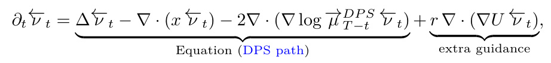
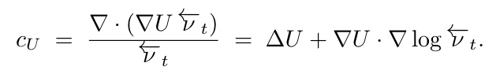
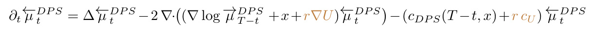
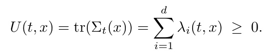

[← 返回 README](../README.md)

# 4 Bias Reduction

## 📌 预览

既然 Theorem 1 把偏差写成 $\mathbb{E}[\exp(-\int c_{DPS})]$，减偏的设计目标就一目了然：**让 $c_{DPS}$ 沿轨迹的波动变小**。做法是给 Algorithm SDE 加一个辅助势场 drift $\nabla U$，把轨迹推向 $c_{DPS}$ 平缓的区域。作者证明**这个额外 drift 等价于修改 reaction 项 $c_{\text{eff}}=c_{DPS}+rc_U$**，并且 **STSL（Rout et al. 2025）恰好是取 $U=\text{tr}(\Sigma_t)$ 的特例**——把轨迹推向低不确定区，从而压平 Eq (12) 的空间变化部分。Remark 1 指出存在理论上完全消偏的 $U^*$（但指数慢），近期 DriftLite/神经 drift-control 是在近似它。

---

We see in Theorem 1 that the ratio between the density of the DPS sampler and the true posterior can be expressed (approximately) as: $\mathbb { E } _ { X \sim \mathrm { D P S } }$ SDE $\left\lceil e ^ { - \int c _ { \mathrm { D P S } } ( s , X _ { s } ) \ d s } \vert X _ { 0 } = x \right\rceil$ This gives a clear design goal: it is beneficial to design paths that result in small variations in cDPS over the trajectories. This would correspond to a smaller reaction term in Equation (Surrogate Path), and a smaller bias when we implement the corresponding algorithm. For instance, we can add an extra potential vector field ∇U to the SDE (Algorithm SDE), that drives trajectories to regions where $c _ { D P S }$ has small oscillations. In terms of the algorithm (Algorithm Path), this amounts to solving

*Algorithm Path 加上一个额外势场项 $r\nabla\cdot(\nabla U\overleftarrow\nu_t)$（extra guidance），强度 $r\ge0$ 为超参。*

where the drift intensity $r \geq 0$ is a hyperparameter. As we see below, such a change in drift can readily be matched with a corresponding change in reaction term that reinterprets the Surrogate Path with the updated drift and a modified reaction term.

> 💡 **机制拆解：减偏的设计原则（Hao 批注）**: 这段把"减偏"从玄学变成一个明确的优化目标——**不是让 $c_{DPS}$ 变小（它由问题决定），而是让 $c_{DPS}$ 沿轨迹的波动/振荡变小**。为什么是波动而非绝对值？因为偏差是 $\exp(-\int c\,ds)$ 的期望；如果 $c$ 沿所有轨迹都是同一个常数，那 $\omega$ 就是空间均匀的常数，归一化后**不改变分布形状**（只改尺度）。真正扭曲分布的是 $c$ 的**空间不均匀性**。所以加 drift $\nabla U$ 把轨迹导向 $c_{DPS}$ 平缓的区域，就能减小有效偏差。$r$ 是这个辅助 drift 的强度。

## Interpreting the drift as a reaction term

Just as difusion can be recast as a drift involving the score, $\Delta \vec { \rho } _ { t } = \nabla$ · (∇ log $\vec { \rho } _ { t } \vec { \rho } _ { t } )$ , the additional drift ∇U can be recast as a reaction term through the tautological identity:

*$c_U=\frac{\nabla\cdot(\nabla U\overleftarrow\nu_t)}{\overleftarrow\nu_t}=\Delta U+\nabla U\cdot\nabla\log\overleftarrow\nu_t$——drift 与 reaction 的互换恒等式。*

In other words, we can rewrite the DPS Surrogate PDE as:

*把额外 drift $r\nabla U$ 并入 transport，同时 reaction 变成 $c_{DPS}+rc_U$。*

In the language of Theorem 1, this modifies the reaction term to $c _ { \mathrm { e f f } } = c _ { D P S } + r c _ { U }$ . As a consequence, excessively large r is counterproductive: the reaction term becomes dominated by $r c _ { U }$ and the original bias structure is lost.

> 💡 **公式批读：drift↔reaction 互换（Hao 批注）**: 这是本节的技术枢纽。作者用一个"tautological identity"（同义恒等式）把"加 drift"翻译成"改 reaction"：加 $\nabla U$ drift ⟺ reaction 增加 $c_U=\Delta U+\nabla U\cdot\nabla\log\overleftarrow\nu_t$。于是在 Theorem 1 的语言里，有效反应项变成 $c_{\text{eff}}=c_{DPS}+rc_U$。**两个关键推论**：
> 1. **可控减偏**：选合适的 $U$ 让 $rc_U$ 抵消 $c_{DPS}$ 的空间波动 → $c_{\text{eff}}$ 更平 → 偏差更小。
> 2. **过犹不及**：$r$ 太大时 $c_{\text{eff}}\approx rc_U$，原来的偏差结构被 $U$ 引入的新偏差取代——**减偏的 drift 本身也会带来偏差**。这是个 bias-bias trade-off，$r$ 需要调。
> 
> **对我们校准的启示**：任何"drift-control / guidance 修正"（包括我们可能设计的 gauge-aware 修正项）都逃不过这个恒等式——它必然对应一个 reaction 修正，因而必然重新分配 over/under-sampling。所以减偏方法也必须过 SBC/coverage 检验，不能假设"加了修正就无偏"。

**Remark 1.** There exists in principle a potential $U ^ { * }$ satisfying $c _ { D P S } + c _ { U ^ { * } } = 0$ , which would eliminate the bias exactly. Computing $\bar { U } ^ { * }$ directly is exponentially slow; recent work instead approximates it via a variational characterizations, training a non-linear [Guo et al., 2026] or linear [Ren et al., 2026] neural network for each specific reward.

> 💡 **推论批读：Remark 1（Hao 批注）**: 这是"完美减偏"的存在性与不可行性声明，呼应 Section 3 的"偏差不可避免"。**存在**一个 $U^*$ 使 $c_{DPS}+c_{U^*}=0$（即 $c_{\text{eff}}\equiv0$，完全无偏）——这不奇怪，因为它本质上把 DPS surrogate path 拉回到 OU 无偏路径。但**直接算 $U^*$ 指数慢**（等价于算不可行的 $h^{OU}$）。近期工作（Guo 2026 非线性网络、Ren 2026 DriftLite 线性网络）用变分刻画 + 为每个 reward 训一个小网络来**近似** $U^*$。**这条线索对我们很重要**：它说明"学一个修正 drift 来减偏"是可行的工程路径，但代价是 per-reward 训练——在盲问题里 reward 随 $\varphi$ 变，$U^*$ 也随 $\varphi$ 变，摊销学习 $U^*(\varphi)$ 可能是联合校准的一个方向。

## STSL as a special case

STSL [Rout et al., 2025] chooses a potential U that drives the trajectory toward low-uncertainty regions of the initial condition $X _ { 0 }$ . Up to constants, the choice is

*STSL 取 $U(t,x)=\text{tr}(\Sigma_t(x))=\sum_i\lambda_i(t,x)\ge0$。*

Since the $\lambda _ { i }$ are non-negative, smaller values of $U$ correspond to smaller spread in the dominant eigendirections of $\Sigma _ { t } ( x )$ , which in turn flattens the spatially varying part of cDP S in (12). In practice this yields a better algorithm with reduced output uncertainty [Rout et al., 2023a].

> 💡 **机制拆解：STSL 为何有效（Hao 批注）**: 这是本文把"经验 trick"上升为"理论必然"的漂亮一击。回忆 Eq (12)：$\tilde c_{DPS}\propto\sum_i\lambda_i^2\gamma_R^i$，偏差在 $\lambda_i$（不确定性）大的地方被放大。STSL 取 $U=\text{tr}(\Sigma_t)=\sum_i\lambda_i$——**这个势的梯度会把轨迹推向 $\sum\lambda_i$ 小的区域，即低不确定、$\Sigma_t$ 谱小的区域**。而 $\lambda_i$ 一小，$\tilde c_{DPS}\propto\lambda_i^2$ 就更小 → reaction 的空间波动被压平 → 偏差减小。
> - **直觉**：STSL 让采样器偏好"denoiser 很自信（后验方差小）"的轨迹，避开那些"$\hat x_t$ 点估计不靠谱"的高方差区——而高方差区正是 DPS 偏得最狠的地方。
> - **代价**：output uncertainty 减小（Rout 2023a 观察到）——这其实是**双刃剑**。对我们校准来说要警惕：STSL 减偏的同时**压缩了后验方差**，这可能导致 coverage 偏低（置信区间过窄）。也就是说 STSL 修的是"位置偏差"，但可能引入"离散度偏差"。这正是必须用 CRPS/coverage 而非仅看点估计误差来评校准的原因。

---

## 🔖 Section 总结

### 核心洞察
1. **减偏 = 压平 $c_{DPS}$ 的空间波动**，不是压小它的绝对值（常数 $c$ 不改分布形状）。
2. **drift↔reaction 恒等式**：加 $\nabla U$ drift ⟺ reaction 变 $c_{\text{eff}}=c_{DPS}+rc_U$；$r$ 过大反被 $U$ 的偏差主导。
3. **STSL = 取 $U=\text{tr}(\Sigma_t)$**，把轨迹推向低不确定区，压平 Eq (12) 中 $\lambda_i^2$ 主导的放大，理论上解释了其经验成功。
4. **存在完美 $U^*$ 但指数慢**（Remark 1）；DriftLite/神经 drift-control 是在近似它。

### 可追问点
- STSL 减偏是否以牺牲 posterior 覆盖率（离散度）为代价？（"reduced output uncertainty"是危险信号）
- $U^*(\varphi)$ 能否在盲问题里摊销学习，实现随算子参数自适应的减偏？
