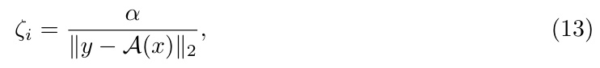
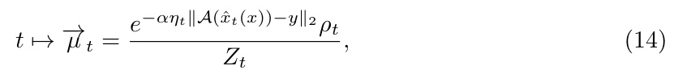
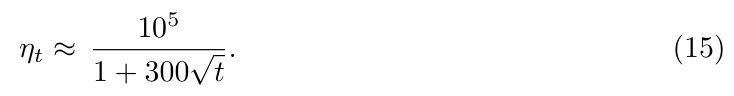
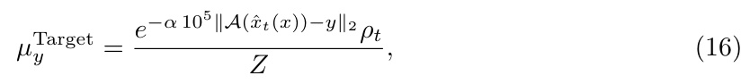
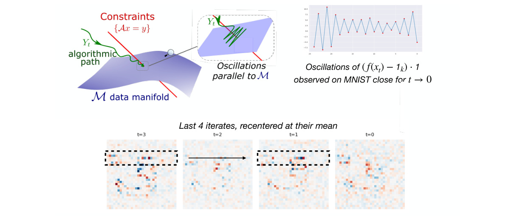
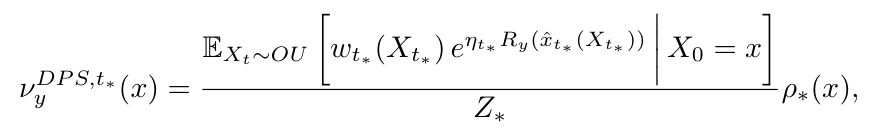
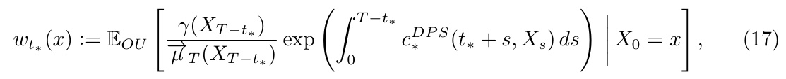
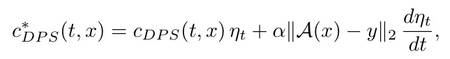

[← 返回 README](../README.md)

# 5 Numerical Instabilities of the DPS Algorithm

## 📌 预览

本节切换到**离散化层面**的第二类问题（与前面的连续偏差正交）：低温（接近约束流形）时 DPS 数值不稳定。作者证明这是 **forward-Euler 对 unsquared 残差 $\|A(x)-y\|_2$ 的标准病态**——梯度在约束处不消失只归一化到单位长度，而 DPS 的轨迹相关步长 $\zeta_i=\alpha/\|y-A(x)\|_2$ 恰好抵消了 Euler 步长，导致稳定判据必然被违反，轨迹进入**振幅 $\sim\Delta t$ 的极限环**（振荡但不发散）。补救措施 early guidance-stopping 被 **Theorem 2** 精确刻画为 prior 的一个加权 tilt。

---

As discussed in earlier sections, the algorithm evolution introduces a bias when compared to the surrogate evolution. In this section, we study a diferent issue with the actual implementation of the DPS algorithm, namely instability of the evolution close to the constraint manifold. In the context of the DPS algorithm proposed in Chung et al. [2024], we show that the instability unavoidably occur in the space parallel to the data manifold due to the systematic violation of the forward Euler stability condition. This phenomenon has indeed been observed in practice. To mitigate this, a common practice is to “turn of” reward guidance close to the data manifold, which we refer to as early guidance stopping. In other words, the stochastic evolution starts with both the score (corresponding to the untilted prior) and reward guidance drift terms until some intermediate time $t _ { s t o p } \in ( 0 , T )$ after which the difusion proceeds with only the untilted score. We show that early guidance stopping can be explicitly characterized as an appropriately weighted tilt of the prior.

> 💡 **机制拆解：两类问题的分工（Hao 批注）**: 开篇再次强调——本节讲的**不是偏差**，是**数值不稳定**。二者正交：
> - **偏差（Sec 3-4）**：连续时间层面就存在，即使 $\Delta t\to0$ 也在。
> - **不稳定（Sec 5）**：纯离散化产物，$\Delta t$ 有限 + 低温才出现，且**只发生在平行于数据流形的方向**。
> 
> early guidance-stopping 的工程配方：到中间时刻 $t_{stop}$ 后关掉 reward guidance，只用 prior score 去噪完成。作者要给这个 trick 一个精确的分布刻画（Theorem 2）。**对我们课题**：低温不稳定意味着"强约束 = 小噪声 σ"时采样轨迹会振荡，这会污染我们对 σ 的联合估计——理解这个机制才能判断噪声估计的失败是模型问题还是采样器数值问题。

## Instability of DPS

We first examine the algorithmic implementation of the DPS algorithm, which is conceptualized as an approximation to the solution of the SDE (DPS SDE). The exact algorithm proposed by the authors of [Chung et al., 2024] is given in Appendix C. The DPS algorithm progressively denoises over discrete time-steps, with the reward guidance weighted at each time-step through a guidance schedule $\{ \zeta _ { i } \} _ { i = 1 } ^ { N }$ that is taken to be trajectorydependent,

*Eq. (13)：DPS 的轨迹相关 guidance schedule $\zeta_i=\alpha/\|y-A(x)\|_2$，$\alpha\in[0.2,1]$。*

where $\mathcal { A } : \mathbb { R } ^ { d } \to \mathbb { R } ^ { L }$ is a general observation operator, $y \in \mathbb { R } ^ { L }$ is the observation, and $\alpha \in [ 0 . 2 , 1 ]$ is a hyperparameter chosen depending on the inverse problem to be solved. In practice, the choice of bias schedule significantly afects the performance of the algorithm. A first observation is that (13) does not account for the time discretization $\Delta t _ { i }$ of the SDE (DPS SDE); efectively, this corresponds to multiplying the biasing vector field by a time-dependent factor. In terms of the surrogate (Surrogate Path), this corresponds to the curve

*Eq. (14)：把 $\zeta_i$ 反译成 surrogate path，reward 变成 unsquared 的 $\|A(\hat x_t)-y\|_2$，带退火 $\eta_t$。*

with annealing schedule (for the linear noising schedule $\{ \beta _ { i } \} _ { i = 1 } ^ { 1 0 0 0 }$ used in the classical DDPM, see Appendix F for details) given by

*Eq. (15)：退火 schedule $\eta_t\approx\frac{10^5}{1+300\sqrt t}$——低温（小 $t$）时巨大。*

> 💡 **公式批读：偏差 schedule 的隐藏后果（Hao 批注）**: 这是不稳定的根源诊断，两个关键发现：
> 1. **$\zeta_i=\alpha/\|y-A(x)\|_2$ 没有考虑时间离散步长 $\Delta t_i$**。它本该是"drift × $\Delta t$"，但工程实现里直接乘了个轨迹相关因子。作者把它等价成"给 biasing 向量场乘一个时间相关因子 $\eta_t$"。
> 2. **反译出的 surrogate path（Eq 14）用的是 unsquared 残差 $\|A(\hat x_t)-y\|_2$**（一次范数），而非平方 $\|\cdot\|_2^2$。这是因为 $\zeta_i$ 分母上的 $\|y-A(x)\|_2$ 把平方 reward 的梯度归一化掉了一次。
> 3. **$\eta_t\approx10^5/(1+300\sqrt t)$ 在低温（$t\to0$）极大**（$\sim10^5$）——意味着接近数据流形时 guidance 被极度放大，强制满足约束。
> 
> 这三点合起来预告了灾难：**巨大的 $\eta_t$ × unsquared 范数的不消失梯度 × 抵消了步长的 $\zeta$ = forward-Euler 必炸。**

The key takeaway is that that schedule weight is large for a reasonable choice of hyperparameters, with the qualitatative implication of strong enforcement of measurement constraints as we approach the data manifold (small $t ~ /$ low-temperature regime). Indeed notice that this path-dependent bias schedule yields the target density of:

*Eq. (16)：实际目标密度 $\mu_y^{Target}\propto e^{-\alpha10^5\|A(\hat x_t)-y\|_2}\rho_t$——unsquared 残差 + 巨大权重。*

in which the reward is unsquared and the constraint $\{ \mathcal { A } ( x ) = y \}$ has a large weight.

*Figure 3: (Top Left) A pictorial depiction of instability - as the trajectory approaches the data manifold, the large efective guidance schedule triggers oscillations in the trajectory. (Top Right) An exhibition of these oscillation on a posterior sampling task with an MNIST prior. (Bottom) A plot of the last four iterates of DPS, re-centered about their mean. The guidance tilted the distribution towards the digit 3. We observe periodic oscillations in pixel space (the deviations from the mean at alternate time steps are similar to each other). Please see Figure 4 and Appendix H for details.*

> 💡 **Figure 3 批读（Hao 批注）**: 三部分讲清了"不稳定长什么样"：
> - **(Top Left) 示意图**：轨迹 $Y_t$（绿）沿数据流形 $\mathcal{M}$ 逼近约束 $\{Ax=y\}$（红线）。放大框显示——**振荡发生在平行于 $\mathcal{M}$ 的方向**（"Oscillations parallel to $\mathcal{M}$"），而非垂直方向。这与 Appendix G 的结论一致：垂直方向被隐式 DDPM 步稳住，平行方向被显式 Euler 步搞炸。
> - **(Top Right) MNIST 实测**：$(f(x_t)-\mathbb{1}_k)\cdot\mathbb{1}$ 在 $t\to0$ 时呈明显锯齿振荡。
> - **(Bottom) 最后 4 个迭代（去均值）**：guidance 把分布推向数字"3"。**交替时间步的偏离彼此相似**（$t=3$ 与 $t=1$ 的虚线框图案接近，$t=2$ 与 $t=0$ 接近）——这正是**周期为 2 的极限环**在像素空间的指纹（$\delta_t\approx-\delta_{t-1}$）。
> 
> **要点**：振荡不发散（unsquared 范数使之半稳定），但确实让每一步都在约束附近来回跳，导致最终样本带上这种周期性伪影。

## Inevitable Oscillations

The unsquared residual in target (16) distorts the dynamics in a way that no choice of step size can repair. To see this, consider the one-dimensional example where gradient flow on |x| under forward Euler is: $x _ { n + 1 } = x _ { n } - \Delta t \mathrm { s i g n } ( x _ { n } )$ . The gradient sign(x) has unbounded Lipschitz constant at the origin, so any $\Delta t \gt 0$ produces a limit cycle of amplitude $\sim \Delta t$ around the minimum; this is bounded but non-convergent. The DPS bias integration is the multidimensional analogue.

As Yt approaches the constraint $\{ \mathcal { A } ( Y ) = y \}$ , the gradient $\nabla \| A ( Y ) - y \| _ { 2 } = \nabla { A ( Y ) } ^ { \top } ( A ( Y ) -$ $y ) / \| \bar { \mathcal { A } } ( \bar { Y } ) - y \| _ { 2 }$ does not vanish, while the annealing schedule (15) multiplying the drift cancels the Euler step size exactly (see Appendix G). The forward Euler stability criterion is therefore inevitably violated near the constraint, and the iteration enters a limit cycle of amplitude $\sim \sigma _ { \mathrm { m a x } } ( \nabla \mathcal { A } P _ { T \mathcal { M } } ) ^ { 2 }$ tangent to M. The advantage of $\| \cdot \| _ { 2 }$ over $\| \cdot \| _ { 2 } ^ { 2 }$ as the reward is that the iterates remain semi-stable in the sense of Lyapunov: they settle into a limit cycle at distance utmost $\alpha \parallel \nabla \mathcal { A } \parallel _ { \mathrm { o p } }$ from the constraint manifold. By contrast, when the forward Euler stability criterion is violated for $\| \cdot \| _ { 2 } ^ { 2 }$ , the oscillations diverge.

> 💡 **机制拆解：为什么"必然"振荡（Hao 批注）**: 这是本节的核心论证，用一维例子讲透——**对 $|x|$ 做梯度流的 forward Euler：$x_{n+1}=x_n-\Delta t\,\text{sign}(x_n)$**。因为 $\text{sign}(x)$ 在原点 Lipschitz 常数无穷大，**任何** $\Delta t\gt0$ 都会在极小值附近产生振幅 $\sim\Delta t$ 的极限环——有界但不收敛。DPS 是它的多维版本：
> - 逼近约束时 $\nabla\|A(Y)-y\|_2=\nabla A^\top(A(Y)-y)/\|A(Y)-y\|_2$ **不消失**（分子分母同阶，归一化到单位长度）；
> - 退火 $\eta_t$ **恰好抵消 Euler 步长**（Appendix G 证明）；
> - 于是稳定判据必然被违反，进入切于 $\mathcal{M}$、振幅 $\sim\sigma_{max}(\nabla A P_{T\mathcal{M}})^2$ 的极限环。
> - **unsquared $\|\cdot\|_2$ vs squared $\|\cdot\|_2^2$ 的关键差别**：一次范数梯度在约束处归一化到有界，故振荡**有界（Lyapunov 半稳定）**，停在离约束 $\le\alpha\|\nabla A\|_{op}$ 处；平方范数梯度会随过冲放大，导致**发散**。
> 
> **这解释了 DPS 为什么用 $\zeta=\alpha/\|y-Ax\|_2$（等效一次范数）而非平方**——不是为了精度，而是为了让不稳定"有界不发散"。这是个工程妥协，不是原理正确。**对我们**：这提示强约束下的采样轨迹带系统性数值伪影，做 σ 联合估计时要么用隐式积分（如 Rout 2025），要么 early-stop。

## Early Guidance Stopping

To avoid these numerical instabilities, practitioners apply early guidance stopping Algorithm 2, terminating the guidance at some intermediate time $t _ { s t o p } \in [ 0 , T ]$ . Combining this with the bias result of Theorem 1, we recover the output of the standard DPS algorithm with early guidance stopping.

**Theorem 2.** [Early Guidance Stopping] If guidance is stopped at time $t _ { s t o p } = T - t _ { * }$ , the output of the DPS algorithm is given by

*Theorem 2：early-stopping 输出 $\nu_y^{DPS,t_*}(x)$ = 一个对 prior $\rho_*$ 的加权 tilt。*

where

*Eq. (17)：权重 $w_{t_*}(x)$ 是一个在 $[0,T-t_*]$ 上积 $c_*^{DPS}$ 的 OU 路径期望。*

with

*$c_{DPS}^*(t,x)=c_{DPS}(t,x)\eta_t+\alpha\|A(x)-y\|_2\frac{d\eta_t}{dt}$——退火进入反应项的两种方式。*

where $\eta _ { t }$ is annealing schedule (15) and $\alpha \gt 0$ is a hyper-parameter.

See for instance [Huang et al., 2026, Proposition 2.6] for the efect of early guidance stopping in the simpler linear-quadratic case.

> 💡 **定理批读：Theorem 2（Hao 批注）**: 这是本文第三个贡献——**首次给 early guidance-stopping 一个精确的分布刻画**。结论：early-stop 在 $t_{stop}=T-t_*$ 的输出是对 prior 的一个加权指数 tilt：
> $$\nu_y^{DPS,t_*}(x)=\frac{1}{Z_*}\mathbb{E}_{OU}\big[w_{t_*}(X_{t_*})e^{\eta_{t_*}R_y(\hat x_{t_*}(X_{t_*}))}\mid X_0=x\big]\rho_*(x)$$
> 逐项含义：
> - **$e^{\eta_{t_*}R_y(\hat x_{t_*})}$**：在停止时刻 $t_*$ 冻结的 reward tilt，退火系数 $\eta_{t_*}$（停得越晚、$t_*$ 越小，这个 tilt 越强）。
> - **$w_{t_*}$（Eq 17）**：$[0,t_{stop}]$ 期间累积的 DPS 偏差（仍是 FK 路径期望），因为停止前那段仍在跑有偏 guidance。
> - **$c_{DPS}^*$**：反应项被退火 $\eta_t$ 调制，且多一项 $\alpha\|A-y\|_2\,d\eta_t/dt$（退火本身随时间变化贡献的 spawn/kill）。
> 
> **物理解读**：early-stop 相当于"只在中高噪声区施加（有偏的）guidance，然后交给无偏 prior 去噪收尾"。它用**牺牲约束满足度**（reward 不再被拉到 0，见 Fig 5/Appendix H）换取**数值稳定**。所以它既不是无偏也不是精确满足约束，而是一个明确的、可写出的折中分布。
> 
> **对我们校准的价值**：Theorem 2 说明 early-stop 后的输出是 $\rho_*$ 的一个已知形式的 tilt——这意味着**early-stop 的选择 $t_*$ 直接改变目标分布**。做 coverage/SBC 时，$t_*$ 是一个必须报告和控制的超参，否则"校准失败"可能只是 $t_*$ 选错。这是一个可直接纳入我们校准协议的诊断维度。

---

## 🔖 Section 总结

### 关键数字/变量速查
| 量 | 值/含义 |
|------|------|
| $\alpha$ | guidance 超参，$[0.2,1]$ |
| $\eta_t\approx\frac{10^5}{1+300\sqrt t}$ | 退火，低温 $\sim10^5$ |
| 极限环振幅 | $\sim\sigma_{max}(\nabla A P_{T\mathcal{M}})^2$，切于 $\mathcal{M}$ |
| 极限环距约束 | $\le\alpha\|\nabla A\|_{op}$（unsquared 有界） |
| $t_{stop}=T-t_*$ | early-stop 时刻 |

### 核心洞察
1. **不稳定 ≠ 偏差**：是 forward-Euler 对 unsquared 残差的病态，只在低温、平行流形方向发生。
2. **必然性**：退火 $\eta_t$ 抵消步长 + 归一化梯度不消失 → 稳定判据必被违反 → 有界极限环（周期 2）。
3. **unsquared 是有意为之**：让振荡有界不发散（半稳定），是工程妥协非原理正确。
4. **Theorem 2**：early-stop = prior 的显式加权 tilt，$t_*$ 直接决定目标分布，是校准必须控制的超参。

### 可追问点
- 隐式积分（Rout 2025）能否同时避开不稳定与减偏？（Appendix G 末句暗示可以）
- early-stop 后 reward 不收敛到 0，对 σ 联合估计的偏移有多大？（Fig 4/5 Column 3-4）
