[← 返回 README](../README.md)

# 6 Acknowledgments · Appendix A–H · References

## 📌 预览

附录分工：**A** 证明 Feynman–Kac for density ratio（全文引擎，Lemma 2）；**B** OU 过程的界与 Tweedie 恒等式（B.1 有效样本反向路径、B.2 一阶/二阶 Tweedie、B.2.1 零噪声极限 = 投影到流形）；**C** DPS 算法伪代码；**D** Theorem 1 完整证明（三步：tilted-prior FP → DPS tilt 的反应项 → 两种 FK 表示）；**E** Theorem 2（early-stopping）证明；**F** DDPM 离散化与连续时间对应；**G** forward-Euler 不稳定的显式推导；**H** MNIST 上的经验证据（Fig 4、5）。

---

## 6 Acknowledgments

The research of AP and SS has been partially supported by NSF Grants 2019844, 2505865 and 2112471, and the UT Austin Machine Learning Lab. The research of MGD was partially supported by NSF-DMS-2205937.

---

## A Feynman-Kac representations of the Radon-Nikodym derivative

We consider $\pi _ { t } ^ { \prime } , \pi _ { t } \in C ^ { 2 } ( ( 0 , T ) \times \mathbb R ^ { d } )$ satisfying a problem of the form (4): ν (Surrogate Path) and $\left. \right.$ (Algorithm Path) are such an example.

**Lemma 2** (Feynman-Kac for Density Ratio). Let $T \gt 0$ and $\alpha \in ( 0 , 1 )$ . Consider two initial measures, with Lebesgue densities $\pi _ { 0 } ( x ) ( x ) , \pi _ { 0 } ^ { \prime } ( x ) d x$ with $\pi _ { 0 } , \pi _ { 0 } ^ { \prime } \in C _ { l } ^ { 2 + \alpha } o c (  { \mathbb { R } } ^ { d } )$ . Suppose $\pi _ { 0 } ( x ) \gt 0$ for al l $x \in \mathbb { R } ^ { d }$ , and the Radon-Nikodym derivative $d \pi _ { t } ^ { \prime } / d \pi _ { t } = \stackrel { \cdot } { g _ { 0 } } ( x ) \in C ^ { 2 } ( \mathbb R ^ { d } )$ with sub-Gaussian growth $| g _ { 0 } ( x ) | + | \nabla g _ { 0 } ( x ) | + | D ^ { 2 } g _ { 0 } ( x ) | \le C e ^ { \lambda | x | ^ { 2 } }$ for some $C , \lambda$ . Suppose also that $v , v ^ { \prime } , f , f ^ { \prime }$ satisfy,

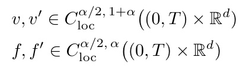

*$v,v'$ 与 $f,f'$ 的局部 Hölder 正则性条件。*

and growth conditions, for some fixed $K _ { 1 } , K _ { 2 }$ (independent of t),

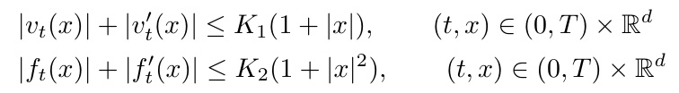

*drift 线性增长、reaction 二次增长的界。*

. Then we have the following:

(i) There exist unique classical solutions $\pi , \pi ^ { \prime } \in C ^ { 1 , 2 } \big ( ( 0 , T ) \times \mathbb { R } ^ { d } \big )$ to

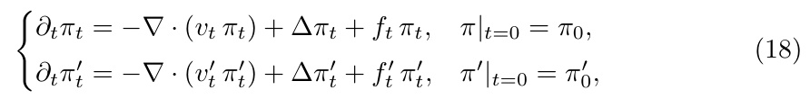

*Eq. (18)：两条含 transport+diffusion+reaction 的 PDE，初值分别为 $\pi_0,\pi_0'$。*

$\pi _ { t } , \pi _ { t } ^ { \prime } \gt 0$ for al l $t \in ( 0 , T )$

(ii) The ratio $g _ { t } ( x ) : = \pi _ { t } ^ { \prime } ( x ) / \pi _ { t } ( x )$ belongs to $C ^ { 1 , 2 } \big ( ( 0 , T ) \times \mathbb { R } ^ { d } \big )$ and is the unique classical solution to

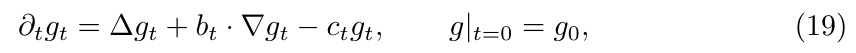

*Eq. (19)：密度比 $g_t$ 满足的抛物 PDE。*

with

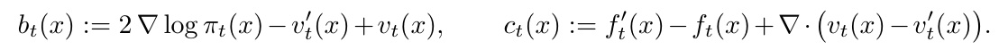

*漂移 $b_t=2\nabla\log\pi_t-v_t'+v_t$，反应 $c_t=f_t'-f_t+\nabla\cdot(v_t-v_t')$。*

(iii) The ratio admits the Feynman–Kac representation

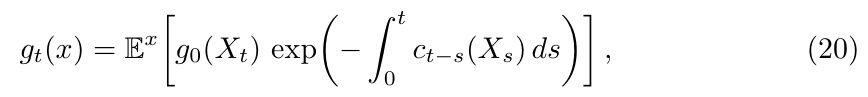

*Eq. (20)：$g_t(x)=\mathbb{E}^x[g_0(X_t)\exp(-\int_0^t c_{t-s}(X_s)ds)]$。*

where $( X _ { s } ) _ { s \in [ 0 , t ] }$ is the unique strong solution of the SDE

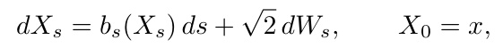

*特征线 SDE $dX_s=b_s(X_s)ds+\sqrt2\,dW_s$。*

and W is a standard d-dimensional Brownian motion.

> 💡 **引理批读：Lemma 2 是全文引擎（Hao 批注）**: 这是支撑 Theorem 1/2 的唯一数学基础。**假设**：两条演化 PDE（Eq 18）只在 drift $v/v'$、reaction $f/f'$ 与初值上不同，且系数满足 Hölder 正则 + 线性/二次增长（保证经典解存在唯一，引 Ladyženskaja 1968）。**结论三段**：(i) 两 PDE 各有唯一正经典解；(ii) 它们的密度比 $g_t=\pi_t'/\pi_t$ 满足一个**纯抛物 PDE**（Eq 19），其 drift $b_t$ 吸收了两条路径的 score 差与 drift 差，reaction $c_t$ 吸收了两条 reaction 差 + drift 散度差；(iii) 这个 $g_t$ 有 Feynman–Kac 表示（Eq 20）——沿特征线 SDE 跑、用 $\exp(-\int c)$ 加权的初值期望。**这就是"把两条路径的密度比变成一条可模拟 SDE 上的路径期望"的一般机器**；Theorem 1 只是取 $\pi$=surrogate、$\pi'$=algorithm 的特例。

**Proof.** That the assumptions on the coeficients and measures $\pi _ { 0 } ^ { \prime } , \pi _ { 0 }$ imply (i) is a classical result [Ladyženskaja et al., 1968, Ch. IV, Thm. 5.1]. Consequently, gt is well defined, positive, and $C ^ { 2 } ( ( 0 , T ) \times  { \mathbb { R } } ^ { d } )$ : we seek to prove (ii) and (iii). First, write $g _ { t } = \exp ( \log g _ { t } )$ in the broader context of Hamilton-Jacobi-Bellman equations, this is sometimes called the Cole-Hopf transformation. For never-vanishing $\varphi \in C ^ { \dot { 2 } } (  { \mathbb { R } } ^ { d } )$ , this transformation yields the identity $\begin{array} { r } { \frac { \Delta \varphi } { \varphi } = \Delta \log \varphi + | \nabla \varphi | ^ { 2 } } \end{array}$ . Together with (4), the Laplacian-identity gives the equations for ∂t log π′ and $\partial _ { t } \log \pi _ { t }$ , taking the diference to obtain

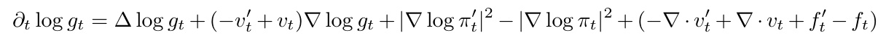

Introduce $\nabla \log \pi _ { t }$ to write $| \nabla \log \pi _ { t } ^ { \prime } | ^ { 2 } = | \nabla \log g _ { t } | ^ { 2 } + 2 \nabla \log \pi _ { t } \nabla \log g _ { t } + | \nabla \log \pi _ { t } | ^ { 2 }$ and thus

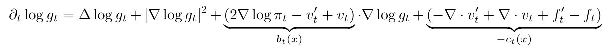

where $b _ { t } ( x )$ and $c _ { t } ( x )$ are spatially dependent coeficients. Multiply by $g _ { t }$ and apply again the identity for $\frac { \Delta g _ { t } } { g _ { t } }$ to conclude

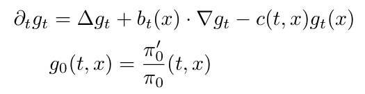

Now consider consider the SDE

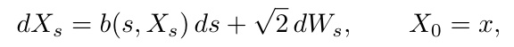

which has generator $\mathcal { L } _ { s } = \Delta + b ( s , \cdot ) \cdot \nabla$ . Fix now $t \in ( 0 , T )$ and define the process, which depends on the whole trajectory,

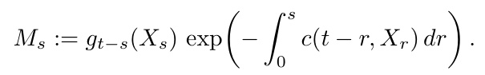

Applying the Ito formula and the equation for $g _ { t } ( x )$ , the drift term vanishes:

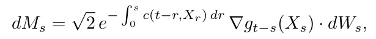

so M is a martingale (see [Karatzas and Shreve, 1991, Theorem $5 . 7 . 6 ]$ for standard presentation). At endpoints, the martingale property gives $\mathbb { E } ^ { x } [ M _ { t } ] = M _ { 0 } = { \dot { g } } _ { t } ( x ) \ ( 2 0 )$ □

> 💡 **证明批读：Cole–Hopf + 鞅（Hao 批注）**: 证明只有两招但很典型。**第一招 Cole–Hopf**：令 $g_t=\exp(\log g_t)$，用恒等式 $\Delta\varphi/\varphi=\Delta\log\varphi+|\nabla\varphi|^2$ 把 $\log\pi_t',\log\pi_t$ 的方程相减，非线性项 $|\nabla\log g_t|^2$ 在乘回 $g_t$ 后恰好被 $\Delta g_t$ 吸收，得到线性抛物 PDE（Eq 19）。**第二招构造鞅**：定义 $M_s=g_{t-s}(X_s)\exp(-\int_0^s c\,dr)$ 沿特征线 SDE，用 Itô 公式验证其 drift 恰好因 $g$ 的 PDE 而消失，故 $M$ 是鞅；对鞅两端取期望 $\mathbb{E}^x[M_t]=M_0=g_t(x)$ 即得 FK 表示（Eq 20）。**要点**：FK 不是魔法，就是"给 PDE 的解配一个沿随机特征线的鞅"。

## B Bounds and Identities on the OU process

### B.1 The efective sample backward path

The starting point for sampling from a prior in score-based generative models is the forward path $t \mapsto \vec { \rho } _ { t }$ that interpolates between the prior $\rho _ { 0 } = \rho _ { * }$ and the Gaussian $\rho _ { \infty } = \mathcal { N } ( 0 , I )$ This is obtained by solving the OU process $\rho _ { t } = \operatorname { L a w } ( X _ { t } )$ , where $\{ X _ { t } \} _ { t \ge 0 }$ satisfies the SDE

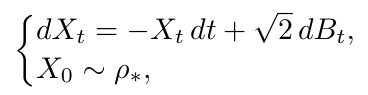

or, equivalently, the Fokker–Planck equation

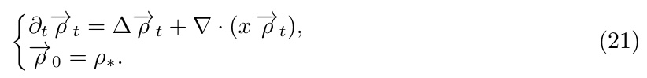

*Eq. (21)：前向 OU 的 Fokker–Planck 方程。*

By the log-Sobolev inequality for $\rho _ { \infty }$ and the relative-entropy decay along the OU flow, we have the exponentially decaying bound for $t \gt 1$

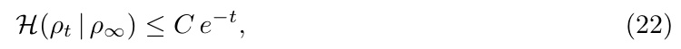

*Eq. (22)：相对熵指数衰减 $\mathcal{H}(\rho_t|\rho_\infty)\le Ce^{-t}$，$C$ 与维度无关。*

where C is a universal constant independent of dimension.

To obtain approximate samples from $\rho _ { * }$ , we fix a time horizon T and reverse the path: set $\overleftarrow { \rho } _ { t } = \overrightarrow { \rho } _ { T - t }$ . The reverse path satisfies

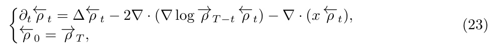

*Eq. (23)：反向路径 PDE。*

where we have used the difusion-to-drift identity

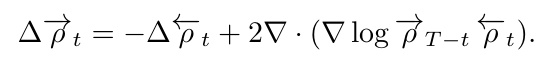

*扩散↔漂移恒等式。*

In practice, the initial condition is replaced by a standard Gaussian $\overleftarrow { \rho } _ { 0 } ^ { \mathrm { e f f } } = \mathcal { N } ( 0 , I )$ . The computationally intensive part of this strategy is obtaining a good approximation $s _ { \theta } ( t , x )$ ≈ ∇ log $\vec { \rho } _ { t } ( x )$ from samples; see Section 2. The efective samples are then obtained by approximating the solution of

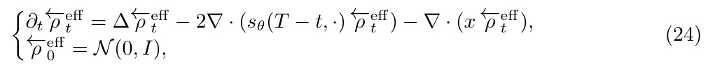

*Eq. (24)：用 score network $s_\theta$ 近似的有效反向 PDE。*

which arises as the law of

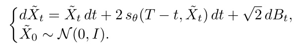

Diferentiating the relative entropy $\begin{array} { r } { \frac { d } { d t } \mathcal { H } ( \overleftarrow { \rho } _ { \textit { t } } ^ { \mathrm { e f f } } \mid \overleftarrow { \rho } _ { \textit { t } } ) } \end{array}$ along the flow yields the relative-entropy bound between the efective samples $\tilde { X } _ { T } \sim \overleftarrow { \rho } _ { T } ^ { \mathrm { e f f } }$ and the true distribution $X _ { 0 } \sim \rho _ { * }$

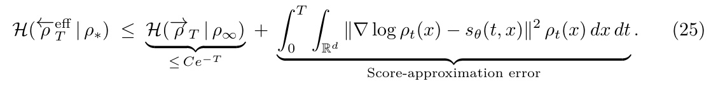

*Eq. (25)：有效样本与真分布的相对熵界 = 指数小的收敛项 + score 近似误差项。*

In what follows, we assume the score-approximation error is negligible, so the samples obtained by denoising are for practical purposes indistinguishable from $\rho _ { * }$

> 💡 **机制拆解：B.1 界定了"prior 采样是干净的"（Hao 批注）**: 这一小节的作用是**给全文划一条基线**：无条件 prior 的采样误差（Eq 25）= 指数收敛项 $\mathcal{H}(\vec\rho_T|\rho_\infty)\le Ce^{-T}$ + score 近似误差项。作者随即假设 score 误差可忽略，于是"去噪得到的样本 = $\rho_*$"。**这一步至关重要**：它把 prior 采样的误差清零，从而后面所有"偏差"都干净地归因于 posterior tilt 那一步（reaction 项），而非 score 训练或 prior 采样。**对我们**：这也提醒——本文的偏差结论建立在"prior score 精确"的理想假设上；真实盲问题里 score 本身有误差，联合后验偏差会是 $c_{DPS}$ + score 误差项的叠加。

### B.2 Tweedie’s identities

A widely used heuristic is to estimate $X _ { 0 }$ from a noisy observation $X _ { t }$ via the conditional expectation

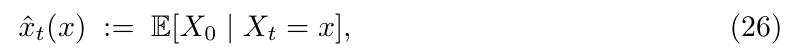

*Eq. (26)：$\hat x_t(x)=\mathbb{E}[X_0\mid X_t=x]$。*

which, under the negligible-score-approximation assumption of Section B.1, also equals $\mathbb { E } [ \tilde { X } _ { T } \ | \ \tilde { X } _ { T - t } = x ]$ for the efective backward process. Tweedie’s formula expresses (26) in closed form via the score:

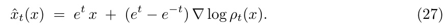

*Eq. (27)：Tweedie 一阶公式 $\hat x_t=e^t x+(e^t-e^{-t})\nabla\log\rho_t$。*

Derivation. The OU semigroup admits the Gaussian kernel

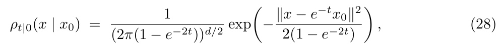

*Eq. (28)：OU 半群的高斯核。*

so $\nabla _ { x }$ log $\rho _ { t | 0 } ( x ~ \vert ~ x _ { 0 } ) ~ = ~ - ( x - e ^ { - t } x _ { 0 } ) / ( 1 - e ^ { - 2 t } )$ . Diferentiating $\begin{array} { r } { \rho _ { t } ( x ) \ = \ \int \rho _ { t | 0 } ( x \ | } \end{array}$ $x _ { 0 } ) \rho _ { * } ( x _ { 0 } )$ dx0 in x and dividing by $\rho _ { t } ( x )$

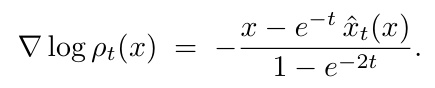

Solving for ${ \hat { x } } _ { t } ( x )$ and using $e ^ { t } ( 1 - e ^ { - 2 t } ) = e ^ { t } - e ^ { - t }$ yields (27).

Second-order identity. Diferentiating (27) in $x _ { \mathrm { { i } } }$

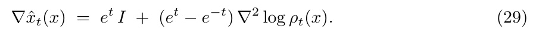

*Eq. (29)：$\nabla\hat x_t=e^t I+(e^t-e^{-t})\nabla^2\log\rho_t$。*

The right-hand side admits a probabilistic interpretation as a rescaled conditional covariance:

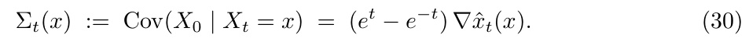

*Eq. (30)：$\Sigma_t(x)=\text{Cov}(X_0\mid X_t=x)=(e^t-e^{-t})\nabla\hat x_t(x)$。*

Proof of (30). Diferentiating $\rho _ { t }$ twice via (28) and subtracting $( \nabla \log \rho _ { t } ) ( \nabla \log \rho _ { t } ) ^ { \top }$ to convert from $\nabla ^ { 2 } \rho _ { t } / \rho _ { t }$ to $\nabla ^ { 2 } \log \rho _ { t }$

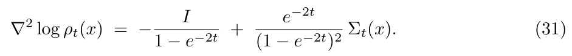

*Eq. (31)：$\nabla^2\log\rho_t$ 与 $\Sigma_t$ 的关系。*

Substituting into (29), the identity $( e ^ { t } - e ^ { - t } ) / ( 1 - e ^ { - 2 t } ) = e ^ { t }$ cancels the etI contribution, and the identity $( e ^ { t } - e ^ { - t } ) e ^ { - 2 t } / ( \bar { 1 } - e ^ { - 2 t } ) ^ { 2 } = e ^ { - t } / ( 1 - e ^ { - 2 t } ) = 1 / ( e ^ { t } - e ^ { - t } )$ collapses the covariance term, giving

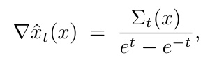

which rearranges to (30).

> 💡 **公式批读：Tweedie 一阶 + 二阶（Hao 批注）**: B.2 提供了 $c_{DPS}$ 公式里两个核心量的计算途径，是"仅需 score+Jacobian 即可算偏差"这一 claim 的技术支撑：
> - **一阶（Eq 27）**：$\hat x_t=e^t x+(e^t-e^{-t})\nabla\log\rho_t$——后验均值 = 观测的缩放 + score 缩放。**只要有 score 就能算点估计。**
> - **二阶（Eq 30）**：$\Sigma_t=(e^t-e^{-t})\nabla\hat x_t=(e^t-e^{-t})^2\nabla^2\log\rho_t+(e^t-e^{-t})e^t I$——**后验协方差 = score 的 Jacobian（Hessian of log density）**。这就是为什么 DPS SDE 的 guidance 里天然带 $\Sigma_t$、以及 $c_{DPS}$ 里带 $\Sigma_t$——它们全都来自 score 网络的一阶导。**关键**：$\Sigma_t$ 正定对称，其谱 $\lambda_i$ 就是 Eq (12) 里放大偏差的那个"流形宽度"。

### B.2.1 The zero-noise limit

Throughout this subsection we assume $\rho _ { * }$ is supported on a smooth, compact, k-dimensional submanifold $\mathcal { M } \subset \mathbb { R } ^ { d }$ of positive reach $\tau _ { \mathcal { M } } \gt 0 ,$ , with a smooth positive density with respect to the volume measure on $\mathcal { M }$ . The orthogonal projection $P _ { \mathcal { M } } : x \mapsto$ arg min $_ { x _ { 0 } \in \mathcal { M } } \left\| x - x _ { 0 } \right\|$ is then well-defined and smooth on the tubular neighborhood $\mathcal { N } _ { \tau _ { \mathcal { M } } } : = \{ \boldsymbol { x } \in \mathbb { R } ^ { d }$ : dist $( x , { \mathcal { M } } ) \lt \tau _ { { \mathcal { M } } } \}$ and the case $x \in \mathcal { M }$ corresponds to dist $( x , { \bar { M } } ) = 0$ . We compute the small-t behavior of $\hat { x } _ { t }$ and $\nabla \hat { x } _ { t }$ via Laplace’s method on $\mathcal { M } ;$ standard references include Varadhan [1966], Dembo and Zeitouni [2010].

Setup. As $t \to 0 ^ { + } , 1 - e ^ { - 2 t } = 2 t + O ( t ^ { 2 } )$ and $e ^ { - t } = 1 + O ( t )$ , so the OU kernel (28) concentrates as

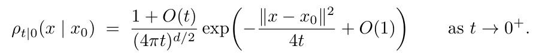

The integrals defining $\hat { x } _ { t } ( x )$ are of Laplace form on M with phase $\Phi ( x _ { 0 } ) = \| x - x _ { 0 } \| ^ { 2 }$ at temperature $4 t$

Local geometry. Fix $\boldsymbol { x } \in \mathcal { N } _ { \tau _ { \mathcal { M } } }$ , set $p : = P _ { \mathcal { M } } ( x )$ , and let $T : = T \mathcal M _ { p }$ with $P _ { T }$ the orthogonal projection onto T . Parametrize M near $p$ by tangent vectors,

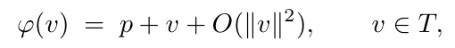

where the $O ( \| v \| ^ { 2 } )$ correction lies in the normal space $N : = T ^ { \perp }$ and is bounded by the second fundamental form. Since $x - p \in N$ is orthogonal to $v \in T$ ，

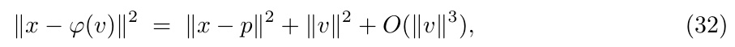

*Eq. (32)：相位在切坐标下局部二次。*

so the phase $\Phi ( x _ { 0 } ) = \| x - x _ { 0 } \| ^ { 2 }$ is locally quadratic in tangent coordinates with Hessian $2 I _ { T }$ at the minimizer $p .$

Limit of $\hat { x } _ { t }$ . On $\mathcal { N } _ { \tau _ { M } } ,$ , the phase $\Phi | _ { \mathcal { M } }$ has unique global minimizer p with $\Phi ( p ) = \| x - p \| ^ { 2 }$ Laplace’s method on $\mathcal { M }$ , applied with the local expansion (32), gives the asymptotic

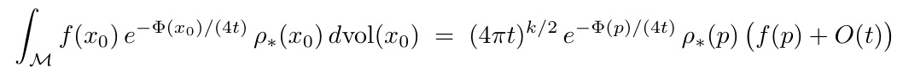

for any $C ^ { 1 }$ function $f$ on $\mathcal { M } .$ . Recall that the Tweedie estimate is the ratio

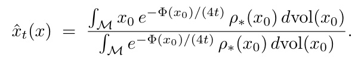

Applying the asymptotic to numerator and denominator, the common prefactor $( 4 { \dot { \pi } } { \dot { t } } ) ^ { { \dot { k } } / 2 } e ^ { - \Phi ( p ) / ( 4 t ) ^ { \nu } } \rho _ { * } { \dot { ( p ) } }$ cancels, leaving $\hat { x } _ { t } ( x ) = p + O ( t )$ , where the $O ( t )$ remainder collects the next-order Laplace corrections. The $O ( { \sqrt { t } } )$ contributions from tangential fluctuations vanish by Gaussian symmetry on $T ,$ since the linear function $v \mapsto v$ has zero mean under a centered Gaussian. Hence

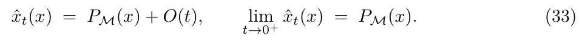

*Eq. (33)：$\hat x_t(x)=P_{\mathcal{M}}(x)+O(t)$，$t\to0$ 时投影到流形。*

Limit of $\nabla \hat { x } _ { t }$ . By (30) and $e ^ { t } - e ^ { - t } = 2 t + O ( t ^ { 3 } )$

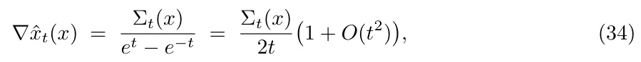

*Eq. (34)：$\nabla\hat x_t=\Sigma_t/(e^t-e^{-t})=\Sigma_t/2t\,(1+O(t^2))$。*

so it sufices to compute $\Sigma _ { t } ( x )$ to leading order. By (32), the conditional law $\rho _ { 0 | t }$ is asymptotically Gaussian on $T$ with covariance $2 t I _ { T }$ , and the normal component of $X _ { 0 } - p$ is of order $\| v \| ^ { 2 } = O ( t )$ and contributes only at order $t ^ { 2 }$ . Hence

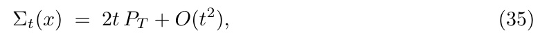

*Eq. (35)：$\Sigma_t(x)=2t P_T+O(t^2)$。*

and substituting into (34) yields

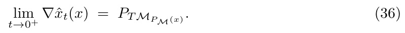

*Eq. (36)：$\lim_{t\to0^+}\nabla\hat x_t(x)=P_{T\mathcal{M}}$，切空间投影。*

Consequence. In the small-noise regime relevant near the constraint set, $\hat { x } _ { t }$ acts as the orthogonal projection onto the data manifold and $\nabla \hat { x } _ { t }$ acts as the projection onto the corresponding tangent space. This is the geometric structure that drives the manifold-tangent oscillations of the DPS guidance analyzed in Section 5.

> 💡 **推论批读：零噪声极限的几何（Hao 批注）**: 这一小节是 Section 5 不稳定分析的几何基础，结论极干净：**当 $t\to0$（低温/接近流形），Tweedie 均值 $\hat x_t\to P_{\mathcal{M}}$（投影到数据流形），其 Jacobian $\nabla\hat x_t\to P_{T\mathcal{M}}$（投影到切空间）**。证明用 Laplace 方法：OU 核在 $t\to0$ 时以 $4t$ 为温度集中到最近点 $p=P_{\mathcal{M}}(x)$，切向涨落 $\sim\sqrt{2t}$、法向涨落 $\sim t$。**为什么重要**：它解释了 Section 5 的"振荡平行于流形"——因为 guidance drift 里的 $\nabla\hat x_t=P_{T\mathcal{M}}$ 把 reward 梯度投影到切空间，于是不稳定只能沿切向发生。同时 $\Sigma_t\approx2t P_T$ 说明低温下条件协方差退化为切空间上的各向同性 —— 这也是 $c_{DPS}$ 前缀 $1/(e^t-e^{-t})^2\sim1/4t^2$ 爆炸的几何来源。

## C The DPS Algorithm [Chung et al., 2024]

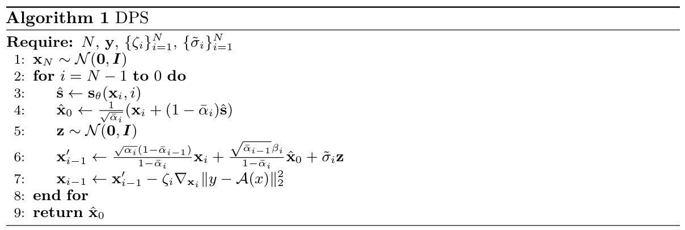

*Algorithm 1: DPS 伪代码。第 3-4 行用 score 算 Tweedie 均值 $\hat x_0$；第 6 行是标准 DDPM 去噪步；第 7 行是显式 forward-Euler 的 reward guidance 步。*

Here $\mathcal { A } : \mathbb { R } ^ { d } \to \mathbb { R } ^ { L }$ is a general linear or non-linear observation operator and $\boldsymbol { y } \in \mathbb { R } ^ { L }$ is the observation. The bias schedule $\{ \zeta _ { i } \} _ { i = 1 } ^ { N }$ is taken to be trajectory-dependent,

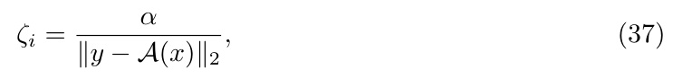

*Eq. (37)：$\zeta_i=\alpha/\|y-A(x)\|_2$。*

where $\alpha \in [ 0 . 2 , 1 ]$ is a hyperparameter chosen depending on the inverse problem to be solved. In practice, the choice of bias schedule significantly afects the performance of the algorithm.

> 💡 **算法批读：DPS 的两步积分不对称（Hao 批注）**: 看伪代码就能定位 Section 5 不稳定的元凶。**第 6 行**（去噪 $x_{i-1}'$）是隐式 DDPM 更新——数值稳定；**第 7 行**（$x_{i-1}=x_{i-1}'-\zeta_i\nabla\|y-A(x)\|_2^2$）是**显式 forward-Euler** 的 guidance 步——这才是会炸的那步。注意第 7 行梯度对象是平方 $\|\cdot\|_2^2$，但 $\zeta_i=\alpha/\|y-A(x)\|_2$ 的分母把它降成等效一次范数（Appendix G 会用到）。**这个"隐式去噪 + 显式 guidance"的不对称积分是 DPS 实现的固有结构，也是本文能把偏差与不稳定分开分析的原因。**

## D Proof of Theorem 1

In this section, we will prove the following theorem

**Theorem 1.** The terminal law $\nu _ { y } ^ { D P S } : = \overleftarrow { \nu } _ { T } ^ { D P S }$ of the DPS-SDE (DPS SDE) difers from the true posterior $\mu _ { y }$ by a pointwise multiplicative weight:

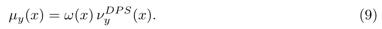

The weight $\omega$ admits two equivalent Feynman–Kac representations in terms of the reaction term cDP S defined in (8):

(i) Backward path (condition on the DPS denoising process arriving at $Y _ { T } = x ) \colon$

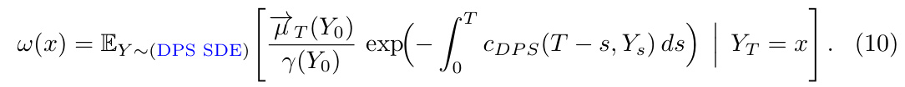

(ii) Forward path (condition on the OU process (2) starting at $X _ { 0 } = x )$

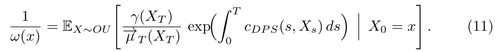

Both path functionals are expressible in terms of quantities obtainable from the score oracle and its Jacobian via Tweedie’s formula. Importance-weighting DPS samples by ω recovers $\mu _ { y }$ exactly.

Sketch. The proof has three steps (elaborated below).

Step 1. We record an evolution equation satisfied by any tilted prior path $t \mapsto \mu _ { t } : = h _ { t } \rho _ { t } / Z _ { t }$

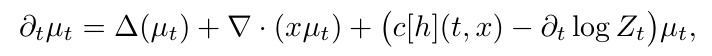

for an appropriate choice of $c [ h ]$ (Lemma 3).

Step 2. Specializing to the DPS tilt $h _ { t } = e ^ { R _ { y } \circ \hat { x } _ { t } }$ and using the Kolmogorov backward equation for the conditional mean $\hat { x } _ { t } ( x ) = \mathbb { E } [ X _ { 0 } \mid X _ { t } = x ]$ , we identify the reaction term as exactly cDP S from (8) (Lemma 4).

Step 3. In Lemma $5 ,$ we use Lemmas 3 and 4 and apply the Feynman-Kac formula Lemma 2 to the resulting evolution equation to obtain an expression for the weights $\frac { \mu _ { y } } { \mu _ { D P S } }$ . Reversing the path integral, in Lemma 6 we recast the path expectation along the DPS reverse SDE (DPS SDE) with the forward OU path measure. □

> 💡 **证明骨架：Theorem 1 三步（Hao 批注）**: 记住这三步就掌握了主定理的证明结构：**Step 1（Lemma 3）**——任何 tilted-prior 路径 $\mu_t=h_t\rho_t/Z_t$ 的演化都是 OU Fokker–Planck + 一个反应项 $c[h]$；**Step 2（Lemma 4）**——把 $h_t=e^{R_y\circ\hat x_t}$ 代入，用 $\hat x_t$ 满足的 Kolmogorov backward 方程做**关键消去**，反应项恰好化简成 Eq (8) 的 $c_{DPS}$；**Step 3（Lemma 5、6）**——对 surrogate 与 algorithm 两条路径套 Lemma 2 的 FK，得权重 $\omega$，并用 Anderson 反演把沿 DPS-SDE 的期望换成沿 OU 的期望（两种表示的等价）。

### D.1 Two Tweedie identities and the Kolmogorov backward equation

We collect three facts used repeatedly. Throughout, $\rho _ { t }$ denotes the marginal of the OU forward process (2) starting at $X _ { 0 } \sim \rho _ { * }$ , and $\hat { x } _ { t } , \Sigma _ { t }$ are the conditional mean and covariance of $X _ { 0 }$ given $X _ { t }$

(F1) First-order Tweedie. A direct integration of the OU semigroup yields

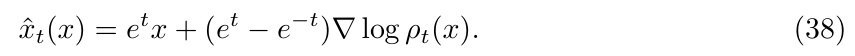

*Eq. (38)：一阶 Tweedie（同 Eq 27）。*

(F2) Second-order Tweedie. Diferentiating (38) in x and using the standard identity $\dot { \Sigma } _ { t } ( \acute { x } ) = ( e ^ { t } - e ^ { - t } ) ^ { 2 } D ^ { 2 } \log \rho _ { t } ( x ) + ( e ^ { t } - e ^ { - t } ) e ^ { t } I$ (which follows from a second-order expansion of the OU posterior, or equivalently from diferentiating Tweedie under Bayes’ rule):

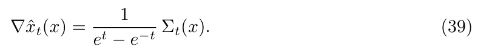

*Eq. (39)：$\nabla\hat x_t=\Sigma_t/(e^t-e^{-t})$，对称半正定。*

In particular, $\nabla \hat { x } _ { t }$ is symmetric and positive semidefinite.

(F3) Kolmogorov backward equation for $\hat { x } _ { t }$ . By Anderson’s reversal [Anderson, 1982b], the time-reversed OU process $\tilde { X } _ { s } : = X _ { T - s }$ satisfies the SDE

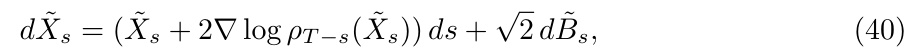

*Eq. (40)：时间反演 OU 过程的 SDE。*

with generator $\tilde { L } _ { t } f : = \Delta f + ( x + 2 \nabla \log \rho _ { t } ( x ) ) \cdot \nabla f$ . Since

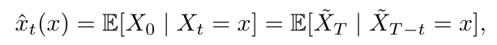

$\hat { x } _ { t }$ is a Kolmogorov backward solution along $\tilde { X }$ , and hence

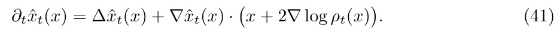

*Eq. (41)：$\hat x_t$ 满足的 Kolmogorov backward 方程——Step 2 的关键消去恒等式。*

> 💡 **公式批读：D.1 的三件武器（Hao 批注）**: 这三条（F1/F2/F3）是 Lemma 4 化简的全部弹药，尤其 **F3 是"关键消去"的核心**。F3 说：$\hat x_t=\mathbb{E}[X_0\mid X_t]$ 作为条件期望，沿时间反演 OU 过程满足 Kolmogorov backward 方程（Eq 41）$\partial_t\hat x_t=\Delta\hat x_t+\nabla\hat x_t\cdot(x+2\nabla\log\rho_t)$。在 Lemma 4 里，$c[h]$ 展开后会出现 $\partial_t\hat x_t-\Delta\hat x_t-\nabla\hat x_t(x+2\nabla\log\rho_t)$ 这一坨——由 Eq (41) 它**恒等于零**，于是 $\nabla R_y$ 的一阶项被彻底消掉，只剩下 $\Sigma_t$ 与 $D^2R_y,\nabla R_y$ 的二次耦合。**没有 F3，$c_{DPS}$ 就不会有那么干净的形式。**

### D.2 Step 1: Evolution of tilted prior paths

**Lemma 3** (Tilted-prior Fokker-Planck). Let $h \in C ^ { 1 , 2 } ( [ 0 , T ] \times \mathbb { R } ^ { d } )$ be positive with $h _ { t } \in$ $L ^ { 1 } ( \rho _ { t } d x )$ , and define the tilted prior path

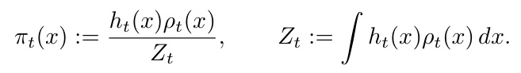

Then $\pi _ { t }$ obeys

*Eq. (42)：tilted-prior 路径的 Fokker–Planck，含反应项 $c[h]-\partial_t\log Z_t$。*

where $L ^ { \dagger } \pi : = \Delta \pi + \nabla \cdot ( x \pi )$ is the OU Fokker-Planck operator and the reaction term is

*Eq. (43)：通用反应系数 $c[h]=\partial_t\log h_t-(2\nabla\log\rho_t+x)\cdot\nabla\log h_t-|\nabla\log h_t|^2-\Delta\log h_t$。*

Proof. Using the product rule and writing $Z _ { t }$ terms as log-derivatives:

Writing $\partial _ { t } h _ { t } = h _ { t } \partial _ { t }$ log $h _ { t }$ and substituting the OU Fokker–Planck equation $\partial _ { t } \rho _ { t } = L ^ { \dagger } \rho _ { t }$

The OU Fokker–Planck operator is $L ^ { \dagger } \rho = \Delta \rho + \nabla \cdot ( x \rho )$ . Using $\Delta \rho _ { t } = \rho _ { t } \big ( | \nabla \log \rho _ { t } | ^ { 2 } + \Delta \log \rho _ { t } \big )$ and $\nabla \cdot ( x \rho _ { t } ) = \rho _ { t } ( d + x \cdot \nabla \log \rho _ { t } )$

Set $\varphi = h _ { t } / Z _ { t }$ so that $\pi _ { t } = \varphi \rho _ { t }$ . We compute $L ^ { \dagger } \pi _ { t } = L ^ { \dagger } ( \varphi \rho _ { t } )$ via the product rule applied to each term of $L ^ { \dagger } = \Delta + \nabla \cdot ( x \cdot )$

Summing, we have

Rearranging to isolate $\varphi L ^ { \dagger } \rho _ { t } \mathbf { ; }$

Since $Z _ { t }$ does not depend on $x ,$ we have $\nabla \varphi = \nabla h _ { t } / Z _ { t }$ and $\Delta \varphi = \Delta h _ { t } / Z _ { t }$ . Substituting $\varphi \rho _ { t } = \pi _ { t } , \nabla \rho _ { t } = \rho _ { t } \nabla \log \rho _ { t } .$ , and $\rho _ { t } / Z _ { t } = \pi _ { t } / h _ { t } .$ , and using the identities $\nabla h _ { t } / h _ { t } = \nabla \log h _ { t }$ and $\Delta h _ { t } / h _ { t } = | \nabla \log h _ { t } | ^ { 2 } + \Delta \log h _ { t } \colon$

Collecting all $\pi _ { t }$ terms:

where the reaction coeficient is

![c[h] final](../images/eq_p16_06.jpg)

> 💡 **引理批读：Lemma 3 = "任何 tilt 都带反应项"（Hao 批注）**: 这是 Step 1 的严格版（对应正文 Lemma 1）。**结论**：任何形如 $\pi_t=h_t\rho_t/Z_t$ 的 tilted-prior 路径，其演化 = OU Fokker–Planck 算子 $L^\dagger$ + 反应项 $(c[h]-\partial_t\log Z_t)\pi_t$。反应系数 $c[h]$（Eq 43）**只依赖 $\log h_t$ 的时间导、空间梯度、Laplacian**。**关键理解**：如果 $h_t$ 是 OU 插值那种"真后验加噪"的 tilt，$c[h]$ 恒为零（无偏）；任何偏离都产生非零 $c[h]$。证明纯是乘积法则 + OU 算子展开，没有技巧，但它把"tilt 的选择"与"偏差的大小"精确挂钩——这是整个框架能量化偏差的根基。

### D.3 Step 2: Specialization to the DPS tilt

**Lemma 4** (Reaction term for the DPS tilt). With $h _ { t } ( x ) = \exp ( R _ { y } ( \hat { x } _ { t } ( x ) ) )$ , so that $\pi _ { t } = { \vec { \mu } } _ { i }$ in (DPS Surrogate path), the reaction $c [ h ]$ from (43) reduces to

*Eq. (44)：DPS tilt 下 $c[h]$ 化简为 $\Sigma_t$ 与 $D^2R_y,\nabla R_y$ 的二次型。*

Equivalently, $c [ h ] ( t , x ) - \partial _ { t }$ log $Z _ { t } = c _ { D P S } ( t , x )$ with

Proof. Set log $h _ { t } = R _ { y } \circ \hat { x } _ { t }$ and apply the chain rule component-wise:

using symmetry of $\nabla \hat { x } _ { t }$ from (39). Substituting into (43) and grouping terms by their dependence on $\nabla R _ { y }$ and $D ^ { 2 } R _ { y }$ , we get the following expression for $c [ h ]$

![c[h] expression](../images/eq_p16_10.jpg)

Grouping the terms of $\nabla R$ together, we have

![c[h] grouped](../images/eq_p16_11.jpg)

By the Kolmogorov backward equation (41), we have $\begin{array} { r } { \partial _ { t } \hat { x } _ { t } - \nabla \hat { x } _ { t } \left( x + 2 \nabla \log \rho _ { t } \right) - \Delta \hat { x } _ { t } = 0 } \end{array}$ This is the key cancellation underlying the bias formula. The remaining contributions are $- | \nabla \log h _ { t } | ^ { 2 }$ and the trace piece of $- \Delta$ log $h _ { t } \colon$

Using (39) to substitute $\nabla \hat { x } _ { t } = \Sigma _ { t } / ( e ^ { t } - e ^ { - t } )$ and pulling out the common scalar factor yields (44). □

> 💡 **引理批读：Lemma 4 = 关键消去（Hao 批注）**: 这是全文最精彩的一步计算，$c_{DPS}$ 的干净形式就在这里诞生。链式法则给出 $\partial_t\log h_t,\nabla\log h_t,\Delta\log h_t$ 三项，代入 Eq (43) 后，把含 $\nabla R_y$ 的一阶项收拢成 $\nabla R_y\cdot[\partial_t\hat x_t-\Delta\hat x_t-\nabla\hat x_t(x+2\nabla\log\rho_t)]$——**由 Kolmogorov backward 方程 (41)，方括号恒为零**（作者原话 "the key cancellation underlying the bias formula"）。于是一阶项全灭，只剩 $-|\nabla\hat x_t\nabla R_y|^2-\text{tr}(\nabla\hat x_t D^2R_y\nabla\hat x_t)$，再用 $\nabla\hat x_t=\Sigma_t/(e^t-e^{-t})$（F2）替换即得 Eq (8) 的 $c_{DPS}$。**物理意义**：一阶 reward 梯度不产生偏差（它被 score drift 正确吸收），**偏差纯粹来自"用点估计 $\hat x_t$ 代替条件分布"时丢失的二阶信息**——即 $\Sigma_t$（方差）× reward 曲率/梯度平方。这从数学上坐实了引言里"Jensen gap ∝ 方差 × 曲率"的直觉。

### D.4 Step 3: Feynman-Kac two ways

We now combine Lemmas 3 and 4 to prove Theorem 1(ii).

**Lemma 5.** The terminal law $\nu _ { y } ^ { D P S } : = \overleftarrow { \nu } _ { T } ^ { D P S }$ of the DPS-SDE (DPS SDE) difers from the true posterior $\mu _ { y }$ by a pointwise multiplicative weight:

The weight ω admits a Feynman–Kac representations in terms of the reaction term cDP S defined in (8):

Proof. Setting $\overleftarrow { \mu } _ { t } : = \overrightarrow { \mu } _ { T - t }$ and applying (42) together with the Anderson identity

gives exactly

*Eq. (45)：DPS surrogate 的反向 PDE，反应项 $-c_{DPS}$。*

with reaction $- c _ { D P S }$ by Lemma 4, which is (DPS Surrogate PDE). By construction, $\overleftarrow { \mu } _ { t } =$ $\vec { \mu } _ { 0 } = \mu _ { y }$ . Equation (45) is the Fokker-Planck equation associated with the DPS reverse SDE

*Eq. (46)：DPS reverse SDE（同 DPS SDE）。*

augmented by a multiplicative reaction $- c _ { D P S }$ . The DPS algorithm itself directly simulates (46) from $Y _ { 0 } \sim \gamma .$ , that is, without the source. This produces a marginal $\smash { \overleftarrow { \nu } _ { t } }$ with $\overleftarrow { \overline { { \nu } } } _ { T } = \mu _ { y } ^ { D P S }$ Efectively, the DPS algorithm solves

*Eq. (47)：DPS 实际求解的无反应 PDE，初值 $\gamma$。*

Two operators (45) and (47) difer only by a multiplicative reaction and an initial condition. They can be related by a Feynman-Kac formula of Lemma 2. The ground truth satisfies $\mu _ { y } ( \dot { x } ) = \overleftarrow { \mu } _ { t } ( x )$ , for any test function $\varphi ( x )$ we have

where we conditioned on the value of $Y _ { T }$ , used the law of total expectation, and the observation $Y _ { T } \sim \overleftarrow { \nu } _ { T }$ . Concretely,

*Eq. (48)：$\mu_y/\mu_y^{DPS}$ 的 backward FK 表示，边界因子 $\vec\mu_T/\gamma$ 修正初值失配。*

The boundary factor $\vec { \mu } _ { T } / \gamma$ accounts for the mismatch between $\overleftarrow { \nu } _ { 0 } ^ { G T } = \overrightarrow { \mu } _ { T }$ and $\overleftarrow { \mu } _ { 0 } ^ { D P S } =$ γ. □

> 💡 **引理批读：Lemma 5 = 组装 backward 表示（Hao 批注）**: 把前两步组装成 Theorem 1(i)。**核心观察**：真后验对应的反向 PDE（Eq 45，带 $-c_{DPS}$ 源项）与 DPS 算法实际跑的 PDE（Eq 47，无源项）**只差一个乘性反应项 + 一个初值**（真解从 $\vec\mu_T$ 起，DPS 从 $\gamma$ 起）。对这一对套 Lemma 2 的 FK，用 test function + 全期望律，即得 $\mu_y=\omega\mu_y^{DPS}$，其中 $\omega$ 是沿 DPS-SDE 条件到终点的 $\exp(-\int c_{DPS})$ 期望，外加边界修正因子 $\vec\mu_T/\gamma$（补偿两者起点不同）。**这就是 Eq (10) 的来源**——偏差 = 丢掉的反应项沿采样轨迹的累积。

The formula for the weight using OU, can now be derived using Anderson the time reversal of SDEs. For clarity and brevity, we instead provide a derivation using PDE satisfied by the ratio of the algorithmic path to the PDE for the ratio of the algorithmic path to the surrogate path. As in Surrogate Path and Algorithm Path we here define

and for $0 \leq t \lt T$ , as in A define the density ratio $\psi _ { t } ( x )$

*Eq. (49)：$\psi_t\overleftarrow\mu_t=\overleftarrow\nu_t$，密度比。*

noting lim $\begin{array} { r } { { } _ { t \to T } \psi _ { t } = \psi _ { T } = \frac { 1 } { \omega ( x ) } } \end{array}$ as in (11).

**Lemma 6.** The ratio $\psi _ { t } ( x )$ solves the parabolic initial value problem,

and thus, by Feynman-Kac formula, with $t < T$

*Eq. (50)：$\psi_t$ 的 forward FK 表示（沿 OU 过程，积 $+c$）。*

Taking the limit $t \to T$ yields the statement of Theorem 1 with $\begin{array} { r } { \frac { 1 } { \omega ( x ) } : = \psi _ { T } ( x ) } \end{array}$ as the ratio.

Proof. The following calculations are justified classically, since for $t < T$ , both $\overleftarrow { \mu } _ { t } ( x )$ and $ { \cal D } _ { t } ^ { p s } ( x )$ are smooth, positive densities. Note log $\psi _ { t } = \log \overleftarrow { \nu } _ { t } - \log \overleftarrow { \mu } _ { t } ,$ , using (45) and (47) we have

Taking the diference and completing the square shows

*Eq. (51)：$\partial_t\log\psi_t$ 的抛物方程。*

Applying the Cole-Hopf transformation $( \log \psi _ { t } \stackrel { \exp ( \cdot ) } { \mapsto } \psi _ { t } )$ obtains (51). Finally, applying Feynman-Kac to an initial-value problem (rather than terminal-value) induces time-reversal of the multiplier $c _ { T - t + s } ^ { D P S } ( X _ { s } )$ in the path-functional. □

> 💡 **引理批读：Lemma 6 = forward 表示（对偶）（Hao 批注）**: Lemma 5 给的是沿 DPS-SDE 的 backward 表示（Eq 10），Lemma 6 给出**对偶的 forward 表示**（Eq 11/50）——沿正向 OU 过程、从 $X_0=x$ 出发、积 $+c_{DPS}$ 得到 $1/\omega$。技术上：直接对密度比 $\psi_t=\overleftarrow\nu_t/\overleftarrow\mu_t$ 写 PDE（避免显式做 SDE 时间反演），用 Cole–Hopf 线性化，再对**初值问题**（而非终值问题）套 FK——这一步导致乘子 $c$ 的时间被反演，从而 backward 的 $-\int c$ 变成 forward 的 $+\int c$。**两种表示等价但用途不同**：backward（Eq 10）适合"给定 DPS 样本，估其权重"（做重要性纠偏）；forward（Eq 11）适合"给定后验点 $x$，问 DPS 采不采得到"（做 over/under 诊断，Fig 2(c) 就是用它算的）。

## E Early Guidance Stopping, Proof of Theorem 2

*Algorithm 2: DPS with Early Guidance Stopping。与 Algorithm 1 唯一区别在第 7-11 行：只有当 $i\gt i_{stop}$ 时才施加 reward guidance，之后只用 prior score 去噪。*

The output Algorithm 2, up to discretization error, is characterized in the following result.

**Theorem 2.** [Early Guidance Stopping] If guidance is stopped at time $t _ { s t o p } = T - t _ { * }$ , the output of the DPS algorithm is given by

where

with

where $\eta _ { t }$ is annealing schedule (15) and $\alpha \gt 0$ is a hyper-parameter.

Proof. We apply (Surrogate Path) to the annealed path (14):

By Lemma 3, the reverse equation reads

where $R ( x ) = \lVert A ( x ) - y \rVert _ { 2 }$ for the (possibly non-linear) observation operator A.

The corresponding algorithmic SDE (Algorithm Path) with early stopping at time $t _ { \mathrm { s t o p } } : =$ $T - t _ { * }$ ∗ is

*Eq. (52)：early-stop 前的算法 PDE，只在 $(0,t_{stop})$ 施加 guidance。*

On $( 0 , t _ { \mathrm { s t o p } } )$ , both $\left. \right.$ and $\smash { \overleftarrow { \nu } } _ { t }$ satisfy the same equation, so Theorem 1 applies directly and yields

Substituting the explicit form of $\overleftarrow { \mu } _ { t _ { \mathrm { s t o p } } }$

*Eq. (53)：$t_{stop}$ 时刻的密度 = 权重 × tilt × 反向 prior。*

On $[ t _ { \mathrm { s t o p } } , T )$ , the SDE for $\left. \right.$ is the unbiased reverse OU equation, started from (53). Setting $s = T - t$ for the corresponding forward time, the Radon–Nikodym derivative of the initial condition with respect to the OU forward marginal $\vec { \rho } _ { t _ { * } }$ is

Applying the Feynman–Kac identity for ratios (Lemma 2),

*Eq. (54)：最终 RN 导数 = 沿 OU 从 $\rho_*$ 出发的 $g_{t_*}$ 期望。*

where $\{ X _ { s } \} _ { s \ge 0 }$ is the OU process started from $X _ { 0 } \sim \rho _ { * }$ . Substituting the expression for $g _ { t _ { * } }$ yields the claim. □

> 💡 **定理批读：Theorem 2 证明的两段式（Hao 批注）**: early-stopping 把时间轴切成两段，证明也分两段处理，这是理解其分布刻画的钥匙：
> - **$(0,t_{stop})$ 段（还开着 guidance）**：算法与 surrogate 满足同一带反应项方程，**直接套 Theorem 1**，得到 $t_{stop}$ 时刻的偏差权重 $\omega_{t_*}$（Eq 17 的 $w_{t_*}$）——这一段积累了 DPS 的常规偏差，但只积到 $t_*$。
> - **$[t_{stop},T)$ 段（guidance 关掉）**：SDE 退化为**无偏的反向 OU**（只有 prior score），从 (53) 的初值出发。这一段不再引入偏差，只是把"停止时刻那个被 tilt + 加权的分布"用干净 prior 去噪到底。
> - **拼接**：用 Lemma 2 的 RN 恒等式（Eq 54）把两段沿 OU 过程接起来，得到最终输出 = prior $\rho_*$ 乘以一个显式权重 $\mathbb{E}_{OU}[w_{t_*}e^{\eta_{t_*}R_y(\hat x_{t_*})}]$。
> 
> **一句话**：early-stop 输出 = "在 $t_*$ 冻结一个（有偏、退火加权的）reward tilt，然后用无偏 prior 补完剩下的去噪"。$t_*$ 越小（停得越晚），tilt 越强、越接近满约束但越不稳；$t_*$ 越大（停得越早），越接近纯 prior。**这正是我们校准协议里必须扫描并报告的一个自由度。**

## F Time discretization of DDPM

To establish the correspondence between the discrete variance schedule $\beta _ { i }$ used in Denoising Difusion Probabilistic Models (DDPM) Ho et al. [2020] and the continuous time steps $\Delta t _ { i }$ of the underlying Ornstein-Uhlenbeck (OU) process, we compare their respective transition kernels.

The forward Markov jump process in DDPM defines the transition from step i to $i + 1$ as:

*Eq. (55)：DDPM 前向转移核。*

The continuous-time reverse SDE under consideration is given by:

*Eq. (56)：连续时间 OU。*

For a finite time increment $\Delta t _ { i }$ , the exact solution to this SDE yields the transition:

*Eq. (57)：OU 的精确有限步转移。*

For the discrete Markov chain to exactly discretize the continuous SDE, the coeficients of the mean and variance must be consistent across regimes:

*Eq. (58)：均值/方差系数一致性。*

Solving for $\Delta t _ { i }$ we obtain

*Eq. (59)：$\Delta t_i=-\frac12\ln(1-\beta_i)$。*

The linear noise schedule of DDPM is given by

with the choices $\beta _ { m i n } = 1 0 ^ { - 4 } , \beta _ { m a x } = 0 . 0 2$ , and $N = 1 0 0 0$ steps. Applying the first-order Taylor expansion ln $( 1 - \epsilon ) \approx - \epsilon$ , we obtain the approximately linear relationship between $\Delta t _ { i }$ and $\bar { \beta _ { i } }$ :

*Eq. (60)：$\Delta t_i\approx\frac14\beta_i$。*

Next, we derive a relationship in time between the discrete steps $t _ { i }$ and the continuous time t by summing over the increments:

*Eq. (61)：$t_i$ 对增量求和。*

Next, we solve for a function $i ( t )$ that maps continuous time to discrete steps by inverting the quadratic relationship ${ \begin{array} { r l } { { \frac { 1 } { 4 } } \left( 1 0 ^ { - 4 } i + 2 \cdot 1 0 ^ { - 5 } { \frac { i ( i + 1 ) } { 2 } } \right) = t { \mathrm { : } } } \end{array} }$

*Eq. (62)：$i(t)$ 反解。*

This function $i ( t )$ provides a mapping from continuous time t to the corresponding discrete step index i in the DDPM framework, allowing us to understand the time step behavior in the continuum limit. Substituting i(t) into (60), we obtain

*Eq. (63)：$\Delta t(t)$ 的显式表达。*

A naive large-t approximation $\Delta t ( t ) \sim \sqrt { 1 0 ^ { - 5 } t }$ would incorrectly vanish at $t = 0$ . To preserve the nonzero constant floor at the origin, we drop the small −1 term (negligible compared to ${ \sqrt { 1 2 1 } } = 1 1 )$ but keep the constant 121 inside the square root. Pulling the prefactor $\frac { 1 0 ^ { - 5 } } { 4 }$ inside the radical yields the compact form

*Eq. (64)：$\Delta t(t)\approx\sqrt{10^{-5}t+\Delta t_0^2}\approx3\cdot10^{-5}+3\cdot10^{-3}\sqrt t$。*

> 💡 **机制拆解：F 节把退火 $\eta_t$ 落地（Hao 批注）**: 这节看似枯燥的 DDPM↔OU 换算，其实是 Eq (15) 退火 schedule $\eta_t\approx10^5/(1+300\sqrt t)$ 的出处。逻辑：DDPM 的离散步长 $\Delta t_i\approx\frac14\beta_i$（Eq 60），累加反解得连续步长 $\Delta t(t)\approx3\cdot10^{-5}+3\cdot10^{-3}\sqrt t$（Eq 64）。而 Appendix G 会指出 $\eta_t=1/\Delta t(t)$——**退火系数就是"缺失步长"的倒数**。$\Delta t(t)$ 在 $t=0$ 有非零下限 $\Delta t_0\approx3\cdot10^{-5}$，故 $\eta_0\approx1/\Delta t_0\sim10^5$——这就是低温下 guidance 被放大 $10^5$ 倍的量化来源。**要点**：$\zeta_i$ 不含 $\Delta t$ 的工程实现，等价于给 guidance 乘了 $1/\Delta t(t)$，这个巨大的因子正是不稳定的燃料。

## G Forward Euler instability

In terms of implementation, DPS Algorithm 1 integrates the diferent terms of (DPS SDE) in diferent ways. The denoising step, corresponding to the terms $Y _ { t } + 2 \nabla$ log $\rho _ { T - t } ( Y _ { t } ) + \sqrt { 2 } d B _ { t }$ is integrated implicitly via DDPM in Step 6, avoiding numerical instabilities. The bias term $\begin{array} { r } { \alpha \eta _ { t } \frac { \breve { 2 } } { e ^ { t } - e ^ { - t } } \sum _ { T - i } \bar { ( Y _ { t } ) } \breve { \nabla } R _ { y } ( \hat { x } _ { T - t } ( Y _ { t } ) ) } \end{array}$ , however, is integrated explicitly via forward Euler in Step 7. The annealing schedule $\eta _ { t } = 1 / \Delta t ( t )$ in (15) is an auxiliary quantity we introduce to compensate for the missing time step $\Delta t$ in Step 7. In place of $\Delta t$ , the algorithm multiplies by the path-dependent factor

when the reward is $R _ { y } ( x ) = \| A ( x ) - y \| _ { 2 } ^ { 2 }$ . In our analysis, this is equivalent to using the modified reward $R _ { y } ^ { \mathrm { { e f f } } } ( \bar { x } ) = 2 \| A ( x ) - y \| _ { 2 }$ together with the annealing schedule (15).

To derive the oscillations, we assume that the prior $\rho _ { * }$ is a smooth distribution supported on a smooth lower-dimensional manifold $\mathcal { M } \subset \mathbb { R } ^ { \bar { d } }$ embedded in the ambient space. In the limit $t \to 0 ^ { + }$ ，

where $P _ { \mathcal { M } }$ denotes the orthogonal projection onto $\mathcal { M }$ and $P _ { T \mathcal { M } _ { P _ { \mathcal { M } } ( x ) } }$ denotes the orthogonal projection onto the tangent space at $P _ { \mathcal { M } } ( x )$ , see Section B.2.1. Consequently, as $t \to 0 ^ { + }$ ， the bias guidance is well-approximated by a flow on $\mathcal { M }$

where $P _ { T \mathcal M _ { Y _ { t } } }$ denotes the orthogonal projection onto the tangent space at $Y _ { t } .$ Taking a forward Euler step of size $\Delta t _ { 0 }$ , the prefactor $1 / \Delta t _ { 0 }$ cancels the step size exactly, so one Euler step corresponds to one full projected-gradient step on $\mathcal { M }$ , independently of $\Delta t _ { 0 }$

Local Lipschitz constant. The local Lipschitz constant of the projected drift on $\mathcal { M }$ scales as

*Eq. (65)：投影 drift 的局部 Lipschitz 常数 $L_{lip}\sim\frac{1}{\Delta t_0}\frac{\sigma_{max}(AP_{TM_Y})^2}{\|AY-y\|_2}$。*

where the residual in the denominator originates from the gradient of the unsquared norm, which renormalizes to unit magnitude as $\breve { Y }$ approaches the constraint.

Stability criterion and inevitable oscillations. Forward Euler stability requires $\Delta t _ { 0 } \cdot L _ { \mathrm { l i p } } \leq 2 .$ , i.e.,

*Eq. (66)：稳定判据 $\sigma_{max}(AP_{TM_Y})^2\le2\|AY-y\|_2$，逼近约束时右端 $\to0$ 必被违反。*

As Y approaches the constraint set $\{ Y : \mathcal { A } Y = y \}$ , the right-hand side tends to zero while the left-hand side depends only on A and the local geometry of $\mathcal { M } .$ . The criterion is therefore inevitably violated near the constraint. This is the standard pathology of forward Euler applied to the unsquared norm: the gradient does not vanish as the residual shrinks, but merely renormalizes to unit magnitude along $\mathcal { A } ^ { \top } ( \mathcal { A } Y - y ) / \| \mathcal { A } Y - y \| _ { 2 }$ . The iteration overshoots and oscillates around the constraint, and no choice of step size can restore stability/convergence. We note that these oscillations occur only parallel to the data manifold. Implicit integration of the bias drift, as in Rout et al. [2025], avoids these numerical instabilities.

> 💡 **机制拆解：G 节 = 不稳定的显式证明（Hao 批注）**: 这节把 Section 5 的"必然振荡"落成不等式。核心链条：
> 1. **积分不对称**：去噪项隐式（稳），bias 项显式 forward-Euler（不稳）。
> 2. **步长被抵消**：$\eta_t=1/\Delta t(t)$，低温 $\eta_0\sim1/\Delta t_0$，一步 Euler 恰好等于一次完整的投影梯度步，**与 $\Delta t_0$ 无关**——所以"调小步长"救不了。
> 3. **Lipschitz 爆炸**：$L_{lip}\sim\frac{1}{\Delta t_0}\frac{\sigma_{max}(AP_{TM})^2}{\|AY-y\|_2}$，逼近约束时分母 $\|AY-y\|_2\to0$，$L_{lip}\to\infty$。
> 4. **判据必违反**：稳定要求 $\Delta t_0 L_{lip}\le2$ 即 $\sigma_{max}(AP_{TM})^2\le2\|AY-y\|_2$（Eq 66），右端 $\to0$、左端只依赖 $A$ 与流形几何（不 $\to0$），故必然违反。
> 5. **振荡限于切向**：因 $\nabla\hat x_t\to P_{TM}$（B.2.1），bias 梯度被投影到切空间。
> 
> **末句是给我们的实操建议**："Implicit integration of the bias drift, as in Rout et al. [2025], avoids these instabilities"——**用隐式积分 bias 项即可根治**（STSL/RB-modulation 就这么做）。对我们盲问题的强约束 σ 估计：宁可隐式积分或 early-stop，也不要用裸 forward-Euler，否则 σ 估计会被切向极限环污染。

## H Empirical Evidence of Instability

Conditional Guidance for MNIST digits We consider the setting of posterior sampling with the MNIST prior. This dataset consists of paired images of handwritten digits and their corresponding labels, denoted $( x , y )$ . We train a simple MLP classifier softmax $( f ( x ) ) \approx \mathbb { 1 } _ { y }$ over the MNIST dataset, and set the reward to be $R \hat { ( } x ) = \| f ( x ) - \mathbb { 1 } _ { k } \|$ for some fixed target k. We run DPS with guidance schedule constant at 0.1. The evolution of $\| f ( x _ { t } ) - \mathbb { 1 } _ { k } \|$ as well as $( f ( x _ { t } ) - \mathbb { 1 } _ { k } ) \cdot \tilde { \mathbb { 1 } }$ is plotted below.

*Figure 4: We plot a projected discrepancy $(f(x_t)-\mathbb{1}_k)\cdot\mathbb{1}$ ((Columns 1 and 3)) and the reward $\|f(x_t)^\top-\mathbb{1}_k\|$ ((Columns 2 and 4)) across t where denoising proceeds from left (most noise) to right (least noise). The second row depicts a close-up plot of just the last 10 steps to highlight the oscillations. (Columns 1 and 2) are run with a constant guidance schedule Algorithm 1, while (Column 3 and 4) are run with early guidance stopping Algorithm 2 with parameter $i_{stop}=100$.*

> 💡 **Figure 4 批读（Hao 批注）**: 这是不稳定与 early-stop 效果的直接对比实验。四列两行：
> - **Column 1-2（标准 DPS，Algorithm 1）**：reward 轨迹在低温段（右侧 $t\to0$）持续大幅振荡；第二行放大最后 10 步，锯齿状振荡清晰可见（$\delta_t\approx-\delta_{t-1}$ 的周期-2 极限环）。
> - **Column 3-4（early-stop，$i_{stop}=100$）**：$i_{stop}$ 之后 guidance 关闭，低温段振荡消失、轨迹平滑收敛；但注意 reward **不再被拉到 0**（约束满足度下降）——这正是 Theorem 2 说的"用约束满足换稳定"的可视化。
> 
> **量化验证了 Section 5 的两个 claim**：(1) 振荡是 guidance 引起的（关掉即消失）；(2) early-stop 是稳定-约束的折中，不是免费午餐。

*Figure 5: Top Are plots associated to the standard DPS algorithm Algorithm 1, Top Left We plot $\alpha_t=(\mathcal{P}_t^{:k}\delta_t)\cdot(\mathcal{P}_t^{:k}\delta_{t-1})$ along the DPS trajectories for a constant guidance schedule $\zeta=0.1$. Top Middle A close-up of steps $525\to500$. Top Right A close-up of steps $25\to0$. Note that $\alpha_t$ is close to 0 at the intermediate noise levels, but drops to $\approx-1$ towards the low noise levels. Bottom Are the same plots associated to Algorithm 2 with $i_{stop}=100$. We observe that $\alpha_t$ remains close to 0 both at intermediate noise levels and low noise levels.*

We see a distinct oscillatory pattern is sustained throughout the trajectory when the guidance schedule is constant Algorithm 1. Turning of the guidance schedule Algorithm 2 at time-step $i _ { s t o p } = 1 0 0$ eliminates the oscillations in that period, though now the reward is not pulled toward 0. This indicates that the instability is associated with the reward guidance. We see in either case that a softmax applied to the logits of the classifier results in a very high confidence prediction of the correct class despite these oscillations.

We also plot the alignment between consecutive steps of the algorithm $\delta _ { t } = x _ { t } - x _ { t - 1 }$ Because these vectors lie in 784 dimensions, to emphasize the step over step alignment we maintain a subspace described by the most recent $\ell = 5 0$ such steps. In particular, let $\mathcal { P } _ { t } = [ \delta _ { t - \ell + 1 } , \delta _ { t - \ell + 2 } , \cdot \cdot \cdot \delta _ { t } ] \in \mathbb { R } ^ { 7 8 4 \times \ell } ,$ , and let $\mathcal { P } _ { t } ^ { : k }$ denote just the projection onto the top k principle axis. We plot $\alpha _ { t } = ( \mathcal { P } _ { s } ^ { : k } \delta _ { s - 1 } ) \cdot ( \mathcal { P } _ { s } ^ { : k } \delta _ { s } )$ over the trajectory in Fig. 5. For a purely oscillating trajectory, we expect $\delta _ { t } \approx - \delta _ { t - 1 }$ , resulting in $\alpha _ { t } \approx - 1$ . When the $\delta _ { t }$ is “unrelated” to $\delta _ { t }$ , we expect $\alpha _ { t } \approx 0$

All experiments were run in a few minutes on a single NVIDIA H100 GPU.

> 💡 **Figure 5 批读：极限环的定量指纹（Hao 批注）**: 这是最硬核的不稳定证据。作者构造了一个**连续步对齐度** $\alpha_t=\cos(\delta_t,\delta_{t-1})$（在最近 50 步张成的子空间里投影后算内积），其中 $\delta_t=x_t-x_{t-1}$：
> - $\alpha_t\approx-1$ ⟺ $\delta_t\approx-\delta_{t-1}$ ⟺ **纯周期-2 振荡（极限环）**；
> - $\alpha_t\approx0$ ⟺ 相邻步不相关（正常随机去噪）。
> 
> **结果（Top = Algorithm 1）**：中间噪声级 $\alpha_t\approx0$（正常），但低温段（Top Right，步 $25\to0$）$\alpha_t$ 骤降到 $\approx-1$——**确凿证明低温下轨迹进入周期-2 极限环**，与 Section 5/Appendix G 的理论预测完全吻合。**Bottom = Algorithm 2（early-stop）**：$\alpha_t$ 在中间和低温级都保持 $\approx0$，振荡被消除。
> 
> **有意思的旁注**：尽管有振荡，softmax 后分类器仍高置信预测正确类——说明振荡发生在"平行流形的语义无关方向"，不改变类别但会给样本带上像素级伪影（Fig 3 Bottom 的周期性纹理）。**对我们**：这提醒"点估计看起来对"不代表"后验采样对"——振荡会污染不确定性量化（方差/协方差），而这恰是校准最在意的。全实验只需单张 H100 几分钟，复现成本低。

---

## References

> 💡 **参考文献说明（Hao 批注）**: 完整参考文献见原文；下面按主题归类便于检索（详细分组与推荐见 README 的 📊 Citation Landscape）。

- Brian D. O. Anderson. Reverse-time difusion equation models. *Stochastic Processes and their Applications*, 12:313–326, 1982a/b.
- Gautham Govind Anil, Shaan Ul Haque, Nithish Kannen, Dheeraj Nagaraj, Sanjay Shakkottai, Karthikeyan Shanmugam. Fine-tuning difusion models via intermediate distribution shaping, 2026. arXiv:2510.02692.
- Benjamin Boys, Mark Girolami, Jakiw Pidstrigach, Sebastian Reich, Alan Mosca, O. Deniz Akyildiz. Tweedie moment projected difusions for inverse problems, 2024. arXiv:2310.06721.
- Joan Bruna, Jiequn Han. Posterior sampling with denoising oracles via tilted transport, 2024. arXiv:2407.00745.
- Sitan Chen, Sinho Chewi, Jerry Li, Yuanzhi Li, Adil Salim, Anru R. Zhang. Sampling is as easy as learning the score, 2023. arXiv:2209.11215.
- Hyungjin Chung, Byeongsu Sim, Dohoon Ryu, Jong Chul Ye. Improving difusion models for inverse problems using manifold constraints. NeurIPS 2022.
- Hyungjin Chung, Jeongsol Kim, Michael T. McCann, Marc L. Klasky, Jong Chul Ye. Difusion posterior sampling for general inverse problems. ICLR 2023.
- Hyungjin Chung, Jeongsol Kim, Michael T. McCann, Marc L. Klasky, Jong Chul Ye. Difusion posterior sampling for general noisy inverse problems, 2024. arXiv:2209.14687.
- Giannis Daras, Hyungjin Chung, Chieh-Hsin Lai, Yuki Mitsufuji, Jong Chul Ye, Peyman Milanfar, Alexandros G. Dimakis, Mauricio Delbracio. A survey on difusion models for inverse problems. arXiv:2410.00083, 2024.
- Amir Dembo, Ofer Zeitouni. *Large Deviations Techniques and Applications*. Springer, 2nd ed., 2010.
- Prafulla Dhariwal, Alex Nichol. Difusion models beat gans on image synthesis, 2021. arXiv:2105.05233.
- Zehao Dou, Yang Song. Difusion posterior sampling for linear inverse problem solving: A filtering perspective. ICLR 2024.
- Zhengyi Guo, Wenpin Tang, Renyuan Xu. Conditional difusion guidance under hard constraint: A stochastic analysis approach. arXiv:2602.05533, 2026.
- Shivam Gupta, Ajil Jalal, Aditya Parulekar, Eric Price, Zhiyang Xun. Difusion posterior sampling is computationally intractable. ICML 2024, PMLR 235:17020–17059.
- Jonathan Ho, Ajay Jain, Pieter Abbeel. Denoising difusion probabilistic models, 2020. arXiv:2006.11239.
- Jerry Y. Huang, Justin Lin, Sheel Shah, Kartik Nair, Nicholas M. Bofi. How to guide your flow: Few-step alignment via flow map reward guidance. arXiv:2604.27147, 2026.
- Ioannis Karatzas, Steven E. Shreve. *Brownian motion and stochastic calculus*, GTM 113. Springer, 2nd ed., 1991.
- Bahjat Kawar, Michael Elad, Stefano Ermon, Jiaming Song. Denoising difusion restoration models. NeurIPS 2022, 35:23593–23606.
- O. A. Ladyženskaja, V. A. Solonnikov, N. N. Ural’ceva. *Linear and Quasi-linear Equations of Parabolic Type*, AMS, 1968.
- Holden Lee, Jianfeng Lu, Yixin Tan. Convergence for score-based generative modeling with polynomial complexity, 2023. arXiv:2206.06227.
- Ankur Moitra, Andrej Risteski, Dhruv Rohatgi. Steering difusion models with quadratic rewards: a fine-grained analysis, 2026. arXiv:2602.16570.
- Badr Moufad, Yazid Janati, Lisa Bedin, Alain Oliviero Durmus, Randal Douc, Eric Moulines, Jimmy Olsson. Variational difusion posterior sampling with midpoint guidance. ICLR 2025.
- Advait Parulekar, Litu Rout, Karthikeyan Shanmugam, Sanjay Shakkottai. Eficient approximate posterior sampling with annealed langevin monte carlo, 2025. arXiv:2508.07631.
- Aditya Ramesh, Mikhail Pavlov, Gabriel Goh, Scott Gray, Chelsea Voss, Alec Radford, Mark Chen, Ilya Sutskever. Zero-shot text-to-image generation. ICML 2021, 8821–8831.
- Yinuo Ren, Wenhao Gao, Lexing Ying, Grant M. Rotskoff, Jiequn Han. Driftlite: Lightweight drift control for inference-time scaling of difusion models. ICLR 2026.
- H. Robbins. An empirical bayes approach to statistics. Proc. 3rd Berkeley Symp. Math. Statist. Probab., 1956, 1:157–163.
- Robin Rombach, Andreas Blattmann, Dominik Lorenz, Patrick Esser, Björn Ommer. High-resolution image synthesis with latent difusion models, 2022. arXiv:2112.10752.
- Litu Rout, Yujia Chen, Abhishek Kumar, Constantine Caramanis, Sanjay Shakkottai, Wen-Sheng Chu. Beyond first-order tweedie: Solving inverse problems using latent difusion, 2023a. arXiv:2312.00852.
- Litu Rout, Negin Raoof, Giannis Daras, Constantine Caramanis, Alexandros G. Dimakis, Sanjay Shakkottai. Solving inverse problems provably via posterior sampling with latent difusion models. NeurIPS 2023b.
- Litu Rout, Yujia Chen, Nataniel Ruiz, Abhishek Kumar, Constantine Caramanis, Sanjay Shakkottai, Wen-Sheng Chu. RB-modulation: Training-free personalization using stochastic optimal control. ICLR 2025.
- Chitwan Saharia, William Chan, Saurabh Saxena, et al. Photorealistic text-to-image difusion models with deep language understanding. arXiv:2205.11487, 2022.
- Jascha Sohl-Dickstein, Eric A. Weiss, Niru Maheswaranathan, Surya Ganguli. Deep unsupervised learning using nonequilibrium thermodynamics, 2015. arXiv:1503.03585.
- Jiaming Song, Arash Vahdat, Morteza Mardani, Jan Kautz. Pseudoinverse-guided difusion models for inverse problems. ICLR 2023.
- Yang Song, Stefano Ermon. Generative modeling by estimating gradients of the data distribution, 2020. arXiv:1907.05600.
- Yang Song, Jascha Sohl-Dickstein, Diederik P. Kingma, Abhishek Kumar, Stefano Ermon, Ben Poole. Score-based generative modeling through stochastic diferential equations. ICLR 2021.
- Yang Song, Liyue Shen, Lei Xing, Stefano Ermon. Solving inverse problems in medical imaging with score-based generative models, 2022. arXiv:2111.08005.
- S. R. S. Varadhan. Asymptotic probabilities and diferential equations. *Comm. Pure Appl. Math.*, 19(3):261–286, 1966.
- Santosh S. Vempala, Andre Wibisono. Rapid convergence of the unadjusted langevin algorithm: Isoperimetry sufices, 2022. arXiv:1903.08568.
- Luhuan Wu, Brian L. Trippe, Christian A. Naesseth, David M. Blei, John P. Cunningham. Practical and asymptotically exact conditional sampling in difusion models, 2024. arXiv:2306.17775.
- Xingyu Xu, Yuejie Chi. Provably robust score-based difusion posterior sampling for plug-and-play image reconstruction, 2024. arXiv:2403.17042.

---

## 🔖 Appendix 总结

### 核心洞察
1. **A（引擎）**：Lemma 2 用 Cole–Hopf + 鞅把"两路径密度比"变成"沿特征线 SDE 的 $\exp(-\int c)$ 期望"，是 Thm 1/2 的唯一基础。
2. **B（Tweedie + 几何）**：$\hat x_t,\Sigma_t$ 均由 score 及其 Jacobian 给出；$t\to0$ 时 $\hat x_t\to P_{\mathcal{M}}$、$\nabla\hat x_t\to P_{T\mathcal{M}}$——不稳定"平行流形"的几何根源。
3. **D（Thm 1 证明）**：三步——tilted-prior FP（Lemma 3）→ Kolmogorov backward 关键消去得 $c_{DPS}$（Lemma 4）→ backward/forward 两种 FK（Lemma 5/6）。偏差纯来自"点估计代替条件分布"丢失的二阶信息。
4. **E/F/G（Thm 2 + 不稳定）**：early-stop = prior 加权 tilt；退火 $\eta_t=1/\Delta t(t)\sim10^5$ 抵消步长 → forward-Euler 判据必违反 → 切向周期-2 极限环；隐式积分可根治。
5. **H（证据）**：MNIST 上 $\alpha_t\to-1$ 定量确认低温极限环，early-stop 消除之但降低约束满足度。

### 可追问点
- Lemma 2 的正则性假设（Hölder + 二次增长）在真实图像 score（非光滑、流形支撑）上是否成立？
- $\omega$ 的两种 FK 表示在高维的方差如何？forward（Eq 11）比 backward（Eq 10）更适合诊断吗？

