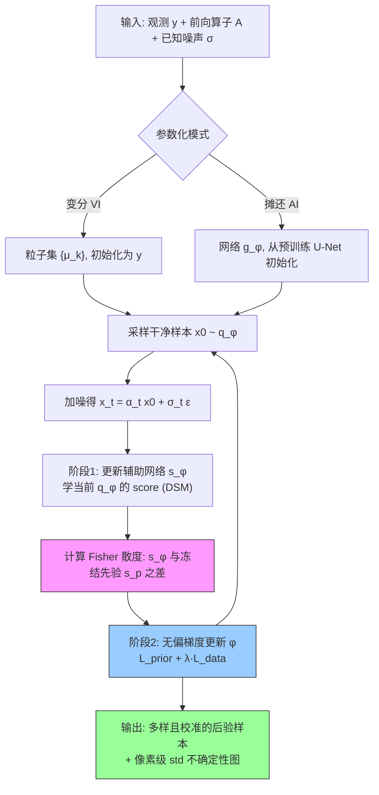

# Unbiased Diffusion Variational Inversion via Principled Posterior Matching (PPM)

**作者**: Weimin Bai\*, Yuxuan Gu\*, Yifei Wang, Weijian Luo, He Sun† (Peking University)
**类型**: arXiv Preprint | **年份**: 2026 | **arXiv**: 2605.25042
**领域**: Computational Imaging · Variational Inference · Amortized Inference · Diffusion Models · Uncertainty Quantification
**链接**: [arXiv abs](https://arxiv.org/abs/2605.25042) · [PDF](https://arxiv.org/pdf/2605.25042) · [Semantic Scholar](https://www.semanticscholar.org/paper/ef2d657d7044863fd89bb7d8eb545af37cece5b2) · [Connected Papers](https://www.connectedpapers.com/main/2605.25042)

> **本课题定位（无偏变分反演）**: 本文从变分角度指出，现有 score-based 反问题方法只是**近似**最小化 KL 散度，这种近似必然导致 mode collapse 与不可靠 UQ；PPM 用"KL = Fisher 散度沿扩散过程积分"这一恒等式实现**精确无偏**优化。它是本课题"样本离散 ≠ 不确定性已校准"论点的直接理论支撑——证明了只有目标层面无偏才能让 $q(x|y)$ 的方差等于真后验方差。

---

## 一句话总结

现有扩散反问题求解器（DPS/RED-Diff/RLSD/DAVI）都在最小化 KL 散度的**有偏近似**（点估计近似 / Dirac 无熵 / 启发式 repulsion / IKL 时间积分），必然 mode collapse 且 UQ 不可信；PPM 回到变分推断第一性原理，用 Fisher 散度积分精确重写 KL 并推导可 SGD 的无偏梯度（Theorem 1），统一粒子化 VI 与摊还 AI 两种范式，在计算摄影、荧光显微、黑洞成像上同时取得高保真、真多模态后验与校准 UQ。

## 核心贡献

1. **诊断**: 首次系统证明现有方法 mode collapse 的病根是"对 KL 散度的近似"，并在 Table I / 第 IV 节逐条给出四种偏差来源——DPS 的 likelihood 近似（违背 Jensen）、RED-Diff 的 Dirac 无熵（退化成 MAP，Eq. 22–23）、RLSD 的代理熵 repulsion、DAVI 的 IKL 时间积分（$\approx\beta D_{\text{KL}}$，等价高温展平先验 $p(x)^\beta$，Eq. 24–25）。
2. **无偏目标**: 用经典结果"KL = Fisher 散度沿扩散过程的积分"（Eq. 13）把不可解的 KL 优化转成可解的 score 匹配，**无任何近似**。
3. **可解梯度**: 推导 Gradient Equivalence Theorem（Theorem 1 / Eq. 14），借 score-projection identity 把对变分 score 的求导替换为可 SGD 的一阶等价梯度；配 LoRA 适配的辅助 score 网络 $s_\phi$ 在线估计 $\nabla\log q_{\varphi,t}$。
4. **统一框架**: 同一无偏目标同时支持粒子化 VI（单观测高保真）与摊还 AI（单步、跨观测、无监督），且距离函数 $d(\cdot)$ 可换成更广的凸距离以推广到更一般的散度族。
5. **实证**: 在 FFHQ/ImageNet 计算摄影 + BioSR 荧光显微超分 + EHT 黑洞 VLBI 成像上，一致超越 DPS/ΠGDM/RED-Diff/RLSD/DAVI，兼顾 fidelity、diversity 与物理合理的 UQ，且无需成对监督。

## 📖 批读导航

| Section | 内容 |
|---------|------|
| [00 - Abstract](sections/00-abstract.md) | 摘要 + 核心论断（近似 KL → mode collapse）+ 本课题关联 |
| [01 - Introduction](sections/01-introduction.md) | 三大范式的偏差诊断 + Fig. 1（2D 后验）+ Table I（偏差账本）|
| [02 - Background](sections/02-background.md) | Bayes 反问题 / 扩散模型 / MC·VI·AI 三路线 + Eq. 1–11 |
| [03 - Method](sections/03-method.md) | 问题定式 + Fisher 积分（Eq. 13）+ Theorem 1（Eq. 14）+ 辅助网络 + 统一目标（Eq. 21）+ Algorithm 1 + Fig. 2 |
| [04 - Theoretical Analysis](sections/04-theoretical-analysis.md) | RED-Diff/RLSD/DPS/DAVI 四种偏差的严格证明（Eq. 22–25）|
| [05 - Experiment](sections/05-experiment.md) | 2D toy + 计算摄影（Table II, Fig. 3/4/5）+ 荧光显微（Fig. 6）+ 黑洞成像（Fig. 7）|
| [06 - Conclusion](sections/06-conclusion.md) | 结论 + 可追问缺口 + References（原文完整保留）|

## 关键数字

| 指标 | 数值 |
|------|------|
| 参考文献数 (S2) | 79 |
| Inpainting Diversity (PPM-VI, FFHQ) | **0.016**（RED-Diff 0.002，高 8×）|
| Box Inpainting PSNR/SSIM (PPM-VI) | **28.73 / 0.97**（全表最高）|
| Motion Deblur PSNR (PPM-AI) | **29.17**（超过所有 VI/MC baseline）|
| SR PSNR (RLSD vs PPM-VI) | 27.28 vs 25.63（RLSD 用 512×512 SD 先验占优）|
| 评测设定 | 64 观测 × 每观测 8 样本（diversity）；FFHQ/ImageNet 各 32 图 @256×256 |
| 黑洞成像后验样本数 | 16 independent PPM samples |
| BioSR 预训练数据 | >10,000 张 256×256 显微超分图（微管/ER/CCP/F-actin）|
| 黑洞先验数据 | ~50,000 张合成黑洞图（InverseBench 协议）|

## 数据流：输入 → 中间表示 → 输出

## 优缺点与还能做什么

### 优点
- **目标层面无偏**: 不靠 Dirac/IKL/repulsion 近似，而是用 KL=Fisher 积分恒等式，理论上样本分布 = 真后验（Fig. 1 在有真后验的 2D 场景直接验证）。
- **诊断清晰可复用**: Table I + 第 IV 节把每个 baseline 的偏差精确归因，是做方法对比时可直接借用的分析框架。
- **统一 VI/AI**: 同一无偏目标兼容高保真单观测采样与快速摊还推断，且**无监督**（不需成对数据），适配科学成像。
- **UQ 与物理一致**: Fig. 6 的 PSF 边界不确定、Fig. 7 的 crescent 结构方差，说明 std map 有物理意义而非任意铺开。

### 局限 / 风险
- **无定量校准证据**: 全篇无 SBC/coverage/CRPS，UQ 可靠性靠 2D toy + 视觉 std map + 定性对比支撑；高维"是否已校准"仍是开放问题。
- **非盲设定**: 前向算子 $\mathcal{A}$、噪声 $\sigma$ 均已知，未触及联合估计算子/gauge 参数 $\varphi$、$\sigma$ 的不确定性。
- **双时间尺度成本与误差**: 辅助网络 $s_\phi$ 需在线学 $\nabla\log q$，其收敛/欠拟合对 UQ 的影响未量化；每步含 $s_\phi$ 训练，比纯 guidance 贵。
- **"精确 KL 却 mass-covering"** 的强主张主要靠 2D 演示，高维严格保证待补。
- **极端 fidelity 场景略逊**: SR 上 PSNR 不敌用高分先验的 RLSD（作者诚实标注）。

### 还能做什么（对本课题）
- **接入盲/半盲设定**: 把 PPM 的无偏目标扩展到 $x,\varphi,\sigma$ 联合后验，做 gauge-aware 联合采样——本课题主线的自然延伸。
- **补定量校准**: 在高维任务上跑 SBC rank 直方图、coverage、CRPS，把"UQ 合理"升级为"UQ 已校准"。
- **量化 $s_\phi$ 误差传播**: 分析辅助 score 估计误差如何影响后验方差的校准。
- **广义散度族**: 利用 $d(\cdot)$ 可换的性质，探索不同散度对 coverage/mode 覆盖的影响。

## 阅读 Q&A 记录

- **Q: 为什么"近似 KL"会导致 mode collapse，而"精确 KL"反而 mass-covering？**
  A: mode collapse 的根因不是 KL 方向，而是**近似方式丢了熵**。RED-Diff 假设 $q=\delta(x-\mu)$ 使熵项梯度为 0，KL 退化成 MAP（Eq. 22–23），只找单峰。PPM 用完整 Fisher 积分（Eq. 13）在 $q$ 自己支撑集上、全扩散时间匹配 score 场，熵信息通过 $s_{q_{\varphi,t}}$ 保留，推动 $q$ 铺开覆盖各 mode。见 [方法节](sections/03-method.md) 与 Fig. 1。

- **Q: PPM 与 score-based guidance（DPS）的根本差别？**
  A: DPS 是**推断时**在 reverse SDE 每步注入近似 likelihood 梯度（Eq. 7，违背 Jensen，误差沿轨迹累积）；PPM 不改 guidance 的 score，而是在**优化/训练目标**层面用无偏 Fisher 目标对齐变分 score 与先验 score。因此 DPS 的多链样本离散度含近似误差，PPM 的样本方差是无偏目标的自然产出。见 [第 IV.B 节](sections/04-theoretical-analysis.md)。

- **Q: DAVI 的 IKL 到底错在哪？**
  A: IKL 积分的是**边际 KL**（含手工权重 $\omega_t$、忽略时间依赖），在 VP + 高斯假设下坍缩为 $\beta D_{\text{KL}}(q\|p)$（$\beta\lt1$），等价优化"高温展平先验 $p(x)^\beta$"，导致 over-smooth + UQ 抑制（Eq. 24–25，Fig. 5 印证）。PPM 积分的是 **Fisher 散度**——KL 的精确等价展开，无温度畸变。

- **Q: 这篇能直接支撑"样本离散 ≠ 校准"吗？**
  A: 能，且是最干净的支撑。RLSD 靠 repulsion 刷高 diversity 却偏离真后验（Fig. 1），证明高多样性可以是"人工的"；RED-Diff diversity 极低（Table II 0.001–0.002）是 collapse 的数字证据。只有目标无偏（PPM）时，多样性才对应真后验方差。但本文未给高维定量校准——"离散≠校准"证实了，"PPM 已校准"未证实。

## 📊 Citation Landscape

> 数据来源: Semantic Scholar API（`ArXiv:2605.25042`，paperId `ef2d657d7044863fd89bb7d8eb545af37cece5b2`）。查询于 2026-07。

**TLDR**: Semantic Scholar 暂未生成 tldr（`tldr.text = null`）。一句话人工概括见上方"一句话总结"。

**引用统计**:

| 指标 | 数值 |
|------|------|
| 参考文献数 (referenceCount) | 79 |
| 被引次数 (citationCount) | 0（2026 新预印本，尚未累积引用）|
| Influential Citations | 0 |

### 参考文献分组（按主题，每组 Top 5，按被引数排序）

**A. 扩散模型基础（score-based / SDE / 加速）**

| 论文 | 年份 | 被引 | arXiv |
|------|------|------|-------|
| Denoising Diffusion Probabilistic Models (DDPM) | 2020 | 32814 | 2006.11239 |
| High-Resolution Image Synthesis with LDM | 2021 | 26033 | 2112.10752 |
| Diffusion Models Beat GANs on Image Synthesis | 2021 | 12381 | 2105.05233 |
| Score-Based Generative Modeling through SDE | 2020 | 11362 | 2011.13456 |
| Deep Unsupervised Learning using Nonequilibrium Thermodynamics | 2015 | 10320 | 1503.03585 |

**B. 扩散解反问题（后验采样 / PnP / guidance）**

| 论文 | 年份 | 被引 | arXiv |
|------|------|------|-------|
| Diffusion Posterior Sampling (DPS) | 2022 | 1737 | 2209.14687 |
| Pseudoinverse-Guided Diffusion Models (ΠGDM) | 2022 | 580 | — |
| Denoising Diffusion Models for Plug-and-Play Restoration | 2023 | 447 | 2305.08995 |
| Practical & Asymptotically Exact Conditional Sampling | 2023 | — | — |
| InverseBench: Benchmarking PnP Diffusion Priors (黑洞实验协议) | 2025 | — | 2503.11043 |

**C. 变分推断 / score 蒸馏 / 散度匹配（PPM 直接技术来源）**

| 论文 | 年份 | 被引 | arXiv |
|------|------|------|-------|
| Variational Inference: A Review for Statisticians | 2016 | 5799 | 1601.00670 |
| DreamFusion: Text-to-3D using 2D Diffusion (SDS) | 2022 | 3698 | 2209.14988 |
| Maximum Likelihood Training of Score-Based Models (KL=Fisher 积分依据) | 2021 | 920 | 2101.09258 |
| One-Step Diffusion with Distribution Matching Distillation (DMD) | 2023 | 913 | 2311.18828 |
| Diff-Instruct: Universal Knowledge Transfer (IKL 来源) | 2023 | — | — |

**D. 数据集 / backbone**

| 论文 | 年份 | 被引 | arXiv |
|------|------|------|-------|
| ImageNet: A Large-Scale Hierarchical Image Database | 2009 | 74477 | — |
| A Style-Based Generator Architecture (StyleGAN, FFHQ) | 2018 | 13211 | 1812.04948 |
| Photorealistic Text-to-Image Diffusion (Imagen) | 2022 | 8587 | 2205.11487 |
| Elucidating the Design Space of Diffusion Models (EDM) | 2022 | 3628 | 2206.00364 |
| DPM-Solver: Fast ODE Solver | 2022 | 2450 | 2206.00927 |

**E. 科学成像 / 经典反问题（应用场景）**

| 论文 | 年份 | 被引 | arXiv |
|------|------|------|-------|
| Compressed Sensing MRI | 2008 | 2351 | — |
| Iterative Methods for Total Variation Denoising | 1996 | 1244 | — |
| Tomographic Phase Microscopy | 2008 | 790 | — |
| Ensemble Kalman Methods for Inverse Problems | 2012 | 457 | 1209.2736 |
| DNNs for Image Super-Resolution in Optical Microscopy (BioSR) | 2021 | 408 | — |

### 推荐相关论文（Recommendations API，10+ 篇）

| 论文 | 年份 | arXiv |
|------|------|-------|
| ShuffleFlow: Scalable Posterior Inference for Bayesian Inverse Imaging | 2026 | 2606.21099 |
| Stage-wise Distortion-Perception Traversal in Zero-shot Inverse Problems | 2026 | 2605.28711 |
| Learning Normalized Energy Models for Linear Inverse Problems | 2026 | 2605.15487 |
| VarFlow: Variational Distillation Through Score-Rule Matching | — | — |
| Stochastic Optimal Control Sampling for Diffusion Inverse Problems | 2026 | 2606.28785 |
| Latent Diffusion Posterior Sampling with Surrogate Likelihood Guidance | 2026 | 2606.26592 |
| A Stabilized Path-Space Approach to Diffusion-Based Posterior Sampling | 2026 | 2606.12710 |
| Image Restoration via Diffusion Models with Dynamic Resolution | 2026 | 2605.14267 |
| Exact Posterior Score Estimation for Solving Linear Inverse Problems | 2026 | 2606.17048 |
| Diffusion Graph Posterior Sampling for Nonlinear Inverse Problems | 2026 | 2605.19621 |
| Bayesian Tensor Decomposition with Diffusion Model Prior | 2026 | 2606.03212 |
| UOTIP: Unbalanced Optimal Transport Map for Unpaired Inverse Problems | 2026 | 2605.21094 |

> 💡 **谱系批注 (Hao 批注)**: 推荐列表几乎全是 2026 年的扩散反问题后验采样新作（ShuffleFlow、Stochastic Optimal Control Sampling、Exact Posterior Score Estimation 等），说明"扩散先验下的无偏后验采样 + UQ"正是当前活跃前沿，与本课题高度重合。参考文献 C 组是 PPM 的技术命脉——通讯作者 Weijian Luo 的 Diff-Instruct/SIM/DMD 系列提供了"无偏 score 散度匹配"的工具，本文把它从"扩散蒸馏"迁移到"反问题后验采样 + UQ"。B 组是被本文逐条证伪的 baseline 谱系。
