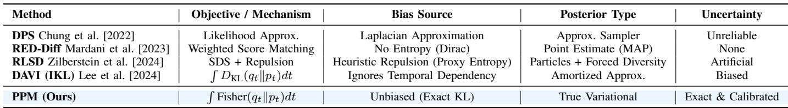

[← 返回 README](../README.md)

# I. Introduction

## 📌 预览

引言把"用扩散先验解反问题的三大范式"逐一拆开并指出各自的偏差来源：(1) gradient-guided MC（DPS）——用点估计近似不可解的时间依赖 likelihood，轨迹不稳、后验有偏；(2) optimization VI（RED-Diff/SDS）——隐式假设变分分布是 Dirac delta，丢掉了熵项，理论上退化成 MAP，导致 mode-seeking；(3) amortized（DAVI）——依赖成对监督且用 IKL 这一启发式近似代替精确 KL。作者由此提出 PPM：用"KL = Fisher 散度沿扩散过程的积分"这一经典结果，把不可解的 KL 优化转成可解的 Fisher 积分优化，并证明它内在地鼓励 mass-covering，从根源上缓解 mode collapse。Table I 系统对比了各方法的偏差来源。

---

$\pmb { \mathcal { A } } ( \pmb { x } ) + \pmb { \eta } .$ , where A is a linear or nonlinear, ill-posed forward operator, and η denotes measurement noise. Computational imaging finds applications in diverse scientific fields such as astronomy Chael et al. [2019], optical microscopy Choi et al. [2007], medical imaging Lustig et al. [2008], and fluid dynamics Iglesias et al. [2013]. A crucial aspect of imaging in this context is the incorporation of an image prior, or so-called regularization, to guide the reconstruction towards desired image characteristics. From a Bayesian perspective, the prior shapes the posterior distribution, namely the uncertainty and diversity, of the reconstructed images. Classical methods impose handcrafted priors on x—for example, sparsity Candes and Romberg [2007], total variation (TV) Vogel and Oman [1996], or wavelet-based regularizers—to constrain the solution space. While effective in some settings, these analytical priors usually fail to capture the rich statistics of natural or scientific images.

> 💡 **问题设定 (Hao 批注)**: 开头这句被 MinerU 截断的公式其实是标准反问题模型 $y = \mathcal{A}(x) + \eta$：观测 $y$ 由前向算子 $\mathcal{A}$（线性或非线性、病态）作用于真值 $x$ 再叠加噪声 $\eta$ 得到。从 Bayes 视角看，先验 $p(x)$ 直接塑造后验 $p(x|y)$ 的**不确定性与多样性**——这句话是全文的价值观：先验的作用不只是"选一个好解"，而是"定义整个解空间的分布"。传统手工先验（稀疏、TV、小波）无法刻画自然/科学图像的丰富统计，所以要换成扩散先验。

Recent advances in generative AI have established diffusion models Ho et al. [2020], Sohl-Dickstein et al. [2015], Song et al. [2020] as powerful, data-driven image priors. A diffusion model learns to approximate the distribution of clean images by progressively adding noise (the forward process) and then training a neural network to reverse this corruption through denoising (the reverse process). When integrated into inverse problem solvers, diffusion priors not only yield high-quality point estimates but also facilitate full posterior exploration for uncertainty quantification, a capability crucial in scientific and medical imaging applications.

Existing approaches for posterior sampling from p(x|y) with a pretrained diffusion prior primarily fall into three categories: gradient-guided Monte Carlo sampling, optimizationbased variational inference, and amortized inference. The first category comprises gradient-guided Monte Carlo (MC) techniques, exemplified by Diffusion Posterior Sampling (DPS) Chung et al. [2022]. DPS iteratively interleaves denoising updates from a score-based model with gradient-driven data-consistency steps within a Markov Chain Monte Carlo (MCMC) framework Brooks et al. [2011]. While this procedure seeks to satisfy both the measurement likelihood p(y|x) and the learned image prior, it enforces data consistency by approximating the intractable time-dependent likelihood with strong assumptions. This often results in unstable sampling trajectories and biased posterior estimates. Moreover, these methods remain inherently inefficient, as their sequential nature incurs substantial computational costs during inference.

> 💡 **范式一：DPS 类 guidance 的偏差 (Hao 批注)**: DPS 在 reverse SDE 每步把学到的 score 加上一个数据一致性梯度项，本质是 MCMC。它的偏差来源是**近似那个不可解的时间依赖 likelihood** $p_t(y|x_t)$（用 $\hat{x}_0(x_t)=\mathbb{E}[x_0|x_t]$ 的点估计代入，见第 IV.B 节的 Jensen 违背分析）。对本课题的启示：这类 guidance 即便多跑几条链得到"离散样本"，其离散度是近似误差与步长的产物，不等于真后验方差——这正是"样本离散 ≠ 校准"的第一个反例。

The second category encompasses optimization-based variational inference (VI), such as RED-Diff Mardani et al. [2023] and Score Distillation Sampling (SDS) Poole et al. [2022]. These methods typically formulate the inverse problem as optimizing a weighted denoising score matching objective. However, a critical theoretical limitation arises from their implicit assumption of a degenerate variational distribution (e.g., a Dirac delta). Such a point-estimate assumption effectively eliminates the entropy term from the variational objective, theoretically degrading the optimization into Maximum A Posteriori (MAP) estimation rather than probabilistic inference. Consequently, without the entropy term to encourage diversity, the learned posterior suffers from severe modeseeking behavior Luo et al. [2024a] and structural collapse, leading to an underestimation of uncertainty and a failure to capture the complex, multi-modal structure of the posterior.

> 💡 **范式二：VI 的 mode collapse 根因 (Hao 批注)**: 这是本文最核心的诊断，也是本课题最想要的洞察。RED-Diff/SDS 把 VI 目标简化成"加权 denoising score matching"，隐含地假设变分分布 $q(x_0|y)=\delta(x_0-\mu)$ 是一个退化的 Dirac delta。KL 散度 $D_{\text{KL}}(q\|p) = -\mathbb{E}_q[\log p(x|y)] - H(q)$ 里的熵项 $H(q)$ 在 Dirac 下是常数（梯度为 0），于是优化只剩能量项，**在数学上退化为 MAP**——只找最可能的那一个 mode。结果就是 mode-seeking：样本几乎相同，方差被系统性低估。第 IV.A 节会把这个论断写成 Eq. 22–23 的严格推导。

*Fig. 1. Comparison of PPM and diffusion-based VI baselines (RED-Diff and RLSD) on 2D posterior estimation tasks. Priors are multimodal Gaussian mixtures, and observations are linear projections of the 2D latent state, producing inherently multimodal ground-truth posteriors. PPM accurately recovers all modes, whereas RED-Diff suffers from mode collapse, and RLSD exhibits measurement inconsistency (top) or poor prior adherence (bottom).*

> 💡 **Figure 1 批读 (Hao 批注)**: 这是全文的"证据锚点"，也是本课题"样本离散 ≠ 校准"论点的最干净可视化。设定是刻意可控的：2D 隐变量 $x\in\mathbb{R}^2$ 服从多模态高斯混合先验（第 1 列 GT Prior：上排 8-mode 环、下排 4×4 格），观测 $y=Fx+n$ 是线性投影（第 3 列 Data Likelihood 是一条/一斜带），两者相乘得到的真后验（最后一列 GT Posterior）本质是**双峰**的。
> - **RED-Diff（第 4 列）**：所有粒子塌到极少数点上，几乎没有分布——这就是 Dirac 假设丢掉熵项后的 mode collapse，样本"精确但无多样性"。
> - **Pixel-RLSD（第 5 列）**：靠 repulsion 强行拉开粒子，上排样本铺满整条 likelihood 带（measurement 一致但**违背先验**，跑到没有 mode 的地方），下排铺满整条对角线（prior adherence 差）。这说明 repulsion 制造的是"人工多样性"，不是后验方差。
> - **PPM（第 6 列）**：干净地命中真后验的两个峰，既在 likelihood 带上又落在先验 mode 上。
> 关键判读：多样性指标高（RLSD）不代表校准好；这张图证明只有目标无偏（PPM）才能让样本分布 = 真后验。因为这里真后验已知，等价于一次隐式的 coverage 检验。

The third paradigm focuses on amortized inference (AI), represented by methods like DAVI Lee et al. [2024]. These approaches aim to train a feed-forward network to predict the posterior directly for rapid inference.

Though practically useful, DAVI actually deviates from the standard unsupervised inverse problem framework – solving the Bayesian posterior problem – in two critical aspects. First, DAVI typically rely on paired training data, introducing supervised objectives—including pixel-wise reconstruction loss against ground truth and adversarial (GAN) losses—to align the reconstruction network for reconstruction. This reliance on ground truth supervision restricts their applicability in scientific imaging, where obtaining paired data is often impractical. Second, regarding the optimization objective, these methods fail to minimize the exact KL divergence. Instead, they adopt the Integral KL (IKL) divergence proposed in Diff-Instruct Luo et al. [2023], which serves as a heuristic approximation rather than a rigorous variational lower bound. This deviation from exact KL minimization, as well as the dependence on supervision, shifts the training paradigm from sampling from the exact Bayesian posterior distribution to some approximated distribution with a significant bias, which fundamentally limits their ability to provide the reliable, zeroshot generalization required for solving inverse problems with generic priors.

> 💡 **范式三：AI/DAVI 的两个偏移 (Hao 批注)**: DAVI 训练一个前馈网络把 $y$ 直接映射到后验样本，速度快但有两处偏离标准无监督反问题框架：(1) 依赖成对监督（pixel loss + GAN loss），而科学成像往往拿不到 ground truth；(2) 用 IKL（Integral KL，来自 Diff-Instruct）代替精确 KL——IKL 手工引入时间权重 $\omega_t$ 并在扩散全程积分边际 KL，是启发式近似而非严格的变分下界。第 IV.C 节会证明 IKL 等价于对一个"被展平的高温先验" $p'(x)\propto p(x)^\beta$（$\beta\lt1$）做优化，因此后验有偏。对本课题：摊还网络若要用于校准 UQ，必须保证它的训练目标是无偏的——这正是 PPM(AI) 想修的。

To overcome the limitations imposed by the inexact approximations of the KL divergence in existing works Mardani et al. [2023], Zilberstein et al. [2024], we propose Reconstruction Score Matching (PPM). Instead of relying on the delta distribution assumption or IKL objectives, PPM returns to the principled minimization of the exact KL divergence. We achieve this via a classical theoretical result: the Kullback-Leibler divergence can be expanded as the integration of Fisher divergence along the diffusion process. Which leads us to optimize the integral of Fisher divergence rather than the integral of KL divergence in order to sample from the exact Bayesian posterior distribution. Such a problem formulation provides a rigorous theoretical grounding: we prove that minimizing the exact KL via Fisher integration inherently encourages mass-covering behavior, effectively mitigating mode collapse. Furthermore, we demonstrate that this Fisher-based perspective can be naturally generalized to a broader family of divergences via generalized score matching, theoretically unifying existing score-based methods as special cases within our framework. Table I provides a systematic theoretical comparison, summarizing the specific sources of bias in these baselines—ranging from likelihood approximation in DPS to the independence assumption in IKL—and contrasting them with the unbiased nature of PPM. The detailed theoretical analysis of baseline bias is provided in Section IV.

> 💡 **核心思路：KL = Fisher 积分 (Hao 批注)**: 这里是全文的枢纽。经典结果（Song et al. 2021 最大似然扩散训练）表明：两个分布的 KL 散度可以写成它们 score 之差的平方（Fisher 散度）沿扩散过程时间的积分。这个恒等式的妙处在于——KL 里含有不可解的 $\log q(x)$（归一化常数、熵），而 Fisher 散度只需要 score $\nabla_x \log q$，后者可以用一个辅助 score 网络学出来。于是"精确最小化 KL"这个不可能的任务被转成"最小化 Fisher 积分"这个可解任务，**没有任何 Dirac/IKL 近似**。作者进一步声称：Fisher 积分天然是 mass-covering（覆盖全部 mode），这是与 mode-seeking 的 reverse-KL 行为的关键区别（虽然 $D_{\text{KL}}(q\|p)$ 通常被认为是 mode-seeking，作者的论点是"精确"优化它 + 用扩散平滑后的 score 差能避免塌缩，具体见方法节 Eq. 13–14）。
>
> 💡 **命名混乱提示 (Hao 批注)**: 注意这段把方法一会儿叫 "Reconstruction Score Matching"，标题和摘要叫 "Principled Posterior Matching (PPM)"。这是同一方法，PPM 是正式名；"Reconstruction Score Matching" 疑似早期草稿残留。全篇缩写统一用 PPM。

To make the Fisher divergence optimization tractable, we derive a novel equivalent gradient formula from the Fisher divergence integral. Unlike prior methods that rely on biased estimators, our derivation yields a precise gradient with respect to the variational parameters, enabling efficient optimization via stochastic gradient descent. In PPM, we model the variational posterior $p ( { \pmb x } | { \pmb y } )$ flexibly to support two paradigms: either as an amortized reconstruction network $\{ \pmb { x } = g _ { \varphi } ( \pmb { z } )$ , z ∼ $\mathcal { N } ( 0 , 1 ) \}$ for rapid, single-step inference, or as an ensemble of image particles $\{ \mu _ { k } \} _ { k = } ^ { K }$ for high-fidelity particle-based VI. To accurately compute the divergence, we introduce an auxiliary score network $s _ { \phi } ,$ adapted from the pre-trained diffusion score $s _ { p }$ via Low-Rank Adaptation (LoRA) Hu et al. [2022], Ryu [2023], which bridges the gap between the variational score and the true posterior score.

> 💡 **数据流预告 (Hao 批注)**: 这段给出了 PPM 的两个"齿轮"——(1) 变分后验 $q_\varphi$ 有两种参数化：摊还网络 $x=g_\varphi(z)$（单步、跨观测）或粒子集 $\{\mu_k\}_{k=1}^K$（单观测、高保真）；(2) 辅助 score 网络 $s_\phi$，用 LoRA 从预训练扩散 score $s_p$ 适配，用来在线估计当前 $q_\varphi$ 的 score $\nabla\log q_{\varphi,t}$。核心 loop 是交替优化 $\phi$（学 $q$ 的 score）和 $\varphi$（更新变分参数），见方法节 Algorithm 1。辅助网络存在的理由：Fisher 散度需要 $\nabla\log q$，而 $q$ 是隐式分布没有解析 score，只能边优化边学。

We evaluate PPM on a comprehensive suite of inverse imaging benchmarks. To ensure robust and comparable assessments, we first validate our method on standard tasks—including image inpainting, super-resolution, and deblurring—using established datasets such as FFHQ Karras et al. [2019] and ImageNet Deng et al. [2009] at $2 5 6 \times 2 5 6$ resolution. Beyond natural images, we rigorously test PPM on two challenging scientific imaging applications: superresolution fluorescence microscopy Qiao et al. [2021] and radio-interferometric imaging of black holes Chael et al. [2019], Sun and Bouman [2021], Sun et al. [2022]. Across all experiments, PPM consistently outperforms leading baselines, including DPS Chung et al. [2022], KL-based VI methods Mardani et al. [2023], Zilberstein et al. [2024], and the amortized approach DAVI Lee et al. [2024]. Crucially, PPM achieves these results without relying on paired training data, delivering superior reconstruction fidelity, markedly greater sample diversity, and more reliable uncertainty quantification.

*TABLE I: THEORETICAL COMPARISON OF OPTIMIZATION OBJECTIVES ACROSS DIFFERENT FRAMEWORKS.*

> 💡 **Table I 批读 (Hao 批注)**: 这张表是全文的"偏差账本"，把每个 baseline 的偏差精确归因，是本课题做方法对比时可直接复用的框架：
> - **DPS**：目标是 likelihood 近似，偏差来自 Laplacian/点估计近似（Jensen 违背），后验类型是"近似采样器"，UQ 不可靠。
> - **RED-Diff**：加权 score matching，偏差来自"无熵项（Dirac）"，退化成 MAP 点估计，UQ = None。
> - **RLSD**：SDS + repulsion，偏差来自"启发式 repulsion（代理熵）"，产出"粒子 + 强制多样性"，UQ 是"人工的"（依赖超参）。
> - **DAVI(IKL)**：目标 $\int D_{\text{KL}}(q_t\|p_t)dt$，偏差来自"忽略时间依赖"，后验是"摊还近似"，UQ 有偏。
> - **PPM(Ours)**：目标 $\int \text{Fisher}(q_t\|p_t)dt$，无偏（精确 KL），"真变分"后验，UQ "精确且校准"。
> 判读要点：这四种偏差（likelihood 近似 / 无熵 / 假 repulsion / 忽略时间依赖）互不相同，但后果一致——UQ 不可信。PPM 的卖点不是某个指标高，而是**目标层面的无偏**。这正对应我们用 SBC/coverage 检验校准时"哪一层引入了偏差"的诊断需求。
