[← 返回 README](../README.md)

# II. Background

## 📌 预览

背景节铺三块地基：(A) 反问题的 Bayes 框架——欠定 + 噪声导致病态，先验约束解空间；(B) 扩散模型作为数据驱动先验，用前向 SDE 加噪、reverse SDE 去噪，score 由网络学出；(C) 扩散模型解反问题的两大路线——MC 采样（DPS 及其近似）与 VI（加权 score matching），以及摊还推断的 IKL 目标。这一节把 Eq. 8–11 逐一列出，正是后面第 IV 节要逐条证伪的"有偏目标"。

---

## A. Computational Imaging Inverse Problems

In general, the inverse problem aims to reconstruct underlying image signals $\pmb { x } \in \mathbb { R } ^ { d }$ from corrupted observations $\pmb { y } \in \mathbb { R } ^ { m }$ , where the image formation process is probabilistically modeled as:

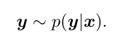

Since the observation are usually under-determined $( m \leq d )$ and observation noise is inevitable, inverse problems in computational imaging are typically ill-posed, with the inverse mapping ${ \textbf { \textit { y } } } \to { \textbf { \em x } }$ being one-to-many. To address this complexity, Bayesian inference framework introduces a prior distribution of underlying images, $p ( { \pmb x } )$ , to constrain the solution space for the image posterior, $p ( { \pmb x } | { \pmb y } )$ , as illustrated by:

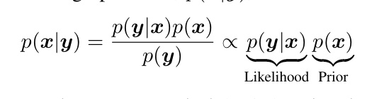

Employing Maximum a Posteriori (MAP) estimation, one can derive a point estimate of the underlying image by maximizing $\log p ( { \pmb x } | { \pmb y } )$ . Alternatively, posterior image samples of reconstructed images can be obtained through methods like Markov Chain Monte Carlo (MCMC) Brooks et al. [2011] or Variational Inference (VI) Blei et al. [2017], Sun and Bouman [2021], Sun et al. [2022]. However, the performance of many computational imaging solvers is limited by their reliance on oversimplified, handcrafted priors such as sparsity Candes and Romberg [2007] and total variation (TV) Vogel and Oman [1996]. These priors fail to capture the true complexity of natural image distributions, hindering the solvers’ ability to achieve high-quality reconstructions.

> 💡 **公式批读：Eq. 1–2 (Hao 批注)**: Eq. 1 是概率化的前向模型 $y\sim p(y|x)$（比确定性的 $y=\mathcal{A}(x)+\eta$ 更一般，容纳非高斯噪声）。Eq. 2 是 Bayes 后验 $p(x|y)\propto p(y|x)p(x)$——likelihood 项管数据一致性，prior 项管解空间约束。关键分岔点在此：从后验里"取一个点"（MAP，$\arg\max\log p(x|y)$）还是"取整个分布"（MCMC/VI）。本文的立场是必须取整个分布才能做 UQ，而 RED-Diff 的偏差恰恰是"名义上做 VI、实际退化成 MAP"。对本课题：欠定 $m\le d$ + 噪声是病态的两个来源，联合估计 $\varphi,\sigma$ 时病态性更强，更需要无偏的后验目标。

## B. Diffusion Models

Diffusion models Ho et al. [2020], Sohl-Dickstein et al. [2015], Song et al. [2020] formulate generation as the reverse of a continuous-time diffusion process defined by a stochastic differential equation (SDE). The forward SDE gradually corrupts data by injecting noise:

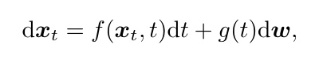

where $t \in [ 0 , T ]$ indexes the diffusion time, $f ( \cdot , t ) : \mathbb { R } ^ { d } \to \mathbb { R } ^ { d }$ controls the drift coefficient, g(t) scales the Brownian motion w, and $\mathbf { \boldsymbol { x } } _ { 0 } ~ \sim ~ p _ { \mathrm { d a t a } }$ . This process gradually transforms data samples into a tractable Gaussian distribution $\pmb { x } _ { T } \sim \mathcal { N } ( \mathbf { 0 } , I )$ The generative process then follows the corresponding reversetime SDE:

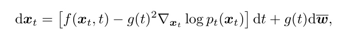

where $\nabla _ { \pmb { x } _ { t } } \log p _ { t } ( \pmb { x } _ { t } )$ is the score function estimated by a neural network $s _ { \theta } ( \pmb { x } _ { t } , t )$ . Training such a neural network usually involves optimizing a score matching objective Song and Ermon [2019]:

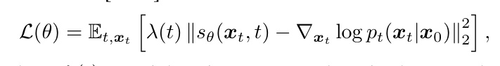

where $\lambda ( t )$ reweights time steps and $p _ { t }$ is the perturbation kernel of the forward process. Once trained, we can plug $s _ { \theta } ( \pmb { x } _ { t } , t )$ into Eq. 4 and sample images from a random noise following Eq. 4 or variants Karras et al. [2022], Li et al. [2025], Lu et al. [2022], Xue et al. [2023]. Supported by solid theories, the diffusion model has successes in a wide range of applications Bai et al. [2025a,b], Chen et al. [2023], Chi et al. [2025], Deng et al. [2024], Janner et al. [2022], Saharia et al. [2022], Ye et al. [2024], Zhang et al. [2023]. In the next section, we will focus on diffusion models for inverse problems.

> 💡 **公式批读：Eq. 3–5 (Hao 批注)**: 标准 score-based 扩散三件套。Eq. 3 前向 SDE 把数据逐步加噪到 $\mathcal{N}(0,I)$；Eq. 4 reverse SDE 用 score $\nabla_{x_t}\log p_t(x_t)$ 去噪生成；Eq. 5 denoising score matching 训练 score 网络 $s_\theta$。这里要记住一个后面反复用的事实：**score 网络学到的是"被扩散平滑后的分布"的 score**。PPM 的关键就是把这套机制从"学先验 $p$ 的 score"扩展到"同时学变分后验 $q$ 的 score"（辅助网络 $s_\phi$），从而能计算 $q$ 与 $p$ 的 Fisher 散度。

## C. Diffusion Model for Inverse Problems

Diffusion models Ho et al. [2020], Sohl-Dickstein et al. [2015], Song et al. [2020], owing to their strong ability to accurately approximate complex image distributions, have emerged as powerful data-driven priors for imaging inverse problems. There are two main categories of diffusion-model–based solvers for imaging inverse problems. The first builds on MCMC sampling Brooks et al. [2011], using score functions to guide gradient-based samplers that steer reconstructions toward the learned image prior. The second employs variational inference frameworks with score distillation sampling (SDS) techniques Mardani et al. [2023], Poole et al. [2022], Zilberstein et al. [2024], enforcing similarity between reconstructed images and the diffusion prior by minimizing the KL divergence between them. Below, we provide an overview of each approach.

a) Monte Carlo sampling methods: After training on large image datasets, a diffusion model provides the unconditional score $\nabla _ { \mathbf { x } _ { t } } \log p _ { t } ( \mathbf { x } _ { t } )$ . Posterior sampling replaces this with the conditional score $\nabla _ { \mathbf { x } _ { t } }$ log $p _ { t } ( \mathbf { x } _ { t } \mid \mathbf { \mu } y )$ during reverse diffusion, via Bayes’ rule:

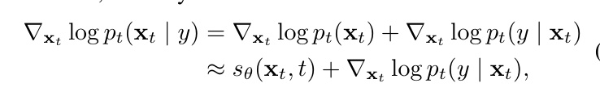

where $s _ { \theta } ( \mathbf { x } _ { t } , t )$ is the learned score network. The principal challenge of posterior sampling lies in approximating the timedependent likelihood term $\nabla _ { \mathbf { x } _ { t } } \log p _ { t } ( y \mid \mathbf { x } _ { t } )$

A popular solution—Diffusion Posterior Sampling (DPS) Chung et al. [2022]—approximates

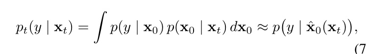

where $\hat { \mathbf { x } } _ { 0 } ( \mathbf { x } _ { t } ) ~ = ~ \mathbb { E } [ \mathbf { x } _ { 0 } ~ | ~ \mathbf { x } _ { t } ]$ . This point-estimate approach is computationally efficient and yields strong empirical performance. Alternative schemes approximate both $p ( \boldsymbol { y } \mid \mathbf { x } _ { 0 } )$ and $p ( \mathbf { x } _ { 0 } \mid \mathbf { x } _ { t } )$ as Gaussians to better capture uncertainty Zhu et al. [2023]. However, most of these approaches assume linear forward models and do not readily extend to nonlinear inverse problems.

> 💡 **公式批读：Eq. 6–7，DPS 偏差的种子 (Hao 批注)**: Eq. 6 用 Bayes 把条件 score 拆成 无条件 score（预训练给出）+ likelihood score $\nabla_{x_t}\log p_t(y|x_t)$，后者不可解。Eq. 7 是 DPS 的补丁：把 $p_t(y|x_t)=\int p(y|x_0)p(x_0|x_t)dx_0$ 近似成 $p(y|\hat{x}_0(x_t))$，即"用后验均值 $\hat{x}_0=\mathbb{E}[x_0|x_t]$ 代入 likelihood"。第 IV.B 节会指出这违背 Jensen 不等式（把 $\mathbb{E}[p(y|x_0)]$ 换成 $p(y|\mathbb{E}[x_0])$），在扩散早期（$x_t$ 噪声大、$p(x_0|x_t)$ 方差大）误差最大且沿轨迹累积。这是 DPS 的 UQ 不可靠的数学根源。

Building on Plug-and-Play (PnP) optimization Graikos et al. [2022], Zhu et al. [2023], stochastic PnP Monte Carlo algorithms—such as Generative PnP (GPnP) Bouman and Buzzard [2023] and PnP Monte Carlo (PMC) Sun et al. [2023]—alternate between data-consistency and prior-refinement steps to approximate the full posterior. Structurally, these methods resemble DPS, but by avoiding point-estimate approximations, they admit theoretical convergence to the true posterior (albeit at a higher cost). Recent advances further improve sampling via Sequential Monte Carlo Cardoso et al. [2023], Dou and Song [2024], Trippe et al. [2022], Wu et al. [2023] or variablesplitting techniques Cai et al. [2025], Chen et al. [2022], Coeurdoux et al. [2024], Hu et al. [2026], Lee et al. [2021], Li et al. [2024], Song et al. [2023], Wu et al. [2024], Xu and Chi [2024], Zhang et al. [2024], and extend applicability to nonlinear inverse problems.

Despite their strengths, Monte Carlo sampling methods still face key limitations: they may require many iterations (leading to high computational cost and slow convergence in high dimensions), their approximation errors can introduce bias, performance often depends sensitively on hyperparameters, and they lack amortized inference for rapid repeated use.

b) Variational inference methods via Weighted score matching objective: Inverse imaging problems are inherently ill-posed, where a single observation y can be consistent with multiple latent ground-truth images $\mathbf { x } _ { \mathrm { 0 } }$ . By combining the measurement forward model with a learned diffusion prior via Bayes’ rule, one can define the posterior distribution $p ( \mathbf { x } _ { 0 } | \pmb { y } ) \propto p ( \pmb { y } | \mathbf { x } _ { 0 } ) p ( \mathbf { x } _ { 0 } )$ . However, directly sampling from this posterior is intractable. Variational Inference (VI) addresses this by approximating the true posterior $p ( \mathbf { x } _ { 0 } | \mathbf { y } )$ with a tractable variational distribution $q ( \mathbf { x } _ { 0 } | \mathbf { y } )$ . The objective is to minimize the Kullback-Leibler (KL) divergence between this variational approximation and the true posterior:

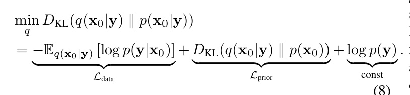

The first term, ${ \mathcal { L } } _ { \mathrm { d a t a } }$ , enforces data fidelity consistent with the forward operator. The core challenge lies in minimizing the second term, ${ \mathcal { L } } _ { \mathrm { p r i o r } }$ , which aligns the variational distribution with the diffusion prior.

> 💡 **公式批读：Eq. 8，VI 目标的正确写法 (Hao 批注)**: 这是"应该优化的"目标：最小化 $D_{\text{KL}}(q(x_0|y)\|p(x_0|y))$，展开成 数据项 $\mathcal{L}_{\text{data}}=-\mathbb{E}_q[\log p(y|x_0)]$ + 先验项 $\mathcal{L}_{\text{prior}}=D_{\text{KL}}(q(x_0|y)\|p(x_0))$ + 常数 $\log p(y)$。注意先验项本身是一个 KL 散度，含 $q$ 的熵，不可解——这就是所有近似方法的下手处。PPM 的做法就是把这个 $\mathcal{L}_{\text{prior}}$ 换成 Fisher 积分（Eq. 13）来精确计算，其余不变。

Existing methods, such as Score Distillation Sampling (SDS) Poole et al. [2022] and RED-Diff Mardani et al. [2023], simplify this optimization by implicitly assuming that the variational posterior $q ( \mathbf { x } _ { 0 } | \mathbf { y } )$ is a degenerate Dirac delta distribution $q ( \mathbf { x } _ { 0 } | \mathbf { y } ) = \delta ( \mathbf { x } _ { 0 } - \pmb { \mu } )$ (or a Gaussian with vanishing variance $\sigma \to 0 )$ centered at the estimated parameters $\mu .$ Under this point-estimate assumption, the entropy term of the variational distribution is effectively discarded. Consequently, the minimization of the KL divergence simplifies to a weighted score matching objective for the point estimate $\textstyle \mu ($

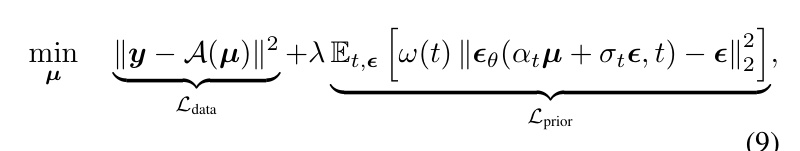

where $\boldsymbol { \mathcal { A } } ( \cdot )$ represents the forward operator, and $\omega ( t )$ is a weighting function (often chosen heuristically based on SNR). While computationally tractable, this formulation represents a **biased approximation** of the true variational objective. By enforcing a degenerate distribution and neglecting the entropy term, the optimization theoretically degrades into Maximum A Posteriori (MAP) estimation. This induces significant optimization bias, manifesting as mode-seeking behavior, where the single estimate $\pmb { \mu }$ fails to capture the necessary diversity and uncertainty of the full solution space.

> 💡 **公式批读：Eq. 9，mode collapse 的公式现场 (Hao 批注)**: 这是 RED-Diff/SDS 实际优化的目标——数据项 $\|y-\mathcal{A}(\mu)\|^2$ + 加权 denoising score matching 先验项，只对单点 $\mu$ 求解。对比 Eq. 8：熵项没了，$q$ 从分布退化成一个点 $\mu$。作者用粗体标注这是 **biased approximation**。判读：Eq. 9 看起来像正规的 VI loss，但因为 $q=\delta(x_0-\mu)$，它数学上等价于 MAP（第 IV.A 节 Eq. 22–23 证明）。这就是本课题最想警惕的陷阱：一个写成"VI/后验采样"形式的目标，可能实际只在求点估计，产出的"多次运行样本"只是优化噪声，不是后验方差。

Several recent methods have adopted Eq. 9 for VI posterior estimation. For instance, Feng and Bouman [2023], Feng et al. [2023] integrate normalizing flows Dinh et al. [2016], Kingma and Dhariwal [2018] with diffusion models for accurate posterior modeling. However, their performance is constrained to lower-dimensional signals $( \mathbf { e . g . , \ 6 4 \times 6 4 } )$ due to inherent limitations in normalizing flow’s scalability. Recently, RED-Diff Mardani et al. [2023] proposes a variational approach that combines the prior loss with a data fidelity term to optimize an estimate of the clean image x. VSS He et al. [2024] manages to adopt the VI approach to solve zero-shot sparse-view CT reconstruction with a latent diffusion model. However, these methods have been observed to usually suffer from mode collapse issues. To address this, RLSD Zilberstein et al. [2024] adds a repulsive penalty between similar reconstructions. Although this increases sample diversity, its empirical assumptions limit gains in full-posterior recovery, and mode collapse remains an issue. Our method aims to fundamentally overcomes these challenges by embedding a score-based divergence distillation loss within a variational inference framework.

> 💡 **RLSD 为何不够 (Hao 批注)**: RLSD 用 particle 之间的 repulsion 来"补回"多样性。但 repulsion 是启发式的斥力，不对应真变分分布的 score，所以它制造的是"人工多样性"（Table I 的 Artificial UQ）——Fig. 1 已直观显示 RLSD 把样本铺满整条 likelihood 带却偏离先验 mode。本课题记住：加 repulsion / 加噪声 / 集成多解都是"事后凑多样性"，无法保证 coverage 校准；只有目标无偏才行。

c) Amortized Inference for Inverse Problems via Integral KL Divergence: Unlike optimization-based methods that solve for a specific instance, amortized inference aims to learn a parametric reconstruction network $\pmb { x } _ { 0 } = g _ { \varphi } ( \pmb { y } )$ that maps observations directly to the posterior samples. Recent approaches like DAVI Lee et al. [2024] adopt the training objective from Diff-Instruct Luo et al. [2023], replacing the standard KL divergence with a heuristic metric known as the IKL divergence. IKL modifies the objective by manually introducing a time-weighting function $\omega _ { t }$ and integrating the marginal KL divergences over the entire diffusion process:

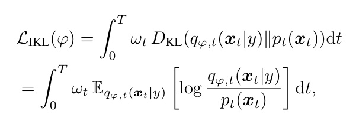

where $q _ { t } ( \pmb { x } _ { t } )$ is the distribution of the generated sample diffused to time t. Assuming the reconstruction network output is deterministic given y (or the implicit distribution is approximated as Gaussian), the marginal distribution $q _ { \varphi , t } ( { \pmb x } _ { t } )$ becomes a Gaussian centered at $\alpha _ { t } g _ { \varphi } ( \pmb { y } )$ . Consequently, its score $\nabla _ { \pmb { x } _ { t } } \log q _ { \varphi , t } ( \pmb { x } _ { t } | y )$ is analytically computable. Following the derivation in Diff-Instruct Luo et al. [2023], the gradient of this objective with respect to the reconstruction network parameters $\varphi$ avoids backpropagation through the frozen score network $p _ { t }$ , and is given by:

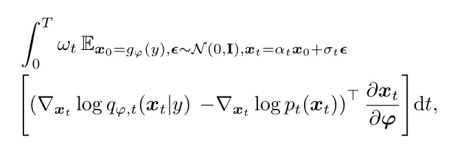

where $\omega _ { t }$ is the weight of different time step t.

While ${ \mathcal { L } } _ { \mathrm { I K L } }$ provides a gradient signal for aligning the reconstruction network with the diffusion prior, it is crucial to note that Eq. 10 is not an exact estimation of the true posterior KL divergence $D _ { \mathrm { K L } } ( q _ { 0 } ( \pmb { x } _ { 0 } | \pmb { y } ) | | p ( \pmb { x } _ { 0 } ) )$ ). The transformation from the original KL to the time-integrated IKL relies on heuristic weighting $\omega _ { t }$ and ignores the temporal dependencies of the diffusion trajectory. This discrepancy implies that minimizing ${ \mathcal { L } } _ { \mathrm { I K L } }$ does not guarantee minimization of the actual variational bound, leading to biased posterior estimation and limited sample diversity compared to exact optimization. Besides the IKL divergence minimization, some other works have studied amortized inference in the context of diffusion acceleration Luo [2023, 2024], Luo et al., 2024a,b, 2025], Wang et al. [2024, 2025], Yin et al. [2024], Zhou et al. [2024a,b].

> 💡 **公式批读：Eq. 10–11，IKL 的偏差 (Hao 批注)**: IKL（Eq. 10）把边际 KL $D_{\text{KL}}(q_{\varphi,t}\|p_t)$ 沿扩散时间加权积分 $\int_0^T\omega_t D_{\text{KL}}(q_{\varphi,t}\|p_t)dt$。Eq. 11 是它对 $\varphi$ 的梯度（Diff-Instruct 式，避开对冻结 score 网络反传）。关键区别对比 PPM：IKL 积分的是**KL**（含手工权重 $\omega_t$、忽略扩散轨迹的时间依赖），而 PPM 积分的是**Fisher 散度**——后者才是 KL 的精确等价展开（Eq. 13）。第 IV.C 节证明：在 VP schedule + 高斯假设下 IKL $\approx \beta D_{\text{KL}}(q\|p)$，$\beta\lt1$，等价于优化一个"高温展平先验" $p(x)^\beta$，所以后验被系统性拉平、多样性受限。这是"积分 KL"与"积分 Fisher"的分水岭，也是本文相对 DAVI 的理论卖点。
