[← 返回 README](../README.md)

# III. Method

## 📌 预览

方法节把摘要的三个承诺落地：(A) 把 VI 目标写成"数据项 + 先验 KL"（Eq. 12）并指出直接优化会 mode collapse；(B) 用 Fisher 散度积分重写先验 KL（Eq. 13），再证明 **Gradient Equivalence Theorem（Theorem 1，Eq. 14）**——把对变分 score 的求导转成一个可用 SGD 优化的等价梯度，配一个用 LoRA 适配的辅助 score 网络 $s_\phi$（Eq. 20）来在线估计 $\nabla\log q_{\varphi,t}$；(C) 给出统一目标 $\mathcal{L}_{\text{PPM}}=\mathcal{L}_{\text{prior}}+\lambda\mathcal{L}_{\text{data}}$（Eq. 21）与交替两阶段训练（Algorithm 1），VI（粒子）与 AI（网络）共用同一套逻辑，且 $d(\cdot)$ 可换成更广的凸距离以推广到更一般的散度族。

---

In this section, we present PPM, a principled framework for posterior recovery in computational imaging inverse problems. PPM introduces a novel score-based divergence guides optimization via an unbiased gradient estimator, which demonstrates unparalleled performance in both variational inference and amortized inference. Unlike the asymmetric mathematical form of KL divergence—whose tendency toward mode collapse limits reliable posterior estimation—our divergence provides a stable, unbiased surrogate objective that extends naturally to amortized settings, where an inference network learns to approximate posterior samples across instances. This formulation enables PPM to enhance both VI-based and AIbased methods, outperforming existing approaches including Score Distillation Sampling (SDS) Poole et al. [2022], RED-Diff Mardani et al. [2023], and Diffusion Prior-Based Amortized Variational Inference (DAVI) Lee et al. [2024].

## A. Problem Formulation

Following Bayes’ rule in Eq. 8, the optimization problem of classical VI-based inverse imaging solvers can be formulated as (neglecting the constant log p(y)):

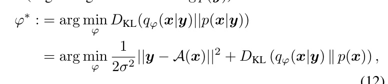

where the first term enforces data fidelity consistent with observations y via the forward model $\boldsymbol { \mathcal { A } } ( \cdot )$ . The second term encourages the variational posterior distribution $q _ { \varphi } ( { \pmb x } | { \pmb y } )$ to align with the prior distribution $p ( { \pmb x } )$ implicitly learned by a pre-trained diffusion model.

However, directly optimizing Eq. 12 with approximate objectives often induces mode collapse. To address this, we replace the standard KL term with a formulation based on the integration of Fisher divergence, which allows for exact and unbiased optimization Song et al. [2021].

> 💡 **数据流·输入端 (Hao 批注)**: Eq. 12 是全文的优化对象 $\varphi^* = \arg\min_\varphi \frac{1}{2\sigma^2}\|y-\mathcal{A}(x)\|^2 + D_{\text{KL}}(q_\varphi(x|y)\|p(x))$。输入：观测 $y$、前向算子 $\mathcal{A}$、噪声方差 $\sigma^2$、预训练扩散先验 $p(x)$（以 score $s_p$ 形式给出）。可学参数：$\varphi$（粒子 $\{\mu_k\}$ 或网络 $g_\varphi$ 的权重）。注意噪声方差 $\sigma^2$ 在数据项分母里是**已知常数**——这是本文的非盲设定，与本课题要联合估计 $\sigma$ 的目标不同。第二项那个先验 KL 就是"不可解、要被 Fisher 积分替换"的地方。

## B. Exact Optimization via Reconstruction Score Matching

We reformulate the KL divergence in Eq. 12 using the integral of the Fisher divergence. This leads to the following exact optimization objective:

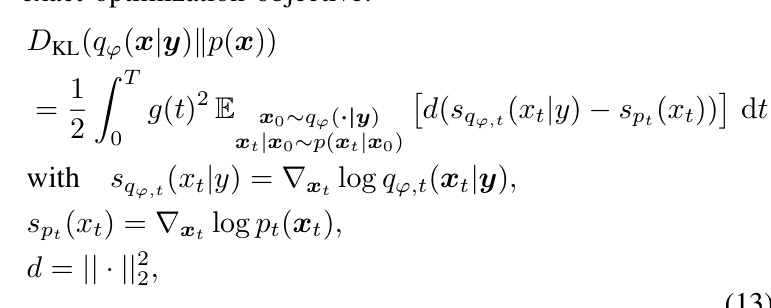

where $q _ { \varphi } ( \pmb { y } )$ denotes sampling from the variational posterior $( \mathrm { e . g . } , x _ { 0 } = \mu ( \pmb { y } ) ) , s _ { p _ { t } } ( \pmb { x } _ { t } )$ and $s _ { q _ { \varphi , t } } ( \pmb { x } _ { t } )$ are the scores of the prior and posterior distribution respectively.

> 💡 **公式批读：Eq. 13，把 KL 换成 Fisher 积分 (Hao 批注)**: 这是全文最关键的一步替换。$D_{\text{KL}}(q_\varphi(x|y)\|p(x)) = \frac{1}{2}\int_0^T g(t)^2 \mathbb{E}[d(s_{q_{\varphi,t}}(x_t|y) - s_{p_t}(x_t))]dt$，其中 $d=\|\cdot\|_2^2$。左边是不可解的 KL（含 $q$ 的熵/归一化），右边只依赖两个 **score 之差**——变分后验 score $s_{q_{\varphi,t}}=\nabla_{x_t}\log q_{\varphi,t}(x_t|y)$ 和先验 score $s_{p_t}=\nabla_{x_t}\log p_t(x_t)$——沿扩散时间 $t$ 积分。为什么无偏：这是恒等式（Song et al. 2021），不是近似；没有 Dirac 假设，也没有 IKL 的手工 $\omega_t$（这里权重 $g(t)^2$ 是 SDE 本身给定的，不是启发式）。为什么 mass-covering：期望是对 $x_0\sim q_\varphi$ 取的，即在**变分分布自己的支撑集上**度量与先验 score 的差异，鼓励 $q$ 铺开去匹配 $p$ 在各处的梯度场，而非只对齐单个 mode。**唯一的技术障碍**：$s_{q_{\varphi,t}}$ 依赖 $\varphi$，直接对它求导要过二阶量——这正是 Theorem 1 要解决的。

Optimizing this objective requires differentiating through the score of the variational distribution, which depends on $\varphi .$ To make this tractable, we derive the following gradient equivalence theorem.

Theorem 1 (Gradient Equivalence Theorem). If distribution $q _ { \varphi } ( { \pmb x } | { \pmb y } )$ satisfies mild regularity conditions, for any score function $s _ { p _ { t } } ( \cdot )$ , the following gradient equivalence holds:

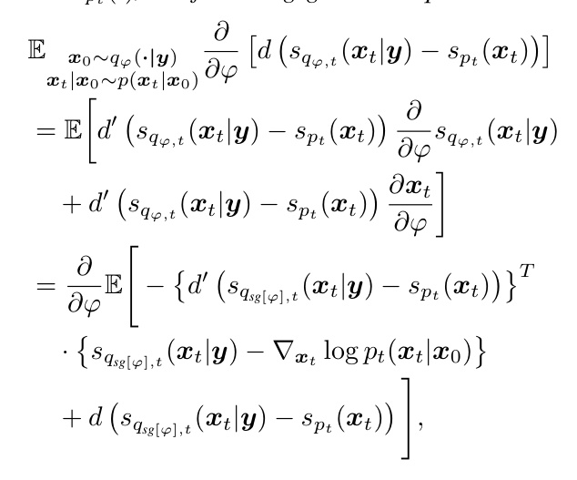

*Fig. 2. Overview of PPM. PPM approximates the posterior by optimizing a variational posterior distribution $q_\varphi$, which is parameterized either by a set of particles or a neural network. The optimization minimizes a loss function composed of a data fidelity term and a novel score-based divergence. This divergence is computed between a pre-trained prior score model $s_\theta$ and an auxiliary score network $s_\phi$, which approximates the score of $q_\varphi$. The parameters of $q_\varphi$ and $s_\phi$ are optimized alternatively.*

> 💡 **Figure 2 批读 (Hao 批注)**: 这张图是 PPM 的数据流全景，按箭头读一遍就理解了整个方法：
> - **左侧输入 $y$**（一张下采样/退化的人脸）分两路参数化 $q_\varphi$：上路 Amortized（网络 $g_\varphi(y,\varepsilon)$ 直接出样本），下路 Variational（一组粒子 $\{\mu_k\}$ 初始化）。
> - **中间**：从 $q_\varphi$ 采出干净样本 $x_0$，加噪 $\epsilon$ 得到 $x_t\sim q_{\varphi,t}$。
> - **右上 Auxiliary Score Network $s_\phi$**：用 score matching loss $\mathcal{L}_{aux}=\|\epsilon_\phi(x_t,t)-\epsilon\|_2^2$ 训练，作用是**在线学出当前变分分布 $q_\varphi$ 的 score**。这是 Fisher 散度能算的前提。
> - **右下 Prior Score Network $s_p$（冻结，雪花标记）**：给出先验 score。
> - **Regularizer loss** $\mathcal{L}_{prior}=D_{\text{KL}}[q_\varphi(x|y)\|p(x)]$ 由 $s_\phi$ 与 $s_p$ 的差算出，**左下 Data fidelity loss** $\mathcal{L}_{data}=\|y-\mathcal{A}(x_0)\|^2$ 由前向算子给出，两者的红色虚线梯度都回流去更新 $q_\varphi$。
> 判读要点：红色虚线（梯度流）和黑色实线（前向流）区分了"谁被更新"。$s_\phi$ 和 $\varphi$ 交替更新——这是本方法的双时间尺度结构，也是它区别于 DPS（推断时 guidance）的地方：PPM 是**训练/优化时**对齐两个 score 场。

## where sg denotes the stop gradient operator.

Proof. The proof is based on the Score-projection identity, which bridges denoising score matching and denoising autoencoders. Let $\pmb { u } ( \cdot , \varphi )$ be a vector-valued function. Using the notations of Theorem 1, under mild conditions, the following identity holds:

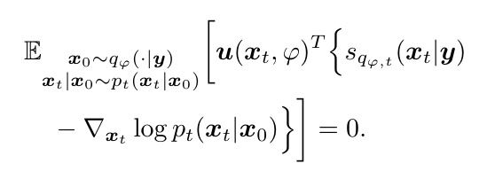

We start by applying the chain rule for the total derivative with respect to $\varphi .$ The function $d ( \cdot )$ depends on $\varphi$ both directly through the score function $s _ { q _ { \varphi , } }$ and indirectly through the distribution $\mathbf { \boldsymbol { x } } _ { t } \sim q _ { \varphi , t }$ (as $\mathbf { \Delta } _ { \mathbf { \mathcal { X } } _ { t } }$ depends on $\pmb { x } _ { 0 } \sim q _ { \varphi } ( \cdot | \pmb { y } ) )$ . This gives two terms:

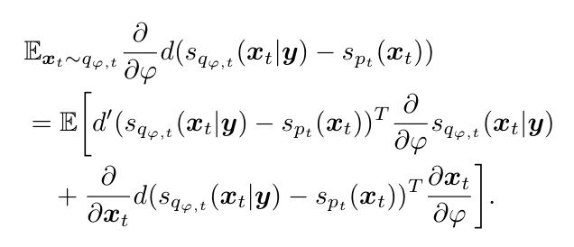

To resolve the first term, we differentiate Eq. (15) with respect to $\varphi .$ . Since the expectation is zero for all $\varphi ,$ its derivative is also zero. We apply the total derivative:

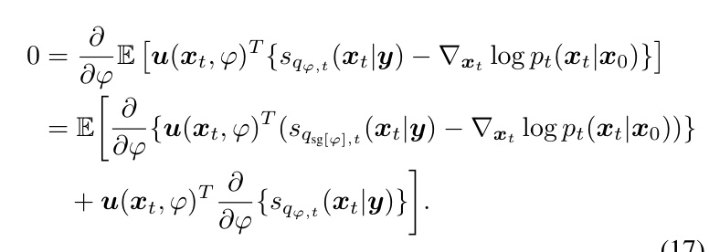

Rearranging the terms yields:

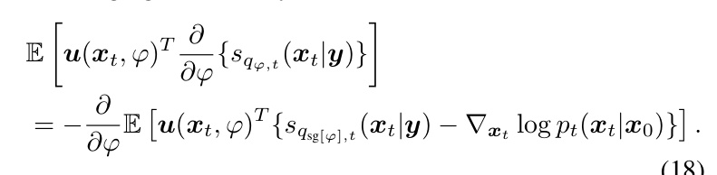

Let ${ \pmb u } ( { \pmb x } _ { t } , \varphi ) = d ^ { \prime } ( s _ { q _ { s \mathrm { g } [ \varphi ] , t } } ( { \pmb x } _ { t } | { \pmb y } ) - s _ { p _ { t } } ( { \pmb x } _ { t } ) )$ . Substituting this specific function u into Eq. (18) allows us to replace the first term in our objective expansion. Furthermore, $\varphi$ does not appear in the differentiation with respect to $\mathbf { \Delta } _ { \mathbf { \mathcal { X } } _ { t } }$ for the second term:

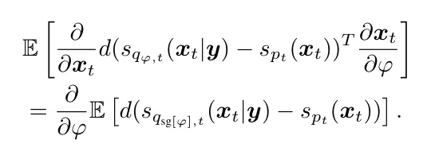

Combining these results yields exactly the Gradient Equivalence Theorem. □

> 💡 **公式批读：Eq. 14–19，Theorem 1 在做什么 (Hao 批注)**: 别被 MinerU 把 Eq. 14 糊成乱码吓到（图片是从 PDF 重截的干净版）。Theorem 1 要解决的痛点：Fisher 目标（Eq. 13）里 $s_{q_{\varphi,t}}$ 依赖 $\varphi$，直接对它求梯度需要过 $\frac{\partial}{\partial\varphi}s_{q_{\varphi,t}}$（一个难算的高阶项）。证明的核心工具是 **Score-projection identity（Eq. 15）**：对任意向量函数 $u$，$\mathbb{E}_{x_t\sim q_\varphi}[u^T(s_{q_{\varphi,t}}(x_t|y)-\nabla_{x_t}\log p_t(x_t|x_0))]=0$——即"变分 score 与去噪 score 之差"在 $q_\varphi$ 下投影到任何方向都为 0。对 $\varphi$ 求导这个恒等式（Eq. 16–18），再选特定的 $u=d'(s_{q_{sg[\varphi]}}-s_{p_t})$，就能把那个难算的 $\frac{\partial}{\partial\varphi}s_{q_{\varphi,t}}$ 项替换掉，最终得到一个**只含一阶量、可 SGD 的等价梯度**（Eq. 14/Eq. 21）。sg 是 stop-gradient。判读：这就是"tractable equivalent gradient form"的兑现——把不可行的精确 KL 优化变成一次可执行的反传，且**无近似偏差**（这是与 SDS/IKL 用有偏估计器的根本区别）。

In Theorem 1, the variational score ${ \pmb { s } } _ { q _ { \varphi , t } } ( { \pmb { x } } _ { t } | { \pmb { y } } )$ is estimated by an auxiliary neural network $\mathbf { \boldsymbol { s } } _ { \phi } ( \mathbf { \boldsymbol { x } } _ { t } , t )$ . This network is trained on the current reconstructions x $\sim q _ { \varphi } ( \cdot | \pmb { y } )$ using a standard denoising score matching objective. We refer to ${ \pmb s } _ { \phi }$ as the auxiliary model, and its training loss is:

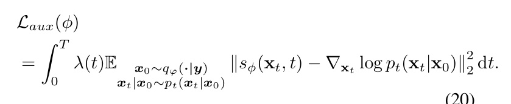

We implement ${ \pmb s } _ { \phi }$ as a copy of the pre-trained model $s _ { p } .$ . This preserves the prior information in $s _ { p }$ while adapting to the conditional distribution $q _ { \varphi , t } ( \pmb { x } _ { t } | \pmb { y } )$ during optimization.

> 💡 **公式批读：Eq. 20，辅助网络怎么学 $q$ 的 score (Hao 批注)**: $s_\phi$ 用标准 denoising score matching（Eq. 20）在**当前重建样本** $x\sim q_\varphi(\cdot|y)$ 上训练，学的是当前变分分布 $q_{\varphi,t}$ 的 score。因为 $q_\varphi$ 是隐式分布（粒子或网络输出），没有解析 score，只能这样边优化边估。$s_\phi$ 初始化为预训练 $s_p$ 的拷贝（LoRA 适配），既保留先验知识又快速适配到条件分布。这是双时间尺度：$s_\phi$ 要追得上 $q_\varphi$ 的变化，否则 Fisher 散度算错。对本课题：这个"在线 score 估计器"是把 UQ 校准做进训练目标的关键组件，但也带来一个隐患——$s_\phi$ 若欠拟合，估的 $\nabla\log q$ 有偏，UQ 校准就打折扣（论文未量化这一误差）。

## C. Unified Optimization Framework

Based on the gradient equivalence in Theorem 1, we formulate the total objective function for PPM as a combination of a data fidelity term and an unbiased prior regularization term:

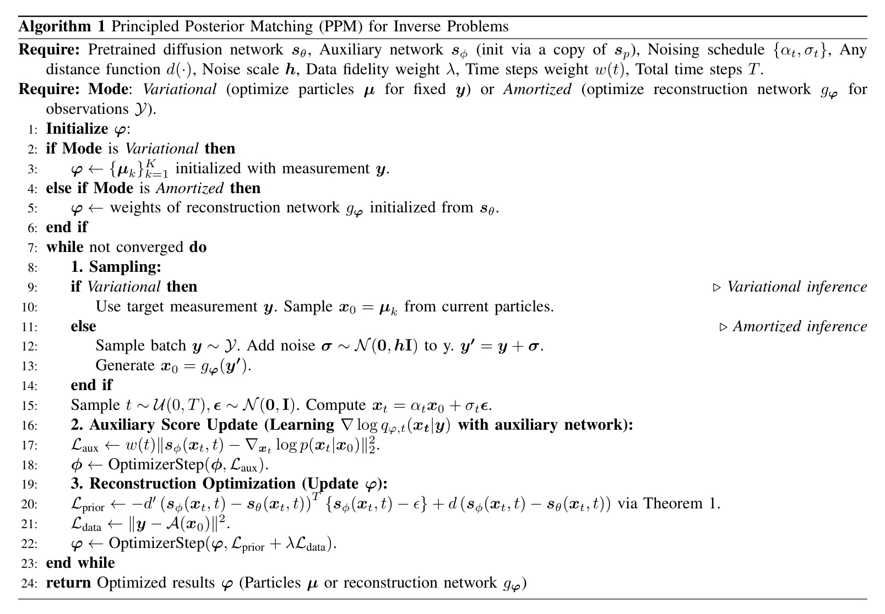

*Algorithm 1: Principled Posterior Matching (PPM) for Inverse Problems.*

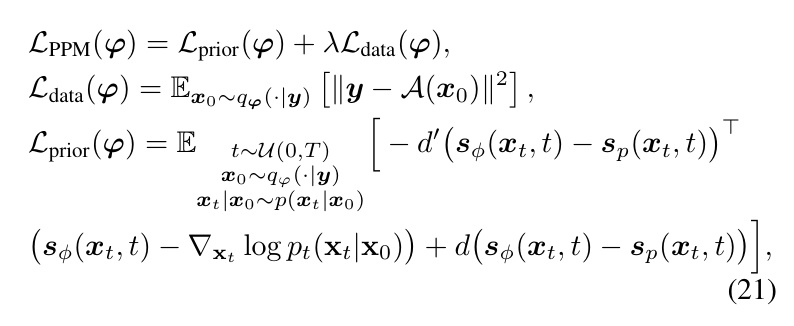

where ${ \mathcal { L } } _ { \mathrm { d a t a } }$ enforces consistency with the measurement $^ { y , }$ and ${ \mathcal { L } } _ { \mathrm { p r i o r } }$ aligns the reconstruction with the diffusion prior using the unbiased gradient estimator derived in Theorem 1. While our standard implementation utilizes the $L _ { 2 }$ norm (Fisher divergence) where $d ( \pmb { u } , \pmb { v } ) = \lVert \pmb { u } - \pmb { v } \rVert _ { 2 } ^ { 2 } ,$ , our framework is theoretically general: it naturally extends to other divergences by selecting different convex distance metrics $d ,$ offering scalability to various score matching variants.

> 💡 **公式批读：Eq. 21 + Algorithm 1，完整数据流 (Hao 批注)**: 总目标 $\mathcal{L}_{\text{PPM}}=\mathcal{L}_{\text{prior}}+\lambda\mathcal{L}_{\text{data}}$。$\mathcal{L}_{\text{data}}=\mathbb{E}[\|y-\mathcal{A}(x_0)\|^2]$ 管一致性；$\mathcal{L}_{\text{prior}}$ 是 Theorem 1 给的无偏梯度（含 $-d'(s_\phi-s_p)^T(s_\phi-\nabla\log p_t(x_t|x_0)) + d(s_\phi-s_p)$）。Algorithm 1 的交替两阶段是复现关键：
> - **Stage 1（更新 $\phi$）**：用 $\mathcal{L}_{aux}$（第 17 行）让 $s_\phi$ 学当前 $q_\varphi$ 的 score。
> - **Stage 2（更新 $\varphi$）**：固定 $s_\phi$，用第 20 行的 $\mathcal{L}_{prior}$ + 第 21 行 $\mathcal{L}_{data}$ 更新变分参数。
> 两个模式的唯一区别在采样步（第 8–14 行）：VI 从固定 $y$ 的粒子采 $x_0=\mu_k$；AI 采一批 $y\sim\mathcal{Y}$、加噪 $y'=y+\sigma$（$\sigma\sim\mathcal{N}(0,hI)$，$h$ 是噪声尺度）、$x_0=g_\varphi(y')$。注意 AI 这里给 $y$ 加噪是为了让摊还网络学到条件分布的方差（否则确定性映射 $g_\varphi(y)$ 只给点估计）——这是 AI 模式产生多样性/UQ 的机制。$d(\cdot)$ 可换（推广到更广散度族）是本文的可扩展性卖点。

PPM provides a unified training logic for both VI and AI inference paradigms. The unified training procedure is summarized in Algorithm 1. Despite the difference in parameterization, both paradigms operate via an identical alternating two-stage process:

• Stage 1: Auxiliary Score Learning (Update ϕ). We update the auxiliary network ${ \pmb s } _ { \phi }$ to minimize $\mathcal { L } _ { \mathrm { a u x } }$ (Eq. 20). This step effectively learns the score ∇ log $q _ { \varphi , t }$ of the current variational distribution (defined either by particles or a reconstruction network).

• Stage 2: Reconstruction Optimization (Update $\varphi ) _ { \cdot }$ . We update the variational parameters $\varphi$ to minimize LPPM (Eq. 21). This step utilizes the gradient provided by the now-fixed ${ \pmb s } _ { \phi }$ to drive the posterior estimate towards the true prior and measurement.

Variational Inference (Particle-based). In the VI setting, we optimize for a specific single observation y. The variational parameters are defined as a set of image particles $\varphi = \{ \mu _ { k } \} _ { k = 1 } ^ { K }$ , initialized as $\mathbf { \mu } _ { \mu _ { k } } = \mathbf { \mu } _ { y }$ (or a rough inverse). The distribution $q _ { \varphi } ( { \pmb x } | { \pmb y } )$ is represented empirically by these particles. The optimization refines $\pmb { \mu } _ { k }$ to capture the complex, multi-modal posterior landscape specific to $\mathbf { \pmb { y } } .$

Amortized Inference (Neural network-based). In the AI setting, we learn a global mapping for any observation $y \sim p ( y )$ . The variational parameter $\varphi$ denotes the weights of a neural network $g _ { \varphi }$ , such that $\pmb { x } = g _ { \varphi } ( \pmb { y } )$ . To accelerate convergence, we implement $g _ { \varphi }$ as a copy of the pre-trained diffusion U-Net (initialized with $\theta ) ,$ , enabling efficient, singlestep reconstruction. This amortizes the optimization cost, allowing rapid inference at test time.

> 💡 **VI vs AI 的取舍 (Hao 批注)**: 两种参数化各有定位——VI（粒子 $\{\mu_k\}_{k=1}^K$，初始化为观测 $y$ 或粗反演）针对**单个观测**做高保真后验刻画，样本多样性来自粒子集合；AI（网络 $g_\varphi$，从预训练 U-Net 初始化）学**跨观测**的全局映射，单步推断、test 时快。共享同一无偏目标是本文的统一性卖点。对本课题：VI 模式更接近我们要的"给定一次盲观测、联合采 $x,\varphi,\sigma$ 的高保真后验"；AI 模式则对应"训练一个摊还采样器做批量校准检验（SBC 需要大量后验样本）"。PPM 让两者共用一个无偏目标，理论上可以把 SBC/coverage 检验直接建在训练目标之上。

Beyond the standard formulation presented above, we highlight the inherent extensibility of the PPM framework. While this work primarily employs the squared $L _ { 2 }$ norm as the metric function $d ( \cdot )$ —which corresponds to the standard Fisher divergence and minimizes the Kullback-Leibler divergence—our theoretical derivations (Theorem 1) are not restricted to this choice. The metric $d ( \cdot )$ can be substituted with a broader class of convex distance functions. This flexibility allows PPM to be naturally generalized to measure and minimize a wider spectrum of divergences, positioning it as a versatile foundation for score-based variational inference.

> 💡 **Q&A 批注记录 (Hao 批注)**:
> - Q: PPM 号称最小化 $D_{\text{KL}}(q\|p)$（reverse KL，通常被认为 mode-seeking），为什么反而能 mass-covering、避免 mode collapse？
> - A: 关键不在 KL 的方向，而在**是否精确 + 是否保留熵/在扩散平滑后的 score 场上度量**。RED-Diff 的问题不是 reverse KL 本身，而是把 $q$ 退化成 Dirac 丢了熵（Eq. 22–23 证明退化成 MAP）。PPM 用完整的 Fisher 积分（Eq. 13）在 $q$ 自己的支撑集上、对全时间 $t$ 匹配 score 场，熵信息通过 $s_{q_{\varphi,t}}$ 完整保留，因此优化会推动 $q$ 铺开覆盖 $p$ 的各 mode。见 Fig. 1 的双峰恢复。
> - Q: 辅助网络 $s_\phi$ 的 teacher 信号是什么？
> - A: 是当前重建样本 $x_0\sim q_\varphi$ 加噪后的 denoising 目标 $\nabla_{x_t}\log p_t(x_t|x_0)$（即 $-\epsilon/\sigma_t$），标准 DSM（Eq. 20 / Algorithm 第 17 行）。它不依赖 ground truth，因此 PPM 是无监督的（对比 DAVI 依赖成对监督）。
