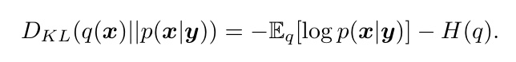
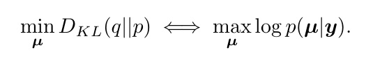
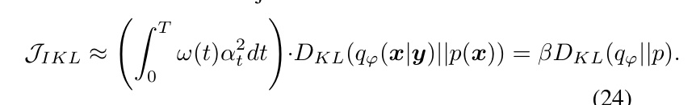
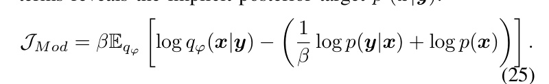

[← 返回 README](../README.md)

# IV. Theoretical Analysis

## 📌 预览

这一节把 Table I 的"偏差账本"逐条证明，是本文相对纯经验论文的分量所在，也是本课题最该精读的一节——它给出了"为什么样本离散≠校准"的三种数学机制：(A) RED-Diff 的 Dirac 假设让 KL 退化成 MAP（Eq. 22–23），RLSD 的 repulsion 只是代理熵；(B) DPS 的 likelihood 近似违背 Jensen 不等式，误差沿轨迹累积；(C) DAVI 的 IKL 在 VP + 高斯假设下 $\approx\beta D_{\text{KL}}$（$\beta\lt1$），等价于优化一个"高温展平先验" $p(x)^\beta$（Eq. 24–25）。三种偏差都指向 UQ 不可信。

---

In this section, we provide a rigorous theoretical comparison between PPM and three leading categories of baselines of diffusion-based inverse problem solvers. We demonstrate that while these methods offer practical utility, they all rely on biased approximations of the true posterior objective.

## A. Bias in Optimization-based VI (RED-Diff and RLSD)

Optimization-based methods like RED-Diff Mardani et al. [2023] and RLSD Zilberstein et al. [2024] formulate the inverse problem as a variational optimization but share a fundamental theoretical flaw in their handling of entropy.

1) Missing Exact Entropy (RED-Diff): RED-Diff implicitly models the posterior as a Dirac delta distribution. This effectively removes the entropy term $H ( q )$ from the KL divergence, collapsing the problem to Maximum A Posteriori (MAP) estimation. Consider the standard decomposition:

Under the Dirac assumption $q ( { \pmb x } ) = \delta ( { \pmb x } - { \pmb \mu } )$ , the entropy vanishes $( \nabla _ { \mu } H ~ = ~ 0 )$ and the energy term collapses to $\log p ( \pmb { \mu } | \pmb { y } )$ . Consequently, the minimization problem becomes mathematically equivalent to MAP estimation:

This confirms that without the entropy term, the optimization inherently seeks the single most probable mode rather than the full distribution, explaining the severe mode-seeking behavior observed in Figure 1.

> 💡 **公式批读：Eq. 22–23，mode collapse 的严格证明 (Hao 批注)**: 这是全文 mode collapse 论断的数学落地，也是本课题批注"样本离散≠校准"最该引用的一段。标准分解 Eq. 22：$D_{\text{KL}}(q(x)\|p(x|y)) = -\mathbb{E}_q[\log p(x|y)] - H(q)$。在 Dirac 假设 $q=\delta(x-\mu)$ 下，熵 $H(q)$ 对 $\mu$ 的梯度为 0（常数项），能量项塌成 $\log p(\mu|y)$，于是 Eq. 23：$\min_\mu D_{\text{KL}}(q\|p) \Longleftrightarrow \max_\mu \log p(\mu|y)$——**完全等价于 MAP**。结论：RED-Diff 名为 VI，实为找单个最可能 mode。它多次运行给出的"样本方差"来自初始化/优化随机性，不是后验方差，coverage 必然欠覆盖。这解释了 Fig. 1 里 RED-Diff 塌成孤点、Fig. 4/6/7 里 std map 被压扁。

2) Surrogate Entropy via Repulsion (RLSD): While RLSD mitigates mode collapse using particles, it introduces ad-hoc repulsive regularization instead of optimizing the true entropy. This repulsion acts as a heuristic proxy and does not correspond to the true score of the variational distribution, resulting in artificial uncertainty dependent on hyperparameters.

> 💡 **RLSD 的代理熵陷阱 (Hao 批注)**: RLSD 想补回熵，但用的是粒子间 ad-hoc 斥力，不等于真变分分布的 score。后果：产生的多样性是"人工的"、依赖 repulsion 超参强度——调大则样本铺满整个空间（Fig. 1 里跑出先验支撑集），调小则退回 collapse。这正是"用启发式凑多样性"无法通过 coverage 校准的原因：斥力强度和真后验方差之间没有对应关系。PPM 的 Fisher 积分则通过 $s_\phi$ 学到真 score，方差是目标自然产出而非外挂。

## B. Bias in MCMC Sampling (DPS)

Diffusion Posterior Sampling (DPS) Chung et al. [2022] approximates samples by modifying the reverse diffusion score with a likelihood guidance term. Since the likelihood $p ( \pmb { y } | \pmb { x } _ { t } )$ is intractable, DPS approximates it using a clean data estimate $\hat { \pmb { x } } _ { 0 } ( { \pmb { x } } _ { t } ) ~ = ~ \mathbb { E } [ { \pmb { x } } _ { 0 } | { \pmb { x } } _ { t } ]$ This violates Jensen’s inequality by treating the expectation of the likelihood as the likelihood of the expectation. This introduces systematic score estimation error, particularly in early diffusion stages, which accumulates over the trajectory.

> 💡 **DPS 的 Jensen 违背 (Hao 批注)**: 对应背景节 Eq. 7。DPS 把 $p_t(y|x_t)=\mathbb{E}_{x_0\sim p(x_0|x_t)}[p(y|x_0)]$ 近似成 $p(y|\mathbb{E}[x_0|x_t])=p(y|\hat{x}_0)$，即把"likelihood 的期望"换成"期望的 likelihood"。由 Jensen 不等式，对非线性 likelihood 这两者不等，产生系统性 score 误差；扩散早期 $x_t$ 噪声大、$p(x_0|x_t)$ 方差大，误差最严重，且沿 reverse 轨迹累积。对本课题：DPS 的 guidance 是"推断时"的近似，即便多跑几条链，误差来源相同，UQ 偏差不会因采样次数增加而消失——与"目标级无偏"是两回事。

## C. Bias in Amortized Inference (DAVI)

DAVI Lee et al. [2024] employs the Integral KL (IKL) divergence Luo et al. [2023] to train amortized generators. Here, we formally prove that replacing the standard prior KL divergence with the IKL objective fundamentally alters the optimization target.

1) Problem Formulation: Standard VI minimizes $\mathcal { I } _ { V I } = \mathbb { E } _ { q _ { \varphi } } [ - \log p ( \pmb { y } | \pmb { x } ) ] \ + \ D _ { K L } ( q _ { \varphi } | | p )$ . IKL-based methods replace the prior term with an integrated objective $\mathcal { I } _ { M o d } ~ = \mathbb { E } [ - \log p ( \pmb { y } | \pmb { x } ) ] + \int \omega ( t ) D _ { K L } ( q _ { t } | | p _ { t } ) d t$

2) KL Contraction and Implicit Prior: Assuming a Variance Preserving (VP) schedule and a Gaussian Mean Shift assumption $( p ( \pmb { x } ) = \mathcal { N } ( \mathbf { 0 } , \pmb { I } ) , q ( \pmb { x } | \pmb { y } ) = \mathcal { N } ( \pmb { \Delta } , \pmb { I } ) )$ , the KL divergence scales quadratically: $D _ { K L } ( q _ { t } | | p _ { t } ) ~ \approx ~ \alpha _ { t } ^ { 2 } D _ { K L } ( q _ { 0 } | | p _ { 0 } )$

Substituting this scaling law into the IKL integral, we rewrite the modified objective as:

This effectively scales the prior weight by β. Expanding the terms reveals the implicit posterior target $p ^ { \prime } ( \pmb { x } | \pmb { y } )$

Exponentiating this result implies optimization against a Distorted Prior $\bar { p ^ { \prime } } ( { \pmb x } ) \ \propto \ p ( { \pmb x } ) ^ { \bar { \beta } }$ . Since typically $\beta ~ \lt ~ 1$ , the effective prior is a flattened, high-temperature version of the true prior, proving that IKL leads to biased posterior estimation.

> 💡 **公式批读：Eq. 24–25，IKL = 高温先验 (Hao 批注)**: 这是本文对 DAVI 最锋利的一击。在 VP schedule + 高斯 mean-shift 假设下，边际 KL 二次缩放 $D_{\text{KL}}(q_t\|p_t)\approx\alpha_t^2 D_{\text{KL}}(q_0\|p_0)$。代入 IKL 积分（Eq. 24）：$\mathcal{I}_{IKL}\approx(\int_0^T\omega(t)\alpha_t^2 dt)\cdot D_{\text{KL}}(q_\varphi\|p) = \beta D_{\text{KL}}(q_\varphi\|p)$——IKL 只是给先验项乘了个常数 $\beta$。Eq. 25 展开后指数化，得到隐式目标先验 $p'(x)\propto p(x)^\beta$。因为 $\beta\lt1$，这是一个**被展平的高温版先验**：mode 之间的差异被压缩，后验被人为拉平、over-smooth。判读：这精确解释了 Fig. 5 里 DAVI 的重建 over-smooth、UQ 被抑制。对本课题的核心教训——"积分 KL"（DAVI）与"积分 Fisher"（PPM）看似都在扩散全程对齐，但前者引入了 $\beta$ 温度畸变，后者是恒等式无畸变。摊还采样器若不修这个偏差，SBC 会系统性显示 over-dispersion 之外的 mode-merging。
