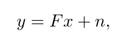
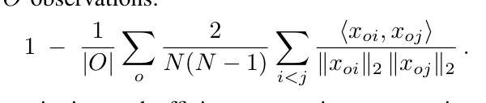
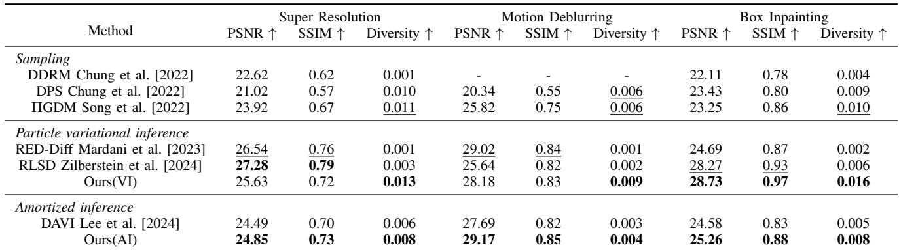
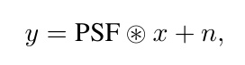
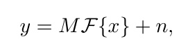

[← 返回 README](../README.md)

# V. Experiment

## 📌 预览

实验按"证据链"层层加码：(A) 2D toy——真后验已知，直接检验能否恢复双峰（Fig. 1，见 [Introduction](01-introduction.md)）；(B) 计算摄影（inpainting/deblur/SR）——FFHQ/ImageNet 上比 fidelity（PSNR/SSIM）、多样性（cosine diversity）、UQ（std map），Table II + Fig. 3/4/5；(C) 荧光显微超分——UQ 是否符合成像物理（PSF 导致边缘不确定），Fig. 6；(D) 黑洞 VLBI 成像——极度病态、稀疏 Fourier 采样下的 UQ 可靠性，Fig. 7。核心 claim：PPM 在保真的同时给出**多样且校准**的后验，而 baseline 要么塌缩（RED-Diff）、要么伪多样（RLSD）、要么 over-smooth（DAVI）。

---

In this section, we compare our proposed method, PPM, with state-of-the-art (SoTA) diffusion model-based methods for solving inverse problems, particularly those employing variational inference. Our experiments aim to demonstrate PPM’s capability to generate diverse reconstructions while maintaining fidelity, thereby recovering the full posterior and surpassing baselines that typically yield homogeneous results.

## A. Toy Examples of 2D Posterior Estimation

We first validated PPM on two simple 2D posteriorestimation tasks. In each task, the hidden variable $\bar { x } \in \mathbb { R } ^ { 2 \times 1 }$ follows a Gaussian-mixture prior, and measurements obey the linear model

where F is a linear projection matrix and $n \sim \mathcal { N } ( 0 , \sigma ^ { 2 } I )$ is Gaussian noise. We compare PPM against two related baselines, RED-Diff Mardani et al. [2023] and RLSD Zilberstein et al. [2024], using the same pre-trained pixel-space diffusion prior. To ensure fair compaison, we adapt RLSD by replacing its latent diffusion backbone with our pixel-space prior and incorporating its repulsive term into a pixel-space SDS loss, so that all methods operate under identical conditions.

Figure 1 highlights the significant differences in each method’s ability to capture multimodal posteriors. RED-Diff exhibits severe mode collapse: its samples converge to accurate point estimates but lack diversity. RLSD produces more varied samples, yet its empirical repulsive term leads to either measurement inconsistency (top example) or poor prior adherence (bottom example). In contrast, PPM faithfully recovers every posterior mode, yielding both accurate and diverse samples that closely match the ground-truth bimodal distribution.

> 💡 **证据链·起点 (Hao 批注)**: 2D toy 是最干净的校准检验——因为先验是已知高斯混合、$y=Fx+n$ 线性、真后验解析可得（Fig. 1 最后一列）。这里的 diversity 高低可以直接对照真后验判断"是不是真的多样"而非"人工多样"。结论（见 [Introduction 的 Fig. 1 批读](01-introduction.md)）：RED-Diff 塌成点、RLSD 铺满 likelihood 带但偏离先验、PPM 命中双峰。这一步是后面高维实验无法直接验证的（高维真后验未知），所以是整条证据链的锚点。把 RLSD 从 latent 改到 pixel-space 并保留 repulsion 项，是为了公平——排除 backbone 差异，只比目标函数。

## B. Computational Photography

We then evaluated PPM on various computational photography tasks, including box inpainting, motion deblurring, and super-resolution, using natural images.

a) Datasets and Pretrained Models : We primarily evaluate on two natural-image datasets with distinct characteristics—FFHQ (256 × 256) Karras et al. [2019] and ImageNet (256 × 256) Deng et al. [2009]—using 32 randomly selected images from each validation set. For FFHQ, we use the diffusion prior released by DPS Chung et al. [2022], and for ImageNet we employ the model from Dhariwal and Nichol [2021]. Both are used off-the-shelf, without task-specific finetuning. RLSD Zilberstein et al. [2024] requires a latent diffusion backbone, so we use Stable Diffusion v2.1 Rombach et al. [2022] following its original setup.

b) Baselines: We compare PPM against state-of-the-art computational imaging methods that leverage diffusion priors, spanning both variational-inference and MCMC-sampling paradigms. Our VI baselines include RED-Diff Mardani et al. [2023] and RLSD Zilberstein et al. [2024], while our MCMC baselines are ΠGDM Song et al. [2022] and DPS Chung et al. [2022]. All methods use the same pixel-space diffusion prior—except RLSD, which retains its Stable Diffusion prior—and are evaluated with hyperparameters set to their original defaults to ensure a fair comparison.

c) Evaluation Metrics: We assess reconstruction fidelity using PSNR and SSIM, and quantify sampling diversity using the pairwise cosine similarity among N reconstruction samples from the same observation. The final diversity is the average of all O observations:

For quantitative and efficient comparison, we estimate over 64 observations in FFHQ validation dataset and reconstruct 8 samples from each observation.

> 💡 **指标批读：diversity 定义 (Hao 批注)**: diversity $= 1 - \frac{1}{|O|}\sum_o \frac{2}{N(N-1)}\sum_{i\lt j}\frac{\langle x_{oi},x_{oj}\rangle}{\|x_{oi}\|_2\|x_{oj}\|_2}$，即"1 − 同观测下样本两两平均余弦相似度"，越高越多样。注意本课题的关键警惕：**diversity 只测"样本之间有多不同"，不测"是否等于真后验方差"**。RLSD 靠 repulsion 也能刷高 diversity（Fig. 1 已示其偏离先验）。所以这个指标必须和 fidelity（PSNR/SSIM）+ 视觉 std map 联合看，不能单看。真正的校准检验（SBC/coverage）本文没做，只在 2D toy 里隐式验证。设定：64 观测 × 每观测 8 样本。

d) Inpainting: Box-inpainting results are assessed on FFHQ validation images. Qualitative comparisons with 80×80 masked boxes are visualized in Fig. 3, while quantitative metrics evaluated on larger 128×128 center masks are reported in Table II. We compare PPM against two VI baselines, RED-Diff Mardani et al. [2023] and RLSD Zilberstein et al. [2024]. PPM significantly surpasses both baselines in diversity while simultaneously delivering superior reconstruction quality (PSNR and SSIM). In challenging cases where critical features like hair (Fig. 3 left) or facial contours (Fig. 3 right) are masked, RED-Diff collapses to nearly identical outputs and RLSD struggles to trade off data fidelity against prior adherence. By contrast, PPM produces varied yet plausible reconstructions (e.g., different hairstyles and lip shapes) thanks to its principled score-based divergence and tailored optimization strategy. As Table II shows, PPM attains the top scores across all metrics on the validation set—demonstrating superior quality and diversity without extensive tuning—and also outperforms MCMC-based methods such as DPS.

*Fig. 3. Comparison of PPM and diffusion-based VI baselines (DPS, RED-Diff and RLSD) on box inpainting with FFHQ. From top to bottom: the masked observation and the ground truth, followed by four random posterior samples from DPS, RED-Diff, RLSD, and PPM. Although all methods yield plausible completions, PPM produces markedly more diverse and higher-fidelity samples within the inpainted region (red box). By contrast, the baselines generate nearly identical outputs, indicating a failure to capture posterior uncertainty.*

> 💡 **Figure 3 批读 (Hao 批注)**: box inpainting 是检验多样性的理想任务——被遮区域（红框）本质上有多个合理补全（不同发型、唇形），真后验天然多模态。判读逻辑：每行是同一观测的 4 个随机后验样本，看**行内差异**。DPS/RED-Diff/RLSD 的四个样本在红框内几乎一模一样（无法捕捉后验不确定性），只有 PPM 给出显著不同却都合理的补全。这直接支撑 claim "样本多样性 = 捕捉了后验的多模态结构"。注意这是定性图（80×80 mask），定量用更大的 128×128 中心 mask（Table II）——遮得越大后验越不确定，越能拉开差距。

e) Motion Deblurring, Super Resolution, and Gaussian Denoising: For motion deblurring, we follow Chung et al. [2022], Zilberstein et al. [2024] by convolving each image with a randomly sampled 61 × 61 motion kernel (variance = 0.32). For super-resolution, we downsample images by a factor of 8. Additionally, for Gaussian denoising, we corrupt the images with additive white Gaussian noise with a standard deviation of σ = 0.2. We evaluate PPM on these tasks using FFHQ and ImageNet validation sets, comparing against DPS Chung et al. [2022], ΠGDM Song et al. [2022], RED-Diff Mardani et al. [2023], RLSD Zilberstein et al. [2024], and the amortized baseline DAVI Lee et al. [2024].

*Fig. 4. Comparison of PPM, DPS, and diffusion-based VI baselines (RED-Diff and RLSD) on motion deblurring, super-resolution and gaussian deblurring tasks with ImageNet. For each VI method, we show one sample reconstruction (left) alongside its standard-deviation uncertainty map (right). Compared to DPS, PPM achieves higher fidelity—accurately rendering details like the elephant’s tusks, balloon logos, and human faces. Compared to VI methods, PPM produces better calibrated uncertainty: RED-Diff’s standard-deviation maps reveal mode collapse, and RLSD’s contain pronounced artifacts.*

> 💡 **Figure 4 批读 (Hao 批注)**: 这张图是"fidelity + UQ"双证据。每个 VI 方法显示"重建（左）+ std 不确定性图（右）"。两个判读维度：(1) **fidelity**——PPM 比 DPS 更锐（象牙、气球 logo、人脸细节），因为 PPM 用精确 likelihood 项（$\mathcal{A}$ 显式），DPS 用 Eq. 7 近似；(2) **UQ 校准**——PPM 的 std map 合理反映位置不确定性（象牙、脸边缘），RED-Diff 的 std map 因 mode collapse 几乎全暗（低估不确定性），RLSD 的 std map 满是斑点 artifact（latent-space 优化引入的伪不确定性）。这正是本课题要区分的三种失败模式：低估（RED-Diff）、伪高估/artifact（RLSD）、校准（PPM）。

Figure 4 shows that PPM delivers sharper, more observation-consistent reconstructions than DPS, evident in fine details such as the elephant’s tusks and the balloon’s logo—thanks to PPM’s exact likelihood term versus DPS’s approximation. Compared to VI methods (RED-Diff and RLSD), PPM also excels at uncertainty quantification: its standarddeviation maps accurately reflect positional uncertainty (e.g., the elephant’s tusks, the boy’s facial edge), whereas RED-Diff collapses modes and RLSD introduces p persistent speckle artifacts due to latent-space optimization.

Figure 5 presents a qualitative comparison of the amortized inference results on the FFHQ dataset. We contrast our PPM framework against the KL-divergence-based baseline, DAVI. The pixel-wise uncertainty maps demonstrate that our method captures meaningful posterior diversity, particularly in ambiguous regions (e.g., edges and textures), whereas the KLbased approach exhibits signs of posterior collapse with largely suppressed uncertainty.

*Fig. 5. Qualitative comparison of amortized inference on the FFHQ validation set. We compare our PPM framework against the KL-divergence-based baseline, DAVI Lee et al. [2024]. The rows correspond to three inverse problems: Motion Deblurring (top), 8× Super-Resolution (middle), and Gaussian Denoising (bottom). For each task, we visualize the degraded observation, the reconstruction and pixel-wise uncertainty map from DAVI, the reconstruction and uncertainty map from our method, and the ground truth. Our method yields significantly sharper structural details (e.g., facial features and hair textures) and provides more informative uncertainty estimates that capture the rich diversity of local details, whereas the IKL-based approach tends to over-smooth the results.*

> 💡 **Figure 5 批读 (Hao 批注)**: 这是 AI 模式（PPM vs DAVI）的对比，直接验证第 IV.C 节的理论预言。DAVI 用 IKL 目标，理论上等价于优化"高温展平先验" $p(x)^\beta$（$\beta\lt1$），预言重建会 over-smooth、UQ 被抑制——图中完全印证：DAVI 的重建糊、std map 暗；PPM(AI) 结构更锐（面部/发丝纹理）、UQ 图在边缘/纹理等歧义区有信息量。判读要点：**这是"理论 → 现象"闭环的关键一图**。理论证明 IKL 有偏（Eq. 24–25），实验显示这个偏差在像素上就是 over-smooth + UQ 塌缩。对本课题：说明摊还采样器的校准质量由训练目标决定，换成无偏目标（PPM）就能改善——但仍是定性证据，缺 SBC 量化。

Table II confirms that PPM achieves the best overall balance of PSNR, SSIM, and diversity. While RLSD slightly outperforms in PSNR/SSIM for super-resolution—due to its higher-resolution Stable Diffusion prior (512 × 512)—its artifacts undermine visual quality. MCMC sampling methods like DPS match PPM’s diversity but fall short in fidelity. In summary, PPM consistently outperforms both variational and sampling-based baselines across computational photography tasks, delivering superior reconstruction quality and reliable uncertainty estimates.

*TABLE II: QUANTITATIVE COMPARISON OF PPM AND BASELINE METHODS ACROSS COMPUTATIONAL PHOTOGRAPHY TASKS, INCLUDING SUPER-RESOLUTION, MOTION DEBLURRING, AND BOX INPAINTING, ON FFHQ AND IMAGENET (256×256 RESOLUTION). ALL METHODS USE THE SAME PRETRAINED UNCONDITIONAL DIFFUSION MODEL, EXCEPT RLSD, WHICH EMPLOYS STABLE DIFFUSION. BEST RESULTS ARE SHOWN IN BOLD, AND SECOND-BEST ARE UNDERLINED.*

> 💡 **Table II 批读 (Hao 批注)**: 这张定量表要按"多样性 vs 保真"的张力来读，不能只看 PSNR。几个关键判读：
> - **Diversity 这一列 PPM 全面领先**：SR 0.013、Deblur 0.009、Inpaint 0.016，比 RED-Diff（0.001–0.002）高一个数量级——RED-Diff 的极低 diversity 正是 mode collapse 的数字证据。
> - **PSNR/SSIM 上 PPM 不总是第一**：SR 上 RLSD（27.28/0.79）> PPM-VI（25.63/0.72），但脚注解释 RLSD 用了 512×512 的 Stable Diffusion 先验（分辨率优势），且有 artifact。这是诚实的：PPM 不牺牲多样性去换 PSNR。
> - **Inpainting 上 PPM-VI 全胜**（28.73/0.97/0.016 全部最高）——遮挡任务最需要多模态后验，PPM 优势最大。
> - **AI 组**：PPM(AI) 在 Deblur 上 PSNR 29.17 甚至超过所有方法，且比 DAVI 全面更好（印证 Fig. 5）。
> 本课题教训：一个方法若在"高 fidelity + 高 diversity"上同时占优才可能是校准的；单独刷 PSNR（可能塌缩）或单独刷 diversity（可能伪多样）都不够。PPM 的卖点是**平衡**，代价是极端 fidelity 场景略逊。

## C. Super-resolution Fluorescent Microscopic Imaging

Beyond standard computational photography tasks, we also applied our method to real-world scientific imaging challenges in biomedicine and astronomy. We evaluated PPM on superresolution fluorescent microscopy, a critical tool for visualizing subcellular structures. Here, the observation y is a wide-field microscope image (approximately 200 nm resolution), whose measurement model is

where x is the underlying high-resolution fluorescence signal, PSF is the microscope point-spread function, and n is additive Gaussian noise. Accurately recovering x, along with precise uncertainty quantification, is essential for resolving the finegrained dynamics of subcellular structures, such as organelles, and their interactions. In our experiment, we primarily benchmark PPM with RED-Diff. Both methods use the same diffusion prior pretrained on the BioSR dataset Aali et al. [2023], which comprises over 10,000 256 × 256 super-resolution images of diverse subcellular structures—microtubules, endoplasmic reticulum (ER), clathrin-coated pits (CCPs), and F-actin—captured with a structured illumination microscope (approximately 100 nm resolution).

Figure 6 demonstrates that PPM delivers higher-fidelity reconstructions than RED-Diff, faithfully rendering thin filaments in microtubules and the mesh-like ER. Quantitatively, PPM also achieves superior PSNR and SSIM scores. Crucially, PPM’s uncertainty maps align with imaging physics: confidence peaks at structure centers and decreases toward blurred edges, revealing hollow structures. This behavior reflects the influence of microscope’s PSF, which preserves feature presence while smearing precise boundaries. PPM accurately captures this boundary uncertainty, whereas RED-Diff’s estimates fail to indicate edge ambiguity. These results underscore PPM’s reliability for nanometer-scale biomedical imaging, where uncertainty quantification is indispensable.

*Fig. 6. Fluorescent super-resolution microscopic imaging results. We compare our method with RED-Diff on microscopic images of Microtubules and ER samples. For each method, the reconstruction (with PSNR/SSIM scores) and its corresponding uncertainty map are reported. Our uncertainty maps accurately characterize the physical blur caused by the Point Spread Function in biological imaging: the uncertainty is lower at the center of the reconstructed structures and higher at the edges, effectively capturing the transition between the confirmed structures and the background.*

> 💡 **Figure 6 批读 (Hao 批注)**: 这是"UQ 是否符合成像物理"的检验——比自然图像更硬核，因为这里的不确定性有**物理 ground truth**：PSF（$y=\text{PSF}\circledast x+n$，Eq. 27）会保留结构存在性但模糊边界，所以物理上"结构中心应该确定、边缘应该不确定"。判读：PPM 的 std map 恰好中心低、边缘高（正确刻画 PSF 引起的边界模糊），RED-Diff 的 UQ 图无法指示边缘歧义（又是 collapse）。这比 diversity 指标更有说服力——它把 UQ 的正确性锚定到已知物理，而非任意的"样本铺开程度"。对本课题：这是一个可借鉴的校准检验思路——当有物理先验（PSF/前向算子结构）时，可以检查 UQ 的空间分布是否符合物理，而不只是看边际方差。

## D. Radio Interferometric Black Hole Imaging

We applied PPM to reconstruct and quantify uncertainty in black hole images from very long baseline interferometry (VLBI) measurements. Using a general-relativistic magnetohydrodynamics (GRMHD) simulated Sagittarius A⋆ black hole image, we emulate a synthetic observation of the Event Horizon Telescope (EHT) array, which comprises nine telescopes worldwide to form an Earth-sized interferometer. Ignoring atmospheric turbulence, the measurement model that maps the true image x to the observed visibilities $y$ is

where $\mathcal { F }$ is the Fourier transform, M selects the measured frequency components, and $n$ is additive Gaussian noise. Because the EHT sampling is extremely sparse in the Fourier domain (Fig. 7(a)), this defines a highly ill-posed inverse problem: enforcing only data consistency yields the classical dirty image, riddled with sidelobe artifacts (top right of Fig. 7).

Robust uncertainty quantification is therefore critical before making scientific inferences. Our PPM reconstruction follows the InverseBench Zheng et al. [2025] protocol, using a diffusion prior trained on approximately 50,000 synthetic black hole images. Figure 7 (b) shows the ground-truth GRMHD image, the target blurred to the EHT’s resolution, 16 independent PPM posterior samples, and the resulting mean reconstruction alongside its standard-deviation map. We further compare PPM with baselines in Fig. 7(c). While RED-Diff suffers from severe mode collapse (indicated by the suppressed uncertainty map) and DPS yields blurry reconstructions, only PPM faithfully captures the key morphology—ring diameter, azimuthal position of the bright crescent, and the black hole’s swirling signature, demonstrating PPM’s ability to deliver accurate reconstructions with reliable uncertainty estimates in challenging VLBI black hole imaging scenarios.

*Fig. 7. Black hole interferometric imaging from synthetic EHT observations. This highly ill-posed inverse problem recovers an image from the sparse Fourier samples of a VLBI array (top left). (a) shows the EHT’s $(u,v)$ coverage and the “dirty” image reconstructed solely from observations, without any image priors. (b) presents the ground-truth GRMHD image, the target blurred to EHT resolution, 16 independent PPM posterior samples, and the resulting mean reconstruction with its standard-deviation map. PPM accurately captures critical features, the ring structure and bright crescent, while providing reliable uncertainty estimates. (c) Comparison with baselines. We report the mean reconstruction and pixel-wise standard deviation for baselines. Consistent with our theoretical analysis, RED-Diff exhibits severe mode collapse, characterized by a suppressed standard deviation map. While DPS captures uncertainty, its reconstruction lacks sharpness. In contrast, PPM achieves superior fidelity with a physically meaningful uncertainty distribution that accurately captures the structural variance of the black hole shadow.*

> 💡 **Figure 7 批读 (Hao 批注)**: 这是证据链的压轴——最病态的任务（$y=M\mathcal{F}\{x\}+n$，Eq. 28，稀疏 Fourier 采样，(a) 的 $(u,v)$ coverage 极稀，dirty image 全是 sidelobe artifact）。这种极度欠定的场景 UQ 最重要也最难。判读：(b) 展示 16 个独立 PPM 后验样本 + mean + std map，PPM 抓住 ring 直径、亮 crescent 的方位角、swirling 特征。(c) 对比中，RED-Diff 的 std map 被压扁（collapse，与第 IV.A 节理论一致——文中明确说 "Consistent with our theoretical analysis"），DPS 能给 UQ 但重建糊，只有 PPM 兼顾 fidelity + 物理合理的 UQ。对本课题最直接的相关性：黑洞成像正是"未知真值、极病态、必须靠 UQ 做科学推断"的典型场景——这里 std map 的物理合理性（对应 crescent 方位的结构方差）就是一种 coverage 校准的定性替代。但注意：本文全篇没有对高维任务做定量 SBC/coverage/CRPS，UQ 的可靠性主要靠"视觉合理 + 2D toy 隐式验证"支撑，这是可追问的证据缺口。

> 💡 **Q&A 批注记录 (Hao 批注)**:
> - Q: PPM 的多样性提升是否以牺牲保真为代价？
> - A: Table II 显示不完全牺牲——Inpainting/Deblur 上 PPM 同时拿到最高 fidelity 和最高 diversity；只有 SR 上 PSNR 略逊 RLSD，但那是 RLSD 用了 512×512 高分先验的结构性优势，非目标缺陷。所以"多样且保真"这个 claim 在多数任务成立。
> - Q: 本文的 UQ 校准有没有量化证据（SBC/coverage/CRPS）？
> - A: 没有。定量只有 PSNR/SSIM/diversity（cosine）。UQ 可靠性靠：2D toy 恢复真后验（Fig. 1，唯一有真后验的场景）、std map 与物理一致（Fig. 6 的 PSF、Fig. 7 的 crescent 方差）、与 baseline 的定性对比。这是本文相对本课题目标的最大缺口——它证明了"目标无偏 → UQ 更合理"，但没证明"UQ 已校准"。
