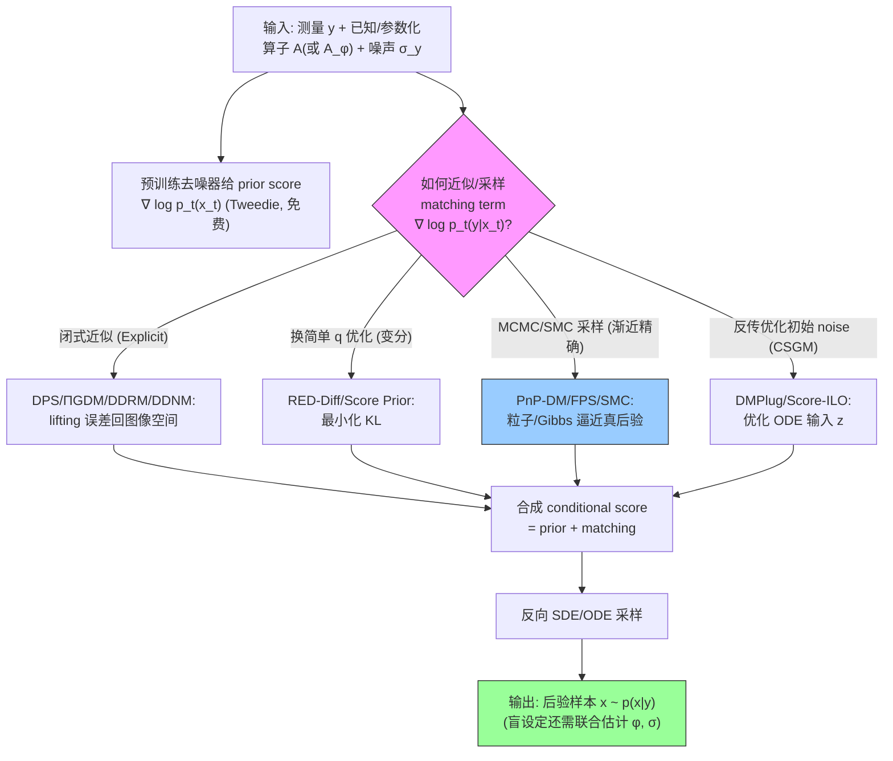

# A Survey on Diffusion Models for Inverse Problems

## 论文元信息

| 项 | 内容 |
|------|------|
| **标题** | A Survey on Diffusion Models for Inverse Problems |
| **作者** | Giannis Daras, Hyungjin Chung, Chieh-Hsin Lai, Yuki Mitsufuji, Jong Chul Ye, Peyman Milanfar, Alexandros G. Dimakis, Mauricio Delbracio |
| **单位** | UT Austin · KAIST · Sony AI · Google |
| **类型 / 年份** | Survey（arXiv preprint）· 2024 |
| **arXiv** | [2410.00083](https://arxiv.org/abs/2410.00083) |
| **本课题定位** | 全局地图：条件采样器的家族图谱 + prior score 与 posterior score 的差距 |

## 一句话总结

这篇综述把"用**预训练无条件扩散模型当先验、推理时求后验**"的所有免训练逆问题求解器，统一到一个中心问题——如何近似/采样那个 intractable 的 measurement matching term $\nabla_{x_t}\log p_t(y|x_t)$——并据此划成四大方法家族（Explicit 近似 / 变分 / 渐近精确 / CSGM），外加 latent diffusion 专门治理。

## 核心贡献

1. **两套 taxonomy**：按"问题类型"（线性/非线性、盲/非盲、有无噪声、像素/latent、文本条件）和按"求解技术"（四家族 + Grad/Proj/Samp/Opt 优化型）双维度归类（见 Table 1）。
2. **统一数学语言**：把 DPS、DDRM、ΠGDM 等看似迥异的 Explicit 方法收敛到同一模板 $\nabla_{x_t}\log p(y|x_t)\approx-\mathcal{L}_t\mathcal{M}_t/\mathcal{G}_t$（Eq. 3.1，Figure 1 汇总），揭示差别只在"误差 clean vs noised"与"lifting 矩阵复杂度"两个轴。
3. **点出核心难题与理论下界**：一切困难源于 $p_t(y|x_t)$ 的 intractable 积分（Eq. 1.3/2.20）；Gupta et al. 证明 posterior sampling 存在超多项式硬下界。
4. **latent diffusion 的四道坎**：失去线性、解码贵、Enc∘Dec 非一一、文本条件，并梳理对应解法。
5. **给出未来方向**：呼吁标准 benchmark、误差传播理论分析。

## 📖 批读导航

| Section | 内容 |
|---------|------|
| [00 - Abstract](sections/00-abstract.md) | 摘要 + 综述立场（免训练、无条件先验）|
| [01 - Introduction](sections/01-introduction.md) | 问题设定 + Table 1 总表 + Figure 1 + Bayes 分解（Eq. 1.2/1.3）+ Recovery types |
| [02 - Background](sections/02-background.md) | 扩散 SDE/ODE、Tweedie（Eq. 2.10）、latent、条件采样主线（Eq. 2.17）、Ambient |
| [03 - Reconstruction Algorithms](sections/03-reconstruction-algorithms.md) | 四大家族全解 + 三个盲方法（BlindDPS/GibbsDDRM/Blind RED-Diff）|
| [04 - Thoughts](sections/04-thoughts.md) | 作者分家族点评 + benchmark 呼吁 |
| [05 - Conclusion](sections/05-conclusion.md) | 四家族收束于后验 intractability |
| [06 - Appendix & References](sections/06-appendix.md) | Tweedie/DSM/Jacobian 证明 + 164 条参考文献 |

## 关键数字

| 指标 | 数值 |
|------|------|
| 方法家族数 | 4（+ Latent 系归 Others）|
| Table 1 收录方法 | ~40 个求解器 |
| 明确标"盲"的方法 | 3（BlindDPS [7]、GibbsDDRM [10]、Blind RED-Diff [17]）|
| 参考文献数 | 164 |
| 自带实验 | 0（纯理论/分类综述）|
| 核心分解式 | Eq. 1.2 / Eq. 2.17：conditional score = prior score + matching term |
| 核心难题 | Eq. 1.3 / 2.20：$p_t(y|x_t)$ intractable 积分 |
| 协方差保真谱 | DPS($\delta$) → ΠGDM(各向同性高斯) → Moment Matching(真协方差) |

## 数据流：输入 → 中间表示 → 输出

## 优缺点与还能做什么

### 优点
- **统一视角强**：把碎片化的几十个方法压缩成"如何近似 matching term"这一个问题，Eq. 3.1 模板 + Figure 1 极具导航价值。
- **覆盖全面**：线性/非线性、像素/latent、盲/非盲、MCMC/变分/优化全都纳入，附代码链接。
- **理论清醒**：明确指出 intractability 是公敌，并引用超多项式硬下界，不吹"银弹"。

### 局限 / 风险
- **零实验**：不回答"哪个最好"，无 PSNR/LPIPS/校准数字，方法优劣需读者自行判断。
- **盲问题只占三行**：BlindDPS/GibbsDDRM/Blind RED-Diff 一带而过，未深入比较其联合后验质量。
- **完全不谈校准**：posterior sampling"账面"含不确定性，但全篇无一处讨论后验是否 well-calibrated（SBC/coverage/CRPS 概念缺席）。
- **协方差建模浅尝**：Moment Matching/STSL 触及真协方差，但未系统讨论其对不确定性量化的意义。

### 还能做什么（与本课题的接口）
- **盲联合后验 + gauge 耦合**：三个盲前作都用点估计或条件独立近似（BlindDPS 假设 $X_t\perp\Phi_t$、Blind RED-Diff 假设 $x_0\perp\gamma|y$），本课题可建模 $x$-$\phi$ 耦合并用采样替代交替优化。
- **校准诊断**：把 SBC/coverage/CRPS 接到渐近精确家族（PnP-DM 的 Gibbs、SMC 的粒子），检验盲后验 spread 是否真实——这是综述完全空白的一环。
- **参数纳入采样状态**：把 $\phi$（运动模糊长度/角度）、$\sigma$ 加进 PnP-DM likelihood 步或 SMC 粒子，得到"可校准的盲联合后验"。

## 阅读 Q&A 记录

- **Q: 这篇综述的"中心变量"是什么？**
  A: measurement matching term $\nabla_{x_t}\log p_t(y|x_t)$。它就是"prior score 与 posterior score 的差距"（Eq. 1.2/2.17），四家族的全部分歧只在如何近似/采样它。

- **Q: 为什么用扩散先验解逆问题这么难？**
  A: 加噪让 prior score 好估，却让 matching term 变成时间依赖、失去闭式，退化成 intractable 积分（Eq. 1.3）；Gupta et al. [136] 进一步证明存在实例使 posterior sampling 需超多项式时间（见 02 节）。

- **Q: 哪些方法直接相关本课题（盲/联合后验/校准）？**
  A: 盲：BlindDPS [7]（双并行 SDE）、GibbsDDRM [10]（partially collapsed Gibbs，最接近真联合后验）、Blind RED-Diff [17]（变分交替优化）。校准落点：渐近精确家族（PnP-DM [24]、FPS [25]、SMC 族 [27,28,29]），因其有 exactness 保证且 SMC 粒子原生给经验后验。协方差工具：Moment Matching [6]、STSL [15]。

- **Q: DPS 为什么是分水岭？**
  A: DPS 用 $\delta(x_0-\mathbb{E}[X_0|x_t])$ 近似 $p(x_0|x_t)$（Eq. 3.8），完全丢掉协方差 → 后验过度自信。ΠGDM（各向同性高斯）、Moment Matching（真协方差）逐级修复，构成"协方差保真度递增"谱，也是后验能否校准的物理分界。

- **Q: 综述对本课题最大的价值和最大的空白？**
  A: 价值=给出条件采样器完整家族地图 + 统一了 prior/posterior score 差距的语言；空白=零校准讨论、盲方法比较浅，本课题的 gauge-aware 联合后验 + 校准检验正好补这两处。

## 📊 Citation Landscape

> ⚠️ 说明：Semantic Scholar API（`ArXiv:2410.00083`）在本次批读期间持续返回 HTTP 429（共享 IP 速率限制），TLDR 与实时被引数未能拉取。以下引用统计取自论文本体，参考文献分组直接来自论文 References（共 164 条，逐条已保留在 [06-appendix](sections/06-appendix.md)），供后续用带 key 的请求补全。
>
> 快速链接：[Semantic Scholar](https://www.semanticscholar.org/arxiv/2410.00083) · [Connected Papers](https://www.connectedpapers.com/main/2410.00083) · [arXiv](https://arxiv.org/abs/2410.00083)

### 引用统计（来自论文本体）
| 指标 | 数值 |
|------|------|
| referenceCount | 164 |
| citationCount / influentialCitationCount | 待 S2 API（当前 429）|
| TLDR | 待 S2 API（当前 429）|

### 参考文献分组（按主题，Top 5）

**① 盲 / 联合估计（本课题最相关）**
- [7] Chung et al., *Parallel diffusion models of operator and image for blind inverse problems* (BlindDPS), CVPR 2023
- [10] Murata et al., *GibbsDDRM: A partially collapsed Gibbs sampler for blind inverse problems*, ICML 2023
- [17] Alkan et al., *Variational diffusion models for blind MRI inverse problems* (Blind RED-Diff), NeurIPS-W 2023
- [69] Dubochet et al., *Cryo-electron microscopy of vitrified specimens*（盲 $A=CSR$ 的应用源头）, 1988
- [102] Kupyn et al., *DeblurGAN: Blind motion deblurring*, CVPR 2018

**② Explicit 近似求解器**
- [4] Chung et al., *Diffusion Posterior Sampling (DPS)*, ICLR 2023
- [5] Song et al., *Pseudoinverse-guided diffusion models (ΠGDM)*, ICLR 2022
- [9] Kawar et al., *Denoising Diffusion Restoration Models (DDRM)*, NeurIPS 2022
- [11] Wang et al., *Denoising Diffusion Null-space Model (DDNM)*, 2022
- [1] Jalal et al., *Robust compressed sensing MRI with deep generative priors (Score-ALD)*, NeurIPS 2021

**③ 渐近精确（MCMC / SMC，校准落点）**
- [24] Wu et al., *Principled probabilistic imaging using diffusion models as PnP priors (PnP-DM)*, 2024
- [25] Dou & Song, *Diffusion posterior sampling: a filtering perspective (FPS)*, ICLR 2023
- [28] Cardoso et al., *Monte Carlo guided denoising diffusion (MCGDiff)*, ICLR 2023
- [29] Wu et al., *Practical and asymptotically exact conditional sampling (TDS)*, NeurIPS 2023
- [26] Sun et al., *Provable probabilistic imaging using score-based priors (PMC)*, IEEE TCI 2024

**④ 变分 / 先验来源**
- [16] Mardani et al., *A variational perspective on solving inverse problems (RED-Diff)*, ICLR 2024
- [18] Feng et al., *Score-based diffusion models as principled priors*, 2023
- [137] Daras et al., *Ambient Diffusion: learning clean distributions from corrupted data*, NeurIPS 2023
- [138] Daras et al., *Consistent Diffusion Meets Tweedie*, ICML 2024
- [49] Aali et al., *Ambient Diffusion Posterior Sampling*, 2024

**⑤ 基础（扩散模型本体）**
- [127] Ho et al., *Denoising Diffusion Probabilistic Models (DDPM)*, NeurIPS 2020
- [2] Song et al., *Score-based generative modeling through SDEs*, 2020
- [131] Song et al., *Denoising Diffusion Implicit Models (DDIM)*, 2020
- [134] Rombach et al., *High-resolution image synthesis with latent diffusion (Stable Diffusion)*, CVPR 2022
- [132] Efron, *Tweedie's formula and selection bias*, JASA 2011

### 相关推荐（依据参考文献相关度，S2 Recommendations 待补）
1. [14] Rout et al., *PSLD: posterior sampling with latent diffusion*, NeurIPS 2024
2. [15] Rout et al., *STSL: beyond first-order Tweedie*, CVPR 2024
3. [32] Song et al., *Resample: hard data consistency for latent diffusion*, ICLR 2024
4. [158] He et al., *Manifold Preserving Guided Diffusion (MPGD)*, ICLR 2024
5. [34] Chung et al., *Prompt-tuning latent diffusion (P2L)*, ICML 2024
6. [23] Daras et al., *Score-guided Intermediate Layer Optimization (Score-ILO)*, ICML 2022
7. [31] Chung et al., *Improving diffusion models using manifold constraints (MCG)*, NeurIPS 2022
8. [136] Gupta et al., *Diffusion posterior sampling is computationally intractable*, 2024
9. [111] Milanfar & Delbracio, *Denoising: a powerful building-block*, 2024
10. [126] Shen et al., *Understanding training-free diffusion guidance: mechanisms and limitations*, 2024
