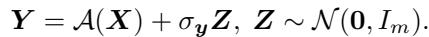
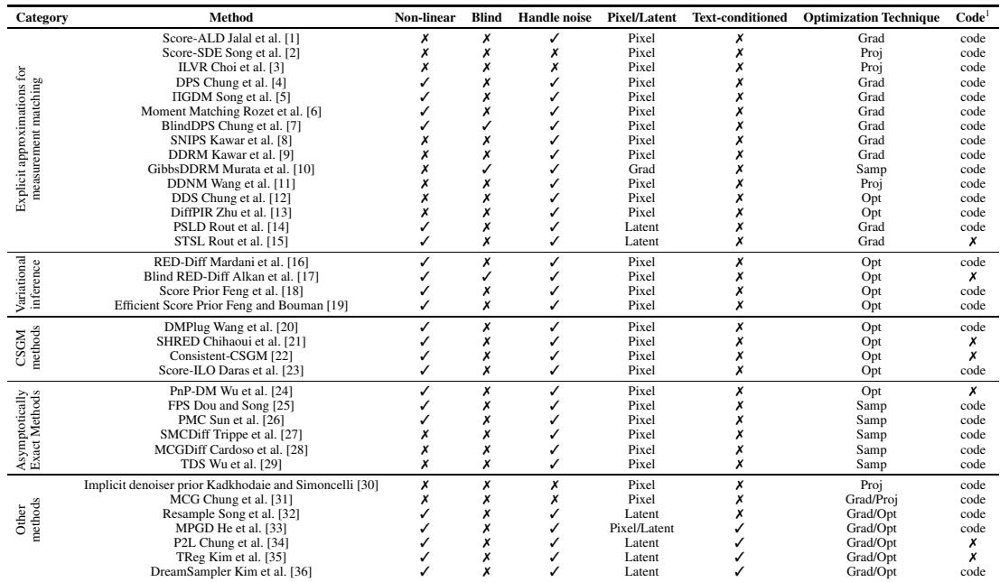
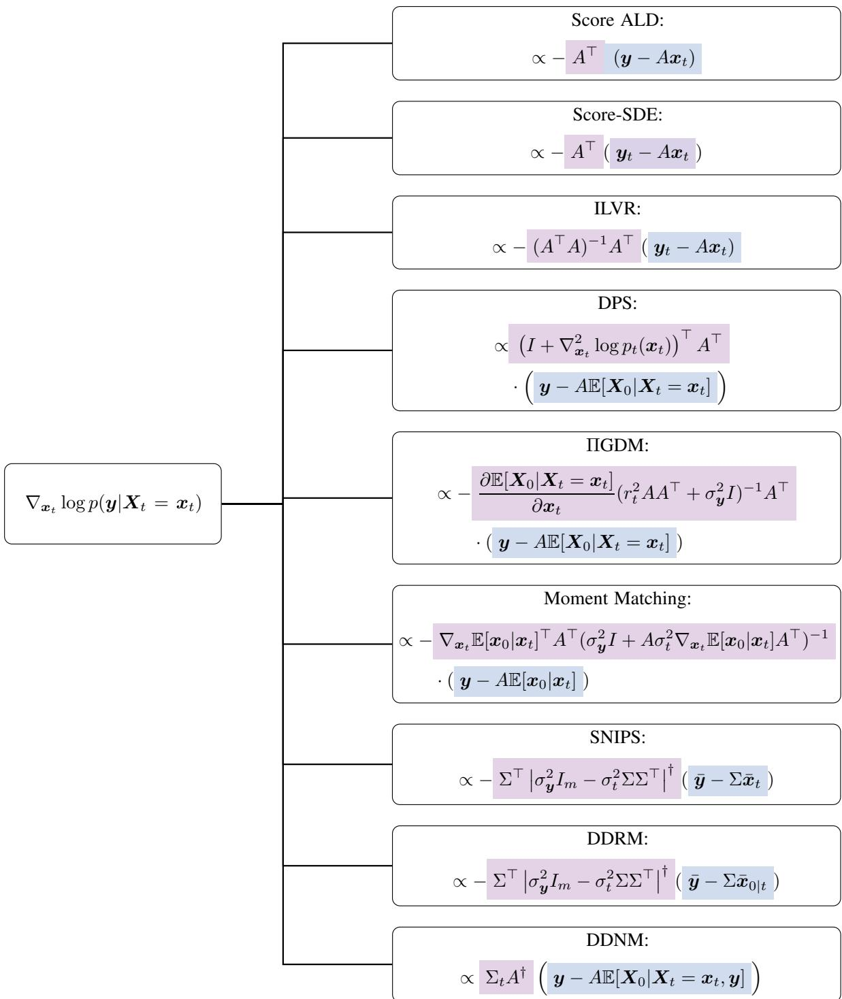
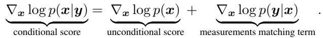
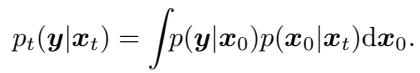

[← 返回 README](../README.md)

# 1. Introduction

## 📌 预览

引言干三件事：(1) 用统一记号 $y=\mathcal{A}(x)+\sigma_y z$ 定义逆问题，并给出去噪/inpainting/压缩感知/卷积/相位恢复等实例；(2) 区分两种"recovery"——点估计 (MAP/MMSE) vs 后验采样；(3) 用 Bayes 把 conditional score 拆成 prior score + measurement matching term（Eq. 1.2），并指出后者是 intractable 积分（Eq. 1.3），这就是全篇要攻克的核心难题。Table 1 是全篇分类总表，Figure 1 汇总 Explicit 家族的近似公式。

---

## 1 Introduction

### 1.1 Problem Setting

Inverse problems are ubiquitous and the associated reconstruction problems have tremendous applications across different domains such as seismic imaging [37, 38], weather prediction [39], oceanography [40], audio signal processing [41, 42, 43, 44, 45, 46], medical imaging [47, 48, 49, 50], etc. Despite their generality, inverse problems across different domains follow a fairly unified mathematical setting. Specifically, in inverse problems, the goal is to recover an unknown sample $\pmb { x } \in \mathbb { R } ^ { n }$ from a distribution $p _ { x }$ , assuming access to measurements $\pmb { y } \in \mathbb { R } ^ { m }$ and a corruption model

*Eq. 1.1: $y=\mathcal{A}(x)+\sigma_y z,\ z\sim\mathcal{N}(0,I_m)$。*

> 💡 **公式批读 Eq. 1.1 (Hao 批注)**: 这是全篇的"数据生成模型"。三个可能未知的量：算子 $\mathcal{A}$（盲问题里参数化为 $\mathcal{A}_\phi$）、噪声水平 $\sigma_y$、以及图像 $x$。**非盲设定假设 $\mathcal{A},\sigma_y$ 全知，只求 $x$；本课题的盲设定是联合求 $(x,\phi,\sigma_y)$。** 这个统一模型是后面所有方法的共同起点。

In what follows, we present some well-known examples of measurement models that fit under this general formulation.

Example 1.1 (Denoising). The simplest interesting example is the denoising inverse problem, i.e. when A is the identity matrix and $\sigma _ { y } \gt 0$ . In fact, the noise model does not have to be Gaussian and it can be generalized to other distributions, including the Laplacian Distribution or the Poisson Distribution [51]. For the purposes of this survey, we focus on additive Gaussian noise.

A lot of practical applications arise from the non-invertible linear setting, i.e. for $\boldsymbol { \mathcal { A } } ( \boldsymbol { X } ) = \boldsymbol { \mathcal { A } } \boldsymbol { X }$ and A being an m n matrix with $m \lt n$

Example 1.2 (Inpainting). A is a masking matrix, i.e. $A _ { i j } = 0$ for $i \neq j$ and $A _ { i i }$ is either 0 or 1, based on whether the value at this location is observed.

Example 1.3 (Compressed Sensing). A is a matrix with entries sampled from a Gaussian random variable.

Example 1.4 (Convolutions). Here (X) represents the convolution of X with a (Gaussian or other) kernel, which is again a linear operation.

> 💡 **与本课题的关系 (Hao 批注)**: Example 1.4（卷积/去模糊）正是本课题的主战场——运动模糊由长度/角度参数化的 kernel $\phi$ 决定。综述把它归为线性算子，但**一旦 $\phi$ 未知，$\mathcal{A}_\phi$ 对 $\phi$ 是非线性的**，问题就跳到"盲"这一列。后面 BlindDPS (3.1.7)、GibbsDDRM (3.1.8)、Blind RED-Diff (3.2.2) 就是专门处理这种参数化盲卷积的。

*Table 1: Categorization of Diffusion-Based Inverse Problem Solvers. This table categorizes methods by their approach to solving inverse problems with diffusion models. We identified four families of methods. Explicit Approximations for Measurement Matching: These methods approximate the measurement matching score, $\nabla \log p _ { t } ( \pmb { y } | \pmb { x } _ { t } )$ , with a closed-form expression. Variational Inference: These methods approximate the true posterior distribution, $p ( { \pmb x } | { \pmb y } )$ , with a simpler, tractable distribution. Variational formulations are then used to optimize the parameters of this simpler distribution. CSGM-type methods: The works in this category use backpropagation to change the initial noise of the deterministic diffusion sampler, essentially optimizing over a latent space for the diffusion model. Asymptotically Exact Methods: These methods aim to sample from the true posterior distribution. This is typically achieved by constructing Markov chains (MCMC) or by propagating particles through a sequence of distributions (SMC) to obtain samples that approximate the posterior. Further categorization is based on being able to address non-linear problems, blind formulations (unknown forward model), noise handling, pixel/latent space operation, text-conditioning, and the type of optimization technique used (gradient-based, projection, etc.). Code availability is also indicated.*

> 💡 **Table 1 批读 (Hao 批注)**: 这是整篇综述的"总地图"，务必对照阅读。两个维度值得盯：
> - **纵向（方法家族）**：Explicit Approximations（Score-ALD/Score-SDE/ILVR/DPS/ΠGDM/Moment Matching/BlindDPS/DDRM 家族/DDNM 家族）→ Variational（RED-Diff/Blind RED-Diff/Score Prior）→ CSGM（DMPlug/SHRED/Consistent-CSGM/Score-ILO）→ Asymptotically Exact（PnP-DM/FPS/PMC/SMCDiff/MCGDiff/TDS）→ Others（Latent 系：PSLD/STSL/Resample/MPGD/P2L/TReg/DreamSampler）。
> - **横向（能力标签）**：Non-linear / **Blind** / Handle noise / Pixel-Latent / Text-conditioned / Optimization Technique。
>
> **本课题只关心 "Blind=√" 那几行**：GibbsDDRM [10] 和 Blind RED-Diff [17] 是表中仅有的两个明确标 Blind 的方法（BlindDPS [7] 也是盲，虽然表里符号 OCR 模糊）。这三个 + DPS 就是本课题最相关的直接前作。其余方法都假设 $\mathcal{A}$ 已知，需自己扩展才能用于盲设定。

The same inverse problem can appear across vastly different scientific fields. To illustrate this point, we can take the inpainting case as an example. In Computer Vision, inpainting can be useful for applications such as object removal or object replacement [52, 14, 53]. In the proteins domain, inpainting can be useful for protein engineering, e.g. by mutating certain aminoacids of the protein sequence to achieve better thermodynamical properties [54, 55, 56, 57]. MRI acceleration is also an inpainting problem but in the Fourier domain [58, 59, 60, 61, 62]. Particularly, for each coil measurement $y _ { i }$ within the multi-coil setting, we have $A _ { i } = P F S _ { i } ,$ where $P$ is the masking operator, $F$ is the 2D discrete Fourier transform, and $S _ { i }$ denotes the element-wise sensitivity value. For single-coil, $S _ { i }$ is the identity matrix Lustig et al. [63]. Similarly, CT can be considered an inpainting problem in the Radon-transformed domain $A = P R$ , where R is the Radon transform [64, 65, 66]. Depending on the circumstances such as sparse-view or limited-angle, the pattern of the masking operator $\breve { P }$ differs Kak and Slaney [67]. Finally, in the audio domain, the bandwidth extension problem, i.e. the task of recovering high-frequency content from an observed signal, is another example of inpainting in the spectrogram domain) Dietz et al. [68].

Inpainting is just one of many useful linear inverse problems in scientific applications and there are plenty of other important examples to consider. Cryo-EM Dubochet et al. [69] is a blind inverse problem that is defined by $A = C S R ,$ where $C$ is a blur kernel and $S$ is a shifting matrix, i.e. additional (unknown) shift and blur is applied to the projections. Deconvolution appears in several applications such as super-resolution [70, 71] of images and removing reverberant corruption [72] in audio signals.

> 💡 **机制拆解 (Hao 批注)**: 作者用 inpainting 一例串起 CV/蛋白/MRI/CT/音频——**同一个数学骨架（masking 矩阵 $A$）换个变换域就是不同学科的问题**（MRI 在 Fourier 域、CT 在 Radon 域、音频在 spectrogram 域）。这解释了为何"训练无关的通用求解器"有价值：先验 $p(x)$ 不变，只换 $A$。Cryo-EM 的 $A=CSR$（未知模糊 $C$ + 未知平移 $S$）是天然的盲问题实例，跟本课题的参数化盲算子高度同构。

*Figure 1: Approximations for the measurements score proposed by different methods.*

> 💡 **Figure 1 批读 (Hao 批注)**: 这张图是 Explicit 家族的"公式速查表"，把每个方法的 measurement matching score 近似写成统一模板 $-\mathcal{L}_t\mathcal{M}_t/\mathcal{G}_t$（Eq. 3.1）。看图的关键是对比 **lifting 矩阵 $\mathcal{L}_t$ 的复杂度**：Score-ALD 用最朴素的 $A^\top$；ILVR/DDNM 用伪逆 $A^\dagger$；ΠGDM/Moment Matching 用带协方差的 $(r_t^2 AA^\top+\sigma_y^2 I)^{-1}$ 或 Jacobian $\nabla_{x_t}\mathbb{E}[x_0|x_t]$。**越往下 lifting 越接近真 posterior score 的二阶几何，代价是算力（要 Jacobian-vector product）。** 这就是"prior score 与 posterior score 差距"的具象化——所有方法都在补那个 intractable 的 $\nabla\log p_t(y|x_t)$。

There are many interesting non-linear inverse problems too, i.e. where  is a nonlinear operator. Example 1.5 (Phase Retrieval Fienup [73]). Phase retrieval considers the nonlinear operator $\mathcal { A } ( X ) : = | F X |$ , where the measurement contains only the magnitude of the Fourier signal. Example 1.6 (Compression Removal). Here ${ \mathcal { A } } ( X ; \alpha )$ represents a (non-linear) compression operator (e.g., JPEG) whose strength is controlled by the parameter α.

A famous non-linear inverse problem is the problem of imaging a black hole, where the relationship between the image to be reconstructed and the interferometric measurement can be considered as a sparse and noisy Fourier phase retrieval problem [74].

### 1.2 Recovery types

One common characteristic of these problems is that information is lost and perfect recovery is impossible [75], i.e. they are ill-posed. Hence, the type of “recovery” we are looking for should be carefully defined [76]. For instance, one might be looking for the point that maximizes the posterior distribution $p ( { \pmb x } | { \pmb y } )$ [77, 78]. Often, the Maximum a posteriori (MAP) estimation coincides with the Minimum Mean Squared Error Estimator, i.e. the conditional expectation E[x y] [79, 80]. MMSE estimation attempts to minimize distortion of the unknown signal $^ { \mathbf { \delta x } , }$ but often lead to unrealistic recoveries. A different approach is to sample from the full posterior distribution, $p ( { \pmb x } | { \pmb y } )$ . Posterior sampling accounts for the uncertainty of the estimation, and typically produces samples that have higher perception quality. Blau and Michaeli [81] show that, in general, it is impossible to find a sample that maximizes perception and minimizes distortion at the same time. Yet, posterior sampling is nearly optimal [1] in terms of distortion error.

> 💡 **问题动机 1.2 (Hao 批注)**: 这一小节是本课题的"理念根基"。三种 recovery 目标：MAP（后验峰值）、MMSE（后验均值 $\mathbb{E}[x|y]$，最小化 distortion 但常给模糊平均图）、**posterior sampling（采后验，兼顾 perception + 不确定性）**。Blau-Michaeli 的 perception-distortion tradeoff 说明"又清晰又低失真"不可兼得。**本课题选后验采样路线，正是因为它保留不确定性——而"保留不确定性"要有意义，后验必须校准**，这就是引入 SBC/coverage/CRPS 的动机。综述提到 posterior sampling"账上"考虑了不确定性，但从不验证这个不确定性是否 well-calibrated，这是它与本课题的分水岭。

### 1.3 Approaches for Solving Inverse Problems

Inverse problems have a rich history, with approaches evolving significantly over the decades Ribes and Schmitt [82], Barrett and Myers [83]. While a comprehensive review is beyond the scope of this survey, we highlight key trends to provide context. Early approaches, prevalent in the 2000s, often framed inverse problems as optimization tasks Daubechies et al. [84], Candès et al. [85], Donoho [86], Figueiredo and Nowak [87], Daubechies et al. [84], Hale et al. [88], Shlezinger et al. [89]. These methods sought to balance data fidelity with regularization terms that encouraged desired solution properties like smoothness Rudin et al. [90], Beck and Teboulle [91] or sparsity in specific representations (e.g., wavelets, dictionaries) Figueiredo and Nowak [87], Daubechies et al. [84], Candès et al. [85], Donoho [86], Hale et al. [88].

The advent of deep learning brought a paradigm shift Ongie et al. [92]. Researchers began leveraging large paired datasets to directly learn mappings from measurements to clean signals using neural networks Dong et al. [93], Lim et al. [94], Tao et al. [95], Chen et al. [96], Zamir et al. [97], Chen et al. [98], Tu et al. [99], Zamir et al. [100]. These approaches focus on minimizing some reconstruction loss during training, with various techniques employed to penalize distortions, and optimize for specific application goals (e.g., perceptual quality Isola et al. [101], Kupyn et al. [102]). Traditional point estimates aim to recover a single reconstruction by for example minimizing the average reconstruction error (i.e., MMSE) or by finding the most probable reconstruction through Maximum a Posteriori estimate (MAP), i.e., finding the x that maximizes $p ( { \pmb x } | { \pmb y } )$ ). While powerful, this approach can suffer from “regression to the mean”, where the network predicts an average solution that may lack important details or even be outside the desired solution space Blau and Michaeli [81], Delbracio and Milanfar [103]. In fact, learning a mapping to minimize a certain distortion metric will lead, in the best case, to an average of all the plausible reconstructions (e.g., when using a L2 reconstruction loss, the best-case solution will be the posterior mean). This reconstruction might not be in the target space (e.g., a blurry image being the average of all plausible reconstructions) Blau and Michaeli [81].

Recent research has revealed a striking connection between denoising algorithms and inverse problems. Powerful denoisers, often based on deep learning, implicitly encode valuable information about natural signals. By integrating these denoisers into optimization frameworks, we can harness their learned priors to achieve exceptional results in a variety of inverse problems Venkatakrishnan et al. [104], Sreehari et al. [105], Chan et al. [106], Romano et al. [107], Cohen et al. [108], Kad khodaie and Simoncelli [109], Kamilov et al. [110], Milanfar and Delbracio [111]. This approach bridges the gap between traditional regularization methods and modern denoising techniques, offering a promising new paradigm for solving these challenging tasks.

An alternative perspective views inverse problems through the lens of Bayesian inference. Given measurements y, the goal becomes generating plausible reconstructions by sampling from the posterior distribution $p ( \boldsymbol { X } | \boldsymbol { Y } = \boldsymbol { y } )$ – the distribution of possible signals x given the observed measurements y.

In this survey we explore a specific class of methods that utilize diffusion models as priors for pX , and then try to generate plausible reconstructions (e.g., by sampling from the posterior). While other approaches exist, such as directly learning conditional diffusion models or flows for specific inverse problems Li et al. [112], Saharia et al. [71, 113], Whang et al. [114], Luo et al. [115, 116], Albergo and Vanden-Eijnden [117], Albergo et al. [118], Lipman et al. [119], Liu et al. [120, 121], Shi et al. [122], these often require retraining for each new application. In contrast, the methods covered in this survey offer a more general framework applicable to arbitrary inverse problems without retraining or fine-tuning.

> 💡 **范围界定 (Hao 批注)**: 这里划清综述边界——**只收"扩散模型当先验 + 推理时求后验"的方法，不收"直接训练条件扩散/流"（SR3、Palette、Flow Matching、Schrödinger Bridge 等）**。理由是后者对每个新 $\mathcal{A}$ 都要重训，不通用。本课题继承这个"训练无关"立场：先验一次训好，$\phi/\sigma$ 推理时估。

Unsupervised methods. We refer as unsupervised methods to those that focus on characterizing the distribution of target signals, $p _ { \mathbf { { X } } } .$ , and applying this knowledge during the inversion process. Since they don’t rely on paired data, they can be flexibly applied to different inverse problems using the same prior knowledge.

Unsupervised methods can be used to maximize the likelihood of $p ( { \pmb x } | { \pmb y } )$ or to sample from this distribution. Algorithmically, to solve the former problem we typically use (some variation of) Gradient Descent and to solve the latter (some variation of) Monte Carlo Simulation $( \mathrm { e . g . }$ , Langevin Dynamics). Either way, one typically requires to compute the gradient of the conditional log-likelihood, $\mathrm { i . e . , } \nabla _ { x } \log p ( \pmb { x } | \pmb { y } )$

A simple application of Bayes Rule reveals that:

*Eq. 1.2: conditional score = unconditional score + measurements matching term。*

> 💡 **公式批读 Eq. 1.2（核心分解）(Hao 批注)**: **这是全篇最重要的等式，务必刻在脑子里。** Bayes 把 conditional score 拆成两块：
> - $\nabla_x\log p(x)$ = **prior score**，扩散模型（去噪器）能给；
> - $\nabla_x\log p(y|x)$ = **measurements matching term**，由逆问题决定。
>
> 在 $t=0$（无噪）时第二项有闭式 $\frac{y-Ax}{\sigma_y^2}$（线性情形）。**这就是本课题标题里 "prior score 与 posterior score 的差距" 的定义式：差距 = measurement matching term。** 全篇四大家族的分歧只有一个：如何算这一项在扩散时刻 $t$ 的版本 $\nabla_{x_t}\log p_t(y|x_t)$。

The last term typically has a closed-form expression, e.g. for the linear case, we have that: $\nabla _ { \pmb { x } } \log p ( \pmb { y } | \pmb { x } ) = \frac { \pmb { y } - A \pmb { x } } { \sigma _ { \pmb { y } } ^ { 2 } }$ . However, the first term, known as the score function, might be hard to estimate when the data lie on low-dimensional manifolds. The problem arises from the fact that we do not get observations outside of the manifold and hence the vector-field estimation is inaccurate in these regions.

One way to sidestep this issue is by using a “smoothed” version of the score function, representing the score function of noisy data that will be supported everywhere. The central idea behind diffusion generative models is to learn score functions that correspond to different levels of smoothing. Specifically, in diffusion modeling, we attempt to learn the smoothed score functions, $\nabla _ { \pmb { x } _ { t } } \log p _ { t } ( \pmb { x } _ { t } )$ where $\boldsymbol X _ { t } = \boldsymbol X _ { 0 } + \sigma _ { t } \boldsymbol Z , \ \boldsymbol Z \sim \mathcal N ( \mathbf { 0 } , I )$ , for different noise levels t. During sampling, we progressively move from more smoothed vector fields to the true score function. At the very end, the score function corresponding to the data distribution is only queried at points for which the estimation is accurate because of the warm-start effect of the sampling method.

> 💡 **机制拆解（为何要平滑）(Hao 批注)**: 关键 tension——**平滑（加噪）让 prior score 好估（噪声数据处处有支撑，避开 manifold 问题），但代价是 measurement matching term 变成时间依赖 $\nabla_{x_t}\log p_t(y|x_t)$ 并失去闭式**。这就是下一段 Eq. 1.3 那个 intractable 积分的由来。扩散求逆问题的全部麻烦都在这个 trade-off 里。

Even though estimating the unconditional score becomes easier (because of the smoothing), the measurement matching term becomes time dependent and loses its closed form expression. Indeed, the likelihood of the measurements is given by the intractable integral:

*Eq. 1.3: $p_t(y|x_t)=\int p(y|x_0)p(x_0|x_t)dx_0$，intractable。*

> 💡 **公式批读 Eq. 1.3（核心难题）(Hao 批注)**: 这个积分是全篇的"公敌"。$p(x_0|x_t)$ 是"给定噪声图 $x_t$，干净图 $x_0$ 的后验"，无闭式。四家族对它的处理：DPS 用 $\delta(x_0-\mathbb{E}[x_0|x_t])$（点质量）；ΠGDM 用各向同性高斯；Moment Matching 用带真协方差的高斯（Eq. 3.19）；SMC 用粒子数值逼近。**对本课题：盲设定下积分还要再对 $\phi$ 边缘化，$p_t(y|x_t)=\int\int p(y|x_0,\phi)p(x_0|x_t)p(\phi)\,dx_0 d\phi$，难度进一步升级——这也是 BlindDPS/GibbsDDRM 都得对 $\phi$ 再套一层近似的原因。**

The computational challenge that emerges from the intractability of the conditional likelihood has led to the proposal of numerous approaches to use diffusion models to solve inverse problems [1, 4, 5, 2, 3, 9, 8, 11, 12, 13, 6, 123, 124, 16, 18, 19, 24, 25, 28, 29, 30, 20, 21, 125, 126]. The sheer number of the proposed methods, but also the different perspectives under which these methods have been developed, make it hard for both newcomers and experts in the field to understand the connections between them and the unifying underlying principles. This work attempts to explain, taxonomize and relate prominent methods in the field of using diffusion models for inverse problems. Our list of methods is by no means exhaustive. The goal of this manuscript is not to list all the methods that have been proposed but to review some representative methods of different approaches and present them under a unifying framework. We believe this survey will be useful as a reference point for people interested in this field.

---

## 🔖 Section 总结

### 关键数字速查
| 项 | 内容 |
|------|------|
| 方法家族数 | 4（Explicit / Variational / CSGM / Asymptotically Exact，外加 Others=Latent 系）|
| 核心分解式 | Eq. 1.2：conditional score = prior score + measurement matching |
| 核心难题 | Eq. 1.3：$p_t(y|x_t)$ 是 intractable 积分 |
| 线性情形闭式 matching（$t=0$）| $\frac{y-Ax}{\sigma_y^2}$ |

### 核心洞察
1. **prior score 与 posterior score 的差距 = measurement matching term $\nabla_{x_t}\log p_t(y|x_t)$**，这是全篇的中心变量，也是本课题标题所指。
2. 平滑（加噪）让 prior 好估、却让 matching term 失去闭式，这个矛盾催生了所有方法。
3. Recovery 分点估计（MAP/MMSE）与后验采样；本课题选后验采样并要求校准，恰好补上综述未涉及的一环。

### 可追问点
- 盲设定下 matching term 还要对 $\phi$ 边缘化，哪家族最容易扩展？（见 03 节 BlindDPS/GibbsDDRM/Blind RED-Diff）
- 后验采样"账上"含不确定性，但如何验证其校准？（综述空白，本课题切入点）
