[← 返回 README](../README.md)

# 2. Background

## 📌 预览

背景节铺三层地基：(2.1) 扩散的前向/反向 SDE、Probability Flow ODE、VE/VP/DDIM；(2.2) Tweedie 公式把 score 与去噪器 MMSE 划等号，是全篇的"引擎"；(2.3) latent diffusion；(2.4) 条件采样——先讲直接训条件模型（要重训，本文不走），再讲用预训练模型 + Bayes 分解（Eq. 2.17，全篇主线），并引 Gupta et al. 的超多项式硬下界。(2.4.5) Ambient Diffusion：从损坏数据学先验，与本课题"从不完美数据建先验"相关。

---

## 2 Background

### 2.1 Diffusion Processes

Forward and Reverse Processes. The idea of a diffusion model is to transform a a simple distribution (e.g., normal distribution) into the unknown data distribution $p _ { 0 } ( { \pmb x } )$ , that we don’t know explicitly but we have access to some of its samples. The first step is to define a corruption process. The popular Denoising Diffusion Probabilistic Models (DDPM) Ho et al. [127], Song and Ermon [128], adopt a discrete time Markovian process to transform the input Normal distribution into the target one by incrementally adding Gaussian noise. More generally, the corruption processes of interest can be generalized to continuous time by a stochastic differential eqaution (SDE) [2]:

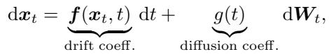

with $\pmb { x } _ { 0 } \sim p _ { 0 } , \pmb { x } _ { 0 } \in \mathbb { R } ^ { n }$ , and $W _ { t }$ denotes a Wiener process (i.e., Brownian motion). This SDE gradually transforms the data distribution into Gaussian noise. We denote with $p _ { t }$ the distribution that arises by running this dynamical system up to time t.

A remarkable result by Anderson [129] shows that we can sample from $p _ { 0 }$ by running backwards in time the reverse SDE:

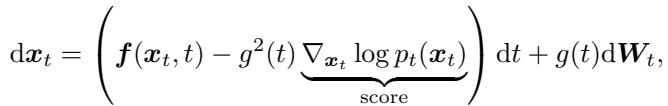

initialized at $\pmb { x } _ { T } \sim p _ { T }$ . For sufficiently large T and for linear drift functions $f ( \cdot , \cdot )$ , the latter distribution approaches a Gaussian distribution with known parameters that can be used for initializing the process. Hence, the remaining goal becomes to estimate the score function $\nabla _ { \pmb { x } _ { t } } \log p _ { t } ( \pmb { x } _ { t } )$

> 💡 **机制拆解 Eq. 2.1–2.2 (Hao 批注)**: 前向 SDE（Eq. 2.1）把数据推成高斯，反向 SDE（Eq. 2.2）从高斯采回数据——反向唯一需要的未知量就是 **score $\nabla_{x_t}\log p_t(x_t)$**。这是全篇的"发动机接口"：只要拿到 score，采样就能跑。逆问题的做法就是把 score 换成 conditional score（Eq. 2.13），而 conditional score 靠 Eq. 2.17 的 Bayes 分解拆出 prior score + matching term。

Probability Flow ODE. Song et al. [2], Maoutsa et al. [130] observe that the (deterministic) differential equation:

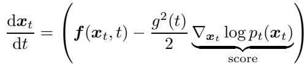

corresponds to the same Fokker-Planck equations as the SDE of Equation 2.2. An implication of this is we can use the deterministic sampling scheme of Equation 2.3. Any well-built numerical ODE solver can be used to solve Equation 2.3, such as the Euler solver:

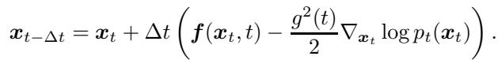

> 💡 **机制拆解（PF-ODE 为何重要）(Hao 批注)**: PF-ODE（Eq. 2.3）与反向 SDE 有相同边缘分布但**确定性**——同一个初始 noise 唯一决定输出图像。这正是 CSGM 家族（DMPlug/SHRED/Score-ILO，见 03 节 3.4）赖以工作的前提：把"输出图像"当作"初始 noise $z$"的确定函数 $\hat{x}(z)$，就能反传优化 $z$。同时 PF-ODE 也是 Score Prior（3.2.3）用 change-of-variables 算 $\log p_\theta(x_0)$ 的基础。

SDE variants: Variance Exploding and Variance Preserving Processes. The drift coefficients, $f ( \pmb { x } _ { t } , t )$ , and the diffusion coefficients $g ( t )$ are design choices. One popular choice, known as the Variance Exploding SDE, is setting $\pmb { f } ( \pmb { x } _ { t } , t ) = \mathbf { 0 }$ and $g ( t ) = \sqrt { \frac { \mathrm { d } \sigma _ { t } ^ { 2 } } { \mathrm { d } t } }$ for some variance scheduling $\{ \sigma _ { t } \} _ { t = 0 } ^ { T }$ . Under these choices, the marginal distribution at time t of the forward process of Equation 2.1 can be alternatively described as:

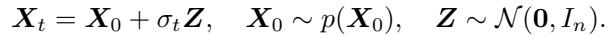

The typical noise scheduling for this SDE is $\sigma _ { t } = \sqrt { t }$ (that corresponds to $g ( t ) = 1 )$ .

Another popular choice is to set the drift function to be $\pmb { f } ( \pmb { x } _ { t } , t ) = - \pmb { x } _ { t }$ , which is known as the Variance Preserving (VP) SDE. A famous process in the VP SDE family is the Ornstein–Uhlenbeck (OU) process:

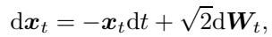

which gives:

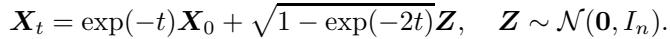

The VP SDE [127] takes a more general form:

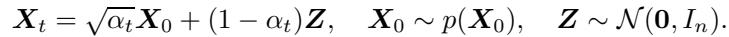

With reparametrization and the Euler solver, this leads to an efficient solution to Equation 2.3, known as DDIM [131]:

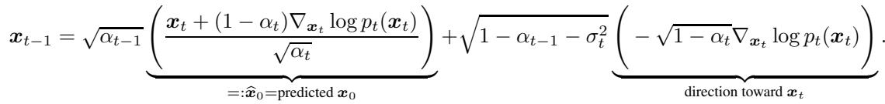

For convenience, in the rest of the paper, this update will be written as: $\pmb { x } _ { t - 1 } \gets$ Unconditional $\text{DDIM} ( \widehat { \pmb x } _ { 0 } , \pmb x _ { t } )$ .

> 💡 **公式批读 Eq. 2.9（DDIM 记号约定）(Hao 批注)**: 记住 DDIM 更新被简写成 $x_{t-1}\gets \text{UnconditionalDDIM}(\hat{x}_0, x_t)$，其中 $\hat{x}_0$ 是 Tweedie 预测的干净图。**03 节大量方法（Resample、MPGD、P2L）都复用这个记号**：它们先算/修正一个 $\hat{x}_0$，再喂给 UnconditionalDDIM 走一步。抓住"predicted $x_0$"这个中间变量，就抓住了这些 latent 方法的数据流。VE 与 VP 只是 $f,g$ 的不同选择，数学等价。

### 2.2 Tweedie’s Formula and Denoising Score Matching

In what follows, we will discuss how one can learn the score function $\nabla _ { \pmb { x } _ { t } } \log p _ { t } ( \pmb { x } _ { t } )$ that appears in Equation 2.17. We will focus on the VE SDE, since the mathematical calculations are simpler.

Tweedie’s formula [132] is a famous result in statistics that shows that for an additive Gaussian corruption, $X _ { t } = X _ { 0 } + \sigma _ { t } Z , Z \sim \mathcal { N } ( \mathbf { 0 } , I _ { n } )$ , it holds that:

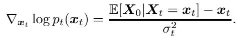

*Eq. 2.10: $\nabla_{x_t}\log p_t(x_t)=\frac{\mathbb{E}[X_0|x_t]-x_t}{\sigma_t^2}$。*

The formal statement and a self-contained proof can be found in the Appendix, Lemma A.2.

> 💡 **公式批读 Eq. 2.10（Tweedie，全篇引擎）(Hao 批注)**: **这是仅次于 Eq. 1.2 的第二核心式。** 它把三样东西划等号：score = (去噪器输出 − 输入) / 噪声方差。即 **score ⟺ MMSE 去噪器 $\mathbb{E}[X_0|x_t]$**。意义：(1) 训练时只需学去噪器（Eq. 2.11 的 L2 回归），推理时用这式换算 score；(2) DPS/DDNM/ΠGDM 等几乎所有方法都用 $\hat{x}_0=\mathbb{E}[X_0|x_t]$ 作为 measurement matching 的锚点。**对本课题：Tweedie 也是"gauge"意识的入口——去噪器给的是 posterior mean，其协方差（Eq. 3.19 / Lemma A.4）才承载不确定性，校准检验最终要盯这个协方差是否真实。**

Tweedie’s formula gives us a way to derive the unconditional score function needed in Equation 2.17, by optimizing for the conditional expectation, $\mathbb { E } [ X _ { 0 } | X _ { t } ~ = ~ { \pmb x } _ { t } ]$ . The conditional expectation $\mathbb { E } [ X _ { 0 } | X _ { t } = { \pmb x } _ { t } ]$ , is nothing more than the minimum mean square error estimator (MMSE) of the clean image given the noisy observation ${ \pmb x } _ { t }$ , that is a denoiser.

In practice, we don’t know analytically this denoiser but we can parametrize it using a neural network $h _ { \theta } ( { \pmb x } _ { t } )$ and learn it in a supervised way by minimizing the following objective:

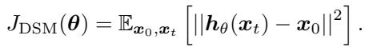

Assuming a rich enough family $\Theta$ , the minimizer of Equation 2.11 is ${ \pmb h } _ { \theta } ( { \pmb x } _ { t } ) = \mathbb { E } [ { \pmb x } _ { 0 } | { \pmb X } _ { t } = { \pmb x } _ { t } ]$ (see Lemma A.1) and the score in Equation 2.10 is approximated as $\left( h _ { \theta } ( { \pmb x } _ { t } ) - { \pmb x } _ { t } \right) / \sigma _ { t } ^ { 2 }$ . Note that for each $\sigma _ { t }$ we would need to learn a different denoiser (since the noise strength is different), or alternative the neural network $h _ { \theta }$ should also take as input the value of t or $\sigma _ { t } .$ . Diffusion models are trained following the later paradigm, i.e. the same neural network approximates the optimal denoisers at all noise levels by conditioning it on the noise level through t.

Interestingly, Vincent [133] independently discovered that the score function can be learned by minimizing an $l _ { 2 }$ objective, similar to Equation 2.11. The formal statement and a self-contained proof of this alternative derivation is included in the Appendix, Theorem A.3.

### 2.3 Latent Diffusion Processes

For high-dimensional distributions, diffusion models training (see Equation 2.11) and sampling (see Equation 2.3) require massive computational resources. To make the training and sampling more efficient, the authors of Stable Diffusion Rombach et al. [134] propose performing the diffusion in the latent space of a pre-trained powerful autoencoder. Specifically, given an encoder Enc : $\mathbb { R } ^ { n } \to \mathbb { R } ^ { k }$ and a decoder Dec : $\mathbb { R } ^ { k } \to \mathbb { R } ^ { n }$ , one can create noisy samples:

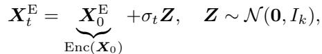

and train a denoiser network in the latent space. At inference time, one starts with pure noise, samples a clean latent $\tilde { \mathbf { x } } _ { 0 } ^ { \mathrm { E } }$ by running the reverse process, and outputs $\pmb { x } _ { 0 } = \mathrm { D e c } ( \tilde { \pmb { x } } _ { 0 } ^ { \mathrm { E } } )$ . Solving inverse problems with Latent Diffusion models requires special treatment. We discuss the reasons and approaches in this space in Section 3.5.

> 💡 **机制拆解（latent 引入的麻烦）(Hao 批注)**: latent diffusion 把扩散搬进 autoencoder 的隐空间省算力，但代价在 3.5 节展开：measurement 在像素域、扩散在 latent 域，Enc/Dec 非线性，导致**线性逆问题也变成非线性**，且 Enc∘Dec 非一一映射。本课题若用 SD 类先验，需正视这套 latent 治理（PSLD/Resample/MPGD 的做法）。

### 2.4 Conditional Sampling

#### 2.4.1 Stochastic Samplers for Inverse Problems

The goal in inverse problems is to sample from $p _ { 0 } ( \cdot | \pmb { y } )$ assuming a corruption model $Y = \mathcal { A } ( X _ { 0 } ) + \sigma _ { y } Z , Z \sim \mathcal { N } ( \mathbf { 0 } , I _ { m } )$ . We can easily adapt the original unconditional formulation given by Equation 2.2 into a conditional one to generate samples from $p _ { 0 } ( \cdot | \pmb { y } )$ . Specifically, the associated reverse process is given by the stochastic dynamical system [135]:

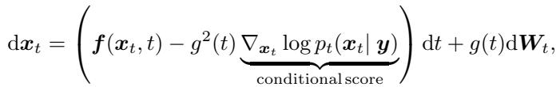

initialized at $\pmb { x } _ { T } \sim p _ { T } ( \cdot | \pmb { y } )$ . For sufficiently large T and for linear drift functions $f ( \cdot , \cdot )$ , the distribution $p _ { T } ( \cdot | \pmb { y } )$ is a Gaussian distribution with parameters independent of y. In the conditional case, the goal becomes to estimate the score function $\nabla _ { \pmb { x } _ { t } } \log p _ { t } ( \pmb { x } _ { t } | \pmb { y } )$

#### 2.4.2 Deterministic Samplers for Inverse Problems

It is worth noting that (as in the unconditional setting) it is possible to derive deterministic sampling algorithms as well. Particularly, one can use the following dynamical system [2, 135]:

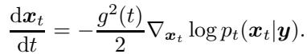

initialized at $p _ { T } ( \cdot | \boldsymbol { y } )$ to get sample from the conditional distribution $p _ { 0 } ( \cdot | \pmb { y } )$ . Once again, to run this discrete dynamical system, one needs to know the conditional score, $\nabla _ { \pmb { x } _ { t } } \log p _ { t } ( \pmb { x } _ { t } | \pmb { y } )$

#### 2.4.3 Conditional Diffusion Models

Similarly to the unconditional setting, one can directly train a network to approximate the conditional score, $\nabla _ { \pmb { x } _ { t } } \log p _ { t } ( \pmb { x } _ { t } | \pmb { y } )$ . A generalization of Tweedie’s formula gives that:

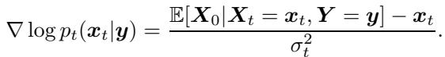

Hence, one can train a network using a generalized version of the Denoising Score Matching,

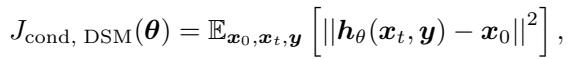

and then use it in Equation 2.15 in place of the conditional expectation. The main issue with this approach is that the forward model (degradation operator) needs to be known at training time. If the corruption model ${ \boldsymbol { \mathcal { A } } } ( X )$ changes, then the model needs to be retrained. Further, with this approach we need to train new models and we cannot directly leverage powerful unconditional models that are already available. The focus of this work is on methods that use pre-trained unconditional diffusion models to solve inverse problems, without further training.

> 💡 **对比批注（为何不走直接条件训练）(Hao 批注)**: 2.4.3 是本文明确排除的路线——直接训 $h_\theta(x_t,y)$。硬伤：**forward 算子必须在训练时已知，换 $\mathcal{A}$ 就得重训**。这对盲问题几乎致命（$\phi$ 未知且连续变化，不可能为每个 $\phi$ 训一个条件模型）。所以本课题和综述都站在 2.4.4 一边：固定无条件先验，推理时处理 $y$ 和未知 $\phi$。

#### 2.4.4 Using pre-trained diffusion models to solve inverse problems

As we showed earlier, the conditional score can be decomposed using Bayes Rule into:

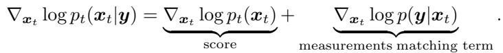

*Eq. 2.17: conditional score = prior score + measurements matching term（时间依赖版）。*

that is, the (smoothed) score function, and the measurements matching term that is given by the inverse problem we are interested in solving. Applying this to equation 2.13, we get that:

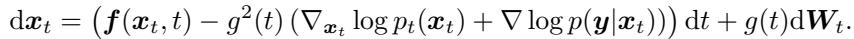

Similarly, one can use the deterministic process:

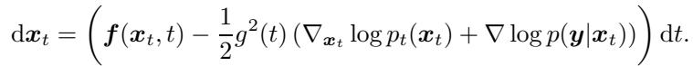

We have already discussed how to train a neural network to approximate $\nabla _ { \pmb { x } _ { t } } \log p _ { t } ( \pmb { x } _ { t } )$ (using Tweedie’s Formula / Denoising Score Matching). However, here we further need access to the term $\nabla _ { \pmb { x } _ { t } } \log p ( \pmb { y } | \pmb { x } _ { t } )$ . The likelihood of the measurements is given by the intractable integral:

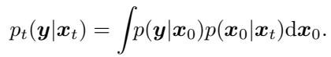

> 💡 **公式批读 Eq. 2.17（全篇主线方程）(Hao 批注)**: 这是 Eq. 1.2 的"扩散时刻版"，也是 03 节所有方法的公共出发点。**prior score $\nabla_{x_t}\log p_t(x_t)$ 由预训练去噪器给（免费）；measurement matching $\nabla_{x_t}\log p_t(y|x_t)$ 靠 Eq. 2.20 那个 intractable 积分（收费）。** 全篇的分类，本质就是"如何近似/采样这第二项"。Eq. 2.18/2.19 只是把它塞回随机/确定性反向过程。

Gupta et. al [136] prove that there are instances of the posterior sampling problem for which every algorithm takes superpolynomial time, even though unconditional sampling is provably fast. Hence, diffusion models excel at performing unconditional sampling but are hard to use as priors for solving inverse problems because of the time dependence in the measurements matching term. Since the very introduction of diffusion models, there has been a plethora of methods proposed to use them to solve inverse problems without retraining. This survey serves as a reference point for different techniques that have been developed in this space.

> 💡 **Q&A 批注记录 (Hao 批注)**:
> - Q: 既然无条件采样很快，为什么加个 $y$ 条件就这么难？
> - A: Gupta et al. [136] 证明了 posterior sampling 存在实例使**任何算法都需超多项式时间**，而无条件采样可证明快。根源是 measurement matching term 的时间依赖（Eq. 2.20 积分）。这是理论硬下界，意味着不存在对所有逆问题都又快又准的通用解——只能在近似误差与算力间取舍（呼应 04 节四家族的取舍）。对本课题：盲设定叠加 $\phi$ 边缘化只会更难，所以"可校准"比"最优"更现实。

#### 2.4.5 Ambient Diffusion: Learning to solve inverse problems using only measurements

The goal of the unsupervised learning approach for solving inverse problems (Section 2.4.4) is to use a prior $p ( { \pmb x } )$ to approximate the measurements matching term, log $p _ { t } ( \pmb { y } | \pmb { x } _ { t } )$ . However, in certain applications, it is expensive or even impossible to get data from (and hence learn) $p ( { \pmb x } )$ in the first place. For instance, in MRI the quality of the data is proportionate to the time spent under the scanner [59] and it is infeasible to acquire full measurements from black holes [74]. This creates a chicken-egg problem: we need access to $p ( { \pmb x } )$ to solve inverse problems and we do not have access to samples from $p ( { \pmb x } )$ unless we can solve inverse problems. In certain scenarios, it is possible to break this seemingly impossible cycle.

Ambient Diffusion Daras et al. [137] was one of the first frameworks to train diffusion models with linearly corrupted data. The key concept behind the Ambient Diffusion framework is the idea of further corruption. Specifically, the given measurements get further corrupted and the model is trained to predict a clean image by using the measurements before further corruption for validation. Ambient DPS [49] shows that priors learned from corrupted data can even outperform (in terms of usefulness for inverse problems), at the high-corruption regime, priors learned from clean data. Ambient Diffusion was extended to handle additive Gaussian Noise in the measurements. The paper Consistent Diffusion Meets Tweedie Daras et al. [138] was the first diffusion-based framework to provide guarantees for sampling from the distribution of interest, given only access to noisy data. This paper extends the idea of further corruption to the noisy case and proposes a novel consistency loss Daras et al. [139] to learn the score function for diffusion times that correspond to noise levels below the level of the noise in the dataset.

Both Ambient Diffusion and Consistent Diffusion Meets Tweedie have connections to deep ideas from the literature in learning restoration models from corrupted data, such as Stein’s Unbiased Risk Estimate (SURE) Eldar [140], Stein [141] and Noise2X Lehtinen et al. [142], Krull et al. [143], Batson and Royer [144]. These connections are also leveraged by alternative frameworks to Ambient Diffusion, as in [8, 58]. A different approach for learning diffusion models from measurements is based on the Expectation-Maximization (EM) algorithm [145, 6, 146]. The convergence of these methods to the true distribution depends on the convergence of the EM algorithm, which might get stuck in a local minimum.

In this survey, we focus on the setting where a pre-trained prior $p ( { \pmb x } )$ is available, regardless of whether it was learned from clean or corrupted data.

> 💡 **与本课题的关系 (Hao 批注)**: 2.4.5 处理的是"连干净数据都没有，如何建先验"（MRI、黑洞）。Ambient Diffusion 用"further corruption"从损坏数据学 $p(x)$。**这与本课题不完全重叠但方向一致**：本课题假设先验已就绪（clean 或 corrupted 都行，正如本节末句所言），重点在盲后验 + 校准；Ambient 系解决的是先验来源问题，可视为上游。注意 EM 系（[145,6,146]）会陷局部最优——这提示"联合估计 $x,\phi$"若用 EM/交替优化也有同样风险，本课题用采样而非点优化正可规避。

---

## 🔖 Section 总结

### 关键数字速查
| 项 | 内容 |
|------|------|
| 两大核心公式 | Eq. 2.10（Tweedie：score⟺去噪器）、Eq. 2.17（Bayes 分解主线）|
| 理论下界 | Gupta et al. [136]：posterior sampling 可需超多项式时间 |
| SDE 变体 | VE（$f=0$）、VP/OU、DDIM（确定性）|

### 核心洞察
1. **Tweedie（Eq. 2.10）是引擎**：score = MMSE 去噪器，训练只需 L2 回归，推理换算 score。
2. **Eq. 2.17 是主线**：prior score 免费、matching term 收费（Eq. 2.20 积分），全篇分类即"如何付这个费"。
3. 直接条件训练（2.4.3）因需已知 $\mathcal{A}$、换算子要重训而被排除；盲问题更须走预训练先验路线。

### 可追问点
- Tweedie 的二阶版（协方差 Lemma A.4）如何用于校准诊断？（本课题延伸）
- Ambient/Consistent Diffusion 的"从噪声数据学先验"能否直接给本课题提供 corrupted-data 先验？
