[← 返回 README](../README.md)

# 3. Reconstruction Algorithms

## 📌 预览

这是全篇的主体：把所有"用预训练扩散先验解逆问题"的方法归入四大家族，全部收敛到同一个中心问题——如何近似/采样 measurement matching term $\nabla_{x_t}\log p_t(y|x_t)$（Eq. 2.17 那个 intractable 项）。四家族：
- **3.1 Explicit Approximations**：给 matching score 一个闭式近似（Score-ALD/Score-SDE/ILVR/DPS/ΠGDM/Moment Matching/BlindDPS/DDRM 族/DDNM 族），统一模板 $-\mathcal{L}_t\mathcal{M}_t/\mathcal{G}_t$（Eq. 3.1）。
- **3.2 Variational Inference**：用简单 $q$ 逼近后验，转成优化（RED-Diff/Blind RED-Diff/Score Prior）。
- **3.3 Asymptotically Exact**：MCMC/SMC 采真后验（PnP-DM/FPS/PMC/SMC 族）。
- **3.4 CSGM-type**：反传优化 ODE 的初始 noise（DMPlug/SHRED/Score-ILO）。
- **3.5–3.6 Latent 系**（表中归 Others）：latent diffusion 的特殊治理（Latent DPS/PSLD/Resample/MPGD/P2L/TReg/STSL）。

**本课题重点盯三处盲方法：BlindDPS (3.1.7)、GibbsDDRM (3.1.8)、Blind RED-Diff (3.2.2)**——它们都要联合估计图像 $x$ 和算子参数 $\phi/\varphi/\gamma$。

---

## 3 Reconstruction Algorithms

We summarize all the methods analyzed in this work in Table 1. The methods have been taxonomized based on the approach they use to solve the inverse problem (explicit score approximations, variational methods, CSGM-type methods and asymptotically exact methods), the type of inverse problems they can solve and the optimization techniques used to solve the problem at hand (gradient descent, sampling, projections, parameter optimization). Additionally, we provide links to the official code repositories associated with the papers included in this survey. Please note that we have not conducted a review or evaluation of these codebases to verify their consistency with the corresponding papers. These links are included for informational purposes only.

Taxonomy based on the type of the reconstruction algorithm. We identified four families of methods. Explicit Approximations for Measurement Matching: These methods approximate the measurement matching score, $\nabla \log p _ { t } ( \pmb { y } | \pmb { x } _ { t } )$ , with a closed-form expression. Variational Inference: These methods approximate the true posterior distribution, $p ( { \pmb x } | { \pmb y } )$ , with a simpler, tractable distribution. Variational formulations are then used to optimize the parameters of this simpler distribution.

> 💡 **家族总览 3.2 Variational (Hao 批注)**: 变分家族换思路：不再逐步近似 score，而是**直接找一个可算的 $q$ 去逼近后验 $p(x_0|y)$，最小化 KL**。扩散先验以 score-matching 项的形式进入 KL 上界。优点是能借成熟优化器；命门是 $q$ 的表达力——**$q$ 太简单（如各向同性高斯），后验必然 mis-calibrated**，这是本课题 SBC/coverage 最容易证伪的一类。 CSGM-type methods: The works in this category use backpropagation to change the initial noise of the deterministic diffusion sampler, essentially optimizing over a latent space for the diffusion model. Asymptotically Exact Methods: These methods aim to sample from the true posterior distribution. This is typically achieved by constructing Markov chains (MCMC) or by propagating particles through a sequence of distributions (SMC) to obtain samples that approximate the posterior. Methods that do not fall into any of these categories are classified as Others.

Taxonomy based on the type of optimization techniques used. The objective of all methods is to explain the measurements. The measurement consistency can be enforced with different opti mization techniques, e.g. through gradients (Grad), projections (Proj), sampling (Samp), or other optimization techniques (Opt). Methods that belong to the Grad-type take a single gradient step (ei ther it be deterministic or stochastic) to $\mathbf { \Delta } _ { \mathbf { \mathcal { X } } _ { t } }$ to enforce measurement consistency. Proj-type projects xt or $\mathbb { E } [ X _ { 0 } | X _ { t } ~ = ~ { \pmb x } _ { t } ]$ to the measurement subspace. Samp-type samples the next particles by defining a proposal distribution, and propagates multiple chains of particles to solve the problem. Opt-type either defines and solves an optimization problem for every timestep, or defines a global optimization problem that encompasses all timesteps. When the method belongs to more than one type, we seperate them with /. Note that the categorization of different “types” is subjective, and more often than not, the category that the method belongs to may be interpreted in multiple ways. For instance, a projection step is also a gradient descent step with a specific step size.

Taxonomy based on the type of the inverse problem. Based on the linearity of the corruption operator , the inverse problems can be classified as linear or nonlinear. The inverse problems can be further categorized based on whether there is noise in the measurements. Additionally, they are classified as non-blind or blind depending on whether full information about is available. In blind problems, the degradation operator (e.g., convolution kernel, inpainting kernel) is known, while its coefficients are unknown but parametrized. For example, we might know that we have measurements with additive Gaussian noise, but the variance of the noise might be unknown. Finally, in certain inverse problems, there is additional text-conditioning. Such inverse problems are typically solved with text-to-image latent diffusion models [134].

## 3.1 Explicit Approximations for the Measurements Matching Term

The first family of reconstruction algorithms we identify is the one were explicit approximations for the measurements matching term, $\nabla _ { \pmb { x } _ { t } } \log p ( \pmb { y } | \pmb { X } _ { t } = \pmb { x } _ { t } )$ , are made. It is important to underline that these approximations are not always clearly stated in the works that propose them, which makes it hard to understand the differences and commonalities between different methods. In what follows, we attempt to elucidate the different approximations that are being made and present different works under a common framework. To provide some insights, we often provide the explicit approximation formulas for the measurements matching term in the setting of linear inverse problems. In general, it follows the template form:

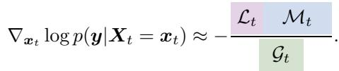

Here,

$\mathcal { M } _ { t }$ represents the error vector measuring the discrepancy between the observation y and the estimated restored vector; for example, in Score $\mathrm { A L D } \left[ 1 \right] , \mathcal { M } _ { t } = \pmb { y } - A \pmb { x } _ { t }$

$\mathcal { L } _ { t }$ denotes a matrix that projects the error vector $\mathcal { M } _ { t }$ from $\mathbb { R } ^ { m }$ back into an appropriate space in $\mathbb { R } ^ { n }$ ; for instance, in Score $\mathrm { A L D } , \mathcal { L } _ { t } = A ^ { \top }$

• t is the re-scaling scalar for the guidance vector $\mathcal { L } _ { t } \mathcal { M } _ { t }$ ; for example, in Score ALD, $\begin{array} { r } { \mathcal { G } _ { t } = \sigma _ { y } ^ { 2 } + \gamma _ { t } ^ { 2 } } \end{array}$ with a hyperparameter $\gamma _ { t }$

In Figure 1, we summarize the approximation-based methods in this section using the template above. We use to omit the guidance strength terms $\mathcal { G } _ { t }$

> 💡 **公式批读 Eq. 3.1（Explicit 家族统一模板）(Hao 批注)**: 这是 3.1 全节的骨架——所有 explicit 方法的 measurement score 都写成 $-\mathcal{L}_t\mathcal{M}_t/\mathcal{G}_t$。三个部件：$\mathcal{M}_t$=测量误差（如 $y-Ax_t$）、$\mathcal{L}_t$=把误差从 $\mathbb{R}^m$ 抬回 $\mathbb{R}^n$ 的 lifting 矩阵（$A^\top$/$A^\dagger$/带协方差的逆）、$\mathcal{G}_t$=guidance 强度标量。**读 3.1 各方法只需回答两问：误差用 clean 还是 noised $y$？lifting 矩阵多复杂？** 越复杂的 lifting 越逼近真 posterior score 的二阶几何，这就是各方法拉开差距的地方。

### 3.1.0 Sampling from a Denoiser Kadkhodaie and Simoncelli [30]

Kadkhodaie and Simoncelli [30] introduce a method for solving linear inverse problems by using the implicit prior knowledge captured by a pre-trained denoiser on multiple noise levels. The method is anchored on Tweedie’s formula that connects the least-squares solution for Gaussian denoising to the gradient of the log-density of noisy images given in Equation 2.10

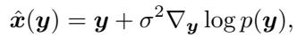

where ${ \pmb y } = { \pmb x } + { \pmb n } , { \pmb n } \sim \mathcal { N } ( { \pmb 0 } , \sigma ^ { 2 } I _ { n } )$

By interpreting the denoiser’s output as an approximation of this gradient, the authors develop a stochastic gradient ascent algorithm to generate high-probability samples from the implicit prior

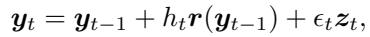

where $\pmb { r } ( \pmb { y } ) = \hat { \pmb { x } } ( \pmb { y } ) - \pmb { y }$ is the denoiser residual, $h _ { t }$ is a step size (parameter), and $\epsilon _ { t }$ controls the amount of newly introduced Gaussian noise ${ \boldsymbol { z } } _ { t }$

To solve linear inverse problems such as deblurring, super-resolution, and compressive sensing, the generative method is extended to handle constrained sampling. Given a set of linear measurements $\bar { \mathbf { x } } _ { c } = M ^ { \top }$ x of an image x, where M is a low-rank measurement matrix, the goal is to reconstruct the original image by utilizing the following gradient:

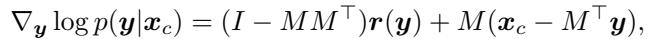

This approach is particularly interesting because its mathematical foundation relies solely on Tweedie’s formula, providing a simple yet powerful framework for tackling inverse problems using denoisers.

### 3.1.1 Score ALD [1]

One of the first proposed methods for solving linear inverse problems with diffusion models is the Score-Based Annealed Langevin Dynamics (Score ALD) [1] method. The approximation of this work is that:

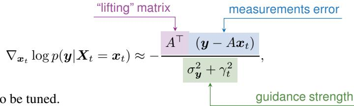

where $\gamma _ { t }$ is a parameter t

It is pretty straightforward to understand what this term is doing. The diffusion process is guided towards the opposite direction of the “lifting” (application of the ${ \bf \bar { A } } ^ { \top }$ operator) of the measurements error, i.e. $\left( { \pmb y } - { \pmb A } { \pmb x } _ { t } \right)$ ), where the denominator controls the guidance strength.

### 3.1.2 Score-SDE [2]

Score-SDE [2] is another one of the first works that discussed solving inverse problems with pretrained diffusion models. For linear inverse problems, the difference between Score-ALD and Score-SDE is that the latter noises the measurements before computing the measurements error. Specifically, for $t : \sigma _ { t } \gt \sigma _ { y }$ , the approximation becomes:

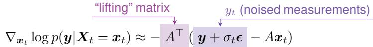

where ǫ is sampled from $\mathcal { N } ( \mathbf { 0 } , I _ { m } )$ . Here, A is an orthogonal matrix, and taking a gradient step with Equation $3 . 6$ yields a noisy projection to $\mathbf { \mathbf { } } y _ { t } ~ = ~ A \mathbf { \mathbf { } } x _ { t }$ where ${ \pmb y } _ { t } = { \pmb y } + \sigma _ { t } { \pmb \epsilon }$ . Hence, we categorize Score-SDE as “projection”.

Disregarding the guidance strength of Equation 3.5, Equation 3.5 and Equation 3.6 look very similar. Indeed, the only difference is that the latter has stochasticity that arises from the noising of the measurements.

Special case: Inpainting (Repaint [123]) Observe that for the simplest case of inpainting, Equation 3.6 would be replacing the pixel values in the current estimate $\mathbf { \Delta } _ { \mathbf { \mathcal { X } } _ { t } }$ with the known pixel values from the noised ${ \mathbf { } } _ { \mathbf { } } \mathbf { \Delta } _ { \mathbf { } } \mathbf { \Delta } _ { \mathbf { } } \mathbf { \Delta } _ { \mathbf { } } \mathbf { \Delta } _ { \mathbf { } } \mathbf { \Delta } _ { \mathbf { } } \mathbf { \Delta } _ { \mathbf { } } \mathbf { \Delta } _ { \mathbf { } \mathbf { } } \mathbf { \Delta } _ { \mathbf { } \mathbf { } } \mathbf { \Delta } _ { \mathbf { } \mathcal { } } \mathbf { \Delta } _ { \mathbf { } \mathcal { } } \mathbf { \Delta } _ { \mathbf { } \mathcal { } } \mathbf { \Delta } _ { \mathbf { } \mathcal { } } \mathbf { \Delta } _ { \mathbf { } \mathcal { } \mathcal { } } \mathbf { \Delta } _ { \mathcal { } \mathcal { } } \mathbf { \Delta } _ { \mathcal { } \mathcal { } \mathcal { } } \mathbf { \Delta } _ { \mathcal { } \mathcal { } \mathcal { } } \mathbf { \Delta } _ { \mathcal { } \mathcal { } \mathcal { } \Delta } \mathbf { \Delta } _ { \mathcal \mathcal { } }$ . Coincidentally, this is exactly the Repaint Lugmayr et al. [123] algorithm that was proposed for solving the inpainting inverse problem with pre-trained diffusion models. Re-Paint++ Rout et al. [124] improves upon this approximation to run the forward-reverse diffusion processes multiple times, so that the errors arising (e.g. boundaries) can be mitigated. This can be thought of as analogous to running MCMC corrector steps as in predictor-corrector sampling [2].

### 3.1.3 ILVR [3]

ILVR is a similar approach that was initially proposed for the task of super-resolution. The approximation made here is the following:

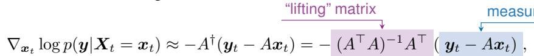

where $A ^ { \dagger }$ is the Moore-Penrose pseudo-inverse of A, and similar to Score-SDE, $\mathbf { \boldsymbol { y } } _ { t } = \mathbf { \boldsymbol { y } } + \sigma _ { t } \mathbf { \boldsymbol { \epsilon } }$

ILVR can be regarded as a pre-conditioned version of score-SDE. In ILVR, the projection to the space of images happens using the Moore-Penrose pseudo-inverse of $\mathbf { A }$ , instead of the simple $A ^ { \top }$

### 3.1.4 DPS

> 💡 **机制拆解 3.1.4 DPS（非线性逆问题基石）(Hao 批注)**: DPS 是全篇被复用最多的近似，务必吃透。核心一步（Eq. 3.8）：把 intractable 的 $p(x_0|x_t)$ 用一个**点质量** $\delta(x_0-\mathbb{E}[X_0|x_t])$ 代替——即"假装干净图就是 Tweedie 去噪均值 $\hat{x}_0$，没有不确定性"。于是 matching term 变成对 $\|y-\mathcal{A}(\hat{x}_0)\|^2$ 求 $x_t$ 的梯度（Eq. 3.11–3.13），要穿过去噪器的 Jacobian。**这个 $\delta$ 近似正是"prior score 与 posterior score 差距"里最粗糙的一档：它完全丢掉了 $p(x_0|x_t)$ 的协方差**，也是后面 ΠGDM（换高斯）、Moment Matching（换真协方差）逐级改进的起点。对本课题：DPS 忽略协方差 → 后验必然过度自信（under-dispersed），SBC/coverage 会直接暴露；这解释了为何盲+校准场景不能止步于 DPS。

All of the previous algorithms were proposed for linear inverse problems. Diffusion Posterior Sampling (DPS) is one of the most well known reconstruction algorithms for solving non-linear inverse problems. The underlying approximation behind DPS is that:

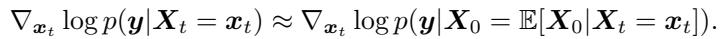

It is easy to see that:

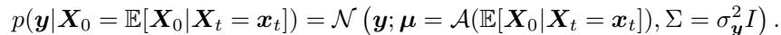

Hence, the DPS approximation can be stated as:

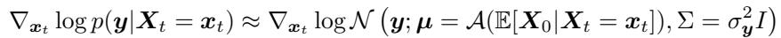

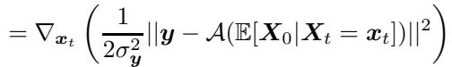

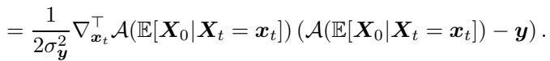

For linear inverse problems, this simplifies to:

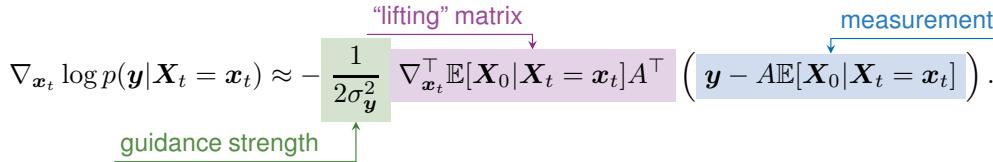

We can further use Tweedie’s formula to further write it as:

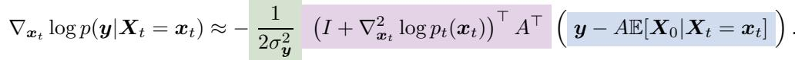

In practice, DPS does not use the theoretical guidance strength but instead proposes to use a reweighting with a step size inversely proportional to the norm of the measurement error.

MCG Chung et al. [31] provides a geometric interpretation of DPS by showing that the approximation used in DPS can guarantee the noisy samples stay on the manifold. DSG Yang et al. [147] showed that one can choose a theoretically “correct” step size under the geometric view of MCG, and combined with projected gradient descent, one can achieve superior sample quality. MPGD He et al. [33] showed that by constraining the gradient update step to stay on the low dimensional subspace by autoencoding, one can acquire better results.

### 3.1.5 ΠGDM Song et al. [5]

> 💡 **机制拆解 3.1.5 ΠGDM (Hao 批注)**: ΠGDM 把 DPS 的 $\delta$ 升级为**各向同性高斯** $p(x_0|x_t)\approx\mathcal{N}(\mathbb{E}[X_0|x_t], r_t^2 I)$（Eq. 3.16）。好处：线性情形 matching term 出现 $(r_t^2 AA^\top+\sigma_y^2 I)^{-1}$（Eq. 3.18），即 lifting 矩阵带上了"数据不确定性 + 观测噪声"的联合协方差。**这是往真 posterior score 靠近的第一步**，但 $r_t^2 I$ 仍是各向同性的粗糙假设。

Recall the intractable integral in Equation 1.3. According to this relation, the DPS approximation is achieved by setting

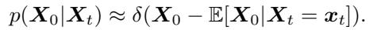

In ΠGDM, the authors propose to use a Gaussian distribution for approximation

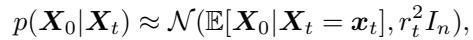

where $r _ { t }$ is a hyperparameter. For linear inverse problems, this leads to

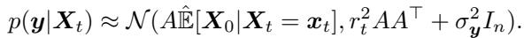

Subsequently, we have

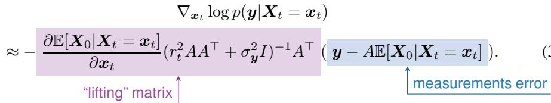

### 3.1.6 Moment Matching [6]

In ΠGDM, the distribution $p ( \pmb { x } _ { 0 } | \pmb { x } _ { t } )$ was assumed to be isotropic Gaussian. However, one can calculate explicitly the variance matrix, $V [ \pmb { x } _ { 0 } | \pmb { x } _ { t } ]$ . As shown in Lemma A.4, it holds that:

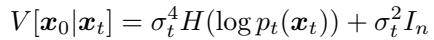

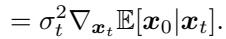

The Moment Matching [6] method approximates the distribution $p ( \pmb { x } _ { 0 } | \pmb { x } _ { t } )$ with an anisotropic Gaussian:

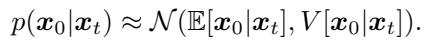

For linear inverse problems, this leads to the following approximation for the measurements’ score:

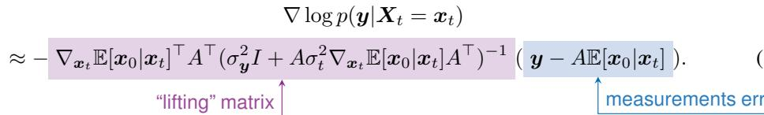

In high-dimensions, even materializing the matrix $\nabla _ { \pmb { x } _ { t } } \mathbb { E } [ \pmb { x } _ { 0 } | \pmb { x } _ { t } ]$ is computationally intensive. Instead, the authors of [6] use automatic differentiation to compute the Jacobian-vector products.

> 💡 **机制拆解 3.1.6 Moment Matching（协方差最忠实档）(Hao 批注)**: Moment Matching 用**各向异性高斯**——协方差直接取 Tweedie 二阶公式 $V[x_0|x_t]=\sigma_t^4 H(\log p_t)+\sigma_t^2 I=\sigma_t^2\nabla_{x_t}\mathbb{E}[x_0|x_t]$（Eq. 3.19–3.20，证明见 Lemma A.4）。这是 Explicit 家族里**对 $p(x_0|x_t)$ 协方差刻画最忠实**的方法，代价是要算 Jacobian（用 auto-diff 的 JVP 规避显式矩阵）。**对本课题极关键：这个真协方差正是"gauge-aware 校准"要盯的对象——只有把它算对，后验的 spread 才可能 well-calibrated。DPS→ΠGDM→Moment Matching 就是一条"协方差保真度递增"的谱，也是 prior/posterior score 差距逐步缩小的谱。**

### 3.1.7 BlindDPS Chung et al. [7]

> 💡 **机制拆解 3.1.7 BlindDPS（本课题核心前作 ①）(Hao 批注)**: BlindDPS 是 DPS 的盲扩展，直接对标本课题的联合后验。数据流：
> - **两条并行反向 SDE**（Eq. 3.23/3.24）：一条采图像 $x_t$，一条采算子参数 $\phi_t$（如模糊核）。二者各有自己的扩散先验 $p_t(x_t)$、$p_t(\phi_t)$。
> - **通过 likelihood 耦合**：假设 $X_t\perp\Phi_t$，Bayes 分解（Eq. 3.25/3.26）让两条 score 各自 = 自身 prior score + 共享的 $\nabla\log p_t(y|X_t,\Phi_t)$。
> - **DPS 近似套两次**（Eq. 3.27）：对 $x$ 和 $\phi$ 都用各自的 Tweedie 均值代入 likelihood，得 Eq. 3.28（对 $x$）、Eq. 3.29（对 $\phi$）。
>
> **与本课题对照**：这正是"联合估计 $(x,\phi)$"的雏形，$\phi$ 也走一条完整扩散链（需要给 $\phi$ 训练一个先验，成本高）。局限：(1) 沿用 DPS 的 $\delta$/点近似 → 忽略 $(x,\phi)$ 的联合协方差，后验校准无保证；(2) 假设 $X_t\perp\Phi_t$ 割裂了 $x$-$\phi$ 的耦合。**本课题的 gauge-aware 联合后验 + SBC/coverage/CRPS 恰好是补这两个洞：既建模 $x$-$\phi$ 耦合，又用校准诊断验证 spread。**

Methods that were considered so far were designed for non-blind inverse problems, where $A$ is fully known. BlindDPS targets the case where we have a parametrized unknown forward model $A _ { \phi } \left( \mathrm { e . g } \right.$ blurring with an unknown kernel $\phi )$ . In BlindDPS, on top of the posterior mean approximation of $\mathbf { \Delta } _ { \mathbf { \mathcal { X } } _ { t } }$ one approximates the parameter of the forward model, again, with the posterior mean. Specifically, we design two parallel generative SDEs

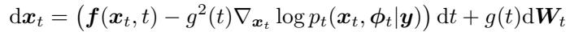

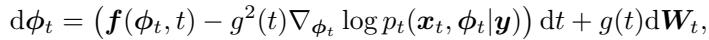

where the two SDEs are coupled through log $p _ { t } ( \pmb { x } _ { t } , \phi _ { t } | \pmb { y } )$ , where under the independence between $X _ { t }$ and $\Phi _ { t }$ , the Bayes rule reads

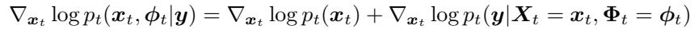

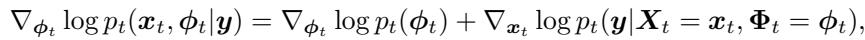

where we see that $X _ { t }$ and $\Phi _ { t }$ are coupled through the likelihood $p ( \pmb { y } | \pmb { X } _ { t } , \pmb { \Phi } _ { t } )$ . In BlindDPS, the approximation used in DPS is applied to both the image and the operator, leading to

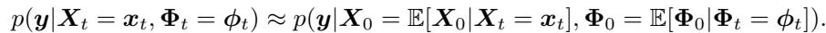

The gradient of the coupled likelihood with respect to $\mathbf { \Delta } _ { \mathbf { \mathcal { X } } _ { t } }$ leads to

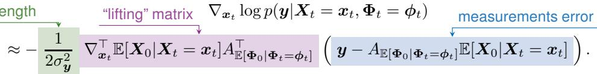

Similarly, for $\phi _ { t }$ , we have

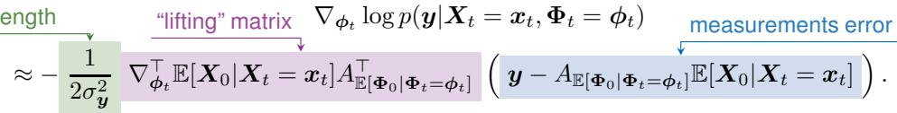

### 3.1.8 DDRM Family

> 💡 **机制拆解 3.1.8 DDRM 族（SVD 谱域视角）(Hao 批注)**: DDRM 族的统一 trick：对 $A=U\Sigma V^\top$ 做 SVD，把任意线性逆问题变成**谱域里的 noisy inpainting**（Eq. 3.30）。SNIPS 在谱域采样后 $\hat{x}=V\bar{x}$；DDRM 用 Tweedie 均值 $\bar{x}_{0|t}$ 替换（Eq. 3.33），并按奇异值 $s_i$ 与噪声比 $\sigma_y/s_i$ 分档处理每个谱分量（Eq. 3.34/3.35，$\eta$ 控随机性）。**这套按奇异值分档的做法天然带"每个分量的不确定性"，比 DPS 的标量 guidance 更精细。**

The methods under the DDRM family poses all linear inverse problems to a noisy inpainting problem, by decomposing the measurement matrix with singular value decomposition (SVD), i.e. $\dot { \boldsymbol { A } } = \boldsymbol { U } \dot { \boldsymbol { \Sigma } } \dot { \boldsymbol { V } } ^ { \intercal }$ , where $U ^ { ^ { - } } \in \mathbb { R } ^ { m \times m } , V \in \mathbb { R } ^ { n \times n }$ are orthogonal matrices, and $\Sigma \in \mathbb { R } ^ { m \times n }$ is a rectangular diagonal matrix with singular values $\{ s _ { j } \} _ { j = 1 } ^ { m }$ as the elements. One can then rewrite $\pmb { y } = A \pmb { x } + \sigma _ { \pmb { y } } z , z \sim \mathcal { N } ( \mathbf { 0 } , I _ { m } )$ as

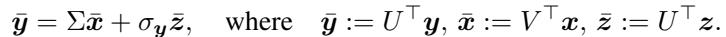

Subsequently, Equation 3.30 becomes an inpainting problem in the spectral space.

SNIPS [8]. SNIPS proceeds by first solving the inverse problem posed as Equation 3.30 in the spectral space to achieve a sample $\bar { \pmb x } \sim p ( \bar { \pmb x } | \bar { \pmb y } )$ , then retrieving the posterior sample with ${ \hat { \mathbf { x } } } = V { \bar { \mathbf { x } } }$ The key approximation can be concisely represented as

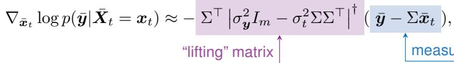

For the simplest case of denoising where $m = n$ and $\Sigma = A = I$ , the method becomes [148]

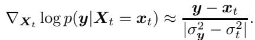

which produces a vector direction that is weighted by the absolute difference between the diffusion noise level $\sigma _ { t } ^ { 2 }$ , and the measurement noise level $\sigma _ { y } ^ { 2 }$ . For the fully general case in Equation 3.31, elements in different indices are weighted according to the singular values contained in $\Sigma .$ In practice, SNIPS uses pre-conditioning with the approximate negative inverse Hessian of log $p ( \bar { \pmb x } _ { t } | \bar { \pmb y } )$ when running annealed Langevin dynamics.

DDRM [9]. DDRM extends SNIPS by leveraging the posterior mean $\bar { \pmb { x } } _ { 0 \mid t } : = V \mathbb { E } [ \pmb { X } _ { 0 } | \pmb { X } _ { t } = \pmb { x } _ { t } ]$ in the place of $\bar { \mathbf { x } } _ { t }$ used in SNIPS. i.e.,

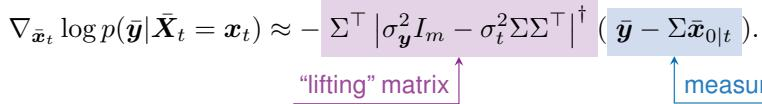

Expressing Equation 3.33 element-wise, we get

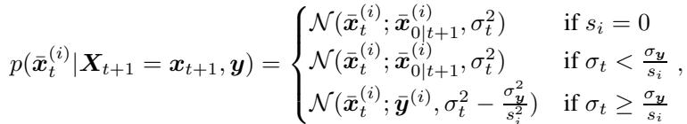

where $\mathbf { \boldsymbol { x } } ^ { ( i ) }$ denotes the i-th element of the vector, and $s _ { i }$ its corresponding singular value. Here, DDRM introduces another hyper-parameter η to control the stochasticity of the sampling process

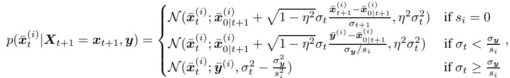

with $\eta \in ( 0 , 1 ]$ such that $\eta = 1 . 0$ recovers Equation 3.34.

GibbsDDRM. GibbsDDRM Murata et al. [10] extends DDRM to the following blind linear problem $\begin{array} { r } { \pmb { y } = A _ { \varphi } \pmb { x } + \sigma _ { \pmb { y } } z } \end{array}$ , where $A _ { \varphi }$ is a linear operator parameterized by $\varphi .$ . Here, $A _ { \varphi } = U _ { \varphi } \Sigma _ { \varphi } ^ { \circ } V _ { \varphi } ^ { \intercal }$ has a ϕ dependence SVD decomposition with singular values $\{ s _ { j , \varphi } \} _ { j = 1 } ^ { m }$ as the elements of the diagonal matrix $\Sigma _ { \varphi }$ . In the spectral space, $\bar { \pmb { y } } _ { \pmb { \varphi } } : = U _ { \pmb { \varphi } } ^ { \top } \pmb { y } _ { \pmb { \varphi } } , \bar { \pmb { x } } _ { \pmb { \varphi } } : = V _ { \pmb { \varphi } } ^ { \top } \pmb { x } _ { \pmb { \varphi } } , \bar { z } _ { \pmb { \varphi } } : = U _ { \pmb { \varphi } } ^ { \top } z _ { \pmb { \varphi } }$ . Subsequently, the posterior mean in DDRM is replaced with $\bar { \pmb { x } } _ { 0 | t , \varphi } : = V _ { \pmb { \varphi } } \mathbb { E } [ \pmb { X } _ { 0 } | \pmb { X } _ { t } = \pmb { x } _ { t } ]$ , also depending on $\varphi .$ Thus, it leads to the sampling process

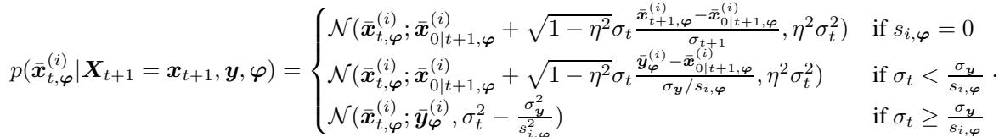

At time step $t , \varphi$ is sampled by using the conditional distribution $p ( \varphi | \mathbf { x } _ { t : T } , \mathbf { y } )$ and updated for several iterations in a Langevin manner:

> 💡 **机制拆解 GibbsDDRM（本课题核心前作 ②）(Hao 批注)**: GibbsDDRM 把 DDRM 扩到盲线性问题 $y=A_\varphi x+\sigma_y z$，$\varphi$ 是算子参数。做法是 **partially collapsed Gibbs 采样**：交替 (1) 给定 $\varphi$ 用 $\varphi$-依赖的 SVD $A_\varphi=U_\varphi\Sigma_\varphi V_\varphi^\top$ 更新 $x$（Eq. 3.36），(2) 给定 $x$ 用 Langevin 更新 $\varphi$（下式 + Eq. 3.37 的梯度 $-\frac{1}{2\sigma_y^2}\nabla_\varphi\|y-A_\varphi\bar{x}_{0|t,\varphi}\|^2$）。
>
> **与本课题对照**：这是"联合后验采样"最接近本课题的前作——用 Gibbs 而非点优化来交替采 $(x,\varphi)$，理论上比 BlindDPS/Blind RED-Diff 的点估计更接近真联合后验。可追问：GibbsDDRM 的 $\varphi$-Langevin 是否 well-mixed？其联合后验是否校准？综述未评（无实验），正是本课题用 SBC/coverage 可检验的缺口。

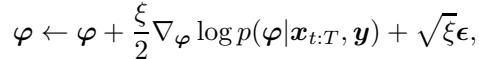

where $\xi$ is a stepsize and $\epsilon \sim \mathcal { N } ( \mathbf { 0 } , I _ { n } )$ . Here, $\nabla _ { \varphi } \log { p ( \varphi | x _ { t : T } , y ) } \approx \nabla _ { \varphi } \log { p ( \varphi | \bar { x } _ { 0 | t , \varphi } , y ) }$ , and the gradient can be computed as:

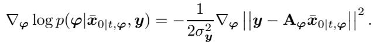

### 3.1.9 DDNM Wang et al. [11] family

> 💡 **机制拆解 3.1.9 DDNM 族（range-null 分解）(Hao 批注)**: DDNM 换个视角——用**条件 Tweedie**（Eq. 3.38–3.40）把 conditional posterior mean $\mathbb{E}[X_0|x_t,y]$ 与无条件 $\mathbb{E}[X_0|x_t]$ 关联，然后对无条件均值做 range-null space 投影 $(I-A^\dagger A)\mathbb{E}[X_0|x_t]+A^\dagger y$（Eq. 3.41）：**零空间保留先验、值空间强制满足测量**。有噪时改软更新（Eq. 3.44，用 $\Sigma_t$）。DDS/DiffPIR 则把这步写成 proximal 优化（Eq. 3.46），差别在解法（DDS 用 CG、DiffPIR 用闭式 + SNR 调度 $\lambda_t$）。**这类 projection/proximal 属于 Table 1 的 Proj/Opt 型，数据一致性强但不显式建模不确定性。**

A different way to find meaningful approximations for the conditional score is to look at the conditional version of Tweedie’s formula, see Equation 2.15. Using Bayes rule and rearranging Ravula et al. [149], we have

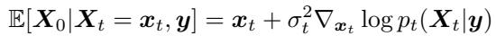

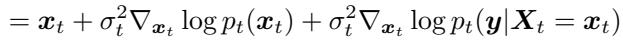

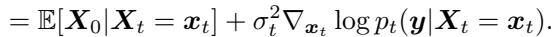

The methods that belong to the DDNM family make approximations to $\mathbb { E } [ X _ { 0 } | X _ { t } ~ = ~ { \pmb { x } } _ { t } , { \pmb { y } } ]$ by making certain data consistency updates to $\mathbb { E } [ X _ { 0 } | X _ { t } = \bar { \mathbf { x } _ { t } } ]$

DDNM Wang et al. [11]. The simplest form of update when considering no noise can be obtained through range-null space decomposition, assuming that one can compute the pseudo-inverse. In DDNM, this condition is trivially met by considering operations that are SVD-decomposable. DDNM proposes to use the following projection step to the posterior mean to obtain an approximation of the conditional posterior mean

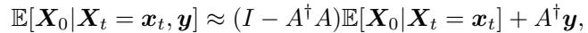

where $A ^ { \dagger }$ is the Moore-Penrose pseudo-inverse of A. One can also express Equation 3.41 as an approximation of the likelihood, consistent to other methods in the chapter. Specifically, notice that by using the relation in Equation 3.40,

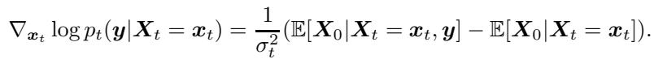

Plugging in Equation 3.41 to Equation 3.42,

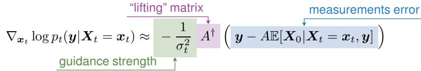

When there is noise in the measurement, one can make soft updates

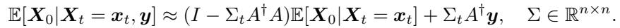

Also, similar to Equation 3.43,

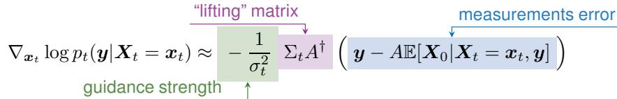

Here, one can choose a simple $\Sigma _ { t } = \lambda _ { t } I$ with $\lambda _ { t }$ set as a hyper-parameter, or use different scaling for each spectral component. Observe that due to the relationship between the (conditional) score function and the posterior mean established in Equation 3.40, we can also easily rewrite the approximation in terms of the score of the posterior.

DDS Chung et al. [12], DiffPIR Zhu et al. [13]. Both DDS and DiffPIR propose a proximal update to approximate the conditional posterior mean, albeit from different motivations. The resulting approximation reads

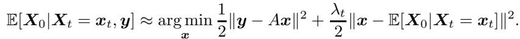

The difference between the two algorithms comes from how one solves the optimization problem in Equation 3.46, and how one chooses the hyperparameter $\lambda _ { t }$ . In DDS, the optimization is solved with a few-step conjugate gradient (CG) update steps, by showing that DPS gradient update steps can be effectively replaced with the CG steps under assumptions on the data manifold Chung et al. [12]. λt is taken to be a constant value across all t. DiffPIR uses a closed-form solution for Equation 3.46, and proposes a schedule for $\lambda _ { t }$ that is proportional to the signal-to-noise (SNR) ratio of the diffusion at time t. Specifically, one chooses $\lambda _ { t } = \sigma _ { t } \zeta$ , where ζ is a constant.

## 3.2 Variational Inference

These methods approximate the true posterior distribution, $p ( { \pmb x } | { \pmb y } )$ , with a simpler, tractable distribution. Variational formulations are then used to optimize the parameters of this simpler distribution.

### 3.2.1 RED-Diff Mardani et al. [16]

Mardani et al. [16] introduce RED-diff, a new approach for solving inverse problems by leveraging stochastic optimization and diffusion models. The core idea is to use variational method by introducing a simpler distribution, $q : = \mathcal { N } ( \pmb { \mu } , \sigma ^ { 2 } I _ { n } )$ , to approximate the true posterior $p ( \pmb { x } _ { 0 } | \pmb { y } )$ by minimizing the KL divergence $\mathcal { D } _ { \mathrm { K I } }$ between them:

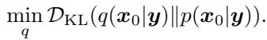

Here, ${ \mathcal { D } } _ { \mathrm { K L } } ( q ( { \pmb x } _ { 0 } | { \pmb y } ) | | p ( { \pmb x } _ { 0 } | { \pmb y } ) )$ can be written as follows:

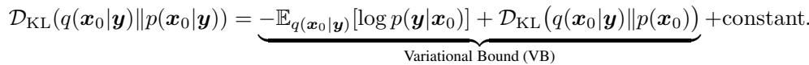

via classic variational inference argument. The first term in VB can be simplified into reconstruction loss, and the second term can be decomposed as score-matching objective which involves matching the score function of the variational distribution with the score function of the true posterior denoisers at different timesteps:

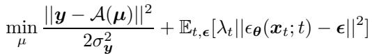

where $\pmb { \mu }$ is the mean of the variational distribution, and $\sigma _ { v } ^ { 2 }$ is the noise variance in the observation, $\epsilon _ { \theta } ( x _ { t } ; t )$ is the score function of the diffusion model at timestep (t) and $\lambda _ { t }$ is a time-weighting factor.

Sampling as optimization. The goal is then to find an image $\pmb { \mu }$ that reconstructs the observation y given by $f ,$ while having a high likelihood under the denoising diffusion prior (regularizer). This score-matching objective is optimized using stochastic gradient descent, effectively turning the sampling problem into an optimization problem. The weighting factor $( \lambda _ { t } )$ is chosen based on the signal-to-noise ratio (SNR) at each timestep to balance the contribution of different denoisers in the diffusion process.

### 3.2.2 Blind RED-Diff Alkan et al. [17]

> 💡 **机制拆解 3.2.2 Blind RED-Diff（本课题核心前作 ③）(Hao 批注)**: Blind RED-Diff 把 RED-Diff 的变分框架扩到盲问题，**联合估计图像 $x_0$ 与 forward 参数 $\gamma$**。KL 分解成三项（Eq. 3.2.2-kldecomp）：$x_0$ 的先验 KL（score-matching 项）、$\gamma$ 的先验 KL（对 $\gamma$ 的正则）、以及数据一致性 $-\mathbb{E}[\log p(y|x_0,\gamma)]$。用**交替随机优化**轮流更新 $x_0,\gamma$。
>
> **与本课题对照**：这是三个盲前作里最"变分"的一个，直接对应本课题的联合估计。两条硬伤正是本课题切入点：(1) **假设 $x_0\perp\gamma\,|\,y$**（条件独立），割裂了 gauge 耦合；(2) 变分 $q$ 形式固定 + 交替优化 → 是点估计式的近似后验，**无校准保证且可能陷局部最优**。本课题用联合后验采样（而非交替优化）+ 显式校准检验来正面回应这两点。

In Alkan et al. [17] authors introduce blind RED-diff, an extension of the RED-diff framework Mardani et al. [16] to solve blind inverse problems. The main idea is to use variational inference to jointly estimate the latent image and the unknown forward model parameters.

Similar to RED-Diff, the key mathematical formulation is the minimization of the KL-divergence between the true posterior distribution $p ( \pmb { x } _ { 0 } , \gamma | \pmb { y } )$ and a variational approximation $q ( { \pmb x } _ { 0 } , \gamma | { \pmb y } ) \colon$

If we assume the latent image and the forward model parameters are independent, the KL-divergence can be decomposed as:

The minimization with respect to $q$ involves three terms:

i. ${ \mathcal { D } } _ { \mathrm { K L } } ( q ( { \pmb x } _ { 0 } | { \pmb y } ) | | p ( { \pmb x } _ { 0 } ) )$ ) represents the KL divergence between the variational distribution of the image $\mathbf { \Gamma } ( \pmb { x } _ { 0 } )$ and its prior distribution. This term is approximated using a score-matching loss, which leverages denoising score matching with a diffusion model (as in RED-Diff).

ii. $\mathcal { D } _ { \mathrm { K L } } ( q ( \gamma | \pmb { y } ) | | p ( \gamma ) )$ is the KL divergence between the variational distribution of the forward model parameters $( \gamma )$ and their prior distribution. This term acts as a regularizer on γ.

iii. $- \mathbb { E } _ { q ( \pmb { x } _ { 0 } , \gamma | \pmb { y } ) } [ \log p ( \pmb { y } | \pmb { x } _ { 0 } , \gamma ) ]$ is the expectation of the negative log-likelihood of the observed data y given the image $\scriptstyle { \mathbf { { \mathit { x } } } } _ { 0 }$ and the forward model parameters $\gamma$ . This term ensures data consistency.

The resulting optimization can be achieved using alternating stochastic optimization, where the image x0 and the forward model parameters γ are updated iteratively.

The formulation assumes conditional independence between $\scriptstyle { \mathbf { { \mathit { x } } } } _ { 0 }$ and $\gamma$ given the measurement $^ { \mathbf { \Lambda } } \mathbf { \Lambda } ^ { \mathbf { \Lambda } } \mathbf { \Lambda } ^ { \mathbf { \Lambda } } \mathbf { \Lambda } ^ { \mathbf { \Lambda } } \mathbf { \Lambda } ^ { \mathbf { \Lambda } } \mathbf { \Lambda } ^ { \mathbf { \Lambda } } \mathbf { \Lambda } ^ { \mathbf { \Lambda } } \mathbf { \Lambda } ^ { \mathbf { \Lambda } } \mathbf { \Lambda } ^ { \mathbf { \Lambda } } \mathbf { \Lambda } ^ { \mathbf { \Lambda } } \mathbf { \Lambda } ^ { \mathbf { \Lambda } } \mathbf { \Lambda } ^ { \mathbf { \Lambda } } \mathbf { \Lambda } ^ { \mathbf { \Lambda } } \mathbf { \Lambda } ^ { \mathbf { \Lambda } } \mathbf { \Lambda } ^ { \mathbf { \Lambda } } \mathbf { \Lambda } ^ { \mathbf { \Lambda } } \mathbf { \Lambda } \mathbf { \Lambda } ^ { \mathrm { \Lambda } } \mathbf { \Lambda } \mathbf { \Lambda } ^ { \mathrm { \Lambda } } \mathbf { \Lambda } \mathbf { \Lambda } \mathbf { \Lambda } \mathrm { \Lambda } ^ { \mathrm { \Lambda } }$ and it also requires a specific form for the prior distribution $p ( \gamma )$

### 3.2.3 Score Prior Feng et al. [18]

> 💡 **机制拆解 3.2.3–3.2.4 Score Prior (Hao 批注)**: Score Prior 用 normalizing flow 当 $q_\phi$，难点是算先验项 $\log p_\theta(x_0)$。3.2.3 用 PF-ODE 的 instantaneous change-of-variables 精确算（Eq. 3.53，无近似误差但要几百上千 NFE，且每个 $y$ 都要重训 flow）；3.2.4 Efficient 版改用 ELBO 代理（Eq. 3.54/3.55，单 NFE 的去噪 loss），牺牲精确性换可扩展性。**这条线提示：精确后验代价极高，实用系统必须在"精确 likelihood"与"NFE 预算"间权衡——本课题若要 exactness+校准，也得直面同一算力墙。**

We again start by introducing a variational distribution $q _ { \phi } ( { \pmb x } _ { 0 } )$ that aims to approximate the posterior distribution determined by the diffusion prior. The optimization problem becomes

One of the most expressive yet tractable proposal distributions is normalizing flows (NF) Rezende and Mohamed [150], Dinh et al. [151]. Choosing $q _ { \phi }$ to be an NF, we can transform the optimization problem to

where the expectation is over the input latent variable $z ,$ and $\pi$ is the reference Gaussian distribution. Observe that the likelihood term and the entropy can be efficiently computed with a single forward/backward pass through the NF due to the parametrization of $q _ { \phi }$ with an NF. All that is left for us is to compute the prior term log $p _ { \pmb { \theta } } ( G _ { \phi } ( \pmb { z } ) )$ . In score prior Feng et al. [18], this is solved by leveraging the instantaneous change-of-variables formula with the diffusion PF-ODE, as originally proposed in Song et al. [2]

where $f _ { \theta } ( x _ { t } , t )$ is the drift term of the reverse SDE in Equation 2.2 with the score replaced by the network approximation. Notice that by plugging in Equation 3.53 to Equation 3.52, we can optimize the NF model in an unsupervised fashion. Notice that while this formulation does not incur approximation errors, it is very costly as every optimization steps involve computing Equation 3.53. Moreover, observe that the training of NF is done for a specific measurement $\mathbf { \pmb { y } } .$ . One has to run Equation 3.52 for every different measurement that one wishes to recover.

### 3.2.4 Efficient Score Prior Feng and Bouman [19]

As computing Equation 3.53 is costly, Feng et al. proposed to optimize $q _ { \phi }$ with the evidence lower bound (ELBO), originally presented in the work of Score-flow Song et al. [152] $b _ { \pmb \theta } ( \pmb x _ { 0 } ) \leq$ log $p _ { \pmb { \theta } } ( \pmb { x } _ { 0 } )$

where

Intuitively, the value of $b _ { \theta }$ is small when we have a small denoising loss, and large when our diffusion denoiser $h _ { \theta }$ cannot properly denoise the given image. Replacing the exact likelihood Equation 3.53 that requires hundreds to thousands of NFEs to the surrogate denoising likelihood Equation 3.54 that requires only a single NFE makes the method much more efficient and scalable to higher dimensions.

## 3.3 Asymptotically Exact Methods

These methods aim to sample from the true posterior distribution. Of course, the intractability of the posterior distribution cannot be circumvented but what these methods trade compute for ap proximation error: as the number of network evaluations increases to infinity, these methods will asymptotically converge to the true posterior (assuming no other approximation errors).

> 💡 **家族总览 3.3 Asymptotically Exact（本课题校准落点）(Hao 批注)**: 这一族用 MCMC/SMC，**NFE→∞ 时收敛到真后验**（无其他近似误差时）。这是唯一有 exactness 保证的家族，因此**也是唯一能让 SBC/coverage 检验"有意义"的落点**——因为只有当采样器目标就是真后验时，校准诊断才在测算法而非测近似偏差。命门是算力：理论保证只在无限计算下成立。本课题若追"可校准的盲后验"，最诚实的骨架应在此族，再把 $\phi$ 也纳入 MCMC/SMC 状态。

### 3.3.1 Plug and Play Diffusion Models (PnP-DM) [24]

> 💡 **机制拆解 3.3.1 PnP-DM (Hao 批注)**: PnP-DM 引入辅助变量 $z$ 和 split 分布 $\pi(x_0,z|y)\propto p(x_0)p(y|z)\exp(-\frac{1}{2\rho^2}\|x_0-z\|^2)$（Eq. 3.56，$\rho\to0$ 时收敛到真后验），再用 **Gibbs 交替采样**：likelihood 步（Eq. 3.57，$z$ 满足测量，线性时 log-concave 好采）+ prior 步（Eq. 3.58，恰好是一个去噪问题，扩散模型的主场，初始化在 $z^{(k)}$、时刻 $\sigma_t=\rho$）。**这个"likelihood/prior 解耦 + Gibbs"结构对本课题很友好：把 $\phi$ 加进 likelihood 步的采样即可扩成盲版，且天然是采样（非点估计），利于校准。**

As explained in the introduction, the end goal is to sample from the distribution $p ( \pmb { x } _ { 0 } | \pmb { y } )$ ∝ $p ( { \pmb x } _ { 0 } ) p ( { \pmb y } | { \pmb x } )$ . The authors of [24] introduce an auxiliary variable z and an auxiliary distribution:

It is easy to see that as $\rho  0 .$ , the auxiliary distribution converges to the target distribution $p ( \pmb { x } _ { 0 } | \pmb { y } )$ To sample from the joint distribution $\pi ( \boldsymbol { x } _ { 0 } , z | \boldsymbol { y } )$ , the authors use Gibbs Sampling, i.e. the alternate between sampling from the posteriors. Specifically, the sampling algorithm alternates between two steps:

• Likelihood term:

• Prior term:

The likelihood term samples a vector that satisfies the measurements and is close to $\pmb { x } _ { 0 } ^ { ( k ) }$ . The prior term samples a vector that is likely under $p ( \pmb { x } _ { 0 } )$ and is close to $z ^ { ( k ) }$ . For most problems of interest, sampling from Equation 3.57 is easy because the distribution is log-concave, e.g. that’s the case for linear inverse problems. The interesting observation is that sampling from Equation 3.58 corresponds to a denoising problem, for which diffusion models excel. Indeed, for any $\mathbf { \Delta } _ { \mathbf { \mathcal { X } } _ { t } }$ at noise level $\sigma _ { t } ,$ we have that:

Hence, to sample from Equation 3.58, one initializes the reverse process at $z ^ { ( k ) }$ and time t such that: $\sigma _ { t } = \rho .$

### 3.3.2 FPS Dou and Song [25]

FPS connects posterior sampling to Bayesian filtering and uses sequential Monte Carlo methods to solve the filtering problem, avoiding the need to handcraft approximations to the posterior $p ( \pmb { y } | \pmb { x } _ { t } )$ Given an observation y, FPS proposes to first construct a sequence $\{ y _ { t } \} _ { t = 0 } ^ { N }$ from y, and then determine a tractable distribution $p ( \pmb { x } _ { t - 1 } | \pmb { x } _ { t } , \pmb { y } _ { t - 1 } )$ . Starting from $\mathbf { x } _ { N } \sim \mathcal { N } ( \mathbf { 0 } , I _ { n } )$ , FPS can then recursively sample $\mathbf { \Delta } _ { \mathbf { \mathcal { X } } _ { t } }$ for $t = N - 1 , \ldots , 1$ , and finally obtain $\scriptstyle { \mathbf { { \mathit { x } } } } _ { 0 }$ . Specifically, FPS consists of two steps:

Step 1. Generating a sequence of $\{ \boldsymbol { y } _ { t } \} _ { t = 0 } ^ { N }$ with an observation $\mathbf { \nabla } _ { \mathbf { \nabla } _ { y } } .$ This can be done either using the forward process or unconditional DDIM backward sampling.

For the construction via the forward process, we recursively construct ${ \mathbf { } } _ { \mathbf { } } \mathbf { \psi } _ { \mathbf { } } \mathbf { _ { } } \mathbf { \psi } _ { \mathbf { } } \mathbf { _ { } } \mathbf { \psi } _ { \mathbf { } } \mathbf { _ { } } \mathbf { \psi } _ { \mathbf { } } \mathbf { _ { } } \mathbf { \psi } _ { \mathbf { } } \mathbf { _ { } } \mathbf { \psi } _ { \mathbf { } } \mathbf { _ { } } \mathbf { \psi } _ { \mathbf { } \psi } \mathbf { _ { } } \textbf { } \psi _ { } \psi _ { } \left. \textbf { } \psi _ { } \mathbf { } \psi _ { } \textbf { } \right.$ as follows:

This arises from ${ \pmb x } _ { t } = { \pmb x } _ { t - 1 } + \sigma _ { t } { \pmb z } _ { t }$ and applying the linear operator A to it.

For the construction via backward sampling, FPS uses methods such as unconditional DDIM as in Equation 2.9,

Here, $u _ { t } , \ v _ { t } .$ , and $w _ { t }$ are DDIM coefficients that can be explicitly computed. Note that $\mathbf { \nabla } _ { \mathbf { \boldsymbol { y } } \mathrm { { } } N }$ is sampled from $\mathcal { N } ( \mathbf { 0 } , A A ^ { \top } )$ because the prior distribution of the diffusion model is a standard Gaussian $\pmb { x } _ { N } \sim \mathcal { N } ( \mathbf { 0 } , I )$ , and due to the linearity of the inverse problem, ${ \bf { } } _ { { \bf { } } ^ { g } N } =$ $A { \pmb x } _ { N }$

Step 2. Generating a backward sequence of $\{ \pmb { x } _ { t } \} _ { t = 0 } ^ { N }$ from Step 1’s $\{ y _ { t } \} _ { t = 0 } ^ { N } .$ First, note that $p ( \pmb { x } _ { t - 1 } | \pmb { x } _ { t } , \pmb { y } _ { t - 1 } )$ is a tractable normal distribution. This results from applying Bayes’ rule and the conditional independence of $\mathbf { \Delta } _ { \mathbf { \mathcal { X } } _ { t } }$ and the random vector $Y _ { t - 1 } \mathrm { g i v e n } x _ { t - 1 } .$

Here, $p ( \pmb { x } _ { t - 1 } | \pmb { x } _ { t } )$ is approximated via backward diffusion sampling with learned scores, and $p ( \dot { \mathbfcal { Y } } _ { t - 1 } | \dot { \mathbf { x } } _ { t - 1 } ) = \bar { \mathcal { N } } ( A \mathbfit { x } _ { t - 1 } , c _ { t - 1 } ^ { 2 } I )$ , where $c _ { t - 1 }$ , dependent on $\sigma _ { y } \gt 0$ , can be computed explicitly [47]. Thus, with $\{ y _ { t } \} _ { t = 0 } ^ { N }$ and initial condition x $\mathbf { \Omega } _ { N } \ \sim \ { \mathcal { N } } ( \mathbf { 0 } , I _ { n } )$ , FPS recursively samples $\pmb { x } _ { N - 1 } , \cdots \pmb { x } _ { 1 }$ using $p ( \pmb { x } _ { t - 1 } | \pmb { x } _ { t } , \pmb { Y } _ { t - 1 } = \pmb { y } _ { t - 1 } )$ , ultimately yielding $\scriptstyle { \mathbf { { \mathit { x } } } } _ { 0 }$

FPS algorithm is theoretically supported to recover the oracle $p ( { \pmb x } | { \pmb y } )$ once the step size is sufficiently small.

### 3.3.3 PMC Sun et al. [26]

Plug-and-Play (PnP) Kamilov et al. [110] and RED Romano et al. [107] are two representative methods of using denoisers as priors for solving inverse problems. Let $\begin{array} { r } { g _ { \pmb { y } } ( \pmb { \bar { x } } ) = \frac { 1 } { 2 \sigma _ { \ b { u } } ^ { 2 } } \lVert \pmb { \bar { y } } - A \pmb { x } \rVert _ { 2 } ^ { 2 } } \end{array}$ be the log-likelihood function, $h _ { \theta } ^ { \sigma } ( \cdot )$ an MMSE denoiser from Equation 2.11 conditioned on the noise level $\sigma ,$ , and $R _ { \pmb \theta } ^ { \sigma } ( \cdot ) : = \mathrm { I d } - h _ { \pmb \theta } ^ { \sigma } ( \cdot )$ the residual projector. Note that conditioning on the noise level $\sigma$ is equivalent to the network being conditioned no t, since the mapping is one-to-one. A single iteration of these methods read

• PnP proximal gradient method Kamilov et al. [153]:

• RED gradient descent Romano et al. [107]:

Notice that by using Tweedie’s formula, we see that $R _ { \theta } ^ { \sigma } ( { \pmb x } ) = - \sigma ^ { 2 } \nabla _ { \pmb x } \log p _ { \sigma } ( { \pmb x } )$ . Rearranging Equation 3.64 and Equation 3.66,

• RED:

Moreover, by setting $\gamma = \sigma ^ { 2 }$ and $\tau = 1 / \sigma ^ { 2 }$ , one can show that

In other words, we see that the iteration of PnP/RED in Equation 3.64 and Equation 3.66 will converge to sampling from the posterior as $\sigma ^ { 2 } = \gamma  0$

where t indexes the continuous time flow of $^ { \mathbf { \delta x } , }$ as opposed to the discrete formulations in Equation 3.64 and Equation 3.66. Note that this notion of t does not match the diffusion time t, where the time index matches a specific noise level. In PMC, the authors propose to incorporate noise level annealing as done in the usual reverse diffusion process by starting from a large noise level $\sigma$ and gradually reducing the noise level. Solving Equation 3.70 with PMC then boils down to iterative application of Equation 3.64 and Equation 3.66 with the annealing strategy. Moreover, introducing Langevin diffusion yields a stochastic version

which can be solved in the same way, but with additional stochasticity.

### 3.3.4 Sequential Monte Carlo-based methods

> 💡 **机制拆解 3.3.4 SMC 族（粒子后验）(Hao 批注)**: SMCDiff/MCGDiff/TDS 用 K 个粒子沿 $X_{1:T}$ 传播（proposal → reweight → resample），逼近真后验。**粒子集天然给出后验的经验分布 → 直接可算 coverage/CRPS**，是四家族里对"不确定性量化"最原生的。代价是粒子数与维度的 scaling。对本课题：SMC + 把 $\phi$ 纳入粒子状态，是"盲联合后验 + 校准"最理论干净的路线之一，但要解决高维粒子退化。

SMCDiff Trippe et al. [27], MCGDiff Cardoso et al. [28], and TDS Wu et al. [29] belong to the category of sequential Monte Carlo (SMC)-based methods Doucet et al. [154]. SMC aims to sample from the posterior by constructing a sequence of distributions $X _ { 1 : T }$ , which terminates at the target distribution. The evolution of the distribution is approximated by K particles. In a high level, SMC can be described with three steps: 1) Transition with a proposal kernel $\{ \pmb { x } _ { t } ^ { 1 : K } \} \sim p ( \mathbf { \breve { X } } _ { t } | \mathbf { X } _ { t - 1 } ) , 2 )$ computing the weights to re-weight the importance, and 3) resampling from a reweighted multinomial distribution. Methods that belong to this category propose different ways of constructing the proposal distribution and the weighting function.

## 3.4 CSGM-Type methods

### 3.4.1 DMPlug [20], SHRED [21]

> 💡 **机制拆解 3.4 CSGM 族 (Hao 批注)**: CSGM 把整个确定性 ODE 采样器看成 $z\mapsto\hat{x}(z)$ 的映射，直接优化初始 noise $z^*=\arg\min\|y-A\hat{x}(z)\|^2$（Eq. 3.72/3.73）。DMPlug/SHRED 用 few-step 采样（3/10 步）规避 BPTT 显存爆炸。**这族本质是点估计（找一个最优 $z$），不产出后验，与本课题的后验采样目标正交**——除非改成对 $z$ 做贝叶斯采样。Score-ILO 在中间层优化并用扩散正则，缓解出流形问题。

Compressed sensing generative model (CSGM) [155, 156] is a general method for solving inverse problems with deep generative models by aiming to find the input latent vector z through

where $G _ { \theta }$ is an arbitrary generative model. DMPlug and SHRED can be seen as extensions of CSGM to the case where one uses a diffusion model. Unlike GANs or Flows where the mapping from the latent space to the image space is done through a single NFE, diffusion models require multiple NFE to solve the generative SDE/ODE. One can rewrite Equation 3.72 as

where ${ \hat { \mathbf { x } } } = { \hat { \mathbf { x } } } ( z )$ is the solution of the deterministic sampler initialized at z. Essentially, the models in this category optimize over the “latent” space of noises that are fed to the deterministic ODE sampler. One caveat of Equation 3.73 is the exploding memory required for backpropagation through time. To mitigate this, when sampling from $p _ { \pmb { \theta } } ( \pmb { x } _ { 0 } | \pmb { x } _ { T } )$ , a few-step sampling (e.g. 3 for DMPlug and 10 for SHRED) is used to approximate the true sampling process.

### 3.4.2 CSGM with consistent diffusion models [22]

Diffusion models can be distilled into one-step models, known as Consistency Models [157], that solve in one step the Probability Flow ODE. These models can be used in Equation 3.73, replacing the ODE sampling, to reduce the computational requirements [22].

### 3.4.3 Intermediate Layer Optimization [156, 23]

CSGM has been extended to perform the optimization in some intermediate latent space [156]. The problem is that the intermediate latents need to be regularized to avoid exiting the manifold of realistic images. Score-Guided Intermediate Layer Optimization (Score-ILO) [23] uses diffusion models to regularize the intermediate solutions.

## 3.5 Latent Diffusion Models

### 3.5.1 Motivation

> 💡 **机制拆解 3.5 Latent 系动机 (Hao 批注)**: latent diffusion（SD）解逆问题有四道坎：(1) **失去线性**——扩散在 latent、测量在像素，Enc/Dec 非线性使线性逆问题也变非线性；(2) 解码贵；(3) Enc∘Dec 非一一映射，guidance 会被拉向任意满足测量的 latent；(4) 文本条件。后面 Latent DPS/PSLD/Resample/MPGD/P2L/TReg/STSL 各治一坎。**本课题若用 SD 类先验做盲问题，这四坎叠加 $\phi$ 估计会更棘手；用像素域扩散先验更干净。**

In this subsection, we focus on algorithms that have been developed for solving inverse problems with latent diffusion models (see Section 2.3). There are a few additional challenges when dealing with latent diffusion models that have led to a growing literature of papers that are trying to address them.

Loss of linearity. The first challenge in solving inverse problems with latent diffusion models is that linear inverse problems become essentially non-linear. The problem stems from the fact that diffusion happens in the latent space but measurements are in the pixel-space. In order to guide the diffusion there are two potential solutions: i) either project the measurements to the latent space through the encoder, or, ii) project the latents to the pixel space as we diffuse through the decoder. Both approaches depend on non-linear functions (Enc, Dec respectively) and hence even linear inverse problems need a more general treatment.

Decoding is expensive. The other issue that arises is computational. Most of the time, we need to decode the latent to pixel-space to compare with the measurements. The motivation behind latent diffusion models is to accelerate training and sampling. Hence, we want to avoid repeated calls to the decoder as we solve inverse problems.

Decoding-encoding map is not one-to-one. Even if we ignore the computational challenges, it is not straightforward to decode the latent to the pixel-space, compare with the measurements and get meaningful guidance in the latent space since the decoding-encoding map is not an one-to-one function.

Text-conditioning. Finally, latent diffusion models typically get a textual prompt as an additional input. A lot of algorithms that have been developed in the space of using latent diffusion models to solve inverse problems innovate on how they use text conditioning.

### 3.5.2 Latent DPS

The first algorithm we review in the space of solving inverse problems with latent diffusion models is Latent DPS, i.e. the straightforward extension of DPS for latent diffusion models. The approximation made in this algorithm is:

The algorithm works by performing one-step denoising in the latent space and measuring how much the decoding of the denoised latent matches the measurements y.

### 3.5.3 PSLD Rout et al. [14]

The performance of Latent DPS is hindered by the fact that the decoding-encoding map is not an one-to-one function, as discussed earlier. The approximation made above could pull $\mathbf { \bar { x } } _ { t } ^ { \mathrm { E } }$ towards any latent $\boldsymbol { x } _ { 0 } ^ { \mathrm { E } }$ that has a decoding that matches the measurements while the score function is pulling $\pmb { x } _ { t } ^ { \check { \mathrm { E } } }$ towards a specific $\boldsymbol { x } _ { 0 } ^ { \mathrm { E } }$ , i.e. towards $\mathbb { E } [ \pmb { x } _ { 0 } ^ { \mathrm { E } } | \pmb { x } _ { t } ^ { \mathrm { E } } ]$

PSLD mitigates this problem by adding an additional term that pulls towards latents that are fixed points of the decoder-encoder map. Concretely, the approximation made in PSLD is:

where $\gamma _ { t }$ is a tunable parameter.

### 3.5.4 Resample Song et al. [32]

Resample, a concurrent work with PSLD, proposes an alternative way to improve the performance of Latent DPS. After each clean prediction $\widehat { \pmb { x } } _ { 0 } ( \pmb { x } _ { t + 1 } ^ { \mathrm { E } } )$ is obtained from the previous sample $\mathbf { \boldsymbol { x } } _ { t + } ^ { \mathrm { E } }$ 1 via Tweedie’s formula in Equation 2.10, and the unconditional reverse denoising process is updated using, say, DDIM:

the authors project the latent back to a point $\widehat { \pmb { x } } _ { t }$ that satisfies measurements using:

Here, $\sigma _ { t } ^ { 2 }$ is a hyperparameter used to tune the alignment with measurements, $\bar { \alpha } _ { t }$ is predefined in forward process, and $\widehat { \pmb { x } } _ { 0 } ( \pmb { y } )$ is found by solving:

## 3.6 MPGD He et al. [158]

The MPGD authors note that some methods require expensive computations for measurement alignment during gradient updates, as they involve passing through the gradient (chain rule) of the pretrained diffusion model $\epsilon _ { \theta } ( x _ { t } ^ { \mathrm { E } } , t )$

where $\begin{array} { r } { \mathbf { \Delta x } _ { 0 \mid t } : = \frac { 1 } { \sqrt { \bar { \alpha } _ { t } } } \big ( \mathbf { \Delta x } _ { t } ^ { \mathrm { E } } - \sqrt { 1 - \bar { \alpha } _ { t } } \mathbf { \epsilon } _ { \theta } ( \mathbf { \Delta x } _ { t } ^ { \mathrm { E } } , t ) \big ) } \end{array}$ is a clean estimation via Tweedie’s formula in Equation 2.10. This gradient bottleneck slows down the overall inverse problem solving. MPGD proposes bypassing the direct gradient $\nabla _ { \pmb { x } _ { t } ^ { \mathrm { E } } }$ with theoretical guarantees by updating with $\nabla _ { \pmb { x } _ { 0 | t } }$

with

and use the obtained $\pmb { x } _ { 0 | t } ^ { \prime }$ for unconditional reverse denoising process

### 3.6.1 P2L [34]

While text conditioning is a viable option for modern latent diffusion models such as Stable diffusion, the actual use was underexplored due to ambiguities on which text to use. P2L addresses this question by proposing an algorithm that optimizes for the text embedding on the fly while solving an inverse problem.

where c is the text embedding, and one can approximate $\mathbb { E } [ \pmb { x } _ { 0 } ^ { \mathrm { E } } | \pmb { x } _ { t } ^ { \mathrm { E } } , \pmb { c } ]$ by using the Tweedie’s formula with the denoiser conditioned on c. Using the optimized embedding at each timestep $\boldsymbol { c } _ { t } ^ { * }$ , sampling follows the procedure of Latent DPS

In addition to the optimization of the text embedding, P2L further tries to leverage the VAE prior by decoding - running optimization in the pixel space - re-encoding

### 3.6.2 TReg [35], DreamSampler [36]

Instead of automatically finding a suitable text embedding to achieve maximal reconstructive performance, another advantage of text conditioning is that it can be used as an additional guiding signal to lead to a specific mode. This may seem trivial, as one has access to a conditional diffusion model. However, in practice, simply using a conditional diffusion model does not induce enough guidance as reported in [159, 160], and naively using classifier free guidance [160] (CFG) does not lead to satisfactory results. In addition to using data consistency imposing steps as in P2L, TReg proposes adaptive negation to update the null text embeddings used for CFG guidance.

where $\mathbf { \boldsymbol { x } } ^ { * }$ comes from Equation 3.85, sim denotes the CLIP similarity [161] score, and  is the CLIP image encoder. In essence, Equation 3.87 minimizes the similarity between the current estimate of the image and the null text embedding. Hence, when the optimized $c _ { \mathcal { O } }$ is used for CFG with

the conditioning vector direction ${ \epsilon _ { \theta } } ( x _ { t } ^ { \mathrm { E } } , c ) - \epsilon _ { \theta } ( x _ { t } ^ { \mathrm { E } } , c _ { \emptyset } ^ { * } )$ is amplified. Later, TReg was further advanced by devising a way to better make use of CFG by combining score distillation sampling Poole et al. [162] into the sampling framework.

### 3.6.3 STSL Rout et al. [15]

> 💡 **机制拆解 3.6.3 STSL（二阶/协方差）(Hao 批注)**: STSL 指出多数方法只用了 $p(X_0|X_t)$ 的**均值**（单步梯度），它进一步用**协方差**——在 fidelity loss 里加 $\nabla\text{Trace}(\nabla^2\log p(x_t^E))$（Eq. 3.89），用 Hutchinson 迹估计（Eq. 3.90）近似。**这与 Moment Matching (3.1.6) 同源：都试图把二阶信息注入 guidance，缩小 prior/posterior score 差距。对本课题的意义：二阶信息正是后验 spread 的来源，是校准的物理基础。**

Most methods leverage the mean of the reverse diffusion distribution $p ( { X } _ { 0 } | { X } _ { t } )$ , and take a single gradient step with Equation 3.74. To further leverage the covariance of $p ( { X } _ { 0 } | { X } _ { t } )$ , Rout et al. Rout et al. [15] propose to use the following fidelity loss

where $\gamma$ is a constant. To effectively compute the trace, one can further use the following approximation

where $\pi$ can be a Gaussian or a Rademacher distribution. Using the loss in Equation 3.89 with Equation 3.90, STSL uses multiple steps of stochastic gradient updates per timestep.

---

## 🔖 Section 总结

### 关键数字速查
| 项 | 内容 |
|------|------|
| Explicit 统一模板 | Eq. 3.1：$-\mathcal{L}_t\mathcal{M}_t/\mathcal{G}_t$ |
| 协方差保真谱 | DPS($\delta$) → ΠGDM(各向同性高斯) → Moment Matching(真协方差) |
| 盲方法（3 个）| BlindDPS(3.1.7, 双 SDE)、GibbsDDRM(3.1.8, Gibbs)、Blind RED-Diff(3.2.2, 变分交替) |
| 四家族 | Explicit / Variational / Asymptotically Exact / CSGM（+Latent 系）|

### 核心洞察
1. **一切归于近似 $\nabla_{x_t}\log p_t(y|x_t)$**：Explicit 给闭式、Variational 换 $q$、Asymptotically Exact 用 MC 采、CSGM 优化 latent noise。
2. **DPS→ΠGDM→Moment Matching 是一条"$p(x_0|x_t)$ 协方差保真度递增"的谱**，直接对应 prior/posterior score 差距的收窄，也是后验校准的物理基础。
3. **三个盲方法各有近似**：BlindDPS/Blind RED-Diff 用点/独立性近似（校准无保证），GibbsDDRM 用 Gibbs 更接近真联合后验但 mixing/校准未验证。本课题的 gauge-aware 联合后验 + SBC/coverage/CRPS 正是补这一空白。
4. **Asymptotically Exact + SMC 是校准最有意义的落点**（有 exactness 保证 + 粒子原生给经验后验），代价是算力和盲扩展。

### 可追问点
- 把 $\phi$ 纳入 PnP-DM 的 Gibbs likelihood 步 / SMC 的粒子状态，能否得到"可校准的盲联合后验"？
- Moment Matching 的真协方差能否直接用于 coverage 诊断？
