[← 返回 README](../README.md)

# 6. Appendix (Proofs) & References

## 📌 预览

附录用四个引理/定理夯实正文引擎：Lemma A.1（MMSE=条件期望，L2 回归的最优解就是去噪均值）、Lemma A.2（Tweedie 公式的自洽证明）、Theorem A.3（Vincent 的 DSM 与 x-prediction 等价）、Lemma A.4 + Corollary A.5（score 的 Jacobian/二阶信息，即 Moment Matching 与 STSL 用的协方差公式）。References 收录 164 条，完整保留。

---

## A Proofs

Lemma A.1 (Conditional Expectation and MMSE). Let $X _ { 0 }$ and $X _ { t }$ be two random variables, and $h _ { \theta } ( x _ { t } , t )$ be a function parameterized by θ. Then:

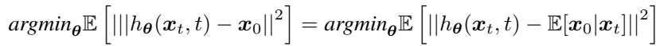

That is, the function $h _ { \theta } ( x _ { t } , t )$ that minimizes the mean squared error with respect to $\scriptstyle { \mathbf { { \mathit { x } } } } _ { 0 }$ is the one that best approximates the conditional expectation $\mathbb { E } [ { \pmb x } _ { 0 } | { \pmb x } _ { t } ]$ ].

Proof.

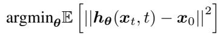

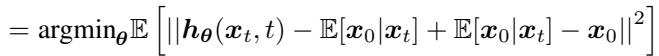

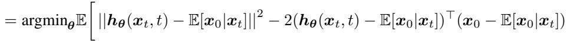

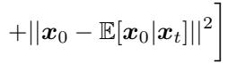

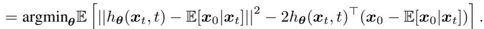

Now, for the second term, we have:

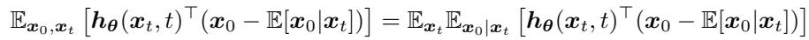

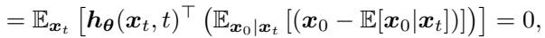

which concludes the proof.

### A.1 Tweedie’s Formula

Lemma A.2 (Tweedie’s Formula). Let:

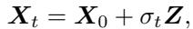

for $X _ { 0 } \sim p _ { X _ { 0 } }$ and $ { \boldsymbol { Z } } \sim \mathcal { N } ( 0 , I )$ . Then,

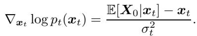

> 💡 **公式批读 Lemma A.2（Tweedie 证明）(Hao 批注)**: 自洽证明 score = (去噪均值 − 输入)/$\sigma_t^2$。核心是把 $\nabla_{x_t}\log p_t(x_t)$ 写成对 $x_0$ 的积分（Eq. A.10–A.14），用高斯核 $\nabla_{x_t}\log p_t(x_t|x_0)=(x_0-x_t)/\sigma_t^2$ 收尾。这条是全篇引擎（正文 Eq. 2.10）的严格出处。

Proof.

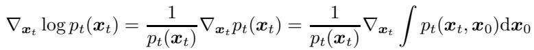

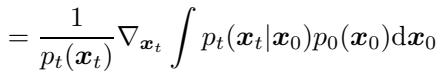

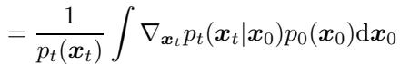

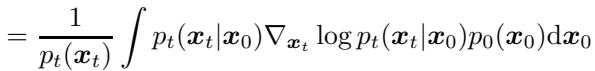

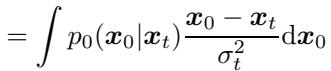

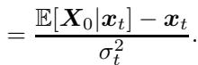

### A.2 Denoising Score Matching

By leveraging the MMSE interpretation of the conditional expectation and Tweedie’s formula, one can approximate the score function by training a model to predict the clean image from a corrupted observation (via supervised learning). At inference time, the trained network can be converted to a model that approximates the score through Tweedie’s formula. This training procedure is typically known as x -prediction loss. An alternative, but equivalent, way is to train for the score directly. Vincent [133] independently discovered Denoising Score Matching, which has as a unique minimizer the score function. DSM and the $\scriptstyle { \mathbf { { \mathit { x } } } } _ { 0 }$ -prediction objective are the same up to a simple network reparametrization.

Theorem A.3 (Denoising Score Matching [133]). Let $p _ { 0 } , p _ { t }$ be two distributions in $\mathbb { R } ^ { n }$ . Assume that all the conditional distributions, $p _ { t } ( \pmb { x } _ { t } | \pmb { x } _ { 0 } )$ , are supported and differentiable in $\mathbb { R } ^ { n }$ . Let:

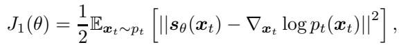

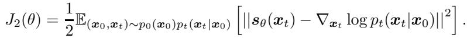

Then, $J _ { 1 }$ and $J _ { 2 }$ have the same minimizer.

We include the proof listed in [164] for completeness.

Proof.

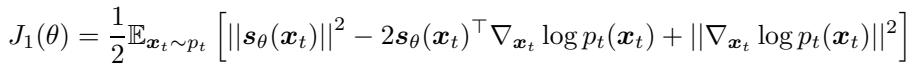

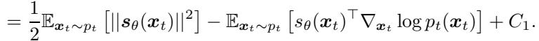

Similarly,

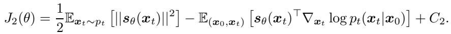

It suffices to show that:

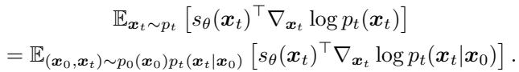

We start with the second term.

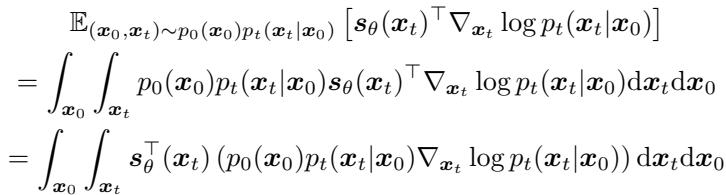

(A.23)

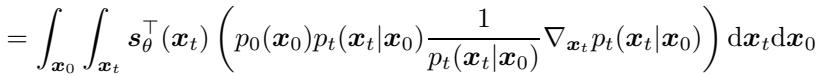

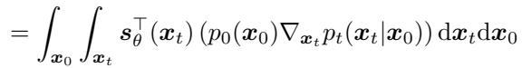

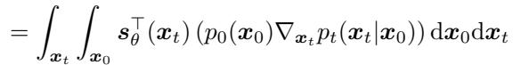

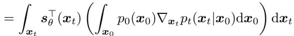

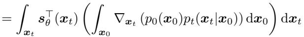

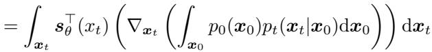

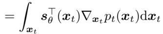

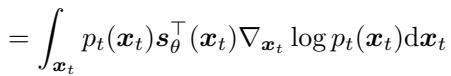

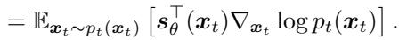

### A.3 Jacobian of the score

Lemma A.4 (Jacobian of score-function). Let:

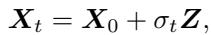

for $X _ { 0 } \sim p _ { X _ { 0 } }$ and $ { \boldsymbol { Z } } \sim \mathcal { N } ( 0 , I )$ . Then,

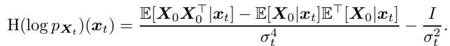

> 💡 **公式批读 Lemma A.4（协方差/校准的数学根）(Hao 批注)**: 这条给出 $\log p_t$ 的 Hessian（即 score 的 Jacobian），等价于 $p(x_0|x_t)$ 的协方差公式 $V[x_0|x_t]=\sigma_t^4 H+\sigma_t^2 I$（正文 Eq. 3.19）。**这是 Moment Matching (3.1.6) 和 STSL (3.6.3) 的理论依据，也是本课题后验校准的数学根**：后验的 spread 本质由这个二阶量决定，SBC/coverage 检验的其实就是模型是否把这个协方差算对。Corollary A.5 给出其迹（Laplacian）的形式。

Proof.

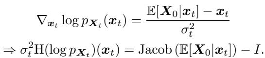

(A.36)

We will now analyze the Jacobian.

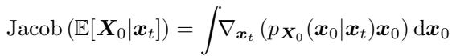

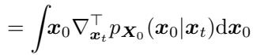

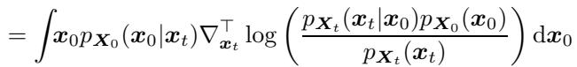

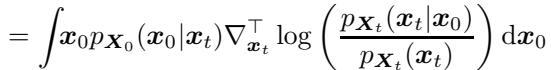

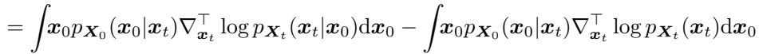

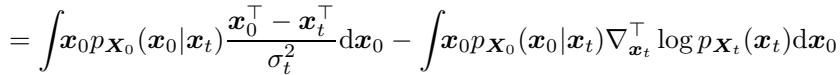

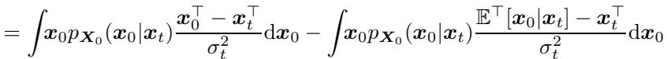

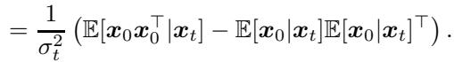

Corollary A.5. Let:

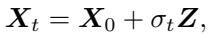

for $X _ { 0 } \sim p _ { X _ { 0 } } , X _ { 0 } \in \mathbb { R } ^ { n }$ and $ { \boldsymbol { Z } } \sim \mathcal { N } ( 0 , I )$ . Then,

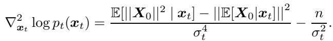

## References

[1] A. Jalal, M. Arvinte, G. Daras, E. Price, A. G. Dimakis, and J. Tamir, “Robust compressed sensing mri with deep generative priors,” Advances in Neural Information Processing Systems, vol. 34, pp. 14 938–14 954, 2021.

[2] Y. Song, J. Sohl-Dickstein, D. P. Kingma, A. Kumar, S. Ermon, and B. Poole, “Scorebased generative modeling through stochastic differential equations,” arXiv preprint arXiv:2011.13456, 2020.

[3] J. Choi, S. Kim, Y. Jeong, Y. Gwon, and S. Yoon, “Ilvr: Conditioning method for denoising diffusion probabilistic models,” in Proceedings of the IEEE/CVF International Conference on Computer Vision (ICCV), 2021, pp. 14 367–14 376.

[4] H. Chung, J. Kim, M. T. Mccann, M. L. Klasky, and J. C. Ye, “Diffusion posterior sampling for general noisy inverse problems,” in The Eleventh International Conference on Learning Representations, 2023. [Online]. Available: https://openreview.net/forum?id=OnD9zGAGT0k

[5] J. Song, A. Vahdat, M. Mardani, and J. Kautz, “Pseudoinverse-guided diffusion models for inverse problems,” in International Conference on Learning Representations, 2022.

[6] F. Rozet, G. Andry, F. Lanusse, and G. Louppe, “Learning diffusion priors from observations by expectation maximization,” arXiv preprint arXiv:2405.13712, 2024.

[7] H. Chung, J. Kim, S. Kim, and J. C. Ye, “Parallel diffusion models of operator and image for blind inverse problems,” in Proceedings of the IEEE/CVF Conference on Computer Vision and Pattern Recognition, 2023, pp. 6059–6069.

[8] B. Kawar, G. Vaksman, and M. Elad, “Snips: Solving noisy inverse problems stochastically,” Advances in Neural Information Processing Systems, vol. 34, pp. 21 757–21 769, 2021.

[9] B. Kawar, M. Elad, S. Ermon, and J. Song, “Denoising diffusion restoration models,” in Advances in Neural Information Processing Systems, 2022.

[10] N. Murata, K. Saito, C.-H. Lai, Y. Takida, T. Uesaka, Y. Mitsufuji, and S. Ermon, “Gibbsddrm: A partially collapsed gibbs sampler for solving blind inverse problems with denoising diffusion restoration,” in International Conference on Machine Learning. PMLR, 2023, pp. 25 501–25 522.

[11] Y. Wang, J. Yu, and J. Zhang, “Zero-shot image restoration using denoising diffusion nullspace model,” arXiv preprint arXiv:2212.00490, 2022.

[12] H. Chung, S. Lee, and J. C. Ye, “Decomposed diffusion sampler for accelerating large-scale inverse problems,” arXiv preprint arXiv:2303.05754, 2023.

[13] Y. Zhu, K. Zhang, J. Liang, J. Cao, B. Wen, R. Timofte, and L. Van Gool, “Denoising diffusion models for plug-and-play image restoration,” in Proceedings of the IEEE/CVF Conference on Computer Vision and Pattern Recognition, 2023, pp. 1219–1229.

[14] L. Rout, N. Raoof, G. Daras, C. Caramanis, A. Dimakis, and S. Shakkottai, “Solving linear inverse problems provably via posterior sampling with latent diffusion models,” Advances in Neural Information Processing Systems, vol. 36, 2024.

[15] L. Rout, Y. Chen, A. Kumar, C. Caramanis, S. Shakkottai, and W.-S. Chu, “Beyond first-order tweedie: Solving inverse problems using latent diffusion,” in Proceedings of the IEEE/CVF Conference on Computer Vision and Pattern Recognition, 2024, pp. 9472–9481.

[16] M. Mardani, J. Song, J. Kautz, and A. Vahdat, “A variational perspective on solving inverse problems with diffusion models,” in The Twelfth International Conference on Learning Representations, 2024.

[17] C. Alkan, J. Oscanoa, D. Abraham, M. Gao, A. Nurdinova, K. Setsompop, J. M. Pauly, M. Mardani, and S. Vasanawala, “Variational diffusion models for blind mri inverse problems,” in NeurIPS 2023 Workshop on Deep Learning and Inverse Problems, 2023.

[18] B. T. Feng, J. Smith, M. Rubinstein, H. Chang, K. L. Bouman, and W. T. Freeman, “Score-based diffusion models as principled priors for inverse imaging,” arXiv preprint arXiv:2304.11751, 2023.

[19] B. T. Feng and K. L. Bouman, “Efficient bayesian computational imaging with a surrogate score-based prior,” arXiv preprint arXiv:2309.01949, 2023.

[20] H. Wang, X. Zhang, T. Li, Y. Wan, T. Chen, and J. Sun, “Dmplug: A plug-in method for solving inverse problems with diffusion models,” arXiv preprint arXiv:2405.16749, 2024.

[21] H. Chihaoui, A. Lemkhenter, and P. Favaro, “Zero-shot image restoration via diffusion inversion,” 2024. [Online]. Available: https://openreview.net/forum?id=ZnmofqLWMQ

[22] T. Xu, Z. Zhu, J. Li, D. He, Y. Wang, M. Sun, L. Li, H. Qin, Y. Wang, J. Liu, and Y.- Q. Zhang, “Consistency model is an effective posterior sample approximation for diffusion inverse solvers,” 2024.

[23] G. Daras, Y. Dagan, A. Dimakis, and C. Daskalakis, “Score-guided intermediate level optimization: Fast Langevin mixing for inverse problems,” in Proceedings of the 39th International Conference on Machine Learning, ser. Proceedings of Machine Learning Research, K. Chaudhuri, S. Jegelka, L. Song, C. Szepesvari, G. Niu, and S. Sabato, Eds., vol. 162. PMLR, 17–23 Jul 2022, pp. 4722–4753. [Online]. Available: https://proceedings.mlr.press/v162/daras22a.html

[24] Z. Wu, Y. Sun, Y. Chen, B. Zhang, Y. Yue, and K. L. Bouman, “Principled probabilistic imaging using diffusion models as plug-and-play priors,” 2024.

[25] Z. Dou and Y. Song, “Diffusion posterior sampling for linear inverse problem solving: A filtering perspective,” in The Twelfth International Conference on Learning Representations, 2023.

[26] Y. Sun, Z. Wu, Y. Chen, B. T. Feng, and K. L. Bouman, “Provable probabilistic imaging using score-based generative priors,” IEEE Transactions on Computational Imaging, 2024.

[27] B. L. Trippe, J. Yim, D. Tischer, D. Baker, T. Broderick, R. Barzilay, and T. S. Jaakkola, “Diffusion probabilistic modeling of protein backbones in 3d for the motif-scaffolding problem,” in The Eleventh International Conference on Learning Representations, 2023. [Online]. Available: https://openreview.net/forum?id=6TxBxqNME1Y

[28] G. Cardoso, S. Le Corff, E. Moulines et al., “Monte carlo guided denoising diffusion models for bayesian linear inverse problems.” in The Twelfth International Conference on Learning Representations, 2023.

[29] L. Wu, B. L. Trippe, C. A. Naesseth, J. P. Cunningham, and D. Blei, “Practical and asymptotically exact conditional sampling in diffusion models,” in Thirty-seventh Conference on Neural Information Processing Systems, 2023. [Online]. Available: https://openreview.net/forum?id=eWKqr1zcRv

[30] Z. Kadkhodaie and E. P. Simoncelli, “Solving linear inverse problems using the prior implicit in a denoiser,” arXiv preprint arXiv:2007.13640, 2020

[31] H. Chung, B. Sim, D. Ryu, and J. C. Ye, “Improving diffusion models for inverse problems using manifold constraints,” Advances in Neural Information Processing Systems, vol. 35, pp. 25 683–25 696, 2022.

[32] B. Song, S. M. Kwon, Z. Zhang, X. Hu, Q. Qu, and L. Shen, “Solving inverse problems with latent diffusion models via hard data consistency,” in The Twelfth International Conference on Learning Representations, 2024. [Online]. Available: https://openreview.net/forum?id=j8hdRqOUhN

[33] Y. He, N. Murata, C.-H. Lai, Y. Takida, T. Uesaka, D. Kim, W.-H. Liao, Y. Mitsufuji, J. Z. Kolter, R. Salakhutdinov et al., “Manifold preserving guided diffusion,” arXiv preprint arXiv:2311.16424, 2023.

[34] H. Chung, J. C. Ye, P. Milanfar, and M. Delbracio, “Prompt-tuning latent diffusion models for inverse problems,” in International Conference on Machine Learning. PMLR, 2014.

[35] J. Kim, G. Y. Park, H. Chung, and J. C. Ye, “Regularization by texts for latent diffusion inverse solvers,” arXiv preprint arXiv:2311.15658, 2023.

[36] J. Kim, G. Y. Park, and J. C. Ye, “Dreamsampler: Unifying diffusion sampling and score distillation for image manipulation,” arXiv preprint arXiv:2403.11415, 2024.

[37] P. Lailly and J. Bednar, “The seismic inverse problem as a sequence of before stack migrations,” in Conference on inverse scattering: theory and application, vol. 1983. Philadelphia, Pa, 1983, pp. 206–220.

[38] J. Virieux and S. Operto, “An overview of full-waveform inversion in exploration geophysics,” Geophysics, vol. 74, no. 6, pp. WCC1–WCC26, 2009.

[39] S. Huang, J. Xiang, H. Du, and X. Cao, “Inverse problems in atmospheric science and their application,” in Journal of Physics: Conference Series, vol. 12, no. 1. IOP Publishing, 2005, p. 45.

[40] C. Wunsch, The ocean circulation inverse problem. Cambridge University Press, 1996.

[41] J.-M. Lemercier, J. Richter, S. Welker, E. Moliner, V. Välimäki, and T. Gerkmann, “Diffusion models for audio restoration,” arXiv preprint arXiv:2402.09821, 2024.

[42] K. Saito, N. Murata, T. Uesaka, C.-H. Lai, Y. Takida, T. Fukui, and Y. Mitsufuji, “Unsupervised vocal dereverberation with diffusion-based generative models,” in ICASSP 2023- 2023 IEEE International Conference on Acoustics, Speech and Signal Processing (ICASSP). IEEE, 2023, pp. 1–5.

[43] E. Moliner, F. Elvander, and V. Välimäki, “Blind audio bandwidth extension: A diffusionbased zero-shot approach,” arXiv preprint arXiv:2306.01433, 2023.

[44] E. Moliner, J. Lehtinen, and V. Välimäki, “Solving audio inverse problems with a diffusion model,” in ICASSP 2023-2023 IEEE International Conference on Acoustics, Speech and Signal Processing (ICASSP). IEEE, 2023, pp. 1–5.

[45] E. Moliner and V. Välimäki, “Diffusion-based audio inpainting,” arXiv preprint arXiv:2305.15266, 2023.

[46] C. Hernandez-Olivan, K. Saito, N. Murata, C.-H. Lai, M. A. Martínez-Ramirez, W.-H. Liao, and Y. Mitsufuji, “Vrdmg: Vocal restoration via diffusion posterior sampling with multiple guidance,” in ICASSP 2024-2024 IEEE International Conference on Acoustics, Speech and Signal Processing (ICASSP). IEEE, 2024, pp. 596–600.

[47] Y. Song, L. Shen, L. Xing, and S. Ermon, “Solving inverse problems in medical imaging with score-based generative models,” arXiv preprint arXiv:2111.08005, 2021.

[48] H. Chung, D. Ryu, M. T. McCann, M. L. Klasky, and J. C. Ye, “Solving 3d inverse problems using pre-trained 2d diffusion models,” in Proceedings of the IEEE/CVF Conference on Computer Vision and Pattern Recognition, 2023, pp. 22 542–22 551.

[49] A. Aali, G. Daras, B. Levac, S. Kumar, A. G. Dimakis, and J. I. Tamir, “Ambient diffusion posterior sampling: Solving inverse problems with diffusion models trained on corrupted data,” arXiv preprint arXiv:2403.08728, 2024.

[50] H. Chung and J. C. Ye, “Score-based diffusion models for accelerated mri,” Medical image analysis, vol. 80, p. 102479, 2022.

[51] L. Fan, F. Zhang, H. Fan, and C. Zhang, “Brief review of image denoising techniques,” Visual Computing for Industry, Biomedicine, and Art, vol. 2, no. 1, p. 7, 2019.

[52] W. Quan, J. Chen, Y. Liu, D.-M. Yan, and P. Wonka, “Deep learning-based image and video inpainting: A survey,” International Journal of Computer Vision, vol. 132, no. 7, pp. 2367– 2400, 2024.

[53] T. Yu, R. Feng, R. Feng, J. Liu, X. Jin, W. Zeng, and Z. Chen, “Inpaint anything: Segment anything meets image inpainting,” arXiv preprint arXiv:2304.06790, 2023.

[54] J. Ouyang-Zhang, D. J. Diaz, A. Klivans, and P. Krähenbühl, “Predicting a protein’s stability under a million mutations,” NeurIPS, 2023.

[55] D. J. Diaz, C. Gong, J. Ouyang-Zhang, J. M. Loy, J. Wells, D. Yang, A. D. Ellington, A. G. Dimakis, and A. R. Klivans, “Stability oracle: a structure-based graph-transformer framework for identifying stabilizing mutations,” Nature Communications, vol. 15, no. 1, p. 6170, 2024.

[56] K. K. Yang, Z. Wu, and F. H. Arnold, “Machine-learning-guided directed evolution for protein engineering,” Nature methods, vol. 16, no. 8, pp. 687–694, 2019.

[57] Y. Xu, D. Verma, R. P. Sheridan, A. Liaw, J. Ma, N. M. Marshall, J. McIntosh, E. C. Sherer, V. Svetnik, and J. M. Johnston, “Deep dive into machine learning models for protein engineering,” Journal of chemical information and modeling, vol. 60, no. 6, pp. 2773–2790, 2020.

[58] A. Aali, M. Arvinte, S. Kumar, and J. I. Tamir, “Solving inverse problems with score-based generative priors learned from noisy data,” arXiv preprint arXiv:2305.01166, 2023.

[59] J. Zbontar, F. Knoll, A. Sriram, T. Murrell, Z. Huang, M. J. Muckley, A. Defazio, R. Stern, P. Johnson, M. Bruno et al., “fastmri: An open dataset and benchmarks for accelerated mri,” arXiv preprint arXiv:1811.08839, 2018.

[60] A. D. Desai, A. M. Schmidt, E. B. Rubin, C. M. Sandino, M. S. Black, V. Mazzoli, K. J. Stevens, R. Boutin, C. Ré, G. E. Gold, B. A. Hargreaves, and A. S. Chaudhari, “Skm-tea: A dataset for accelerated mri reconstruction with dense image labels for quantitative clinical evaluation,” 2022.

[61] T. Zhang, J. Pauly, S. Vasanawala, and M. Lustig, “MRI Data: Undersampled Abdomens,” Undersampled Abdomens | MRI Data. [Online]. Available: http://old.mridata.org/undersampled/abdomens

[62] U. Tariq, P. Lai, M. Lustig, M. Alley, M. Zhang, G. Gold, and V. S. S, “MRI Data: Undersampled Knees,” Undersampled Knees | MRI Data. [Online]. Available: http://old.mridata.org/undersampled/knees

[63] M. Lustig, D. L. Donoho, J. M. Santos, and J. M. Pauly, “Compressed sensing mri,” IEEE signal processing magazine, vol. 25, no. 2, pp. 72–82, 2008.

[64] X. Pan, E. Y. Sidky, and M. Vannier, “Why do commercial ct scanners still employ traditional, filtered back-projection for image reconstruction?” Inverse problems, vol. 25, no. 12, p. 123009, 2009.

[65] M. Genzel, I. Gühring, J. Macdonald, and M. März, “Near-exact recovery for tomographic inverse problems via deep learning,” in International Conference on Machine Learning. PMLR, 2022, pp. 7368–7381.

[66] G. Beylkin, “The inversion problem and applications of the generalized radon transform,” Communications on pure and applied mathematics, vol. 37, no. 5, pp. 579–599, 1984.

[67] A. C. Kak and M. Slaney, Principles of computerized tomographic imaging. SIAM, 2001.

[68] M. Dietz, L. Liljeryd, K. Kjorling, and O. Kunz, “Spectral band replication, a novel approach in audio coding,” in Audio Engineering Society Convention 112. Audio Engineering Society, 2002.

[69] J. Dubochet, M. Adrian, J.-J. Chang, J.-C. Homo, J. Lepault, A. W. McDowall, and P. Schultz, “Cryo-electron microscopy of vitrified specimens,” Quarterly reviews of biophysics, vol. 21, no. 2, pp. 129–228, 1988.

[70] S. C. Park, M. K. Park, and M. G. Kang, “Super-resolution image reconstruction: a technical overview,” IEEE signal processing magazine, vol. 20, no. 3, pp. 21–36, 2003.

[71] C. Saharia, J. Ho, W. Chan, T. Salimans, D. J. Fleet, and M. Norouzi, “Image super-resolution via iterative refinement,” arXiv preprint arXiv:2104.07636, 2021.

[72] T. Nakatani, T. Yoshioka, K. Kinoshita, M. Miyoshi, and B.-H. Juang, “Speech dereverberation based on variance-normalized delayed linear prediction,” IEEE Transactions on Audio, Speech, and Language Processing, vol. 18, no. 7, pp. 1717–1731, 2010.

[73] J. R. Fienup, “Phase retrieval algorithms: a comparison,” Applied optics, vol. 21, no. 15, pp. 2758–2769, 1982.

[74] K. Akiyama, A. Alberdi, W. Alef, K. Asada, R. Azulay, A.-K. Baczko, D. Ball, M. Balokovic,´ J. Barrett, D. Bintley et al., “First m87 event horizon telescope results. iv. imaging the central supermassive black hole,” The Astrophysical Journal Letters, vol. 875, no. 1, p. L4, 2019.

[75] A. Tarantola, Inverse problem theory and methods for model parameter estimation. SIAM, 2005.

[76] J. Scarlett, R. Heckel, M. R. D. Rodrigues, P. Hand, and Y. C. Eldar, “Theoretical perspectives on deep learning methods in inverse problems,” IEEE Journal on Selected Areas in Information Theory, vol. 3, no. 3, p. 433–453, Sep. 2022. [Online]. Available: http://dx.doi.org/10.1109/JSAIT.2023.3241123

[77] R. Bassett and J. Deride, “Maximum a posteriori estimators as a limit of bayes estimators,” Mathematical Programming, vol. 174, pp. 129–144, 2019.

[78] M. Pereyra, “Revisiting maximum-a-posteriori estimation in log-concave models,” SIAM Journal on Imaging Sciences, vol. 12, no. 1, pp. 650–670, 2019.

[79] G. A. Young, R. L. Smith, and R. L. Smith, Essentials of statistical inference. Cambridge University Press, 2005, vol. 16.

[80] K. P. Murphy, Machine learning: a probabilistic perspective. MIT press, 2012.

[81] Y. Blau and T. Michaeli, “The perception-distortion tradeoff,” in 2018 IEEE/CVF Conference on Computer Vision and Pattern Recognition. IEEE, 2018.

[82] A. Ribes and F. Schmitt, “Linear inverse problems in imaging,” IEEE Signal Processing Magazine, vol. 25, no. 4, pp. 84–99, 2008.

[83] H. H. Barrett and K. J. Myers, Foundations of image science. John Wiley & Sons, 2013.

[84] I. Daubechies, M. Defrise, and C. De Mol, “An iterative thresholding algorithm for linear inverse problems with a sparsity constraint,” Communications on Pure and Applied Mathematics: A Journal Issued by the Courant Institute of Mathematical Sciences, vol. 57, no. 11, pp. 1413–1457, 2004.

[85] E. J. Candès, J. Romberg, and T. Tao, “Robust uncertainty principles: Exact signal reconstruction from highly incomplete frequency information,” IEEE Transactions on information theory, vol. 52, no. 2, pp. 489–509, 2006.

[86] D. L. Donoho, “Compressed sensing,” IEEE Transactions on information theory, vol. 52, no. 4, pp. 1289–1306, 2006.

[87] M. A. Figueiredo and R. D. Nowak, “An em algorithm for wavelet-based image restoration,” IEEE Transactions on Image Processing, vol. 12, no. 8, pp. 906–916, 2003.

[88] E. T. Hale, W. Yin, and Y. Zhang, “A fixed-point continuation method for l1-regularized minimization with applications to compressed sensing,” CAAM TR07-07, Rice University, vol. 43, no. 44, p. 2, 2007.

[89] N. Shlezinger, J. Whang, Y. C. Eldar, and A. G. Dimakis, “Model-based deep learning,” Proceedings of the IEEE, vol. 111, no. 5, pp. 465–499, 2023.

[90] L. I. Rudin, S. Osher, and E. Fatemi, “Nonlinear total variation based noise removal algorithms,” Physica D: Nonlinear Phenomena, vol. 60, no. 1-4, pp. 259–268, 1992.

[91] A. Beck and M. Teboulle, “Fast gradient-based algorithms for constrained total variation image denoising and deblurring problems,” IEEE transactions on image processing, vol. 18, no. 11, pp. 2419–2434, 2009.

[92] G. Ongie, A. Jalal, C. A. Metzler, R. G. Baraniuk, A. G. Dimakis, and R. Willett, “Deep learning techniques for inverse problems in imaging,” IEEE Journal on Selected Areas in Information Theory, vol. 1, no. 1, pp. 39–56, 2020.

[93] C. Dong, C. C. Loy, K. He, and X. Tang, “Image super-resolution using deep convolutional networks,” IEEE transactions on pattern analysis and machine intelligence, vol. 38, no. 2, pp. 295–307, 2015.

[94] B. Lim, S. Son, H. Kim, S. Nah, and K. Mu Lee, “Enhanced deep residual networks for single image super-resolution,” in Proceedings of the IEEE conference on computer vision and pattern recognition workshops, 2017, pp. 136–144.

[95] X. Tao, H. Gao, X. Shen, J. Wang, and J. Jia, “Scale-recurrent network for deep image deblurring,” in Proceedings of the IEEE Conference on Computer Vision and Pattern Recognition (CVPR), 2018.

[96] C. Chen, Q. Chen, J. Xu, and V. Koltun, “Learning to see in the dark,” in IEEE Conference on Computer Vision and Pattern Recognition, 2018, pp. 3291–3300.

[97] S. W. Zamir, A. Arora, S. Khan, M. Hayat, F. S. Khan, and M.-H. Yang, “Restormer: Efficient transformer for high-resolution image restoration,” in Proceedings of the IEEE/CVF Conference on Computer Vision and Pattern Recognition, 2022, pp. 5728–5739.

[98] L. Chen, X. Chu, X. Zhang, and J. Sun, “Simple baselines for image restoration,” in Computer Vision–ECCV 2022: 17th European Conference, Tel Aviv, Israel, October 23–27, 2022, Proceedings, Part VII. Springer, 2022, pp. 17–33.

[99] Z. Tu, H. Talebi, H. Zhang, F. Yang, P. Milanfar, A. Bovik, and Y. Li, “Maxim: Multi-axis mlp for image processing,” in Proceedings of the IEEE/CVF Conference on Computer Vision and Pattern Recognition, 2022, pp. 5769–5780.

[100] S. W. Zamir, A. Arora, S. Khan, M. Hayat, F. S. Khan, M.-H. Yang, and L. Shao, “Multi-stage progressive image restoration,” in Proceedings of the IEEE/CVF conference on computer vision and pattern recognition, 2021, pp. 14 821–14 831.

[101] P. Isola, J.-Y. Zhu, T. Zhou, and A. A. Efros, “Image-to-image translation with conditional adversarial networks,” in IEEE conference on computer vision and pattern recognition, 2017, pp. 1125–1134.

[102] O. Kupyn, V. Budzan, M. Mykhailych, D. Mishkin, and J. Matas, “Deblurgan: Blind motion deblurring using conditional adversarial networks,” in Proceedings of the IEEE conference on computer vision and pattern recognition, 2018, pp. 8183–8192.

[103] M. Delbracio and P. Milanfar, “Inversion by direct iteration: An alternative to denoising diffusion for image restoration,” Transactions on Machine Learning Research, 2023, featured Certification. [Online]. Available: https://openreview.net/forum?id=VmyFF5lL3F

[104] S. V. Venkatakrishnan, C. A. Bouman, and B. Wohlberg, “Plug-and-play priors for model based reconstruction,” in 2013 IEEE Global Conference on Signal and Information Processing. IEEE, 2013, pp. 945–948.

[105] S. Sreehari, S. V. Venkatakrishnan, B. Wohlberg, G. T. Buzzard, L. F. Drummy, J. P. Simmons, and C. A. Bouman, “Plug-and-play priors for bright field electron tomography and sparse interpolation,” IEEE Transactions on Computational Imaging, vol. 2, no. 4, pp. 408–423, 2016.

[106] S. H. Chan, X. Wang, and O. A. Elgendy, “Plug-and-play admm for image restoration: Fixedpoint convergence and applications,” IEEE Transactions on Computational Imaging, vol. 3, no. 1, pp. 84–98, 2016.

[107] Y. Romano, M. Elad, and P. Milanfar, “The little engine that could: Regularization by denoising (red),” SIAM Journal on Imaging Sciences, vol. 10, no. 4, pp. 1804–1844, 2017.

[108] R. Cohen, M. Elad, and P. Milanfar, “Regularization by denoising via fixed-point projection (red-pro),” SIAM Journal on Imaging Sciences, vol. 14, no. 3, pp. 1374–1406, 2021.

[109] Z. Kadkhodaie and E. P. Simoncelli, “Stochastic solutions for linear inverse problems using the prior implicit in a denoiser,” in Thirty-Fifth Conference on Neural Information Processing Systems, 2021.

[110] U. S. Kamilov, C. A. Bouman, G. T. Buzzard, and B. Wohlberg, “Plug-and-play methods for integrating physical and learned models in computational imaging: Theory, algorithms, and applications,” IEEE Signal Processing Magazine, vol. 40, no. 1, pp. 85–97, 2023.

[111] P. Milanfar and M. Delbracio, “Denoising: A powerful building-block for imaging, inverse problems, and machine learning,” arXiv preprint arXiv:2409.06219, 2024.

[112] H. Li, Y. Yang, M. Chang, H. Feng, Z. Xu, Q. Li, and Y. Chen, “Srdiff: Single image superresolution with diffusion probabilistic models,” arXiv preprint arXiv:2104.14951, 2021.

[113] C. Saharia, W. Chan, H. Chang, C. Lee, J. Ho, T. Salimans, D. Fleet, and M. Norouzi, “Palette: Image-to-image diffusion models,” in ACM SIGGRAPH 2022 Conference Proceedings, 2022, pp. 1–10.

[114] J. Whang, M. Delbracio, H. Talebi, C. Saharia, A. G. Dimakis, and P. Milanfar, “Deblurring via stochastic refinement,” in Proceedings of the IEEE/CVF Conference on Computer Vision and Pattern Recognition, 2022, pp. 16 293–16 303.

[115] Z. Luo, F. K. Gustafsson, Z. Zhao, J. Sjölund, and T. B. Schön, “Image restoration with mean-reverting stochastic differential equations,” arXiv preprint arXiv:2301.11699, 2023.

[116] ——, “Refusion: Enabling large-size realistic image restoration with latent-space diffusion models,” in Proceedings of the IEEE/CVF Conference on Computer Vision and Pattern Recognition, 2023, pp. 1680–1691.

[117] M. S. Albergo and E. Vanden-Eijnden, “Building normalizing flows with stochastic interpolants,” in The Eleventh International Conference on Learning Representations, 2023. [Online]. Available: https://openreview.net/forum?id=li7qeBbCR1t

[118] M. S. Albergo, N. M. Boffi, and E. Vanden-Eijnden, “Stochastic interpolants: A unifying framework for flows and diffusions,” arXiv preprint arXiv:2303.08797, 2023.

[119] Y. Lipman, R. T. Q. Chen, H. Ben-Hamu, M. Nickel, and M. Le, “Flow matching for generative modeling,” in The Eleventh International Conference on Learning Representations, 2023. [Online]. Available: https://openreview.net/forum?id=PqvMRDCJT9t

[120] G.-H. Liu, A. Vahdat, D.-A. Huang, E. A. Theodorou, W. Nie, and A. Anandkumar, “I2sb: Image-to-image schrödinger bridge,” arXiv preprint arXiv:2302.05872, 2023.

[121] X. Liu, C. Gong, and qiang liu, “Flow straight and fast: Learning to generate and transfer data with rectified flow,” in The Eleventh International Conference on Learning Representations, 2023. [Online]. Available: https://openreview.net/forum?id=XVjTT1nw5z

[122] Y. Shi, V. De Bortoli, A. Campbell, and A. Doucet, “Diffusion schr " odinger bridge matching,” arXiv preprint arXiv:2303.16852, 2023.

[123] A. Lugmayr, M. Danelljan, A. Romero, F. Yu, R. Timofte, and L. Van Gool, “Repaint: Inpainting using denoising diffusion probabilistic models,” in Proceedings of the IEEE/CVF conference on computer vision and pattern recognition, 2022, pp. 11 461–11 471.

[124] L. Rout, A. Parulekar, C. Caramanis, and S. Shakkottai, “A theoretical justification for image inpainting using denoising diffusion probabilistic models,” arXiv preprint arXiv:2302.01217, 2023.

[125] H. Chung and J. C. Ye, “Deep diffusion image prior for efficient ood adaptation in 3d inverse problems,” in Proceedings of the European Conference on Computer Vision (ECCV), 2024.

[126] Y. Shen, X. Jiang, Y. Wang, Y. Yang, D. Han, and D. Li, “Understanding training-free diffusion guidance: Mechanisms and limitations,” arXiv preprint arXiv:2403.12404, 2024.

[127] J. Ho, A. Jain, and P. Abbeel, “Denoising diffusion probabilistic models,” Advances in Neural Information Processing Systems, vol. 33, pp. 6840–6851, 2020.

[128] Y. Song and S. Ermon, “Generative modeling by estimating gradients of the data distribution,” Advances in Neural Information Processing Systems, vol. 32, 2019.

[129] B. D. Anderson, “Reverse-time diffusion equation models,” Stochastic Processes and their Applications, vol. 12, no. 3, pp. 313–326, 1982.

[130] D. Maoutsa, S. Reich, and M. Opper, “Interacting particle solutions of fokker–planck equations through gradient–log–density estimation,” Entropy, vol. 22, no. 8, p. 802, 2020.

[131] J. Song, C. Meng, and S. Ermon, “Denoising diffusion implicit models,” arXiv preprint arXiv:2010.02502, 2020.

[132] B. Efron, “Tweedie’s formula and selection bias,” Journal of the American Statistical Association, vol. 106, no. 496, pp. 1602–1614, 2011.

[133] P. Vincent, “A connection between score matching and denoising autoencoders,” Neural computation, vol. 23, no. 7, pp. 1661–1674, 2011.

[134] R. Rombach, A. Blattmann, D. Lorenz, P. Esser, and B. Ommer, “High-resolution image synthesis with latent diffusion models,” in Proceedings of the IEEE/CVF Conference on Computer Vision and Pattern Recognition, 2022, pp. 10 684–10 695.

[135] B. Øksendal, Stochastic Differential Equations: An Introduction with Applications, 6th ed. Berlin: Springer Science & Business Media, 2010.

[136] S. Gupta, A. Jalal, A. Parulekar, E. Price, and Z. Xun, “Diffusion posterior sampling is computationally intractable,” arXiv preprint arXiv:2402.12727, 2024.

[137] G. Daras, K. Shah, Y. Dagan, A. Gollakota, A. Dimakis, and A. Klivans, “Ambient diffusion: Learning clean distributions from corrupted data,” in Advances in Neural Information Processing Systems, A. Oh, T. Naumann, A. Globerson, K. Saenko, M. Hardt, and S. Levine, Eds., vol. 36. Curran Associates, Inc., 2023, pp. 288–313. [Online]. Available: https://proceedings.neurips.cc/paper\_files/paper/2023/file/012af729c5d14d279581fc8a5db975a1-Paper-Conference.pdf

[138] G. Daras, A. Dimakis, and C. C. Daskalakis, “Consistent diffusion meets tweedie: Training exact ambient diffusion models with noisy data,” in Proceedings of the 41st International Conference on Machine Learning, ser. Proceedings of Machine Learning Research, R. Salakhutdinov, Z. Kolter, K. Heller, A. Weller, N. Oliver, J. Scarlett, and F. Berkenkamp, Eds., vol. 235. PMLR, 2024, pp. 10 091–10 108. [Online]. Available: https://proceedings.mlr.press/v235/daras24a.htm

[139] G. Daras, Y. Dagan, A. G. Dimakis, and C. Daskalakis, “Consistent diffusion models: Mitigating sampling drift by learning to be consistent,” arXiv preprint arXiv:2302.09057, 2023.

[140] Y. C. Eldar, “Generalized sure for exponential families: Applications to regularization,” IEEE Transactions on Signal Processing, vol. 57, no. 2, pp. 471–481, 2009.

[141] C. M. Stein, “Estimation of the mean of a multivariate normal distribution,” The annals of Statistics, pp. 1135–1151, 1981.

[142] J. Lehtinen, J. Munkberg, J. Hasselgren, S. Laine, T. Karras, M. Aittala, and T. Aila, “Noise2noise: Learning image restoration without clean data,” arXiv preprint arXiv:1803.04189, 2018.

[143] A. Krull, T.-O. Buchholz, and F. Jug, “Noise2void-learning denoising from single noisy images,” in Proceedings of the IEEE/CVF conference on computer vision and pattern recognition, 2019, pp. 2129–2137.

[144] J. Batson and L. Royer, “Noise2self: Blind denoising by self-supervision,” in International Conference on Machine Learning. PMLR, 2019, pp. 524–533.

[145] W. Bai, Y. Wang, W. Chen, and H. Sun, “An expectation-maximization algorithm for training clean diffusion models from corrupted observations,” arXiv preprint arXiv:2407.01014, 2024.

[146] Y. Wang, W. Bai, W. Luo, W. Chen, and H. Sun, “Integrating amortized inference with diffusion models for learning clean distribution from corrupted images,” arXiv preprint arXiv:2407.11162, 2024.

[147] L. Yang, S. Ding, Y. Cai, J. Yu, J. Wang, and Y. Shi, “Guidance with spherical gaussian constraint for conditional diffusion,” arXiv preprint arXiv:2402.03201, 2024.

[148] B. Kawar, G. Vaksman, and M. Elad, “Stochastic image denoising by sampling from the posterior distribution,” in Proceedings of the IEEE/CVF International Conference on Computer Vision, 2021, pp. 1866–1875.

[149] S. Ravula, B. Levac, A. Jalal, J. I. Tamir, and A. G. Dimakis, “Optimizing sampling patterns for compressed sensing mri with diffusion generative models,” arXiv preprint arXiv:2306.03284, 2023.

[150] D. Rezende and S. Mohamed, “Variational inference with normalizing flows,” in International conference on machine learning. PMLR, 2015, pp. 1530–1538.

[151] L. Dinh, J. Sohl-Dickstein, and S. Bengio, “Density estimation using real nvp,” arXiv preprint arXiv:1605.08803, 2016.

[152] Y. Song, C. Durkan, I. Murray, and S. Ermon, “Maximum likelihood training of score-based diffusion models,” Advances in neural information processing systems, vol. 34, pp. 1415– 1428, 2021.

[153] U. S. Kamilov, H. Mansour, and B. Wohlberg, “A plug-and-play priors approach for solving nonlinear imaging inverse problems,” IEEE Signal Processing Letters, vol. 24, no. 12, pp. 1872–1876, 2017.

[154] A. Doucet, N. De Freitas, and N. Gordon, “An introduction to sequential monte carlo meth ods,” Sequential Monte Carlo methods in practice, pp. 3–14, 2001.

[155] A. Bora, A. Jalal, E. Price, and A. G. Dimakis, “Compressed sensing using generative models,” in International conference on machine learning. PMLR, 2017, pp. 537–546.

[156] G. Daras, J. Dean, A. Jalal, and A. Dimakis, “Intermediate layer optimization for inverse problems using deep generative models,” in Proceedings of the 38th International Conference on Machine Learning, ser. Proceedings of Machine Learning Research, M. Meila and T. Zhang, Eds., vol. 139. PMLR, 18–24 Jul 2021, pp. 2421–2432. [Online]. Available: https://proceedings.mlr.press/v139/daras21a.html

[157] Y. Song, P. Dhariwal, M. Chen, and I. Sutskever, “Consistency models,” in International Conference on Machine Learning. PMLR, 2023, pp. 32 211–32 252.

[158] Y. He, N. Murata, C.-H. Lai, Y. Takida, T. Uesaka, D. Kim, W.-H. Liao, Y. Mitsufuji, J. Z. Kolter, R. Salakhutdinov et al., “Manifold preserving guided diffusion,” in The Twelfth International Conference on Learning Representations, 2023.

[159] P. Dhariwal and A. Nichol, “Diffusion models beat gans on image synthesis,” Advances in neural information processing systems, vol. 34, pp. 8780–8794, 2021.

[160] J. Ho and T. Salimans, “Classifier-free diffusion guidance,” arXiv preprint arXiv:2207.12598, 2022.

[161] A. Radford, J. W. Kim, C. Hallacy, A. Ramesh, G. Goh, S. Agarwal, G. Sastry, A. Askell, P. Mishkin, J. Clark et al., “Learning transferable visual models from natural language supervision,” in International conference on machine learning. PMLR, 2021, pp. 8748–8763.

[162] B. Poole, A. Jain, J. T. Barron, and B. Mildenhall, “Dreamfusion: Text-to-3d using 2d diffusion,” in The Eleventh International Conference on Learning Representations, 2023. [Online]. Available: https://openreview.net/forum?id=FjNys5c7VyY

[163] D. Kim, C.-H. Lai, W.-H. Liao, N. Murata, Y. Takida, T. Uesaka, Y. He, Y. Mitsufuji, and S. Ermon, “Consistency trajectory models: Learning probability flow ode trajectory of diffusion,” in The Twelfth International Conference on Learning Representations, 2023.

[164] G. Daras, M. Delbracio, H. Talebi, A. Dimakis, and P. Milanfar, “Soft diffusion: Score matching with general corruptions,” Transactions on Machine Learning Research, 2023. [Online]. Available: https://openreview.net/forum?id=W98rebBxlQ

---

## 🔖 Section 总结

### 核心洞察
1. **Lemma A.1 + A.2 = 全篇引擎的严格版**：L2 去噪回归学到条件期望，Tweedie 把它换算成 score。
2. **Theorem A.3**：DSM 与 x-prediction 目标同最小值，训练两种写法等价。
3. **Lemma A.4 / Corollary A.5**：score 的二阶信息 = $p(x_0|x_t)$ 协方差，是 Moment Matching、STSL 的公式来源，也是后验 spread 与校准的数学根。
4. References 共 164 条，盲/联合相关的关键条目：[7] BlindDPS、[10] GibbsDDRM、[17] Blind RED-Diff；先验来源相关：[137] Ambient Diffusion、[138] Consistent Diffusion Meets Tweedie。
