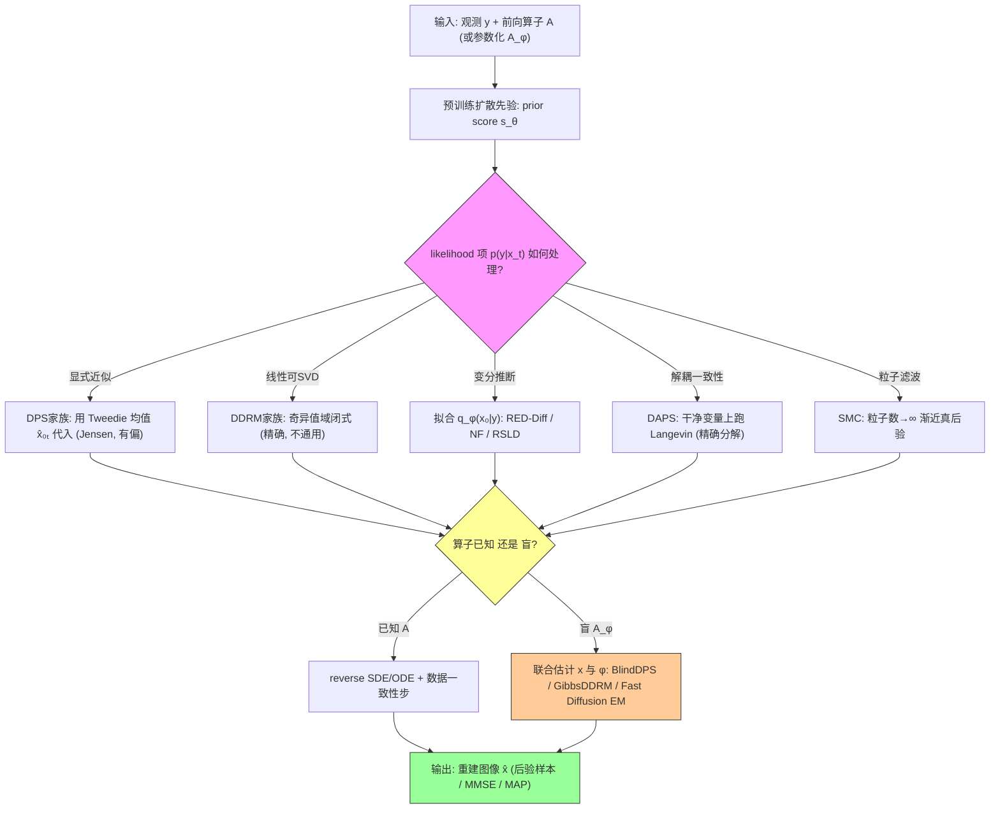

# Diffusion Models for Inverse Problems

**作者**: Hyungjin Chung (EverEx), Jeongsol Kim (KAIST), Jong Chul Ye (KAIST)
**类型**: Book chapter / Survey | **年份**: 2025 (arXiv, 时间线推进至 mid-2025)
**arXiv**: [2508.01975](https://arxiv.org/abs/2508.01975)
**链接**: [PDF](https://arxiv.org/pdf/2508.01975) · [Semantic Scholar](https://www.semanticscholar.org/paper/fb23f1bd5af55d4c6ca4f2229174638b569c29aa) · [Connected Papers](https://www.connectedpapers.com/main/2508.01975)

> 本课题定位（第二篇全局地图）：综述"用扩散先验解逆问题"（DIS）的全景，重点让读者看清 **prior score 与 posterior score 的差距**、以及各种 **likelihood guidance 近似**。批注主线：**数据一致性修正 ≠ 严格后验 score**；并区分**已知算子 vs 盲设置**。

---

## 一句话总结

所有"用扩散模型解逆问题"的方法，本质都是在 reverse diffusion 的 prior score 上补一个 likelihood 修正项 $\nabla_{x_t}\log p(y|x_t)$——而这一项 intractable，于是全领域 40+ 方法就是"如何近似/绕过它"的分类学，代价永远落在 **速度 × 保真 × 是否真采后验** 的三角权衡上。

---

## 核心贡献

1. **统一数学主线**: 把 explicit approximation、variational inference、SMC、decoupled data consistency 等所有路线归约到同一式——posterior score = prior score + likelihood score (Eq. 3)，用"如何处理 likelihood 项"作为统一分类维度。
2. **系统对照假设与权衡**: 逐族拆解每个方法对 $p(y|x_t)$ 的近似（Dirac/高斯/全协方差/闭式 SVD/粒子滤波），点明各自的假设强度与 fidelity–perception–compute 代价。
3. **覆盖复杂扩展**: 盲逆问题（联合估 $x,\varphi$）、3D 高维（因子化先验）、数据稀缺（test-time adaptation / patch prior）、带噪数据训练（GSURE / Ambient / EM）、文本驱动（P2L / TReg / ContextMRI）。
4. **更新时间线到 mid-2025**: 沿用 Daras et al. 2024 综述的 layout，但新增 decoupled data consistency 等类别、把 flow-based 扩展纳入。
5. **点破 exactness 缺口**: 明确所有 zero-shot 解法都在"精确性 vs 速度"上妥协，没有一个给出严格 posterior score——为后续研究（含本课题的后验校准）标出空白。

---

## 📖 批读导航

| Section | 内容 |
|---------|------|
| [00 - Abstract](sections/00-abstract.md) | 综述定位、分类骨架、与本课题（盲逆问题）关系 |
| [01 - Introduction](sections/01-introduction.md) | 逆问题设定、贝叶斯后验、三种恢复目标、**posterior score 分解 (Eq. 3)** |
| [02 - Background](sections/02-background.md) | 扩散模型两视角：score (SDE/ODE/Tweedie) 与 variational (DDPM/DDIM) |
| [03 - Explicit approximation](sections/03-explicit-approximation.md) | **核心**：DDRM 家族（SVD 闭式）vs DPS 家族（Jensen 近似）、近似精度阶梯 |
| [04 - Other methods](sections/04-other-methods.md) | 变分推断、decoupled data consistency (DAPS)、Sequential Monte Carlo |
| [05 - Extension to complex tasks](sections/05-extension-complex-tasks.md) | **本课题核心**：5.1 盲逆问题 (BlindDPS/GibbsDDRM/Fast Diffusion EM)、3D、数据稀缺、带噪训练 |
| [06 - Text-driven solutions](sections/06-text-driven.md) | 文本/元数据当条件先验：P2L / TReg / ContextMRI |
| [07 - Discussion & References](sections/07-conclusion.md) | 三角权衡结论、故意未覆盖的方向、完整参考文献 |

---

## 关键数字

| 指标 | 数值 |
|------|------|
| 综述覆盖方法数 | 40+ 个 DIS 算法 |
| 大分节 | 7 节（含 background、explicit、other、extension、text、conclusion） |
| display 公式 | 100 个（EQ1–EQ100，均以图片呈现） |
| 参考文献数 | 92 |
| 被引次数 (S2) | 16 |
| influential citations | 1 |
| DPS 核心近似 | $p(y|x_t)\approx p(y|\hat x_{0|t})$（Jensen，Eq. 32） |
| 盲设置联合后验 | $p(x,\varphi|y)\propto p(x)p(\varphi)p(y|x,\varphi)$（Eq. 65） |

---

## 数据流：输入 → 中间表示 → 输出

---

## 优缺点与还能做什么

### 优点
- **地图价值高**: 用同一个 posterior score 分解统一了碎片化的领域，读一篇能建立整张知识图谱。
- **主线抓得准**: 反复回扣"likelihood 项 intractable → 各种近似"，让读者始终看清每个方法牺牲了什么。
- **覆盖新且全**: 时间线到 mid-2025，含 decoupled data consistency、flow-based、data-scarcity、noisy-data 训练等一般综述漏掉的分支。
- **作者是当事人**: DPS/BlindDPS/DDS/TPDM/ContextMRI 多为作者本人工作，拆解可信、脉络清晰。

### 局限 / 风险
- **零实验**: 纯理论综述，无统一 benchmark 对照，"谁在什么任务上更好"只能靠文字断言，缺定量证据链。
- **exactness 只做定性**: 反复说"某方法更接近真后验"，但没有 coverage/SBC 这类**后验校准的定量刻画**——领域整体缺这条轴。
- **盲设置浅尝辄止**: Sec. 5.1 只列了三种方法，且 $\varphi$ 都被做偏（近似 score）或塌成点估计（MAP/回归），**未讨论 gauge 简并、未做 $\varphi$ 校准**。
- **故意留白**: 明确跳过 LDM 专用解法与 diffusion bridges，读者需自行补齐。

### 还能做什么（含本课题接口）
- **把校准补成第三条轴**: 在本文的三角权衡（速度×保真×精确性）外，加"后验校准"（SBC/coverage/CRPS），系统评测各族方法的后验是否可信——DMAP 已证 DPS 偏 MAP 会 under-coverage。
- **盲设置 × 严格后验**: 把 Sec. 4 的 SMC/normalizing-flow VI（渐近精确/分布匹配）迁到 Sec. 5.1 的联合 $(x,\varphi)$ 空间，是本文未走的路。
- **gauge-aware 联合采样**: 对参数化盲问题的尺度/位移简并做显式规范固定，再联合估计 $x,\varphi,\sigma$ 并校准——本课题的核心，正好填补本文 5.1 的空白。
- **自适应步长恢复噪声尺度**: DPS 手调 $\rho$ 破坏噪声尺度、导致后验失真；用 ΠGDM/moment matching 的自适应协方差能否改善 coverage，是可直接落地的实验。

---

## 阅读 Q&A 记录

- **Q: 为什么整篇都在讲 $p(y|x_t)$ 而不是 $p(y|x_0)$？**
  A: 因为 reverse diffusion 每步作用在**噪声变量 $x_t$** 上（Eq. 5），要采后验就需要 $\nabla_{x_t}\log p(y|x_t)$。但观测 $y$ 是干净图 $x_0$ 生成的，$p(y|x_t)=\int p(y|x_0)p(x_0|x_t)dx_0$（Eq. 31）需要对整条去噪后验积分——这才是 intractable 的根源。$p(y|x_0)$ 本身（高斯）是良定义的，所以 decoupled 方法（DAPS）干脆把一致性搬回 $x_0$ 上做。定位：Sec. 1 Eq. 3 / Sec. 3.2 Eq. 31 / Sec. 4.2。

- **Q: DPS 到底是不是后验采样器？**
  A: 严格说不是。DMAP (Xu et al. 2025, Sec. 3.2) 分析指出 DPS 因用点估计 $\hat x_{0|t}$ + 手调步长 $\rho$，行为更接近 **MAP**。对 SBC/coverage 检验，这意味着直接拿 DPS 当后验采样器会系统性 under-coverage（区间偏窄）。定位：Sec. 3.2 "Other approaches that improve DPS"。

- **Q: 已知算子和盲设置在数学上差在哪？**
  A: 已知算子的后验是 $p(x|y)\propto p(x)p(y|x)$（Eq. 2），先验只有 $p(x)$；盲设置是 $p(x,\varphi|y)\propto p(x)p(\varphi)p(y|x,\varphi)$（Eq. 65），多一个算子参数先验 $p(\varphi)$，且 likelihood 对 $x_t,\varphi_t$ **同时** intractable。定位：Sec. 5.1。

- **Q: 哪些方法离"真后验"最近？**
  A: 排序大致为 SMC（粒子数→∞ 渐近精确，Sec. 4.3）> DAPS 等 decoupled（精确贝叶斯分解 $p(x_0|x_t,y)\propto p(x_0|x_t)p(y|x_0)$，Sec. 4.2）> moment matching（用真实条件协方差，Sec. 3.2）> ΠGDM > DPS（点估计，最粗）。越准越慢，无免费午餐。

- **Q: 本文对本课题（gauge-aware 盲后验校准）最大的价值是什么？**
  A: 它证明了整个领域"数据一致性修正 ≠ 严格后验 score"，并且盲方法全部继承这个偏差、还叠加了 $\varphi$ 的点估计/gauge 未处理问题；而 exactness 只做定性、无一做校准。这恰好把本课题的三个卖点（gauge 固定、联合后验采样、SBC/coverage/CRPS 校准）定位成领域空白。

---

## 📊 Citation Landscape

**TLDR (Semantic Scholar)**: This chapter distills the common mathematical threads that connect diffusion model based inverse problem solvers, and spotlights the open theoretical and practical challenges by clarifying the landscape of diffusion model based inverse problem solvers.

**引用统计**: 参考文献 92 篇 · 被引 16 次 · influential citations 1 · paperId `fb23f1bd5af55d4c6ca4f2229174638b569c29aa`

### 参考文献分组（Top 5 / 组，按被引量）

**① 扩散/流模型基础**
| 论文 | 年份 | 被引 |
|------|------|------|
| Denoising Diffusion Probabilistic Models (DDPM) | 2020 | 32814 |
| High-Resolution Image Synthesis with Latent Diffusion Models (LDM) | 2021 | 26033 |
| Score-Based Generative Modeling through SDEs (Score-SDE) | 2020 | 11362 |
| Deep Unsupervised Learning using Nonequilibrium Thermodynamics | 2015 | 10320 |
| Flow Matching for Generative Modeling | 2022 | 5377 |

**② Score matching / Tweedie / 去噪理论**
| 论文 | 年份 | 被引 |
|------|------|------|
| Estimation of the Mean of a Multivariate Normal Distribution (Stein/SURE) | 1981 | 3079 |
| A Connection Between Score Matching and Denoising Autoencoders (Vincent) | 2011 | 2254 |
| Estimation of Non-Normalized Statistical Models by Score Matching (Hyvärinen) | 2005 | 2141 |
| Reverse-time diffusion equation models (Anderson) | 1982 | 1371 |
| Tweedie's formula and selection bias (Efron) | 2011 | — |

**③ 逆问题求解器（核心 DIS）**
| 论文 | 年份 | 被引 |
|------|------|------|
| Diffusion Posterior Sampling for General Noisy Inverse Problems (DPS) | 2022 | 1737 |
| Generative Modeling by Estimating Gradients (Song & Ermon, 退火 Langevin) | 2019 | 5727 |
| Deep Image Prior (DIP) | 2017 | 3833 |
| Denoising Diffusion Restoration Models (DDRM) | 2022 | — |
| Pseudoinverse-guided Diffusion Models (ΠGDM) | 2023 | — |

**④ 盲 / 参数化算子（对本课题最相关）**
| 论文 | 年份 | 说明 |
|------|------|------|
| Parallel diffusion models of operator and image (BlindDPS) | 2023 | 双流 DPS，联合估 $x,\varphi$ |
| GibbsDDRM: partially collapsed Gibbs sampler for blind inverse | 2023 | Gibbs 交替 + Langevin 更新 $\varphi$ |
| Fast Diffusion EM: blind inverse with application to deconvolution | 2024 | EM 交替，$\varphi$ 做 MAP |
| Proxies for distortion and consistency (Man et al.) | 2025 | 回归器直接预测复合退化参数 |
| Improving diffusion models using manifold constraints (MCG) | 2022 | DDS 的流形投影理论基础 |

**⑤ 变分推断 / SMC / 文本驱动**
| 论文 | 年份 | 说明 |
|------|------|------|
| A variational perspective on solving inverse problems (RED-Diff) | 2023 | 高斯变分 → 退化为 MAP |
| Monte carlo guided denoising diffusion (MCGDiff) | 2024 | SMC 粒子滤波 |
| DPS for linear inverse: a filtering perspective (FPS) | 2024 | 耦合扩散 + SMC |
| Prompt-tuning latent diffusion models (P2L) | 2024 | text embedding 当优化变量 |
| Regularization by texts for latent diffusion (TReg) | 2025 | 文本正则，MAP 求解 |

### 推荐论文（Recommendations API，10 篇）

| 论文 | 年份 | arXiv |
|------|------|-------|
| Unbiased Diffusion Variational Inversion via Principled Posterior Matching | 2026 | 2605.25042 |
| Exact Posterior Score Estimation for Solving Linear Inverse Problems | 2026 | 2606.17048 |
| Learning Normalized Energy Models for Linear Inverse Problems | 2026 | 2605.15487 |
| Stochastic Optimal Control Sampling for Diffusion Inverse Problems | 2026 | 2606.28785 |
| Stage-wise Distortion-Perception Traversal in Zero-shot Inverse Problems | 2026 | 2605.28711 |
| Latent Diffusion Posterior Sampling with Surrogate Likelihood Guidance for PDE Inverse Problems | 2026 | 2606.26592 |
| Diffusion Graph Posterior Sampling for Nonlinear Inverse Problems (EIT) | 2026 | 2605.19621 |
| Image Restoration via Diffusion Models with Dynamic Resolution | 2026 | 2605.14267 |
| Tracing the Oracle: Improving Diffusion Timestep Scheduling for 3D CT | 2026 | 2606.06236 |
| Manifold-Constrained PET Reconstruction with Flow-Matching Priors via ADMM | 2026 | (CISA 2026) |

> 💡 **Citation Landscape 观察** (Hao 批注): 推荐列表里 "Unbiased Diffusion Variational Inversion via Principled Posterior Matching"、"Exact Posterior Score Estimation for Linear Inverse Problems" 高度对齐本文点破的空白——领域正在从"数据一致性近似"转向"**无偏/精确 posterior score**"。这正是本课题"数据一致性修正 ≠ 严格后验 score"主线的社区回响，也说明后验精确性/校准是当前最活跃的前沿。
