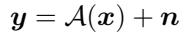
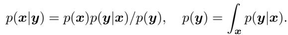
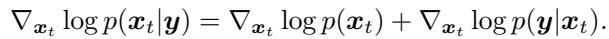

[← 返回 README](../README.md)

# 1. Introduction

## 📌 预览

Introduction 把整篇的数学地基一次性铺好：逆问题的形式 $y=\mathcal{A}(x)+n$、贝叶斯后验 $p(x|y)\propto p(x)p(y|x)$、三种恢复目标（posterior sampling / MMSE / MAP），以及**全篇最关键的一式**——posterior score 分解 (Eq. 3)。理解这一节，等于拿到了后面所有算法的评分标准：谁在近似 $\nabla_{x_t}\log p(y|x_t)$，近似得多离谱。

---

We consider inverse problems in the following form

*Eq. (1): 前向模型 $y=\mathcal{A}(x)+n$。*

where $\mathcal { A } : \mathbb { R } ^ { n } \mapsto \mathbb { R } ^ { m } , m \lt n$ is the forward operator that maps the signal that we wish to recover, $x \in \mathbb { R } ^ { n }$ to the measurement $y \in \mathbb { R } ^ { m }$ , and the process is corrupted by noise $n \in \mathbb { R } ^ { m }$ . Due to the ill-posedness of the problem, infinitely many feasible solutions exist, and perfect recovery is impossible (Tarantola 2005). Among the feasible solutions, we aim to find a good set of solutions that also match the characteristics of the real-world data. Mathematically, this can be handily written down with Bayes rule

*Eq. (2): 贝叶斯公式 $p(x|y)=p(x)p(y|x)/p(y)$。*

> 💡 **问题设定：为什么必须引入 prior** (Hao 批注):
> - $m\lt n$ 意味着前向算子把 $n$ 维信号压到 $m$ 维观测，天然丢信息，逆映射有无穷多解（ill-posed）。**先验 $p(x)$ 就是从无穷多可行解里挑"像真实数据"的那一撮**。
> - 本文的立场：所有 DIS 都显式或隐式地用一个先验，而这里的先验由深度生成模型（扩散模型）定义。所以整篇的"先验"= 一个预训练好的 score 网络 $s_\theta$。
> - 对本课题：Eq. (2) 是非盲版本。盲设置要把它扩成 $p(x,\varphi|y)\propto p(x)p(\varphi)p(y|x,\varphi)$（见 Sec. 5.1, Eq. 65），先验从 $p(x)$ 变成 $p(x)p(\varphi)$——多出一个低维算子参数先验，这正是本课题的 $\varphi$。

One of the most widely studied and used cases is when the likelihood function is a Gaussian model, i.e. $p ( y | x ) = \mathcal { N } ( y ; \mathcal { A } ( x ) , \sigma _ { y } ^ { 2 } I )$ . It is easy to see that this corresponds to the case where $n = \sigma _ { y } \epsilon , \epsilon \sim \mathcal { N } ( 0 , I )$

Due to the nature of the problem, it is up to the user to define the type of recovery one wants. The following three are among the most widely opted goals:

1. Sampling from the posterior (i.e. posterior sampling): $x \sim p ( x | y )$

2. Finding a minimum mean-squared error (MMSE) estimate: $x = \mathbb { E } [ x | y ]$

3. Finding a maximum a posteriori (MAP) estimate: $x = \arg \max _ { x } p ( x | y )$

Blau & Michaeli (2018) shows that there is a trade-off between perception and distortion, and one cannot maximize perception and minimize distortion at the same time. Note that any of the above goals can be solved by specifying the posterior, which, in turn, can be naturally achieved by specifying the prior. All inverse problem solvers, either explicitly or implicitly, uses this prior function. In this work, we focus mostly on posterior sampling methods that leverage the generative prior (Bora et al. 2017), in the sense that the prior function is defined through a deep generative model that is trained from data sources.

> 💡 **三种目标的区别决定了"该拿什么指标评"** (Hao 批注):
> - **posterior sampling** 给你一个符合后验的样本（有随机性、多样性好，感知质量高）；**MMSE** 给你后验均值（$L_2$ 最优、但过度平滑）；**MAP** 给你后验众数（最"合理"的单点）。
> - Blau & Michaeli 的 perception–distortion 权衡是本文反复回扣的暗线：**PSNR/SSIM（distortion）和 FID/LPIPS（perception）不可兼得**。MMSE 类方法赢 PSNR，posterior sampling 类方法赢 FID。读后面每个算法都要问：它是在逼近后验采样，还是滑向 MAP/MMSE？（Sec. 3.2 的 DMAP 就明说 DPS 其实更像 MAP。）
> - 对本课题的校准检验：SBC/coverage 只对**真正的后验采样器**才有意义。一个偷偷收敛到 MAP 的采样器 coverage 一定偏窄——这条评判标准贯穿全篇。

In the modern generative AI era, modeling the prior data distribution through a generative model is becoming ever more powerful and prominent. Among them, diffusion models (Ho et al. 2020, Song, Sohl-Dickstein, Kingma, Kumar, Ermon & Poole 2021) have become the predominant paradigm in modeling the distribution of images and videos. While there are more recent variants of diffusion models such as flow matching (Lipman et al. 2023), rectified flow (Liu, Gong & qiang liu 2023), etc., we simply refer to them as diffusion models hereafter as the principles remain the same.

As directly modeling the distribution is hard due to the existence of the normalization constant, a clever bypass is to learn the gradient of the log density $\nabla _ { x } \log p ( x )$ , often called the score function (Hyvärinen & Dayan 2005). Diffusion models learn a family of blurred score functions $\nabla _ { x _ { t } } \log p ( x _ { t } )$ in various noise levels $t \in [ 0 , T ]$ , with $t = 0$ corresponding to the original data distribution, and $t = T$ resulting in the reference Gaussian distribution. Once the diffusion model is trained along this forward diffusion trajectory, one can sample from the learned distribution by running a reverse diffusion trajectory, which can be characterized by a stochastic differential equation (SDE), or equivalently, an ordinary differential equation (ODE), in the continuous time limit (Song, Sohl-Dickstein, Kingma, Kumar, Ermon & Poole 2021).

As the reverse diffusion process involves the score function of the prior, we are able to sample from the posterior if we use the score function of the posterior

*Eq. (3): posterior score = prior score + likelihood score，$\nabla_{x_t}\log p(x_t|y)=\nabla_{x_t}\log p(x_t)+\nabla_{x_t}\log p(y|x_t)$。*

> 💡 **公式批读：Eq. (3) 是全篇的"考纲"** (Hao 批注):
> - 这是整章的枢纽。reverse SDE（下一节 Eq. 5）本来只需要 prior score $\nabla_{x_t}\log p(x_t)$——那是扩散模型直接学到的 $s_\theta$。要采后验，只需把它换成 posterior score，而后者恰好等于 **prior score 加一个 likelihood 修正项** $\nabla_{x_t}\log p(y|x_t)$。
> - **关键难点**：$p(y|x_t)$ 不是 $p(y|x_0)$。观测 $y$ 是由干净图 $x_0$ 生成的，而 $x_t$ 是加噪版本，所以 $p(y|x_t)=\int p(y|x_0)p(x_0|x_t)dx_0$（见 Sec. 3.2, Eq. 31）需要对整条去噪后验积分——**intractable**。
> - **这就是"数据一致性修正 ≠ 严格后验 score"的根源**：几乎所有算法（DPS、ΠGDM、DDRM…）都在给 $\nabla_{x_t}\log p(y|x_t)$ 找一个廉价代理，而每个代理都引入偏差。读全篇时，把每个方法翻译成"它对 Eq. (3) 右边第二项做了什么近似"，就能一眼看出它牺牲了什么。
> - 盲设置更狠：Eq. (3) 要变成对 $x_t$ 和 $\varphi_t$ 两条 score 的联合分解（Sec. 5.1, Eq. 68–69），likelihood 项 $p(y|x_t,\varphi_t)$ 同时对两个随机变量 intractable。

While this may sound straightforward, $p ( y | x _ { t } )$ is in fact, intractable, and hence requires some form of approximation, or other ways to bypass the computation. In this chapter, we review some of the most widely used Diffusion model based Inverse problem Solvers (DIS) by comparing the categorizing the methods into the ones that make explicit approximations to this term, and other approaches. We note that Daras, Chung, Lai, Mitsufuji, Ye, Milanfar, Dimakis & Delbracio (2024) provides a comprehensive review and taxonomy of existing DIS, and we reuse parts of their layout for ease of comparison. However, our chapter diverges by identifying new classes, pushing the timeline to mid-2025, and covering other extensions (e.g. high-dimensional data).

This chapter is structured as follows: In Sec. 2, we review the fundamentals of diffusion models in both the score-perspective and the variational perspective. In Sec. 3, we study the explicit approximation methods, with a focus on diffusion posterior sampling (Chung, Kim, Mccann, Klasky & Ye 2023). In Sec. 4, we review a taxonomy of DIS that does not belong to the explicit category, but offers other principled approaches. In Sec. 5, we extend the solvers to more challenging situations, e.g. blind inverse problems. In Sec. 6, we review approaches that leverage texts as additional source of control knob to deduce solutions. Finally, in Sec. 7, we conclude by discussing the current status and future perspectives of DIS.

> 💡 **1 小结** (Hao 批注):
> - **关键变量**: 前向算子 $\mathcal{A}$、观测噪声 $\sigma_y$、prior score $\nabla_{x_t}\log p(x_t)$（= $s_\theta$）、likelihood score $\nabla_{x_t}\log p(y|x_t)$（intractable，全篇焦点）。
> - **核心洞察**: 后验采样 = reverse diffusion 中把 prior score 替换为 posterior score；唯一难点是 likelihood 项。全篇的分类学 = "如何处理这一项"的分类学。
> - **可追问点**: 本文承认自己 layout 沿用 Daras et al. 2024 的综述，但声称新增了类别、把时间线推到 2025、加了高维扩展。读的时候可对照那篇看差异（本文更强调 decoupled data consistency 和 data scarcity）。
