[← 返回 README](../README.md)

# 2. Background: Diffusion Models

## 📌 预览

这一节是"扩散模型速成"，用两条平行叙事讲同一个模型：**score perspective**（连续 SDE/ODE，Song et al.）和 **variational perspective**（DDPM，Ho et al.）。对逆问题读者，真正要抓住三样东西：(1) reverse SDE 里出现 prior score（Eq. 5）；(2) **Tweedie 公式**（Eq. 9）把 score 网络的输出直接翻译成 posterior mean $\hat x_{0|t}=\mathbb{E}[x_0|x_t]$——这是后面 DPS 全家近似的入口；(3) DDIM（Eq. 23）提供确定性/可调随机性的采样，几乎所有 DIS 都在它上面加数据一致性步。

---

## 2.1 Score perspective

Consider the continuous diffusion process $x _ { t } , t \in [ 0 , T ]$ with $x _ { t } \in \mathbb { R } ^ { d }$ (Song, Sohl-Dickstein, Kingma, Kumar, Ermon & Poole 2021). We initialize the process with $x _ { 0 } \sim p _ { 0 } ( x )$ , where $p _ { 0 } = p _ { \mathrm { d a t a } }$ represents our initial data distribution, and let $x _ { T } \sim p _ { T }$ , with $p _ { T }$ being a reference distribution from which we can draw samples. The forward noising process spanning from $t = 0 \to T$ is characterized by the following Itô stochastic differential equation:

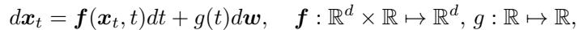

*Eq. (4): 前向加噪 SDE，$dx_t=f(x_t,t)dt+g(t)dw$。*

where f denotes the drift function associated with $x _ { t }$ , and $g$ signifies the diffusion coefficient linked with the standard d-dimensional Brownian motion $w \in \mathbb { R } ^ { d }$ . Through the judicious selection of $f$ and $g$ , one can asymptotically converge towards the Gaussian distribution as $t \to T$ . When the drift function $f$ is defined as an affine function of $x$ , specifically $f ( x , t ) = f ( t ) x$ , it follows that the perturbation kernel $p ( x _ { t } | x _ { 0 } )$ consistently exhibits Gaussian characteristics, with its parameters being derivable in closed-form. Consequently, the process of perturbing the data utilizing the perturbation kernel $p ( x _ { t } | x _ { 0 } )$ can be accomplished without the necessity of executing the forward SDE.

For the specified forward SDE in (4), it can be demonstrated that a corresponding reverse-time SDE exists, which operates in a backward manner (Song, Sohl-Dickstein, Kingma, Kumar, Ermon & Poole 2021, Huang et al. 2021, Anderson 1982):

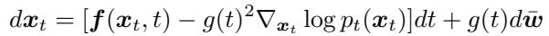

*Eq. (5): reverse-time SDE，漂移项里含 prior score $\nabla_{x_t}\log p_t(x_t)$。*

where dt represents the infinitesimal negative time increment, and w¯ is the standard Brownian motion progressing in reverse. Executing the reverse diffusion as delineated in (5) by initializing with a random Gaussian noise would facilitate sampling from $p _ { 0 } ( x )$ . It is evident that access to the time-conditional score function $\nabla _ { x _ { t } } \log p _ { t } ( x _ { t } )$ is requisite, which corresponds to the score function of the smoothed data distribution that has been convolved with a Gaussian kernel.

> 💡 **机制拆解：reverse SDE 为什么是 DIS 的战场** (Hao 批注):
> - Eq. (5) 是采样的引擎：从 $x_T\sim\mathcal{N}(0,I)$ 出发，沿反向时间积分，唯一需要的外部信息就是 **prior score** $\nabla_{x_t}\log p_t(x_t)$，由训练好的 $s_\theta$ 提供。
> - 回扣 Eq. (3)：想采后验，就把这里的 prior score 换成 posterior score，即额外加 $g(t)^2\nabla_{x_t}\log p(y|x_t)$。**所有 explicit approximation 方法（Sec. 3）本质上就是在 Eq. (5) 的漂移项里塞一个近似的 likelihood 梯度。** 这个"塞进去的项"就是"数据一致性修正"，而它不等于真正的 $\nabla_{x_t}\log p(y|x_t)$。

An intriguing observation is that there exists a corresponding deterministic ordinary differential equation (ODE) associated with (5), which is expressed as

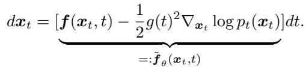

*Eq. (6): probability-flow ODE (PF-ODE)。*

The ODE represented in (6) is referred to as the probability-flow ODE (PF-ODE). While both (5) and (6) yield the same law $p _ { t } ( x _ { t } )$ , PF-ODE possesses several notable properties. Firstly, diffusion models may be reconceptualized as a variant of continuous normalizing flows (CNF) (Chen et al. 2018) by interpreting the network as $\tilde { f } _ { \theta }$ , thereby facilitating tractable likelihood computations. Secondly, ODE solvers generally exhibit superior behavior in comparison to SDE solvers. Utilizing the PF-ODE instead of the reverse SDE results in expedited sampling.

It is feasible to train a neural network to approximate the true score function through score matching (Hyvärinen & Dayan 2005), thereby estimating $s _ { \theta } ( x _ { t } , t ) \approx \nabla _ { x _ { t } } \log { p _ { t } ( x _ { t } ) }$ , which can subsequently be incorporated into (5). Nonetheless, it is acknowledged that the application of either explicit or implicit score matching poses significant challenges in terms of scalability, primarily due to inherent instabilities and substantial computational demands. To address these technical obstacles, denoising score matching (DSM) is employed:

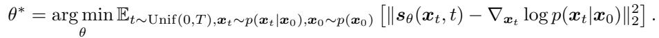

*Eq. (7): 去噪 score matching (DSM) 目标。*

It is pertinent to acknowledge that DSM is fundamentally equivalent to the training of a denoising autoencoder (DAE) across various noise levels (Vincent 2011), which are dictated by an auxiliary input t. Specifically, let us examine the most basic forward perturbation kernel defined as $p ( x _ { t } | x _ { 0 } ) = \mathcal { N } ( x _ { t } ; x _ { 0 } , t ^ { 2 } I )$ . By establishing a denoiser parametrization $D _ { \theta } ( x _ { t } , t ) \triangleq - s _ { \theta } ( x _ { t } , t ) / t ^ { 2 }$ , it becomes evident that (7) can be reformulated as:

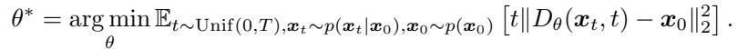

*Eq. (8): DSM 等价于跨噪声级的 denoiser 回归目标。*

The correspondence between (7) and (8) is also fundamentally linked to Tweedie’s theorem (Efron 2011).

Theorem 1 (Tweedie’s theorem). In the context of a Gaussian perturbation kernel represented as $p ( x _ { t } | x _ { 0 } ) = \mathcal { N } ( x _ { t } ; s _ { t } x _ { 0 } , \sigma _ { t } ^ { 2 } I )$ , the posterior mean is articulated mathematically as:

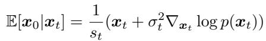

*Eq. (9): Tweedie 公式，$\mathbb{E}[x_0|x_t]=\frac{1}{s_t}(x_t+\sigma_t^2\nabla_{x_t}\log p(x_t))$。*

> 💡 **公式批读：Eq. (9) Tweedie 是 DPS 全家的命门** (Hao 批注):
> - Tweedie 说：score 网络的输出可以一步换算成 **posterior mean** $\hat x_{0|t}=\mathbb{E}[x_0|x_t]$，只需一次前向。直观理解——给你一张噪声图 $x_t$，网络能立刻给出"它最可能的干净版本的平均"。
> - **为什么这是命门**：Sec. 3.2 的 DPS 把 intractable 的 $p(y|x_t)$ 近似成 $p(y|\hat x_{0|t})$——即把"对整条去噪后验的期望"塌缩成"在后验均值这一点上算 likelihood"。Tweedie 提供的 $\hat x_{0|t}$ 就是这个塌缩点。这一步（Jensen 近似）是全篇误差的主要来源之一：**用一个点估计代替一个分布，丢掉了 posterior 的方差信息**。ΠGDM、moment matching（Sec. 3.2）就是在给这个点补上方差。

In essence, the parametrization delineated in (8) serves as a direct means of estimating the posterior mean $\mathbb { E } [ x _ { 0 } | x _ { t } ]$ Irrespective of the chosen parametrization, and due to the implications of Theorem 1, diffusion models can be conceptualized as possessing two complementary representations: the noisy variable $x _ { t }$ , which evolves according to the reverse SDE outlined in (5), and the posterior mean $\mathbb { E } [ x _ { 0 } | x _ { t } ]$ , which is implicitly characterized by Tweedie’s theorem and may be interpreted as the terminal point of the trajectory when adopting a tangent direction relative to the current step.

By choosing $s _ { t } = 1 , \sigma _ { t } = t$ , the PF-ODE reads

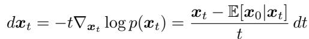

*Eq. (10): VE 设定下的 PF-ODE，把漂移写成 $(x_t-\hat x_{0|t})/t$。*

## 2.2 Variational perspective

Parallel to the evolution of the score-based framework concerning diffusion models, a variational framework was concurrently established (Sohl-Dickstein et al. 2015, Ho et al. 2020), which now forges a connection between diffusion models and Variational Autoencoders (VAEs) (Kingma & Welling 2013). More specifically, within this framework, diffusion models are conceptualized as a hierarchical latent variable model referred to as denoising diffusion probabilistic models (DDPM)

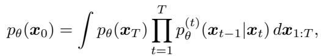

*Eq. (11): DDPM 作为分层隐变量模型的边缘似然。*

where $x _ { \{ 1 , . . . , T \} } \in \mathbb { R } ^ { d }$ . The neural network that characterizes $p _ { \theta }$ is subsequently optimized by minimizing the evidence lower bound (ELBO)

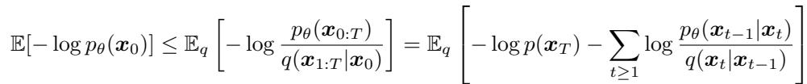

*Eq. (12): ELBO 目标。*

where the inference distribution $q$ is delineated by the Markovian forward conditional densities

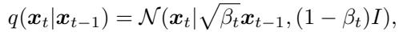

*Eq. (13): 单步前向条件分布。*

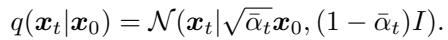

*Eq. (14): 从 $x_0$ 直接到 $x_t$ 的闭式扰动核，$q(x_t|x_0)=\mathcal{N}(\sqrt{\bar\alpha_t}x_0,(1-\bar\alpha_t)I)$。*

In this context, the noise schedule $\beta _ { t }$ is characterized as an increasing sequence indexed by t, with $\bar { \alpha } _ { t } : = \prod _ { i = 1 } ^ { t } \alpha _ { t } , \alpha _ { t } : = 1 - \beta _ { t }$ . The selection of the noise schedule is made such that the signal coefficient $\sqrt { \bar { \alpha } _ { t } }$ approaches 0 as $t \to T$ , thereby ensuring that the noise coefficient $1 - \bar { \alpha } _ { t }$ approaches 1, thereby converging towards the standard normal distribution. In contrast to the VE diffusion choice elaborated in Sec. 2.1, the selection employed here is denoted as variance preserving (VP). Notably, the discrete VP configuration in (13), when transitioned to its continuous analogue by increasing the number of discretization steps to $N \to \infty$ , engenders the following Stochastic Differential Equation (SDE)

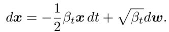

*Eq. (15): VP-SDE。*

The minimization of the ELBO objective in (12) fundamentally gives rise to the following optimization challenge

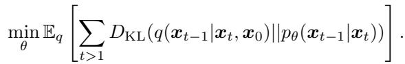

*Eq. (16): ELBO 归约成逐步 KL 匹配。*

The KL minimization task delineated in (16) is computationally feasible as both distributions are Gaussian. For the initial term, this derives from the application of Bayes’ rule alongside the Markov property

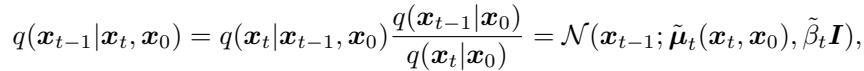

*Eq. (17): 前向后验 $q(x_{t-1}|x_t,x_0)$ 为高斯。*

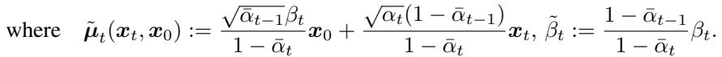

*Eq. (18): Eq. (17) 高斯的均值 $\tilde\mu_t$ 与方差 $\tilde\beta_t$ 闭式。*

For the subsequent term, the reverse distribution is Gaussian as we account for minimal perturbations pertinent to a singular step of forward diffusion (Ho et al. 2020). A common parametrization is established as follows

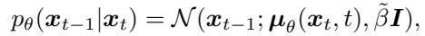

*Eq. (19): 反向条件分布参数化 $p_\theta(x_{t-1}|x_t)$。*

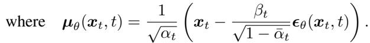

*Eq. (20): 反向均值 $\mu_\theta$ 用 $\epsilon_\theta$ 表示。*

Under this formulation, the ELBO objective in (12) can be streamlined to the epsilon-matching objective by disregarding the time-dependent weighting factors

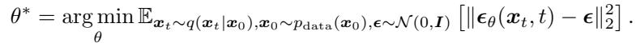

*Eq. (21): epsilon-matching 训练目标。*

Epsilon matching is fundamentally analogous to the DSM/DAE objective in (7), (8), differing solely by a constant with an alternative parametrization. Given the correspondence between the forward noising distribution in (15) and the learning objective in (7),(21), it becomes evident that the two frameworks essentially converge upon the same model.

> 💡 **两条叙事收敛到同一个网络** (Hao 批注):
> - score perspective 训 $s_\theta$（学 score），variational perspective 训 $\epsilon_\theta$（学噪声），二者只差常数换参：$s_\theta\propto-\epsilon_\theta/\sqrt{1-\bar\alpha_t}$。**读 DIS 论文时，看到 score / $\epsilon$ / denoiser $D_\theta$ / Tweedie $\hat x_{0|t}$ 四种写法，要知道它们是同一个网络的不同外衣。** 这也是为什么 DDRM（VP + $\epsilon$）和 DPS（VE + score）能被本文放进同一张地图。
> - VP vs VE 只是 noise schedule 的选择（保方差 vs 爆方差），不改变"reverse 过程需要 score"这个本质。

Inference can be executed by incorporating the trained $\epsilon _ { \theta }$ to approximate the expectation of $p _ { \theta } ( x _ { t - 1 } | x _ { t } )$ , culminating in the subsequent iterative expression

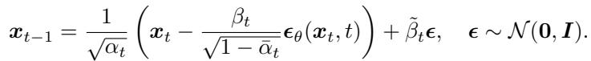

*Eq. (22): DDPM 祖传采样迭代式。*

It is noteworthy that analogous to the reverse stochastic differential equation (SDE) delineated in (5), stochastic perturbations are incorporated in each iteration throughout the DDPM sampling process, resulting in a protracted inference duration. A conventional methodology to mitigate this phenomenon, akin to the transition towards the PF-ODE, is facilitated by denoising diffusion implicit models (DDIM) (Song, Sohl-Dickstein, Kingma, Kumar, Ermon & Poole 2021), wherein an alternative inference distribution is proposed

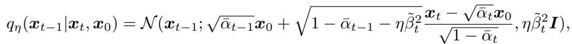

*Eq. (23): DDIM 的推断分布，$\eta$ 控制随机性。*

where $\eta \in [ 0 , 1 ]$ . By establishing $\eta = 1 . 0 ,$ the original DDPM sampling procedure is reinstated with maximal stochasticity. Conversely, by designating $\eta = 0 . 0$ , a deterministic sampling mechanism is achieved, which can be demonstrated to be equivalent to the variance preserving PF-ODE (Song, Sohl-Dickstein, Kingma, Kumar, Ermon & Poole 2021). Employing diminished values of η tends to yield superior outcomes when the objective is to minimize the number of function evaluations (NFE).

> 💡 **2 小结** (Hao 批注):
> - **关键变量**: prior score $s_\theta$ / 噪声预测 $\epsilon_\theta$ / denoiser $D_\theta$ / Tweedie 均值 $\hat x_{0|t}$（四位一体）；VP 的 $\bar\alpha_t$ 调度；DDIM 混合系数 $\eta$。
> - **核心洞察**: 逆问题读者只需三件工具——(i) reverse SDE/ODE 需要 score（后验采样的接入口，Eq. 5）；(ii) Tweedie 一步给出 $\hat x_{0|t}$（Jensen 近似的落脚点，Eq. 9）；(iii) DDIM 给出可插入数据一致性步的确定性骨架（Eq. 23）。后面每个算法都是"DDIM/PF-ODE 反向步 + 某种 likelihood 修正"的组合。
> - **可追问点**: $\eta$ 小加速但可能损多样性——对本课题的 coverage 检验，采样器的 $\eta$ 选择会直接影响后验方差宽窄，是校准分析必须记录的超参。
