[← 返回 README](../README.md)

# 3. Explicit approximation methods

## 📌 预览

本节是全篇也是本课题最该精读的一节：**显式近似 $p(y|x_t)$**。所有方法都在给 Eq. (3) 的 likelihood 项找一个可计算的代理，区别只在"代理有多粗、假设有多强"：

- **DDRM 家族**（SNIPS/DDRM）：假设线性算子并做 SVD，在奇异值域给出**闭式**的 likelihood 修正——精确但只限线性+可 SVD。
- **DPS 家族**（DPS/ΠGDM/moment matching/DDS）：用 **Jensen 近似** $p(y|x_t)\approx p(y|\hat x_{0|t})$，把对后验的积分塌缩到 Tweedie 均值一点——**通用（含非线性）但有偏**。

这条"闭式精确 vs 通用有偏"的分岔，就是"数据一致性修正 ≠ 严格后验 score"的第一现场。

---

Many of the earlier works that aimed to solve inverse problems with diffusion models, whether explicitly mentioned in the original work or not, can be perceived as explicit approximation methods for the time-dependent log-likelihood $p ( y | x _ { t } )$ in (3). In this section, we review some of the canonical works that belong to this category, with a specific focus on the DPS (Chung, Kim, Mccann, Klasky & Ye 2023) family.

The first works that used diffusion model-like annealing-denoising steps with projection-like data consistency steps were Song & Ermon (2019), Kadkhodaie & Simoncelli (2021). While the details differ, one can understand the algorithms as alternating the denoising step and the data consistency projection step, gradually decreasing the noise level, starting from pure Gaussian noise. Note that the earlier works mostly focused on linear inverse problems, where $A = A$

> 💡 **"denoise + data-consistency 交替"是所有 DIS 的共同骨架** (Hao 批注): 最早的 Song&Ermon / Kadkhodaie 就确立了这个双步循环——先去噪一小步（往先验流形拉），再做一次数据一致性投影（往观测约束拉）。后面所有 explicit 方法都是这个循环的变体，只是"数据一致性步"用什么形式（投影 / 梯度 / 闭式）。**这个交替本身不保证收敛到后验**：DAPS（Sec. 4.2）就指出它在困难任务（相位恢复）会发散，因为两步各自在拉，不是在采一个联合后验。

Score-ALD (Jalal et al. 2021) In this work, the authors focused on the task of compressed-sensing MRI, where the following approximation was used

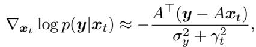

*Eq. (24): Score-ALD 的 likelihood 近似，用 $\gamma_t$ 退火的投影残差。*

where $\gamma _ { t }$ was set to be a hyperparameter that decays as t approaches 0.

Score-SDE (Song, Sohl-Dickstein, Kingma, Kumar, Ermon & Poole 2021) Score-SDE focused on linear inverse problems with an orthogonal matrix A

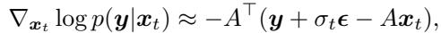

*Eq. (25): Score-SDE 的近似，对应到 $y+\sigma_t\epsilon=Ax_t$ 的带噪投影。*

which corresponds to a noisy projection onto $y + \sigma _ { t } \epsilon = A x _ { t }$

> 💡 **早期近似的共同弱点：把 $p(y|x_t)$ 当成 $p(y|x_t)$ 的高斯投影** (Hao 批注): Score-ALD/Score-SDE 直接在**噪声变量 $x_t$** 上算残差 $y-Ax_t$，等于假设 $x_t$ 本身就该满足观测——但 $x_t$ 是加了噪声的，$y$ 是干净图产生的，二者尺度不匹配，只能靠 $\gamma_t/\sigma_t$ 手工退火来救。DPS 家族的进步就是先用 Tweedie 把 $x_t$ 还原成 $\hat x_{0|t}$ 再比对 $y$，物理上更自洽。

## 3.1 DDRM family

The methods that belong to this category explicitly uses singular value decomposition (SVD) $A = U \Sigma V ^ { \top }$ , $U \in \mathbb { R } ^ { m \times m }$, $V \in \mathbb { R } ^ { n \times n } , \Sigma \in \mathbb { R } ^ { m \times n }$ , with Σ being a rectangular diagonal matrix with singular values $\{ s _ { j } \} _ { j = 1 } ^ { m }$ as the diagonal elements. Notice that one can then rewrite the linear inverse problem as

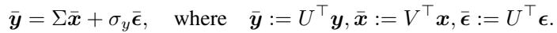

*Eq. (26): SVD 谱域改写，$\bar y=\Sigma\bar x+\sigma_y\bar\epsilon$。*

Once x¯ is recovered from (26), $\hat { x } = V \bar { x }$

SNIPS (Kawar et al. 2021) The approximation reads

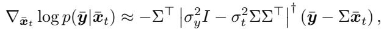

*Eq. (27): SNIPS 在谱域的 likelihood 近似。*

where the gradient points to a direction weighted by the magnitude of the difference between the diffusion noise level $\sigma _ { t } ^ { 2 }$ and the measurement noise $\sigma _ { y } ^ { 2 }$ , additionally weighted by the singular values $s _ { i } ^ { 2 }$

DDRM (Kawar et al. 2022) DDRM is an extension of SNIPS which incorporates DDIM sampling, an additional mixing hyperparameter η, and using the posterior mean $\bar { x } _ { 0 | t } : = V \mathbb { E } [ x _ { 0 } | x _ { t } ]$

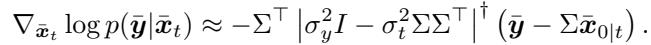

*Eq. (28): DDRM 谱域 likelihood 近似（用 posterior mean $\bar x_{0|t}$）。*

Notice that an element-wise expression of (30) can be written as

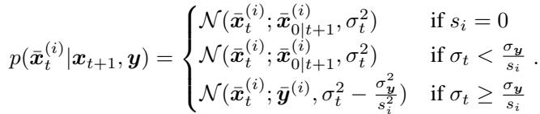

*Eq. (29): DDRM 逐奇异值分量的反向分布（按 $s_i$ 与 $\sigma_t,\sigma_y$ 关系分三档）。*

Analagous to the role of mixing coefficient η in DDIM sampling, DDRM introduces a hyper-parameter $\eta \in ( 0 , 1 ]$ to get

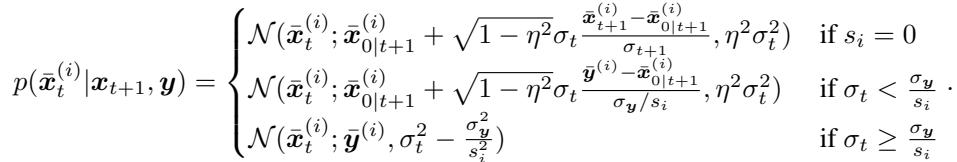

*Eq. (30): 引入 $\eta$ 混合后的 DDRM 逐分量反向分布。*

> 💡 **机制拆解：DDRM 为什么"精确"却"不通用"** (Hao 批注):
> - DDRM 在 SVD 谱域把逆问题解耦成 $m$ 个**独立标量**问题（Eq. 26），每个奇异值分量单独处理。Eq. (29)/(30) 的三档逻辑很直白：奇异值为 0（信息全丢）→ 纯用先验去噪；$\sigma_t\lt \sigma_y/s_i$（扩散噪声比观测噪声小）→ 用去噪估计；$\sigma_t\ge\sigma_y/s_i$（观测更可信）→ 直接用观测 $\bar y^{(i)}$。这是**在谱域对 likelihood 的闭式、无近似的处理**。
> - **代价 = 硬假设**：必须 (i) 线性算子 $A$，(ii) $A$ 可做 SVD（inpainting/SR/deblur 的结构化算子才行）。**一旦算子非线性或未知（盲），SVD 就不存在，DDRM 直接失效。** 这正是盲设置里 GibbsDDRM（Sec. 5.1）要额外用 Gibbs 采样去估 $\varphi$ 的原因——它把 $A_\varphi$ 的 SVD 变成 $\varphi$ 的函数，再交替更新。
> - 对本课题：DDRM 是"已知算子 + 线性"这一端的精确基准；本课题的参数化盲问题恰在另一端，算子未知且可能非线性，无法享受这种闭式精确性。

## 3.2 DPS family

DPS (Chung, Kim, Mccann, Klasky & Ye 2023) Notice that

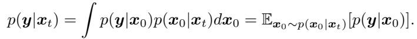

*Eq. (31): $p(y|x_t)=\mathbb{E}_{x_0\sim p(x_0|x_t)}[p(y|x_0)]$，likelihood 是对去噪后验的期望。*

The computation of $p ( x _ { 0 } | x _ { t } )$ is challenging, as we would have to marginalize over all the latent steps t through 0, not to mention the integration over the trajectories. It would be computationally intractable to compute this value every time we need access to the time-conditional likelihood. The idea of DPS is to push the expectation inside

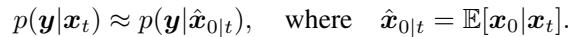

*Eq. (32): DPS 的核心近似 $p(y|x_t)\approx p(y|\hat x_{0|t})$（Jensen 近似）。*

This approximation is often referred to as Jensen’s approximation, whose approximation bound has been shown to be controllable in the context of Gaussian measurement scenarios (Chung, Kim, Mccann, Klasky & Ye 2023). Recall from Theorem 1 that one can easily compute the MMSE estimate $\hat { x } _ { 0 \mid t }$ through a single forward pass through the score function. From the definition of the forward model, it is then easy to see that

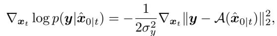

*Eq. (33): DPS 的 likelihood 梯度 $-\frac{1}{2\sigma_y^2}\nabla_{x_t}\|y-\mathcal{A}(\hat x_{0|t})\|^2$。*

where in practice, an empirical static step $\rho$ size is often employed in the place of $1 / 2 \sigma _ { y } ^ { 2 }$ The computation of the gradient can be done through backpropagation, as it involves a backward pass through the score function. It is important to note that DPS is fully general in that it is capable of solving non-linear inverse problems with arbitrary forward models if it can be defined.

> 💡 **公式批读：DPS 的 Jensen 近似——本课题主线的靶心** (Hao 批注):
> - Eq. (31) 是精确的：$p(y|x_t)$ 等于在去噪后验 $p(x_0|x_t)$ 上对 $p(y|x_0)$ 取期望。DPS 的一步（Eq. 32）是把期望"推进函数里"：$\mathbb{E}[p(y|x_0)]\approx p(y|\mathbb{E}[x_0])=p(y|\hat x_{0|t})$。**这在 $p(y|\cdot)$ 非线性时是有偏的（Jensen 不等式）**，偏差随 $t$ 增大（早期 $\hat x_{0|t}$ 很糊、后验方差很大）而变大。
> - Eq. (33) 就是落地的"数据一致性修正"：反向每步在 $x_t$ 上加一个 $-\rho\nabla_{x_t}\|y-\mathcal{A}(\hat x_{0|t})\|^2$ 的梯度。注意实践里把理论系数 $1/2\sigma_y^2$ 换成手调 $\rho$——**这已经偏离了严格后验 score**：步长不再对应真实噪声尺度，DPS 因此更像加权 MAP 而非无偏采样（Sec. 3.2 的 DMAP 明确指出这点）。
> - **为什么这是本课题的靶心**：DPS 的通用性（能处理任意可微前向、含非线性、含盲）让它成为盲问题的默认基座（BlindDPS、Fast Diffusion EM 都建在它上），但它继承的偏差也一起被搬进盲设置。本课题要做的 gauge-aware 联合后验采样与 SBC/coverage 校准，本质就是检测并修正这种"点估计代替分布、手调步长破坏噪声尺度"带来的后验失真。

ΠGDM (Song, Vahdat, Mardani & Kautz 2023) From (32), DPS can be interpreted as using the following approximation

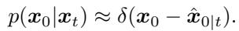

*Eq. (34): DPS 隐含地把 $p(x_0|x_t)$ 近似成 Dirac $\delta(x_0-\hat x_{0|t})$。*

ΠGDM instead places an isotropic Gaussian distribution for approximation

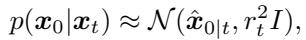

*Eq. (35): ΠGDM 用各向同性高斯 $\mathcal{N}(\hat x_{0|t},r_t^2 I)$ 近似去噪后验。*

where $r _ { t }$ is a hyperparameter. For the case of linear inverse problems, this leads to

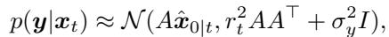

*Eq. (36): 线性情形下 $p(y|x_t)\approx\mathcal{N}(A\hat x_{0|t}, r_t^2 AA^\top+\sigma_y^2 I)$。*

and subsequently

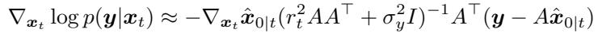

*Eq. (37): ΠGDM 的 likelihood 梯度（含 $(r_t^2 AA^\top+\sigma_y^2 I)^{-1}$）。*

> 💡 **ΠGDM = 给 DPS 的点估计补上方差** (Hao 批注): DPS 把去噪后验当成一个点（Dirac，Eq. 34），ΠGDM 把它当成一个各向同性高斯（Eq. 35），于是 likelihood 变成协方差 $r_t^2 AA^\top+\sigma_y^2 I$ 的高斯（Eq. 36）。**多出来的 $r_t^2 AA^\top$ 项就是"去噪不确定性"的一阶补偿**——它让不同方向按算子灵敏度重新加权，比 DPS 的各向同性步长更接近真实 posterior score。代价是要算 $(\cdots)^{-1}$ 和 $\nabla_{x_t}\hat x_{0|t}$（Jacobian）。这是"把数据一致性修正往严格 score 拉近一步"的典型例子，但 $r_t$ 仍是手调、且仍假设高斯，离严格还有距离。

Moment Matching (Rozet et al. 2024) In moment matching, the authors explicitly calculate the variance matrix for $p ( x _ { 0 } | x _ { t } )$ , leading to a better approximation

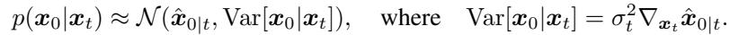

*Eq. (38): moment matching 用真实条件方差 $\mathrm{Var}[x_0|x_t]=\sigma_t^2\nabla_{x_t}\hat x_{0|t}$。*

In turn, this leads to

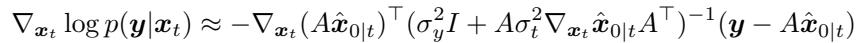

*Eq. (39): moment matching 的 likelihood 梯度。*

Note that in high-dimensions, explicit computation of $\nabla _ { x _ { t } } \hat { x } _ { 0 | t }$ is expensive. Nevertheless, Jacobian-vector products (JVP) can be used for efficient computation for both ΠGDM and moment matching.

> 💡 **近似精度阶梯：Dirac → 各向同性高斯 → 全协方差高斯** (Hao 批注): DPS(Eq.34) → ΠGDM(Eq.35，标量方差 $r_t$) → moment matching(Eq.38，用 Tweedie 的二阶矩 $\sigma_t^2\nabla_{x_t}\hat x_{0|t}$ 当真实协方差)。**这条阶梯就是"对去噪后验建模得越细，likelihood 修正越接近严格 posterior score"**。moment matching 用的方差是 Tweedie 二阶推论给出的、理论上正确的条件协方差，所以近似最好；但要算完整 Jacobian $\nabla_{x_t}\hat x_{0|t}$，高维昂贵（靠 JVP 缓解）。这段是本节最重要的洞察：**近似质量与计算量正相关，没有免费午餐**。

Peng et al. (2024) In a related work of Peng et al. (2024), the authors show that there exists an optimal posterior diagonal posterior covariance in by analyzing the diffusion model under the DDPM framework. The covariance matrix can be determined through maximum likelihood estimation, without relying on the computation of $\nabla _ { x _ { t } } \hat { x } _ { 0 \mid t }$ , and it was further shown that using this optimal covariance enhances the performance on robustness in all cases.

DDS (Chung, Lee & Ye 2024) One of the critical downsides of the other methods within the DPS family is that they are slow to compute, and requires excessive memory, since the computation of $\nabla _ { x _ { t } } \hat { x } _ { 0 \mid t }$ is involved. This may not be suitable for large-scale inverse problems, which the authors of Chung, Lee & Ye (2024) investigate. The key finding of DDS is that, under certain conditions on the data manifold, one can circumvent the heavy computation.

Proposition 1 (Manifold Constrained Gradient (Chung, Sim, Ryu & Ye 2022)). Suppose the clean data manifold M, where $x _ { 0 }$ resides, is represented as an affine subspace and assumes the uniform distribution on M. Then,

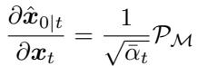

*Eq. (40): 流形为仿射子空间时，$\partial\hat x_{0|t}/\partial x_t=\frac{1}{\sqrt{\bar\alpha_t}}\mathcal{P}_\mathcal{M}$。*

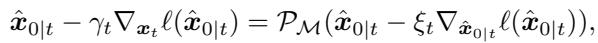

*Eq. (41): DPS 梯度可写成对干净流形的投影梯度（MCG）。*

for some $\xi _ { t } \gt 0$ , where $\mathcal { P } _ { \mathcal { M } }$ denotes the orthogonal projection to $\mathcal { M }$

This implies that the manifold constrained gradient (MCG) can be regarded as the projected gradient method on the clean data manifold. To accelerate the convergence of the algorithms, the authors in Chung, Lee & Ye (2024) proposed performing multiple manifold-constrained update steps following a single neural network function evaluation (NFE) for manifold projection. This approach can be efficiently implemented using the conjugate gradient (CG) method or other Krylov subspace methods, under the assumption that the clean data manifold lies within a Krylov subspace.

> 💡 **DDS：用流形假设换掉昂贵的 Jacobian 反传** (Hao 批注): DPS 家族慢在每步要对 score 网络反传算 $\nabla_{x_t}\hat x_{0|t}$。DDS 的招是——若干净数据流形近似仿射子空间，则 Jacobian 退化成一个投影 $\mathcal{P}_\mathcal{M}$（Eq. 40），于是 likelihood 步变成"在流形上做投影梯度"（Eq. 41），可以用 CG/Krylov 在**一次 NFE 后跑多步内层优化**，省掉反传。这是把"精确近似"换成"计算可行"的工程折中，代价是仿射流形假设（真实图像流形显然是弯的，只在局部成立）。

Other approaches that improve DPS MPGD (He et al. 2024) proposes to project the DPS gradient to the manifold by leveraging an autoencoder. DSG (Yang et al. 2024) imposes a spherical constraint to control the steps reside on the noisy manifold, as discussed in MCG (Chung, Sim, Ryu & Ye 2022). DMAP (Xu et al. 2025) argues that DPS behaves closer to an MAP estimate rather than a posterior sampler, and thus proposes to make the algorithm behave closer to an MAP approximation method by imposing multi-step gradients, thereby improving performance. DPPS (Wu et al. 2024) reduces variance by proposing multiple candidates at each step of denoising, and only selecting the ones that maximize the data consistency.

> 💡 **DMAP 的爆料：DPS 其实是 MAP 不是后验采样器** (Hao 批注): 这条对本课题极关键。DMAP（Xu et al. 2025）分析发现 **DPS 的行为更接近 MAP 估计而非无偏后验采样**——正因为 Eq. (33) 用点估计 + 手调步长，采样分布被收窄到后验众数附近。对我们的 SBC/coverage 检验，这意味着直接拿 DPS 当"后验采样器"会系统性 under-coverage（置信区间偏窄）。MPGD/DSG 修正的是"$\hat x_{0|t}$ 离流形太远"，DPPS 修正的是方差——它们都在补 DPS 偏差的不同侧面，但没一个真正回到严格 posterior score。

Extension to flow models Flow-based model (Lipman et al. 2023) provide a general framework that includes diffusion models as a special case. FlowChef (Patel et al. 2024) introduces a general guidance term, $\nabla _ { \hat { x } _ { 0 \mid t } } \ell \big ( \hat { x } _ { 0 \mid t } \big )$ , into the reverse ODE, accompanied by an analysis of error dynamics, and demonstrates it effectiveness across various conditioned image generation tasks including linear inverse problems. FlowDPS (Kim, Kim & Ye 2025) extends posterior sampling theory from diffusion models to general affine flows by decomposing a single Euler step into a linear combination of clean and noise estimates, leveraging a generalized Tweedie’s formula.

> 💡 **3 小结** (Hao 批注):
> - **两族分岔**: DDRM 家族（SVD 谱域闭式，线性+可分解算子，精确无近似）vs DPS 家族（Jensen 近似 $p(y|x_t)\approx p(y|\hat x_{0|t})$，通用含非线性/盲，有偏）。
> - **DPS 近似精度阶梯**: Dirac (DPS) → 各向同性高斯 (ΠGDM) → 全协方差 (moment matching) → 对角最优协方差 (Peng)。越细越接近严格 posterior score，代价是 Jacobian $\nabla_{x_t}\hat x_{0|t}$ 的计算量。DDS 反向操作——用仿射流形假设砍掉 Jacobian 换速度。
> - **核心洞察（对本课题）**: 没有一个显式方法给出严格的 $\nabla_{x_t}\log p(y|x_t)$；"数据一致性修正"始终是代理。DMAP 已证 DPS 偏 MAP，会导致后验 under-coverage。盲问题继承 DPS 基座（Sec. 5.1），偏差被搬进 $x$ 和 $\varphi$ 两条流——这正是 gauge-aware 校准要诊断的对象。
> - **可追问点**: 手调步长 $\rho$ 破坏了噪声尺度，能否用 ΠGDM/moment matching 的自适应协方差恢复正确尺度，从而改善 coverage？这是把本节洞察接到本课题校准目标的直接实验。
