[← 返回 README](../README.md)

# 4. Other methods

## 📌 预览

Sec. 3 的显式近似都在"单点 + 手调步长"上打转。本节收录三条不走这条路的原理化路线：

- **4.1 Variational inference (VI)**：不改采样步，而是直接优化一个变分分布 $q_\phi(x_0|y)$ 去逼近后验（RED-Diff / normalizing-flow / APS / RSLD / DAVI）——**能拿分布、多样性好**，但要么假设高斯（丢多峰），要么训练成本高。
- **4.2 Decoupled data consistency**：把"去噪"和"数据一致性"彻底解耦（DAPS / DCDP / SITCOM）——在困难任务（相位恢复）更稳。
- **4.3 Sequential Monte Carlo (SMC)**：用粒子滤波，**粒子数 →∞ 时逼近真后验**（SMCDiff / MCGDiff / FPS）——理论最干净，代价是粒子开销。

对本课题：VI 和 SMC 是唯二"有原则地逼近真后验分布"的路线，也是校准（coverage/CRPS）最该对照的基准。

---

## 4.1 Variational inference

Another line of work on solving inverse problems with diffusion models stems from variational inference for the posterior distribution $p ( x | y )$ . The main advantage of this approach lies in distributional matching, which offers better diversity compared to the DPS family that approximates the log-likelihood at a single sample point $x _ { t }$ with its MMSE estimate $\hat { x } _ { 0 \mid t }$ . Let $q _ { \phi } ( x _ { 0 } | y )$ be a variational distribution with parameters ϕ. The goal of variational inference is to fit q to the target posterior distribution $p$ by minimizing

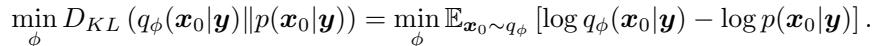

*Eq. (42): VI 目标 $\min_\phi D_{KL}(q_\phi(x_0|y)\|p(x_0|y))$。*

From the definition of KL divergence, and applying Bayes’ rule to $p ( x _ { 0 } | y )$ , the objective function is reformulated as

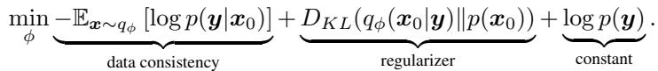

*Eq. (43): 分解为 数据一致性 + 先验正则 + 常数三项。*

> 💡 **VI 相对 DPS 的根本区别：拟合分布而非修正样本** (Hao 批注): DPS 在**单点 $x_t$** 上用 $\hat x_{0|t}$ 近似 log-likelihood，本质是"推一个样本往后验高处走"；VI 直接优化一整个分布 $q_\phi$ 去匹配后验（Eq. 42），天生给分布、多样性更好。Eq. (43) 把目标拆成漂亮的三项：数据一致性（拟合观测）+ KL 正则（贴近扩散先验）+ 常数。**对本课题的意义**：VI 是"目标就是整个后验"的路线，理论上比 DPS 更适合做 coverage 校准——但下面会看到它常被迫假设 $q_\phi$ 高斯（RED-Diff），又把多峰后验压成单峰，反而 over-confident。

RED-Diff (Mardani et al. 2023) Suppose that $q _ { \phi } ( x _ { 0 } | y )$ is the isotropic Gaussian distribution ${ \mathcal { N } } ( \mu , \sigma ^ { 2 } I )$ where $\phi = \{ \mu , \sigma \}$ . The objective function of (43) is equivalent to

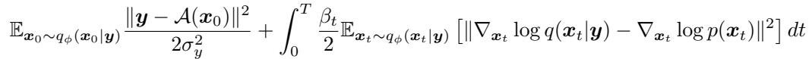

*Eq. (44): RED-Diff 目标（数据一致性 + 沿轨迹的 score 差积分）。*

where $x _ { t } \sim q _ { \phi } ( x _ { t } | y )$ denotes the diffusion trajectory computed by forward diffusion process in (14). The first term corresponds to data consistency derived from the definition of the forward model, and the second term denotes cumulative different of score functions along $x _ { t }$ which is derived from the relationship between KL divergence and score matching provided in Theorem 1 of (Song, Durkan, Murray & Ermon 2021). As $q _ { \phi } ( x _ { t } | y )$ is also Gaussian distribution, the optimization problem turns into a stochastic optimization:

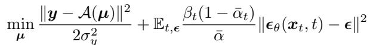

*Eq. (45): RED-Diff 的随机优化形式（第二项退化为 score-distillation loss）。*

where the variance of $q ( x _ { 0 } | y )$ is assumed to be a constant near zero so the optimization variable becomes $\mu$ . To improve efficiency and stability, back-propagation through the score network θ is omitted. Also, time t is sampled from T to 0 so the solution is reconstructed from coarse semantics to fine details which enhances perceptual quality. Notably, the second term reduces to the score-distillation loss. From a MAP perspective, the method implements regularization by denoising (Romano et al. 2017), where a pre-trained denoiser acts as the prior. Recently, FLAIR (Erbach et al. 2025) extended this framework to flow-based models by replacing the second term in (44) with a velocity difference and introducing a trajectory adjustment mechanism to ensure that the intermediate state $x _ { t }$ , where the score function is evaluated, lies in a high-likelihood region of the marginal distribution $p ( x _ { t } )$ . Specifically, they obtain $x _ { t }$ from $\mu$ using forward diffusion sampling that incorporates both deterministic noise, predicted via Tweeedie’s formula (Efron 2011, Kim & Ye 2021, Kim, Kim & Ye 2025), and stochastic noise.

> 💡 **RED-Diff 的隐藏代价：方差→0 就退化成 MAP** (Hao 批注): RED-Diff 假设 $q_\phi$ 是各向同性高斯，且**方差设为近零常数**，于是优化变量只剩均值 $\mu$（Eq. 45），第二项变成 score-distillation loss——作者自己都承认"从 MAP 视角看，这是 regularization-by-denoising"。**换句话说 RED-Diff 名义是 VI，实际是 MAP 优化**：拿不到后验方差，coverage 一定塌。这和 Sec. 3.2 的 DMAP 揭示的 DPS 偏 MAP 是同一个病根——单峰/单点近似丢掉后验宽度。

Feng et al. (2023) A uni-modal Gaussian variational family cannot capture a complex, multi-modal posterior distribution. Feng et al. (2023) employ a normalizing flow - RealNVP (Dinh et al. 2017) to represent the variational distribution $q _ { \phi }$ . The corresponding objective starts from the same problem,

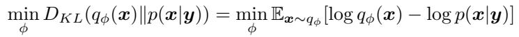

*Eq. (46): 用 normalizing flow 表示 $q_\phi$ 的 KL 目标。*

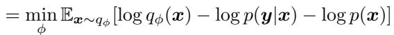

*Eq. (47): 展开为 $-\log p(y|x)-\log p(x)$ 项（likelihood 解析、prior 用扩散近似）。*

where $- \log p ( y | x )$ is computed analytically from the forward model, log p(x) is approximated with a pre-trained diffusion model $\theta$ , and log $q _ { \phi } ( x )$ is computationally tractable under RealNVP. Unlike methods that merely adjust individual samples toward higher posterior likelihood, this normalizing flow-based formulation allows direct sampling from the learned posterior. Consequently, it avoids hyper-parameter tuning (for example, step sizes for likelihood gradients) and produce diverse, robust samples. The trade-off is higher computational overhead for training and a dependence on the expressive power of the chosen normalizing-flow architecture.

This was later extended to Feng & Bouman (2024), where the computation of log $p ( x )$ by iterative sampling is replaced with a lower bound that involves the DSM loss, as proposed in Song, Durkan, Murray & Ermon (2021).

> 💡 **Normalizing-flow VI：真正能采多峰后验，但要为每个 $y$ 重训** (Hao 批注): 用 RealNVP 当 $q_\phi$（Eq. 46–47）解决了高斯 VI 的多峰缺陷，而且**免去 likelihood 梯度步长这个手调超参**（这正是 DPS 的 $\rho$ 之痛）、能直接从学到的后验采样。对本课题这是理想的校准基准：无手调步长、可采多峰、能算 $\log q_\phi$。硬伤是每个观测 $y$ 都要重新优化一个 flow（贵）——APS 就是来解决这个的。

APS (Mammadov et al. 2024) Notice that (46) requires optimizing $\phi$ for every different observations y, which is costly. Amortized Posterior Sampling (APS) proposes the following amortization

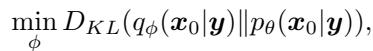

*Eq. (48): APS 的摊销目标，用条件 NF 对所有 $y$ 共享一个网络。*

which can be implemented as a conditional NF. Specifically, the authors proposed to extend RealNVP to a conditional setting, thereby enabling the use of a single network for all $y$ .

RSLD (Zilberstein et al. 2025) As another approach to estimate multi-modal posterior distribution, RSLD defines the particle-based variational inference and introduces a repulsive regularization to the score-matching term of (44). Specifically, it approximate the gradient for minimization problem (45) with ensemble of gradients:

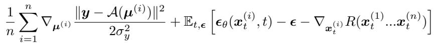

*Eq. (49): RSLD 的粒子集成梯度（含排斥正则 $R$）。*

where $x _ { t } ^ { ( i ) }$ is diffusion trajectory of i-th particle that is computed by forward diffusion process with $\mu ^ { ( i ) }$ and $\epsilon$ , n denotes the number of particles, and $R ( x _ { t } ^ { ( 1 ) } , . . . , x _ { t } ^ { ( n ) } )$ denotes the repulsive regularization defined as

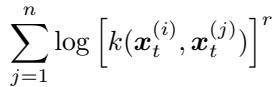

*Eq. (50): 排斥正则（核函数对数和）。*

This gradient is derived by incorporating ODE of each particles - transformed from variational distribution q to the posterior distribution $p$ via Wasserstein Gradient Flow - into the second term of (44). As a result, RSLD jointly update n particles using gradient in (49), yielding diverse samples that follows the posterior distribution.

> 💡 **RSLD 的排斥项：显式对抗 mode collapse** (Hao 批注): 高斯 VI 会塌到单峰，粒子法若无约束也会塌到同一峰。RSLD 在梯度里加一个**排斥正则 $R$**（Eq. 50，核函数对数和，越近惩罚越大），逼 $n$ 个粒子散开覆盖不同后验峰——这是 Stein 变分/Wasserstein 梯度流的思路。对本课题的 coverage 检验，这类显式促多样性的方法是"如何避免 under-coverage"的正面样本。

DAVI (Lee et al. 2024) While normalizing flow modesl can represent more complex variational distributions, they typically require multiple iterations to obtain a solution. DAVI addresses this limitation by training a neural network to estimate $q _ { \phi } ( x _ { 0 } | y )$ in (43), enabling one-step sampling. However, the authors also highlight a challenge, the lack of overlap between the supports of $q _ { \phi } ( x _ { 0 } | y )$ and $p ( x _ { 0 } )$ , which leads to unstable training and limited performance. As a result, DAVI reformulate the problem using integral form of the KL divergence in (44). Unlike RedDiff that assumes $q ( x _ { t } | y )$ as Gaussian distribution, DAVI compute $\nabla _ { x _ { t } }$ log $q _ { \phi } ( x _ { t } | y )$ by an implicit score function $s _ { \psi }$ . Thus, during trainig, DAVI alternates between updaing $q _ { \phi } ( x _ { 0 } | y )$ and $x _ { \phi }$ . Specifically, $q _ { \phi } ( x _ { 0 } | y )$ is updated by minimizing (44), using the approximation $\nabla _ { x _ { t } }$ log $q _ { \phi } ( x _ { t } | y ) \approx s _ { \psi }$ . In turn, $x _ { \psi }$ is trained via denoising score matching using samples from the marginal $q _ { t } ( x _ { t } | y )$ , obtained by first drawing $x _ { 0 } \sim q _ { \phi } ( x _ { 0 } | y )$ and then applying the forward diffusion process $x _ { t } \sim q ( x _ { t } | x _ { 0 } )$

## 4.2 Decoupled data consistency

DAPS (Zhang et al. 2025) In explicit approximation methods, the solvers typically alternate between a small step of denoising, and a likelihood gradient step. Often, this results in the resulting samples diverging, especially in challenging cases (e.g. Fourier phase retrieval). One way to mitigate this with more compute, is to leverage more compute. Specifically, rather than relying on the Tweedie estimate as in DPS, one can first run the PF-ODE to sample from $\tilde { x } _ { 0 | t } ^ { ( j ) } \sim p ( x _ { 0 } | x _ { t } )$ . Then, to impose data consistency, DAPS runs N-step Langevin dynamics

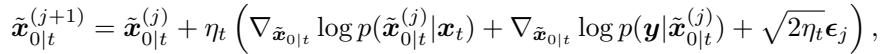

*Eq. (51): DAPS 在 $\tilde x_{0|t}$ 上跑 N 步 Langevin 施加数据一致性。*

where $\eta _ { t } \gt 0$ is a hyperparameter. This process is applied for all t, where the next iteration starts with $x _ { t - 1 } \sim p ( x _ { t - 1 } | x _ { 0 } )$ . Such approach decouples the data consistency with the unconditional sampling steps, i.e. $p ( x _ { 0 } | x _ { t } , y ) \propto p ( x _ { 0 } | x _ { t } ) p ( y | x _ { 0 } )$ , thereby yielding improved performance in certain challenging cases.

> 💡 **机制拆解：DAPS 为什么在相位恢复不发散** (Hao 批注):
> - DPS 的病：反向每步只做"一小步去噪 + 一步 likelihood 梯度"，两步互相拉扯，在高度非凸任务（Fourier 相位恢复）会累积误差直到发散。
> - DAPS 的解耦：不用 Tweedie 点估计，而是**先跑完整 PF-ODE 采一个 $\tilde x_{0|t}\sim p(x_0|x_t)$**（真从去噪后验采样，不是取均值！），再在这个干净估计上跑 $N$ 步 Langevin 施加 $p(y|x_0)$（Eq. 51）。因为在**干净变量 $x_0$ 上做数据一致性**（likelihood $p(y|x_0)$ 是良定义的、不需要 intractable 的 $p(y|x_t)$），彻底绕开了 Jensen 近似。
> - **对本课题最关键的一点**：$p(x_0|x_t,y)\propto p(x_0|x_t)p(y|x_0)$ 是**精确**的贝叶斯分解——DAPS 用"采样 + Langevin"逼近它，比 DPS 的点近似离严格后验近得多。这是"数据一致性修正"往严格 posterior 靠拢的最有原则的一档，代价是每个 $t$ 都要跑 PF-ODE + N 步 Langevin，计算量大。

DCDP (Li et al. 2024) DCDP follows a similar decoupled approach, but differs in how the data consistency steps are performed. Specifically, Li et al. (2024) proposes to use proximal optimization steps

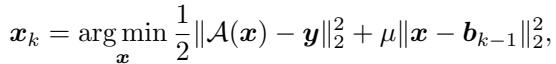

*Eq. (52): DCDP 用近端优化做数据一致性。*

with x initialized to $b _ { k - 1 }$ at the start of optimization.

SITCOM (Alkhouri et al. 2024) SITCOM defines three different criteria in which DIS should satisfy: 1) forward consistency, 2) backward consistency, and 3) measurement consistency. To enable this, akin to CSGM (Bora et al. 2017), optimizes the input to the diffusion model with

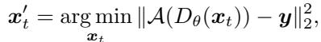

*Eq. (53): SITCOM 优化扩散模型输入以满足测量一致性。*

and additionally imposing proximal constraints as in (52). Once the optimization is performed, the sampling steps follow the usual DDIM sampling steps, running (53) for every t reverse sampling steps.

> 💡 **解耦派的共性：把 likelihood 从 $x_t$ 搬回 $x_0$** (Hao 批注): DAPS(Langevin)、DCDP(proximal, Eq.52)、SITCOM(优化网络输入, Eq.53) 三者手法不同，但共同点是**不在噪声变量 $x_t$ 上硬算 $p(y|x_t)$，而是在干净估计上做数据一致性优化**，从而回避 Jensen 近似。代价统一是"每步内层多做几次优化"→ 更慢。它们比 DPS 稳，但内层优化引入新的手调超参（$\mu$、步长、迭代数），严格性提升但未闭合。

## 4.3 Sequential Monte Carlo

Sequential Monte Carlo (SMC) methods, also known as particle filters, have emerged as a principled framework for solving inverse problems with diffusion priors. SMC methods enjoys the property that with increased compute (i.e. number of particles → ∞), the sampler approaches sampling from the true posterior. The particles, each representing a hypothesis about a solution, are propagated through the reverse diffusion sampling steps, re-weighted according to their consistency with respect to the observation. The algorithms mostly differ on how one constructs the proposal kernel and the reweighting values.

> 💡 **SMC = 唯一有"渐近精确"保证的路线** (Hao 批注): 这是本节理论上最干净的一类。粒子滤波的卖点是**粒子数 $\to\infty$ 时保证采到真后验**——这是 DPS/VI 都给不出的渐近保证。机制：每个粒子是一个候选解，沿反向扩散传播，按与观测的一致性重新加权 + 重采样。算法差异只在 proposal kernel 和 reweighting 怎么定。对本课题：**SMC 是 coverage 校准的"金标准对照"**——若一个采样器 coverage 正确，它应当在粒子数增大时向 SMC 结果收敛。代价是粒子数大时显存/算力爆炸。

SMCDiff (Trippe et al. 2023) SMCDiff aims to construct a scaffold structure given a desired motif, which can be cast as a special case of the noiseless inpainting problem. Specifically, let y be the motif $( \mathrm { i . e . }$ measurement), x be the scaffold, and $x = [ y , z ]$ , i.e. $y \in \mathbb { R } ^ { m } , z \in \mathbb { R } ^ { n - m }$ are sub-vectors of $x$ . Akin to Score-SDE (Song, Sohl-Dickstein, Kingma, Kumar, Ermon & Poole 2021), one first constructs a forward-diffused motif

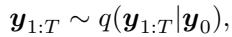

*Eq. (54): 预先前向扩散 motif $y_{1:T}$。*

which are prepared before the reverse diffusion sampling steps, then cached for later use. Then, for all the particles that are propagated, the sub-vector that corresponds to the motif are replaced

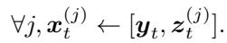

*Eq. (55): 每个粒子中 motif 子向量被替换。*

The un-normalized reweighting kernel is then constructed as

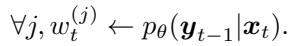

*Eq. (56): 未归一化重加权核 $w_t^{(j)}\gets p_\theta(y_{t-1}|x_t)$。*

For all reverse diffuison steps and particles, (54)-(56) along with the resampling steps are applied.

MCGDiff (Cardoso et al. 2024) MCGDiff first defines $q ( x _ { t } | y ) = \mathcal { N } ( x _ { t } ; \sqrt { \bar { \alpha } _ { t } } y , ( 1 - \bar { \alpha } _ { t } ) )$ . The proposal kernel for reverse distribution is defined as

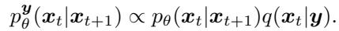

*Eq. (57): MCGDiff 的 proposal kernel。*

For every propagated particle, the reweighting kernel is defined as

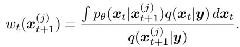

*Eq. (58): MCGDiff 的重加权核。*

The sampling process follows the usual SMC procedure, with proposal, weighting, and resampling.

FPS (Dou & Song 2024) The core technical innovation of FPS is the construction of coupled diffusion process. In addition to the standard sequence of noisy data latents $x _ { t }$ , the algorithm generates a corresponding sequence of noisy measurements $y _ { t }$ , where the noise is correlated to $x _ { t }$ . Specifically, given the forward process

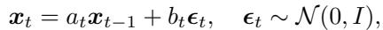

*Eq. (59): 标准前向过程。*

one can similarly define

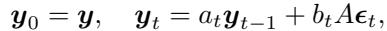

*Eq. (60): 耦合的带噪测量序列 $y_t$。*

so that $y _ { t } \sim \mathcal { N } ( A x _ { t } , c _ { t } ^ { 2 } \sigma _ { y } ^ { 2 } I )$ , with $c _ { t } = a _ { 1 } a _ { 2 } \ldots a _ { t }$ . This construction leads to the following closed-form expression

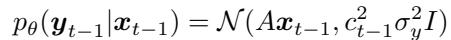

*Eq. (61): $p_\theta(y_{t-1}|x_{t-1})$ 闭式。*

and

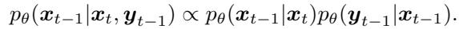

*Eq. (62): FPS 的 proposal kernel。*

FPS uses (62) as the proposal kernel of the SMC procedure, and uses the following resampling weights

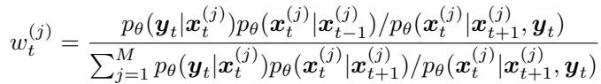

*Eq. (63): FPS 的重采样权重。*

> 💡 **三种 SMC 的差异全在 proposal + weight** (Hao 批注): SMCDiff（把 motif 子向量直接替换，Eq.55，适合 noiseless inpainting）、MCGDiff（proposal 融合前向条件 $q(x_t|y)$，Eq.57）、FPS（构造与 $x_t$ 相关的**耦合带噪测量序列** $y_t$，Eq.60，把观测也扩散化）。共同套路是 proposal → weight → resample。FPS 的耦合构造最巧妙——让 $y_t\sim\mathcal{N}(Ax_t,\cdots)$，使 likelihood 在每个噪声级都良定义，避免了 DPS 的 $p(y|x_t)$ 难题。

Connections to inference-time scaling Singhal et al. (2025) recently drew connections to inference-time scaling of diffusion models, as SMC provides another axis (i.e. number of particles) to scale performance with compute, with guaranteed gains. Recently, FK-steering in Singhal et al. (2025) was extended to video diffusion models with a reward function that governs the 3D/4D physical consistency (Park et al. 2025).

> 💡 **4 小结** (Hao 批注):
> - **三条路线定位**: VI（拟合分布 $q_\phi$，多样性好但常被高斯假设拖回 MAP）；decoupled data consistency（把 likelihood 搬回干净变量 $x_0$，困难任务更稳）；SMC（粒子滤波，唯一渐近精确，代价是粒子开销）。
> - **核心洞察（对本课题）**: 这三条是"比 DPS 更接近真后验"的方向。SMC 提供 coverage 校准的金标准对照；normalizing-flow VI/RSLD 无手调步长且可采多峰，是避免 under-coverage 的正面范式；DAPS 的精确分解 $p(x_0|x_t,y)\propto p(x_0|x_t)p(y|x_0)$ 是把数据一致性做对的模板。
> - **可追问点**: 这些方法都是**非盲**（已知 $A$）。要把 SMC/VI 的"渐近精确/分布匹配"迁到盲设置（联合估 $x,\varphi$），proposal/权重都要在 $\varphi$ 维度重构——本文没覆盖，正是本课题的空白点。
