[← 返回 README](../README.md)

# 5. Extension to complex tasks

## 📌 预览

前面都假设算子 $\mathcal{A}$ 已知、信号是 2D 图、有干净训练数据。本节把这三个假设逐个拆掉：

- **5.1 Blind inverse problems**（本课题的直接上游）：算子被参数化为 $\mathcal{A}_\varphi$，$\varphi$ 未知，要联合估 $x$ 和 $\varphi$（BlindDPS / GibbsDDRM / Fast Diffusion EM）。
- **5.2 3D**：高维体数据缺乏 3D 训练集，用 2D 先验的因子化拼 3D（DiffusionMBIR / TPDM）。
- **5.3 数据稀缺**：连干净图都没有（黑洞成像、cryo-EM），靠 test-time adaptation / patch prior。
- **5.4 用带噪数据训练扩散**：GSURE / Ambient Diffusion / EM。

对本课题：**5.1 是核心必读**——它给出联合后验 $p(x,\varphi|y)$ 的三种解法，而它们全都把非盲设置里的近似缺陷（Jensen、SVD 假设、MAP 化）直接搬进了盲设置。

---

## 5.1 Blind inverse problems

Often, the forward operator A is parameterized with $\varphi$ , i.e. $\mathcal { A } _ { \varphi }$ , unlike the problems that we have considered so far, which assumed full knowledge of the forward operator. A prominent example is blind deconvolution, where the forward model is given as

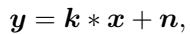

*Eq. (64): 盲去卷积前向模型 $y=k*x+n$。*

where k is the convolution kernel. In such case, one has to specify the posterior of both x and k

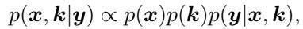

*Eq. (65): 联合后验 $p(x,k|y)\propto p(x)p(k)p(y|x,k)$。*

where the factorization arises from the independence between x and $k$ , and from $( 6 4 ) , p ( y | x , k ) = \mathcal { N } ( y , k * x , \sigma _ { y } ^ { 2 } I )$ In such case, $k = \varphi$

> 💡 **问题设定：盲 = 先验从 $p(x)$ 变成 $p(x)p(\varphi)$，likelihood 变成双变量 intractable** (Hao 批注):
> - Eq. (65) 是本课题的数学起点。相比非盲的 Eq. (2)，多了一个**算子参数先验 $p(\varphi)$**（这里 $\varphi=k$ 卷积核），且假设 $x\perp\varphi$。likelihood $p(y|x,\varphi)$ 现在同时依赖两个未知量。
> - **难点翻倍**：非盲时 $p(y|x_t)$ 已 intractable（Eq. 3），盲时要处理 $p(y|x_t,\varphi_t)$——对 $x_t$ 和 $\varphi_t$ **同时** intractable。下面三个方法就是三种应对策略。
> - **本课题视角**：本文把 $\varphi$ 局限在卷积核这种高维对象（BlindDPS 甚至给核也训个扩散先验）。本课题关心的是**低维算子参数** $\varphi$（如模糊尺度、采样掩码参数），并额外把噪声 $\sigma$ 也纳入联合估计——这是本文未展开的方向，也是 gauge-aware 校准能发力的地方（低维 $\varphi$ 才有意义去查它的 SBC/coverage）。

BlindDPS (Chung, Kim, Kim & Ye 2023) BlindDPS extends DPS by constructing another prior $p ( k )$ for the kernel by training a separate diffusion model. Following the choice of (10), one can construct two parallel PF-ODEs

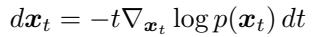

*Eq. (66): 图像的 PF-ODE。*

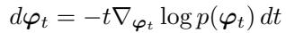

*Eq. (67): 核参数 $\varphi$ 的 PF-ODE（BlindDPS 为核单独训一个扩散先验）。*

To be able to sample from the posterior given the measurement y, we can create a coupling

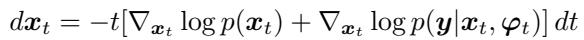

*Eq. (68): 图像流的耦合后验 PF-ODE。*

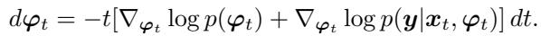

*Eq. (69): $\varphi$ 流的耦合后验 PF-ODE。*

Similar to the case of non-blind inverse problems, $p ( y | x _ { t } , \varphi _ { t } )$ is intractable. BlindDPS uses the approximation proposed in DPS, but to both of the random variables $x _ { t }$ and $\varphi _ { t }$ , i.e. $p ( y | x _ { t } , \varphi _ { t } ) \approx p ( y | \hat { x } _ { 0 | t } , \varphi _ { 0 | t } )$ , leading to

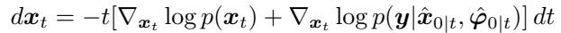

*Eq. (70): BlindDPS 图像流（用 $\hat x_{0|t},\hat\varphi_{0|t}$ 近似 likelihood）。*

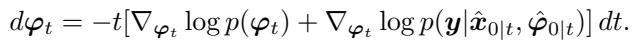

*Eq. (71): BlindDPS 核参数流。*

In practice, the BlindDPS requires sampling Gaussian noise independently for $x _ { T }$ and $\varphi _ { T }$ , then running (70) and (71) in parallel. The likelihood is approximated with the posterior mean of $x _ { t }$ and $\varphi _ { t }$ at each step. Then, a gradient that maximizes this likelihood is applied separately to each stream.

> 💡 **机制拆解：BlindDPS 把 DPS 的偏差复制到两条流** (Hao 批注):
> - **数据流**：初始化两组独立高斯噪声 $x_T,\varphi_T$ → 两条 PF-ODE 并行反向（Eq. 70/71）→ 每步用 Tweedie 得 $\hat x_{0|t},\hat\varphi_{0|t}$ → 算 $\|y-\hat\varphi_{0|t}*\hat x_{0|t}\|^2$ 的梯度 → 分别加到两条流。核 $\varphi$ 也训了个独立扩散先验（Eq. 67）。
> - **偏差诊断（本课题核心关切）**：BlindDPS 把 Eq. (32) 的 Jensen 近似 $p(y|x_t,\varphi_t)\approx p(y|\hat x_{0|t},\hat\varphi_{0|t})$ **同时**用在两个变量上。问题是——现在 likelihood 是 $\hat x$ 和 $\hat\varphi$ 的**双线性/卷积耦合**，把期望塌缩到两个点上，偏差比非盲更严重（两个点估计的乘积 ≠ 乘积的期望）。而且共享同一个手调步长，$x$ 和 $\varphi$ 的噪声尺度完全不同（图像 vs 低维核），一个步长很难同时对。
> - **gauge 问题的雏形**：$y=k*x$ 存在尺度/位移不确定性（$k\to\alpha k, x\to x/\alpha$ 观测不变）。BlindDPS 靠两个先验隐式打破这种简并，但**没有显式处理 gauge**——这正是本课题 gauge-aware 采样要补的洞：不消掉 gauge 自由度，$\varphi$ 的后验就会沿 gauge 方向发散，coverage 报告失真。

GibbsDDRM (Murata et al. 2023) One downside of BlindDPS is that it requires training a score function for $\varphi$ , and induces additional computational cost for calling $\nabla _ { \varphi _ { t } } \log { p ( \varphi _ { t } ) }$ with a neural network. GibbsDDRM tackles the blind deblurring problem within the DDRM family. Formally, consider the SVD of A that is dependent on the parameter of the forward operator $\varphi$ , i.e. $A _ { \varphi } = U _ { \varphi } \Sigma _ { \varphi } V _ { \varphi }$ , with singular values $\{ s _ { j , \varphi } \} _ { j = 1 } ^ { m }$ . Similar to DDRM, let $\bar { y } _ { \varphi } : = U _ { \varphi } ^ { \top } y _ { \varphi } , \bar { x } _ { \varphi } : = V _ { \varphi } ^ { \top } x _ { \varphi } , \bar { \epsilon } _ { \varphi } : = U _ { \varphi } ^ { \top } \epsilon _ { \varphi }$ , and further define $\bar { x } _ { 0 | t , \varphi } : = V _ { \varphi } \mathbb { E } [ x _ { 0 } | x _ { t } ]$ . Then, the reverse distribution can be characterized as

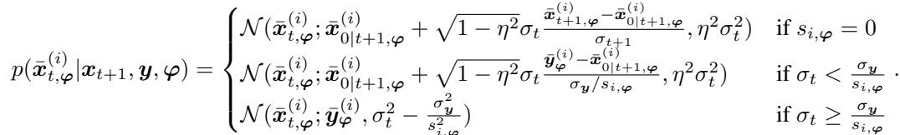

*Eq. (72): GibbsDDRM 在给定 $\varphi$ 下的逐分量反向分布（DDRM 的 $\varphi$-条件版）。*

Notice that $( 7 2 )$ assumes knowledge of $\varphi$ . Akin to Gibbs sampling, the authors propose to update the random variable $\varphi$ with the following Langevin dynamics

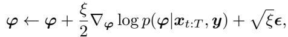

*Eq. (73): 用 Langevin 动力学更新 $\varphi$。*

with some step size $\xi$ Following DPS, and placing the Laplacian prior on $\varphi$ , the authors propose the following approximation

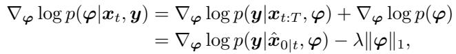

*Eq. (74): $\varphi$ 的后验梯度近似（DPS 式 + Laplacian 先验 $-\lambda\|\varphi\|_1$）。*

(75)

with some constant λ.

> 💡 **GibbsDDRM：把联合后验拆成 Gibbs 交替，$\varphi$ 用 Langevin、$x$ 用 DDRM** (Hao 批注):
> - 核心结构是 **Gibbs 采样**：给定当前 $\varphi$，用 DDRM（$\varphi$-条件版，Eq. 72）更新 $x$；给定当前 $x$，用 Langevin（Eq. 73–74）更新 $\varphi$，$\varphi$ 上放 Laplacian 稀疏先验（核通常稀疏）。交替进行。
> - **相比 BlindDPS 的优点**：不用为 $\varphi$ 训扩散先验（省一个网络），用手写的 Laplacian 先验即可。
> - **继承的缺陷**：(i) 依赖 $A_\varphi$ 可 SVD——每次 $\varphi$ 更新都要重算 $U_\varphi\Sigma_\varphi V_\varphi$，只适合结构化算子（去卷积）；(ii) $\varphi$ 的梯度仍用 DPS 式 Jensen 近似（Eq. 74 里 $p(y|\hat x_{0|t},\varphi)$）。所以它是"partially collapsed Gibbs"——名义上是采样，但 $\varphi$ 的条件分布用了近似 score，**不是严格的 Gibbs 转移核**，联合后验的正确性无保证。这又是"数据一致性修正 ≠ 严格后验 score"在盲设置的一例。

Fast Diffusion EM (Laroche et al. 2024) Fast Diffusion EM takes an alternating expectation maximization (EM) approach. In the E-step, the approximated kernel φ is used for the usual DPS/ΠGDM sampling steps. In the M-step, an MAP optimization to maximize the posterior of the kernel is used, where the optimization problem is solved through a plug-and-play (PnP) (Venkatakrishnan et al. 2013) method with a DnCNN (Zhang et al. 2017) denoiser.

While the aforementioned approaches apply to a more general set of inverse problems, they are hard to apply to real-world image restoration tasks, as the forward model is either much more complicated, or hard to specify. For instance, the forward model of blind face restoration involves a convolution with a blur kernel, a down sampling operator, a noise component, and a JPEG degradation factor. Man et al. (2025) proposes to train a regressor to estimate these parameters, and show that using these estimated parameters together with an off-the-shelf inverse problem solver (e.g. DPS), is effective for solving inverse problems with complex forward operators.

> 💡 **三种盲策略的谱系 + 现实主义的第四条** (Hao 批注):
> - **BlindDPS**（$\varphi$ 训扩散先验，两条 PF-ODE 并行）、**GibbsDDRM**（Gibbs 交替，$\varphi$ 用 Langevin + Laplacian 先验、$x$ 用 SVD 域 DDRM）、**Fast Diffusion EM**（EM 交替：E 步固定 $\varphi$ 跑 DPS/ΠGDM 采 $x$，M 步对 $\varphi$ 做 MAP + PnP）。三者对 $\varphi$ 的处理从"生成先验"→"稀疏先验采样"→"MAP 点估计"，**后验不确定性一路收窄**：Fast Diffusion EM 直接把 $\varphi$ 当点估计（MAP），完全放弃 $\varphi$ 的后验。
> - **Man et al. (2025) 的现实主义转向**：真实退化（盲人脸修复）的前向是 模糊核 ∘ 降采样 ∘ 噪声 ∘ JPEG 的复合，无法解析建模。他们干脆**训一个回归器直接预测这些参数**，再喂给现成 DPS。这是"放弃联合后验、退回两阶段（先估 $\varphi$ 再解 $x$）"的工程妥协——简单有效但完全没有 $\varphi$ 的不确定性传播。
> - **本课题的定位就在这个缝里**：本文所有盲方法要么把 $\varphi$ 后验做偏（BlindDPS/GibbsDDRM 的近似 score）、要么直接塌成点（Fast Diffusion EM / Man et al.）。**没有一个做 $\varphi$ 的校准检验**。本课题的 gauge-aware 联合后验采样 + SBC/coverage/CRPS，正是要填"低维 $\varphi$ 的后验到底准不准"这个全空白。

## 5.2 3D inverse problems

The inverse problems considered so far assume the latent signal x that we wish to retrieve is a 2D image. Due to architectural advances and the ease of data collection, it is fairly easy to collect a dataset of high-quality 2D images, and to train a diffusion model on it. Nevertheless, there are many cases in computational imaging, especially in biomedical imaging, where the reconstruction of 3D volume is necessary. In such cases, however, it is both hard to collect gold-standard 3D data, and to train a diffusion model on such collected 3D dataset. One popular way to tackle this is to decompose the prior

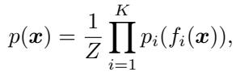

*Eq. (76): 因子化先验 $p(x)=\frac{1}{Z}\prod_i p_i(f_i(x))$。*

where $Z$ is a normalization constant, and $f _ { i }$ is an operator that captures complementary, lower-dimensional aspects of x. A concrete example for the case of 3D would be to choose slicing operators for $f$ , resulting in a factored prior over different planes.

DiffusionMBIR (Chung, Ryu, Mccann, Klasky & Ye 2023) The core idea of DiffusionMBIR is that the 3D prior over x is already captured well in the 2D prior over the xy slices. Thus, it may be sufficient to enforce smoothness across the other dimension, for instance, by using a total variation (TV) prior over the z direction. This can be achieved by iteratively applying denoising steps and measurement consistency steps, where in the measurement consistency step, the following sub-problem is solved

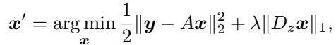

*Eq. (77): 测量一致性子问题（2D 先验 + z 方向 TV 正则）。*

where $D _ { z }$ is the finite difference operator across $z$ To solve (77), ADMM (Boyd et al. 2011) is used, with CG steps operating to solve the inner problem. However, notice that this would require immense computation cost, as the iterative ADMM would have to be solved for every t. To mitigate this cost, a variable sharing technique was proposed so that the primal and dual variables are warm-started from the previous iteration $t + 1$ , and only a single iteration of ADMM is applied to each optimization step. Later, in Chung, Lee & Ye (2024), it was shown that one can improve the performance of DiffusionMBIR by using the Tweedie estimates $\hat { x } _ { 0 \mid t }$ for optimization in (77), instead of the noisy variables $x _ { t }$

TPDM (Lee et al. 2023) Another way to construct a factored prior is to use two diffusion diffusion priors for different slice directions. Compared to DiffusionMBIR, this further alleviates hand-crafted inductive bias and replaces it with a data-driven generative prior, and was shown to outperform DiffusionMBIR across several tasks, especially on tasks such as super-resolution. One way to implement the product distribution is by using the sum of the scores

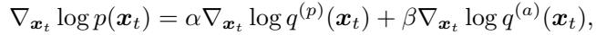

*Eq. (78): 因子化先验的 score 相加，$\nabla\log p=\alpha\nabla\log q^{(p)}+\beta\nabla\log q^{(a)}$。*

where $q ^ { ( p ) }$ is the distribution of the slices in the primary plane, $q ^ { ( a ) }$ is the distribution of the slices in the auxiliary plane (i.e. orthogonal to the primary plane), and $\alpha , \beta$ are mixing constants. In practice, directly using (78) would incur double the computation cost during inference. To mitigate this, Lee et al. (2023) proposes to use an alternating approach, using only the score from the primary plane for $\frac { \alpha } { \alpha + \beta }$ fraction of the time during reverse sampling, and using only the score from the auxiliary plane for $\frac { \beta } { \alpha + \beta }$ for the rest. In order to impose measurement consistency, DPS steps are employed.

> 💡 **3D 的共同招数：用低维（2D）先验的乘积拼高维先验** (Hao 批注): 缺 3D 训练数据，就把 3D 先验 $p(x)$ 因子化成一堆 2D 切片先验的乘积（Eq. 76）。DiffusionMBIR 用"xy 平面扩散先验 + z 方向 TV 手工正则"（Eq. 77，ADMM 求解，变量共享省算力）；TPDM 更彻底，用两个正交方向的 2D 扩散先验，score 直接相加（Eq. 78，交替调用省一半算力）。**乘积先验 = score 相加**是这里的关键等式，也解释了为什么因子化能省数据。这条对本课题是旁支，但"用手头能训的低维先验组合出难训的高维先验"思路，与"用低维 $\varphi$ 先验约束高维联合后验"精神相通。

## 5.3 Inverse problems under data scarcity

All diffusion model-based inverse problem solvers rely on the assumption that one has access to a diffusion model trained on high-quality in-distribution datasets. This condition is not satisfied. For instance, in black-hole imaging (Akiyama et al. 2019) and cryo-EM imaging (Gupta et al. 2021), one only has access to the partial measurements, with no access whatsoever on how the true image would look like. In this section, we review some of the approaches that operate under such constraints.

### 5.3.1 Test-time adaptation

One way to solve this problem is to use a diffusion model trained on a separate dataset, and try to adapt the diffusion model on out-of-distribution (OOD) measurements online Barbano et al. (2025), Chung & Ye (2024). The approaches build on top of deep image prior (DIP) (Ulyanov et al. 2018), which overfits a network on a single measurement, relying on the inductive prior of the neural network

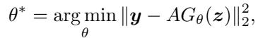

*Eq. (79): Deep Image Prior，$\theta^*=\arg\min_\theta\|y-AG_\theta(z)\|^2$。*

where $G _ { \theta }$ is the network for reconstruction, which takes in a random input $z \sim \mathcal { N } ( 0 , I )$

Deep Diffusion Image Prior (DDIP) (Chung & Ye 2024) generalizes and extends DIP to work within the diffusion framework by alternating the following steps

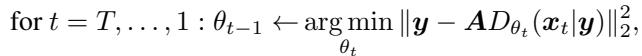

*Eq. (80): DDIP 在每个噪声级 online 微调 denoiser。*

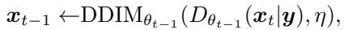

*Eq. (81): DDIP 的 DDIM 采样步。*

where $\mathrm { D D I M } _ { \theta } ( x _ { t } , \eta ) : = \sqrt { \bar { \alpha } _ { t - 1 } } D _ { \theta } ( x _ { t } | y ) + \sqrt { 1 - \bar { \alpha } _ { t - 1 } } \left( \eta \epsilon + ( 1 - \eta ) \epsilon ^ { \theta } \right)$ . Notice that DDIP differs from DIP in two aspects. First, the reconstructor $G _ { \theta }$ is replaced with an MMSE denoiser $D _ { \theta }$ , which stems from a pre-trained diffusion model, and hence the generation trajectory is pivoted in the original generative process. Second, the DIP adaptation in (80) is held across multiple scales (i.e. noise levels $t )$ , different from a single-scale optimization of DIP. In practice, the original parameters θ are hold constant, and only the low-rank adaptation (LoRA) is applied to make partial updates to the network.

Patch-based priors Factored priors that are widely employed within the 3D medical imaging setting, but were also shown to be useful for 2D inverse problems, for instance, by using patch-based priors (Hu et al. 2024). By employing positional encodings, PaDIS (Hu et al. 2024) constructs a position-aware patch-based diffusion model, showing that such approach is better than image diffusion model counterparts, especially in the data-scare regime. Later, the patch-based diffusion approach was combined with test-time adaptation in Hu et al. (2025).

> 💡 **数据稀缺：先验不够就 online 适配或用 patch 复用** (Hao 批注): 黑洞成像/cryo-EM 连一张干净参考图都没有，无法训分布内扩散先验。两条应对：(i) **test-time adaptation**——拿别的数据集训好的扩散模型，在单个观测上 online 微调（DDIP，Eq. 80–81，用 LoRA 只动少量参数、以 MMSE denoiser 替代 DIP 的随机重构器、跨噪声级适配）；(ii) **patch prior**——训 patch 级而非整图级扩散先验（PaDIS 加位置编码），数据效率更高。这条对本课题是背景：提醒我们"生成先验的可得性"本身是强假设，盲问题若还叠加数据稀缺会更难。

## 5.4 Training a diffusion model with noisy data

GSURE-based diffusion model (Kawar et al. 2024) Stein’s Unbiased Risk Estimator (SURE) (Stein 1981) is a widely used method to train a denoiser given only the Gaussian-noisy measurements. Later, this was extended to a general set of linear inverse problems of the form (1) in Generalized SURE (GSURE) (Eldar 2008), which states the following

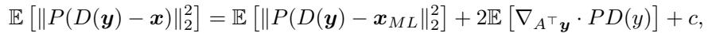

*Eq. (82): GSURE 恒等式（投影 MSE 的无偏估计）。*

where $P = A ^ { \top } A$ and $x _ { M L } = ( A ^ { \top } A ) ^ { \dagger } A ^ { \top } y$ . While (82) guarantees a good denoiser in the sense of projected MSE, this ceases to be a good surrogate when the operator A removes sufficient information from x (i.e. when the mask is large). In such case, one can use ENsmeble SURE (ENSURE) (Aggarwal et al. 2022) by also marginalizing over the operator A, given the assumption that we have access to A and the noise level, and the different realizations of A covers the signal space $\mathbb { R } ^ { n }$ . Note that this assumption is satisfied, for instance, in MRI acquisitions. GSURE-based diffusion follows this assumption and leverages ENSURE to train a diffusion model from the measurements only.

Following the similar procedure from the DDRM family introduced in Sec. 3.1, we transform the inverse problem into

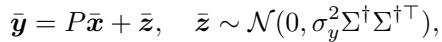

*Eq. (83): 谱域改写 $\bar y=P\bar x+\bar z$。*

where $A = U \Sigma V ^ { \top } , P = \Sigma ^ { \dagger } \Sigma , \bar { x } = V ^ { \top } x , \bar { y } = \Sigma ^ { \dagger } U ^ { \top } y , \bar { z } = \Sigma ^ { \dagger } U ^ { \top } z$ . GSURE-diffusion then constructs the following forward perturbation

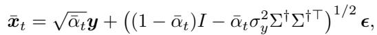

*Eq. (84): GSURE-diffusion 的前向扰动。*

and by this design choice, the marginal distribution of $\bar { x } _ { t }$ reads $q ( \bar { x } _ { t } | \bar { x } , P ) = \mathcal { N } ( \sqrt { \bar { \alpha } _ { t } } P \bar { x } , ( 1 - \bar { \alpha } _ { t } ) I )$ . The objective function then reads

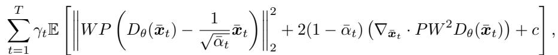

*Eq. (85): GSURE-diffusion 训练目标。*

where $W = \mathbb { E } [ P ] ^ { - \frac { 1 } { 2 } } \succ 0$ . It was shown in Kawar et al. (2024) that by training a diffusion model solely on measuremenets with (85) yields similar to performance to the diffusion models trained on clean samples x.

> 💡 **GSURE：不用干净图也能训扩散先验（靠无偏风险估计）** (Hao 批注): SURE/GSURE 的魔法是——只有带噪/欠采样观测，也能**无偏估计**去噪的投影 MSE（Eq. 82），从而训出接近"用干净图训"的 denoiser。GSURE-diffusion 借 DDRM 谱域改写（Eq. 83–85）+ ENSURE（对多个 $A$ 实现求平均，覆盖信号空间，MRI 天然满足）把这套搬到扩散训练。这条对本课题的启发：**当"生成先验"本身只能从退化数据学到时，先验就带偏**，联合后验的先验项不再干净——这是比"已知先验"更难的一层，值得记为 future work。

### 5.4.1 Ambient Diffusion Family

Ambient Diffusion (Daras, Shah, Dagan, Gollakota, Dimakis & Klivans 2023) Ambient Diffusion considers a special case of learning a diffusion model from noiseless-masked measurements $y _ { 0 } = A x _ { 0 }$ with the same assumptions as in GSURE-diffusion. Consider the following naive loss

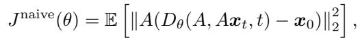

*Eq. (86): 只在已知像素上算的 naive loss。*

where the loss simply ignores the missing pixels, and computes the loss only on known ones. Training a diffusion model with (86), however, would not lead the network to learn any information about the unknown pixel values. To mitigate this, the authors propose to sample a second mask $B$ , and set $\tilde { A } = B A$ . Then, the loss of Ambient Diffusion reads

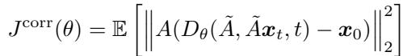

*Eq. (87): Ambient Diffusion 的双掩码 corrupted loss。*

Since the network $D _ { \theta }$ cannot distinguish between the old and new masked pixels, the safest way would be to reconstruct every pixel. Under mild assumptions on A, B, one can also show that $D _ { \theta ^ { * } } ( \tilde { A } , x _ { t } ) = \mathbb { E } [ x _ { 0 } | \tilde { A } x _ { t } , \tilde { A } ]$

> 💡 **Ambient 的巧招：再叠一层掩码，逼网络学未知像素** (Hao 批注): 只在已知像素算 loss（Eq. 86）网络学不到缺失像素。Ambient Diffusion 的招是**再随机叠一个掩码 $B$**（$\tilde A=BA$），网络分不清哪些是"本来就缺"哪些是"新盖住的"，最安全策略只能是重建所有像素（Eq. 87）——于是从缺失数据里也学到了完整分布。这是"用带损数据训生成先验"的又一条路，思想优雅。

Consistent Diffusion meets Tweedie (Daras, Dimakis & Daskalakis 2024) Daras, Dimakis & Daskalakis (2024) considers training a diffusion model with Gaussian noise-corrupted samples, where $A = I$ . Let the noise level of the samples be $t _ { n }$ . Notice that for $t \gt t _ { n }$ , we can express the random variable $x _ { t }$ in two distinct ways: $x _ { t } = x _ { 0 } + \sigma _ { t } \epsilon$ and $x _ { t } = x _ { t _ { n } } + \sqrt { \sigma _ { t } ^ { 2 } - \sigma _ { t _ { n } } ^ { 2 } } \epsilon$ . By applying Tweedie’s formula twice, one can conclude

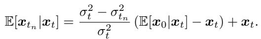

*Eq. (88): 两次 Tweedie 推出 $\mathbb{E}[x_{t_n}|x_t]$。*

The implication of (88) is that one can train an optimal denoiser for noise levels $t \gt t _ { n }$ by training the model to remove only the additional noise from $t _ { n }$ to $t$ , i.e. train the model with

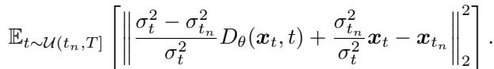

*Eq. (89): $t\gt t_n$ 时只学"从 $t_n$ 到 $t$ 的增量噪声"。*

For noise levels $t \lt t _ { n }$ , one can leverage the idea from Consistent diffusion (Daras, Dagan, Dimakis & Daskalakis 2023), where the objective reads

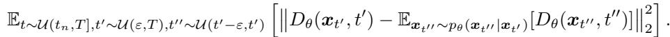

*Eq. (90): $t\lt t_n$ 时用一致性目标（consistency loss）。*

Notice that in $( 9 0 ) , t ^ { \prime } \gt t ^ { \prime \prime }$ , and the sampling of $p _ { \theta } ( x _ { t ^ { \prime \prime } } | x _ { t ^ { \prime } } )$ is achieved through taking a step ε through a diffusion model, a similar procedure to consistency models (Song, Dhariwal, Chen & Sutskever 2023). By training a diffusion model to be consistent with its counterpart taken two steps, one can achieve an optimal denoiser even for $t \lt t _ { n }$ . Thus, the final objective of Daras, Dimakis & Daskalakis (2024) takes a weighted sum of the two objectives (89), (90).

> 💡 **噪声级分段处理：高于 $t_n$ 学增量、低于 $t_n$ 靠一致性** (Hao 批注): 若训练样本本身带了噪声级 $t_n$，那么对 $t\gt t_n$ 的噪声级，模型只需学"再多加的那点噪声"（Eq. 88–89，两次 Tweedie 推导）；对 $t\lt t_n$（比样本还干净的区间，天然无监督），用 consistency loss（Eq. 90）逼模型与"多走两步"的自己一致，从而外推到无法直接监督的低噪声区。这把 Ambient 从掩码推广到加性噪声。

Ambient Diffusion Omni (Daras et al. 2025) Previous works relied on the assumption that one knows the noise level of the corrupted measurement. Ambient Diffusion Omni relaxes this assumption and considers the case where the diffusion model is trained on a mixture distribution of $p _ { 0 }$ and $q _ { 0 }$ , where $p _ { 0 }$ is the clean data distribution, and $q _ { 0 }$ is the corrupted distribution containing arbitrary mix of bad-quality data (e.g. blur, noise, JPEG artifacts, etc.). In the practical scenario when training a diffusion model for deployment, one would filter out the samples in $q _ { 0 }$ and use only the ones in $p _ { 0 }$ . However, in Ambient Diffusion Omni, the authors propose a way to utilize both the data from $p _ { 0 }$ and $q _ { 0 }$ showing that one can achieve better quality by using data from both sources.

Due to the contracting property of diffusion models (Chung, Sim & Ye 2022), when noise is added, $p _ { t }$ and $q _ { t }$ become closer to each other. The key idea of Ambient Diffusion Omni is to train a classifier that distinguishes high and low quality samples at a certain timestep. The minimum timestep $t _ { n } ^ { \mathrm { m i n } }$ is distinguished for each sample. Then, when training the diffusion model, one only uses the timesteps $t \geq t _ { n } ^ { \operatorname* { m i n } }$ for some sample $n$ .

> 💡 **Ambient Omni：连噪声级都不知道，靠"扩散收缩性"救** (Hao 批注): 前面都假设知道 corruption 的噪声级 $t_n$。Ambient Omni 放开这个假设，处理"干净 $p_0$ + 任意杂质 $q_0$（模糊/噪声/JPEG 混合）"的混合训练集。关键观察是**扩散的收缩性**：加噪后 $p_t$ 和 $q_t$ 会互相靠近，所以对每个坏样本，只要在足够大的噪声级 $t\ge t_n^{\min}$（用分类器逐样本判定）使用它，就不会污染模型。这是"脏数据也能训好模型"的最激进版本，对"数据规模 > 数据洁净度"的现代训练现实很有意义。

### 5.4.2 Expectation-Maximization (EM)

EM tries to find the best parameter θ of the model that best explains the observation $y$ . The challenge is that we do not know the underlying clean data x. To circumvent this issue, EM takes a two-stage approach.

1. (E-step): Use the current model $\theta _ { k }$ to specify the posterior $p _ { \theta _ { k } } ( x | y )$ and specify in expectation what the complete data looks like

2. (M-step): Given the probabilistic guess about the hidden data x, maximize the log-likelihood of the model to get $\theta _ { k + 1 }$

The key idea behind the EM algorithm is that for any $\theta _ { a }$ and $\theta _ { b }$ , we have

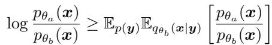

*Eq. (91): EM 的单调性核心不等式。*

Hence, the iteration of EM leads to a sequence of parameters $\theta _ { k }$ where the expected log evidence $\mathbb { E } _ { p ( y ) } [ \log p _ { \theta _ { k } } ( y ) ]$ monotonically increases and converges to a local optimum.

Rozet et al. (2024) Notice that

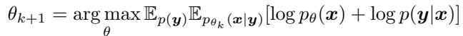

*Eq. (92): M-step 展开。*

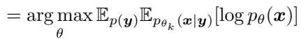

*Eq. (93): 化简（丢掉与 $\theta$ 无关的 likelihood 项）。*

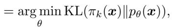

*Eq. (94): 归约为 $\min_\theta \mathrm{KL}(\pi_k(x)\|p_\theta(x))$。*

where $\pi _ { k } ( x ) = \int p _ { \theta _ { k } } ( x | y ) p ( y ) d y$ . In practice, given a sample y, the authors propose to use a posterior sampler, namely the moment matching method discussed in Sec. 3 to draw from $\pi _ { k } ( x )$ . Then, with the collected samples, the M-step is performed by standard DSM. A concurrent work of Bai et al. (2024) uses the same EM framework, but uses DPS to draw posterior samples in the E-step.

> 💡 **EM：用"后验采样器"当 E-step，把 DIS 反过来当训练工具** (Hao 批注): 这一段很妙——前面的 DIS（DPS/moment matching）是"给定先验解逆问题"，EM 把它反用：**E 步用一个 DIS 从 $p_{\theta_k}(x|y)$ 采样填补缺失的干净数据，M 步用这些伪干净样本做标准 DSM 更新先验 $\theta$**（Eq. 92–94 证明这等价于 $\min\mathrm{KL}(\pi_k\|p_\theta)$，单调收敛）。Rozet 用 moment matching 采、Bai 用 DPS 采。**对本课题的警示**：如果 E 步的后验采样器本身有偏（DPS 偏 MAP、moment matching 有近似），那么迭代出的先验也会被带偏——先验估计的偏差和后验采样的偏差会互相强化。这是"用有偏 DIS 自举训练"的隐患。

> 💡 **5 小结** (Hao 批注):
> - **5.1（本课题核心）**: 盲 = 联合后验 $p(x,\varphi|y)\propto p(x)p(\varphi)p(y|x,\varphi)$。三法谱系按 $\varphi$ 不确定性递减：BlindDPS（$\varphi$ 训扩散先验，双流 DPS）→ GibbsDDRM（Gibbs 交替，$\varphi$ Langevin+Laplacian）→ Fast Diffusion EM / Man et al.（$\varphi$ 塌成 MAP/回归点估计）。**全部继承 DPS 的 Jensen 近似或 DDRM 的 SVD 假设，且无一做 $\varphi$ 的校准**——这是本课题的空白靶点，gauge 简并更是完全未处理。
> - **5.2 3D**: 因子化先验 = score 相加，用 2D 先验拼 3D。
> - **5.3 数据稀缺**: test-time adaptation（DDIP+LoRA）/ patch prior，先验可得性是硬假设。
> - **5.4 带噪训练**: GSURE / Ambient / EM——先验本身从退化数据学，会带偏，联合后验先验项不再干净。
> - **可追问点**: 把 Sec. 4 的 SMC/normalizing-flow VI（渐近精确/分布匹配）迁到 5.1 的联合 $(x,\varphi)$ 空间 + gauge 固定 + SBC/coverage 检验 = 本课题的完整拼图，本文各段都只覆盖了其中一块。
