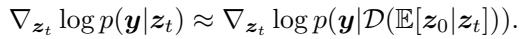
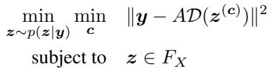
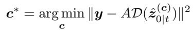
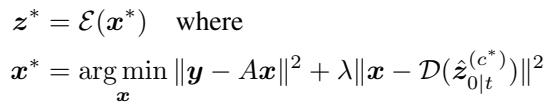
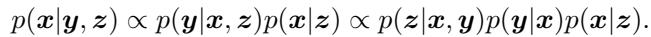
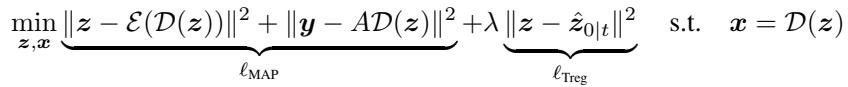

[← 返回 README](../README.md)

# 6. Text-driven solutions

## 📌 预览

逆问题 ill-posed，观测信息不够，那就引入**额外的旁路信息**——文本。本节讲三种用文本/元数据当条件先验的 LDM 解法：P2L（把 text embedding 当可优化变量）、TReg（用文本做正则，把解拉向文本条件的清晰流形）、ContextMRI（把病人元数据当条件，医学场景）。共同点是都在**latent diffusion (LDM)** 上做文章，用文本收窄后验的解空间。

---

Since inverse problems are ill-posed, measurement does not provide sufficient information for perfect recovery. It is natural that if one could use additional auxiliary information for recovery, it would be beneficial to do so. As one such side information, text has recently gained attention, as they enable compact, informative, and highly versatile conditioning.

Often, Latent Diffusion Models (LDMs) (Vahdat et al. 2021, Rombach et al. 2022) enable effective entanglement of multi-modal representations, and are considered the de facto standard for modern text-to-image diffusion models. In this section, let $z _ { 0 } = \mathcal { E } ( x _ { 0 } )$ be a latent code of clean image encoded by VAE encoder E. Original image can be reconstructed $x _ { 0 } = \mathcal { D } ( z _ { 0 } ) = \mathcal { D } ( \mathcal { E } ( x _ { 0 } ) )$ by VAE decoder D. The diffusion model is now defined on the latent space.

> 💡 **文本 = 把后验解空间收窄的旁路先验** (Hao 批注): 逆问题信息不够，本节的思路不是改 likelihood 近似，而是**加一路条件信息**。文本天然紧凑、语义强，且现代 LDM 已把 text 和 image 的表示纠缠在一起，接入成本低。注意本节全在 latent 空间 $z=\mathcal{E}(x)$ 操作——这多出一层 VAE 编解码，likelihood $\|y-A\mathcal{D}(z)\|^2$ 里嵌了非线性 decoder，DPS 式近似（Eq. 95）的偏差因此更复杂。对本课题：文本是"另一种低维旁路先验"，与我们用的低维算子参数 $\varphi$ 先验精神类似——都是用额外结构约束病态后验，只是 modality 不同。

P2L (Chung, Ye, Milanfar & Delbracio (2024)) P2L demonstrates the effectiveness of text embedding space for improving quality of solution. The authors propose an extension of DPS for LDMs (Rout, Raoof, Daras, Caramanis, Dimakis & Shakkottai 2024), by using

*Eq. (95): P2L 在 latent 空间的 DPS likelihood 近似（含 decoder $\mathcal{D}$）。*

Now, to consider the text embedding as an optimization variable, they formulate an optimization problem

*Eq. (96): P2L 把 prompt embedding $c$ 也当优化变量。*

where $F _ { X } = \{ z | z = \mathcal { E } ( z )$ for somex} denotes the set of latent that can be represented by some image x. Optimization involves two alternative updates,

*Eq. (97): P2L 更新 prompt embedding $c^*$。*

for the prompt embedding and

*Eq. (98): P2L 更新 MMSE 估计（数据保真 + latent 保真）。*

for the MMSE estimate during reverse sampling, which considers not only data fidelity but also latent fidelity, encouraging the optimized latent to lie within the range of VAE encoder. This ensures that the decoded output remains on the image manifold. The joint update of prompt embedding during diffusion reverse sampling leads solution to be more aligned to the pre-trained diffusion prior, compared to using null-text embedding.

> 💡 **P2L：把 prompt embedding 当可学变量，边采样边找最优文本** (Hao 批注): 普通 LDM 逆问题解法用 null-text（空提示），P2L 发现**为每个观测优化出一个最优 prompt embedding $c$**（Eq. 96–97 交替更新），能让解更贴近扩散先验的高质量区。Eq. (98) 的第二项"latent fidelity" $\|x-\mathcal{D}(\hat z_{0|t}^{(c^*)})\|^2$ 是关键——它逼优化后的 latent 落在 VAE 编码器值域内，避免 decoder 吐出流形外的鬼影。这是把"文本"从固定条件升级成"可优化的辅助变量"，思路和把 $\varphi$ 当可优化变量的盲问题同构。

TReg (Kim, Park, Chung & Ye (2025)) While P2L reduces the gap between the latent diffusion prior and the solution obtained via null-text embedding, it does not leverage the text prompt as an additional prior to guide the solution. To address this limitation, TReg introduces the concept of Regularization by text, which further constrains the solution space toward a conditional prior distribution, implemented via a latent-space optimization problem. By applying Bayes’ rule to posterior distribution involving latent variable z, we obtain:

*Eq. (99): TReg 对含 latent $z$ 的后验做贝叶斯展开。*

TReg formulates a Maximum A Posterior (MAP) optimization problem with text regularization term applied on MMSE estimate space during reverse sampling as

*Eq. (100): TReg 的 MAP 目标（MAP 保真项 + 文本正则项 $\ell_{\text{Treg}}$）。*

where $p ( x | z ) : = \delta ( x - \mathcal { D } ( z ) ) , \hat { z } _ { 0 | t }$ denotes text conditioned denoised estimate, and z is initialized with $\hat { z } _ { 0 \mid t }$ . The regularization term steers the sampling trajectory toward a clean manifold aligned with the text condition c. Combined with the MAP objective enforcing data fidelity, this approach yields solutions that satisfies both the text condition and data consistency with given measurement, thereby improving reconstruction quality, especially under severe degraded conditions. TReg also introduces adaptive negation, which optimizes the null-text embedding to suppress concepts unrelated to the text condition c by minimizing CLIP similarity with the denoised estimate.

> 💡 **TReg：文本不只是对齐先验，而是当成额外的条件先验做正则** (Hao 批注): P2L 只是用文本"贴近扩散先验"，TReg 更进一步——**把文本条件 $c$ 当成一个约束解空间的先验分布**（Eq. 99 的贝叶斯展开、Eq. 100 的 $\ell_{\text{Treg}}=\|z-\hat z_{0|t}\|^2$ 正则项，把解拉向"文本条件下的清晰流形"）。在重度退化时特别有用（观测太弱，全靠文本补信息）。adaptive negation 用 CLIP 相似度抑制无关概念。注意 Eq. (100) 明说是 **MAP** 优化——所以 TReg 求的是文本+观测双约束下的众数，不是后验样本。

ContextMRI (Chung et al. 2025) Text-driven solutions were also adopted in the medical imaging domain, by using metadata as a conditioning signal. The leveraged metadata include patient demographics, the location including slice number and anatomy, MRI imaging parameters including TR, TE, TI, and even (optionally) pathology. The authors trained a diffusion model in the pixel space with a CLIP encoder that takes in as input the metadata represented as text, and use this model as the prior for MRI reconstruction. It was shown that in all cases, the conditional diffusion model performs better than the unconditional counterpart.

> 💡 **6 小结** (Hao 批注):
> - **三法定位**: P2L（优化 prompt embedding，对齐先验）→ TReg（文本当条件先验做正则，MAP 求解）→ ContextMRI（医学元数据 TR/TE/解剖位置当条件，pixel-space 条件扩散）。
> - **核心洞察**: 文本/元数据是收窄病态后验的低成本旁路先验；条件先验一致优于无条件先验（ContextMRI 全任务验证）。
> - **对本课题**: 文本是"低维语义先验"，与本课题的低维算子参数 $\varphi$ 先验同属"用额外结构约束联合后验"的家族；但注意本节多数落在 MAP（TReg），仍未触及后验校准。若把元数据条件 + 参数化盲算子结合，可能是有意思的交叉方向。
