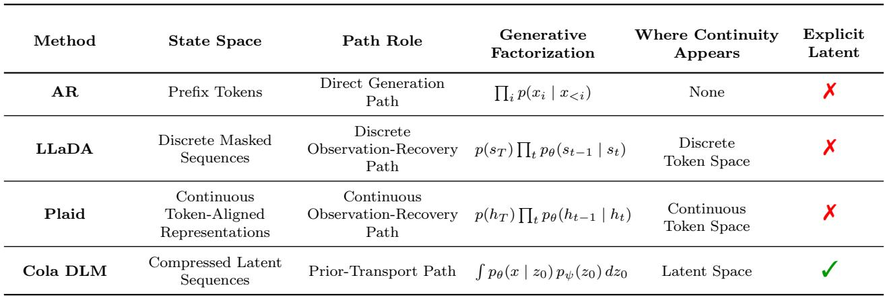

[← 返回 README](../README.md)

# 3 Continuous Latent Diffusion Language Model

> 📌 **Preview**: Cola DLM 的核心方法论，包括三层内容：(1) 严格概率建模（层次潜变量 + CNF 先验 + ELBO）; (2) 完整工作流（Text VAE → Block-Causal DiT → Inference）; (3) 统一 Markov-path 视角下与 AR/LLaDA/Plaid 的理论比较。本节奠定了 Cola DLM 的全部理论基础。

---

This section first presents Cola DLM as a hierarchical latent-variable language model with a rigorous probabilistic definition. We also outline the overall workflow of Cola DLM. We then place Cola DLM in a unified theoretical framework together with AR models, discrete denoising language models, and continuous token-space methods. Detailed derivations and proofs are deferred to Appendices A, B, C and D.

## 3.1 Theoretical Foundations of Cola DLM

In this subsection, we present Cola DLM as a hierarchical latent-variable language model with a rigorous probabilistic definition. We then introduce its unconditional and conditional probability estimators. Detailed derivations and proofs are provided in Appendices A and B.

### 3.1.1 Theoretical Formulation of Cola DLM

**Hierarchical latent-variable modeling.** Let $x \in \mathcal{X}$ denote a discrete text sequence, and let $z_0 \in \mathbb{R}^d$ denote its continuous latent variable. The generative model of Cola DLM consists of a conditional decoder $p_\theta(x \mid z_0)$ and a latent prior $p_\psi(z_0)$:

$$
p(x, z_0) = p_\theta(x \mid z_0) p_\psi(z_0), \qquad p(x) = \int p_\theta(x \mid z_0) p_\psi(z_0) dz_0 .
$$

Here, $q_\phi(z_0 \mid x)$ is used only for variational inference during training, and is not part of the generative model itself.

> 💡 **公式批读**: 这是 Cola DLM 的基础概率分解。关键点：(1) 生成模型仅由 $p_\theta(x|z_0)$ 和 $p_\psi(z_0)$ 定义，$q_\phi(z_0|x)$ 只是训练时的变分推断工具；(2) $p(x)$ 通过对潜变量 $z_0$ 的边缘化得到——这意味着模型的 likelihood 不是 token 级别的乘积，而是对连续潜空间的积分。这与 AR 的 chain-rule 分解形成了根本性的形式差异。

We model $p_\psi(z_0)$ with a continuous-flow prior. Let the base distribution be $p_1(z_1) = \mathcal{N}(0, I)$, and let $v_\psi(z_t, t)$ be the vector field. Then

$$
z_1 \sim p_1, \qquad \frac{d z_t}{d t} = v_\psi(z_t, t), \qquad z_0 = \Phi_{0 \leftarrow 1}^\psi(z_1),
$$

which induces $p_\psi = (\Phi_{0 \leftarrow 1}^\psi)_\sharp p_1$. In the sequence implementation, the latent is further decomposed into blocks, $z_0 = (z_0^{(1)}, \dots, z_0^{(B)})$, with

$$
p_\psi(z_0) = p_\psi(z_0^{(1)}) \prod_{b=2}^{B} p_\psi(z_0^{(b)} \mid z_0^{(<b)}) .
$$

This factorization directly corresponds to the block-causal prior learning and block-wise inference used later.

> 💡 **公式批读**: 先验 $p_\psi(z_0)$ 由两部分定义：一个连续归一化流（CNF）和一个 block-causal 分解。CNF 提供了灵活的连续分布建模能力，block-causal 分解使得推理时可以逐块生成。重要的是，block-causal 结构保留了跨块的因果依赖（避免了信息泄露），同时允许块内双向注意力（提高了局部语义聚合）。

**ELBO and prior learning.** By Jensen's inequality, the training lower bound of Cola DLM is

$$
\log p(x) \geq \mathbb{E}_{q_\phi(z_0 \mid x)} [\log p_\theta(x \mid z_0) + \log p_\psi(z_0) - \log q_\phi(z_0 \mid x)] =: \mathcal{L}_{\mathrm{ELBO}}(x).
$$

Training therefore maximizes $\mathcal{L}_{\mathrm{ELBO}}(x)$, or equivalently minimizes $-\mathcal{L}_{\mathrm{ELBO}}(x)$.

Let the aggregated posterior be $\bar{q}_\phi(z_0) = \int q_\phi(z_0 \mid x) p_{\mathrm{data}}(x) dx$. The expected ELBO can then be written as

$$
\mathbb{E}_{p_{\mathrm{data}}(x)} [\mathcal{L}_{\mathrm{ELBO}}(x)] = \mathbb{E}_{q(x, z_0)} [\log p_\theta(x \mid z_0)] - I_q(X; Z_0) - \mathrm{KL}(\bar{q}_\phi(z_0) \parallel p_\psi(z_0)),
$$

where $q(x, z_0) = p_{\mathrm{data}}(x) q_\phi(z_0 \mid x)$. This decomposition shows that Cola DLM separates text modeling into conditional reconstruction, information compression, and prior matching.

> 💡 **公式批读**: ELBO 的信息分解是理解 Cola DLM 设计哲学的关键公式。三项分别对应：(1) $\mathbb{E}[\log p_\theta(x|z_0)]$ —— 条件重建质量（decoder 从潜变量恢复文本的能力）；(2) $-I_q(X; Z_0)$ —— 信息压缩（潜变量保留了多少原文信息，越小压缩越强）；(3) $-\mathrm{KL}(\bar{q}_\phi \parallel p_\psi)$ —— 先验匹配（学习的先验 $p_\psi$ 与聚合后验 $\bar{q}_\phi$ 的匹配程度）。这解释了为什么 Cola DLM 需要三个组件（encoder, decoder, prior）协同工作。

When the encoder and decoder are fixed, prior learning reduces to

$$
\max_\psi \ \mathbb{E}_{z_0 \sim \bar{q}_\phi} [\log p_\psi(z_0)] \quad \Longleftrightarrow \quad \min_\psi \ \mathrm{KL}(\bar{q}_\phi(z_0) \parallel p_\psi(z_0)).
$$

In practice, we do not optimize the density directly. Instead, we learn the corresponding vector field with Flow Matching. For block $b$, the conditional FM objective is

$$
\mathcal{L}_{\mathrm{FM}} = \sum_{b=1}^{B} \mathbb{E}_{t, z_0, z_1} \left[ \left\| v_\psi(z_t^{(b)}, t; z_0^{(<b)}) - u_t^{(b)}(z_0, z_1) \right\|_2^2 \right].
$$

Flow Matching is therefore a solver for the prior in Cola DLM, rather than the definition of the model itself.

> 💡 **公式批读**: 此处的区分至关重要。Cola DLM 的概率模型是层次潜变量模型（由 ELBO 定义），Flow Matching 只是学习 CNF 先验的高效实现方式。换言之，FM 是一个 "prior solver"，而非模型定义本身。这一点在 Appendix A.4 中有严格的论证：直接优化 $\log p_\psi(z_0)$ 需要重复的 ODE 求解和散度估计，FM 通过回归条件速度场来避免这些开销。

**Summary.** The generative distribution of Cola DLM is defined by the hierarchical factorization in Eq. (3.1): the latent prior $p_\psi(z_0)$ generates global continuous semantics, and the decoder $p_\theta(x \mid z_0)$ realizes discrete text. The encoder $q_\phi(z_0 \mid x)$ is not part of the generative model, but an inference model that lifts the observed data distribution $p_{\mathrm{data}}(x)$ into a model-dependent latent joint distribution,

$$
q_\phi(x, z_0) = p_{\mathrm{data}}(x) q_\phi(z_0 \mid x), \qquad \bar{q}_\phi(z_0) = \int q_\phi(z_0 \mid x) p_{\mathrm{data}}(x) dx .
$$

Thus, while $p_{\mathrm{data}}(x)$ is fixed, the induced latent distribution $q_\phi$ is not. When the representation is fixed, prior learning fits $p_\psi$ to $q_\phi$. Under joint training, however, $q_\phi$ and $p_\psi$ co-evolve: the encoder reshapes the latent data distribution, while the learned prior regularizes and organizes the latent space. Flow Matching is therefore only an implementation choice for learning this prior transport; the underlying model remains a hierarchical latent-variable language model.

> 💡 **机制拆解**: "co-evolution" 是 Cola DLM 训练动态的核心概念。在标准 VAE 中，encoder 学习后，prior 固定地拟合聚合后验。但在 Cola DLM 的 joint training 中，encoder 和 prior 是共同演化的：encoder 不断重塑潜空间中的数据分布，而学到的 prior 反过来正则化并组织潜空间。这种动态交互是 Section 4.3 中 "Joint DiT x1 最优" 现象的理论基础。

### 3.1.2 Probability Estimation for Cola DLM

**Unconditional probability estimation.** At evaluation time, we approximate $\log p(x)$. For samples $z_0^{(k)} \sim q_\phi(z_0 \mid x)$, define the importance weight

$$
\log w^{(k)} = \log p_\theta(x \mid z_0^{(k)}) + \log p_\psi(z_0^{(k)}) - \log q_\phi(z_0^{(k)} \mid x).
$$

The prior term $\log p_\psi(z_0^{(k)})$ is evaluated by the CNF change-of-variables formula. Concretely, we solve the augmented ODE

$$
\frac{\mathrm{d}}{\mathrm{d} t} \begin{bmatrix} \boldsymbol{\xi}_t \end{bmatrix} = \begin{bmatrix} \boldsymbol{v}_\psi(\boldsymbol{z}_t, t) \\ \boldsymbol{\nabla} \cdot \boldsymbol{v}_\psi(\boldsymbol{z}_t, t) \end{bmatrix}, \qquad \begin{bmatrix} \boldsymbol{z}_0 \\ \boldsymbol{\ell}_0 \end{bmatrix} = \begin{bmatrix} \boldsymbol{z}_0^{(k)} \\ 0 \end{bmatrix},
$$

from $t = 0$ to $t = 1$, yielding $(z_1^{(k)}, \ell_1^{(k)})$. We then obtain

$$
\log p_\psi(z_0^{(k)}) = \log p_1(z_1^{(k)}) + \ell_1^{(k)},
$$

where $p_1$ is the terminal base distribution. In high dimensions, the divergence term is estimated with Hutchinson's trace estimator:

$$
\nabla \cdot \boldsymbol{v}_\psi(z_t, t) = \mathrm{Tr}\left( \frac{\partial \boldsymbol{v}_\psi(z_t, t)}{\partial z_t} \right) \approx \epsilon^\top \frac{\partial \boldsymbol{v}_\psi(z_t, t)}{\partial z_t} \epsilon, \qquad \epsilon \sim \mathcal{N}(0, I),
$$

where the same $\epsilon$ is fixed within one ODE solve.

This gives two standard estimators, namely the ELBO-style and IWAE-style estimators:

$$
\log \widehat{p}_{\mathrm{ELBO}, K}(x) = \frac{1}{K} \sum_{k=1}^{K} \log w^{(k)}, \qquad \log \widehat{p}_{\mathrm{IWAE}, K}(x) = \log\left( \frac{1}{K} \sum_{k=1}^{K} e^{\log w^{(k)}} \right).
$$

The IWAE-style estimator is typically tighter.

> 💡 **公式批读**: 概率估计是 Cola DLM 与 AR 模型的一个重要实用差异。AR 模型的 $\log p(x)$ 可以直接通过 chain rule 累加得到；而 Cola DLM 需要：(1) 从 $q_\phi$ 采样多个 $z_0$；(2) 通过 augmented ODE 计算 $\log p_\psi(z_0)$（包含 Hutchinson 迹估计）；(3) 构造 importance weight；(4) 用 IWAE 聚合。这个多步骤过程解释了为什么 Cola DLM 的 PPL 评估成本远高于 AR 模型。

**Conditional probability estimation.** For a prefix-response decomposition $x = (x_{\mathrm{pre}}, x_{\mathrm{res}})$, the exact identity is

$$
\log p(x_{\mathrm{res}} \mid x_{\mathrm{pre}}) = \log p(x_{\mathrm{pre}}, x_{\mathrm{res}}) - \log p(x_{\mathrm{pre}}).
$$

We therefore obtain a plug-in estimator by scoring the joint sequence and the prefix with the same unconditional estimator:

$$
\log \widehat{p}(x_{\mathrm{res}} \mid x_{\mathrm{pre}}) = \log \widehat{p}(x_{\mathrm{pre}}, x_{\mathrm{res}}) - \log \widehat{p}(x_{\mathrm{pre}}).
$$

---

*Figure 1: The Overall Workflow of Cola DLM. Detailed illustration of the training and inference pipeline of Cola DLM. Training Stage 1 shows Text VAE pretraining with reconstruction, BERT, and KL losses. Training Stage 2 shows joint pretraining of the Text VAE and Text DiT with gradient control for stable optimization, where a specialized block-causal mechanism is adopted in the DiT. Inference Stage illustrates the decoding process with KV cache.*

> 💡 **Figure 1 批读**: 这张图展示了 Cola DLM 完整的三阶段流程。Stage 1（Text VAE 预训练）的目标是建立一个稳定的 text-latent 映射，但此时使用的是 base prior $p_{\mathrm{base}}$（简单的标准高斯），而非最终的生成先验。Stage 2（joint training）中，block-causal DiT 学习最终的 latent prior $p_\psi(z_0)$，同时 VAE 保持可训练（但受 reference regularization 约束以防潜空间漂移）。Inference 阶段的 block-wise sampling 是 Cola DLM 推理效率的关键设计。

## 3.2 Workflow of Cola DLM

In this section, we describe the overall workflow of Cola DLM in detail. As illustrated in Figure 1, we explain the method from three perspectives: the pretraining of the Text VAE, the pretraining of prior learning with the Text DiT, and the inference process of Cola DLM.

### 3.2.1 Text VAE Pretraining

In the first stage, we learn a stable latent-text correspondence. The encoder maps text into the latent space, and the decoder reconstructs the original text conditioned on the latent:

$$
z_0 \sim q_\phi(z_0 \mid x), \qquad \hat{x} \sim p_\theta(x \mid z_0).
$$

The goal of this stage is not to learn the final prior, but to establish a stable division of labor between information stored in the latent and information recovered by the decoder.

> 💡 **机制拆解**: Stage 1 的核心目标不是"学好先验"，而是"建立稳定的分工"——确定哪些信息由潜变量承载，哪些信息由 decoder 从上下文中恢复。这个分工直接决定了后续 prior learning 的难度：如果 encoder 把所有信息都塞进 $z_0$（即 $I(X;Z_0)$ 很大），那么 decoder 的任务变得简单，但 prior $p_\psi(z_0)$ 需要拟合一个非常复杂的分布；反之，如果 $z_0$ 只携带粗粒度的全局语义，prior 容易学习，但 decoder 需要更强的条件生成能力。

The corresponding objective is

$$
\mathcal{L}_{\mathrm{VAE}} = -\mathbb{E}_{q_\phi(z_0 \mid x)} \log p_\theta(x \mid z_0) + \beta \mathrm{KL}(q_\phi(z_0 \mid x) \parallel p_{\mathrm{base}}(z_0)) + \lambda_{\mathrm{mask}} \mathcal{L}_{\mathrm{mask}}.
$$

Here, $\mathcal{L}_{\mathrm{mask}}$ is the BERT-style masking loss shown in the figure. It prevents the VAE encoder from collapsing semantically while the decoder merely memorizes surface text. In our experiments, the VAE does not compress the sequence length. To prevent information leakage and facilitate subsequent streaming generation, both our VAE encoder and decoder are strictly causal.

> 💡 **公式批读**: VAE 训练目标由三部分组成：(1) 重建损失 $-\mathbb{E} \log p_\theta(x|z_0)$ —— 确保潜变量携带足够信息以恢复原文；(2) KL 正则 $\beta \mathrm{KL}(q_\phi \parallel p_{\mathrm{base}})$ —— 防止潜空间过度分散，使其保持在一定结构内；(3) BERT-style masking loss $\mathcal{L}_{\mathrm{mask}}$ —— 鼓励潜空间保持语义平滑性（masked token 的可恢复性），防止 encoder 塌缩为简单的文本记忆。重要的是，VAE 不压缩序列长度（patch size = 1），encoder/decoder 都是严格 causal 的，避免了后续 streaming generation 时的信息泄露。

### 3.2.2 Prior Learning with Block-Causal DiT

In the second stage, we learn a conditional prior on the stabilized latent space. For block $b$, the visible set consists of the historical clean latent blocks and the current noisy block:

$$
\mathcal{V}_b = \left\{ \mathrm{sg}(z_0^{(<b)}), z_t^{(b)} \right\},
$$

where $\mathrm{sg}(\cdot)$ denotes stop-gradient. This visibility constraint enforces bidirectional attention within each block and causal dependence across blocks, consistent with Eq. (3.3).

> 💡 **机制拆解**: Block-causal attention 的设计精妙之处：对于 block b 内的 token，可以做双向注意力（充分利用 block 内部的语义上下文）；对于 block b 之前的 block，只能单向因果注意（保持生成时的因果性）；对于 block b 之后的 block，不可见（防止信息泄露）。sg（stop-gradient）确保历史 clean latent 不会被当前 noisy block 的梯度反向传播破坏。

Under this design, prior learning uses a joint objective that combines conditional Flow Matching with a reference-encoder regularizer:

$$
\begin{aligned}
\mathcal{L}_{\mathrm{stage2}} = & \lambda_{\mathrm{VAE}} \left( -\mathbb{E}_{q_\phi(z_0|x)} \log p_\theta(x \mid z_0) + \beta \mathbb{E}_{q_\phi(z_0|x)} \log q_\phi(z_0 \mid x) + \lambda_{\mathrm{mask}} \mathcal{L}_{\mathrm{mask}} \right) \\
& + \lambda_{\mathrm{fm}} \mathcal{L}_{\mathrm{FM}} + \lambda_{\mathrm{ref}} \mathbb{E}_{p_{\mathrm{data}}(x)} \mathrm{KL}\left( q_\phi(z_0 \mid x) \parallel q_{\phi_{\mathrm{ref}}}(z_0 \mid x) \right).
\end{aligned}
$$

The first group preserves the autoencoding structure with regularized latent learning, the second term learns the block-level conditional prior, and the third term suppresses latent drift during joint training.

> 💡 **公式批读**: Stage 2 的联合目标包含三组项：(1) VAE 项（重建 + 正则 + BERT）——保持 text-latent 映射的稳定性；(2) FM 项 —— 在潜空间中学习 conditional prior；(3) Reference regularization —— 限制 encoder 在 joint training 期间不要偏离预训练 encoder 太远（防止 latent drift）。这个 reference regularization 是 Cola DLM 能够在 joint training 中保持稳定的关键，否则 encoder 可能为了适应 prior 而不断改变潜空间结构，导致训练不稳定。

### 3.2.3 Inference: Prefix Encoding, Block-wise Generation, and Conditional Decoding

At inference time, the model first encodes the prefix into clean latent conditions:

$$
z^{\mathrm{pre}} \sim q_\phi(z^{\mathrm{pre}} \mid x^{\mathrm{pre}}).
$$

It then generates the response latent block by block. Each block is obtained by transporting a noise seed under the historical condition:

$$
\hat{z}_0^{(b)} = \Phi_{0 \leftarrow 1}^\psi \left( \epsilon^{(b)}; z^{\mathrm{pre}}, \hat{z}_0^{(<b)} \right), \qquad \epsilon^{(b)} \sim \mathcal{N}(0, I).
$$

Finally, the decoder outputs the text response conditioned on the prefix and the generated latent blocks:

$$
\hat{x}^{\mathrm{res}} \sim p_\theta \left( x^{\mathrm{res}} \mid z^{\mathrm{pre}}, \hat{z}_0^{(1:B)} \right).
$$

> 💡 **机制拆解**: 推理过程三步走：(1) Prefix Encoding —— 将已知前缀编码为 clean latent condition；(2) Block-wise Generation —— 逐块从噪声种子通过 ODE 传输生成响应潜变量，每个块条件于前缀和之前生成的块（这正是 block-causal 设计在推理时的体现）；(3) Conditional Decoding —— decoder 基于前缀和所有生成的潜变量块输出文本。这个流程实现了 latent-space 中的 block-wise autoregressive generation。

**Summary.** The workflow of Cola DLM implements the above hierarchical probabilistic model through two training stages and one inference stage, rather than a mechanical cascade of VAE, DiT, and decoder. In Stage 1, the base prior $p_{\mathrm{base}}$ regularizes the latent-text interface and stabilizes the autoencoding representation, but it is not the final generative prior. In Stage 2, the block-causal DiT learns the final latent prior $p_\psi(z_0)$ while the VAE remains trainable under reconstruction, masking, and reference regularization. This makes prior learning a controlled co-adaptation between the latent representation and the learned flow prior. At inference time, the model encodes the prefix, generates future latent blocks autoregressively in latent space, and realizes the response through the conditional decoder.

## 3.3 A Unified View of Cola DLM and Existing Methods

In this section, we compare Cola DLM with AR, LLaDA, and Plaid under a unified Markov-path perspective, and theoretically characterize the specific advantages of Cola DLM. More detailed analysis and proofs are provided in Appendices C and D.

### 3.3.1 Text Modeling under a Unified Stochastic-Path View

For a unified comparison, let $\tau = (S_t)_{t \in \mathcal{T}}$ be a stochastic process on state space $\boldsymbol{S}$, with initial distribution $\mu_\Theta$, transition kernel $K_t^\Theta$, and emission mechanism $e_\Theta(x \mid \tau)$. A process-based generative model can be written as

$$
p_\Theta(x) = \int e_\Theta(x \mid \tau) P_\Theta(d\tau), \qquad P_\Theta(d\tau) = \mu_\Theta(ds_0) \prod_{t > 0} K_t^\Theta(ds_t \mid s_{<t}).
$$

This common outer form does not determine the nature of the model. The essential distinction lies in the state space of the path and its semantic role: a path over text or near-lossless text-aligned representations is an observation path, whereas a path used only to generate a latent prior is a prior path.

> 💡 **公式批读**: "Unified Markov-path view" 是这篇文章最具理论深度的贡献之一。它指出，仅看模型是否有 Markov 过程、是否使用扩散是不够的——真正区分模型的关键在于：(1) **状态空间是什么**（token? embedding? latent?）；(2) **路径的角色是什么**（observation recovery? prior transport?）。这个区分澄清了为什么 Cola DLM 与 Plaid 虽然都在连续空间中使用扩散，但本质上是不同类型的模型。

For AR, the path is the prefix expansion itself, yielding an exact chain factorization but binding generation to a left-to-right filtration:

$$
p_{\mathrm{AR}}(x) = \prod_{i=1}^{L} p_\eta(x_i \mid x_{<i}).
$$

For LLaDA, the path is a discrete corruption-recovery trajectory, whose objective is observation reconstruction in a discrete state space:

$$
q(s_{1:T} \mid x) = q_1(s_1 \mid x) \prod_{t=2}^{T} q_t(s_t \mid s_{t-1}), \qquad p_\theta(s_{0:T}) = p(s_T) \prod_{t=1}^{T} p_\theta(s_{t-1} \mid s_t).
$$

Thus, LLaDA weakens the handcrafted left-to-right bias, but still modifies the observation-recovery process rather than introducing an explicit hierarchical latent variable.

*Table 1: Unified Perspective. Key differences among text models under a unified Markov-path view.*

> 💡 **Table 1 批读**: 该表从 State Space、Path Role、Generative Factorization、Where Continuity Appears、Explicit Latent 五个维度对四种模型进行了系统比较。核心差异：AR 的路径是 "Direct Generation Path"（token 级别），LLaDA 和 Plaid 是 "Observation-Recovery"（离散和连续形式），而 Cola DLM 是 "Prior-Transport Path"（潜变量级别）。只有 Cola DLM 拥有 Explicit Latent。

Plaid further moves this recovery process to a continuous token-aligned representation $h_0 = E(x)$:

$$
q(h_{1:T} \mid h_0) = q_1(h_1 \mid h_0) \prod_{t=2}^{T} q_t(h_t \mid h_{t-1}), \qquad p_\theta(h_{0:T}) = p(h_T) \prod_{t=1}^{T} p_\theta(h_{t-1} \mid h_t).
$$

Its core target is therefore continuous observation recovery, rather than a decomposition into a prior and a conditional decoder.

In Cola DLM, by contrast, the stochastic path only transports the latent prior:

$$
z_1 \sim p_1, \qquad z_0 = \Phi_{0 \leftarrow 1}^\psi(z_1), \qquad x \sim p_\theta(x \mid z_0),
$$

with the marginal still given by Eq. (3.1). Hence, diffusion is used to learn a flexible continuous prior, not to impose a left-to-right inductive bias on text.

The reason for using a continuous path is not that continuous modeling is inherently superior, but that it naturally captures the geometry of the latent distribution. In Cola DLM, continuity appears in $p_\psi(z_0)$, rather than in an observation-recovery trajectory:

$$
\frac{d z_t}{d t} = v_\psi(z_t, t), \qquad p_\psi = (\Phi_{0 \leftarrow 1}^\psi)_\sharp p_1.
$$

Thus, the distinction between Cola DLM and LLaDA lies in both state space and modeling target.

> 💡 **机制拆解**: 这段澄清了一个容易被误解的点：Cola DLM 使用连续路径不是因为"连续比离散更好"，而是因为连续空间天然适合捕捉潜分布的几何结构。Cola DLM 的连续性是 $p_\psi(z_0)$ 的性质，而非 observation-recovery trajectory 的性质。这与 LLaDA（离散状态空间，离散路径）和 Plaid（连续 token-aligned 状态空间，连续观测恢复路径）形成明确的三方对比。

Finally, the reason for using a latent variable is to explicitly separate semantic structure from token realization. The information decomposition of the expected ELBO,

$$
\mathbb{E}_{p_{\mathrm{data}}(x)} [\mathcal{L}_{\mathrm{ELBO}}(x)] = \mathbb{E}_{q(x, z_0)} [\log p_\theta(x \mid z_0)] - I_q(X; Z_0) - \mathrm{KL}(\bar{q}_\phi(z_0) \parallel p_\psi(z_0)),
$$

shows that $z_0$ is not merely a continuous surrogate for discrete text, but an explicit marginalized intermediate variable: global semantics are compressed into $z_0$, while local token realization is delegated to the decoder.

### 3.3.2 Theoretical Advantages of Cola DLM

**A unified criterion.** Let the lower bound of the approximation error for a model family $\mathcal{M}$ be

$$
\mathcal{E}(\mathcal{M}) := \inf_{p \in \mathcal{M}} \mathrm{KL}(p_{\mathrm{data}}(x) \parallel p(x)).
$$

For AR, the population risk is determined solely by $\mathcal{E}(\mathcal{M}_{\mathrm{AR}})$. In contrast, Cola DLM also incurs a variational inference gap:

$$
G_{\mathrm{infer}}^{\mathrm{Cola DLM}} := \mathbb{E}_{p_{\mathrm{data}}(x)} \mathrm{KL}\big( q_\phi(z_0 \mid x) \parallel p_{\theta,\psi}(z_0 \mid x) \big).
$$

Its total statistical burden is therefore

$$
R_{\mathrm{Cola DLM}} = \mathcal{E}(\mathcal{M}_{\mathrm{Cola DLM}}) + \inf_{\phi,\theta,\psi} G_{\mathrm{infer}}^{\mathrm{Cola DLM}}.
$$

**Proposition 3.1 (Unified criterion).** At the population level, Cola DLM outperforms a comparison model if and only if its total statistical burden is smaller. Taking AR as an example,

$$
Cola DLM \succ \mathrm{AR} \quad \Longleftrightarrow \quad R_{\mathrm{Cola DLM}} < \mathcal{E}(\mathcal{M}_{\mathrm{AR}}).
$$

> 💡 **公式批读**: Proposition 3.1 给出了 Cola DLM 优于 AR 的充要条件。注意 Cola DLM 有两项负担：(1) 模型族的逼近误差 $\mathcal{E}$；(2) 变分推断 gap $G_{\mathrm{infer}}$。而 AR 只有 $\mathcal{E}$。这意味着，Cola DLM 的优势不是免费的——它必须通过更好的表示结构（使 $\mathcal{E}(\mathcal{M}_{\mathrm{Cola DLM}}) \ll \mathcal{E}(\mathcal{M}_{\mathrm{AR}})$）来补偿额外的推断 gap。这也是为什么 Section 4.2 要验证"全局语义结构存在"——如果不存在，那么 $\mathcal{E}$ 优势就无法实现。

**Rate-distortion and structured generation.** Whether a latent bottleneck is beneficial depends on whether the data admits a low-rate but informative global representation. Define the representation rate-distortion function as

$$
D(R) := \inf_{\substack{q(z_0|x): \\ I_q(X;Z_0) \leq R}} \inf_{p_\theta(x|z_0)} \mathbb{E}_{q(x,z_0)} [-\log p_\theta(x \mid z_0)].
$$

If $D(R)$ is already small at a low rate $R$, then the data admits a low-dimensional semantic variable, and a latent bottleneck is more likely to reduce the overall mismatch. Conversely, if high-quality reconstruction requires a high information rate, aggressive compression only makes conditional reconstruction harder.

This can be characterized further through a structured-generation assumption. Suppose there exists a global variable $G$ such that

$$
p_{\mathrm{data}}(x) = \int p^\star(x \mid g) p^\star(g) dg, \qquad H(X \mid G) \ll H(X), \qquad \mathrm{dim}(G) \ll \mathrm{dim}(E(X)),
$$

then the factorization of Cola DLM is closer to the true generative mechanism: the prior models the distribution of $G$, while the decoder handles conditional realization. In this case, the latent bottleneck helps rather than hurts.

> 💡 **公式批读**: Rate-distortion 分析回答了"什么时候潜瓶颈是有益的"这一核心问题。关键条件是数据是否具有 "low-dimensional global semantics + high-dimensional local realization" 的结构。如果文本确实是分层结构的（高层次语义低维，低层次实现高维），那么 Cola DLM 的分解就更接近真实的生成机制。Section 4.2 的实验（global semantic structures）正是为了验证这个前提条件。

**Three governing curves and the applicability boundary.** The applicability of Cola DLM is ultimately determined by three curves: the representation rate-distortion curve $D(R)$, the prior approximation curve, and the inference-gap curve $G_{\mathrm{infer}}^{\mathrm{Cola DLM}}$. More compactly,

$$
\begin{aligned}
Cola \mathrm{DLM\ is\ advantageous} \Longleftrightarrow & \ \big[ D(R) \mathrm{\ is\ already\ small\ at\ low\ } R \big] \\
& \wedge \big[ \mathcal{E}(\mathcal{M}_{\mathrm{Cola DLM}}) \mathrm{\ decreases} \big] \\
& \wedge \big[ G_{\mathrm{infer}}^{\mathrm{Cola DLM}} \mathrm{\ is\ controllable} \big].
\end{aligned}
$$

The benefit of Cola DLM is therefore not guaranteed by diffusion or continuity alone. It depends on whether the data exhibits a structure with low-dimensional global semantics and high-dimensional local token realization.

> 💡 **消融解读**: 这三个条件直接对应于后续实验的设计逻辑：
> - Condition 1 ($D(R)$ small at low $R$) → Section 4.2 (RQ1: 验证全局语义结构存在)
> - Condition 2 ($\mathcal{E}$ decreases) → Section 4.5 (RQ4: 验证 scaling 行为)
> - Condition 3 ($G_{\mathrm{infer}}$ controllable) → Section 4.3 (RQ2: 验证潜空间质量，特别是 Joint DiT 策略)

**Summary.** The central advantage of Cola DLM is not denoising itself, but the latent decomposition that separates text modeling into a global prior and a conditional realization process.

---

🔖 **Summary**: Section 3 establishes Cola DLM on three levels. **(1) Probabilistic foundation**: Hierarchical latent-variable model with CNF prior, ELBO decomposition into reconstruction/compression/prior-matching, and IWAE-based probability estimation. **(2) Workflow**: Three-stage process -- Text VAE pretraining (stable latent-text mapping), joint prior learning with block-causal DiT (co-adaptation of latent space and prior), and block-wise inference (prefix encoding + latent generation + conditional decoding). **(3) Unified view**: Markov-path analysis distinguishes Cola DLM (prior-transport path, latent space, explicit latent variable) from AR (direct generation), LLaDA (discrete observation-recovery), and Plaid (continuous observation-recovery). The theoretical advantage depends on three conditions: favorable rate-distortion curve, decreasing approximation error, and controllable inference gap.
