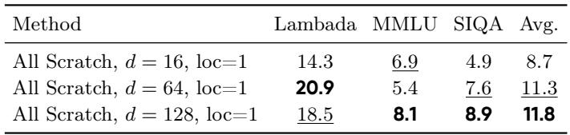
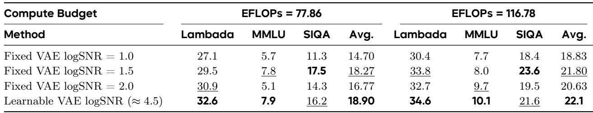

[← 返回 README](../README.md)

# 4 Experiments

> 📌 **Preview**: Cola DLM 的实验部分围绕四个 research questions 展开：RQ1（全局语义结构是否存在）、RQ2（最优潜空间类型）、RQ3（扩散过程的消融）、RQ4（scaling 性能对比）。所有实验在严格匹配的 ~2B 参数设置下进行，使用统一的 few-shot 生成式评估协议，而非传统的 likelihood-based 评估。

---

In this section, we conduct experiments to address the following research questions:

- **RQ1**: Does a global semantic structure exist within the latent space?
- **RQ2**: What type of latent space is optimal for text generation?
- **RQ3**: Which diffusion process is most effective for text generation?
- **RQ4**: Why use a continuous latent diffusion model for language modeling?

## 4.1 Experimental Setup

**Datasets.** For training, we use external open-source pretraining data. For evaluation, the internal component analysis of Cola DLM (Sections 4.2, 4.3 and 4.4) is conducted on randomly sampled subsets from the test sets of LAMBADA [74], MMLU [33], and SIQA [82]. LAMBADA is a continuation benchmark, whereas the remaining two are multiple-choice benchmarks. For external comparisons (Section 4.5), we additionally evaluate on the test sets of SQuAD [78], Story Cloze [68], OBQA [64], RACE [48], and HellaSwag [107]. Additional dataset details are deferred to Appendix H.1.

**Baselines.** In the internal component comparison experiments (Sections 4.2, 4.3 and 4.4), we specify the different configurations of Cola DLM. In Section 4.5, for the scaling comparison, we independently train the autoregressive and LLaDA baselines under strictly matched settings. Specifically, the autoregressive and discrete diffusion models are randomly initialized using the official modeling implementations of LLaMA [92] and LLaDA [70], respectively. Details are provided in Appendix H.2.

**Metrics.** As discussed in Section 5.1, the estimated perplexity exhibits a substantial mismatch with the actual generation quality of Cola DLM. Moreover, prior work [32, 34, 61, 97] has noted that perplexity is not strictly correlated with generation performance. To enable the most objective and fair comparison, we therefore evaluate all models under a unified few-shot setting across both multiple-choice and generative tasks. For multiple-choice benchmarks and continuation tasks such as Lambada and SQuAD, accuracy is computed by strict string matching between the model output and the ground-truth answer under predefined rules. Additional evaluation details are provided in Appendix H.3.

> 💡 **机制拆解**: 使用统一的 few-shot 生成式评估（而非 PPL）是一个重要的方法论选择，源于 Section 5.1 的理论分析——Cola DLM 的 PPL 与生成质量不匹配。但这也带来了一个副作用：在 multiple-choice 任务上的绝对分数较低（Figure 10 中可见），因为这些任务原本更适合 discriminative evaluation。作者的立场是：在统一协议下的相对 scaling trends 比绝对分数更有信息量。

**Setup.** Cola DLM uses the OLMo 2 [71] tokenizer and is trained with AdamW. The learning rate starts at $1 \times 10^{-6}$, is linearly warmed up to $1.5 \times 10^{-4}$ over the first 5,000 steps, and is then decayed with a cosine schedule to $1 \times 10^{-5}$ by 1,000,000 steps. All evaluations are conducted using the checkpoint at the corresponding FLOPs budget, without EMA weights. The same tokenizer, optimization and evaluation settings are used for Cola DLM and all external baselines. In Cola DLM, the VAE contains 500M parameters and the DiT contains 1.8B parameters. For the autoregressive and discrete diffusion baselines, the embedding layer has approximately 400M parameters and the non-embedding backbone has 1.8B parameters. We thus keep the total model size of the two model families at a comparable scale of roughly 2B parameters. All methods are trained with the same random seed so that the training data are matched across runs, with the maximum sequence length set to 512. Additional details are provided in Appendix H.4 and H.5.

> 💡 **实验设计批注**: 几个关键的实验设计选择：(1) "strictly matched" —— 相同的 tokenizer、优化器、随机种子、序列长度，确保公平比较；(2) "no EMA" —— 不使用指数移动平均权重，使得 FLOPs 到性能的映射更直接；(3) 参数分配 —— Cola DLM 的 VAE (500M) + DiT (1.8B) = 2.3B，而 AR/LLaDA = embedding (400M) + backbone (1.8B) = 2.2B，规模可比。

## 4.2 Evidence of Global Semantic Structures in Cola DLM (RQ1)

In this section, we first present an implication for the existence of global semantic structures, and then provide strong empirical evidence for their existence by quantitatively examining the performance of latent spaces with different dimensions under different timestep shifts. The full theoretical derivation, proof, and technical details are provided in Appendix E.

**Implication 1.** If the latent representation is purely local and fully separable, then the optimal timeshift does not exhibit a stable drift as the latent dimension changes. Therefore, if the optimal timeshift is observed to shift systematically with the latent dimension in experiments, this indicates the existence of cross-dimensional shared structures in the latent space; if this phenomenon is mainly reflected in semantic metrics, it further supports that these shared structures are related to high-level semantics.

> 💡 **机制拆解**: Implication 1 是一个精巧的反证法设计。如果潜空间是纯局部且完全可分离的（每个维度独立，不共享结构），那么改变维度不应该引起最优 timestep shift 的系统性漂移。实验观察到的系统性漂移因此构成"存在 cross-dimensional shared structure"的证据。这是一个通过否定 null hypothesis 来验证全局语义结构存在的间接证明策略。

Based on Implication 1, the focus of this section is not merely on the specific optimal loc values under different latent dimensions, but on whether the peak position of the optimal timeshift exhibits a stable and regular shift as the latent dimension varies. Figure 2 presents the corresponding experimental results.

*Figure 2: Evidence of global semantic structures in the latent space. Left: as latent dimension increases, optimal timeshifts move toward larger locations, with empirical peaks matching predictions. Right: most of the evaluation metrics consistently prefer larger best locations at higher dimensions. This stable cross-metric trend supports shared global semantic structures within the latent space.*

> 💡 **Figure 2 批读**: 左图展示了三个维度设置下的 empirical peak 与理论预测（虚线）的高度一致，漂移方向完全匹配。右图展示了跨多个语义评估指标的稳定性（LAMBADA, MMLU, SIQA 都偏好更大的 loc 值随维度增加），排除了"单任务偶然波动"的可能性。

**Obs. 1** The optimal timeshift exhibits a systematic drift with the latent dimension. As shown in the left panel of Figure 2, the best loc for Task Avg shifts from approximately 1.0 at $d = 16$, to approximately 1.7 at $d = 64$, and further to approximately 2.3 at $d = 128$. This trend is clear and approximately monotonic. This phenomenon directly contradicts the separable null hypothesis. A more plausible explanation is that changing the latent dimension alters the effective noise calibration position of some cross-dimensional shared structure.

**Obs. 2** This trend is consistent across multiple semantic metrics. The right panel of Figure 2 further shows that, although the best loc values for LAMBADA, MMLU, SIQA, and Task Avg are not exactly the same, they all overall favor larger loc regions as the latent dimension increases. This indicates that the peak drift is not an accidental fluctuation of any single task, but rather a stable phenomenon jointly supported by multiple semantic evaluations. Therefore, what is modulated by timeshift is a representation structure shared across different semantic tasks.

**Obs. 3** The empirical peaks are broadly consistent with the theoretical predictions. In the left panel of Figure 2, the dashed lines indicate the theoretically predicted optimal loc values. It can be seen that, under all three latent-dimension settings, the empirical peaks are close to the predicted positions, and the drift directions are fully consistent. This suggests that the observed drift is not an arbitrary empirical hyperparameter effect, but is instead consistent with the theoretical analysis in Appendix E, namely that shared latent structures lead to dimension-dependent timeshift calibration.

> 💡 **消融解读**: RQ1 的三个观察共同指向一个结论：潜空间中确实存在跨维度的共享语义结构。这直接支持了 Section 3.3.2 中理论分析的 Condition 1（$D(R)$ 在低 rate 下已经较小），即文本具有可压缩的全局语义特征。如果这个条件不成立，Cola DLM 的整个理论框架就会动摇。

Implication 1 provides a rigorous contrapositive statement for the existence of global semantic structures, while the experimental results, by providing reverse evidence for this contrapositive, offer strong empirical support for the existence of shared and semantically relevant global structures in the latent space of Cola DLM. This also provides supporting evidence for the first condition in Eq. (3.35) of Section 3.3.2, thereby further supporting the advantage of Cola DLM.

## 4.3 Analysis of Different Latent Spaces in Cola DLM (RQ2)

In this section, we present a detailed empirical study of different latent spaces through both quantitative evaluation and visualization. We analyze the design of the latent space from three perspectives: whether it should be dynamic or static, what latent dimensionality is most appropriate, and how semantic smoothness contributes to latent-space quality. Based on these analyses, we identify the most effective directions for optimizing the latent space.

### Fixed vs. Evolving Latent Space

As shown in Figure 3, this section studies whether the latent space should evolve jointly with DiT during training. Under the same compute budget, we compare five strategies: fixing a pretrained VAE (Fix VAE); initializing the VAE from pretrained weights and jointly training it with DiT using a VAE learning rate equal to that of DiT or scaled to 0.01x (Joint DiT x1 / Joint DiT x0.01); jointly training both VAE and DiT from random initialization with the same learning rate (All Scratch x1); and an interval-based strategy (Interval), where each 5k-step cycle consists of 2k steps of joint training followed by 3k steps with the VAE frozen. The overall results suggest that the latent space should neither remain fully fixed nor be jointly optimized from scratch without constraint. Instead, the most effective strategy is to let it evolve together with DiT on top of a stable initialization.

*Figure 3: Comparison between fixed and evolving latent spaces. Across Task Average, LAMBADA, MMLU, and SIQA, joint evolution with DiT achieves the best overall scaling and performance when initialized from a stable pretrained VAE. Fixed spaces lead to earlier saturation, while training from scratch or interval updates remains less effective. This suggests the space should evolve with DiT, but from a stable initialization rather than scratch.*

> 💡 **Figure 3 批读**: 五种策略的对比清楚地展示了"稳定初始化 + 持续共同演化"是最优策略。关键发现：Fix VAE 在早期提供了稳定性，但后期饱和（性能天花板较低）；All Scratch 表现最差（缺乏好的初始化）；Joint DiT x1 在稳定初始化的基础上保持了最强的 scaling 潜力。

**Obs. 1** Joint DiT x1 shows the strongest scaling potential. At small compute budgets, Fix VAE and Joint DiT x1 are close, and Fix VAE is sometimes slightly better. As FLOPs increase, however, Joint DiT x1 improves more steadily and achieves the best final results on Task Avg, LAMBADA, MMLU, and SIQA, whereas Fix VAE gradually saturates. This indicates that a fixed latent space helps early stability but limits the performance ceiling, while continuous co-adaptation with DiT is more beneficial for scaling.

**Obs. 2** The benefit of joint training depends on good initialization rather than trainability alone. All Scratch x1 performs consistently worse than the other methods across all metrics, and its gains remain limited throughout training. This suggests that the advantage of Joint DiT x1 does not come from making the latent space trainable by itself; it relies on starting from a meaningful pretrained latent space and then adapting it jointly with DiT.

**Obs. 3** The latent-space visualization explains why All Scratch underperforms.

*Figure 4: Visualization of latent spaces under different training strategies. Joint optimization on a stable initialization yields a more structured, semantically organized latent space than training VAE and DiT from scratch. Increasing the latent dimension (16 to 128) partially mitigates collapse but remains less structured than the stable-initialization approach.*

> 💡 **Figure 4 批读**: 潜空间可视化提供了几何直觉。All Scratch + d=16 产生的是塌缩的、由简单外漂主导的潜空间轨迹；Joint DiT 产生更异质、更丰富的轨迹模式。增加维度（16→128）部分缓解了塌缩，但几何结构仍然不如稳定初始化 + joint training 的情况。

Figure 4 shows that All Scratch with $d = 16$ yields a more collapsed and less structured latent space, with trajectories dominated by simple outward drift. Increasing the latent dimension to 128 partially alleviates this issue, but the geometry still remains less organized than that of Joint DiT with stable initialization. In contrast, Joint DiT produces more heterogeneous latent patterns and richer trajectories, suggesting a more structured and semantically usable space.

**Obs. 4** Effective latent evolution requires both continuous participation and sufficient update strength. Joint DiT x0.01 and Interval are both better than All Scratch x1, but still clearly worse than Joint DiT x1 in overall trend and final performance. This shows that partial latent participation is not enough: overly weak updates slow adaptation, while periodic freezing disrupts co-evolution with DiT. A better strategy is to update the latent space continuously and strongly, while keeping the initialization stable.

Overall, Figure 3 and Figure 4 consistently show that the best latent-space strategy is neither to keep it fixed nor to train it from scratch, but to let it evolve jointly with DiT on top of a good initialization. When the VAE and DiT are trained jointly, the VAE is exposed to more data and can fit $p_{\mathrm{data}}(z|x)$ more accurately. This further verifies the last condition in Eq. (3.35) of Section 3.3.2, and provides strong support for the potential advantage of Cola DLM. Additional results are in Appendix H.6.

### Dimensionality of the Latent Space

We next study how the latent dimensionality affects both performance and latent-space quality. Table 2 compares All Scratch models with different latent dimensions under the same EFLOPs budget (117), Figure 4 provides the corresponding latent-space visualization, and Figure 2 shows how the optimal timeshift changes with dimension. Taken together, these results suggest that increasing the latent dimension partially alleviates collapse and improves semantic capacity, but it also changes the effective noise calibration of the latent space.

*Table 2: Dimensionality of the latent space under 117 EFLOPs. Larger latent dimensions improve the overall average under the all-scratch setting with loc = 1.*

**Obs. 1** Increasing the latent dimension improves the overall semantic capacity under the same compute budget. As shown in Table 2, the average score increases from 8.7 at $d = 16$ to 11.3 at $d = 64$, and further to 11.8 at $d = 128$. The improvement is most evident on MMLU and SIQA. Although LAMBADA peaks at $d = 64$, the overall trend still suggests that a larger latent space carries stronger semantic capacity under the same compute budget.

**Obs. 2** A larger latent dimension partially alleviates latent-space collapse, but does not fully solve it. Figure 4 shows that increasing the dimension from 16 to 128 makes the latent space less collapsed and more dispersed. However, the resulting geometry still remains clearly less structured than Joint DiT with stable initialization. This indicates that increasing dimensionality is helpful, but cannot by itself replace proper latent-space formation.

**Obs. 3** The effect of latent dimensionality is not only geometric, but also dynamical. Figure 2 shows that the best timeshift systematically shifts toward larger loc values as the latent dimension increases. This means that increasing the latent dimension does not merely enlarge the space; it also changes the denoising scale at which semantic information is best recovered. Therefore, the benefit of a higher-dimensional latent space depends not only on improved geometry, but also on proper noise calibration.

Overall, Table 2, Figure 4, and Figure 2 present a consistent picture: increasing the latent dimension improves latent-space quality and downstream performance, but the gain is only partial, and its full benefit still depends on proper training dynamics and timeshift calibration.

### Semantic Importance of the Latent Space

As shown in Figure 5, all results in this subsection are obtained under the Joint DiT setting, where the VAE is initialized from pretrained weights and jointly optimized with DiT. We further compare whether to add a BERT-style loss in VAE training, which encourages the latent space to preserve smoother local semantics. Here, the reported lr denotes the VAE learning-rate ratio relative to DiT. The results show that such semantic smoothness is important for downstream performance, especially when the latent space is allowed to evolve more actively.

*Figure 5: Effect of semantic smoothness in the latent space under the Joint DiT setting. Adding a BERT-style loss consistently improves performance, with larger gains during active latent updates (lr = 1). This suggests semantic smoothness benefits latent-space quality, especially when evolving jointly with DiT.*

> 💡 **Figure 5 批读**: BERT loss 的效果取决于 VAE 更新强度的阈值效应。当 lr=0.01 时，BERT loss 的增益有限；当 lr=1 时，BERT loss 的优势变得清晰且稳定。这说明"trainability alone is not sufficient"——需要同时有语义引导（BERT loss）和足够的更新强度。

**Obs. 1** Adding BERT loss consistently improves performance when the latent space is actively updated. When the VAE learning-rate ratio is 1, BERT loss gives the best overall results across nearly the entire training range. In Figure 5, the BERT-loss curve consistently outperforms its no-BERT counterpart on Task Average, LAMBADA, MMLU, and SIQA, and also achieves the best final performance. This indicates that encouraging masked-token recoverability makes the latent space more semantically useful for downstream prediction.

**Obs. 2** Strong latent evolution is effective only with semantic guidance. When the VAE learning-rate ratio is 0.01, adding BERT loss brings only limited gains, whereas its advantage becomes clear and stable when the ratio is increased to 1. At the same time, simply increasing the VAE update strength without BERT loss does not reliably improve performance and is even weaker at several later-stage points. This shows that trainability alone is not sufficient: when the latent space evolves more actively, its updates must also be constrained toward a semantically smoother organization.

Overall, Figure 5 shows that semantic smoothness is an important property of a useful latent space. It not only improves final performance, but also makes joint latent evolution substantially more effective and stable. These results suggest that the latent should be compact but semantically sufficient, consistent with Eq. (3.5) and Eq. (3.35). The BERT-style loss helps retain useful semantics under the bottleneck.

### Smoothness of the Latent Space

Table 3 compares different VAE logSNR settings at two compute budgets. The results show that the VAE logSNR is an important factor for latent-space smoothness and downstream performance. Under the current setup, learning the VAE logSNR gives the strongest overall results, while fixing the VAE logSNR at 1.5 is the most competitive fixed alternative. The VAE logSNR formula is given in Appendix H.7.

*Table 3: Performance under different VAE logSNR settings. VAE logSNR strongly affects downstream performance. A learnable setting gives the best overall results, while fixed logSNR = 1.5 is the strongest fixed alternative.*

**Obs. 1** Learning the VAE logSNR gives the strongest overall performance under the current setup. At both 77.86 and 116.78 EFLOPs, the learnable VAE logSNR setting achieves the best Task Average in Table 3. It also gives the best LAMBADA results at both checkpoints and the best MMLU result at the higher compute budget. This suggests that keeping the VAE logSNR learnable is currently the strongest overall choice, likely because it allows a more flexible smoothness profile during latent-space training.

**Obs. 2** Fixing the VAE logSNR at 1.5 is the strongest fixed alternative. Although the learnable VAE logSNR setting ranks first on average, fixing the VAE logSNR at 1.5 remains very close at both compute budgets. It also consistently achieves the best SIQA results and stays competitive on the other tasks. This indicates that a properly chosen fixed VAE logSNR can already provide a strong balance between semantic preservation and optimization stability.

**Obs. 3** The current results favor a learnable VAE logSNR, while still leaving room for further study of fixed settings. The advantage of the learnable VAE logSNR over fixing the VAE logSNR at 1.5 is consistent but not large, suggesting that the current conclusion is clear but not yet definitive. Since Table 3 only reports two compute budgets, the scaling behavior of different VAE logSNR settings remains open and deserves more systematic study.

Overall, Table 3 shows that the VAE logSNR is an important factor in shaping latent-space smoothness and downstream performance. Under the current setup, a learnable VAE logSNR is the strongest overall choice, while fixing the VAE logSNR at 1.5 stands out as a highly competitive fixed alternative.

> 💡 **机制拆解**: logSNR 控制的是潜概率空间的平滑度，而非几何空间的平滑度。这个区分是理解 Section 5.1 (likelihood-generation mismatch) 的关键。较低的 logSNR → 更平坦的局部密度景观 → 更好的 PPL 但更模糊的局部语义 → 更差的生成质量。学习 logSNR 允许模型在训练过程中自适应地调整这个 trade-off。

## 4.4 Ablation on the Diffusion Process in Cola DLM (RQ3)

In this section, we systematically study the training and inference design choices of the DiT module through ablations. By combining quantitative results with visualizations, we further analyze the mechanisms behind the observed optimization trends. On the training side, we investigate DiT models with different block sizes and examine the effect of different noise training schedules on downstream performance. On the inference side, we study the impact of the number of denoising steps and the choice of Classifier-Free Guidance (CFG) scales.

### 4.4.1 Training Stage

#### DiT Block Size

As shown in Figure 6, all results in this subsection are obtained under the Joint DiT setting: the VAE is initialized from pretrained weights, the VAE and DiT are jointly optimized with the same learning rate, and the training noise schedule uses loc = 1. We compare four DiT block sizes at two training checkpoints to study how the local processing granularity affects downstream performance. The results show that block size has a clear effect under the current setting, and that a moderate block size works best.

*Figure 6: Impact of DiT block size. A moderate block size (especially 16) achieves the best overall performance. Overly large blocks degrade results, while size 1 remains competitive but weaker than 16.*

**Obs. 1** Block size 16 gives the best overall performance at both checkpoints. At both 30K and 40K checkpoints, block size 16 achieves the highest Task Average in Figure 6. It also delivers the strongest or near-strongest results on all three benchmarks, especially on LAMBADA and MMLU. This suggests that, under the current setup, a moderate block size provides a favorable trade-off between local modeling capacity and semantic aggregation.

**Obs. 2** Larger block sizes are generally less effective under the current setting. When the block size is increased from 16 to 64 and 128, performance drops clearly on all three tasks at both checkpoints, with especially visible degradation on SIQA and MMLU. This suggests that overly coarse block partitioning may weaken useful semantic interactions inside the latent sequence. At the same time, since the training noise schedule is fixed to loc = 1 here, we do not exclude the possibility that different block sizes may favor different noise calibrations.

**Obs. 3** Block size 1 is competitive but still weaker than block size 16. Block size 1 remains a relatively strong baseline and generally outperforms block sizes 64 and 128. However, it is still below block size 16 in Task Average at both checkpoints, and is notably weaker on MMLU. This suggests that fully fine-grained, completely causal processing is not necessarily the optimal way to model text in this setting, and that some degree of local grouping can be beneficial.

Overall, Figure 6 shows a clear pattern: under the current setting with loc = 1, DiT block size should be neither too small nor too large. A moderate block size, especially 16, provides the most effective balance and leads to the best overall performance in the current experiments.

> 💡 **机制拆解**: Block size = 16 的最优性可以从两个角度理解：(1) 计算效率：每个 block 覆盖 16 个 token，8-10 个 denoising 步骤即可生成，相当于 1.6-2.0x 的顺序深度减少；(2) 语义聚合：适度的 block 大小既允许块内双向注意力捕获局部语义，又保持块间因果结构用于全局一致性。

#### Noise Schedule

As shown in Figures 8 and 7, all results in this subsection are obtained with latent dimension $d = 16$ under the Joint DiT setting: the VAE is initialized from pretrained weights, and the VAE and DiT are jointly optimized with the same learning rate. We vary the schedule location parameter to study how noise calibration affects downstream performance, and include Fix VAE curves in Figure 7 as references. From the information-theoretic analysis in Appendix G, changing the schedule location is not merely changing a training-time heuristic: it effectively shifts the logSNR trajectory of the denoising process, and therefore changes how much semantic information remains available in the latent at different timesteps. The timestep shift formula and visualizations are provided in Appendix H.9 and H.8.

*Figure 7: Noise-schedule ablation. Across all the tasks, loc = 1 gives the strongest overall performance, especially under Joint DiT, while uniform schedules are generally weaker. This suggests that noise-schedule calibration is important and becomes more beneficial when the latent space evolves jointly with DiT.*

*Figure 8: Noise-schedule comparison at different training checkpoints. At both checkpoints, loc = 1.0 achieves the best Task Average and the most balanced overall performance across tasks. This indicates that the preferred schedule location is stable across training.*

> 💡 **Figure 7 & 8 批读**: 两张图从不同角度验证了 loc = 1 的最优性。Figure 7 展示了 Joint DiT + loc=1 最终超越 Fix VAE baseline，而 mismatched schedules 则不能。Figure 8 展示了跨 checkpoint 的稳定性。关键 insight：noise schedule 的调整不是孤立的超参数调优，而是改变了 denoising 轨迹在语义信息轴上的"工作区间"。

**Implication 2.** If the schedule location shifts the logSNR curve, then it also shifts the effective semantic-information regime seen by the DiT during denoising. Therefore, the best noise schedule is the one whose logSNR trajectory is best aligned with the latent space and the semantic scale to be recovered, rather than a universally fixed timestep parameterization.

**Obs. 1** A moderate schedule location around loc = 1.0 gives the best overall performance under the current setting. Figure 8 shows that loc = 1.0 achieves the highest Task Average at both the 30K and 40K checkpoints. It also gives the best or near-best results on the three tasks, with especially clear gains on MMLU and SIQA. From the information-theoretic view developed in Appendix G, this suggests that loc = 1.0 places the denoising trajectory in a more suitable effective logSNR range for semantic recovery, whereas both smaller and larger shifts move the model away from that regime.

**Obs. 2** Proper noise calibration is especially important for Joint DiT. Figure 7 further shows that Joint DiT with loc = 1 is the strongest trainable setting across Task Average, LAMBADA, MMLU, and SIQA, whereas Joint DiT with loc = 0 or a uniform schedule remains clearly weaker throughout training. Moreover, Joint DiT with loc = 1 eventually matches or surpasses the corresponding Fix VAE baselines, while the mismatched schedules do not. This indicates that joint latent evolution becomes effective only when the denoising logSNR trajectory is aligned with the semantic structure of the evolving latent space.

**Obs. 3** The effect of noise schedule should be understood through semantic-information calibration rather than as an isolated hyperparameter effect. Appendix E further implies that schedule location, latent dimension, and VAE logSNR all act on the same core object, namely the effective mutual-information curve of the semantic variable along diffusion time. From this perspective, the sensitivity observed here is not accidental: changing the noise schedule changes where the model spends its denoising capacity on the semantic-information axis. This also helps explain why different latent dimensions, different VAE smoothness settings, and potentially different DiT block sizes need not share the same optimal schedule.

Overall, Figures 8 and 7 show that the noise schedule is a key component of the training setup. Under the current Joint DiT setting with $d = 16$, a properly calibrated schedule, especially loc = 1.0, is important not only for stable optimization, but more fundamentally for aligning denoising with the effective semantic-information regime of the latent space. As implied by Eq. (3.5), this will further improve the average ELBO and is therefore theoretically well founded.

### 4.4.2 Inference Stage

*Figure 9: Impact of inference-time hyperparameters. Increasing denoising steps brings clear early gains but quickly saturates, while a moderate CFG value achieves the best overall performance.*

> 💡 **Figure 9 批读**: 两张子图分别展示了 denoising steps 和 CFG scale 的影响。(a) steps: 早期快速提升（1-2步→4-8步），后期饱和（16-32步后）；(b) CFG: 非单调模式，适度的 CFG (3-6) 最优，过大 (20, 60) 严重退化。

#### Denoising Steps

As shown in Figure 9a, all results in this subsection are obtained under the Joint DiT setting: the VAE is initialized from pretrained weights, and the VAE and DiT are jointly optimized with the same learning rate. We vary the number of denoising steps at inference time to study the efficiency-performance trade-off. The results show that increasing the number of steps is highly beneficial in the low-step regime, while the gain quickly saturates as the inference budget becomes larger.

**Obs. 1** Increasing denoising steps yields a clear early improvement. From 1-2 steps to 4-8 steps, all tasks improve substantially. The gain is especially large on LAMBADA, while SQuAD, SIQA, and Task Average also increase sharply. This indicates that very few denoising steps are insufficient for stable semantic recovery.

**Obs. 2** Performance saturates after a moderate number of steps. After roughly 16-32 steps, the Task Average becomes nearly flat, and the marginal gain from additional steps is very limited. A similar saturation pattern is also visible on SIQA and SQuAD. This suggests that most useful denoising progress is already completed within a moderate inference budget.

**Obs. 3** Most of the practical gain is achieved with only 8-10 denoising steps. From an efficiency perspective, 8-10 steps already recover most of the final performance. Since our DiT uses a block size of 16, this means 16 tokens can be generated with only 8-10 sequential denoising iterations, corresponding to an idealized 1.6-2.0x reduction in sequential generation depth compared with AR decoding.

Overall, Figure 9a shows that denoising steps are important, but more is not always better. Under the Joint DiT setting, a moderate number of inference steps, around 10-32, already provides a strong trade-off between accuracy and efficiency.

#### Classifier-Free Guidance (CFG) Scales

As shown in Figure 9b, all results in this subsection are obtained under the Joint DiT setting: the VAE is initialized from pretrained weights, and the VAE and DiT are jointly optimized with the same learning rate. We vary the Classifier-Free Guidance (CFG) scale at inference time to study how guidance strength affects downstream performance. The results show a clear non-monotonic pattern: increasing CFG is helpful at first, but overly large values significantly hurt performance.

**Obs. 1** A moderate CFG scale gives the best overall performance. The Task Average rises rapidly as CFG increases from 0 to around 3-6, and then stays near its best region for a moderate range of values. This indicates that an appropriate amount of guidance substantially improves conditional denoising and semantic recovery.

**Obs. 2** Excessive guidance leads to clear degradation. After the moderate optimum region, all task curves begin to decline as CFG becomes larger. The drop is especially pronounced beyond CFG ≈ 10, and becomes severe at very large values such as 20 and 60. This shows that overly strong guidance distorts the denoising trajectory rather than improving it.

Overall, Figure 9b shows that CFG is an important inference-time hyperparameter. Under the Joint DiT setting, a moderate CFG scale provides the best trade-off, while both weak guidance and excessive guidance lead to inferior results.

## 4.5 Comparison of Scaling Performance (RQ4)

In this section, we compare the scaling behavior of Cola DLM with strictly matched AR and LLaDA baselines under the best configuration identified by the previous tuning experiments. Specifically, Cola DLM uses latent dimension $d = 16$, block size 16, joint VAE-DiT training with a VAE/DiT learning-rate ratio of 1, BERT loss, and a logit-normal training noise schedule with loc = 1; at inference time, we use 16 denoising steps and CFG = 7. The AR and LLaDA baselines are matched in scale, with the non-embedding backbone controlled at 1.8B parameters, and LLaDA uses a denoising length equal to the generation length during inference.

It is also worth noting that the absolute scores in Figure 10 are relatively low mainly on the multiple-choice benchmarks. This is because, for a fair comparison, all models are evaluated under a unified few-shot generative protocol rather than standard likelihood-based classification: LAMBADA and SQuAD are evaluated as generative tasks, while the remaining benchmarks are multiple-choice tasks but are also cast into few-shot generation. As discussed in Section 5.1, likelihood estimation can be substantially misaligned with the actual generation quality of Cola DLM. Therefore, although the absolute values on multiple-choice tasks are lower than those in conventional discriminative evaluation, the relative scaling trends remain informative and fair under this fully matched protocol.

*Figure 10: Overall scaling performance under a unified few-shot generative evaluation protocol. Across eight benchmarks and Task Average, Cola DLM exhibits strong scaling dynamics, ultimately reaching the best average performance. It should be noted that the lower absolute accuracy observed on specific multiple-choice tasks is an anticipated consequence of the rigorous generative evaluation paradigm; nevertheless, the underlying scaling trends are robustly preserved. These findings imply that continuous latent prior modeling possesses significant scaling potential, rendering the current performance a conservative measure of its true capacity.*

> 💡 **Figure 10 批读**: 这是整篇论文最重要的实验图。8 个子图 + Task Average，三条曲线 (AR, LLaDA, Cola DLM)，横轴为 EFLOPs。核心观察：Cola DLM 在 Task Average 上最终超越 AR 和 LLaDA；在 reasoning-intensive 任务 (MMLU, RACE, Story Cloze, OBQA) 上优势明显；在生成任务 (LAMBADA, SQuAD) 上也保持了竞争力。注意到作者强调当前的配置是 "conservative estimate"（d=16, 而非 128），暗示实际潜力更大。

As shown in Figure 10, Cola DLM exhibits strong overall scaling behavior, with increasingly encouraging gains as the compute budget grows.

**Obs. 1** Cola DLM shows one of the strongest overall scaling trends. On Task Average, Cola DLM improves steadily across the full compute range and reaches the best final performance. AR remains competitive at smaller budgets, and LLaDA also shows clear early gains, but the curve of Cola DLM rises more persistently toward the high-compute regime. This suggests that Cola DLM already exhibits highly competitive, and at larger budgets stronger, scaling potential under the current matched setting.

**Obs. 2** The scaling advantage of Cola DLM is especially clear on reasoning-intensive and global-semantic tasks. On MMLU, RACE, Story Cloze, and OBQA, Cola DLM maintains a strong upward trend and achieves the best or near-best performance across a wide compute range. The gains are particularly visible at medium-to-large budgets, indicating that continuous latent prior modeling is well suited to tasks that rely more on global semantic organization and holistic answer formation.

> 💡 **消融解读**: Cola DLM 在 reasoning-intensive 任务上的优势验证了其核心设计哲学——全局语义组织在连续潜空间中进行，推理任务恰需要全局语义理解。这与 Section 3.3.2 的理论预测一致：当数据具有低维全局语义 + 高维局部实现的结构时，潜瓶颈是有益的。

**Obs. 3** On generative tasks, Cola DLM also shows encouraging scaling behavior. For LAMBADA and SQuAD, the scaling trends remain clear under the unified generative evaluation protocol. On LAMBADA, Cola DLM improves steadily with compute and remains close to AR at larger budgets, while SQuAD shows a particularly clear gain with scale, where Cola DLM eventually surpasses AR and continues to approach the strong performance region of LLaDA. These results suggest that, on generation-oriented evaluation, Cola DLM already demonstrates scaling behavior comparable to strong baselines, with encouraging headroom as compute increases.

**Obs. 4** The current result is a conservative estimate of the scaling potential of Cola DLM. The present comparison is conducted under a relatively conservative configuration of Cola DLM. Earlier ablations already show that increasing the latent dimension from 16 to 128 can improve semantic capacity, and the analysis of logSNR also suggests that the current setting still leaves additional room for scaling. Therefore, Figure 10 should be viewed as evidence that Cola DLM already scales well under a restrained setting, rather than as the upper bound of its capability.

Overall, Figure 10 supports a consistent conclusion: under a strictly matched comparison and a unified generative evaluation protocol, Cola DLM exhibits scaling behavior that is fully competitive with strong AR and diffusion-based baselines, and on several tasks already shows particularly encouraging late-stage gains. Together with the remaining optimization headroom in latent-space design, these results provide supportive evidence that continuous latent prior modeling is a promising scaling direction for language modeling.

> 💡 **Q&A 批注记录**: 为什么 scaling 实验中 Cola DLM 使用的是 d=16 而非 d=128？从前面的消融实验可知，d=128 在 same compute budget 下性能更好（Table 2）。作者可能的选择是：d=16 的配置更容易与 AR/LLaDA 做公平的参数/计算匹配，同时将 d=128 的潜力留作 "conservative estimate" 的论据。这暗示如果使用 d=128 + optimal loc，Cola DLM 的实际 scaling 优势可能更加显著。

---

🔖 **Summary**: Section 4 systematically validates Cola DLM through four research questions. **RQ1** confirms the existence of global semantic structures in the latent space via timestep-shift drift analysis. **RQ2** identifies the optimal latent space strategy: joint evolution with DiT from stable initialization (not fixed, not from scratch), moderate dimensionality, BERT loss for semantic smoothness, and learnable VAE logSNR. **RQ3** ablates the diffusion process: block size 16 optimal, noise schedule loc=1 optimal, 8-32 denoising steps sufficient, moderate CFG (3-7) optimal. **RQ4** demonstrates Cola DLM's strong scaling behavior vs strictly matched AR and LLaDA baselines, with advantages on reasoning-intensive tasks and conservative configuration (d=16) suggesting further potential.
