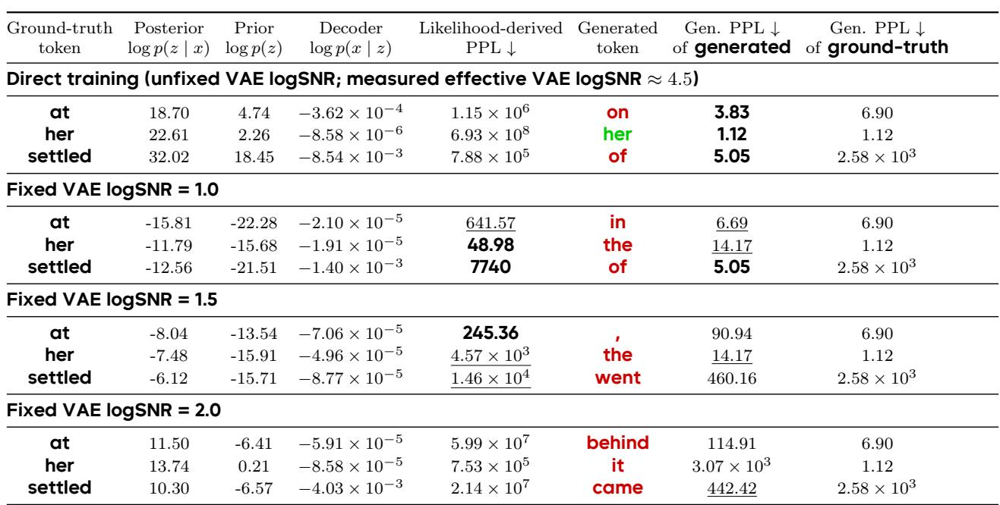
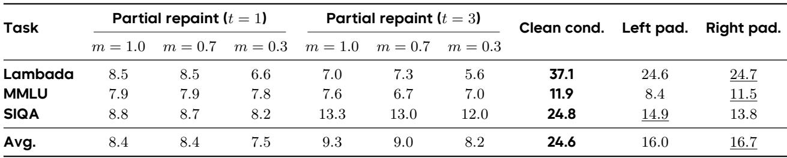
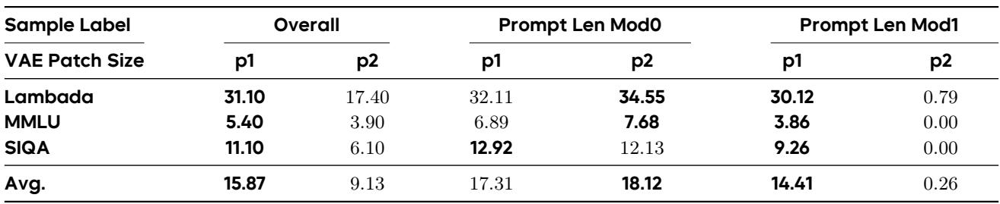

[← 返回 README](../README.md)

# 5 Discussion, Limitations, and Conclusion

> 📌 **Preview**: 此部分涵盖 Discussion (Section 5: likelihood-generation mismatch, conditioning strategies, latent compression, VAE robustness, multimodal extension), Limitations & Future Prospects (Section 6), Conclusion (Section 7), 以及 Afterword (Section 8: 从模型-环境交互视角的深度反思)。这是论文最具哲学深度的部分。

---

## 5 Discussion

In this section, we further examine several additional properties and extensions of Cola DLM. We focus on the structural gap between likelihood-oriented estimation and generation quality, analyze how different conditioning and padding strategies affect block-causal Cola DLM in the first generation block, and present a preliminary exploration of VAE-based text compression for faster generation. Finally, we highlight the broader potential of Cola DLM for combining with other continuous modalities.

### 5.1 The Structural Gap Between Likelihood-Oriented Estimation and Generation Quality

This section studies a central phenomenon in continuous latent language models: generation quality can already be reasonable while likelihood-oriented PPL remains poor. The key reason is that these two metrics target different properties. Generation only requires the prior mass to reach semantically decoder-valid regions, whereas likelihood-oriented estimation additionally requires accurate local probability calibration around the posterior neighborhood of the ground-truth target.

> 💡 **问题动机**: 这是 Cola DLM 论文最具洞察力的分析之一。传统 NLG 评估中，PPL 被广泛用作"模型质量"的代理指标。但在连续潜空间模型中，PPL 和生成质量可能完全脱钩。这不是 Cola DLM 的 bug，而是其 feature——反映了模型学习的是"不同的东西"。

Let

$$
x = (x^{\mathrm{pre}}, x^{\mathrm{res}}),
$$

where $x^{\mathrm{pre}}$ is the prefix, $x^{\mathrm{res}}$ is the response, and $c$ denotes the conditional information induced by the prefix. The exact conditional marginal is

$$
p(x^{\mathrm{res}} \mid c) = \int p_\theta(x^{\mathrm{res}} \mid z, c) p_\psi(z \mid c) \mathrm{d} z,
$$

while the practically accessible quantity is the local score

$$
S_{\mathrm{resp}}(x) = \mathbb{E}_{q_\phi(z|x,c)} \Big[ \log p_\theta(x^{\mathrm{res}} \mid z, c) + \log p_\psi(z \mid c) - \log q_\phi(z \mid x, c) \Big].
$$

The mismatch between these two quantities is the starting point of our analysis.

*Figure 11: A local view of the mismatch between likelihood-oriented estimation and generation quality. Top: local latent geometry around representative ground-truth tokens. Bottom: corresponding prior-density landscapes. High decoder probe success and posterior hit contrast with sharply varying prior hit and density alignment. Thus, good generation relies on covering decoder-valid regions, while likelihood estimation also demands precise local calibration around the gold posterior.*

> 💡 **Figure 11 批读**: 上半部分展示 ground-truth token 周围的局部潜几何——decoder probe success 和 posterior hit 都很高（说明 decoder 可以可靠地从后验邻域恢复正确 token）。下半部分显示 prior hit rates 变化剧烈——说明问题不在于 decoder 失败，而在于 prior 与 gold posterior 的局部对齐不够好。这直接支持了 Implication 3 的论点。

*Table 4: Token-level comparison across direct training and fixed VAE logSNR settings. Across the same target tokens, lower likelihood-derived PPL does not necessarily lead to better generation. This token-level evidence further illustrates the structural gap between likelihood-oriented estimation and generation quality.*

**Implication 3.** In continuous latent language models, good generation and good likelihood-oriented estimation are not equivalent. Generation depends on whether the prior reaches semantically valid latent regions, whereas likelihood-oriented estimation additionally depends on local density calibration around the gold posterior neighborhood.

This distinction is directly supported by Figure 11 and Table 4. In Figure 11, decoder probe success and posterior hit are consistently high, showing that the decoder can reliably recover the ground-truth token inside the posterior neighborhood. However, the prior hit rates vary sharply, indicating that the main issue is not decoder failure but prior misalignment around the gold latent region. Table 4 shows the same pattern at the token level: for "at", the likelihood-derived PPL improves dramatically from $1.15 \times 10^6$ to 641.57 and then 245.36, while the generated token deteriorates from "on" to "in" and then to a comma. Similarly, for "her", smaller likelihood-derived PPL under fixed VAE logSNR does not recover the correct token. Thus, lower likelihood-derived PPL does not necessarily imply better generation.

**Implication 4.** In Cola DLM, generation quality is more related to semantic smoothness of the latent space, whereas likelihood-oriented PPL is more sensitive to probability-space smoothness shaped by the VAE logSNR. Since these two forms of smoothness are different, generation and PPL need not be aligned.

> 💡 **机制拆解**: Implication 4 区分了两种"平滑度"：(1) 语义平滑度（semantic smoothness）——潜空间中相近的向量对应语义相近的 token，影响生成质量；(2) 概率空间平滑度（probability-space smoothness）——由 VAE logSNR 控制，影响局部密度校准，影响 PPL。降低 logSNR 使概率空间更平滑（PPL 改善），但可能模糊局部语义结构（生成变差）。这是理解 Table 4 中 "PPL 改善但生成变差" 现象的钥匙。

The fixed VAE logSNR settings in Table 4 should therefore be interpreted as changing the smoothness of the latent probability space rather than merely tuning a hyperparameter. Lower VAE logSNR corresponds to a flatter local density landscape, which tends to reduce pointwise density mismatch and improve likelihood-derived PPL. However, such smoothing can also blur local semantic structure and bias the model toward generic but semantically suboptimal continuations, such as "in", "the", or "went". By contrast, direct training yields much worse likelihood-derived PPL, but sometimes preserves more appropriate semantic behavior, such as correctly generating "her".

**Summary.** In Cola DLM, generation quality primarily reflects the semantic smoothness of the latent space, whereas likelihood-oriented PPL is more sensitive to the smoothness of the latent probability space shaped by the VAE logSNR. As a result, better generation does not necessarily imply better PPL, and vice versa.

> 💡 **Q&A 批注记录**: 这对 NLG 评估有什么启示？传统上我们习惯用 PPL 评估语言模型的质量。Cola DLM 的分析揭示了一个更深层的问题：PPL 衡量的是"在给定前缀下，模型对 ground-truth continuation 的概率赋值有多精确"——这是一个 local calibration 的概念。而生成质量衡量的是"模型生成的文本是否语义合理"——这是一个 coverage 的概念。在 token 级别的 AR 模型中，这两者高度对齐；但在潜空间模型中，它们可能系统性地偏离。这意味着，对这类模型可能需要开发新的评估方式——也许基于 semantic similarity 而非 token probability 的指标。

### 5.2 Impact of Conditioning and Padding Strategies in the First Generation Block

In the first generation block, the input contains both known prompt latents and unknown latents to be generated. Figure 12 illustrates four representative strategies for handling this mixed region. Partial repaint injects timestep-matched noisy guidance on the known region, where $t$ controls the number of repaint repetitions and $m$ controls the fraction of the denoising trajectory that receives such guidance. Clean condition repaint instead keeps the known region fixed as clean guidance throughout denoising. By contrast, left and right padding do not explicitly repaint the known region, but only change its positional layout relative to the generated region. Notably, under the random-length setting, all aforementioned conditioning modes maintain strict consistency between training and inference.

*Figure 12: Different conditioning and padding strategies in the first generation block. The first generation block is a mixed region that contains both known prompt latents and unknown latents to be generated. Clean condition repaint keeps the known region fixed as a stable condition throughout denoising, partial repaint injects timestep-matched noisy guidance only during part of the trajectory, and left/right padding instead modify the layout of the known region without explicit repaint correction.*

*Table 5: Impact of first-block conditioning strategies. Clean condition repaint performs best, indicating strong, persistent conditioning is optimal for the first block's mixed denoising. Conversely, partial repaint is much weaker, reducing m degrades performance, and increasing t yields no stable gains. Left and right padding outperform partial repaint but remain inferior to clean conditioning.*

> 💡 **Figure 12 & Table 5 批读**: 第一个生成 block 的特殊挑战在于：它是一个"混合区域"——既包含已知的 prompt latent（应该保持），也包含待生成的 unknown latent（应该去噪）。Clean condition repaint 直接将已知区域固定为 clean 引导，效果最好（LAMBADA: 37.1 vs partial repaint 的 8.5）。这揭示了 block-causal 推理的一个关键技术细节：在 block 边界处，显式保持已知区域的 clean 状态比"也对其加噪再恢复"的策略有效得多。

As shown in Table 5, clean condition repaint consistently achieves the best performance across all tasks. In contrast, partial repaint is substantially weaker, and reducing $m$ generally further degrades performance, indicating that shortening the guided portion makes the known region harder to preserve. Increasing the repaint repetitions from $t = 1$ to $t = 3$ also does not bring stable gains, suggesting that repeated early corrections cannot compensate for weak conditioning. Left and right padding are often stronger than most partial repaint settings because they avoid explicitly re-noising the known region, but still remain clearly below clean condition repaint. This suggests that positional layout alone is insufficient: padding does not provide a stable condition throughout denoising, and may further complicate the block-causal attention pattern.

Overall, these results show that the key challenge of the first generation block is to preserve the prompt-conditioned region while generating the remaining unknown part. For this mixed denoising problem, strong and persistent conditioning is more effective than partial noisy correction or positional layout alone. More details are provided in Appendix I.1.

### 5.3 Compression of the Latent Space

This section discusses whether compressing the text sequence in the VAE is beneficial for Cola DLM. We train two Text VAEs with the same latent dimensionality ($d = 128$) but different patch sizes: p1 maps each token to one latent, while p2 compresses every two tokens into one latent. All other settings follow Section 4.5: the DiT block size is 16, the training noise schedule uses logit-normal sampling with loc = 1 and scale = 0, and inference uses 16 denoising steps with CFG = 7.0. In Table 6, Overall reports the full evaluation result, while Prompt Len Mod0 and Prompt Len Mod1 group samples by whether the prompt length is divisible by 2.

*Table 6: Performance under different sample labels and VAE patch sizes. Patch size 2 is overall weaker, but this gap stems mainly from the Prompt Len Mod1 case (indivisible lengths). On Prompt Len Mod0, patch size 2 becomes competitive and even outperforms size 1. This suggests the weakness arises from boundary misalignment rather than latent compression itself.*

**Implication 5.** The weakness of patch size 2 does not mainly come from compression itself, but from the boundary case where the prompt length is not divisible by the patch size. Once the latent grouping is well aligned with the text sequence, compression can instead become beneficial.

At the overall level, p2 is much worse than p1. However, the parity split shows that this gap is almost entirely caused by Prompt Len Mod1. For odd-length prompts, p2 nearly collapses on all tasks, whereas on Prompt Len Mod0, namely the even-length case seen by the patching rule, p2 becomes competitive and even slightly surpasses p1 on average. This suggests that the current failure is not evidence against latent compression itself, but against a compression scheme that does not robustly handle non-divisible sequence boundaries.

The reason is likely that, under patch size 2, odd-length prompts necessarily involve padding or incomplete token groups during compression. If this boundary pattern is not properly learned, the compressed prompt latent becomes semantically shifted. In Cola DLM, this issue is particularly severe because the prompt latent is the clean condition for subsequent block-wise prior generation rather than a weak auxiliary representation. Once the prompt-side latent is biased, the error propagates through denoising and finally harms conditional decoding, which naturally explains the near-zero performance on Mod1.

> 💡 **机制拆解**: Prompt Len Mod1 的近乎零性能是一个"灾难性误差传播"的例子。在 Cola DLM 中，prompt latent 是后续 block-wise prior generation 的 clean condition。如果 prompt latent 因为 padding/alignment 问题被语义偏移，这个偏差会通过 denoising 过程传播到所有后续 block，最终导致 conditional decoding 几乎完全失败。解决这个边界问题是 latent compression 实用化的关键瓶颈。

By contrast, the Mod0 result is encouraging. It shows that when the latent grouping is semantically valid, compressing two tokens into one latent does not necessarily hurt generation and may even help it. This is consistent with the core idea of Cola DLM: the latent space is not intended to preserve a token-aligned recovery path, but to provide a lower-rate representation for global semantic organization, while the decoder handles local realization. Under this view, moderate compression can be beneficial because each latent summarizes a larger textual span and thus better matches the role of the prior.

This also makes latent compression attractive from the efficiency perspective. Under the same DiT block size, one denoising block corresponds to patch size x block size text tokens after decoding. Therefore, with block size 16, patch size 1 covers 16 text tokens per block, while patch size 2 covers 32. If the boundary issue can be resolved, larger patch sizes may improve both semantic abstraction and generation efficiency.

**Summary.** Table 6 suggests that latent compression is a promising direction for Cola DLM. Its current limitation mainly comes from unstable handling of non-divisible sequence boundaries, while the aligned even-length case already shows that compressed latents can support both stronger semantic abstraction and faster generation.

### 5.4 Robustness of VAE Latent Reconstruction

We further analyze the robustness of the VAE latent space from the reconstruction perspective. As shown in Figure 13, the VAE achieves nearly perfect reconstruction at $t = 0$, indicating that the learned latent-text mapping remains highly faithful and does not collapse. Moreover, the reconstruction accuracy stays very high throughout the low-noise regime, and still remains around 0.92 at $t = 250$, before degrading more noticeably under heavier noise.

These results suggest that the latent space learned by the VAE is not merely a fragile compressed code, but a stable and broadly usable intermediate representation for text. In particular, the graceful degradation pattern indicates that semantic information is not destroyed abruptly by small or moderate perturbations, which further supports the view that the VAE latent space in Cola DLM is sufficiently robust to serve as the semantic interface for subsequent prior modeling.

*Figure 13: Robustness of VAE latent reconstruction. The VAE preserves near-perfect reconstruction at low noise and degrades gracefully under stronger perturbations, indicating a stable latent-text mapping.*

### 5.5 Towards a Unified Approach with Image Modalities

A broader implication of Cola DLM is that it provides a natural bridge from discrete text to continuous multimodal modeling. The key idea of unified modeling is not merely to place text and image into one backbone, but to map heterogeneous observations into a shared continuous latent interaction space, where higher-level semantics can be organized under common dynamics.

A natural extension of Cola DLM follows the same probabilistic decomposition as in the text-only setting. Let $\boldsymbol{x}^{\mathrm{text}}$ and $x^{\mathrm{img}}$ denote the text and image observations, and let their modality-specific latent variables be

$$
z_0^{\mathrm{text}} \sim q_{\phi_{\mathrm{text}}}(z \mid x^{\mathrm{text}}), \qquad z_0^{\mathrm{img}} \sim q_{\phi_{\mathrm{img}}}(z \mid x^{\mathrm{img}}).
$$

We then define a joint latent state

$$
\tilde{z}_0 = (z_0^{\mathrm{text}}, z_0^{\mathrm{img}}),
$$

and model the unified generative process as

$$
p(x^{\mathrm{text}}, x^{\mathrm{img}}, \tilde{z}_0) = p_\theta(x^{\mathrm{text}}, x^{\mathrm{img}} \mid \tilde{z}_0) \ p_\psi(\tilde{z}_0).
$$

*Figure 14: Preliminary qualitative examples of unified text-image modeling. Left: text-only continuation and image-conditioned text generation. Middle: text-to-image results with only pretraining. Right: a schematic extension of Cola DLM, where text and image are mapped into modality-specific continuous latents and modeled by a shared block-causal prior.*

> 💡 **Figure 14 批读**: 展示了 Cola DLM 在 multimodal 统一建模方面的初步原型。左侧：纯文本续写 + 图像条件文本生成；中间：仅预训练的 text-to-image 生成结果（无微调，仅有预训练）；右侧：模型架构示意——text 和 image 各自通过 modality-specific VAE 进入潜空间，共享一个 block-causal MMDiT prior。图像 latent 作为 single large block 处理（spatial downsampling factor 16, 64 latent channels）。

Under this view, modality-specific VAE encoders and decoders are responsible for surface-level representation and realization, while the shared prior models the higher-level semantic structure and cross-modal dependency in latent space.

This perspective is consistent with the central modeling principle of Cola DLM. In Cola DLM, diffusion is not used for token-level observation recovery, but for latent prior transport:

$$
z_1 \sim p_1, \qquad z_0 = \Phi_{0 \leftarrow 1}^\psi(z_1), \qquad x \sim p_\theta(x \mid z_0).
$$

In the unified setting, the same idea extends to the multimodal latent state $\tilde{z}_0$: the shared block-causal MMDiT prior transports and organizes the joint latent semantics, while the modality-specific decoders handle the final text or image realization. Therefore, continuity is introduced at the level of prior modeling rather than direct token or pixel recovery.

From the ELBO viewpoint, the benefit of such a decomposition is also conceptually clear. A unified latent-variable objective takes the form

$$
\mathbb{E}[\mathcal{L}_{\mathrm{ELBO}}] = \mathbb{E}_q\left[ \log p_\theta(x^{\mathrm{text}}, x^{\mathrm{img}} \mid \tilde{z}_0) \right] - I\Big( (X^{\mathrm{text}}, X^{\mathrm{img}}); \tilde{Z}_0 \Big) - \mathrm{KL}( \bar{q}(\tilde{z}_0) \parallel p_\psi(\tilde{z}_0) ),
$$

which shows the same division of labor as in the text-only case: the latent variable carries compressed global semantics, while the decoder is responsible for modality-specific realization. In this sense, unified modeling is not simply parameter sharing across modalities, but a shared semantic prior over heterogeneous observations.

Figure 14 presents a preliminary prototype of this idea. In the current design, the text sequence is divided into blocks, while the image latent is treated as a single large block. Specifically, the image representation is obtained via an Image VAE trained on internal multi-resolution data (256 / 384 / 640 / 1024), with a spatial downsampling factor of 16 and 64 latent channels, providing a compact yet expressive latent space for visual content. The shared block-causal MMDiT prior operates over both text blocks and image latents, supporting intra-modal processing as well as cross-modal interaction. Within a unified framework, this enables text-to-text continuation, image-conditioned text generation, and text-to-image generation. We jointly optimize these tasks on internal image-text pairs during training. For the text-to-image task, we first train on 256-resolution data for 80k steps with a global batch size of approximately 3k, and then continue training on 640-resolution data for 10k steps with a global batch size of approximately 1k. For image-conditioned text generation, we adopt the same batch size configuration and train for approximately 50k steps. More result samples are provided at I.2.

These results should be interpreted primarily as qualitative evidence of feasibility. As the current prototype remains at an early stage of training, and our experiments are limited to moderate pretraining on in-house 256 and 640 resolution data, without extensive high-quality data curation or supervised fine-tuning. The goal of this section is not to present a mature multimodal system. Rather, it is to demonstrate that the hierarchical latent-prior formulation of Cola DLM naturally extends beyond text-only generation. In future work, we plan to conduct more comprehensive unified multimodal training. More broadly, these findings suggest that decoupling global latent organization from modality-specific realization may offer a structurally clean and scalable path toward more native unified generative models.

**Summary.** These preliminary results suggest that Cola DLM naturally extends to unified text-image modeling. A shared block-causal prior organizes global and cross-modal semantics, while modality-specific decoders handle final realization. Although still early-stage and qualitative, this prototype already shows a promising bridge from language generation to native multimodal generative modeling.

> 💡 **未来展望**: Multimodal 扩展是 Cola DLM 框架最令人兴奋的长期潜力。核心思路是：text 和 image 各自通过 modality-specific VAE 进入一个 shared continuous latent space，然后由同一个 block-causal prior 进行统一的语义组织。这种设计的优雅之处在于：(1) 不同模态的表面差异被各自的 VAE 隔离；(2) 高层语义和跨模态依赖在共享潜空间中被统一建模；(3) 不需要将 diffusion 用于 pixel/token recovery——它只负责 latent prior transport。这可能是通向 "native multimodal generative model" 的一条有希望的结构化路径。

## 6 Limitations & Future Prospects

Although this paper has provided initial evidence for the feasibility, competitiveness, and promising scaling potential of Cola DLM for text generation in continuous latent space, we view it as a starting point for further exploration rather than a finished endpoint. First, at the scale and evaluation level, the current results reveal encouraging trends, but the experiments are still conducted at a relatively controlled scale and mainly serve to clarify the key properties of the framework. It is therefore natural and important to further examine its upper bound under larger model sizes, longer training, and more substantial compute budgets. Second, at the model-design level, our analyses show that the training strategy of the Text VAE, the text compression scheme, the choice of latent dimensionality, the semantic smoothness of the latent space, and the joint calibration of VAE logSNR, DiT block size, and noise schedule all affect the semantic organization of the latent space and the final generation quality. In particular, the experiments suggest that stronger latent representations usually require better-aligned noise calibration, indicating substantial room for further optimization. Finally, at the framework level, the main value of Cola DLM lies not merely in the denoising process itself, but in its decomposition of text generation into global semantic prior modeling and local textual realization. This opens the door to exploring stronger latent modules, such as AE [5] and RAE [112], as well as more flexible prior-learning approaches, such as drifting-model-based [19] distribution matching for continuous priors. More broadly, following the idea of unified continuous latent-space modeling, the framework may also be extended to continuous modalities such as images, further advancing unified generation.

## 7 Conclusion

In conclusion, this paper presents Cola DLM, a hierarchical continuous latent diffusion language model that decomposes text generation into global semantic prior modeling in latent space and local textual realization through conditional decoding, thereby providing a principled alternative to strictly token-level language modeling. Across the full study, both the theoretical analysis and the experiments consistently suggest that text generation can benefit from hierarchical information decomposition: we find evidence of shared global semantic structure in latent space, identify effective design choices for latent-space formation and diffusion modeling, and show that under strictly matched comparisons, Cola DLM exhibits strong generation quality and encouraging scaling behavior. More broadly, our results indicate that for this class of models, generation-oriented evaluation and scaling trends may be more informative than likelihood alone, while the continuous latent formulation also offers a concrete path toward more native unified modeling across discrete text and continuous modalities.

## 8 Afterword: Research Objectives and Significance

> 📌 **Preview**: Afterword 从"模型-环境交互系统"的视角重新审视了 Cola DLM 的三个核心主题：(1) 文本的表示与生成范式；(2) 评估标准的对齐；(3) 统一多模态模型的必要性。这是论文中最具哲学深度的部分，将 Cola DLM 定位为连接离散文本和连续多模态学习系统的桥梁。

Viewed from a broader perspective, this study is not only concerned with proposing an alternative architecture for text generation, but also with clarifying a more general picture of learning in which representation, objective, and environment must be understood jointly. From this perspective, the three themes of this work are closely connected rather than independent. The first concerns how text should be represented and generated. The second concerns what kinds of objectives and evaluation criteria are genuinely aligned with such representations. The third concerns the kind of environment in which a model should ultimately learn if the goal is more general multimodal intelligence.

A useful starting point is to formalize learning itself as a model-environment interaction system. Let the environment be

$$
\mathcal{E} = (\Omega, \mathcal{O}, \mathcal{A}, \mathcal{T}, \mathcal{F}, \mathcal{G}),
$$

where $\Omega$ is the environment state space, $\mathcal{O}$ is the observation space, $\mathcal{A}$ is the action or output space, $\mathcal{T}$ is the state transition mechanism, $\mathcal{F}$ is the feedback generation mechanism, and $\mathcal{G}$ is the rule that converts feedback into optimization signals. Importantly, the notion of environment is understood here in a broad sense: it includes not only the external world, but also the data distribution presented to the model, task formats, supervision protocols, and even the loss rules by which feedback is transformed into gradients.

Let the model be denoted by $M_\theta$, with internal state space $\mathcal{H}$, state update map $U_\theta$, and policy or generation map $\Pi_\theta$. At interaction step $t$, the closed-loop system can be written as

$$
\begin{aligned}
& \boldsymbol{o}_t \sim \boldsymbol{P}_{\mathcal{E}}(\cdot \mid \boldsymbol{\omega}_t), \\
& \boldsymbol{h}_t = \boldsymbol{U}_{\boldsymbol{\theta}}(\boldsymbol{h}_{t-1}, \boldsymbol{o}_t), \\
& \boldsymbol{a}_t \sim \boldsymbol{\Pi}_{\boldsymbol{\theta}}(\cdot \mid \boldsymbol{h}_t), \\
& \boldsymbol{\xi}_t \sim \mathcal{F}(\cdot \mid \boldsymbol{\omega}_t, \boldsymbol{o}_t, \boldsymbol{a}_t), \\
& \boldsymbol{\omega}_{t+1} \sim \mathcal{T}(\cdot \mid \boldsymbol{\omega}_t, \boldsymbol{o}_t, \boldsymbol{a}_t, \boldsymbol{\xi}_t), \\
& \boldsymbol{\ell}_t = \mathcal{G}(\boldsymbol{\omega}_t, \boldsymbol{o}_t, \boldsymbol{a}_t, \boldsymbol{\xi}_t).
\end{aligned}
$$

The overall learning objective is therefore

$$
\mathcal{I}(\theta; \mathcal{E}) = \mathbb{E}_{\tau \sim P(\tau \mid \theta, \mathcal{E})} \left[ \sum_{t=1}^{T} \gamma^{t-1} \ell_t \right],
$$

where $\tau$ denotes a complete interaction trajectory and $\gamma$ is the discount factor.

This formalization shows directly that learning is never an isolated question of model structure alone. Rather, it is jointly determined by three factors: first, the state space in which the model absorbs and organizes information; second, the kind of feedback through which the environment defines improvement; and third, the actual structure that generates observations, transitions, and feedback. In this work, these three aspects correspond precisely to the three recurring themes of the paper: how text should be represented, which metrics are aligned with the true learning objective, and what kind of environment unified models are ultimately meant to enter.

> 💡 **公式批读**: 模型-环境交互形式化是理解 Cola DLM "为什么重要"的最高层次框架。它揭示了一个根本性的问题：AR 模型在一个 "representation 绑定到 surface token、objective 是 token-level MLE、environment 是纯文本" 的自洽角落中运作。Cola DLM 同时改变了这三个假设——representation（层次潜变量）、objective（分层 ELBO 而非直接 MLE）、environment（连续潜空间使得多模态统一成为可能）。这三个变化构成了一个系统性的范式转换。

### 8.1 Rethinking Text Modeling Paradigms: From State Space in the System to Hierarchical Text Generation

From a system-level perspective, the central question of text modeling is not merely which generation order to adopt, but rather in what kind of state text should be represented within the learning system. Mainstream autoregressive language models bind the state tightly to the surface token prefix, and generation is therefore written as

$$
p_{\mathrm{AR}}(x) = \prod_{t=1}^{n} p_\theta(x_t \mid x_{<t}).
$$

This factorization is highly effective, but it fundamentally corresponds to a strong modeling assumption: both global semantics and local realization are propagated through the same token-level conditional chain. In other words, it assumes that the surface string itself is the most natural and primary state space.

The route explored in this paper instead reconsiders text generation from the level of the state space itself. If text indeed contains a low-dimensional yet sufficiently useful global semantic structure, then a more natural approach is not to place the entire burden of generation on a token-level chain factorization, but to introduce latent variables explicitly and model high-level semantic organization separately from local textual realization. Correspondingly, the core factorization of Cola DLM is

$$
p(x, z_0) = p_\theta(x \mid z_0) p_\psi(z_0), \qquad p(x) = \int p_\theta(x \mid z_0) p_\psi(z_0) dz_0,
$$

where $z_0$ is a continuous latent variable, $p_\psi(z_0)$ is the latent prior, and $p_\theta(x \mid z_0)$ is the conditional decoder. The crucial change here is not merely the introduction of latent variables, but the redefinition of the role of state in the system: the path no longer acts directly on observation recovery, but instead organizes global semantics in latent space first, after which the decoder carries out local textual realization.

This point can be stated compactly through the information decomposition of the average ELBO. Let

$$
q(x, z_0) := p_{\mathrm{data}}(x) q_\phi(z_0 \mid x),
$$

then

$$
\mathbb{E}_{p_{\mathrm{data}}(x)} [\mathcal{L}_{\mathrm{ELBO}}(x)] = \mathbb{E}_{q(x, z_0)} [\log p_\theta(x \mid z_0)] - I_q(X; Z_0) - \mathrm{KL}\big( \bar{q}_\phi(z_0) \parallel p_\psi(z_0) \big),
$$

where $\bar{q}_\phi(z_0)$ is the aggregated posterior. This decomposition shows that hierarchical latent-space modeling breaks the text problem into three coupled but analytically distinguishable components: conditional realization, information compression, and prior matching. The latent variable is therefore not merely a continuous surrogate for discrete tokens, but an explicit intermediate state through which global semantic organization can be separated from local textual realization and modeled on its own terms.

From this perspective, compression must also be reconsidered. Prior work has emphasized the connection between compression and intelligence [37], while recent explorations of generation closer to raw data forms in images and videos, such as pixel-space modeling [19], further suggest that compression should not be equated with harmful information deletion. The key question is not whether every local detail is preserved, but whether the model can extract and organize structural information that is genuinely effective and generalizable. If text indeed admits a hierarchical structure in which high-level semantics and low-level realization are relatively separable, then reinterpreting text generation through informational hierarchy is not merely a change of method, but a theoretical re-evaluation of text modeling itself.

Accordingly, the first theme of this paper is not to reject autoregression, but to point out that autoregression occupies only one self-consistent, rather than unique, corner of the design space. If the data truly contains a hierarchy between low-dimensional global semantics and high-dimensional local realization, then organizing semantics first in a latent state and realizing text through conditional decoding may be closer to the true generative mechanism. Text generation should therefore not be understood solely as next-token fitting over discrete strings, but more generally as a systematic problem of how information is represented, compressed, and organized hierarchically.

### 8.2 Understanding the Continuous Extension of Discrete Text: From Objective Mismatch to a Shift in Evaluation Emphasis

Once the state space of the system is changed, the issue at the objective level changes accordingly. For conventional autoregressive language models, the training objective and evaluation quantities are naturally well aligned: maximum likelihood training directly corresponds to probability fitting over text, and likelihood and perplexity therefore have a clear and stable interpretation. In hierarchical continuous latent-space models, however, the actual training path is no longer direct token-level maximum likelihood, but a hierarchical objective jointly composed of reconstruction, latent prior learning, and representation regularization.

This can be seen from the relation between the ELBO and the true marginal likelihood:

$$
-\mathcal{L}_{\mathrm{ELBO}}(x) = -\log p_{\theta,\psi}(x) + \mathrm{KL}\bigl( q_\phi(z_0 \mid x) \parallel p_{\theta,\psi}(z_0 \mid x) \bigr).
$$

This shows that even at the level of the ELBO, the training objective is already separated from the true log-likelihood by a variational inference gap. Furthermore, in the actual training of Cola DLM, the model must jointly learn latent reconstruction, continuous prior fitting, and representation stabilization. The quantity being optimized is therefore not a single token-level likelihood in the classical sense.

For this reason, the mismatch should not be interpreted as a failure to learn, but rather as evidence that the model is learning something different. For autoregressive models and other paradigms that directly fit discrete distributions, likelihood and perplexity remain highly informative because they are naturally aligned with the training objective. For hierarchical continuous latent-space models, by contrast, the central issue is no longer whether local discrete distributions are fitted as sharply as possible, but whether higher-level semantic structures are effectively organized, whether the latent prior is well learned, and whether the final generations satisfy the actual task requirements.

From the perspective of systematic modeling, this phenomenon is in fact expected: when the state space expands from surface tokens to hierarchical latent variables, the optimization target correspondingly shifts from precise fitting of local discrete distributions to the organization of higher-level semantic structure, stable latent prior learning, and satisfaction of the true generative objective. For this route, generation-oriented metrics are therefore often more closely aligned with what the model is actually trained to do than perplexity. More importantly, model potential is often reflected more clearly in scaling behavior than in any single static likelihood value: what matters is whether capability continues to improve steadily as model size, data, and compute increase, rather than whether local fit under a particular pointwise metric is better.

This can also be connected to the perspective of the three governing curves developed in the theoretical analysis of the paper. For Cola DLM, the applicability of this route is not determined by a single likelihood value, but by whether three conditions hold simultaneously: the representation rate-distortion curve is already favorable at relatively low rate, the approximation error of the latent prior continues to decrease, and the inference gap remains controllable. In other words, the advantage of this route is not guaranteed automatically by latent variables or flow-based modeling themselves; it depends on whether the data truly contains a compressible global semantic structure, and whether the model can learn, fit, and realize that structure in a stable manner.

The second theme of this paper is therefore not merely that perplexity is inadequate, but that evaluation language itself must change once representation and objective have changed. For this class of models, generation quality and scaling behavior are often closer to the model's true capability and long-term potential than traditional perplexity.

### 8.3 Exploring Unified Models: Model-Environment Interaction and the Value of Multimodal Unification

If we return again to the model-environment formalization in Eq. (8.1) and Eq. (8.8), the third theme becomes more natural. The importance of unified models does not lie merely in placing multiple modalities within a single parameterized network, but in changing the structure of the environment in which the model learns. In the real world, observations, transitions, and feedback are usually not generated independently across modalities; rather, they are often jointly determined by a shared latent state. A more general learning system therefore requires not a set of isolated modality interfaces placed side by side, but unified representations that can enter the same interaction state and share the same dynamical constraints.

This is closely related to two broader views of intelligence. One influential view understands intelligence as a collection of skills across tasks [16]. Under this view, a system becomes more capable because it can solve problems across more domains and under more diverse forms of supervision and interaction. The recent development of large language models partly reflects this tendency. A representative example is the progress of code agents that can operate within command-line environments. In such environments, the observation space, action space, and feedback mechanism are unusually well aligned with discrete symbolic representations. Interaction trajectories are easy to record, and correctness is often straightforward to verify, so these environments provide dense and precise learning signals.

Another view, closer to the world-model perspective, holds that intelligence consists in acquiring an internal model of the structure and dynamics of the world. Recent work on world models [93] moves in this direction by seeking to learn richer environmental dynamics, thereby supporting stronger generalization and more realistic interaction. From this perspective, the question is not only how many tasks a model can solve, but whether it learns in an environment whose structure is rich enough to induce the right abstractions. The environment therefore becomes central: a model can only internalize the regularities that are actually present in the observations, transitions, and feedback it encounters.

This can also be written more formally. Let the observation at step $t$ be multimodal,

$$
o_t = \big( o_t^{(1)}, o_t^{(2)}, \ldots, o_t^{(M)} \big), \qquad o_t^{(m)} \in \mathcal{O}^{(m)},
$$

and suppose there exists a joint latent state

$$
z_t = \Phi\left( o_t^{(1)}, \dots, o_t^{(M)} \right),
$$

such that feedback and transition depend primarily on this joint state rather than on marginal factorizations over modalities:

$$
\xi_t, \omega_{t+1} \sim p\big( \xi_t, \omega_{t+1} \mid z_t, a_t \big).
$$

If the true environmental dynamics satisfy

$$
p(\xi_t, \omega_{t+1} \mid o_t, a_t) \neq \prod_{m=1}^{M} p_m\big( \xi_t^{(m)}, \omega_{t+1}^{(m)} \mid o_t^{(m)}, a_t^{(m)} \big),
$$

then the learning problem is structurally non-separable across modalities. In such a case, treating each modality as an independent channel and only combining them superficially is generally insufficient. The theoretical significance of unified models lies precisely in the fact that the environment itself is non-separable in the sense of Eq. (8.17): the regularities that determine useful feedback are joint regularities rather than regularities defined on the marginal distribution of each modality.

This clarifies why multimodal unification is not merely an engineering convenience. Its purpose is not simply to process multiple data types with one backbone, but to allow the model to learn in an environment whose observation, transition, and supervision structure more faithfully reflects the coupled regularities of the real world. In such an environment, both inputs and outputs may be multimodal; useful feedback may depend on how different modalities constrain each other jointly; and the learned internal state should ideally reflect these joint constraints.

This also explains why text has long been the most difficult component in unified models. Images and videos naturally operate in continuous spaces, whereas text is a prototypically discrete modality. If they are to enter a common interaction state and share latent dynamics, a severe representational mismatch immediately arises. This is precisely one of the central obstacles repeatedly identified in recent unified-model research [18]. In this sense, the significance of Cola DLM lies not only in proposing another text generator, but in providing a natural interface through which discrete text can enter a continuous latent space.

If discrete text is mapped into a continuous latent variable through

$$
z^{\mathrm{text}} \sim q_\phi(z \mid x^{\mathrm{text}}), \qquad x^{\mathrm{text}} \sim p_\eta(x \mid z^{\mathrm{text}}),
$$

then text acquires an interface compatible with other continuous modalities. One may then define a unified interaction state

$$
\widetilde{\boldsymbol{z}}_t = \boldsymbol{\Psi}\left( z_t^{\mathrm{text}}, z_t^{\mathrm{img}}, z_t^{\mathrm{vid}}, \dots \right),
$$

and perform state evolution, decision making, and feedback modeling at this level. Equations (8.18)-(8.19) formalize why Cola DLM may matter beyond text generation itself: its role is not only to generate text through a different path, but to provide a bridge through which an intrinsically discrete modality can participate in a continuous multimodal interaction state. In other words, it reduces the structural mismatch that otherwise prevents text from naturally entering a shared continuous environment.

This is why the broader significance of Cola DLM is better understood through model-environment interaction than through single-modality benchmarks alone. If learning is viewed as the optimization of Eq. (8.8) in richer and more realistic environments, then unified models matter because they expand the environments in which the model can learn. If text is to participate fully in such environments, then a bridge such as that in Eq. (8.18) becomes especially desirable. In this sense, Cola DLM is not merely an alternative text generator; it can also be understood as a candidate mechanism for aligning discrete text with continuous multimodal learning systems.

> 💡 **Q&A 批注记录**: 为什么多模态统一不仅仅是"把 text 和 image 放进同一个 backbone"？因为真正的多模态环境是非可分的（Eq. 8.17）。现实世界中，observations、transitions 和 feedback 通常由共享的潜状态共同决定，而不是各模态独立的。例如，在理解一个场景时，图像提供空间信息、文本提供语义标注、音频提供时序信息——它们共同约束了对场景的理解。如果模型只将各模态作为独立通道处理并仅做表面融合，就无法捕获这些 joint regularities。Cola DLM 通过将离散文本映射到连续潜空间，消除了"文本作为离散模态难以参与连续交互状态"这一结构性 mismatch，使得文本可以自然地进入与图像、视频等连续模态共享的潜空间。

### 8.4 The Three Themes Under a Unified Perspective

In summary, the three themes of this paper are not separate supplementary discussions, but three manifestations of the same systematic problem. The first concerns the representation level: whether text should be modeled entirely on the token surface, or whether higher-level semantics can be organized in an independent latent state. The second concerns the objective level: once the model is trained through latent transport, reconstruction, and regularization rather than direct token-level maximum likelihood, which metrics remain genuinely aligned with the learning problem. The third concerns the environment level: if learning is ultimately model-environment interaction, then what kind of environment future models should inhabit, and what representational interfaces are needed for different modalities to become compatible within it.

From this perspective, autoregressive language modeling occupies a self-consistent corner of the design space: representation is tightly bound to surface tokens, the training objective is direct likelihood maximization, and the environment is largely symbolic and text-centered. The route explored in this work changes all three assumptions simultaneously. It introduces a hierarchical latent-variable representation for text, thereby changing the representational assumption; it moves optimization away from direct token-level likelihood, thereby weakening the central interpretive role of perplexity; and it provides a continuous interface for discrete text, thereby making text potentially more compatible with multimodal environments that are more naturally expressed in continuous latent space.

We therefore hope that the contribution of this work is not only a viable alternative path for text generation, but also a more systematic way of thinking that jointly considers representation, objective alignment, and environment design. More broadly, we hope it encourages future research to rethink text, images, videos, and other modalities not as isolated domains that must be solved separately, but as components of a larger learning system in which unified representation, unified objectives, and unified environments may become increasingly central to the development of more general multimodal intelligence.

> 💡 **全文总结**: Cola DLM 在三个层次上同时做出了贡献：(1) Representation level——层次潜变量表示使得文本的全局语义与局部实现解耦；(2) Objective level——认识到 PPL 与此类模型的生成能力不对齐，需要转向 generation-oriented evaluation；(3) Environment level——通过连续潜空间接口，使离散文本能够参与连续多模态学习系统。这三者共同构成了一个超越"另一个 text generator"的系统性贡献——Cola DLM 是对语言建模范式的根本性重新思考。

---

🔖 **Summary**: This section covers four major discussion topics: (1) The likelihood-generation mismatch -- PPL reflects probability-space smoothness (controlled by VAE logSNR) while generation reflects semantic smoothness, and the two need not align. (2) First-block conditioning -- Clean condition repaint (keeping known prompt latents as clean guidance throughout denoising) is the optimal strategy. (3) Latent compression -- Patch size > 1 fails on non-divisible boundaries but is competitive on aligned inputs, suggesting compression is a promising direction once boundary handling is resolved. (4) Multimodal extension -- Cola DLM naturally generalizes to unified text-image modeling via modality-specific VAEs and a shared block-causal MMDiT prior, demonstrated with qualitative prototypes. The Limitations section acknowledges current scale constraints and the need for further joint hyperparameter optimization. The Afterword elevates the discussion to a systemic level: Cola DLM simultaneously rethinks representation (hierarchical latent vs surface token), objective (generation-oriented vs likelihood-oriented), and environment (continuous multimodal vs discrete text-only), positioning it as a bridge from discrete text to continuous multimodal learning systems.
