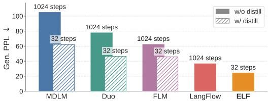

[← 返回 README](../README.md)

# ELF: Embedded Language Flows — Abstract

> 📌 **Preview**: ELF proposes continuous diffusion language models operating entirely in embedding space using Flow Matching. It applies discretization only at the final time step via a shared-weight network. This continuous formulation naturally supports classifier-free guidance (CFG) from image diffusion. ELF substantially outperforms leading discrete and continuous DLMs with better generation quality and fewer sampling steps.

Diffusion and flow-based models have become the de facto approaches for generating continuous data, e.g., in domains such as images and videos. Their success has attracted growing interest in applying them to language modeling. Unlike their image-domain counterparts, today's leading diffusion language models (DLMs) primarily operate over discrete tokens. In this paper, we show that continuous DLMs can be made effective with minimal adaptation to the discrete domain. We propose Embedded Language Flows (ELF), a class of diffusion models in continuous embedding space based on continuous-time Flow Matching. Unlike existing DLMs, ELF predominantly stays within the continuous embedding space until the final time step, where it maps to discrete tokens using a shared-weight network. This formulation makes it straightforward to adapt established techniques from image-domain diffusion models, e.g., classifier-free guidance (CFG). Experiments show that ELF substantially outperforms leading discrete and continuous DLMs, achieving better generation quality with fewer sampling steps. These results suggest that ELF offers a promising path toward effective continuous DLMs.

> 💡 **机制拆解**: ELF的核心设计哲学是"连续性最大化"——在整个扩散过程中始终停留在连续嵌入空间，只在最后一步做离散化。这与现有DLM的关键区别在于：现有方法要么在每一步都做离散化(per-step CE loss)，要么需要单独训练decoder。ELF通过共享权重的denoiser-decoder网络，在MSE loss (denoising)和CE loss (decoding)之间交替训练，使得同一个网络既能预测干净嵌入又能将其映射回token。这种设计天然兼容CFG，因为CFG原本就是针对连续量（score function/velocity field）设计的。

> 💡 **Q&A 批注记录**: 问：为什么"连续"在这里是关键词？答：ELF的"连续"具有双重含义——(1)状态空间连续：在连续嵌入空间中直接去噪，而非离散token空间；(2)时间连续：采用Flow Matching的连续时间ODE/SDE形式，速度场由时间导数定义。这两重连续性使得从图像扩散模型借鉴技术（如CFG、x-prediction、SDE采样）几乎不需修改。

*Figure 1: ELF achieves lower generative perplexity with fewer sampling steps than prior DLMs, without using distillation. ELF achieves this while using 10x fewer training tokens. (Model size: 105M for ELF and 170M for others; dataset: OWT. Detailed comparison in Fig. 7.)*

> 💡 **Figure 1 批读**: 这张图是全文最关键的概览图，传达的核心信息：ELF-B(105M)在32步采样时达到Gen. PPL ~24，而MDLM(170M)需要~1000+步才能达到Gen. PPL ~23，Duo(170M)需要~1000步达到~27。更关键的是，ELF仅用了45B训练token（OWT 5 epochs），而baselines均使用500B+ token。这暗示连续空间中的flow dynamics可能比离散token空间的扩散过程更高效。

🔖 **Summary**: ELF achieves SOTA generation quality by performing continuous-time Flow Matching entirely in embedding space, discretizing only at the final step. This "maximal continuity" design enables straightforward adoption of CFG and achieves Gen. PPL ~24 with 32 steps using 10x fewer training tokens.
