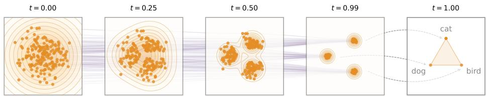

[← 返回 README](../README.md)

# 1 Introduction

> 📌 **Preview**: This section motivates continuous DLMs and positions ELF as a Flow Matching-based approach that stays in continuous embedding space nearly all the way to generation, in contrast to discrete DLMs and existing continuous DLMs that use per-step discretization or separate decoders.

Diffusion models [63, 64, 26] and flow-based models [37, 38, 3] have become prominent paradigms for generating continuous data, demonstrating strong performance at synthesizing images, videos, and data in other continuous domains. These advances have driven growing interest in extending diffusion methods to language modeling, leading to extensive work on diffusion language models (DLMs). DLMs are commonly formulated in one of two ways: continuous or discrete. Continuous DLMs map discrete tokens into continuous representations and perform denoising in the resulting continuous space [34, 13, 19]. Discrete DLMs, in contrast, operate directly in token space and formulate a probabilistic diffusion model over discrete random variables [5, 23, 40, 56, 57]. Recent progress in DLMs has been mostly in the discrete regime, in large part due to the stronger empirical performance of discrete DLMs [33, 48, 76, 58]. But it remains an open question whether the current performance gap of continuous DLMs is due to the inherently discrete nature of language modeling or to underexplored algorithmic design choices.

> 💡 **问题动机**: 当前DLM领域的paradigm tension——连续vs离散。离散DLM（如MDLM, Duo）在性能上领先，但这可能不是因为"语言本质是离散的"，而只是因为连续DLM的设计还不够好。这篇论文的根本动机是检验并挑战这个假设：**如果连续DLM的设计足够合理，是否能够反超离散DLM？**

In this work, we introduce Embedded Language Flows (ELF), a class of continuous DLMs based on Flow Matching [37, 38, 3]. ELF is continuous in two senses. First, it operates in continuous embedding space by directly denoising continuous representations throughout the flowing process, with discretization considered only at the final time step. Second, it is formulated with continuous time, following Flow Matching [37, 38, 3], which allows us to define the velocity field via the time derivative. This formulation enables ELF to benefit from advances in Flow Matching, which is now widely used to instantiate diffusion models in image and video generation [43, 14, 6, 70].

> 💡 **机制拆解**: ELF的"双重连续性"设计——(1)空间连续：在嵌入空间去噪，只有最后一步离散化；(2)时间连续：用Flow Matching的ODE/SDE而不是DDPM的离散时间步。这使得ELF可以直接借鉴图像生成中Flow Matching的成熟技术，如rectified flow、x-prediction、SDE采样等。

*Figure 2: Conceptual illustration of ELF. Orange points denote data represented in continuous embedding space, and purple lines show denoising trajectories from Gaussian noise to clean embeddings. Discretization is applied only at the final time step (t = 1) using a shared-weight network.*

> 💡 **Figure 2 批读**: 这张概念图传达了ELF的核心设计——橙色点代表嵌入空间中的连续向量，紫色线代表从高斯噪声到干净嵌入的去噪轨迹（flow path）。关键观察：所有中间步骤都在连续空间中，只有t=1处的箭头指向离散token。这与其他DLM的对比：离散DLM的整个trajectory都在token空间，而现有连续DLM在中间步骤反复做离散化(rounding/CE loss)。

Following Latent Diffusion Models (LDM) [54], ELF constructs the continuous embedding space by applying an encoder model to the input discrete tokens. The encoder can be pretrained, jointly trained, or frozen with random weights. Unlike latent diffusion, ELF does not require a separate decoder and thus introduces no additional component at inference time. This design is based on the observation that the final time step in Flow Matching can be naturally repurposed to map continuous embeddings back to discrete tokens, eliminating the need for an explicit decoder. As such, a shared-weight network is trained to perform denoising at all but the final step, and decoding (i.e. discretization) at the final step (see Fig. 2).

ELF builds on prior continuous DLMs, but aims for a minimalist design that addresses the interface between continuous and discrete spaces. In contrast to pioneering works on continuous DLMs [34, 13, 19] and many others that employ a per-step discretization loss (e.g., cross-entropy), ELF performs denoising in continuous embedding space at nearly all steps, thereby offering maximal flexibility for the flow dynamics. And unlike latent diffusion methods [41, 45, 62], which typically operate in a compressed latent space and rely on a separate decoder, ELF directly operates in a high-dimensional latent space [32] and requires no extra decoder.

Empirically, we show that ELF outperforms leading methods on discrete DLMs and existing continuous DLMs (Fig. 1), following the evaluation protocols established in those works. ELF achieves better generation quality with fewer sampling steps than leading discrete DLMs (e.g., MDLM [56] and Duo [57]) and concurrent continuous DLMs (e.g., FLM [30] and LangFlow [10]). Moreover, ELF achieves this performance using 10x fewer training tokens and without any distillation. We further show that ELF performs strongly on machine translation [7] and summarization [46]. Overall, these results suggest that continuous DLMs can be highly competitive while requiring only minimal treatment of discretization, offering a promising direction for diffusion-based language modeling.

> 💡 **消融解读**: Introduction中提到的三个关键empirical结果：(1) ELF用105M参数、32步采样达到Gen. PPL~24，而MDLM(170M)要达到类似水平需要1000+步；(2) ELF仅用45B token训练，baselines用500B+ token；(3) 在conditional generation (MT, summarization)上也显著超越离散DLM baselines。这三点共同验证了核心claim：**连续DLM的性能差距主要是设计选择问题，而非语言离散性的固有限制**。

🔖 **Summary**: The introduction establishes the motivation — the dominance of discrete DLMs may be an artifact of suboptimal continuous DLM design rather than an inherent limitation. ELF proposes to test this by formulating language generation as continuous-time Flow Matching in embedding space, with discretization only at the final step via a shared-weight network. The approach achieves SOTA with 10x fewer training tokens.
