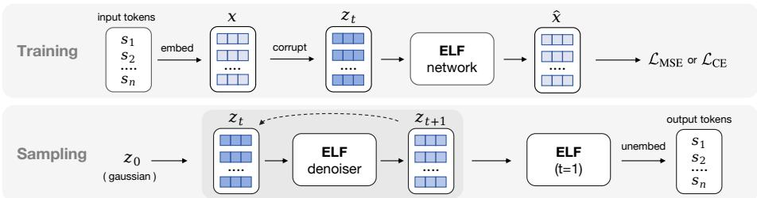

[← 返回 README](../README.md)

# 2 Background & Related Work

> 📌 **Preview**: Covers diffusion/flow-based generative models, continuous DLMs (embedding-space, simplex, latent diffusion, flow-based), and discrete DLMs. The key positioning: ELF occupies a unique design point as a flow-based continuous DLM with no per-step discretization and no separate decoder.

## Diffusion-/Flow-based Models

Diffusion-/Flow-based models. Diffusion models [63, 26, 64] and flow-based models [37, 38, 2] transform noise into data through ordinary or stochastic differential equations (ODEs/SDEs). In DDPM-style formulations, generation is defined by transitions between successive states [63, 26, 47], which may be discrete or continuous. Discrete states require categorical transition distributions, as in discrete DLMs [5, 56]; continuous states are commonly modeled through score or noise prediction under Gaussian corruption [64, 26, 14]. Flow Matching extends this view to continuous time by learning the velocity field along a continuous path [37, 38, 2], where noise, data, and velocity predictions can be reparameterized into one another [14, 32]. Our method adopts Flow Matching to formulate language generation in continuous embedding space and continuous time.

> 💡 **机制拆解**: Flow Matching的核心公式：噪声路径 z_t = t*x + (1-t)*ε，速度场 v = dz/dt = x - ε。三种预测目标(x-prediction, v-prediction, ε-prediction)可以相互转换：(1)从x̂得到v̂ = (x̂ - z_t)/(1-t)；(2)从ε̂得到x̂ = (z_t - (1-t)ε̂)/t。ELF选择x-prediction是因为：(a)高维数据处于低维流形上，预测干净数据更稳定[32]；(b)共享权重的denoiser和decoder都需要预测x，做到统一。

## Continuous Diffusion Language Models

Continuous diffusion language models. Continuous DLMs map discrete tokens to a continuous space to perform denoising. Embedding-space methods, such as Diffusion-LM [34], CDCD [13], and DiffuSeq [19], add Gaussian noise directly to token embeddings [66, 79, 21, 72, 77, 36, 74, 15]. A complementary direction studies simplex-based representations, including SSD-LM [22] and TESS [44, 68], as well as related manifold-based formulations [27]. Although these methods provide continuous relaxations of discrete tokens, their trajectories often remain tied to the discrete token space through mechanisms such as rounding losses, simplex constraints, and token-level cross-entropy objectives. In contrast, ELF denoises entirely in continuous embedding space without per-step token-level supervision and discretizes only at the final step.

*Figure 3: During training, discrete tokens are encoded into clean embeddings x and corrupted to z_t, which ELF uses to predict x̂. The model is trained with either the denoising loss L_MSE or the token-wise cross-entropy loss L_CE. During inference, ELF starts from Gaussian noise z_0 and iteratively denoises embeddings from z_t to z_{t+1}. Only at the final step does ELF switch to decoding mode and project the final embeddings back to discrete tokens through an unembedding layer.*

> 💡 **Figure 3 批读**: 这张图完整展示了ELF的训练和推理流程。训练时两个分支(denoise/decode)共享网络权重，推理时只有最后一步用decode mode。特别需要注意：(1)训练时的decode branch用了一个特殊的corruption过程(不同token有不同程度的噪声)，使得decoder能学会从上下文中恢复被破坏的嵌入；(2)推理时decode mode的输入是denoiser输出的可能带有imperfection的嵌入，而非干净的x。

Another line applies latent diffusion to frozen encoder representations, represented by LD4LG [41] and follow-up work [81, 59, 42, 45, 62]. Like many diffusion methods described above, these approaches typically follow DDPM-style or score-based formulations with DDPM noise schedules [26, 47], and additionally rely on a separately trained decoder to recover tokens. In contrast, ELF uses a continuous-time Flow Matching formulation with a linear (rectified-flow) interpolant [37, 38, 2], and does not require a separate decoder. This brings flow-based training and sampling into language diffusion, allowing ELF to benefit from recent advances in Flow Matching.

Several concurrent works also revisit continuous flow-based language modeling. DFM [51], CFM [55], FLM/FMLM [30], and LangFlow [10] all incorporate token-level cross-entropy supervision along the flow trajectory, though they differ in the continuous state space, including simplex space, one-hot token encodings, and embedding space. Some of these methods further introduce distillation for few-step generation, such as distilled DFM/CFM and FMLM. In contrast, ELF keeps the denoising trajectory entirely in an unrestricted continuous embedding space, applying token-level supervision only at the final decoding step. A more comprehensive survey is provided in Appendix A.

> 💡 **机制拆解**: 与并发工作(FLM, LangFlow, DFM, CFM)的关键区别：
> - **FLM**: 在one-hot编码空间做Flow Matching，每步用CE loss监督 → ELF认为这限制了flow dynamics的灵活性
> - **LangFlow**: 用Bregman Flow Matching在可学习嵌入空间，也是每步CE loss → ELF使用的是frozen encoder，不做per-step离散化
> - **DFM/CFM**: 在simplex空间做Flow Matching，每步CE loss → ELF认为simplex约束过度限制连续轨迹
> - **共有问题**: 所有这些并发工作都把连续扩散过程与离散token监督耦合在一起，ELF的解耦设计("最后一步才离散化")是其最根本的区别

## Discrete Diffusion Language Models

Discrete diffusion language models. Due to the discrete nature of language, another line of work applies diffusion directly in token space. D3PMs [5] define general discrete corruption processes, including absorbing and uniform transitions. Masked diffusion models, such as MDLMs [56], use a special [MASK] absorbing state and generate samples through iterative unmasking [23, 48, 76]. Subsequent work improves sampling and efficiency through remasking, adaptive inference [71, 73], and semi-autoregressive block diffusion, including E2D2 [4]. Uniform-state diffusion models, such as Duo [57], instead diffuse tokens toward a uniform categorical distribution, enabling repeated token revision during inference [57, 12, 58]. Recent studies further scale discrete DLMs and extend them to code and multimodal generation [20, 65, 75, 78, 31]. Overall, discrete diffusion models currently remain the dominant paradigm in diffusion-based language modeling [33].

> 💡 **问题动机**: 离散DLM的两种主流范式对比：
> - **Masked Diffusion (MDLM)**: token → [MASK] → 逐个unmask。优点：生成质量好；缺点：一旦unmask就无法修改，且需要很多步。
> - **Uniform Diffusion (Duo)**: token → uniform categorical → 重复修正。优点：允许反复修改token；缺点：需要更多步数。
> - **ELF的定位**: 在连续空间中去噪，不受到离散空间的约束（不需要固定的vocabulary size的transition matrix），同时最后一步映射回token，兼具两种方法的优点。

🔖 **Summary**: Section 2 surveys the landscape of DLMs across three categories — diffusion/flow model fundamentals, continuous DLMs (embedding-space, simplex, latent, flow-based), and discrete DLMs. ELF is positioned as a unique design point: flow-based continuous DLM with no per-step discretization during training or inference, and no separate decoder.
