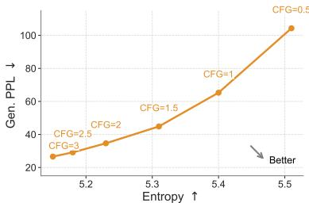
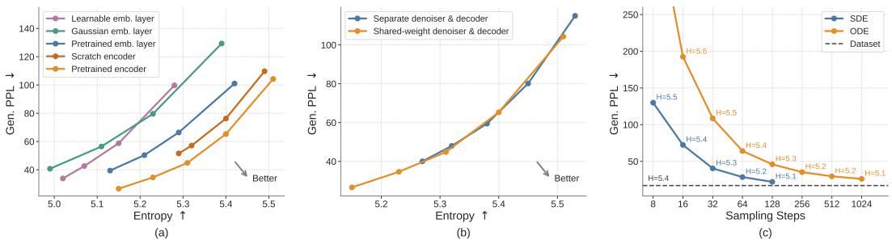
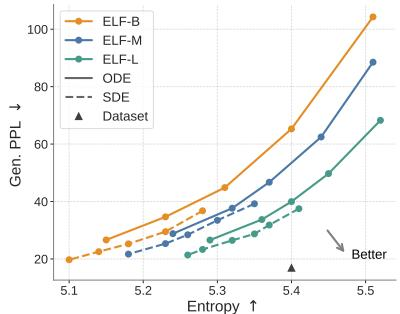
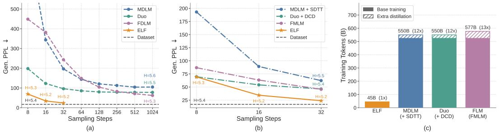
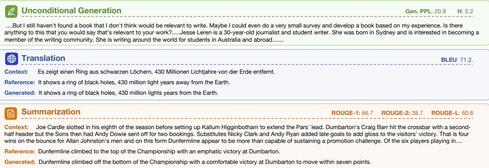

[← 返回 README](../README.md)

# 4 Experiments

> 📌 **Preview**: Comprehensive experimental evaluation covering (4.1) key ablation studies — CFG, embedding choices, decoding strategies, samplers, model scaling; (4.2) system-level comparison on unconditional generation against discrete and continuous DLMs; (4.3) conditional generation results on machine translation and summarization.

## Experimental Setup

Dataset and evaluation. For unconditional generation, we follow the experimental design used in past work [56, 57, 30, 10]. We train on the OpenWebText (OWT) dataset [18], which has around 9B tokens, and pack sequences to length L = 1024. For evaluation, we generate 1,000 samples and report generative perplexity (Gen. PPL), i.e., the perplexity of generated samples under a pretrained GPT-2 Large model [52]; together with average unigram entropy as a measure of sample diversity.

For conditional generation, we consider machine translation and summarization. For machine translation, we use the WMT14 German-to-English (De-En) dataset [7] with sequence length L = 128 (condition length 64, target length 64; 144M total target tokens), and evaluate using BLEU [49]. For summarization, we use the XSum dataset [46] with sequence length L = 1088 (condition length 1024, target length 64; 6M total target tokens), and report ROUGE-1 (R1), ROUGE-2 (R2), and ROUGE-L (R-L) [35]. We treat both as sequence-to-sequence tasks and do not use sequence packing for conditional generation.

Model. We use contextual embeddings from a frozen pretrained T5-small encoder [53] (35M) with embedding dimension 512. We use a bottleneck design that linearly projects embeddings into a lower-dimensional space of size 128, and then projects them back to the hidden size of the model [32]. We consider three model sizes: ELF-B (105M), ELF-M (342M), and ELF-L (652M), and use ELF-B as the default for ablations. Detailed configurations are shown in Appendix Tab. 3.

> 💡 **机制拆解**: Bottleneck设计的作用——将512维T5嵌入投影到128维再映射回model hidden 768维。这个设计基于manifold hypothesis[32]：自然语言的嵌入实际位于512维空间中的一个低维流形上，128维bottleneck可以作为流形维度的有效近似。实验证明128维是最优的平衡点(见Fig. 11)。

Training and inference. We train our model using the Muon optimizer [28] with a learning rate of 0.002 and a batch size of 512. The model is trained for 5 epochs on OWT (around 95K steps), and for 100 epochs on WMT14 and XSum (around 880K and 40K steps, respectively). Depending on the selected model mode, the network is trained with either the MSE loss in Eq. 1 (80%) or the CE loss in Eq. 2 (20%). During inference, we use the ODE or SDE sampler to generate samples.

> 💡 **消融解读**: 训练时MSE:CE = 80%:20%的ratio是通过实验确定的(见Fig. 12)。直觉上，大部分训练步数应该学习连续的denoising dynamics(MSE)，但需要足够的CE步数让decoder学会将可能不完美的嵌入映射回正确token。20%的CE比例在ODE和SDE采样下都提供了最佳的Gen. PPL-entropy trade-off。

## 4.1 Ablations

We begin by ablating several key design choices of our model on the simpler setting of unconditional generation on OWT, using the default ELF-B model and a 64-step ODE Euler sampler unless otherwise specified. More ablation studies are shown in Appendix C.

### Classifier-Free Guidance (CFG)

Classifier-free guidance (CFG). Our flow-based continuous formulation is naturally compatible with CFG, a highly effective technique in standard diffusion models. Therefore, we first study the effect of the CFG scale. As shown in Fig. 4, increasing the CFG scale lowers generative perplexity but also reduces entropy, reflecting a quality–diversity trade-off. The preferred direction is toward the lower-right region of the plot, corresponding to lower generative perplexity and higher entropy. For most of the remaining ablations, we evaluate this quality–diversity trade-off by sweeping the CFG scale. Each point on the curve is computed from 1,000 generated samples at a specific CFG scale.

*Figure 4: Ablations on guidance. We evaluate the generative perplexity–entropy trade-off across CFG scales: increasing the scale lowers generative perplexity but reduces entropy.*

> 💡 **Figure 4 批读**: CFG scale的效果非常清晰——随着scale从0.5增加到3.0，Gen. PPL显著下降(从~65降到~20)，但同时entropy从~5.4降到~5.1。这反映了生成模型中的经典trade-off：更强的guidance让模型更"自信"(低PPL)，但也更"保守"(低多样性)。ELF-B的最优工作点在scale=3附近(Gen. PPL~20, entropy~5.1)。

### Embedding Choices

Embedding choices. Since ELF operates in a continuous embedding space, we next study how the choice of embeddings affects performance. We ablate the continuous embeddings along two axes: whether the embeddings are contextual (i.e., from an encoder) or non-contextual (i.e., from a single embedding layer), and whether they are fixed or learnable. For contextual embeddings, we evaluate those from an off-the-shelf T5 encoder [53] and embeddings from an encoder trained from scratch on OWT using the original T5 objective. For non-contextual embeddings, we consider token embeddings from the pretrained T5 model, frozen Gaussian embeddings, and learnable embeddings. See Appendix D.3 for detailed setup.

*Figure 5: Ablations on key design choices. (a) Embedding choices: we compare contextual vs. noncontextual embeddings, as well as frozen vs. learnable embeddings; pretrained contextual embeddings achieve the best trade-off. (b) Decoding strategies: We compare a shared-weight denoiser-decoder with a two-stage, separately trained decoder. Both strategies achieve similar trade-offs, but the shared-weight variant extends further toward the regime of low generative perplexity. (c) Samplers: we compare ODE and SDE-inspired samplers across different sampling steps; SDE-inspired sampler consistently achieves lower generative perplexity in fewer steps.*

We show the results in Fig. 5a. Contextual embeddings achieve a better generative perplexity–entropy trade-off. Embeddings from an encoder trained from scratch on OWT perform well, but slightly lag behind those from a pretrained encoder. Among the noncontextual variants, pretrained token embeddings outperform frozen Gaussian embeddings. Learnable embeddings perform the worst, likely due to the difficulty of jointly optimizing the embeddings and the denoiser. Overall, these results suggest that pretrained contextual embeddings are favorable representations of language for ELF.

> 💡 **Figure 5a 批读**: 嵌入选择的消融揭示了几个重要发现：(1)上下文嵌入显著优于非上下文嵌入——说明denoiser受益于位置感知的丰富表示；(2)预训练编码器优于从零训练编码器——说明语言建模的预训练知识对去噪过程有帮助，即使ELF本身不做语言建模；(3)可学习嵌入表现最差——可能因为联合优化嵌入和denoiser导致训练不稳定，类似GAN中的minimax问题。

### Decoding Strategies

Decoding strategies. Since we use contextual embeddings as our continuous representations, we need to decode them back into discrete tokens. We use a shared-weight network, with training interleaving L_MSE and L_CE. Alternatively, we explore a two-stage strategy. In the first stage, we train a decoder from scratch with a frozen pretrained T5 encoder to reconstruct tokens from masked and noisy embeddings using L_CE. In the second stage, we freeze both the encoder and decoder, and train a separate denoiser using L_MSE (see Appendix D.3 for details).

*Figure 5b: Decoding strategies — shared-weight vs. two-stage.*

As shown in Fig. 5b, both strategies achieve a similar trade-off, but the shared-weight variant extends further toward the regime of low generative perplexity, while also simplifying the pipeline by avoiding an extra training stage.

> 💡 **消融解读**: 共享权重设计的一个非直观优势：denoiser和decoder共享权重意味着denoiser学到的表示直接对解码有用。相比之下，两阶段的separate decoder在训练时从未见过denoiser输出的imperfect嵌入(因为denoiser在第二阶段才训练且被freeze)，导致domain mismatch。共享权重通过交替训练MSE和CE，使denoiser的中间表示也受到token-level监督的间接影响，产生更适合解码的嵌入。

### Samplers

Samplers. Since ELF is formulated in continuous time and continuous space, it naturally supports both deterministic ODE sampling and stochastic SDE-like sampling; see Appendix Alg. 6 for details. We compare ODE and SDE samplers across different sampling budgets with a self-conditioning CFG scale of 1.

*Figure 5c: Samplers — ODE vs. SDE across different step budgets.*

As shown in Fig. 5c, SDE sampling achieves substantially lower generative perplexity than ODE sampling in the few-step regime. These results suggest that introducing stochasticity during sampling can effectively reduce error accumulation and provide a better quality–efficiency trade-off.

> 💡 **消融解读**: SDE sampler在few-step regime的优势非常显著——8步SDE的Gen. PPL(~120)远低于8步ODE(~400+)。这是因为：(1)ODE的确定性轨迹会累积早期步骤的预测误差(compounding error)；(2)SDE通过每步重新注入噪声，给模型"纠错"的机会——即使上一步的x̂不完美，噪声注入后的z_back更接近训练分布；(3)当步数增加到64时，两者的差距缩小，说明足够多的步数本身就有纠错能力。这种SDE策略是ELF在32步内达到SOTA的关键技术。

### Model Scales

Model scales. We study the scaling behavior of ELF across three model sizes: ELF-B (105M), ELF-M (342M), and ELF-L (652M) (detailed in Appendix Tab. 3). We evaluate each model using both ODE and SDE sampling.

*Figure 6: Scaling of ELF models. We compare ELF-B, ELF-M, and ELF-L. Scaling model size consistently improves the Gen. PPL–entropy frontier.*

As shown in Fig. 6, scaling consistently improves the generative perplexity–entropy frontier. In particular, at matched entropy, larger models achieve lower generative perplexity, indicating higher sample quality with comparable diversity. Conversely, at similar generative perplexity, larger models maintain higher entropy. The effect of the sampler is consistent across model sizes: SDE sampling improves over ODE sampling by pushing the frontier in a more optimal direction. These results suggest that ELF scales effectively, demonstrating the potential of model scaling. See Appendix Tab. 7 for the detailed numbers.

> 💡 **Figure 6 批读**: 缩放行为的两个关键观察：(1)ELF-L(652M)+SDE在CFG=3时Gen. PPL~23.3, entropy~5.28，而ELF-B(105M)+SDE在CFG=2时Gen. PPL~22.5, entropy~5.14。大模型在相同Gen. PPL下保持更高entropy(更多样)，说明散射行为有规律；(2)SDE的优势随模型增大而保持——在所有scale下SDE曲线都在ODE曲线的"更优方向"(左下方)。但注意ELF-B在某些CFG scale下的Gen. PPL反而比ELF-L低——这是因为小模型从CFG中受益更大(详见Tab. 7)。

## 4.2 System-Level Comparison on Unconditional Generation

We first compare ELF-B against both discrete DLMs, including MDLM [56] and Duo [57], and continuous DLMs, including FLM [30] and LangFlow [10], under a comparable setting. All models are trained on the OWT dataset. ELF has 105M parameters, while the compared baselines have around 170M parameters. For ELF, we use our best configuration: SDE sampling with self-conditioning CFG scale of 3 (see Appendix D.2 for details).

*Figure 7: System-level comparison. ELF-B outperforms both discrete and continuous DLMs trained under similar settings (a), rivals distilled variants of other baselines that require additional rounds of training (b), and uses substantially fewer training tokens (c).*

We show results in Fig. 7a. ELF achieves a generative perplexity of 24 using only 32 sampling steps, requiring substantially less inference-time compute than prior methods. ELF remains strong even compared with distilled models, which require extra training to distill a student model for few-step generation. As shown in Fig. 7b, in the few-step regime, ELF outperforms distilled models, including MDLM+SDTT [56, 11], Duo+DCD [57], and FMLM [30], even without any additional distillation.

ELF is also substantially more data-efficient in terms of estimated training tokens, as shown in Fig. 7c. While prior DLMs typically use over 500B tokens, ELF uses only 45B. Together, these results show that, when combined with proper sampling and guidance, ELF achieves strong system-level performance. It not only improves inference efficiency, but also achieves strong performance with a much smaller training budget, demonstrating the potential of our flow-based language model. See Fig. 8 for qualitative examples of ELF-B's generations.

> 💡 **Figure 7 批读**: 这是全文最关键的system-level comparison，三张子图分别传达三个核心信息：
> **Fig. 7a (vs. base models)**: ELF-B在32步时Gen. PPL~24，FLM需要~512步达到~40，LangFlow需要~256步达到~50。离散方法MDLM需要~1024步达到~23，Duo需要~1024步达到~27。ELF用1/30的步数达到甚至超越baseline的质量。
> **Fig. 7b (vs. distilled models)**: Distilled MDLM(SDTT)在32步时约100，Distilled Duo(DCD)在32步时约35，FMLM在32步时约43。ELF-B在32步时Gen. PPL~24，且无需额外蒸馏训练——蒸馏需要额外训练student model，而ELF的few-step能力来自SDE sampler。
> **Fig. 7c (training tokens)**: ELF用45B token，而MDLM/Duo/FLM/LangFlow均使用524B token(11.6x)，蒸馏变体使用550-577B token(12.2-12.8x)。这是一个order of magnitude的效率差异。

*Figure 8: Qualitative examples of text generated by ELF-B. We show an unconditional sample, a German-to-English translation example, and a summarization example, along with their automatic evaluation metrics. Some text is omitted due to space limits; see Appendix E for more examples.*

## 4.3 System-Level Comparison on Conditional Generation

We compare ELF-B with autoregressive and diffusion-based baselines at a similar model scale. These include discrete DLMs (MDLM [56], Duo [57], and E2D2 [4]) and continuous DLMs (SeqDiffuSeq [79] and CDCD [13]). Some results are taken from the literature and others are reproduced from public codebases. See Appendix Tab. 8 for a summary. We use the best sampling configuration selected on the validation set: a 64-step ODE sampler with the self-conditioning CFG scale set to 1 and the input-condition CFG scale set to 2.

**Table 1: Results on machine translation and summarization.**

| Model | Size | De-En BLEU ↑ | XSum ROUGE-1 ↑ | XSum ROUGE-2 ↑ | XSum ROUGE-L ↑ |
|-------|------|-------------|----------------|----------------|----------------|
| AR | 99M | 25.2 | 30.5 ± 0.13 | 10.2 ± 0.11 | 24.4 ± 0.12 |
| MDLM [56] | 99M | 18.4 | 33.4 ± 0.11 | 11.6 ± 0.10 | 25.8 ± 0.10 |
| Duo [57] | 170M (+35M) | 21.3 | 31.4 ± 0.12 | 10.1 ± 0.10 | 25.0 ± 0.12 |
| E2D2 [4] | 99M | 24.8 | 28.4 ± 0.11 | 8.3 ± 0.09 | 22.0 ± 0.10 |
| SeqDiffuSeq [79] | - | 21.3 | 19.3† | 1.7† | 14.1† |
| CDCD [13] | - | 24.9 | - | - | - |
| **ELF (ours)** | **105M (+35M)** | **26.4** | **36.0 ± 0.13** | **12.2 ± 0.11** | **27.8 ± 0.12** |

We show the results in Tab. 1. On WMT14 De-En, ELF-B achieves a BLEU score of 26.4, outperforming all compared baselines. On XSum, ELF-B also outperforms all compared baselines across all ROUGE metrics. These results demonstrate the effectiveness of ELF on conditional generation tasks. Qualitative examples in Fig. 8 show that ELF-B generally follows the input context and produces outputs that semantically align with the ground-truth references.

> 💡 **消融解读**: 条件生成结果的两个关键观察：
> (1) ELF在MT上超越AR baseline(26.4 vs 25.2 BLEU)——这说明扩散模型在序列到序列任务上可以超越自回归模型，不一定需要left-to-right的生成方式。
> (2) 在XSum上，ELF在ROUGE-1(36.0 vs MDLM's 33.4)和ROUGE-L(27.8 vs MDLM's 25.8)上显著领先——连续嵌入空间的表示能力可能帮助模型更好地捕捉source文档的语义内容。
> (3) 注意ELF的条件生成使用ODE sampler(64步)而非SDE——条件生成场景下确定性采样可能更有利于忠实遵循source内容。CFG scale设为1(self-cond)和2(input-cond)，说明对source的conditioning比对self-conditioning更重要。

🔖 **Summary**: Section 4 provides comprehensive experimental evidence: (1) Ablations validate key design choices — x-prediction, pretrained contextual embeddings, shared-weight decoder, SDE sampler, bottleneck=128, Muon optimizer, logit-normal time schedule, denoising probability=0.8; (2) System-level comparison shows ELF-B outperforms MDLM/Duo/FLM/LangFlow with fewer steps and 10x fewer training tokens; (3) Conditional generation results demonstrate ELF surpasses AR and diffusion baselines on MT and summarization.
