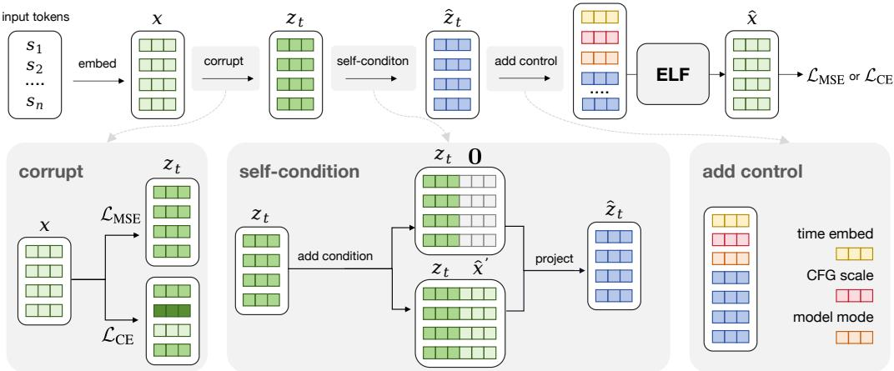
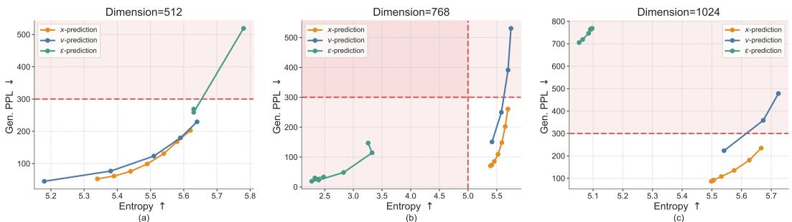
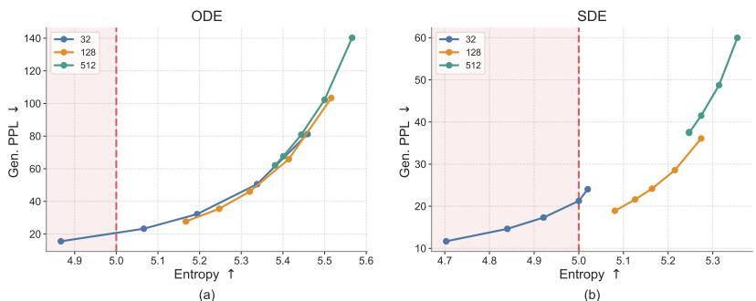
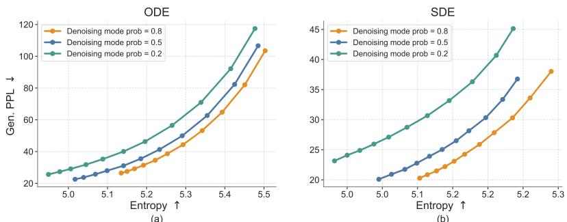
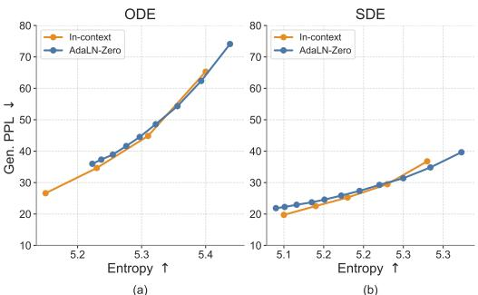
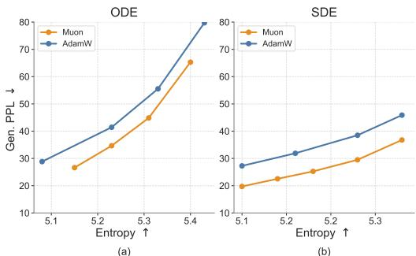
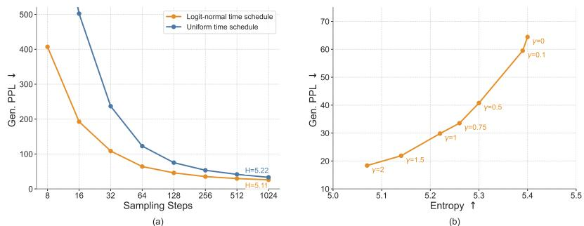
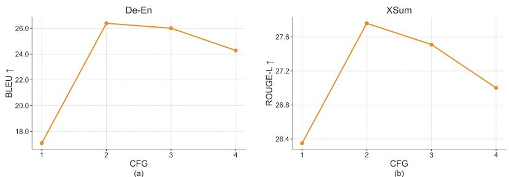
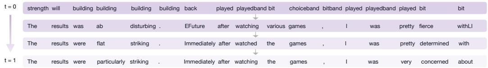

[← 返回 README](../README.md)

# 5 Conclusion

> 📌 **Preview**: Conclusion summarizing ELF's key contributions, followed by highlights from the five appendix sections — DLM Survey (A), Method Details (B), Additional Ablations (C), Experimental Details (D), and Qualitative Examples (E).

## 5.1 Conclusion

We introduced Embedded Language Flows (ELF), a continuous diffusion language model that formulates language generation in continuous embedding space using continuous-time Flow Matching. In contrast to prior DLMs, ELF keeps the denoising trajectory continuous and applies discretization only at the final step, enabling straightforward adaptation of techniques from continuous diffusion models. Empirically, compared with leading discrete DLMs and existing continuous DLMs, ELF achieves a strong quality–efficiency trade-off across language generation tasks, attaining lower generative perplexity with fewer sampling steps and fewer training tokens. These results suggest that continuous DLMs remain a promising direction for diffusion-based language modeling.

> 💡 **问题动机**: Conclusion的核心takeaway——连续DLM的性能差距不是因为语言的离散本质，而是因为之前的设计(per-step discretization, separate decoder, suboptimal parameterization)不够好。ELF通过"最大化连续性"的设计证明了连续DLM不仅在少数步数下可以匹敌、甚至可以超越离散DLM。

## Acknowledgments and Disclosure of Funding

We thank Mingyang Deng, Belinda Li, Itamar Pres, and Laura Ruis, for their helpful feedback and insightful discussions. We thank Google TPU Research Cloud (TRC) for granting us access to TPUs.

---

## Appendix A: Continuous Diffusion Language Model Survey

Survey details. We provide a detailed survey in Tab. 2. The survey summarizes representative continuous diffusion and flow-based language models along several design axes, including the underlying diffusion or flow process, the continuous state in which denoising is performed, whether intermediate denoising states are discretized during training or inference, and whether a separately trained decoder is required to map latent states back to text.

In particular, the Train per-step discr. and Infer. per-step discr. columns distinguish two different uses of intermediate discretization. Train per-step discr. indicates that intermediate denoising states are mapped to token predictions during training and supervised with token-level objectives such as cross-entropy loss. This provides direct vocabulary-level guidance, but also couples intermediate denoising states to categorical predictions. Infer. per-step discr. indicates that intermediate sampling states are explicitly projected back to token-aligned representations during generation, such as nearest-neighbor rounding in embedding space or argmax projection on a simplex. Methods without inference-time per-step discretization keep the sampling trajectory continuous and discretize only at the final step. The Sep. dec. column indicates whether a method requires a separately trained decoder to map continuous latent representations back to discrete text.

*Figure 9: Illustration of our training pipeline. Starting from the clean embeddings x, we apply different noise schedules in the two modes to obtain corrupted embeddings z_t. We then apply self-conditioning by concatenating either 0 or the previous prediction x̂' along the channel dimension, and project the concatenated embeddings back to the original dimension to form ẑ_t. Next, we prepend control tokens to the embedding sequence, including time tokens in [0, 1], CFG scale tokens in [0.5, 5], and model-mode tokens indicating either denoising or decoding. The resulting sequence is fed into ELF to produce the final prediction x̂, which is supervised using either a denoising loss L_MSE or a token-wise cross-entropy loss L_CE.*

> 💡 **Figure 9 批读**: 这张训练pipeline图展示了ELF的几个非典型设计：(1)self-conditioning通过维度拼接实现——[z_t, x̂']沿channel维度concat，然后用线性层投影回原始维度；(2)in-context conditioning——将time、CFG scale、mode作为控制token prepend到序列前，这是对传统adaLN-Zero方法的替代，显著减少了参数量(105M vs 148M)；(3)两个分支用masking在同一个batch中处理，不增加训练成本。

Positioning of ELF. Tab. 2 shows that existing continuous DLMs differ substantially in where the denoising process is defined and how continuous states are mapped back to text. Many embedding-space and simplex-based methods use training-time per-step discretization through token-level objectives, commonly cross-entropy, at intermediate denoising steps. These objectives provide direct token-level guidance, while making the denoising trajectory more tightly coupled to vocabulary-level prediction. Latent Diffusion LMs often avoid such per-step vocabulary supervision, but typically rely on DDPM-style or score-based formulations with DDPM noise schedules [26, 47] and require a separately trained latent-to-text decoder, such as an autoregressive decoder, non-autoregressive decoder, or latent decompressor, to recover discrete tokens.

ELF occupies a different design point. It formulates language generation as continuous-time Flow Matching in a frozen contextual embedding space and keeps the sampling trajectory continuous, applying discretization only at the final decoding step. Unlike prior latent Diffusion LMs, ELF does not require a separately trained decoder: a single shared-weight network performs intermediate denoising and recovers tokens at the final step through the unembedding layer.

## Appendix B: Method Details

### B.1 Training

We show the full training pipeline in Fig. 9. The input tokens are first encoded into clean embeddings x, which then go through three key steps before being fed into the ELF model: corruption, self-conditioning, and adding control tokens for conditioning and guidance.

**Embedding corruption.** First, we corrupt the clean embeddings x by adding noise. Specifically, we use z_t = t x + (1 - t) ε to obtain noisy embeddings z_t, where ε is Gaussian noise and t is the time step. Before corruption, we first normalize the clean embeddings using the estimated mean and standard deviation from the OWT dataset. We use different noise schedules for different modes.

For the denoising branch, we sample the time step t from a logit-normal distribution for each sequence. Specifically, we draw t' ~ N(P_mean, P_std^2) and map it to the unit interval via t = σ(t'), where σ(·) denotes the sigmoid function. In all experiments, we use P_mean = -1.5 and P_std = 0.8. We rescale the Gaussian noise by a factor of 2.

For the decoding branch, we train final-step discretization by conditioning the model on the decoder mode, i.e., t = 1. At this time step, z_t corresponds to clean embeddings. Therefore, to make the final-step input nontrivial, we corrupt the clean embeddings with a per-token corruption level p sampled from a different noise schedule. Specifically, we draw p from a logit-normal distribution with P_mean = 0.8 and P_std = 0.8, and form z̃ = p x + (1 - p) ε, multiplying ε by a noise scale. We use noise scales of 5 and 1 for OWT and conditional generation tasks, respectively. As a result, the corruption level varies across tokens within the same sequence. This design encourages the shared-weight decoder mode to recover corrupted embeddings from their surrounding context, making final-step discretization more robust to imperfect embeddings produced by the denoiser at inference time.

**Self-conditioning.** We apply self-conditioning following prior work [9]. During training, with a certain probability, we perform an additional forward pass to obtain the predicted embeddings x̂', which are concatenated with the noisy embeddings z_t along the channel dimension. We stop the gradient through the predicted embeddings x̂'. For the remaining examples, we concatenate z_t with all-zero embeddings 0 instead. Since this concatenation doubles the channel dimension, we project it back to the original dimension using a linear layer. We apply self-conditioning with x̂' in the denoising branch with 50% probability. For the decoding branch, we always use 0 as the self-conditioning input, as shown in Alg. 4.

**Training-time CFG.** As discussed in Sec. 3.3, our model performs training-time CFG [16, 17, 8, 69] with self-conditioning. In training-time CFG, the network is designed to model the post-combination quantity v_θ^cfg, rather than the pre-combination quantity v_θ. Following [16, 17], the regression target v_target is now:

$$ v_{\mathrm{target}} = x - \epsilon + \left(1 - \frac{1}{\omega}\right) \big( v_{\theta}^{\mathrm{cfg}}(z_t \mid t, c, \omega) - v_{\theta}^{\mathrm{cfg}}(z_t \mid t, \emptyset, \omega) \big), $$

where ω is the guidance scale. When ω = 1, this reduces to the case without training-time CFG. In this case, the loss becomes ||v_θ^cfg(·) - v_target||^2 [16, 17]. See Alg. 3. For each training example, we randomly sample a self-conditioning CFG scale w ∈ [0.5, 5.0] from a power distribution biased toward smaller values [16, 17]. Since ELF uses x-prediction, the quantity v is always converted from its x prediction counterpart (conditional or unconditional).

Our model uses a diverse set of conditions. Standard diffusion models typically implement conditioning through adaLN-Zero [50], which combines all conditioning signals through summation. This design becomes less effective when many heterogeneous conditions are present. Therefore, we adopt in-context conditioning [17] by prepending a set of control tokens that encode the conditioning information. Each control-token embedding has the same dimensionality as a standard language-token embedding. We prepend three types of control tokens: 4 time tokens with values in [0, 1], 4 CFG-scale tokens sampled from [0.5, 5], and 4 model-mode tokens indicating either denoising or decoding. These tokens are jointly trained with the model. All continuous values, i.e., time and CFG scale, are encoded with positional embeddings.

For conditional generation, we place the clean embeddings of the conditioning sequence immediately after the control tokens and before the target sequence to be generated. The model then performs bidirectional self-attention over the concatenated sequence of conditioning and target tokens. The conditioning embeddings are kept uncorrupted during training. To enable CFG for conditional generation, we randomly drop the condition with 10% probability by zeroing out the embeddings of the conditioning sequence. This allows the model to learn both conditional and unconditional generation under the same framework.

### B.2 Inference

We show the full inference algorithm in Alg. 5. Since the self-conditioning CFG scale is provided through in-context conditioning, changing w does not require an additional inference pass. By modifying w as a model input, we can flexibly control the trade-off between generation quality and diversity.

**Time schedule.** We discretize the continuous time interval t ∈ [0, 1] into T intervals using a logit-normal time schedule. Specifically, we sample T-1 time steps from the same logit-normal distribution used for the denoising branch during training and sort them to form the intermediate points. We use P_mean = -1.5 and P_std = 0.8 to match the training-time logit-normal distribution. We ensure that the first interval starts at t = 0 and the last interval ends at t = 1. This schedule produces smaller intervals when t is close to 0 and larger intervals as t approaches 1. It shows strong empirical performance, likely because the noisier regime requires finer discretization and the schedule better matches the noise distribution used during training.

**Samplers.** Our method supports both deterministic ODE sampling and an SDE-inspired stochastic sampler. The main algorithm in Alg. 2 uses the ODE sampler for simplicity, while Alg. 6 summarizes one-step updates for both samplers.

The SDE variant is motivated by the SDE associated with Flow Matching [43], whose dynamics can be interpreted as injecting infinitesimal noise at each step. In practice, we adopt a simple approximation that re-injects Gaussian noise at each sampling step while shifting the time variable slightly toward the noise regime. We introduce a noise re-injection scale γ to control the amount of stochasticity added at each step. The denoiser is then evaluated on this perturbed state, and its clean-embedding prediction is used to update the original state. When γ = 0, no stochastic perturbation is applied, and the update reduces to deterministic ODE sampling.

**CFG for conditional generation.** We apply standard CFG by combining the conditional and unconditional predictions. Similarly, we use the CFG scale to control the guidance strength.

> 💡 **机制拆解**: SDE sampler (Alg. 6) 的完整公式：
> - ODE step: z = z + dt * v (其中 v = (x̂ - z)/(1-t))
> - SDE step: α = 1 - γ*dt, t_back = α*t, z_back = α*z + (1-α)*e, x̂ = net(z_back, t_back), v = (x̂ - z)/(1-t), z = z + dt * v
> 注意SDE的关键：噪声注入后的状态z_back被用来计算x̂，但速度v仍然是基于原始z计算的(非z_back)。这意味着模型从"稍微回到噪声区"的状态中提取信息来修正原始状态的前进方向。

---

## Appendix C: Additional Ablations

In this section, we present additional ablations of our design choices. Unless otherwise specified, all experiments use time schedule with either a 64-step ODE sampler or a 64-step SDE sampler with γ = 1. As before, we evaluate the generative perplexity–entropy trade-off by varying the self-conditioning CFG scale. We use red to indicate regions with poor generation quality, i.e., entropy below 5.0, which often corresponds to repetitive or degenerate sentences, or generative perplexity above 300, which often corresponds to semantically meaningless or ungrammatical sentences. All models are trained for the same number of steps, with all other configurations kept the same as the default setting.

### C.1 Prediction Targets

Our model directly predicts the clean embeddings x (x-prediction). This allows us to use a unified denoiser and decoder through weight sharing and jointly optimize the model with both the denoising objective L_MSE and the token-level objective L_CE. Prior work has also suggested that x-prediction is essential, as high-dimensional clean data tends to lie on a low-dimensional manifold [32].

Here, we further study the effect of prediction targets. Specifically, since there are three quantities and two constraints: linear interpolation z_t = t x + (1 - t) ε and flow velocity v = x - ε, the network can be trained to predict one of these quantities, i.e., x-, v-, or ε-prediction. To study this in a controlled setting, we use a two-stage pretrained encoder-decoder setup: a pretrained T5 encoder maps tokens into continuous embeddings, and a decoder is trained to reconstruct masked and noisy embeddings (See Sec. D.3 for details). We train only the denoising model while keeping both the encoder and decoder fixed. We use adaLN-Zero conditioning and a 64-step ODE sampler to plot the generative perplexity–entropy trade-off curve.

To study how prediction targets behave as the embedding dimension increases, we consider T5-small, T5-base, and T5-large encoders, corresponding to embedding dimensions of 512, 768, and 1024, respectively. We set the bottleneck dimension equal to the corresponding input embedding dimension.

*Figure 10: Effects of prediction targets. We vary the input dimension from 512 to 768 and 1024 by using T5-small, T5-base, and T5-large encoders, respectively. Across all input dimensions, x-prediction remains stable and performs well. In contrast, v-prediction performs well at 512 dimensions but degrades at higher dimensions, while ε-prediction collapses across all dimensions from 512 to 1024. The red region indicates poor-quality generations, where entropy falls below 5 (e.g., repetitive sentences) or generative perplexity exceeds 300 (e.g., meaningless or ungrammatical sentences). This aligns with the hypothesis from prior work that high-dimensional clean data often lies on a low-dimensional manifold [32].*

> 💡 **Figure 10 批读**: 这是对Li & He (2025)[32]的"x-prediction在emoji高维空间更稳定"假说的直接验证。(1)x-prediction在512→1024维度下始终保持合理Gen. PPL-entropy trade-off；(2)v-prediction在512维表现好，但在768和1024维显著退化(Gen. PPL从~40飙升到~80-150)；(3)ε-prediction在所有维度下都崩溃(entropy < 5，即生成重复/退化文本)。这说明随着嵌入维度增加，噪声ε的空间越来越大但数据x的流形维度不变——预测x(在低维流形上)比预测ε(在高维噪声空间)更稳定。这个发现对理解为什么"让去噪模型去噪"(而非预测噪声)更有效提供了直观解释。

### C.2 Bottleneck

Our model uses a bottleneck design that projects encoder representations into a lower-dimensional space before mapping them back to the model hidden size. This design is motivated by the hypothesis that natural data may lie on a low-dimensional manifold within the high-dimensional embedding space.

*Figure 11: Effect of bottleneck dimension. We compare bottleneck dimensions of 32, 128, and 512 under ODE and SDE sampling. A moderate bottleneck dimension of 128 provides the best generative perplexity–entropy trade-off, while overly small or large bottlenecks either reduce diversity or hurt generative perplexity. Red indicates regions with poor generation quality, i.e., entropy below 5.*

We compare bottleneck dimensions of 32, 128, and 512, and show the results in Fig. 11. The bottleneck dimension has a clear effect on the generative perplexity–entropy trade-off. Under ODE sampling, all three bottleneck sizes follow a similar frontier, but smaller bottlenecks tend to reach lower generative perplexity at the cost of lower entropy. Under SDE sampling, the differences become more significant: the 32-dimensional bottleneck achieves the lowest generative perplexity but often lies in the low-entropy region, indicating reduced diversity, whereas the 512-dimensional bottleneck maintains higher entropy but suffers from substantially worse generative perplexity. The 128-dimensional bottleneck provides the best overall balance, achieving strong generative perplexity while preserving reasonable entropy. We therefore use a bottleneck dimension of 128 as the default setting. This finding is also consistent with prior work [32], which observes that an appropriate bottleneck can improve performance.

### C.3 Denoising Mode Probability

Since ELF is trained with both MSE and CE losses through a shared-weight denoiser-decoder, each training step is assigned to either denoising mode or decoding mode. The denoising-mode probability controls this allocation: a higher probability emphasizes learning the continuous denoising dynamics, while a lower probability provides more supervision for mapping embeddings back to tokens. We study this trade-off by varying the denoising-mode probability during training.

*Figure 12: Effect of the denoising mode probability during training. This probability controls the allocation between denoising and decoding updates in the shared-weight denoiser-decoder model. A denoising mode probability of 0.8 provides the best generative perplexity–entropy trade-off across both ODE and SDE samplers.*

As shown in Fig. 12, assigning a low probability to the denoising mode consistently degrades the generative perplexity–entropy trade-off, especially under SDE sampling. This suggests that the model requires sufficient training on the denoising process. Among the configurations tested, a denoising mode probability of 0.8 achieves the best overall trade-off across both ODE and SDE samplers. We therefore use 0.8 as the default denoising mode probability in our main experiments.

### C.4 Conditioning Strategies

As discussed in Sec. 3.3, our model is conditioned on the time step, CFG scale, and model mode. We use in-context conditioning for these signals by prepending them as condition tokens to the input sequence, allowing the model to attend to them through full attention. This differs from the conventional adaLN-Zero conditioning design, which typically introduces additional model components to process the conditioning inputs.

*Figure 13: Effect of conditioning strategies. We compare in-context conditioning with adaLN-Zero conditioning. In-context conditioning slightly improves performance while substantially reducing the number of model parameters.*

We compare these two designs in Fig. 13. In-context conditioning performs slightly better while avoiding the substantial parameter overhead introduced by adaLN-Zero (ELF-B's parameter count is reduced from 148M to 105M). Therefore, we use in-context conditioning as our default setting.

### C.5 Optimizers

We evaluate the impact of optimizer choice, comparing Muon [28] and AdamW [39], and show the results in Fig. 14. We tune the hyperparameters for both optimizers to obtain their best performance: for Muon, we use a learning rate of 2×10^{-3}; for AdamW, we use a learning rate of 1×10^{-4} with β_1 = 0.9 and β_2 = 0.95.

*Figure 14: Effect of optimizers. We compare generation quality under different optimizers using Muon and AdamW. Muon achieves lower generative perplexity at comparable entropy under both ODE and SDE sampling methods.*

During training, Muon achieves lower loss within the same number of steps. During inference, models trained with Muon consistently achieve a better generative perplexity–entropy trade-off than those trained with AdamW under both samplers. The improvement is especially significant under SDE sampling, where Muon achieves lower generative perplexity at the same entropy level. These results highlight the importance of optimizer choice. Nevertheless, models trained with both optimizers still outperform other baselines, suggesting that the strong performance of ELF cannot be attributed to the optimizer alone.

### C.6 Sampling Methods

We study two sampling design choices that improve inference efficiency and generation quality: sampling time schedule and stochastic SDE-inspired sampling.

**Time schedules.** By default, we use a logit-normal time schedule during inference [29]. We also evaluate an alternative uniform schedule.

*Figure 15: Effect of time schedule and SDE noise re-injection scale. (a) Logit-normal time schedule consistently improves generative perplexity across different sampling budgets, especially in the few-step regime. (b) The SDE noise re-injection scale γ controls the generative perplexity–entropy trade-off by adjusting the amount of stochastic noise injected during sampling.*

Fig. 15a shows the effect of the time schedule on ODE sampling across different numbers of sampling steps. Across all step counts, the logit-normal schedule consistently reduces generative perplexity compared with the uniform schedule. This improvement is especially significant in the few-step regime. These results suggest that the logit-normal time schedule improves sampling efficiency and final sample quality, likely because it better aligns the inference-time trajectory with the training-time schedule and allocates more sampling steps to noisier time steps.

**SDE noise re-injection scale.** For SDE sampling, we introduce a noise re-injection scale hyperparameter γ that controls the amount of stochasticity injected at each sampling step, as discussed in Sec. B.2. Intuitively, increasing γ introduces more stochasticity, while γ = 0 reduces to deterministic ODE sampling. As shown in Fig. 15b, γ controls the generative perplexity–entropy trade-off: within a moderate range, larger γ leads to lower generative perplexity while slightly reducing entropy. We hypothesize that the noise re-injection process helps correct early denoising errors, rather than deterministically amplifying imperfect trajectories as in ODE sampling. We therefore choose γ = 1.0 as our default setting, which provides a strong balance between generative perplexity and entropy.

### C.7 CFG on Conditional Generation

We further study the effect of CFG scale on conditional generation tasks.

*Figure 16: Effect of CFG scale on conditional generation. We sweep the CFG scale on WMT14 De-En translation and XSum summarization. Moderate guidance substantially improves task performance, with CFG scale 2 achieving the best result on both tasks, while overly strong guidance slightly degrades performance.*

As shown in Fig. 16, increasing the CFG scale from 1 to 2 substantially improves performance on both WMT14 De-En and XSum, suggesting that stronger conditioning helps the model better follow the source input. However, further increasing the scale leads to a gradual decline in performance, indicating that overly strong guidance can hurt generation quality. Based on this trend, we use CFG scale 2 as the default setting for conditional generation.

> 💡 **消融解读**: CFG on conditional generation的最优值是2，而非unconditional generation的最优值3。这是因为条件生成中有两个CFG信号：(1)self-conditioning CFG (设为1，不使用)；(2)input-condition CFG (设为2，source guidance)。当CFG=2时，input guidance适度增强模型对source的忠实度，但CFG>2时过度强调source可能导致模型忽略语言流畅性，性能反而下降。

---

## Appendix D: Experimental Details

### D.1 Model Architecture

Our model uses a standard Diffusion Transformer architecture [50]. We also incorporate popular general-purpose improvements, including SwiGLU [61], RMSNorm [80], RoPE [67], and qk-norm [24]. We use in-context conditioning instead of adaLN-Zero [50] conditioning, which allows us to significantly reduce the number of parameters; for example, the ELF-B model size is reduced from 148M to 105M parameters. Tab. 3 summarizes the configurations of ELF across different model sizes. We report the Transformer depth, hidden size, number of attention heads, and parameter count. We also report the number of training epochs used on the OWT dataset for each variant. Larger models tend to learn faster in our setup, and therefore require fewer training epochs.

**Table 3: ELF Model configurations across different scales.**

| Model | Depth | Hidden size | # Heads | Params | Training epochs |
|-------|-------|-------------|---------|--------|-----------------|
| ELF-B | 12 | 768 | 12 | 105M | 5 |
| ELF-M | 24 | 1056 | 16 | 342M | 4 |
| ELF-L | 32 | 1280 | 16 | 652M | 3 |

### D.2 Hyperparameters

ELF pipeline hyperparameters. Tab. 4 summarizes the main hyperparameters used in the ELF pipeline, covering model architecture, diffusion settings, conditioning and guidance, and optimization details. Unless noted otherwise, all experiments in the paper follow this default configuration. We include these settings for completeness and to facilitate reproducibility.

**Default training hyperparameters for ELF-B on OWT:**

| Category | Parameter | Value |
|----------|-----------|-------|
| Model | Architecture | ELF-B, 105M |
| Encoder | Backbone | T5-small |
| Encoder | Embedding dim | 512 |
| Encoder | Bottleneck dim | 128 |
| Model | Hidden dim | 768 |
| Data | Sequence length | 1024 |
| Denoising | Time schedule | logit normal |
| Denoising | (P_mean, P_std) | (-1.5, 0.8) |
| Denoising | Noise scale | 2.0 |
| Decoding | (P_mean, P_std) | (0.8, 0.8) |
| Decoding | Noise scale | 5.0 |
| Training | Denoiser vs. decoder prob. | 0.8 vs. 0.2 |
| Conditioning | Self-cond. probability | 0.5 |
| Conditioning | Self-cond. CFG range | [0.5, 5] |
| Conditioning | # time tokens | 4 |
| Conditioning | # CFG tokens | 4 |
| Conditioning | # mode tokens | 4 |
| Sampling | SDE γ | 1.0 |
| Optimization | Optimizer | Muon |
| Optimization | Learning rate | 0.002 |
| Optimization | Weight decay | 0 |
| Optimization | Schedule | constant |
| Optimization | Warmup epochs | 0.5 |
| Optimization | EMA decay | 0.9999 |
| Training | Epochs | 5 |
| Hardware | Device | TPU v5p x 64 |
| Hardware | Time per epoch | 1.5 h |

Inference-time settings for system-level comparison. For system-level comparison in Fig. 7, we use SDE sampling with time schedule enabled for all step budgets. We set the CFG scale to 3 for 8-, 16-, and 32-step generation. For SDE sampling, we use a stronger noise injection scale of γ = 2 in the very few-step regimes of 8 and 16 steps, and reduce it to γ = 1.5 for 32 steps, as longer denoising trajectories require less stochastic correction. For the system-level comparison in Tab. 1, we use 64-step ODE sampling with time schedule. We set the self-conditioning CFG scale to 1 and the input-condition CFG scale to 2.

**Table 5: Estimated effective training tokens for ELF and baselines (Fig. 7c).**

| Method | Base training | Distillation training | Effective tokens | Ratio |
|--------|-------------|----------------------|-----------------|-------|
| MDLM [56] | 512 x 1M x 1024 | - | 524.3B | 11.6x |
| Duo [57] | 512 x 1M x 1024 | - | 524.3B | 11.6x |
| MDLM + SDTT [56] | 512 x 1M x 1024 | 512 x 10K x 5 x 1024 | 550.5B | 12.2x |
| Duo + DCD [57] | 512 x 1M x 1024 | 512 x 10K x 5 x 1024 | 550.5B | 12.2x |
| FLM [30] | 512 x 1M x 1024 | - | 524.3B | 11.6x |
| FMLM [30] | 512 x 1M x 1024 | 512 x 100K x 1024 | 576.7B | 12.8x |
| LangFlow [10] | 512 x 1M x 1024 | - | 524.3B | 11.6x |
| **ELF (ours)** | **5 x 9.04B** | - | **45.2B** | **1.0x** |

Training-token budget for system-level comparison. Tab. 5 reports the estimated effective training tokens used by ELF and each baseline in Fig. 7c. We estimate base-training tokens as batch size x steps x sequence length and add distillation or flow-map stages on top where applicable. The OWT dataset contains roughly 9.04B tokens. With our default training schedule of 5 epochs, ELF therefore uses 45.2B effective training tokens. Thus, ELF requires roughly an order of magnitude fewer effective training tokens than the compared DLMs.

### D.3 Ablation Studies Setting

We evaluate several choices of embedding representations for ELF, and report the implementation details as below. We also try two-stage training with a separate decoder. Unless specified, we keep other settings the same as the default ELF configuration.

**Scratch encoder.** We train an encoder from scratch on OpenWebText [18] by following the original T5-small training pipeline [53]. The encoder is trained for 5 epochs with a learning rate of 1×10^{-3}, cosine learning rate schedule, 0.4 epoch warmup, and a batch size of 512. During ELF training, we apply channel-wise normalization to the encoder outputs.

**Pretrained embedding layer.** We use the frozen embedding table from the T5-small encoder as the token embedding layer. The embedding layer matrix is normalized, and the unembedding layer is trained separately.

**Gaussian embedding layer.** We randomly initialize and freeze an embedding layer from a Gaussian distribution, with token-wise embedding mean 0 and standard deviation 1. The unembedding layer is trained separately using the decoder mode.

**Learnable embedding layer.** We jointly train the embedding layer together with the denoiser and decoder modes. The unembedding layer is tied with the embedding layer: denoiser-mode updates affect the embedding layer, while decoder-mode updates affect the unembedding layer. To stabilize training, we apply normalization directly on the unembedding layer matrix at every step.

**Separate decoder.** For the separate-decoder setting, we use a randomly initialized decoder architecture obtained by mirroring the T5-small encoder. We keep the encoder fixed, mask 20% of the input tokens, and add logit-normal noise to the latent representations with P_mean = 0.5 and P_std = 1.0. The model is trained for 3 epochs with a learning rate of 3×10^{-4} and a cosine learning-rate schedule. The relative noise scale with respect to the normalized latent representations is set to 5.0.

### D.4 Reported Numbers

System level comparison. Across 6 independent evaluation seeds, ELF shows highly consistent system-level behavior, as shown in Tab. 6. As the number of sampling steps increases from 8 to 32, the standard error (SE) decreases. The small standard errors -- especially at 32 steps -- suggest that these gains are robust to random seed variation and that the overall trend is reliable across runs.

**Table 6: System-level ELF performance reported as mean ± standard error (SE) over 6 independent evaluation runs (seeds 0-5; n = 6).**

| Steps | SC CFG | γ | Gen. PPL ↓ | Entropy ↑ |
|-------|--------|---|------------|-----------|
| 8 | 3 | 2.0 | 67.32 ± 2.25 | 5.14 ± 0.085 |
| 16 | 3 | 2.0 | 33.66 ± 1.09 | 5.16 ± 0.026 |
| 32 | 3 | 1.5 | 24.08 ± 0.16 | 5.15 ± 0.002 |

Scaling behavior with CFG scales. The default setting for both sampling methods uses 64 sampling steps with time schedule. For the SDE sampler, we set γ = 1.0. The exact numbers are reported in Tab. 7. Larger CFG scales improve generation quality by reducing Gen. PPL within a certain range. The effect of CFG scaling reverses beyond 3. Only ELF-L benefits from increasing the CFG scale from 3 to 4. Thus, in most default ablation studies, we only consider CFG scales from 0.5 to 3.

**Table 7: Scaling performance of generative perplexity (Gen. PPL) and unigram entropy for ELF models of different sizes under SDE and ODE samplers with 64 sampling steps.**

| Sampler | SC CFG | ELF-B Gen. PPL | ELF-B Entropy | ELF-M Gen. PPL | ELF-M Entropy | ELF-L Gen. PPL | ELF-L Entropy |
|---------|--------|----------------|---------------|----------------|---------------|----------------|---------------|
| SDE | 0.5 | 36.77 | 5.28 | 39.21 | 5.35 | 37.50 | 5.41 |
| SDE | 1.0 | 29.50 | 5.23 | 33.45 | 5.30 | 31.82 | 5.37 |
| SDE | 1.5 | 25.25 | 5.18 | 28.42 | 5.26 | 28.72 | 5.35 |
| SDE | 2.0 | 22.53 | 5.14 | 25.34 | 5.23 | 26.47 | 5.32 |
| SDE | 3.0 | 19.72 | 5.10 | 21.69 | 5.18 | 23.31 | 5.28 |
| SDE | 3.5 | 37.56 | 5.30 | 36.48 | 5.34 | 22.28 | 5.27 |
| SDE | 4.0 | 36.50 | 5.29 | 34.93 | 5.33 | 21.37 | 5.26 |
| ODE | 0.5 | 104.29 | 5.51 | 88.51 | 5.51 | 68.27 | 5.52 |
| ODE | 1.0 | 65.30 | 5.40 | 62.47 | 5.44 | 49.72 | 5.45 |
| ODE | 1.5 | 44.85 | 5.31 | 46.71 | 5.37 | 39.97 | 5.40 |
| ODE | 2.0 | 34.65 | 5.23 | 37.66 | 5.32 | 33.72 | 5.36 |
| ODE | 3.0 | 26.62 | 5.15 | 28.80 | 5.24 | 26.57 | 5.29 |

> 💡 **消融解读**: Tab. 7揭示了两个重要的scaling现象：(1)SDE vs ODE: 在所有model size和CFG scale下，SDE的Gen. PPL都比ODE低约60-90点(在中等CFG下)。这说明stochastic sampling的好处是系统性的，不仅仅局限于few-step regime。(2)CFG的反转效应：对于ELF-B和ELF-M，CFG>3后Gen. PPL急剧上升(ELF-B从19.72升到36.50)，说明过度guidance会破坏小模型的生成能力。但ELF-L在CFG=4时Gen. PPL继续下降到21.37——大模型的表达能力更强，可以承受更强的guidance信号。

---

## Appendix E: Qualitative Examples

### E.1 Denoising Trajectory

*Figure 17: Denoising trajectory of ELF-B. As t increases from 0 to 1, ungrammatical sentences are progressively refined into fluent and grammatical text.*

Fig. 17 visualizes the intermediate predictions along ELF's denoising process. Starting from repetitive tokens at t = 0, the model gradually forms semantically meaningful phrases, improves grammar, and refines word choices as t approaches 1. This trajectory illustrates how continuous diffusion generation progressively transforms noisy embeddings that decode to gibberish text into clean embeddings that decode to grammatical sentences.

### E.2 Unconditional Generation Examples on OpenWebText

We provide three unconditional samples generated by ELF-B on OpenWebText, reported with their entropy and generative perplexity (Gen. PPL). The examples illustrate that ELF produces fluent, syntactically coherent, and topically consistent long-form text across diverse domains.

**Sample 1** (entropy: 5.36, Gen. PPL: 21.04): The company has been developing a virtual sleep mode for its iPhone and iPad for years. This means that users can improve their quality of life without turning off their fingers thanks to Google's new virtual sleep technology. To make the experience a reality, virtual sleep mode was developed for Google, using a new built-in technology that includes real-time photography and shadow monitoring...

**Sample 2** (entropy: 5.27, Gen. PPL: 21.29): Balin said the potential cost of starting there is very low, and he told USA2 Network in an interview that he is not only interested in expanding the capacity of the university, but is also interested in expanding other services, including student assistance, community assistance, youth assistance, youth assistance, and social justice assistance...

**Sample 3** (entropy: 5.17, Gen. PPL: 21.80): Hey, I grew up in Lyndon in the early '90s and, after my father's death, began writing a book about himself called The Life of Steve O'Malse. After his second year at the University of Chicago O'Malse decided to write a biobio about his father...

### E.3 Conditional Generation Examples

WMT14 De-En qualitative examples. We show qualitative examples on WMT14 De-En to complement the corpus-level BLEU results. ELF generally produces fluent and globally coherent translations.

XSum qualitative examples. We show qualitative examples on XSum to complement the ROUGE results. ELF generally produces fluent and concise summaries that capture the main content of the source document.

> 💡 **Q&A 批注记录**: 问：从qualitative examples中能看出ELF生成质量的什么特点？答：(1)无条件生成的text主题一致、语法通顺，但偶尔有小错误(如"biobio"代替"biography")；(2)翻译样例中，ELF能正确理解德语的复杂句式并生成语义正确的英文，但某些词选择不够精确(如"countries"代替"states")；(3)摘要样例展示ELF能做到信息压缩和重述，基本捕捉原文要点。总体来看，ELF在Gen. PPL~21的水平下生成的文本质量已经相当高。

🔖 **Summary**: Section 5 concludes that continuous DLMs remain a promising direction, with ELF demonstrating that proper design choices (continuous-time FM, x-prediction, final-step-only discretization, training-time CFG) can make continuous DLMs match or exceed discrete DLMs. The appendices provide comprehensive implementation details, additional ablation studies validating every design choice, and qualitative examples demonstrating generation quality.
