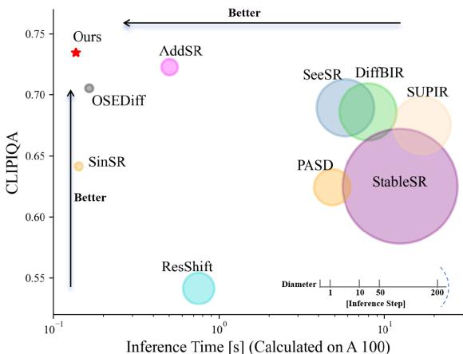

[← 返回 README](../README.md)

# 1. Introduction

## 📌 预览
引言把动机分成两层：多步 diffusion SR 太慢，现有一步蒸馏又容易方向不稳、细节不够。TSD-SR 的核心是让 score guidance 更接近真实 HQ 方向。

Image super-resolution (ISR) [8, 9, 23, 26] aims to transform low-quality (LQ) images, which have been degraded by noise or blur, into clear high-quality (HQ) images. Unlike traditional ISR methods [6, 67], which assume a known degradation process, real-world image superresolution (Real-ISR) [47, 63] focuses on enhancing images affected by complex and unknown degradations, thereby offering greater practical utility.

*Figure 1. Performance and efficiency comparison among Real-ISR methods. TSD-SR stands out for achieving high-quality restoration with the fastest speed among diffusion-based models. In contrast, existing models prioritize either speed or restoration performance. The performance of each method is benchmarked on an A100 GPU with the DRealSR dataset.*

> 💡 **Figure 1 批读**: Figure 1 把 TSD-SR 放在质量-速度二维平面上：它要证明自己不是单纯追求更高感知分，而是在 one-step 推理约束下仍靠近多步 diffusion 的质量区间。A100+DRealSR 的设定也提示速度数字主要反映服务器 GPU 场景。

Generative models, particularly Generative Adversarial Networks (GANs) [11, 33, 37] and Diffusion Models (DMs) [17, 40, 42], have demonstrated remarkable capabilities in tackling Real-ISR tasks. GAN-based methods utilize adversarial training by alternately optimizing a generator and a discriminator to produce realistic images. While GANs support one-step inference, they are often hindered by challenges such as mode collapse and training instability [2]. Recently, Diffusion Models (DMs) have demonstrated impressive performance in image generation [21, 48]. Their strong priors enable them to produce more realistic images with richer details compared to GAN-based methods [40, 42]. Some researchers [29, 54, 57, 61] have successfully leveraged pre-trained DMs for Real-ISR tasks. However, due to the iterative denoising nature of diffusion models [17], the Real-ISR process is computationally expensive.

To achieve an efficient and one-step network akin to GANs, several pioneering methods that condense the iterations of diffusion models through distillation [12, 15, 18, 58] have been proposed [49, 53, 55]. Among these works, OSEDiff [53] introduced the Variational Score Distillation (VSD) loss [51] to Real-ISR tasks, achieving stateof-the-art (SOTA) one-step performance by leveraging prior knowledge from pre-trained models. Despite these advancements, our investigation has revealed two critical limitations associated with VSD in Real-ISR applications. (1) Unreliable gradient direction. VSD relies on a Teacher Model to provide a “true gradient direction.” However, this guidance is proven unreliable in scenarios where initial ISR outputs are suboptimal. (2) Insufficient detail recovery. The VSD loss exhibits notable variation across different timesteps, and the uniform sampling strategy for $t$ poses challenges in aligning the score function with detailed texture recovery requirements. These findings underscore the need for more effective approaches to address these issues.

In this paper, we propose a novel method called TSD-SR to distill a multi-step Text-to-Image (T2I) DMs [10, 38, 40] into an effective one-step diffusion model tailored for the Real-ISR task. Specifically, TSD-SR consists of two components: Target Score Distillation (TSD) and Distribution-Aware Sampling Module (DASM). TSD incorporates our newly proposed Target Score Matching (TSM) loss to compensate for the limitations of the VSD loss. This significant score loss leverages HQ data to provide a reliable optimization trajectory during distillation, effectively reducing visual artifacts caused by deviant predictions from the Teacher Model. DASM is designed to enhance detail recovery by strategically sampling low-noise samples that are distribution-based during training. This approach effectively allocates more optimization to early timesteps within a single iteration, thereby improving the recovery of fine details.

> 💡 **机制拆解**: DASM 不只是数据增强，而是构造更贴近 diffusion 真实轨迹的 noisy latent，使 teacher 在该点给出的 score 更有细节恢复意义。

Experiments on popular benchmarks demonstrate that TSD-SR achieves superior restoration performance (most of the metrics perform the best) and high efficiency (the fastest inference speed, 40 times faster than SeeSR) compared to the state-of-the-art Real-ISR methods based on pre-trained DMs, while requiring only a single inference step, as shown in (Fig. 1).

Our main contribution can be summarized as threefold:

• We propose a novel method called TSD-SR to achieve one-step DMs distillation for the Real-ISR task.
• We introduce Target Score Distillation (TSD) to provide reliable gradients that enhance the realism of outputs from Real-ISR methods.
• We design a Distribution-Aware Sampling Module (DASM) specifically tailored to enhance the capability of detail restoration.

> 💡 **机制拆解**: DASM 不只是数据增强，而是构造更贴近 diffusion 真实轨迹的 noisy latent，使 teacher 在该点给出的 score 更有细节恢复意义。

---

## 🔖 Section 总结
- 引言证明需求来自速度和质量的双重矛盾：多步 diffusion 慢，一步蒸馏容易细节不足。
- TSD-SR 的设计抓手是 score 方向校正，而不是增加推理步数。
- 可追问：在真实部署中，低 PSNR 是否会影响文字、人脸身份等结构敏感区域？
