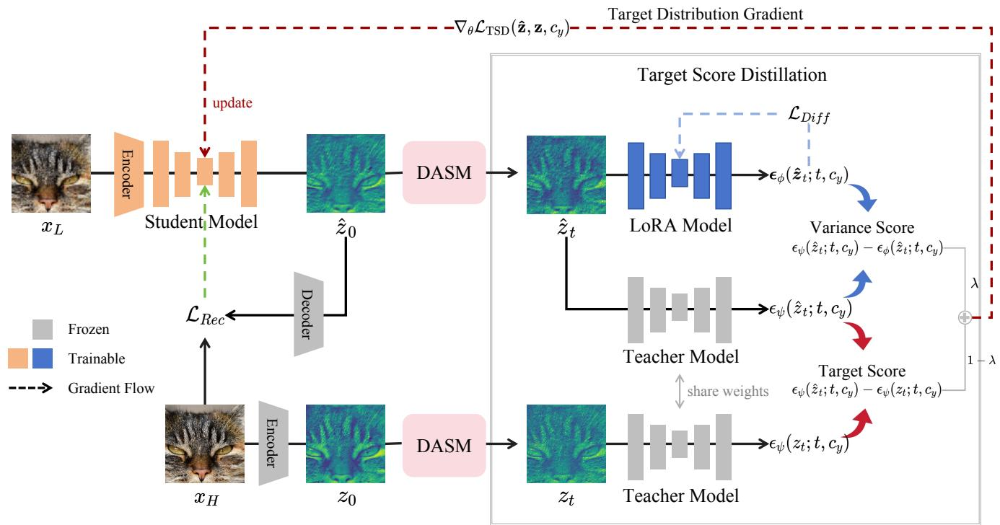

[← 返回 README](../README.md)

# 2. Related Work

## 📌 预览
相关工作定位了 Real-ISR、diffusion prior、score distillation 三条线，说明 TSD-SR 不是换 backbone，而是改 one-step distillation 的监督信号。

GAN-based Real-ISR. Since SRGAN [26] first applied GAN to ISR, it has effectively enhanced visual quality by combining adversarial loss with perceptual loss [7, 66]. Subsequently, ESRGAN [46] introduced Residual-in-Residual Dense Block and a relativistic average discriminator, further improving detail restoration. Methods like BSR-GAN [63] and Real-ESRGAN [47] simulate complex realworld degradation processes, achieving ISR under unknown degradation conditions, which enhances the model’s generalization ability. Although GAN-based methods are capable of adding more realistic details to images, they suffer from training instability and mode collapse [2].

Multi-step Diffusion-based Real-ISR. Some researches [29, 45, 54, 57, 61] in recent years have utilized the powerful image priors in pre-trained T2I diffusion models [35, 40, 65] for Real-SR tasks and achieved promising results. For example, StableSR [45] balances fidelity and perceptual quality by fine-tuning the time-aware encoder and employing controllable feature wrapping. DiffBiR [29] first processes the LR image through a reconstruction network and then uses the Stable Diffusion (SD) model [40] to supplement the details. SeeSR [54] attempts to better stimulate the generative power of the SD model by extracting the semantic information in the image as a conditional guide. PASD [57] introduces a pixel-aware cross attention module to enable the diffusion model to perceive the local structure of the image at the pixel level, while using a degradation removal module to extract degradation insensitive features to guide the diffusion process along with high-level information from the image. SUPIR [61] achieves a generative and fidelity capability using negative cues [16] as well as restoration-guided sampling, while using a larger pretraining model with a larger dataset to enhance the model capability. However, all of these methods are limited by the multi-step denoising of the diffusion model, which requires 20-50 iterations in inference, resulting in an inference time that lags far behind that of GAN-based methods.

One-step Diffusion-based Real-ISR. Recently, there has been a surge of interest within the academic community in one-step distillation techniques [31, 34, 41, 59, 60] for diffusion-based Real-ISR task. SinSR [49] leverages consistency preserving distillation to condense the inference steps of ResShift [62] into a single step, yet the generalization of ResShift and SinSR is constrained due to the absence of large-scale data training. AddSR [55] introduces the adversarial diffusion distillation (ADD) [41] to Real-ISR tasks, resulting in a comparatively effective four-step model. However, this method has a propensity to produce excessive and unnatural image details. OSEDiff [53] directly uses LQ images as the beginning of the diffusion process, and employs VSD loss [51] as a regularization technique to condense a multi-step pre-trained T2I model into a one-step Real-ISR model. However, due to the incorporation of alternating training strategies, OSEDiff may initially tend towards unreliable optimization directions, which may lead to visual artifacts.

*Figure 2. Pipeline overview. We train a one-step Student Model $G _ { \theta }$ to transform the low-quality image $x _ { L }$ into a more realistic one. The noisy latent $\hat { z } _ { t }$ sampled by DASM (Details can be found in Fig. 6.) will be fed into both the pre-trained Teacher and the LoRA Model to produce the Variational Score Loss. Subsequently, the Teacher’s predictions on $\hat { z } _ { t }$ and $_ { z _ { t } }$ yield the Target Score Loss. Their weighted forms, namely TSD (red flow), along with the pixel-space reconstruction loss (green flow), are leveraged to update the Student Model $G _ { \theta }$ . After updating the Student Model, we employ the diffusion loss (blue flow) to update the LoRA Model.*

> 💡 **Figure 2 批读**: Figure 2 是整篇数据流核心：红色 TSD 更新 student，蓝色 diffusion loss 更新 LoRA，绿色像素重建防止结果漂离 HQ。读图时要区分 student、frozen teacher、LoRA fake-score model 三个角色。

---

## 🔖 Section 总结
- 相关工作把本文放在 Real-ISR、diffusion prior 和 score distillation 交叉处。
- TSD-SR 继承 OSEDiff 式 one-step 框架，但把 VSD 改得更适合 SR。
- 可追问：TSD 能否迁移到 TADSR/OFTSR 等可控一步模型？
