[← 返回 README](../README.md)

# 3. Methodology

## 📌 预览
方法节按数据流读：LQ 经过 student 得到 SR，再构造更可靠的 noisy latent，由 teacher/LoRA 给 VSD 与 target score 信号，最后用 TSD 更新 student。

# 3.1. Preliminaries

Problem Formulation. The ISR problem aims to reconstruct a HQ image $x _ { H }$ from an LQ input $x _ { L }$ by training a parameterized ISR model $G _ { \theta }$ on a dataset $\begin{array} { r l } { \mathcal { D } } & { { } = } \end{array}$ $\{ ( x _ { L } , x _ { H } ) _ { i = 1 } ^ { N } \}$ , where $N$ represents the number of image pairs. Formally, this problem can be formulated as minimizing the following objective:

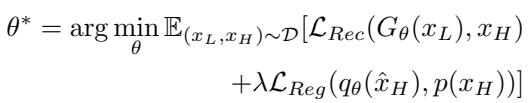
*Equation 1*

> 💡 **公式 1 批读**: 基础 Real-ISR 目标由 reconstruction loss 保住内容、regularization loss 拉近输出分布组成；TSD-SR 的后续设计主要是在 $\mathcal{L}_{Reg}$ 里替换更可靠的 diffusion score regularizer。

Here, $\mathcal { L } _ { R e c }$ denotes the reconstruction loss, commonly measured by distance metrics such as $L _ { 2 }$ or $L P I P S$ [66]. The regularization term $\mathcal { L } _ { R e g }$ improves the realism and generalization of the output of the ISR model. This objective can be understood as aligning the ISR output $\scriptstyle { \hat { x } } _ { H }$ ’s distribution, $q _ { \theta } ( \hat { x } _ { H } )$ , with the high-quality data $x _ { H }$ ’s distribution $p ( x _ { H } )$

by minimizing the KL-divergence [25]:

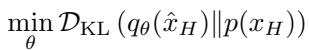
*Equation 2*

> 💡 **公式 2 批读**: KL 视角把 Real-ISR 说成 distribution alignment：student 输出分布 $q_\theta$ 要靠近真实 HQ 分布 $p$。问题是 KL 本身不可直接算，所以论文转向 diffusion score distillation 来近似这个方向。

While several studies [46, 47, 63] have employed adversarial loss to optimize this objective, they often encounter issues like mode collapse and training instability. Recent work [53] achieved state-of-the-art results using Variational Score Distillation (VSD) as the regularization loss to minimize this objective, which inspires our research.

Variational Score Distillation. Variational Score Distillation (VSD) [51] was initially introduced for text-to-3D generation, by distilling a pre-trained text-to-image diffusion model to optimize a single 3D representation [36].

In the VSD framework, a pre-trained diffusion model, represented as $\epsilon _ { \psi }$ , and its trainable (LoRA [19]) replica $\epsilon _ { \phi }$ , are used to regularize the generator network $G _ { \theta }$ . As outlined in ProlificDreamer [51], the gradient with respect to the generator parameters $\pmb { \theta }$ is formulated as follows:

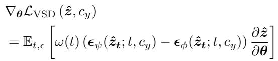
*Equation 3*

> 💡 **公式 3 批读**: VSD 梯度来自 teacher score 与 LoRA fake-score 的差值，再乘 student latent 对参数的梯度。TSD-SR 后面要指出：如果 $\hat z_t$ 本身质量差，teacher score 也可能朝错方向。

where $\hat { z } _ { t } = \alpha _ { t } \hat { z } + \sigma _ { t } \epsilon$ is the noisy input, $\hat { z }$ is the latent outputted by the generator network $G _ { \theta }$ , $\epsilon$ is a Gaussian noise,

and $\alpha _ { t } , \sigma _ { t }$ are the noise-data scaling constants. $c _ { y }$ is a text embedding corresponding to a caption that describes the input image, and $w ( t )$ is a time-varying weighting function.

# 3.2. Overview of TSD-SR

As depicted in Fig. 2, our goal is to distill a given pre-trained T2I DM into a fast one-step Student Model $G _ { \theta }$ , using the Teacher Model $\epsilon _ { \psi }$ and the trainable LoRA Model $\epsilon _ { \phi }$ . We denote the latent output of the distilled model as $\hat { z } _ { 0 }$ , and the HQ latent representation as ${ \boldsymbol { z } } _ { \mathbf { 0 } }$ . Both $\hat { z } _ { \mathbf { 0 } }$ and ${ \boldsymbol { z } } _ { \mathbf { 0 } }$ are passed through our Distribution-Aware Sampling Module (DASM) to obtain distribution-based samples $\hat { z } _ { t }$ and $z _ { t }$ (Sec. 3.4). We train $G _ { \theta }$ by minimizing the two losses: a reconstruction loss in pixel space to compare the model outputs against the ground truth, and a regularization loss (from Target Score Distillation) to enhance the realism (Sec. 3.3). After updating the Student Model, we update the LoRA Model with the diffusion loss. Finally, in Sec. 3.5, we present an overview of all the losses encountered during the training phase.

> 💡 **机制拆解**: DASM 不只是数据增强，而是构造更贴近 diffusion 真实轨迹的 noisy latent，使 teacher 在该点给出的 score 更有细节恢复意义。

# 3.3. Target Score Distillation

Similar to [53], we introduce VSD loss into our work as a regularization term to enhance the realism and generalization of the $G _ { \theta }$ ’s outputs. Upon reviewing VSD Eq. (3), $\epsilon _ { \phi } \big ( \hat { z } _ { t } ; t , c _ { y } \big )$ represents the current estimated gradient direction for $G _ { \theta }$ ’s noisy outputs $\hat { z } _ { t }$ , whereas $\epsilon _ { \psi } \big ( \hat { z } _ { t } ; t , c _ { y } \big )$ corresponds to the ideal gradient direction guiding towards more realistic outputs. The overarching goal of model optimization is to align the suboptimal gradient direction with the superior direction based on pre-trained priors, thus facilitating the optimization of the Student distribution toward that of the Teacher. However, this strategy encounters hurdles, especially in the early training phase: the quality of synthetic latent $\hat { z } _ { t }$ is not high enough for the Teacher Model to provide a precise prediction. As illustrated in Fig. 3, the Teacher Model struggles to accurately predict the optimization direction for low-quality synthetic latent $\hat { z } _ { t }$ in the early stage, as indicated by a cosine similarity of only 0.2 to the ideal direction, compared to 0.88 for high-quality latent $z _ { t }$ . This problem can lead to severe visual artifacts, as is evident in Fig. 4(a).

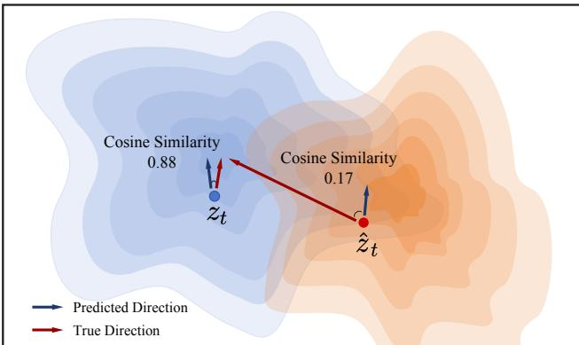
*Figure 3. A visual comparison of the gradient direction. We set the timestep $t$ to 100 and calculated the cosine similarity between the prediction directions from the Teacher Model and the true direction (towards the HQ data). The prediction direction for $_ { z _ { t } }$ closely matches the true direction, but not for $\hat { z } _ { t }$ , suggesting that suboptimal samples may lead to directional deviations.*

> 💡 **Figure 3 批读**: Figure 3 用方向余弦解释为什么 naive VSD 不够稳：如果 noisy latent 偏离真实轨迹，teacher 给出的方向就可能不是朝 HQ 走。TSD 的动机就是用 target score 纠正这个方向偏差。

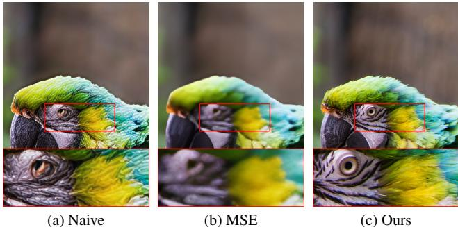
*Figure 4. The visualization of different strategies. (a) The naive method introduces fake textures and fails to recover fine details. (b) MSE leads to over-smoothed generation results, lacking highfrequency information. (c) Our method offers the superior visual effects and fine textures.*

> 💡 **Figure 4 批读**: Figure 4 对比 naive、MSE 和本文方法：naive 容易假纹理，MSE 过平滑，TSD-SR 试图在真实细节和结构保真之间取得更好的局部平衡。

Target Score Matching (TSM):

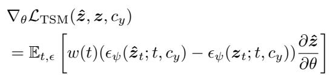
*Equation 4*

> 💡 **公式 4 批读**: TSM 不直接把 synthetic latent 拉到 HQ latent，而是让 teacher 对 $\hat z_t$ 和 $z_t$ 的预测更一致。这样保留了 diffusion prior 的高频生成能力，避免 MSE 把细节抹平。

A straightforward remedial measure is to employ a mean squared error (MSE) loss to align the synthetic latent with the ideal inputs of the Teacher Model, which are derived from the HQ latent. However, as shown in Fig. 4(b), this approach has been observed to lead to over-smoothed results [13]. Our strategy, instead, is to align the predictions made by the Teacher Model on both synthetic and HQ latent, thereby encouraging greater consistency between them. The core idea is that for samples drawn from the same distribution, the real scores predicted by the Teacher Model should be close to each other. We refer to this approach as where the expectation of the gradient is computed across all diffusion timesteps $t \in \{ 1 , \cdots , T \}$ and $\epsilon \sim \mathcal { N } ( 0 , I )$ . Equation (4) encapsulates the optimization loss for our Target Score Matching. Upon examining it in conjunction with Eq. (3), we notice that VSD utilizes the prediction residual between the Teacher and the LoRA Model to drive gradient backpropagation. Similarly, our TSM employs the synthetic and the HQ data to produce the gradients. By blending these two strategies with hyperparameter weights $\lambda$ and $1 - \lambda$ , we construct a combined optimization loss that effectively unifies the strengths of both approaches, as formulated in

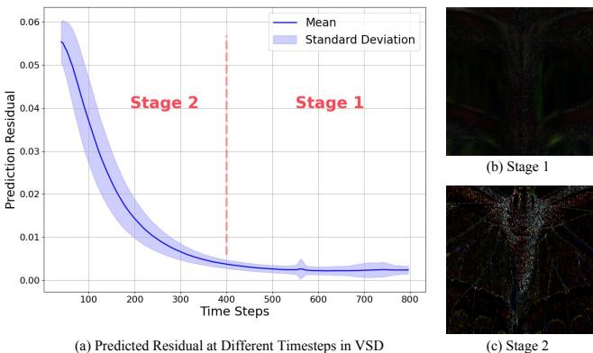
*Figure 5. (a) The prediction errors of the VSD loss at different timesteps. The error divergence is more pronounced in early timesteps than later. This phenomenon is observed throughout the optimization process. (b) The visualization of Stage 1 prediction error. (c) The visualization of Stage 2 prediction error.*

> 💡 **Figure 5 批读**: Figure 5 解释 timestep 上的误差差异：早期 timestep 误差分化更明显，意味着直接随机采样 timestep 的 VSD 梯度并不均匀可靠，后续 TSM/DASM 要处理的正是这个问题。

Eq. (5), to guide the training process.

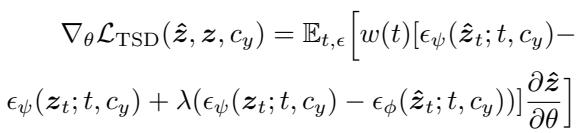
*Equation 5*

> 💡 **公式 5 批读**: TSD 把两种残差合起来：teacher-vs-LoRA 提供生成真实感，teacher-on-synthetic-vs-teacher-on-HQ 提供 target direction。$\lambda$ 控制它更像普通 VSD 还是更依赖 HQ target score。

where $w ( t )$ is a time-aware weighting function tailored for Real-ISR. Other symbols are consistent with those previously defined. By introducing the prediction of the pretrained diffusion model on HQ latent, we have circumvented the issue of the model falling into visual artifacts or producing over-smoothed results, as illustrated in Fig. 4(c).

# 3.4. Distribution-Aware Sampling Module

> 💡 **机制拆解**: DASM 不只是数据增强，而是构造更贴近 diffusion 真实轨迹的 noisy latent，使 teacher 在该点给出的 score 更有细节恢复意义。

In the VSD-based framework, it is necessary to match the score functions predicted by the Teacher Model and the LoRA Model across timesteps $t \in { 0 , 1 , \ldots , T }$ . However, for the Real-ISR problem, this matching performance is inconsistent across timesteps, as illustrated in Fig. 5(a). This phenomenon may be attributed to the reliance on lowfrequency (LF) priors in the LQ data, while lacking guidance from high-frequency (HF) details. The output sample $\hat { z } _ { \mathbf { 0 } }$ , derived from LQ data, contains low-frequency (LF) priors that are easily captured by the LoRA Model, resulting in similar predictions during LF restoration (Stage 1), as shown in Fig. 5(b). However, in Stage 2, due to the absence of high-frequency (HF) details in $\hat { z } _ { \mathbf { 0 } }$ , the LoRA Model struggles to reconstruct fine-grained features, leading to divergent predictions, as illustrated in Fig. 5(c). To address this issue, we aim to reduce such divergence.

Existing methods match the score function at each iteration using a single latent sample $\hat { z } _ { t }$ , with the timestep $t$ drawn from a uniform distribution. This leads to slow convergence and even training difficulty during Stage 2, as gradients from important timesteps are diluted by uniform averaging. To this end, we propose our Distribution-Aware Sampling Module (DASM). This module accumulates optimization gradients for earlier timestep samples in a single iteration, enabling the backpropagation of more gradients focused on detail optimization. As shown in Fig. 6, we first obtain the noisy synthetic latent representation as $\hat { z } _ { t } = ( 1 - \sigma _ { t } ) \hat { z } _ { 0 } + \sigma _ { t } \epsilon$ , where $\sigma _ { t }$ is a weighting factor and $\epsilon$ denotes Gaussian noise. Subsequently, we employ a LoRA Model to perform denoising, yielding noisy samples at the previous timestep as described in Eq. (6):

> 💡 **机制拆解**: DASM 不只是数据增强，而是构造更贴近 diffusion 真实轨迹的 noisy latent，使 teacher 在该点给出的 score 更有细节恢复意义。

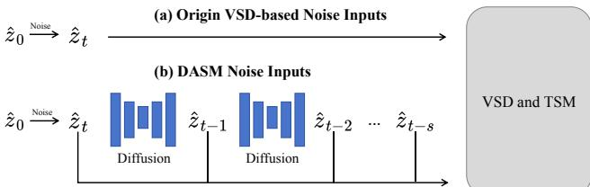
*Figure 6. Illustration of DASM. Top: The naive approach that adds noise directly to the samples. Bottom: The proposed DASM leverages diffusion model priors to generate noisy latent that better align with the true sampling trajectory. These noisy samples can all serve as inputs to the downstream network, enabling effective gradient backpropagation.*

> 💡 **Figure 6 批读**: Figure 6 是 DASM 的关键直觉：不是对 student 输出直接加噪声，而是借 diffusion prior 生成更贴近真实采样轨迹的 noisy latent，让梯度更容易关注细节恢复。

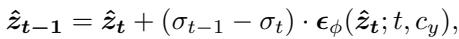
*Equation 6*

> 💡 **公式 6 批读**: DASM 用 flow matching scheduler 从 $\hat z_t$ 沿轨迹回推到更早 timestep，而不是只做一次随机加噪；这让一次 iteration 内积累多个细节相关梯度。

The parameters $\sigma _ { t - 1 }$ and $\sigma _ { t }$ are obtained from the flow matching scheduler. Here, the LoRA Model has learned the distribution of $\hat { z } _ { \mathbf { 0 } }$ . Similarly, ${ \boldsymbol { z } } _ { t - 1 }$ can be obtained by denoising using the Teacher Model. In a single iteration, gradients from noisy samples along the sampling trajectory can be accumulated to update the Student Model. Since these samples follow the diffusion sampling trajectory and are concentrated at early timesteps, this approach effectively reduces the divergence observed in Stage 2.

# 3.5. Training Objective

We summarize all the losses that we used in our framework. Student Model $G _ { \theta }$ . We train our Student Model with the reconstruction loss $\mathcal { L } _ { R e c }$ and the regularization loss $\mathcal { L } _ { R e g }$ . For the reconstruction loss, we use the $L P I P S$ loss in the pixel space and the $M S E$ loss in the latent space:

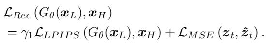
*Equation 7*

> 💡 **公式 7 批读**: reconstruction loss 同时在 pixel space 用 LPIPS 保视觉结构、在 latent/noisy space 用 MSE 稳定 diffusion 训练点。它负责把 TSD 的真实感约束限制在不破坏输入内容的范围内。

For the regularization loss, we use our TSD loss, Eq. (5). Therefore, the overall training objective for the Student Model $G _ { \theta }$ is:

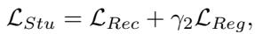
*Equation 8*

> 💡 **公式 8 批读**: student 总损失就是 reconstruction + TSD regularization。$\gamma_2$ 决定 diffusion prior 介入强度，$\gamma_1$ 的 ramp-up 则让训练后期更重视感知一致性。

where $\gamma _ { 1 }$ and $\gamma _ { 2 }$ are weighting factors. We initialize both $\gamma _ { 1 }$ and $\gamma _ { 2 }$ to 1 at the beginning of training. As optimization

progresses, we ramp up $\gamma _ { 1 }$ from 1 to 2 while maintaining $\gamma _ { 2 }$ at its initial value.

LoRA Model $\epsilon _ { \phi }$ . As stipulated by VSD, the replica $\epsilon _ { \phi }$ must be trainable, with its training objective being:

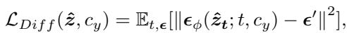
*Equation 9*

> 💡 **公式 9 批读**: LoRA replica 不是推理模块，而是训练时估计 student 输出分布的 fake score。它必须跟随 student 更新，否则 VSD/TSD 的 teacher-vs-fake residual 会失真。

where $\epsilon ^ { \prime }$ serves as the training target for the denoising network, representing Gaussian noise in the context of DDPM, and a gradient towards HQ data for flow matching.

---

## 🔖 Section 总结
- 方法主线是 Target Score Distillation + Distribution-Aware Sampling Module。
- TSM 解决方向偏差，DASM 解决细节梯度可达性，reconstruction loss 保住基本结构。
- 可追问：target score 使用 real image reference 时会不会过拟合训练数据分布？
