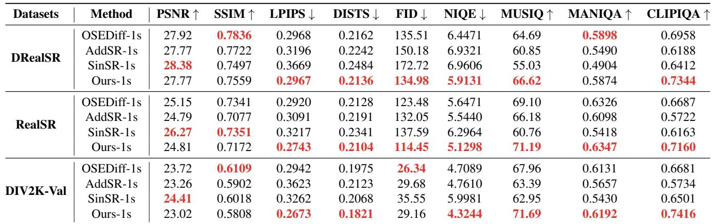
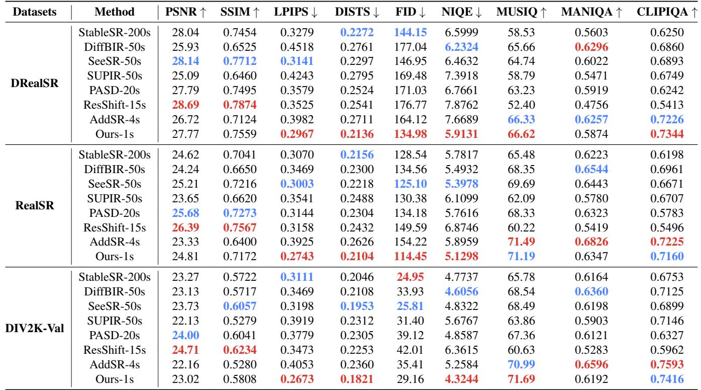
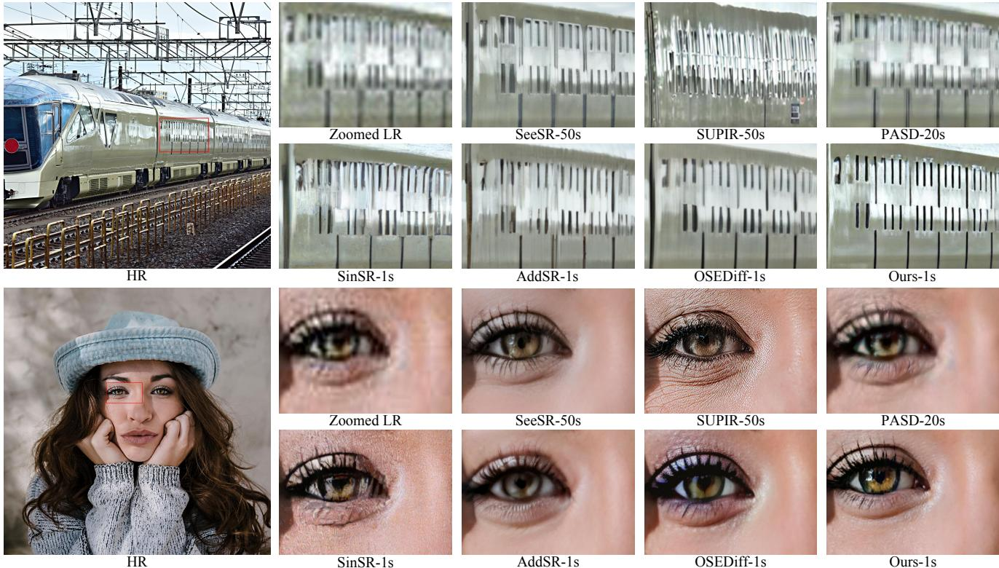
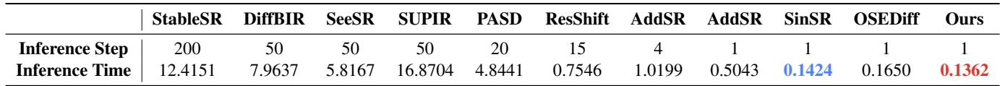
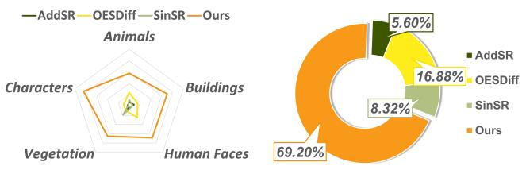
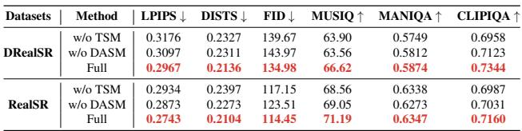
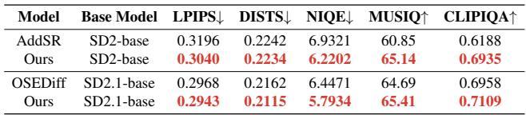
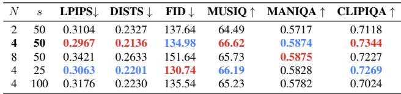

[← 返回 README](../README.md)

# 4. Experiments

## 📌 预览
实验节证明三类 claim：质量比一步 baseline 更好，速度仍是一秒级/一步，TSM 与 DASM 的消融都支撑方法设计。

# 4.1. Experimental Settings

Training Datasets. For training, we utilize DIV2K [1], Flickr2K [43], LSDIR [27], and the first 10K face images from FFHQ [20]. To synthesize LR-HR pairs, we adopt the same degradation pipeline as in Real-ESRGAN [47].

Test Datasets. We evaluate our model on the synthetic DIV2K-Val [1] dataset, as well as two real-world datasets: RealSR [4] and DRealSR [52]. The real-world datasets consist of $1 2 8 \times 1 2 8$ low-quality (LQ) and $5 1 2 { \times } 5 1 2$ high-quality (HQ) image pairs. For the synthetic set, 3,000 pairs were generated by cropping $5 1 2 { \times } 5 1 2$ patches from DIV2K-Val and applying the Real-ESRGAN [47] degradation pipeline to downsample them to $1 2 8 \times 1 2 8$ .

Evaluation Metrics. To evaluate our method, we employ both full-reference and no-reference metrics. The fullreference metrics include PSNR and SSIM [50] (computed on the Y channel of the YCbCr color space) for fidelity; LPIPS [66] and DISTS [7] for perceptual quality; and FID [14] for measuring distribution similarity. The no-reference metrics include NIQE [64], MANIQA [56], MUSIQ [22], and CLIPIQA [44].

Compared Methods. We categorize the test models into two groups: single-step and multi-step inference. The single-step inference diffusion models include SinSR [49], AddSR [55], and OSEDiff [53]. The multi-step inference diffusion models comprise StableSR [45], ResShift [62], PASD [57], DiffBIR [29], SeeSR [54], SUPIR [61], and AddSR [55]. Specifically, for AddSR, we have conducted comparisons between its single-step and four-step models. GAN-based Real-ISR methods [5, 28, 47, 63] are detailed in the supplementary material.

Implementation Details. All models are initialized from the Teacher Model (SD3 [10] in our work). Similar to OSEDiff [53], we only train the VAE encoder and the denoising network in the Student Model, freezing the VAE decoder to preserve its prior [24]. We utilize the default prompt for the Student Model, while prompts are extracted from HQ images for the Teacher and LoRA models during training. We adopt the AdamW optimizer [30] with a learning rate of 5e-6 for the Student Model and 1e-6 for the LoRA Model, setting the LoRA rank to 64 for both models.

During the initial training phase, we incorporate MSE loss in the latent space and exclude DASM to stabilize training and reduce time cost. In later stages, we remove the MSE loss to avoid over-smoothed results and introduce DASM to enhance restoration quality. The training process took approximately 96 hours, utilizing 8 NVIDIA V100 GPUs with a batch size of 16.

> 💡 **复现成本**: 96 小时、8 张 V100、batch 16 说明方法虽推理快，但训练成本不低；适合离线训练后部署，而不是轻量快速迁移。

# 4.2. Comparison with Existing Methods

Quantitative Comparisons. Tab. 1 shows the quantitative comparison of our method with other single-step diffusion models on three datasets. Our method achieves the best results across most evaluation metrics. SinSR and AddSR, as distilled versions of previous multi-step super-resolution methods, significantly reduce inference steps while suffering a corresponding drop in performance. OSEDiff introduces the VSD loss from 3D generation tasks into the Real-ISR without fully accounting for the substantial differences between the two domains. As a result, its no-reference image quality metrics are not satisfactory. In contrast, our proposed TSD-SR, specifically designed for Real-ISR, outperforms all other single-step models in the vast majority of key metrics.

Tab. 2 shows the quantitative comparison with multistep models. We can draw the following conclusions: (1) TSD-SR demonstrates significant advantages over competing methods in terms of LPIPS, DISTS, and NIQE. Additionally, it outperforms most multi-step models in FID, MUSIQ, and CLIPIQA. (2) DiffBIR, SeeSR, PASD, and AddSR achieve better results in terms of MANIQA, which may be attributed to the fact that multi-step models benefit from more denoising iterations to generate richer details. (3) ResShift stands out with the highest PSNR and SSIM scores, while StableSR also performs well in terms of DISTS and FID. However, both models underperform on the no-reference metrics.

Finally, we explain the relatively lower PSNR and SSIM scores observed in our experiments. Several studies [55, 61] have shown that these reconstruction metrics are not wellsuited for the evaluation of Real-ISR tasks. Models that recover more realistic or detailed textures often yield lower PSNR and SSIM scores, reflecting a fundamental trade-off between perceptual quality and pixel-wise fidelity [3, 32, 68]. This phenomenon has also been extensively discussed in the other research work [3, 32, 45, 55, 61, 66, 68]. LPIPS [66] is proposed to overcome the limitation that PSNR and SSIM fail to align with human judgments in spatial ambiguities situations. Other DMs-based SR researchers [45, 61] argue that DMs introduce superior pre-trained priors, enabling the restoration of information that traditional methods (from scratch) cannot achieve. However, such capability often leads to a decline in pixel-level metrics, as they prioritize distribution modeling and sampling from learned distributions over strict pixel fidelity. We anticipate the development of better full-reference metrics in the future to assess advanced Real-ISR methods. Refer to the supplementary material for detailed visual comparisons.

> 💡 **指标解读**: 作者主动解释 PSNR/SSIM 下降，这很重要；TSD-SR 的目标是感知真实而不是逐像素最优，应该同时看 LPIPS/FID/NIQE/CLIPIQA 和用户偏好。

Table 1. Quantitative comparison with the state-of-the-art one-step methods across both synthetic and real-world benchmarks. The number of diffusion inference steps is indicated by ‘s’. The best results of each metric are highlighted in red.

*Table 1: Table 1. Quantitative comparison with the state-of-the-art one-step methods across both synthetic and real-world benchmarks. The number of diffusion inference steps is indicated by ‘s’. The best results of each metric are highlighted in red.   *

> 💡 **Table 1 批读**: Table 1 是一步方法主结果。TSD-SR 重点不是 PSNR 第一，而是在 LPIPS/DISTS/FID/NIQE/MUSIQ/CLIPIQA 等感知与分布指标上整体领先，说明 TSD 改的是生成质量而非像素拟合。

Table 2. Quantitative comparison with state-of-the-art multi-step methods across both synthetic and real-world benchmarks. The numbe of diffusion inference steps is indicated by ‘s’. The best and second best results of each metric are highlighted in red and blue, respectively.

*Table 2: Table 2. Quantitative comparison with state-of-the-art multi-step methods across both synthetic and real-world benchmarks. The numbe of diffusion inference steps is indicated by ‘s’. The best and second best results of each metric are highlighted in red and blue, respectively.   *

> 💡 **Table 2 批读**: Table 2 把 TSD-SR 与多步模型比较：它在速度上明显占优，同时在多个感知指标接近或超过多步模型；MANIQA 等个别指标落后也说明多步采样仍能产生更丰富细节。

Qualitative Comparisons. Fig. 7 presents visual comparisons of different Real-ISR methods. As shown in the results of multi-step methods, SeeSR leverages degradationaware semantic cues to incorporate image generation priors, but it tends to produce over-smoothed textures in some cases. SUPIR demonstrates notably robust generative capabilities. However, the excessive generation of fine details can result in outputs that appear less natural (e.g., adding unnecessary wrinkles around the eyes of a young girl). Under more realistic degradation conditions, PASD finds it difficult to recover the appropriate content, indicating limited robustness. Among single-step methods, SinSR tends to produce artifacts, likely due to its base model, ResShift, being trained from scratch without adequate exposure to realworld priors, which leads to inferior image restoration quality. AddSR produces over-smoothed results when using its

*Figure 7. Visual comparisons of different Real-ISR methods. Please zoom in for a better view.*

> 💡 **Figure 7 批读**: Figure 7 是视觉证据链：TSD-SR 的优势集中在纹理、边缘和语义合理细节，但也需要警惕 SR 任务中“看起来真实”不等于逐像素可验证。

Table 3. Comparison of computational complexity across different diffusion model-based methods. Performance is measured on an A100 GPU using $5 1 2 { \times } 5 1 2$ input images, excluding model weight and data loading time.

*Table 3: Table 3. Comparison of computational complexity across different diffusion model-based methods. Performance is measured on an A100 GPU using $5 1 2 { \times } 5 1 2$ input images, excluding model weight and data loading time.   *

> 💡 **Table 3 批读**: Table 3 是效率证据：TSD-SR 只有 1 step，512x512 A100 上 0.1362s，比 SeeSR 快 40x 以上，也比 OSEDiff 略快。速度收益主要来自 LQ 直接 denoise 和固定 prompt。

1-step model. OSEDiff demonstrates better restoration performance than SinSR and AddSR; however, it may fall short in terms of authenticity and naturalness, particularly in recovering fine details. In contrast, our method effectively generates rich textures and realistic details with enhanced sharpness and contrast. Additional visual comparisons and results are provided in the supplementary material.

Complexity Comparisons We assess the computational complexity of the state-of-the-art DM-based Real-ISR methods, as detailed in Tab. 3, with a focus on inference time. Each method is benchmarked on an A100 GPU using input images of size $5 1 2 { \times } 5 1 2$ pixels. We disregarded the loading time for model weights and data. The main computation time consists of: (1) text extraction time (if a text extractor is used); (2) text encoder computation time (if applicable); (3) VAE encoding and decoding time; and (4) denoising network execution time. It is evident that TSD-SR holds a substantial advantage in inference speed compared to multi-step models. Specifically, TSD-SR is over $1 2 0 \times$ faster than SUPIR, $9 0 \times$ faster than StableSR, approximately

$5 0 \times$ faster than DiffBIR, over $4 0 \times$ faster than SeeSR, more than $3 5 \times$ faster than PASD, and $4 \times$ faster than ResShift. When compared with existing one-step models, our method achieves the fastest inference times. This advantage is attributed to directly denoising from LQ data and employing a fixed prompt.

# 4.3. User Study

We conduct a user study comparing our method with three other diffusion-based one-step super-resolution methods. To ensure a comprehensive evaluation, we selected images from five categories—human faces, buildings, animals, vegetation, and characters. A total of 50 participants took part in the voting process. Participants were instructed to select the best restoration results based on similarity to the HQ image, structural similarity to the LQ image, and realism of textures and details. The results in Fig. 8 indicate that our method received a $6 9 . 2 \%$ approval rate from users. Specifically, our method achieved $5 7 . 6 \%$ in Animals, $7 0 . 0 \%$ in Buildings, $6 8 . 8 \%$ in Human Faces, $6 5 . 2 \%$ in Vegetation, and $8 4 . 4 \%$ in Characters, surpassing those of other methods.

> 💡 **证据链**: 用户研究补足 no-reference 指标，特别适合 Real-ISR 这种 GT 与真实感不完全一致的任务；但 50 人规模仍应视为辅助证据。

*Figure 8. Results of our user study. Left: Category-based user preference radar chart, showing that our model received the highest favor across all categories. Right: User preference pie chart, illustrating that our approach garnered a $6 9 . 2 \%$ user satisfaction rating.*

> 💡 **Figure 8 批读**: Figure 8 用人类偏好补足指标局限。69.2% 总满意度说明感知偏好支持本文 claim，但用户研究也受样本类别、展示方式和比较方法选择影响。

Table 4. Ablation study of Target Score Matching loss and Distribution-Aware Sampling Module.

*Table 4: Table 4. Ablation study of Target Score Matching loss and Distribution-Aware Sampling Module.   *

> 💡 **Table 4 批读**: Table 4 是方法消融核心证据：去掉 TSM 或 DASM 都让 LPIPS、DISTS、FID 和 no-reference 指标变差，说明 target score 与 distribution-aware sampling 分别承担方向校正和细节采样作用。

# 4.4. Ablation Study

Effectiveness of TSM and DASM. To validate the effectiveness of the TSM loss and DASM, we conduct ablation studies by removing each component separately. We select LPIPS, DISTS, MUSIQ, MANIQA, and CLIPIQA for comparison, as these metrics are critical for image quality assessment. Additionally, FID is used to evaluate distribution similarity. The results are presented in Tab. 4. From the results, we draw the following conclusions: (1) The absence of TSM loss and DASM negatively impacts performance across both reference-based metrics (LPIPS, DISTS) and no-reference metrics (MUSIQ, MANIQA, and CLIPIQA). The FID metric is also adversely affected, indicating a decline in distribution fidelity. (2) The lack of TSM leads to a significant decrease in LPIPS, DISTS, MUSIQ, and CLIP-IQA, possibly due to unreliable directions in VSD leading to unrealistic generations. (3) The absence of DASM results in a decline in FID, MUSIQ, and CLIPIQA, possibly due to suboptimal detail optimization.

> 💡 **消融解读**: TSM 主要校正 score 方向，DASM 主要改善细节梯度采样；两个去掉都会损伤质量，说明不是单一 trick。

Base model for fairer comparison. To validate the effectiveness of our method across different versions of SD models, we conduct additional experiments on SD2-base and SD2.1-base models, as shown in Tab. 5. The performance is evaluated on the DRealSR test dataset [52]. Our method demonstrates superior performance compared to other one-step SR methods, including OSEDiff [53] and

Table 5. Fair comparison using the same base model to validate TSD-SR

*Table 5: Table 5. Fair comparison using the same base model to validate TSD-SR   *

> 💡 **Table 5 批读**: Table 5 做同底座公平比较，排除“只是 SD3 更强”的解释。即使用 SD2/SD2.1，TSD-SR 仍优于 AddSR/OSEDiff 的多项感知指标。

Table 6. Ablation studies for hyperparameter $N$ and $s$ .

*Table 6: Table 6. Ablation studies for hyperparameter $N$ and $s$ .   *

> 💡 **Table 6 批读**: Table 6 说明 DASM 的超参不是越大越好。N=4、s=50 是质量和训练成本折中，N 太大或 s 太大都会削弱图像质量。

AddSR [55]. Specifically, our SD2-base model outperforms single-step AddSR across all perceptual reference and no-reference metrics, particularly excelling in NIQE [64], MUSIQ [22], and CLIPIQA [44]. Meanwhile, our SD2.1-base model shows comparable or better performance than OSEDiff across various metrics, with notable improvements in NIQE and CLIPIQA.

Parameters $N$ and $s$ in DASM. We compare performance under different combinations of $N$ and $s$ in Tab. 6. The evaluation is conducted on the DRealSR test dataset. In our setting, $N$ is set to 4 and $s$ to 50 (highlighted in bold in the table). Performance degrades when $N$ is either larger or smaller, possibly due to its effect on regularization strength. Since DASM is computationally expensive, we prefer a smaller $N$ . After balancing training time and performance, we select $N = 4$ as the final value. Smaller values of $s$ yield similar performance, while larger values degrade image quality. Experimental results suggest that choosing $s$ between 25 and 75 achieves better overall performance.

---

## 🔖 Section 总结
- 实验支撑质量、速度和消融三条证据链。
- 关键数字包括 0.1362s、比 SeeSR 快 40x 以上、用户满意度 69.2%。
- 可追问：用户偏好和结构安全之间如何建立更可靠评价？
