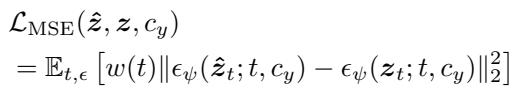
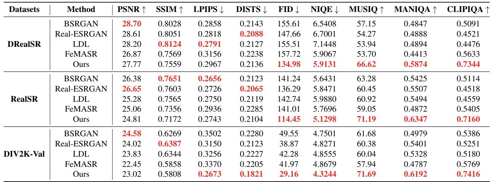
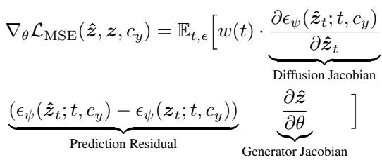
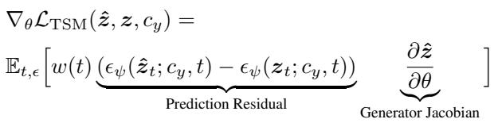
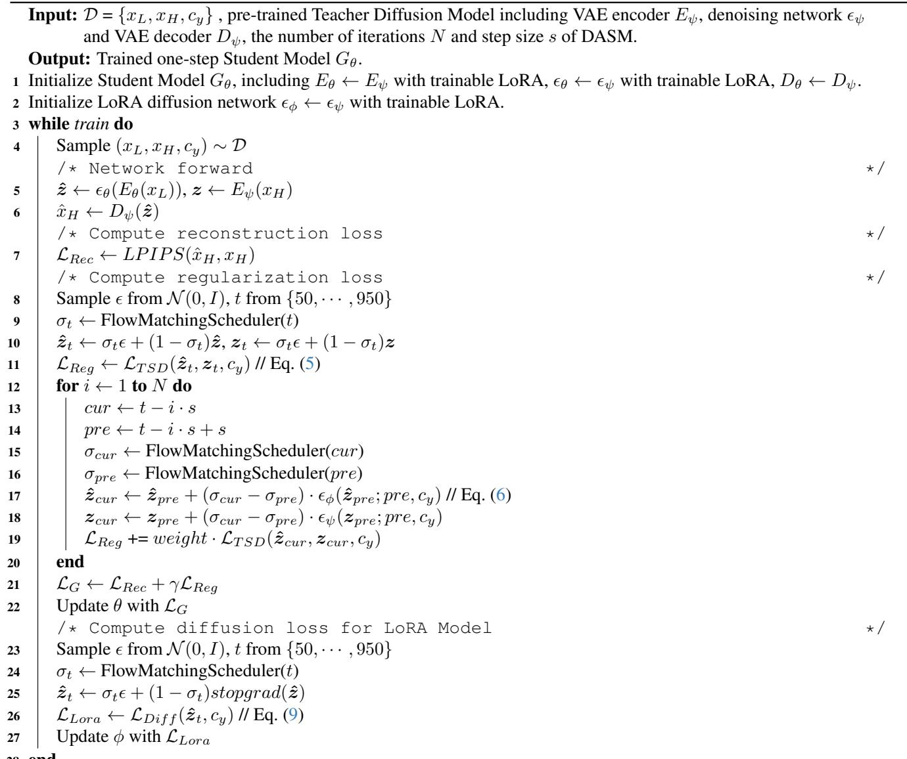

[← 返回 README](../README.md)

# Supplementary Material

## 📌 预览
附录补充 GAN 对比、更多视觉结果、PSNR/SSIM 与人类偏好的冲突、Target Score Matching 理论和训练算法。

In this Supplementary Material, we provide additional details, including the comparison with GAN-based methods in Appendix A, more visual comparisons in Appendix B, comparisons of full-reference metrics and human preference in Appendix C, theory of Target Score Matching in Appendix D and algorithm in Appendix E. We conduct these additional comparisons and analyses to validate the effectiveness of TSD-SR.

# A. Comparison with GAN-based Methods

We compare our method with GAN-based approaches in Tab. 7. While the GAN methods show advantages in fullreference metrics such as PSNR and SSIM, our model outperforms them across all no-reference metrics. Prior studies have highlighted the limitations of PSNR and SSIM for evaluating image super-resolution performance [55, 61]. Their effectiveness in assessing image fidelity in complex degradation scenarios remains debatable, as pixel-level misalignment often arises when restoring severely degraded images. However, no-reference metrics evaluate image quality based solely on the individual image, without requiring alignment with the ground truth. Therefore, in more complex and realistic degradation scenarios, they may offer a more appropriate evaluation of super-resolution results. In Appendix C, we further provide a visual comparison between full-reference metrics and human preferences, and in Fig. 9, we present a visual comparison with GAN-based methods. From these visualizations, it is evident that our model produces more realistic texture details than the GANbased approaches.

# B. More Visual Comparisons

In Figs. 10 to 12, we provide additional visual comparisons with other diffusion-based methods. These examples further demonstrate the robust restoration capabilities of TSD-SR and the high quality of the restored images.

# C. Comparisons of Full-reference Metrics and Human Preference

We present additional comparative experiments in Figure 13 to demonstrate the limitations of PSNR and SSIM in assessing image fidelity under complex degradation scenarios. As observed, GAN-based methods with higher PSNR and SSIM scores tend to produce over-smoothed or fragmented textures, raising concerns about their realism and perceptual fidelity. In contrast, our approach sacrifices some PSNR and SSIM performance to achieve more natural detail restoration, resulting in enhanced realism and broader perceptual acceptance. An additional user study shows that $9 0 . 2 8 \%$ of participants prefer our results over those of methods with higher PSNR and SSIM scores.

# D. Theory of Target Score Matching

The core idea of Target Score Matching (TSM) is that for samples drawn from the same distribution, the real scores predicted by the Teacher Model should be close to each other. Thus, we minimize the MSE loss between the Teacher Model’s predictions on $\hat { z } _ { t }$ and ${ \boldsymbol { z } } _ { t }$ by

*Equation 10*

> 💡 **公式 10 批读**: Appendix 先写出 TSM 的 MSE 形式：比较 teacher 在 synthetic noisy latent 与 HQ noisy latent 上的预测。它说明 TSM 本质上是“target score consistency”，不是像普通 MSE 那样直接惩罚像素/latent 距离。

where the expectation of the gradient is computed across all diffusion timesteps $t \in \{ 1 , \cdots , T \}$ and $\epsilon \sim \mathcal { N } ( 0 , I )$ .

Table 7. Quantitative comparison with GAN-based methods on both synthetic and real-world benchmarks. The best results of each metric are highlighted in red.

*Table 7: Table 7. Quantitative comparison with GAN-based methods on both synthetic and real-world benchmarks. The best results of each metric are highlighted in red.   *

> 💡 **Table 7 批读**: Table 7 把 TSD-SR 与 GAN-based 方法比较，主要用于说明高感知质量并不是只靠 GAN 可获得，diffusion prior 在真实纹理建模上更强。

*Figure 9. Qualitative comparisons between TSD-SR and GAN-based Real-ISR methods. Please zoom in for a better view.*

> 💡 **Figure 9 批读**: Figure 9 把 TSD-SR 与 GAN-based Real-ISR 放在一起，主要说明 diffusion prior 的真实纹理更自然；但 GAN 方法可能在局部结构保真上仍有优势。

To understand the difficulties of this approach, consider the gradient of

*Equation 11*

> 💡 **公式 11 批读**: 完整梯度会包含 diffusion Jacobian，也就是反传穿过 teacher denoiser 的项。论文指出这既昂贵又可能在小噪声下不稳定，因此后面采用类似 SDS/VSD 的省略近似。

where we absorb $\frac { \partial \hat { { \boldsymbol z } } _ { t } } { \partial \hat { { \boldsymbol z } } }$ and the other constant into $w ( t )$ . The computation of the Diffusion Jacobian term is computationally demanding, as it necessitates backpropagation through the Teacher Model. DreamFusion [36] found that this term struggles with small noise levels due to its training to approximate the scaled Hessian of marginal density. This work also demonstrated that omitting the Diffusion Jacobian term leads to an effective gradient for optimizing. Similar to their approach, we update Eq. (11) by omitting Diffusion Jacobian:

*Equation 12*

> 💡 **公式 12 批读**: 省略 diffusion Jacobian 后，梯度只保留 prediction residual 与 generator Jacobian。这个形式让 TSM 可以像 VSD 一样高效训练，同时把残差从 teacher-LoRA 换成 teacher(HQ)-teacher(synthetic)。

The effectiveness of the method can be proven by starting from the KL divergence. We can use a Sticking-the-Landing [39] style gradient by thinking of $\epsilon _ { \psi } \big ( z _ { t } ; c _ { y } , t \big )$ as a control variate for ϵˆ. For detailed proof, refer to Appendix 4 of DreamFusion [36]. It demonstrates that the gradient of this loss yields the same updates as optimizing the training loss $\mathcal { L } _ { \mathrm { M S E } }$ Eq. (10), excluding the Diffusion Jacobian term.

Compared with the VSD loss, we find that the term “Prediction Residual” has changed, and the two losses are similar in the gradient update mode. Specifically, we find that VSD employs identical inputs for both the Teacher and

LoRA models to compute the gradient, while here TSM uses high-quality and suboptimal inputs for the Teacher Model. The losses are related to each other through $\epsilon _ { \phi } \big ( \hat { z } _ { t } ; t , c _ { y } \big )$ .

# E. Algorithm

Algorithm 1 details our TSD-SR training procedure. We use classifier-free guidance (cfg) for the Teacher Model and the LoRA Model. The cfg weight is set to 7.5.

# References

[1] Eirikur Agustsson and Radu Timofte. Ntire 2017 challenge on single image super-resolution: Dataset and study. In Proceedings of the IEEE conference on computer vision and pattern recognition workshops, pages 126–135, 2017. 6
[2] Martin Arjovsky, Soumith Chintala, and Leon Bottou. ´ Wasserstein generative adversarial networks. In International conference on machine learning, pages 214–223. PMLR, 2017. 1, 2
[3] Yochai Blau and Tomer Michaeli. The perception-distortion tradeoff. In Proceedings of the IEEE conference on computer vision and pattern recognition, pages 6228–6237, 2018. 6
[4] Jianrui Cai, Hui Zeng, Hongwei Yong, Zisheng Cao, and Lei Zhang. Toward real-world single image super-resolution: A new benchmark and a new model. In Proceedings of the IEEE/CVF international conference on computer vision, pages 3086–3095, 2019. 6
[5] Chaofeng Chen, Xinyu Shi, Yipeng Qin, Xiaoming Li, Xiaoguang Han, Tao Yang, and Shihui Guo. Real-world blind super-resolution via feature matching with implicit highresolution priors. In Proceedings of the 30th ACM International Conference on Multimedia, pages 1329–1338, 2022. 6
[6] Hanting Chen, Yunhe Wang, Tianyu Guo, Chang Xu, Yiping Deng, Zhenhua Liu, Siwei Ma, Chunjing Xu, Chao Xu, and Wen Gao. Pre-trained image processing transformer. In Proceedings of the IEEE/CVF conference on computer vision and pattern recognition, pages 12299–12310, 2021. 1

*Figure 10. Qualitative comparisons between TSD-SR and different diffusion-based methods. Our method can effectively restore the texture and details of the corresponding object under challenging degradation conditions. Please zoom in for a better view.*

> 💡 **Figure 10 批读**: Figure 10 是附录视觉扩展，用更多样例验证 TSD-SR 在复杂退化下的细节恢复不是单个例子的偶然现象。

*Figure 11. Qualitative comparisons between TSD-SR and different diffusion-based methods. Our method can effectively restore the texture and details of the corresponding object under challenging degradation conditions. Please zoom in for a better view.*

> 💡 **Figure 11 批读**: Figure 11 继续扩展 diffusion baseline 对比，重点看真实纹理是否伴随不合理 hallucination。

*Figure 12. Qualitative comparisons between TSD-SR and different diffusion-based methods. Our method can effectively restore the texture and details of the corresponding object under challenging degradation conditions. Please zoom in for a better view.*

> 💡 **Figure 12 批读**: Figure 12 展示更多 challenging degradation 情况，支撑 DASM 对细节梯度可达性的作用。

*Figure 13. Comparisons between full-reference metric assessments and human visual preference. Despite scoring lower on full-reference metrics, TSD-SR generates images that align with human preference.*

> 💡 **Figure 13 批读**: Figure 13 直接讨论 PSNR/SSIM 与人类偏好分裂：TSD-SR 牺牲部分 full-reference 分数换取更自然的感知结果，这是 Real-ISR 中必须显式报告的 trade-off。

[7] Keyan Ding, Kede Ma, Shiqi Wang, and Eero P Simoncelli. Image quality assessment: Unifying structure and texture similarity. IEEE transactions on pattern analysis and machine intelligence, 44(5):2567–2581, 2020. 2, 6

[8] Chao Dong, Chen Change Loy, Kaiming He, and Xiaoou Tang. Learning a deep convolutional network for image super-resolution. In Computer Vision–ECCV 2014: 13th European Conference, Zurich, Switzerland, September 6-12, 2014, Proceedings, Part IV 13, pages 184–199. Springer, 2014. 1
[9] Chao Dong, Chen Change Loy, Kaiming He, and Xiaoou

Tang. Image super-resolution using deep convolutional networks. IEEE transactions on pattern analysis and machine intelligence, 38(2):295–307, 2015. 1

[10] Patrick Esser, Sumith Kulal, Andreas Blattmann, Rahim Entezari, Jonas Muller, Harry Saini, Yam Levi, Dominik ¨ Lorenz, Axel Sauer, Frederic Boesel, et al. Scaling rectified flow transformers for high-resolution image synthesis. In Forty-first International Conference on Machine Learning, 2024. 2, 6

[11] Ian Goodfellow, Jean Pouget-Abadie, Mehdi Mirza, Bing Xu, David Warde-Farley, Sherjil Ozair, Aaron Courville, and

# Algorithm 1: TSD-SR Training Procedure

*Algorithm 1: TSD-SR Training Procedure*

> 💡 **Algorithm 1 批读**: 伪代码把训练循环拆成 student update 与 LoRA update 两条线。student 先用 reconstruction loss 保住内容，再用 TSD regularization 和 DASM 采样得到的多步 latent 约束真实感；LoRA replica 则用 diffusion loss 追踪 student 输出分布，供下一轮 VSD/TSD 梯度使用。

Yoshua Bengio. Generative adversarial nets. Advances in neural information processing systems, 27, 2014. 1
[12] Jianping Gou, Baosheng Yu, Stephen J Maybank, and Dacheng Tao. Knowledge distillation: A survey. International Journal of Computer Vision, 129(6):1789–1819, 2021. 2
[13] Xiangyu He and Jian Cheng. Revisiting l1 loss in superresolution: a probabilistic view and beyond. arXiv preprint arXiv:2201.10084, 2022. 4
[14] Martin Heusel, Hubert Ramsauer, Thomas Unterthiner, Bernhard Nessler, and Sepp Hochreiter. Gans trained by a two time-scale update rule converge to a local nash equilibrium. Advances in neural information processing systems, 30, 2017. 6
[15] Geoffrey Hinton. Distilling the knowledge in a neural network. arXiv preprint arXiv:1503.02531, 2015. 2
[16] Jonathan Ho and Tim Salimans. Classifier-free diffusion guidance. arXiv preprint arXiv:2207.12598, 2022. 2
[17] Jonathan Ho, Ajay Jain, and Pieter Abbeel. Denoising diffusion probabilistic models. Advances in neural information processing systems, 33:6840–6851, 2020. 1
[18] Andrew G Howard. Mobilenets: Efficient convolutional neural networks for mobile vision applications. arXiv preprint arXiv:1704.04861, 2017. 2
[19] Edward J Hu, Yelong Shen, Phillip Wallis, Zeyuan Allen-Zhu, Yuanzhi Li, Shean Wang, Lu Wang, and Weizhu Chen. Lora: Low-rank adaptation of large language models. arXiv preprint arXiv:2106.09685, 2021. 3
[20] Tero Karras, Samuli Laine, and Timo Aila. A style-based generator architecture for generative adversarial networks. In Proceedings of the IEEE/CVF conference on computer vision and pattern recognition, pages 4401–4410, 2019. 6
[21] Bahjat Kawar, Michael Elad, Stefano Ermon, and Jiaming Song. Denoising diffusion restoration models. Advances in Neural Information Processing Systems, 35:23593–23606, 2022. 1
[22] Junjie Ke, Qifei Wang, Yilin Wang, Peyman Milanfar, and Feng Yang. Musiq: Multi-scale image quality transformer. In Proceedings of the IEEE/CVF international conference on computer vision, pages 5148–5157, 2021. 6, 9
[23] Jiwon Kim, Jung Kwon Lee, and Kyoung Mu Lee. Accurate image super-resolution using very deep convolutional networks. In Proceedings of the IEEE conference on computer vision and pattern recognition, pages 1646–1654, 2016. 1
[24] Diederik P Kingma. Auto-encoding variational bayes. arXiv preprint arXiv:1312.6114, 2013. 6
[25] Solomon Kullback and Richard A Leibler. On information and sufficiency. The annals of mathematical statistics, 22(1): 79–86, 1951. 3
[26] Christian Ledig, Lucas Theis, Ferenc Huszar, Jose Caballero, ´ Andrew Cunningham, Alejandro Acosta, Andrew Aitken, Alykhan Tejani, Johannes Totz, Zehan Wang, et al. Photorealistic single image super-resolution using a generative adversarial network. In Proceedings of the IEEE conference on computer vision and pattern recognition, pages 4681–4690, 2017. 1, 2
[27] Yawei Li, Kai Zhang, Jingyun Liang, Jiezhang Cao, Ce Liu, Rui Gong, Yulun Zhang, Hao Tang, Yun Liu, Denis Demandolx, et al. Lsdir: A large scale dataset for image restoration. In Proceedings of the IEEE/CVF Conference on Computer Vision and Pattern Recognition, pages 1775–1787, 2023. 6
[28] Jie Liang, Hui Zeng, and Lei Zhang. Details or artifacts: A locally discriminative learning approach to realistic image super-resolution. In Proceedings of the IEEE/CVF Conference on Computer Vision and Pattern Recognition, pages 5657–5666, 2022. 6
[29] Xinqi Lin, Jingwen He, Ziyan Chen, Zhaoyang Lyu, Bo Dai, Fanghua Yu, Wanli Ouyang, Yu Qiao, and Chao Dong. Diffbir: Towards blind image restoration with generative diffusion prior. arXiv preprint arXiv:2308.15070, 2023. 1, 2, 6
[30] I Loshchilov. Decoupled weight decay regularization. arXiv preprint arXiv:1711.05101, 2017. 6
[31] Simian Luo, Yiqin Tan, Longbo Huang, Jian Li, and Hang Zhao. Latent consistency models: Synthesizing highresolution images with few-step inference. arXiv preprint arXiv:2310.04378, 2023. 2
[32] Xiaotong Luo, Yuan Xie, Yanyun Qu, and Yun Fu. Skipdiff: Adaptive skip diffusion model for high-fidelity perceptual image super-resolution. In Proceedings of the AAAI Conference on Artificial Intelligence, pages 4017–4025, 2024. 6
[33] Mehdi Mirza. Conditional generative adversarial nets. arXiv preprint arXiv:1411.1784, 2014. 1
[34] Thuan Hoang Nguyen and Anh Tran. Swiftbrush: One-step text-to-image diffusion model with variational score distillation. In Proceedings of the IEEE/CVF Conference on Computer Vision and Pattern Recognition, pages 7807–7816, 2024. 2
[35] Dustin Podell, Zion English, Kyle Lacey, Andreas Blattmann, Tim Dockhorn, Jonas Muller, Joe Penna, and ¨ Robin Rombach. Sdxl: Improving latent diffusion models for high-resolution image synthesis. arXiv preprint arXiv:2307.01952, 2023. 2
[36] Ben Poole, Ajay Jain, Jonathan T Barron, and Ben Mildenhall. Dreamfusion: Text-to-3d using 2d diffusion. arXiv preprint arXiv:2209.14988, 2022. 3, 13
[37] Alec Radford. Unsupervised representation learning with deep convolutional generative adversarial networks. arXiv preprint arXiv:1511.06434, 2015. 1
[38] Aditya Ramesh, Prafulla Dhariwal, Alex Nichol, Casey Chu, and Mark Chen. Hierarchical text-conditional image generation with clip latents. arXiv preprint arXiv:2204.06125, 1 (2):3, 2022. 2
[39] Geoffrey Roeder, Yuhuai Wu, and David K Duvenaud. Sticking the landing: Simple, lower-variance gradient estimators for variational inference. Advances in Neural Information Processing Systems, 30, 2017. 13
[40] Robin Rombach, Andreas Blattmann, Dominik Lorenz, Patrick Esser, and Bjorn Ommer. High-resolution image ¨ synthesis with latent diffusion models. In Proceedings of the IEEE/CVF conference on computer vision and pattern recognition, pages 10684–10695, 2022. 1, 2
[41] Axel Sauer, Dominik Lorenz, Andreas Blattmann, and Robin Rombach. Adversarial diffusion distillation. arXiv preprint arXiv:2311.17042, 2023. 2
[42] Yang Song, Jascha Sohl-Dickstein, Diederik P Kingma, Abhishek Kumar, Stefano Ermon, and Ben Poole. Score-based generative modeling through stochastic differential equations. arXiv preprint arXiv:2011.13456, 2020. 1
[43] Radu Timofte, Eirikur Agustsson, Luc Van Gool, Ming-Hsuan Yang, and Lei Zhang. Ntire 2017 challenge on single image super-resolution: Methods and results. In Proceedings of the IEEE conference on computer vision and pattern recognition workshops, pages 114–125, 2017. 6
[44] Jianyi Wang, Kelvin CK Chan, and Chen Change Loy. Exploring clip for assessing the look and feel of images. In Proceedings of the AAAI Conference on Artificial Intelligence, pages 2555–2563, 2023. 6, 9
[45] Jianyi Wang, Zongsheng Yue, Shangchen Zhou, Kelvin CK Chan, and Chen Change Loy. Exploiting diffusion prior for real-world image super-resolution. International Journal of Computer Vision, pages 1–21, 2024. 2, 6
[46] Xintao Wang, Ke Yu, Shixiang Wu, Jinjin Gu, Yihao Liu, Chao Dong, Yu Qiao, and Chen Change Loy. Esrgan: Enhanced super-resolution generative adversarial networks. In Proceedings of the European conference on computer vision (ECCV) workshops, pages 0–0, 2018. 2, 3
[47] Xintao Wang, Liangbin Xie, Chao Dong, and Ying Shan. Real-esrgan: Training real-world blind super-resolution with pure synthetic data. In Proceedings of the IEEE/CVF international conference on computer vision, pages 1905–1914, 2021. 1, 2, 3, 6
[48] Yinhuai Wang, Jiwen Yu, and Jian Zhang. Zero-shot image restoration using denoising diffusion null-space model. arXiv preprint arXiv:2212.00490, 2022. [49] Yufei Wang, Wenhan Yang, Xinyuan Chen, Yaohui Wang, Lanqing Guo, Lap-Pui Chau, Ziwei Liu, Yu Qiao, Alex C Kot, and Bihan Wen. Sinsr: diffusion-based image superresolution in a single step. In Proceedings of the IEEE/CVF Conference on Computer Vision and Pattern Recognition, pages 25796–25805, 2024. 2, 6 [50] Zhou Wang, Alan C Bovik, Hamid R Sheikh, and Eero P Simoncelli. Image quality assessment: from error visibility to structural similarity. IEEE transactions on image processing,
13(4):600–612, 2004. 6 [51] Zhengyi Wang, Cheng Lu, Yikai Wang, Fan Bao, Chongxuan Li, Hang Su, and Jun Zhu. Prolificdreamer: High-fidelity and diverse text-to-3d generation with variational score distillation. Advances in Neural Information Processing Systems,
36, 2024. 2, 3 [52] Pengxu Wei, Ziwei Xie, Hannan Lu, Zongyuan Zhan, Qixiang Ye, Wangmeng Zuo, and Liang Lin. Component divideand-conquer for real-world image super-resolution. In Computer Vision–ECCV 2020: 16th European Conference, Glasgow, UK, August 23–28, 2020, Proceedings, Part VIII 16, pages 101–117. Springer, 2020. 6, 9 [53] Rongyuan Wu, Lingchen Sun, Zhiyuan Ma, and Lei Zhang. One-step effective diffusion network for real-world image super-resolution. arXiv preprint arXiv:2406.08177, 2024. 2,
3, 4, 6, 9 [54] Rongyuan Wu, Tao Yang, Lingchen Sun, Zhengqiang Zhang, Shuai Li, and Lei Zhang. Seesr: Towards semanticsaware real-world image super-resolution. In Proceedings of the IEEE/CVF conference on computer vision and pattern recognition, pages 25456–25467, 2024. 1, 2, 6 [55] Rui Xie, Ying Tai, Kai Zhang, Zhenyu Zhang, Jun Zhou, and Jian Yang. Addsr: Accelerating diffusion-based blind super-resolution with adversarial diffusion distillation. arXiv preprint arXiv:2404.01717, 2024. 2, 6, 9, 11 [56] Sidi Yang, Tianhe Wu, Shuwei Shi, Shanshan Lao, Yuan Gong, Mingdeng Cao, Jiahao Wang, and Yujiu Yang. Maniqa: Multi-dimension attention network for no-reference image quality assessment. In Proceedings of the IEEE/CVF Conference on Computer Vision and Pattern Recognition, pages 1191–1200, 2022. 6 [57] Tao Yang, Rongyuan Wu, Peiran Ren, Xuansong Xie, and Lei Zhang. Pixel-aware stable diffusion for realistic image super-resolution and personalized stylization. arXiv preprint arXiv:2308.14469, 2023. 1, 2, 6 [58] Junho Yim, Donggyu Joo, Jihoon Bae, and Junmo Kim. A gift from knowledge distillation: Fast optimization, network minimization and transfer learning. In Proceedings of the IEEE conference on computer vision and pattern recognition, pages 4133–4141, 2017. 2 [59] Tianwei Yin, Michael Gharbi, Taesung Park, Richard Zhang, ¨ Eli Shechtman, Fredo Durand, and William T Freeman. Improved distribution matching distillation for fast image synthesis. arXiv preprint arXiv:2405.14867, 2024. 2 [60] Tianwei Yin, Michael Gharbi, Richard Zhang, Eli Shecht- ¨ man, Fredo Durand, William T Freeman, and Taesung Park. One-step diffusion with distribution matching distillation. In Proceedings of the IEEE/CVF Conference on Computer Vision and Pattern Recognition, pages 6613–6623, 2024. 2
[61] Fanghua Yu, Jinjin Gu, Zheyuan Li, Jinfan Hu, Xiangtao Kong, Xintao Wang, Jingwen He, Yu Qiao, and Chao Dong. Scaling up to excellence: Practicing model scaling for photorealistic image restoration in the wild. In Proceedings of the IEEE/CVF Conference on Computer Vision and Pattern Recognition, pages 25669–25680, 2024. 1, 2, 6, 11
[62] Zongsheng Yue, Jianyi Wang, and Chen Change Loy. Resshift: Efficient diffusion model for image superresolution by residual shifting. Advances in Neural Information Processing Systems, 36, 2024. 2, 6
[63] Kai Zhang, Jingyun Liang, Luc Van Gool, and Radu Timofte. Designing a practical degradation model for deep blind image super-resolution. In Proceedings of the IEEE/CVF International Conference on Computer Vision, pages 4791– 4800, 2021. 1, 2, 3, 6
[64] Lin Zhang, Lei Zhang, and Alan C Bovik. A feature-enriched completely blind image quality evaluator. IEEE Transactions on Image Processing, 24(8):2579–2591, 2015. 6, 9
[65] Lvmin Zhang, Anyi Rao, and Maneesh Agrawala. Adding conditional control to text-to-image diffusion models. In Proceedings of the IEEE/CVF International Conference on Computer Vision, pages 3836–3847, 2023. 2
[66] Richard Zhang, Phillip Isola, Alexei A Efros, Eli Shechtman, and Oliver Wang. The unreasonable effectiveness of deep features as a perceptual metric. In Proceedings of the IEEE conference on computer vision and pattern recognition, pages 586–595, 2018. 2, 3, 6
[67] Xindong Zhang, Hui Zeng, Shi Guo, and Lei Zhang. Efficient long-range attention network for image superresolution. In European conference on computer vision, pages 649–667. Springer, 2022. 1
[68] Yuehan Zhang, Bo Ji, Jia Hao, and Angela Yao. Perceptiondistortion balanced admm optimization for single-image super-resolution. In European Conference on Computer Vision, pages 108–125. Springer, 2022. 6

---

## 🔖 Section 总结
- 附录补充了理论、算法、GAN 对比和更多视觉证据。
- PSNR/SSIM 与人类偏好冲突是阅读本文实验的关键背景。
- 可追问：Target Score Matching 的假设在不同退化分布上是否仍成立？
