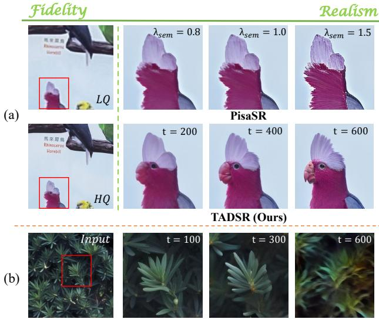

[← 返回 README](../README.md)

# 1. Introduction

## 📌 预览
引言把 TADSR 定位为“时间可控的一步 SR”：同一个模型通过 timestep 改变 latent 与 teacher guidance，从而控制 fidelity-realism trade-off。

Real-World Image Super-Resolution (Real-ISR) aims to restore high-quality (HQ) images from low-quality (LQ) inputs degraded by complex and unknown factors in realworld scenarios, which has recently attracted increasing attention [9, 16, 25, 35, 37, 40]. To address a broader spectrum of degradation types and achieve more realistic results, many researchers have turned to generative models, particularly diffusion models [11]. Consequently, several works have explored leveraging the generative priors in pretrained Stable Diffusion (SD) models [20] to tackle Real-ISR, yielding impressive results [9, 18, 22, 24, 33, 34]. Nevertheless, the iterative denoising process inherent in diffusion models introduces significant computational overhead

> 💡 **任务背景**: Real-ISR 面向未知复合退化，真实感和保真度天然冲突；TADSR 把这个冲突显式变成 timestep 控制变量。

*Figure 1. (a) Comparison between our TADSR(Ours) and PisaSR [21]. In PisaSR, increasing the semantic weight $\lambda _ { s e m }$ leads to restore more realistic images. As the timestep condition $t$ increases, our model recovers a more realistic parrot image. In contrast, PisaSR shows only an increase in sharpness as $\lambda _ { s e m }$ increases. (b) The input image and the corresponding outputs of the SD at different timesteps $t$ . The outputs vary significantly across different timesteps, reflecting distinct generative priors.*

> 💡 **Figure 1 批读**: Figure 1 是 TADSR 的核心动机图：SD 在不同 timestep 的 prior 确实不同，PisaSR 调语义权重主要变锐度，而 TADSR 调 timestep 会改变语义真实感。

and latency.

To overcome these limitations, some researchers have focused on distilling SD into an efficient one-step model for Real-ISR [3, 8, 21, 32, 38, 39]. Specifically, OSEDiff [32] first leverages the Variational Score Distillation (VSD) loss [29] to distill the SD model, enabling realistic image reconstruction in a single step. Subsequently, S3Diff [39], PisaSR [21], AdcSR [3], and TSDSR [8] also adopt distillation-based approaches to develop SD-based one-step Real-ISR models, using either adversarial loss or modified VSD loss. They typically use a pre-trained SD with trainable LoRA modules as the student model to perform Real-ISR, while employing a fixed-weight SD as the teacher to provide generative guidance.

However, these methods generally fix the timestep (e.g. step 999) injected into the student model while randomly sampling the timestep injected into the teacher model, which prevents them from effectively leveraging the generative prior in SD. Specifically, as shown in Figure 1(b), when the timestep $t$ equals 100, most of the image information is preserved, and the teacher’s output only differs in texture details. As the $t$ grows to 300, the teacher model increasingly activates leaf-related generative priors to predict content that has been obscured by noise. However, with $t$ increasing further to 600, most of the image information is lost, and the teacher model can only recover the overall structure and color of the leaves. This observation indicates that the pretrained SD model exhibits different generative priors at different timesteps. Therefore, existing methods generally suffer from the following two problems: (1) The fixed timestep injected into the student model fails to fully leverage the generative priors at different timesteps in the pretrained SD model; (2) The randomly sampled timestep injected into the teacher model makes it difficult to provide consistent generative guidance. As a result, as shown in Figure 1(a), although we increase the semantic weight $\lambda _ { s e m }$ in PisaSR [21], it only produces enhanced sharpness without significantly enriching the semantic content. In contrast, our method gradually generates a more realistic parrot as the timestep increases.

> 💡 **关键批判**: 固定 student timestep + 随机 teacher timestep 会产生两个错位：student latent 不随时间变，teacher guidance 又不稳定，因此 score guidance 容易互相冲突。

In the end, we propose Time-Aware One Step Diffusion Network for Super-Resolution (TADSR), a framework that more effectively distills the generative prior of SD at different timesteps into a one-step diffusion model for Real-ISR. To address the first limitation and better exploit the generative priors at different timesteps, two conditions need to be satisfied: (1) the student model should receive randomly sampled timesteps; (2) the latent features fed into the student model should vary with the timestep, reflecting the noise-level changes in SD. Therefore, we incorporate a Time-Aware VAE Encoder (TAE), which introduces a time embedding layer into the VAE encoder to map the same image to different latent representations based on the timestep. To address the second limitation and ensure consistent generative guidance, we propose a Time-Aware Variational Score Distillation (TAVSD) Loss, which associates the timestep injected into the student model with the one used in the teacher model through a mapping function. When the student model is conditioned on a larger timestep, the teacher receives a latent image corrupted with stronger noise, providing guidance that emphasizes stronger semantic generation in the reconstruction results. Conversely, a smaller timestep leads to similar results with reconstruction, primarily enhancing texture details. Therefore, TAVSD can provide a more consistent generative guidance condition on the injected timestep in the student model. Our contributions are summarized as follows:

> 💡 **机制拆解**: TAE 的作用不是加噪声，而是在不破坏重建保真的前提下模拟 diffusion latent 随 timestep 分布变化的性质。

• We propose TADSR, a Time-Aware One-Step Diffusion Network for Real-ISR, which naturally leverages the generative priors of SD at different timesteps to achieve controllable trade-offs between fidelity and realism in Real-ISR. Our TADSR achieves superior performance compared with other SD-based Real-ISR methods on both real-world and synthetic datasets. • We propose a Time-Aware VAE Encoder (TAE), which maps the same image to different latent representations based on the timestep, enabling the student model to fully exploit the generative priors at various timesteps. We propose a Time-Aware Variational Score Distillation (TAVSD) Loss, which aligns the timestep of the student and teacher models, providing consistent generative guidance at different timesteps.

---

## 🔖 Section 总结
- 引言指出固定 student timestep 与随机 teacher timestep 是现有 VSD one-step 方法的结构性错位。
- TADSR 用 $t_s$/$t_v$ 关联和 time-aware latent 解决这个错位。
- 可追问：较大 timestep 生成的语义细节何时会变成 hallucination？
