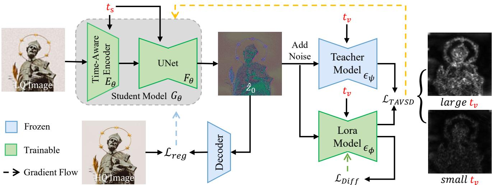

[← 返回 README](../README.md)

# 2. Related Work

## 📌 预览
相关工作说明 TADSR 继承了 SD-based Real-ISR 和 one-step VSD 蒸馏路线，但把固定 timestep 改为 time-aware latent/score 对齐。

# 2.1. Real-World Image Super-Resolution

> 💡 **任务背景**: Real-ISR 面向未知复合退化，真实感和保真度天然冲突；TADSR 把这个冲突显式变成 timestep 控制变量。

Traditional Image Super-Resolution (ISR) methods [5–7, 15, 17, 42, 43] typically degrade HQ images using simple downsampling operations to construct HQ-LQ image pairs for training. However, these approaches struggle to handle images degraded by complex real-world processes. To better simulate the unknown and complex degradations in real-world scenarios, several studies [25, 40] have proposed more sophisticated degradation pipelines to synthesize LQ data. Specifically, BSRGAN [40] introduces a random combination of basic degradation operations (e.g., downsampling, blurring, noise) injection, with varying intensities to generate realistic HQ-LQ pairs. Real-ESRGAN [25] proposes a second-order degradation scheme to cover a broader range of degradation types. In addition, inspired by Generative Adversarial Networks (GANs), researchers have adopted adversarial losses to encourage the reconstruction of more realistic images. Although these GAN-based methods can produce richer texture details compared to traditional approaches, they are often unstable to train and prone to generating unnatural artifacts [32].

*Figure 2. Overview of TADSR. We train a Student Model $G _ { \theta }$ to perform one-step Real-ISR, which consists of a Time-Aware VAE Encoder $E _ { \theta }$ and a UNet $F _ { \theta }$ . We randomly sample a timestep $t _ { s }$ and map it to $t _ { v }$ . The $t _ { s }$ and the LQ image are fed into the encoder $E _ { \theta }$ to obtain the LQ latent. Then, $t _ { s }$ and the LQ latent are fed into the UNet $F _ { \theta }$ to produce the reconstructed latent feature $\hat { z } _ { 0 }$ . After adding noise to $\hat { z } _ { 0 }$ corresponding to $t _ { v }$ , we feed it and $t _ { v }$ into the teacher model and the LoRA model to compute the TAVSD loss (orange flow). The reconstruction loss (blue flow) in pixel space and TAVSD loss is then used to jointly update the student model $G _ { \theta }$ . For the LoRA Model, we employ the diffusion loss (green flow) for training.*

> 💡 **Figure 2 批读**: Figure 2 给出完整训练流：student 接收 $t_s$，TAVSD 分支使用映射后的 $t_v$，teacher/LoRA 给 score residual，pixel reconstruction 和 TAVSD 共同更新 student。

# 2.2. Diffusion-Based Real-ISR

Recently, many researchers have leveraged the powerful generative priors of pre-trained diffusion models for Real-ISR tasks to achieve realistic image reconstruction. For example, StableSR [24] conditions the diffusion process on LQ images by injecting them through a learnable timeaware encoder into the SD model, enabling strong detail generation capabilities. DiffBIR [18] utilizes ControlNet to extract structural information from LQ images to better guide the generative prior of SD for SR. PASD [22] and SeeSR [33] extract semantic information from LQ inputs and inject it into SD, resulting in more realistic outputs. Although these approaches yield impressive results, the multistep denoising process leads to high computational and time costs. To accelerate diffusion-based Real-ISR, OSEDiff introduces the VSD loss to distill the pre-trained SD model, enabling realistic image reconstruction in a single step. S3Diff further adopts degradation-guided LoRA adapters combined with adversarial training to achieve one-step SR. PisaSR trains two separate LoRA adapters for pixel-level and semantic-level guidance, allowing controllable tradeoffs between realism and fidelity.

However, these methods overlook the varying generative capabilities of SD in different timesteps and train with a fixed timestep. Our work aims to fully exploit these timedependent generative prior to achieve superior SR performance and a natural balance between fidelity and realism.

---

## 🔖 Section 总结
- 相关工作显示 TADSR 是 OSEDiff/TSD-SR/PisaSR 后的时间可控分支。
- 它不是多步采样，而是在单步里重用 SD 的 timestep prior。
- 可追问：TADSR 与 TSD-SR 的 target score 能否结合？
