[← 返回 README](../README.md)

# 3. Methodology

## 📌 预览
方法节按数据流读：LQ + student timestep -> TAE latent -> UNet 输出 -> map 到 teacher timestep -> TAVSD 提供一致的时间条件生成指导。

# 3.1. Problem Definition

Real-ISR aims to reconstruct HQ images $x _ { H }$ from LQ images $x _ { L }$ that suffer from complex and unknown degradations. With the advancement of deep learning, researchers have commonly adopted neural networks $G _ { \theta }$ to estimate the HQ images and optimize the network through loss functions. The general form of the loss function is:

> 💡 **问题建模**: 公式把目标拆成 reconstruction loss 和 regularization loss，TADSR 的创新集中在让 regularization loss 的 SD prior 与时间条件一致。

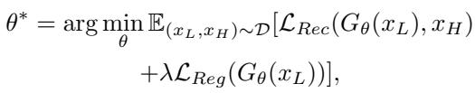
*Equation 1*

> 💡 **公式 1 批读**: 这是 Real-ISR 的总目标：$\mathcal{L}_{Rec}$ 负责保真，$\mathcal{L}_{Reg}$ 负责真实感。TADSR 的核心是让 regularization 不再用随机 timestep，而是跟 student 的时间条件一致。

where the $\mathcal { L } _ { R e c }$ denotes the reconstruction loss to optimize the fidelity of the reconstructed results. $\mathcal { L } _ { R e g }$ is the regression loss to enhance the realism of the results, and $\lambda$ is a hyperparameter to balance $\mathcal { L } _ { R e c }$ and $\mathcal { L } _ { R e g }$ .

Recently, with the advancement of diffusion models, several studies [21, 32] have leveraged the generative prior in pre-trained SD and adopted VSD as a regression objective. VSD is designed to align the distribution of generated (fake) images with that of real images. Specifically, a pretrained teacher model trained on real images is used to estimate the score of the real image distribution. In addition, a diffusion model trained on the generator’s outputs provides an estimate of the score of the fake distribution. The generator is then optimized by minimizing the discrepancy between these two score estimates, thereby encouraging it to produce samples that are indistinguishable from real images. The formation of VSD is:

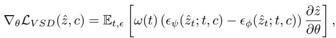
*Equation 2*

> 💡 **公式 2 批读**: 普通 VSD 用 teacher score 减 LoRA fake score 更新 student，但 timestep $t$ 是随机采样的。TADSR 认为这种随机 guidance 会和 one-step student 的固定状态冲突。

where $\epsilon _ { \psi }$ is the pre-trained diffusion model (teacher model) to estimate the real score, $\epsilon _ { \phi }$ represents its replica with trainable LoRA (LoRA model) to predict the fake score, and $c$ is a text embedding of a caption describing the input image. $\hat { z } = G _ { \theta } ( x _ { L } )$ is the output of the student network $G _ { \theta }$ , and $\hat { z } _ { t } = \alpha _ { t } \hat { z } + \beta _ { t } \epsilon$ is the noisy latent input. $\epsilon$ is the gaussian noise, and $\alpha _ { t }$ and $\beta _ { t }$ are the scale parameters in diffusion.

Formally, the VSD loss can be viewed as the residual between the noise outputs of the teacher model and the LoRA model, which can be transformed to the residual of their predicted latent images through $\begin{array} { r } { z = \frac { z _ { t } - \beta _ { t } \epsilon } { \alpha _ { t } } } \end{array}$ . In practice, the gradient of the VSD loss is applied only to the generator and does not propagate through the teacher model. Therefore, the loss can be expressed in the following form:

> 💡 **VSD 直觉**: teacher score 表示真实分布，LoRA score 表示生成分布，二者 residual 推动 student 输出更像真实图像；TADSR 进一步让这个 residual 与 timestep 对齐。

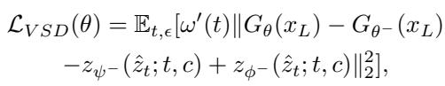
*Equation 3*

> 💡 **公式 3 批读**: 这里把 noise residual 改写成 predicted latent residual，并通过 stopgrad 固定 teacher/LoRA 分支。这个改写让作者能把 teacher 与 LoRA 的输出解码出来，观察不同 timestep 的 guidance 差异。

where $^ -$ denotes stopgrad(), $z _ { \psi }$ and $z _ { \phi }$ denote the predicted latent image of the teacher model and LoRA model, respectively. Therefore, we can decode the latent images predicted by the teacher model and the LoRA model into the image space to analyze the guidance provided by VSD.

# 3.2. Overview

As illustrated in Figure 2, we distill a Student Model $G _ { \theta }$ to perform one-step Real-ISR, which consists of a trainable Time-Aware Encoder $E _ { \theta }$ and a LoRA finetuned diffusion UNet $F _ { \theta }$ . Following the OSEDiff [32], we use a pretrained SD model as the Teacher Model $\epsilon _ { \psi }$ and its replica with trainable LoRA as the LoRA Model to obtain the fake score. First, we sample an HQ-LQ image pair from the dataset and a timestep $t _ { s }$ from a uniform distribution in the range of 0 to 999. Then, both the LQ image and $t _ { s }$ are fed into Student Model $G _ { \theta }$ to obtain the latent output $\hat { z } _ { 0 }$ . We decode $\hat { z } _ { 0 }$ into pixel space and compute the reconstruction loss with the HQ image. In the latent space, we map the $t _ { s }$ to another timestep $t _ { v }$ , and add noise corresponding to timestep $t _ { v }$ to the $\hat { z } _ { 0 }$ to obtain $\hat { z } _ { t _ { v } }$ . Then, we feed $\hat { z } _ { t _ { v } }$ and $t _ { v }$ into both the teacher model and the LoRA model to compute the Time-Aware Variational Score Distillation loss $\mathcal { L } _ { T A V S D }$ to enhance the realism. Consistent with Figure 1(b), when $t _ { v }$ is small, the gradients produced by the TAVSD loss are relatively small and mainly reflect texture details. In contrast, when $t _ { v }$ is large, the gradients become significantly larger and provide more semantic guidance. Therefore, the

> 💡 **数据流批注**: $t_s$ 控制 student 编码和 UNet，$t_v$ 控制 teacher/LoRA 的噪声强度；这个双时间设计是 TAVSD 区别于普通 VSD 的核心。

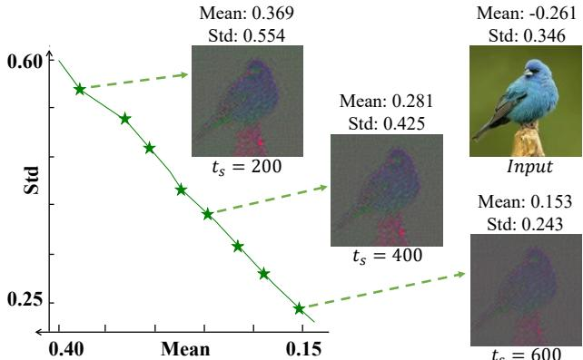
*Figure 3. PCA visualization of latent features produced by TAE under different timesteps $t _ { s }$ , and the corresponding mean and standard deviation (Std) of latent features. TAE can encode the same image into distinct latent features conditioned on different timesteps, which aligns with the synchronized variation between timesteps and latent features in the pre-trained SD.*

> 💡 **Figure 3 批读**: Figure 3 验证 TAE 不是名义上接收时间，而是真的让同一图像的 latent 均值、方差和 PCA 分布随 $t_s$ 变化。没有这个变化，UNet 很难仅靠 timestep 标量激活不同 prior。

TAVSD loss can offer more consistent gradient guidance condition on $t _ { s }$ , enabling better distillation of the teacher model. In addition, the LoRA model is trained with a diffusion loss using the data generated by the student model.

# 3.3. Time-Aware VAE Encoder

In the original SD, as the timestep increases, the input latent features are injected with more noise, thereby activating different generative priors to produce the image. Considering the importance of the timestep in the diffusion process, multi-step SD-based Real-ISR methods often take the timestep as a condition along with the LR image to control the SR process — as seen in the time-aware encoder of StableSR and the ControlNet used in SeeSR and DiffBIR.

However, since multi-step denoising iterations are not required, existing one-step diffusion-based Real-ISR methods generally overlook the role of the timestep and train with only a fixed timestep, making it difficult to fully exploit the generative priors in SD at different timesteps. A straightforward improvement is to randomly sample timestep during training. However, since the original VAE encoder maps the same image to a single latent distribution regardless of the timestep, it is difficult for the diffusion network to effectively activate different generative priors based solely on the timestep, given the same latent input. In the original diffusion process, variations in the timestep reflect changes in the noise level of the latent distribution. We argue that a onestep SD-based Real-ISR network should exhibit a similar property in order to fully leverage the corresponding generative priors. Clearly, directly injecting noise into the latent distribution according to the timestep is inappropriate, as it would compromise reconstruction fidelity.

> 💡 **为什么 TAE 必要**: 只随机采 timestep 不够，因为原 VAE 对同一图只给一个 latent；UNet 看到的主要输入不变，时间条件就可能退化成弱调制。

Therefore, we propose a Time-Aware VAE Encoder (TAE) to better utilize the generative priors in SD. By incorporating a temporal embedding layer into the VAE encoder, TAE encodes the input image into different latent distributions conditioned on the timestep $t _ { s }$ , enabling synchronized variation between $t _ { s }$ and latent distribution, thus better activating the generative priors at different timesteps within SD. This process can be formulated as:

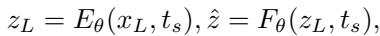
*Equation 4*

> 💡 **公式 4 批读**: TAE 的关键是 $E_\theta(x_L,t_s)$：同一 LQ 图像在不同 $t_s$ 下进入不同 latent 分布。这样 timestep 不只是 UNet 的弱条件，而会改变 student 的主要视觉表示。

where $E _ { \theta }$ is the TAE model and $F _ { \theta }$ is the Unet model.

As shown in Figure 3, TAE encodes the same input image into different latent feature condition on the timestep $t _ { s }$ . Overall, as the $t _ { s }$ increases, both the mean and variance of the latent features show a decreasing trend. After visualizing the latent feature via PCA dimensionality reduction, we can also clearly observe the changes in the latent space.

# 3.4. Time-Aware Variational Score Distillation

Following the OSEDiff [32], the VSD loss has been widely adopted in SD-based one-step Real-ISR methods to enhance the realism of reconstruction results. In one-step image generation tasks, the timestep is usually sampled randomly to distill the full generative prior of the teacher model. However, we find that in Real-ISR, this paradigm instead leads to inconsistent generative guidance, since SD exhibits different generative priors across timesteps, while the timestep sampling in the teacher model is completely random and independent of the student model.

As discussed in Section 3.1, due to the stop-gradient operation, the guidance of the VSD loss can be interpreted as the residual between the latent images predicted by the teacher model and the LoRA model. Therefore, we decode these latent images into the pixel space and analyze the guidance of the VSD loss at different timesteps. As illustrated in Figure 4, first, the mean and standard deviation of the VSD loss exhibit a clear upward trend as the timestep increases. Besides, we observe that at $t _ { v }$ equals 100, the outputs of the teacher and LoRA models are similar, and the gradients mainly reflect enhancements in texture details. In contrast, when $t _ { v }$ increases to 300, the teacher model’s output contains significantly more semantic information while the LoRA model’s output remains smooth, and the gradients reflect global semantic guidance. However, when $t _ { v }$ increases to 600, the teacher model can only recover coarse color and structural information from the noisy latent input, making it difficult to provide meaningful guidance. This implies that the VSD loss provides distinct guidance for the same image depending on $t _ { v }$ . Such opposing directional guidance creates conflicting optimization signals for the student model, leading to suboptimal convergence.

This phenomenon arises because most of the image information is preserved when $t$ is small, and both the teacher and LoRA models focus mainly on generating texture details. As $t$ increases, the injection of more noise gradually obscures the underlying image content, forcing the teacher model to rely more heavily on its generative prior. However, since the LoRA model is trained on low-quality data generated by the student model and does not employ the CFG strategy [10], its outputs tend to be overly smooth. This also explains why the VSD loss can make images more realistic while avoiding over-smoothing — since the LoRA model tends to produce smoother outputs than the teacher model, their residuals naturally provide high-frequency details that guide the generation process.

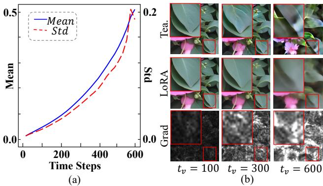
*Figure 4. (a) Mean and standard deviation (Std) of the VSD loss at different timesteps. (b) The outputs of the teacher model and the LoRA model are decoded into pixel space and gradients in latent space at different timesteps $t$ .*

> 💡 **Figure 4 批读**: Figure 4 解释 TAVSD 的时间语义：小 timestep 主要给纹理细节梯度，中等 timestep 给语义补全，大 timestep 过大时只剩粗结构。TAVSD 要避免这些方向互相冲突。

Considering that the guidance provided by VSD varies across different timesteps, we establish a connection between the timestep $t _ { s }$ input to the student model and the timestep $t _ { v }$ in the teacher model, so that the VSD loss can provide more consistent gradient guidance conditioned on $t _ { s }$ . Specifically, we feed the randomly sampled $t _ { s }$ and the LQ image into the student model to obtain $\hat { z } = G _ { \theta } ( x _ { L } , t _ { s } )$ . Then, $t _ { s }$ is mapped to $t _ { v }$ by:

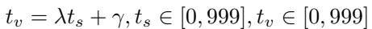
*Equation 5*

> 💡 **公式 5 批读**: $t_v=\lambda t_s+\gamma$ 把 student control time 映射到 teacher guidance time。这个映射保证小 $t_s$ 对应保真型 guidance，大 $t_s$ 对应更强的生成型 prior。

where the $\lambda$ and $\gamma$ are the hyperparameters.

We then add noise to $\hat { z }$ corresponding to $t _ { v }$ to obtain $\hat { z } _ { t _ { v } } = \alpha _ { t _ { v } } \hat { z } + \beta _ { t _ { v } } \epsilon$ , which is fed to the teacher model and the LoRA model with $t _ { v }$ to compute the TAVSD loss:

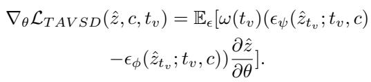
*Equation 6*

> 💡 **公式 6 批读**: TAVSD 只在映射后的 $t_v$ 上计算 teacher-LoRA residual，不再随机扫 timestep。这样 student 接收的时间条件和 teacher 给的生成梯度保持同一语义强度。

By leveraging the TAVSD loss, the model can naturally balance generation and fidelity in the Real-ISR task simply by varying the timestep condition $t _ { s }$ input to the model.

Table 1. A comprehensive evaluation against state-of-the-art methods across synthetic and real-world datasets. The top-performing and runner-up results under each metric are marked in red and blue, respectively.

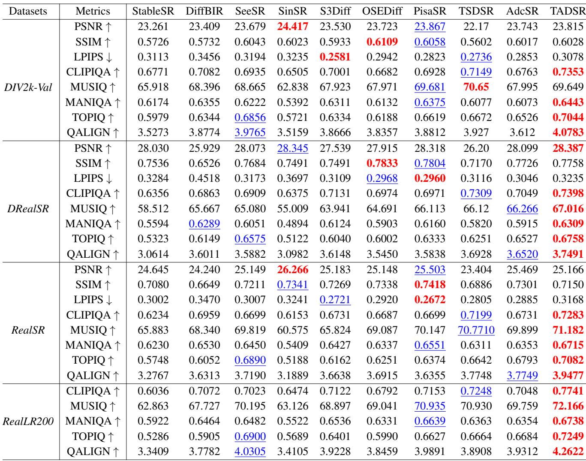
*Table 1: Table 1. A comprehensive evaluation against state-of-the-art methods across synthetic and real-world datasets. The top-performing and runner-up results under each metric are marked in red and blue, respectively.   *

> 💡 **Table 1 批读**: Table 1 是主结果：TADSR 在 DIV2K-Val、DRealSR、RealSR、RealLR200 上多数 no-reference 指标领先，说明它更强地激活了 SD generative prior；PSNR/SSIM 并非总第一，体现 trade-off。

# 3.5. Training Loss

We train the student model with reconstruction and regression losses. To avoid gradient inconsistency arising from the ill-posed problem of the Real-ISR [16] while fully leveraging the teacher model knowledge, we first apply a Gaussian blur to both the reconstructed image and the HQ image $x _ { H }$ before computing the MSE loss. This ensures that the $x _ { H }$ only supervises the low-frequency content of the reconstruction, helping to preserve high-frequency details. We adopt a larger blur kernel for larger timesteps $t _ { s }$ , which enhances the trade-off between fidelity and generation:

> 💡 **loss 设计**: blurred MSE 只约束低频，避免 GT 高频歧义和 TAVSD 生成高频互相打架；大的 $t_s$ 使用更大 blur kernel，符合真实感更强时保真约束更弱的设计。

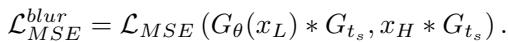
*Equation 9*

> 💡 **公式 9 批读**: blurred MSE 把 student 输出和 HQ 都先做高斯模糊再比较，避免一对多 SR 中不确定的高频纹理被像素损失强行平均。

Where $^ *$ denotes the convolution operation, $G _ { t _ { s } }$ is the convolution kernel whose size is determined by $t _ { s }$ . This loss and the LPIPS loss form the reconstruction loss:

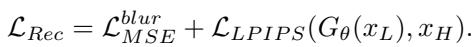
*Equation 7*

> 💡 **公式 7 批读**: reconstruction loss 由 blurred MSE 和 LPIPS 组成：blurred MSE 只管低频结构，LPIPS 保持感知相似，给 TAVSD 留出高频纹理生成空间。

For the regression loss, we adopt the TAVSD loss in Eq. (6) to improve the realism of the generated results. The overall loss for the student model is:

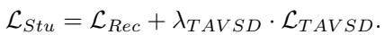
*Equation 8*

> 💡 **公式 8 批读**: student 总损失把低频保真项和 TAVSD 真实感项相加。$\lambda_{TAVSD}$ 是训练时的全局权重，推理时的连续控制则交给 $t_s$。

We adopt the original diffusion loss for the LoRA model:

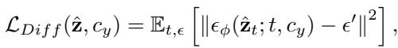
*Equation 10*

> 💡 **公式 10 批读**: LoRA model 仍用原始 diffusion denoising loss 训练，用来估计 student 生成分布的 fake score。它是训练期 regularizer，推理时不会增加一步 SR 的成本。

where $\epsilon ^ { \prime }$ is the randomly sampled Gaussian noise as the training target for the denoising network.

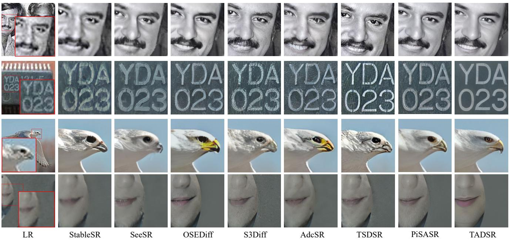
*Figure 5. Visual comparisons between our method and other Real-ISR methods. Please zoom in for a better view.*

> 💡 **Figure 5 批读**: Figure 5 是视觉主结果，重点看重退化区域的人脸、文字、动物边缘等；TADSR 的 claim 是更自然而不是只更锐。

---

## 🔖 Section 总结
- 方法主线是 $x_L,t_s \rightarrow z_L \rightarrow \hat z_0 \rightarrow \hat z_{t_v}$，再用 teacher/LoRA score residual 更新 student。
- TAE 让 latent 随 $t_s$ 变化；TAVSD 让 teacher guidance 随 $t_v$ 一致变化。
- 可追问：$t_s$ 到 $t_v$ 的映射函数是否需要按退化类型自适应？
