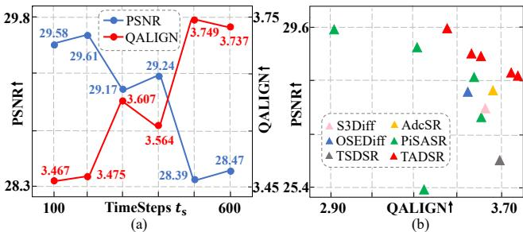
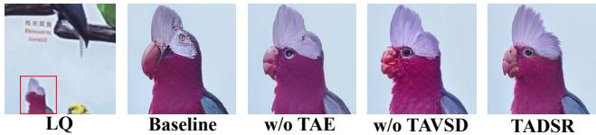
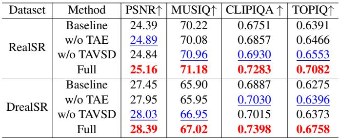

[← 返回 README](../README.md)

# 4. Experiments

## 📌 预览
实验节证明三点：TADSR 在多数据集 no-reference 指标领先，timestep 能控制真实感/保真度，TAE 与 TAVSD 消融都有独立贡献。

# 4.1. Experimental Setup

Training. We use LSDIR [14] as the training data with the $5 1 2 \times 5 1 2$ patch size. To generate paired HQ-LQ training data, we follow the degradation pipeline from Real-ESRGAN [25]. We use AdamW optimizer [19] with a learning rate $5 \times 1 0 ^ { - 5 }$ and set LoRA rank to 4 for both the student model and LoRA model. We employ the SD 2.1-base as the pre-trained model and fine-tune it for $2 \mathrm { k }$ iterations using 8 NVIDIA A40 GPUs with a batch size of 24. For the choice of hyperparameters, we set $\lambda = 0 . 5$ and $\gamma = 0$ in Eq. (5). We adopt the degradation-aware prompt extraction (DAPE) module [33] to extract text prompts.

> 💡 **复现成本**: 2k iterations、8 A40、batch 24、LoRA rank 4，说明 TADSR 训练相对可控；但依赖 SD2.1-base、DAPE 和公开 baseline 权重。

Test Dataset. We evaluate our method in both synthetic and real-world dataset. For the synthetic dataset, we randomly crop 3K patches with a resolution of $5 1 2 \times 5 1 2$ from the DIV2K [1] validation set and synthesize LQ data using the same pipeline as that in training. For real-world data, we employ RealSR [2], DrealSR [30], and RealLR200 [33]. We center-crop RealSR [2] and DrealSR [30] datasets with size $1 2 8 \times 1 2 8$ for LQ images and $5 1 2 \times 5 1 2$ for HQ image. For RealLR200 [33] dataset, since the corresponding HQ images are unavailable, we perform only a $1 2 8 \times 1 2 8$ center-crop on the LQ images.

Evaluation Metrics. We utilize several reference and nonreference metrics to evaluate the performance of various methods on the test data. For the reference measures, we employ PSNR, SSIM [28], and LPIPS [41] to measure image fidelity. For the non-reference measures, we employ

CLIPIQA [23], MUSIQ ([13], MANIQA [36], TOPIQ [4], and QALIGN [31] to measure image quality.

Compared Methods. We compare our method with several multi-step diffusion-based methods StableSR [24], Diff-BIR [18], SeeSR [33], and one-step methods SinSR [26], OSEDiff [32], S3Diff [39], AdcSR [3], TSDSR [8], and PisaSR [21]. All comparative results are obtained using publicly released code and model weights for testing.

# 4.2. Comparisons with State-of-the-art Methods

Quantitative Comparisons. We set up the timestep condition $t _ { s } ~ = ~ 5 0 0$ in our method, and show the quantitative comparisons on the four synthetic and real-world datasets in Table 1. We have the following observations: (1) TADSR achieves the highest no-reference scores across four datasets, except for the MUSIQ on DIV2K-Val. This demonstrates that TADSR can more effectively leverage the generative priors from SD to produce more realistic results. Notably, TADSR is the only one-step method that consistently outperforms multi-step methods on all noreference metrics, achieving both efficiency and perceptual quality. (2) TADSR maintains PSNR values comparable to other SD-based one-step methods, indicating a good balance between fidelity and realism. (3) TADSR shows clear improvements over other SD-based one-step methods on CLIPIQA and TOPIQ, highlighting its superior semantic awareness and generative capability. (4) Under the same number of parameters as OSEDiff, TADSR significantly outperforms OSEDiff on no-reference metrics while maintaining comparable reference metrics, further demonstrating TADSR’s effective utilization of generative priors and the resulting performance improvements.

*Figure 6. (a) Quantitative metrics of our method under different timestep $t _ { s }$ , evaluated on the DrealSR dataset. (b) Comparison of our method under different timesteps $t _ { s }$ , PisaSR under different semantic guidance weights $\lambda _ { s e m }$ , and other one-step diffusion-based Real-ISR methods, evaluated on the DrealSR dataset.*

> 💡 **Figure 6 批读**: Figure 6 是可控性证据：随着 $t_s$ 增大，PSNR 下降而 QALIGN 上升，形成可解释的 fidelity-realism slider。

Qualitative Comparisons. Figure 5 shows the visual comparisons between our method and the other state-of-the-art Real-ISR methods. As shown in the first row, TADSR generates significantly more natural and sharper textures from heavily degraded LQ images, especially in facial regions such as the teeth, eyes, and eyebrows, demonstrating its strong semantic generation capability. In the second row, the digits and letters produced by TADSR appear much clearer, showcasing its superior degradation removal ability while preserving fidelity. In the third row, TADSR yields more natural results around the eagle’s eyes and beak. In the fourth row, only TADSR accurately restored naturallooking facial features such as the nose, mouth, and chin. Other methods generally suffered from degradation, resulting in some distortion, and failed to reconstruct a plausible chin structure. Overall, thanks to the ability to distill generative priors from SD more effectively in TAVSD loss, TADSR can produce natural and realistic results in a single diffusion step. Compared to other methods, it achieves strong perceptual quality while maintaining high efficiency.

# 4.3. Ablation Study

Impact of Different Timestep Condition. As shown in Figure 6(a), we analyze the impact of timestep $t _ { s }$ in our method on both reference and no-reference metrics. As $t _ { s }$ increases, PSNR exhibits a decreasing trend while QALIGN shows an upward trend, indicating a trade-off where fidelity is sacrificed to enhance realism. This tradeoff between fidelity and realism aligns with the function of $t _ { s }$ , as a larger $t _ { s }$ means that TAVSD provides stronger generative guidance, while a smaller $t _ { s }$ provides more fidelitypreserving guidance. Similar visual results can be observed in supplementary materials. Furthermore, we compare the results of our method under different $t _ { s }$ , PisaSR under different $\lambda _ { s e m }$ settings, and other one-step Real-ISR methods, as shown in Figure 6(b). It can be observed that our method consistently lies in the top-right corner across different $t _ { s }$ . When $t _ { s }$ equals 200, our method achieves 26.61dB PSNR, which is more than 1dB higher than SinSR, and QALIGN is significantly higher than SinSR. In contrast, although PisaSR can also achieve a PSNR of 29.60dB by tuning the $\lambda _ { p i x } = 1 . 0$ and $\lambda _ { s e m } = 0 . 6$ , its QALIGN is only 2.91, which is similar to SinSR. This indicates that our method achieves a substantial improvement in fidelity with only a minimal compromise in realism.

> 💡 **消融解读**: $t_s$ 是可控 knob，不是训练随机变量而已；小 $t_s$ 偏 fidelity，大 $t_s$ 偏 realism，Figure 6/Table 3 给出定量和视觉证据。

*Figure 7. Vision Comparisons of the ablation study on TAE and TAVSD. Baseline use the original VAE encoder and VSD loss.*

> 💡 **Figure 7 批读**: Figure 7 支撑 TAE/TAVSD 的必要性：去掉任一模块都可能让 parrot 重建不自然或产生 artifacts，说明时间相关 latent 与时间相关 score guidance 缺一不可。

Table 2. Quantitative Comparison of ablation study on TAVSD and TAE. Baseline uses the original VAE encoder and VSD loss.

*Table 2: Table 2. Quantitative Comparison of ablation study on TAVSD and TAE. Baseline uses the original VAE encoder and VSD loss.   *

> 💡 **Table 2 批读**: Table 2 是 TAE/TAVSD 消融：Full 在 PSNR 和多个感知指标上都优于 baseline/w/o TAE/w/o TAVSD，说明时间相关 latent 与时间相关 VSD guidance 都有贡献。

Impact of TAVSD and TAE. To validate the effectiveness of TAVSD and TAE, we conducted ablation studies by removing them. We employ the original VAE encoder in SD and the VSD loss as our baseline and conduct ablation studies by separately removing TAE and TAVSD. We use PSNR to evaluate fidelity and CLIPIQA, MUSIQ, and TOPIQ to assess realism. As shown in Table 2, we have the following three key observations: (1) Although the baseline also adopts randomly sampled timesteps during training, after removing TAE, both reference and no-reference metrics decline, demonstrating that timestep-adaptive latent distribution plays a crucial role in effectively utilizing the generative priors in SD. (2) When TAVSD is ablated, all metrics similarly decrease, indicating that more consistent guidance from the teacher model better activates generative priors across different timesteps. (3) Baseline shows significant degradation in PSNR and moderate decline in others, proving that both TAE and TAVSD improve fidelity and realism. Additionally, Figure 7 presents a visual comparison of our ablation studies, showing that both the absence of TAE/TAVSD leads to unrealistic parrot reconstructions, while the baseline even produces visible artifacts. In contrast, our method produces realistic and natural results by fully exploiting the generative priors in SD.

---

## 🔖 Section 总结
- 实验支撑 SOTA、可控性和模块有效性。
- 关键数字包括 $t_s=500$ 主结果、$t_s=200$ 时 26.61dB PSNR 且 QALIGN 高于 SinSR、Full 在 ablation 中最好。
- 可追问：不同任务是否应该默认选择不同 $t_s$？
