[← 返回 README](../README.md)

# References

## 📌 预览
附录补充推导、blurred MSE、更多 timestep/效率/GAN/SD-based 视觉对比，是理解可控性与复现细节的关键。

[1] Eirikur Agustsson and Radu Timofte. Ntire 2017 challenge on single image super-resolution: Dataset and study. In CVPRW, pages 126–135, 2017. 7, 13 [2] Jianrui Cai, Hui Zeng, Hongwei Yong, Zisheng Cao, and Lei Zhang. Toward real-world single image super-resolution: A new benchmark and a new model. In ICCV, pages 3086–
3095, 2019. 7, 12, 13 [3] Bin Chen, Gehui Li, Rongyuan Wu, Xindong Zhang, Jie Chen, Jian Zhang, and Lei Zhang. Adversarial diffusion compression for real-world image super-resolution. In Proceedings of the Computer Vision and Pattern Recognition Conference, pages 28208–28220, 2025. 2, 7, 15, 16, 17 [4] Chaofeng Chen, Jiadi Mo, Jingwen Hou, Haoning Wu, Liang Liao, Wenxiu Sun, Qiong Yan, and Weisi Lin. Topiq: A top-down approach from semantics to distortions for image quality assessment. IEEE TIP, 33:2404–2418, 2024. 7, 11 [5] Hanting Chen, Yunhe Wang, Tianyu Guo, Chang Xu, Yiping Deng, Zhenhua Liu, Siwei Ma, Chunjing Xu, Chao Xu, and Wen Gao. Pre-trained image processing transformer. In CVPR, pages 12299–12310, 2021. 2 [6] Xiangyu Chen, Xintao Wang, Jiantao Zhou, Yu Qiao, and Chao Dong. Activating more pixels in image superresolution transformer. In CVPR, pages 22367–22377, 2023. [7] Chao Dong, Chen Change Loy, Kaiming He, and Xiaoou Tang. Learning a deep convolutional network for image super-resolution. In ECCV, pages 184–199. Springer, 2014.
2 [8] Linwei Dong, Qingnan Fan, Yihong Guo, Zhonghao Wang, Qi Zhang, Jinwei Chen, Yawei Luo, and Changqing Zou. Tsd-sr: One-step diffusion with target score distillation for real-world image super-resolution. In Proceedings of the Computer Vision and Pattern Recognition Conference, pages
23174–23184, 2025. 2, 7, 15, 16, 17 [9] Zheng-Peng Duan, Jiawei Zhang, Xin Jin, Ziheng Zhang, Zheng Xiong, Dongqing Zou, Jimmy Ren, Chun-Le Guo, and Chongyi Li. Dit4sr: Taming diffusion transformer for real-world image super-resolution. arXiv preprint arXiv:2503.23580, 2025. 1
[10] Jonathan Ho and Tim Salimans. Classifier-free diffusion guidance. arXiv preprint arXiv:2207.12598, 2022. 5
[11] Jonathan Ho, Ajay Jain, and Pieter Abbeel. Denoising diffusion probabilistic models. NeurIPS, 33:6840–6851, 2020. 1
[12] Edward J Hu, Yelong Shen, Phillip Wallis, Zeyuan Allen-Zhu, Yuanzhi Li, Shean Wang, Lu Wang, and Weizhu Chen. Lora: Low-rank adaptation of large language models. arXiv preprint arXiv:2106.09685, 2021. 11
[13] Junjie Ke, Qifei Wang, Yilin Wang, Peyman Milanfar, and Feng Yang. Musiq: Multi-scale image quality transformer. In ICCV, pages 5148–5157, 2021. 7, 11, 12
[14] Yawei Li, Kai Zhang, Jingyun Liang, Jiezhang Cao, Ce Liu, Rui Gong, Yulun Zhang, Hao Tang, Yun Liu, Denis Demandolx, et al. Lsdir: A large scale dataset for image restoration. In Proceedings of the IEEE/CVF Conference on Computer Vision and Pattern Recognition, pages 1775–1787, 2023. 7
[15] Jingyun Liang, Jiezhang Cao, Guolei Sun, Kai Zhang, Luc Van Gool, and Radu Timofte. Swinir: Image restoration using swin transformer. In ICCV, pages 1833–1844, 2021. 2
[16] Jie Liang, Hui Zeng, and Lei Zhang. Details or artifacts: A locally discriminative learning approach to realistic image super-resolution. In CVPR, pages 5657–5666, 2022. 1, 6, 13
[17] Bee Lim, Sanghyun Son, Heewon Kim, Seungjun Nah, and Kyoung Mu Lee. Enhanced deep residual networks for single image super-resolution. In CVPRW, pages 136–144, 2017. 2
[18] Xinqi Lin, Jingwen He, Ziyan Chen, Zhaoyang Lyu, Ben Fei, Bo Dai, Wanli Ouyang, Yu Qiao, and Chao Dong. Diffbir: Towards blind image restoration with generative diffusion prior. arXiv preprint arXiv:2308.15070, 2023. 1, 3, 7
[19] Ilya Loshchilov and Frank Hutter. Decoupled weight decay regularization. arXiv preprint arXiv:1711.05101, 2017. 7
[20] Robin Rombach, Andreas Blattmann, Dominik Lorenz, Patrick Esser, and Bjorn Ommer. High-resolution image syn- ¨ thesis with latent diffusion models. In CVPR, pages 10684– 10695, 2022. 1, 11
[21] Lingchen Sun, Rongyuan Wu, Zhiyuan Ma, Shuaizheng Liu, Qiaosi Yi, and Lei Zhang. Pixel-level and semantic-level adjustable super-resolution: A dual-lora approach. In Proceedings of the Computer Vision and Pattern Recognition Conference, pages 2333–2343, 2025. 1, 2, 3, 7, 15, 16, 17
[22] Yang Tao, Wu Rongyuan, Ren Peiran, Xie Xuansong, and Zhang Lei. Pixel-aware stable diffusion for realistic image super-resolution and personalized stylization. In ECCV, 2023. 1, 3
[23] Jianyi Wang, Kelvin CK Chan, and Chen Change Loy. Exploring clip for assessing the look and feel of images. In AAAI, pages 2555–2563, 2023. 7, 13
[24] Jianyi Wang, Zongsheng Yue, Shangchen Zhou, Kelvin CK Chan, and Chen Change Loy. Exploiting diffusion prior for real-world image super-resolution. arXiv preprint arXiv:2305.07015, 2023. 1, 3, 7
[25] Xintao Wang, Liangbin Xie, Chao Dong, and Ying Shan. Real-esrgan: Training real-world blind super-resolution with pure synthetic data. In ICCV, pages 1905–1914, 2021. 1, 2, 7, 13
[26] Yufei Wang, Wenhan Yang, Xinyuan Chen, Yaohui Wang, Lanqing Guo, Lap-Pui Chau, Ziwei Liu, Yu Qiao, Alex C Kot, and Bihan Wen. Sinsr: Diffusion-based image superresolution in a single step. In CVPR, 2024. 7, 17
[27] Zhou Wang, Alan C Bovik, Hamid R Sheikh, and Eero P Simoncelli. Image quality assessment: from error visibility to structural similarity. IEEE TIP, 13(4):600–612, 2004. 11, 12
[28] Zhou Wang, Alan C Bovik, Hamid R Sheikh, and Eero P Simoncelli. Image quality assessment: from error visibility to structural similarity. IEEE TIP, 13(4):600–612, 2004. 7
[29] Zhengyi Wang, Cheng Lu, Yikai Wang, Fan Bao, Chongxuan Li, Hang Su, and Jun Zhu. Prolificdreamer: High-fidelity and diverse text-to-3d generation with variational score distillation. arXiv preprint arXiv:2305.16213, 2023. 2, 11
[30] Pengxu Wei, Ziwei Xie, Hannan Lu, Zongyuan Zhan, Qixiang Ye, Wangmeng Zuo, and Liang Lin. Component divide-and-conquer for real-world image super-resolution. In ECCV, pages 101–117. Springer, 2020. 7, 11, 13
[31] Haoning Wu, Zicheng Zhang, Weixia Zhang, Chaofeng Chen, Liang Liao, Chunyi Li, Yixuan Gao, Annan Wang, Erli Zhang, Wenxiu Sun, Qiong Yan, Xiongkuo Min, Guangtao Zhai, and Weisi Lin. Q-align: Teaching LMMs for visual scoring via discrete text-defined levels. In ICML, pages 54015–54029. PMLR, 2024. 7, 11, 12
[32] Rongyuan Wu, Lingchen Sun, Zhiyuan Ma, and Lei Zhang. One-step effective diffusion network for real-world image super-resolution. arXiv preprint arXiv:2406.08177, 2024. 2, 3, 4, 5, 7, 13, 15, 16, 17
[33] Rongyuan Wu, Tao Yang, Lingchen Sun, Zhengqiang Zhang, Shuai Li, and Lei Zhang. Seesr: Towards semantics-aware real-world image super-resolution. In CVPR, 2024. 1, 3, 7, 15, 16
[34] Zhiqiang Wu, Zhaomang Sun, Tong Zhou, Bingtao Fu, Ji Cong, Yitong Dong, Huaqi Zhang, Xuan Tang, Mingsong Chen, and Xian Wei. Omgsr: You only need one midtimestep guidance for real-world image super-resolution. arXiv preprint arXiv:2508.08227, 2025. 1
[35] Liangbin Xie, Xintao Wang, Xiangyu Chen, Gen Li, Ying Shan, Jiantao Zhou, and Chao Dong. Desra: detect and delete the artifacts of gan-based real-world super-resolution models. arXiv preprint arXiv:2307.02457, 2023. 1
[36] Sidi Yang, Tianhe Wu, Shuwei Shi, Shanshan Lao, Yuan Gong, Mingdeng Cao, Jiahao Wang, and Yujiu Yang. Maniqa: Multi-dimension attention network for no-reference image quality assessment. In CVPR, pages 1191–1200, 2022. 7, 13
[37] Zongsheng Yue, Jianyi Wang, and Chen Change Loy. Resshift: Efficient diffusion model for image super-resolution by residual shifting. arXiv preprint arXiv:2307.12348, 2023. 1
[38] Zongsheng Yue, Kang Liao, and Chen Change Loy. Arbitrary-steps image super-resolution via diffusion inversion. In Proceedings of the Computer Vision and Pattern Recognition Conference, pages 23153–23163, 2025. 2
[39] Aiping Zhang, Zongsheng Yue, Renjing Pei, Wenqi Ren, and Xiaochun Cao. Degradation-guided one-step image super-resolution with diffusion priors. arXiv preprint arXiv:2409.17058, 2024. 2, 7, 15, 16, 17
[40] Kai Zhang, Jingyun Liang, Luc Van Gool, and Radu Timofte. Designing a practical degradation model for deep blind image super-resolution. In ICCV, pages 4791–4800, 2021. 1, 2, 13
[41] Richard Zhang, Phillip Isola, Alexei A Efros, Eli Shechtman, and Oliver Wang. The unreasonable effectiveness of deep features as a perceptual metric. In CVPR, pages 586–595, 2018. 7
[42] Yulun Zhang, Kunpeng Li, Kai Li, Lichen Wang, Bineng Zhong, and Yun Fu. Image super-resolution using very deep residual channel attention networks. In ECCV, pages 286– 301, 2018. 2
[43] Qianqian Zhao, Chunle Guo, Tianyi Zhang, Junpei Zhang, Peiyang Jia, Tan Su, Wenjie Jiang, and Chongyi Li. A systematic investigation on deep learning-based omnidirectional image and video super-resolution. arXiv preprint arXiv:2506.06710, 2025. 2

# Time-Aware One Step Diffusion Network for Real-World Image Super-Resolution

> 💡 **任务背景**: Real-ISR 面向未知复合退化，真实感和保真度天然冲突；TADSR 把这个冲突显式变成 timestep 控制变量。

Supplementary Material

In this supplementary material, we provide the following content:

• Detailed derivation about the Variational Score Distillation loss in Section 6
• Visual comparisons and quantitative metrics of TADSR across different timesteps in Section 7.1
• Ablation study on the blurred MSE loss in Section 7.2
• Ablation study on the hyperparameters of TAVSD loss in Section 7.3
• Efficiency comparison between TADSR and other diffusion-based Real-ISR methods in Section 8
• Comparisons with GAN-based Real-ISR methods in Section 9
• Extended visual comparisons with SD-based Real-ISR approaches in Section 10

# 6. Detailed Derivation

According to the original diffusion process in SD [20], at step $t$ , the current state $z _ { t }$ satisfies:

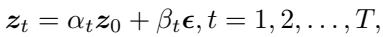
*Equation 11*

> 💡 **公式 11 批读**: 这一式回到 SD 的前向加噪定义，说明 $z_t$ 由 clean latent $z_0$ 和噪声按 $\alpha_t,\beta_t$ 混合而来。后续 VSD 重写就是从这里把 $z_0$ 解出来。

where $\alpha _ { t }$ and $\beta _ { t }$ are the scale parameters in diffusion, $\epsilon \sim$ $\mathcal { N } ( \mathbf { 0 } , \pmb { I } ^ { 2 } )$ and $z _ { \mathrm { 0 } }$ is HR latent in Real-ISR task. Therefore, we can express $z _ { \mathrm { 0 } }$ in terms of $z _ { t }$ and $\epsilon$ as $\begin{array} { r } { z _ { 0 } ~ = ~ \frac { z _ { t } - \beta _ { t } \epsilon } { \alpha _ { t } } } \end{array}$ Then, we can rewrite Eq. (2) in the main paper as follows:

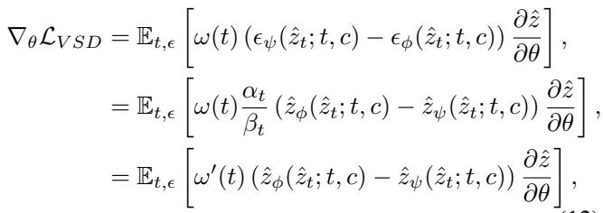
*Equation 12*

> 💡 **公式 12 批读**: Appendix 把 VSD 梯度改写成 teacher predicted latent 与 LoRA predicted latent 的残差。这个形式支撑正文 Figure 4：不同 $t_v$ 下 residual 的语义强度不同。

where $\epsilon _ { \psi }$ is the pre-trained diffusion model (teacher model), $\epsilon _ { \phi }$ represents its replica with trainable LoRA [12] (LoRA model), $\hat { z } _ { \psi }$ and $\hat { z } _ { \phi }$ represent the latent images predicted by the teacher model and the LoRA model respectively, $c$ is a text embedding of a caption describing the input image, and $\omega _ { t }$ is a time-varying weighting function. Therefore, we can represent the VSD [29] loss using the residual between the latent images predicted by the teacher model and the LoRA model, which is then decoded into pixel space to analyze the timestep-dependent guidance.

Table 3. Quantitative comparison of ablation study on blurred MSE loss, evaluated on DrealSR [30] dataset.

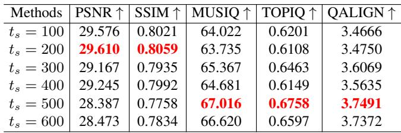
*Table 3: Table 3. Quantitative comparison of ablation study on blurred MSE loss, evaluated on DrealSR [30] dataset.   *

> 💡 **Table 3 批读**: Table 3 展示不同 timestep 下的定量变化，是可控性 claim 的数字版：$t_s$ 增大通常牺牲 PSNR/SSIM，换取 MUSIQ/TOPIQ/QALIGN 等真实感指标。

Table 4. Quantitative comparison of ablation study on blurred MSE loss, evaluated on DrealSR [30] dataset.

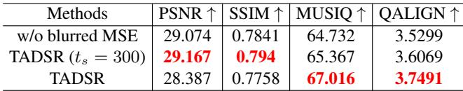
*Table 4: Table 4. Quantitative comparison of ablation study on blurred MSE loss, evaluated on DrealSR [30] dataset.   *

> 💡 **Table 4 批读**: Table 4 说明 blurred MSE 的作用：只让 GT 强约束低频，避免高频细节被 MSE 抹掉；这和 TAVSD 生成高频细节形成互补。

# 7. More Ablation Study

# 7.1. Different Timesteps

Figure 8 presents TADSR’s results at different timesteps $t _ { s }$ , demonstrating a gradual transition from fidelity to realism reconstruction as the $t _ { s }$ increases. Specifically: (1) In the first row, TADSR progressively generates richer eyelash textures and sharper contours; (2) The second row shows how patterned shadows gradually transform into stain-like artifacts; (3) For the third row, TADSR reconstructs plausible architectural stripes not present in the low-quality input; and (4) The fourth row reveals emerging yellow pistils in flower centers. These progressive changes evidence TADSR’s enhanced utilization of the pre-trained generative priors in SD at larger $t _ { s }$ , effectively balancing the fidelity-realism trade-off condition on $t _ { s }$ . In addition, we also present the performance of our method at different timesteps. As shown in Table 3, with increasing timesteps, reference metrics (PSNR, SSIM [27]) tend to decrease while no-reference metrics (MUSIQ [13], TOPIQ [4], QALIGN [31]) tend to increase. This is consistent with the visual comparison results in Figure 8, demonstrating that our method can achieve one-step realism–fidelity controllable generation simply by adjusting the timestep.

# 7.2. Blurred MSE Loss

To avoid gradient inconsistency arising from the ill-posed problem of the Real-ISR task while fully leveraging generative prior of SD, we introduce a blurred MSE loss to replace the original MSE loss. Specifically, we first apply a Gaussian blur to both the reconstructed image $G _ { \theta } ( x _ { L } )$ and the HQ image $x _ { H }$ before computing the MSE loss. The blurred MSE loss can be formed as:

> 💡 **loss 设计**: blurred MSE 只约束低频，避免 GT 高频歧义和 TAVSD 生成高频互相打架；大的 $t_s$ 使用更大 blur kernel，符合真实感更强时保真约束更弱的设计。

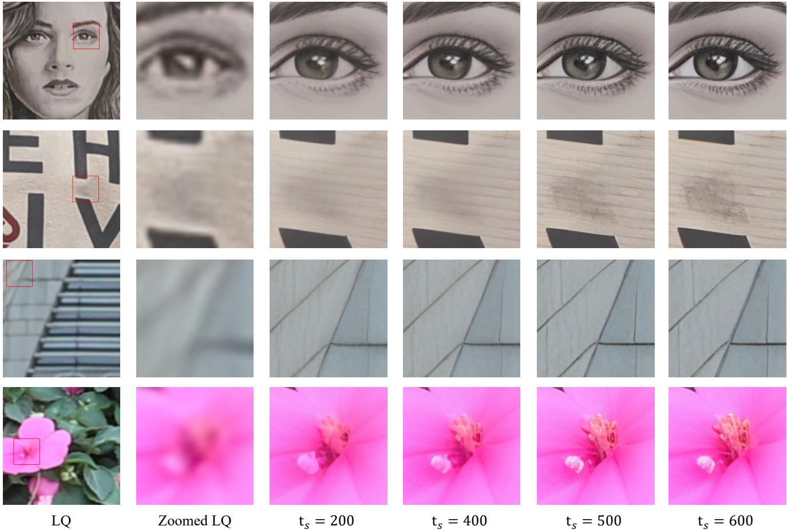
*Figure 8. Vision comparisons of TADSR at different timesteps $t _ { s }$ . Zoom in for a better view.*

> 💡 **Figure 8 批读**: Figure 8 展示 timestep 视觉变化：从保真到真实感增强的过渡不是单纯锐化，而会逐渐生成睫毛、花蕊、建筑纹理等语义细节。

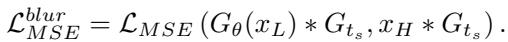
*Equation 13*

> 💡 **公式 13 批读**: blurred MSE 只比较模糊后的 student output 与 HQ image，目的不是提升锐度，而是锁住低频布局，让高频交给 TAVSD 的 diffusion prior。

Where $^ *$ denotes the convolution operation, $G _ { t _ { s } }$ is the Gaussian convolution kernel whose size is determined by $t _ { s }$ . Let $k _ { t _ { s } }$ as the kernel size of $G _ { t _ { s } }$ , it satisfies:

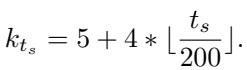
*Equation 14*

> 💡 **公式 14 批读**: kernel size 随 $t_s$ 分段增大，意味着越偏真实感的 timestep 越弱化高频像素监督。这是 TADSR 把 fidelity-realism trade-off 写入 loss 的具体实现。

To validate the effectiveness of the proposed blurred MSE loss, we performed an ablation study by removing it. As shown in Tab. 4, when the blurred MSE loss is removed, the no-reference metrics degrade (MUSIQ [13], QALIGN [31]) significantly while the reference metrics (PSNR, SSIM [27]) improve, demonstrating a trade-off effect where fidelity is enhanced at the expense of realism. To better align with the reference metrics, we selected TADSR’s output at $t _ { s } = 3 0 0$ . With the blurred MSE loss incorporated, TADSR achieves improvements across all metrics, indicating that this loss function enables a more optimal balance between fidelity and realism.

Table 5. Quantitative comparison of ablation study on the hyperparameters of TAVSD loss, evaluated on RealSR [2] dataset.

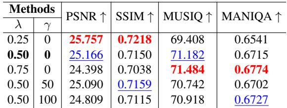
*Table 5: Table 5. Quantitative comparison of ablation study on the hyperparameters of TAVSD loss, evaluated on RealSR [2] dataset.   *

> 💡 **Table 5 批读**: Table 5 分析 TAVSD 超参 $\lambda$ 和 $\gamma$，本质是在调 reconstruction 与 generative guidance 的权重，过强会进一步牺牲 reference 指标。

# 7.3. Hyperparameters in TAVSD

To verify the sensitivity of our method to the hyperparameters in TAVSD, we conducted ablation studies by varying their values. We set the timestep $t _ { s }$ to 500 and evaluated our method under different hyperparameters on the RealSR [2] dataset. As shown in Table 5, with the increase of $\lambda$ and $\gamma$ , our method exhibits a decrease in reference metrics while no-reference metrics improve, reflecting a trade-off of fidelity for enhanced realism.

Table 6. A comprehensive evaluation against state-of-the-art GAN-based methods across synthetic and real-world datasets. The toperforming results under each metric are marked in red.

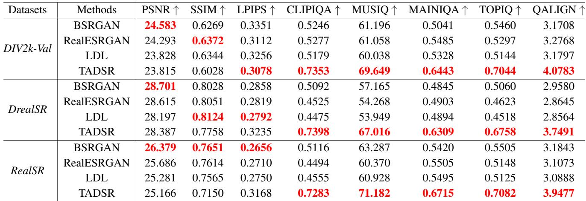
*Table 6: Table 6. A comprehensive evaluation against state-of-the-art GAN-based methods across synthetic and real-world datasets. The toperforming results under each metric are marked in red.   *

> 💡 **Table 6 批读**: Table 6 与 GAN-based 方法比较，说明 TADSR 的优势不仅来自 GAN 式纹理合成，而是来自 SD prior 的时间感知蒸馏。

Table 7. The inference time and the number of parameters of diffusion-based Real-ISR methods. The top-performing results under each metric are marked in red.

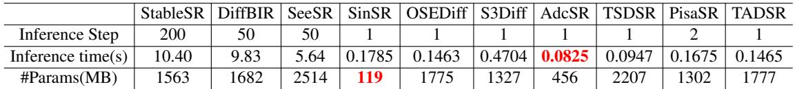
*Table 7: Table 7. The inference time and the number of parameters of diffusion-based Real-ISR methods. The top-performing results under each metric are marked in red.   *

> 💡 **Table 7 批读**: Table 7 给出效率和参数量：TADSR 与 OSEDiff 参数/速度接近，但可通过 timestep 单次推理实现可控，不像 PisaSR 需要两个 LoRA 权重/两次推理。

This phenomenon is consistent with the functionality of TAVSD. As discussed in Section 1, the pre-trained SD model exhibits different generative priors at different timesteps: smaller timesteps tend to favor fidelity, while larger timesteps tend to favor generation. This also means that the teacher model in VSD will provide generation guidance based on semantic priors when the time step is large. Therefor, when $\lambda$ and $\gamma$ increase, the same $t _ { s }$ is mapped to a larger $t _ { v }$ , causing the teacher model to provide guidance more biased toward generation. In terms of metrics, this is manifested as an increase in no-reference metrics and a decrease in reference-based metrics. Considering the balance between realism and fidelity, we ultimately choose $\lambda = 0 . 5$ and $\gamma = 0$ as the default setting for our model.

# 8. Comparison of Efficiency with Other Onestep Real-ISR Methods

We compare the number of parameters and inference time of one-step diffusion-based Real-ISR models in Table 7. Inference time is measured on the $\times 4$ SR task with $1 2 8 \times 1 2 8$ LQ images using a single NVIDIA 3090 24G GPU. Compared with OSEDiff [32], our method achieves roughly the same inference time and parameter count, while showing significant improvements in no-reference metrics and visual quality. PisaSR requires two inferences to achieve controllable Real-ISR due to the presence of two LoRA weights. In contrast, our method can obtain controllable Real-ISR with a single inference simply by adjusting the time step, resulting in fewer inference steps and shorter inference time.

# 9. Comparisons with GAN-based Real-ISR Methods

We compare TADSR with three GAN-based Real-ISR methods: BSRGAN [40], RealESRGAN [25], and LDL [16]. Quantitative evaluations are conducted on the DIV2K [1], RealSR [2], and DRealSR [30] datasets, with results summarized in Tab. 6. The experimental results demonstrate that TADSR, leveraging the powerful generative priors of the pre-trained SD, achieves significantly superior no-reference metrics (e.g., CLIPIQA [23], MAINIQA [36]) compared to GAN-based methods.

Additionally, Fig. 9 presents a visual comparison between TADSR and other GAN-based methods. The results show that TADSR reconstructs more photorealistic and natural outcomes, including higher fidelity in text and architectural structures (from the first to the third group), and more realistic rope textures (in the fourth group).

# 10. More Visual Comparisons with SD-based Real-ISR Methods

We provide more visual comparisons between TADSR and other SD-based SR methods in Fig. 10 and Fig. 11. Compared to other methods, TADSR consistently produces clearer, more realistic, and more natural results. Moreover, although our training is conducted at a resolution of

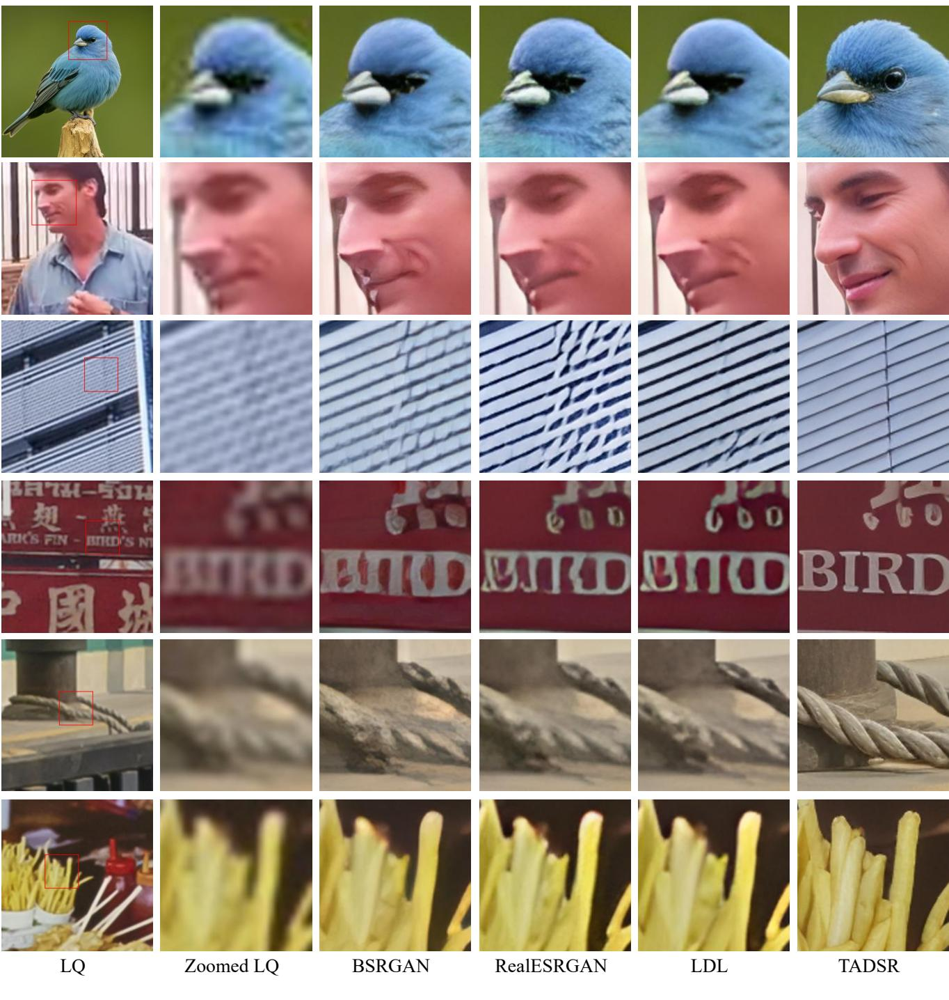
*Figure 9. Vision comparisons between TADSR and GAN-based Real-ISR methods. Zoom in for a better view.*

> 💡 **Figure 9 批读**: Figure 9 对比 GAN-based Real-ISR，主要说明 TADSR 的 SD prior 能生成更自然纹理，但这类图也需要检查是否引入不存在的结构。

$5 1 2 { \times } 5 1 2$ , we provide visual comparisons of TADSR and other diffusion-based one-step Real-ISR methods on 2Kresolution images. As shown in Figure 12, TADSR is also capable of maintaining strong structural consistency and producing realistic, natural SR results on high-resolution images. Under severe synthetic degradations (first and third rows), TADSR still demonstrates powerful deblurring capability and highly realistic generative effects, whereas other single-step SR methods are noticeably affected by the degradations, exhibiting clear artifacts or color smearing. In real-world degradation scenarios (second and fourth rows), TADSR similarly recovers more authentic texture details (e.g., the cat’s fur and nose) and more natural structures (e.g., the person’s eyes and glasses). These visual comparisons consistently demonstrate that TADSR makes effective and thorough use of the SD generative prior.

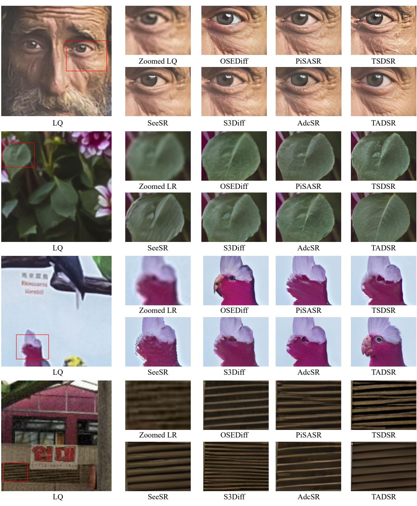
*Figure 10. Vision comparisons between TADSR and SD-based Real-ISR methods (SeeSR [33], OSEDiff [32], S3Diff [39], PiSASR [21], AdcSR [3], TSDSR [8]). Zoom in for a better view.*

> 💡 **Figure 10 批读**: Figure 10 扩展 SD-based baseline 对比，检验 TADSR 相比 SeeSR/OSEDiff/S3Diff/PisaSR/AdcSR/TSDSR 的细节真实性。

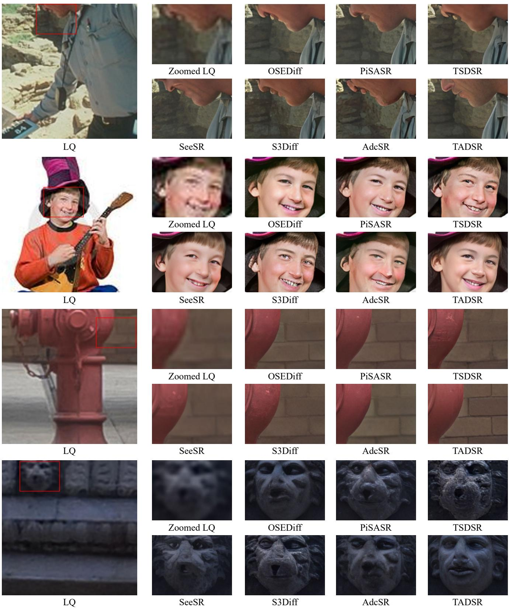
*Figure 11. Vision comparisons between TADSR and SD-based Real-ISR methods (SeeSR [33], OSEDiff [32], S3Diff [39], PiSASR [21], AdcSR [3], TSDSR [8]). Zoom in for a better view.*

> 💡 **Figure 11 批读**: Figure 11 继续展示 SD-based 对比，用更多场景降低单图偶然性。

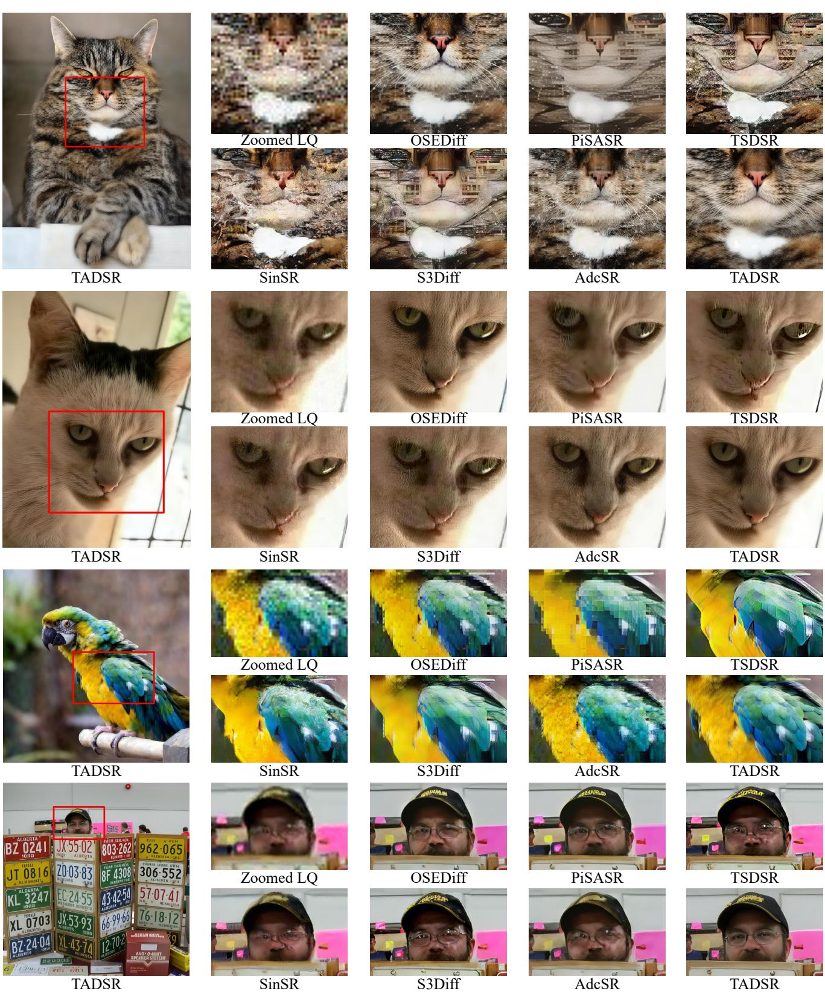
*Figure 12. Vision comparisons between TADSR and Diffusion-based Real-ISR methods (SinSR [26], OSEDiff [32], S3Diff [39], PiSASR [21], AdcSR [3], TSDSR [8]). Zoom in for a better view.*

> 💡 **Figure 12 批读**: Figure 12 是高分辨率/复杂退化视觉补充，说明 TADSR 的 time-aware prior 在 2K 结果上仍能维持结构一致性。

---

## 🔖 Section 总结
- 附录补充推导、timestep 视觉变化、blurred MSE、超参和效率。
- Table 7 说明 TADSR 接近 OSEDiff 的速度/参数，但具备单次推理的可控性。
- 可追问：可控性是否能在视频 SR 中保持时间一致？
