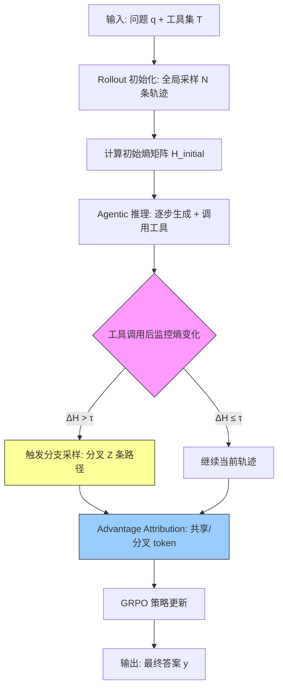

# AGENTIC REINFORCED POLICY OPTIMIZATION

## 论文信息

| 项目 | 内容 |
|------|------|
| **标题** | Agentic Reinforced Policy Optimization (ARPO) |
| **作者** | Guanting Dong, Hangyu Mao, Kai Ma, Licheng Bao, Yifei Chen, Zhongyuan Wang, Zhongxia Chen, Jiazhen Du, Huiyang Wang, Fuzheng Zhang, Guorui Zhou, Yutao Zhu, Ji-Rong Wen, Zhicheng Dou |
| **机构** | Renmin University of China, Kuaishou Technology |
| **会议/期刊** | arXiv 2025 (2507.19849) |
| **GitHub** | https://github.com/dongguanting/ARPO |
| **参考文献** | 100+ |

## 一句话总结

ARPO 提出基于熵的自适应 rollout 机制，在 LLM Agent 多轮工具交互的高熵步骤处动态分支采样，配合 Advantage Attribution Estimation 让模型内化 step 级工具使用行为的优势差异，在仅用 trajectory-level RL 一半的工具调用预算下，于 13 个 benchmark 上全面超越 GRPO/DAPO/Reinforce++。

## 核心贡献

1. **揭示工具交互后的熵增现象**（Section 2.2）：首次量化 LLM Agent 在接收工具调用反馈后 token 熵的剧烈上升，指出 trajectory-level RL 忽视了工具交互引入的不确定性。

2. **ARPO 算法**（Section 3）：提出 Entropy-Based Adaptive Rollout 机制（Section 3.1）在高熵工具步骤处动态分支采样，融合全局 trajectory 采样和 step-level 局部采样；提出 Advantage Attribution Estimation（Section 3.2）使模型在共享与分叉 token 间感知优势差异。

3. **GPG 理论基础**（Section 3.3）：提出 Generalized Policy Gradient Theorem，将传统 Policy Gradient 推广到 Transformer-based policy 的宏动作（macro action）分割，为 ARPO 的分支采样提供理论支撑。

4. **工具调用效率突破**（Section 4.6）：ARPO 仅用 trajectory-level RL 一半的工具调用预算即可取得更高准确率，在 Deep Search 任务上仅用 1K RL 样本即实现显著提升。

5. **跨任务泛化验证**（Section 4）：在数学推理、知识密集型推理和 Deep Search 共 13 个 benchmark、多个模型骨架（Qwen2.5/Llama3.1/Qwen3 系列）上全面验证 ARPO 的优越性。

## 📖 批读导航

| Section | 内容 |
|---------|------|
| [00 - Abstract](sections/00-abstract.md) | 摘要 + Figure 1（熵可视化、性能对比、工具效率） |
| [01 - Introduction](sections/01-introduction.md) | 背景动机：单轮 vs. 多轮 Agent RL、工具交互后熵增现象、ARPO 设计思路 |
| [02 - Preliminary](sections/02-preliminary.md) | Agentic RL 目标函数、Token 熵计算与分析实验、Agentic 工具设计 |
| [03 - Methodology](sections/03-methodology.md) | ARPO 核心算法：熵自适应 Rollout（含 4 步流程）、Advantage Attribution Estimation（Hard/Soft）、GPG Theorem |
| [04 - Experiments](sections/04-experiments.md) | 实验设置、主结果（13 个 benchmark）、消融分析、Scaling 分析、工具效率分析 |
| [05 - Conclusion](sections/05-conclusion.md) | Related Work + Conclusion |

## 关键数字

| 指标 | 数值 |
|------|------|
| 评估 Benchmark 总数 | 13 |
| Benchmark 类别 | 3（数学推理 5 + 知识密集型推理 6 + Deep Search 4） |
| Backbone 模型 | Qwen2.5-3B/7B, Llama3.1-8B, Qwen3-8B/14B |
| 对比 RL 算法 | GRPO, DAPO, Reinforce++ |
| Deep Search RL 训练样本 | 1K（开源混合数据） |
| 工具调用预算节省 | 约 50%（vs trajectory-level RL） |
| 平均准确率提升 | +4%（vs trajectory-level RL, 10 个任务） |
| 全局 Rollout Size M | 16 |
| 初始采样大小 N | 8 |
| 分支路径数 Z | 可配 |
| 熵权重 β | 0.2 |
| KL 系数 | 0（训练稳定） |
| GAIA Pass@5（14B） | 61.2% |
| HLE Pass@5（14B） | 24.0% |
| xbench-DS Pass@5（14B） | 59% |

## 数据流：输入 → 中间表示 → 输出

## 优缺点与还能做什么

### 优点

1. **首次从熵角度分析 Agent RL**：量化了工具调用反馈后的不确定性，为 Agent RL 算法设计提供新视角。
2. **动态采样高效节俭**：只在必要的高熵步骤分支，而非全量扩大 rollout，大幅降低工具调用成本。
3. **理论完备**：提供 GPG Theorem 的完整证明，将分支采样纳入统一理论框架。
4. **跨场景泛化强**：在数学、知识、搜索三类任务上均有稳定提升，证明方法不是针对特定领域的 trick。
5. **实用性好**：基于开源 VERL 框架，训练配置清晰，可复现性强。

### 局限 / 风险

1. **阈值超参数敏感**：熵阈值 τ、熵权重 β、基础概率 α 等超参数需人工设定，不同任务可能需要调参。
2. **对计算资源要求高**：Deep Search 任务需要 8-16 张 H800 GPU，且分支采样增加了计算复杂度。
3. **浏览器 Agent 依赖**：Deep Search 场景下，浏览器 Agent 的能力瓶颈会直接影响 ARPO 的表现。
4. **算法流程复杂**：相比简单 GRPO，ARPO 增加了熵监控、分支判断、自适应终止等多步逻辑。
5. **仅考虑三类工具**：实验限于搜索、浏览器、代码解释器，其他工具（如数据库查询、API 调用）未验证。

### 还能做什么

1. **自适应阈值学习**：将熵阈值 τ 作为可学习参数或通过 meta-learning 动态调整。
2. **多 Agent 协作扩展**：将 ARPO 的分支采样机制扩展到多 Agent 系统中的决策分工。
3. **在线 RL 探索**：在生产环境中利用实时用户反馈进行在线 ARPO 优化。
4. **与推理模型结合**：将 ARPO 与 deep thinking 模型（如 DeepSeek-R1）结合，探索推理+工具使用的联合优化。
5. **更多工具类型**：扩展到更多工具类别，验证 ARPO 的通用性。

## 阅读 Q&A 记录

- **Q: ARPO 和标准 GRPO 的核心区别是什么？**
  A: 标准 GRPO 只做 trajectory-level 的全局采样和组内相对优势比较；ARPO 在此基础上增加了 (1) 基于熵的自适应分支采样，在工具调用后的高熵步骤动态分叉新路径；(2) Advantage Attribution Estimation，区分共享 token 和分叉 token 的优势信号。详见 Section 3。

- **Q: 为什么工具调用后 token 熵会升高？**
  A: 外部工具返回的文本（如搜索结果、Python 执行结果）与模型内部推理存在分布偏移（distributional shift），这种偏移带来的不确定性通常超过原始输入引发的不确定性。搜索引擎返回的丰富文本比 Python 确定性数值产生更大的熵波动。详见 Section 2.2。

- **Q: Soft Advantage Estimation 和 Hard Advantage Estimation 的区别？**
  A: Hard 显式地对共享 token 赋予平均 advantage、对分叉 token 赋予个体 advantage。Soft 则利用 GRPO 的 importance sampling ratio，共享 prefix 的 token 天然拥有相同的 r_{i,t}(θ)，隐式实现了优势差异。实验表明 Soft 设置更稳定且 reward 更高。详见 Section 3.2 和 Appendix D.1。

- **Q: ARPO 为什么能节省工具调用预算？**
  A: 传统的 trajectory-level RL 需要大量独立的全轨迹采样来覆盖行为空间。ARPO 仅在少数高熵分支点进行局部采样，在关键决策点集中探索资源，避免在低信息量步骤的工具浪费。详见 Section 4.6 的 Tool-Call Efficiency Analysis。

- **Q: GPG Theorem 的贡献是什么？**
  A: GPG Theorem 将传统 Policy Gradient Theorem（单 token action）推广到任意长度的宏动作（macro action）分割，证明了 Transformer-based policy 可以按特殊 token（如工具调用边界）分割轨迹并分别优化。这为 ARPO 的分支采样提供了严格的理论基础。详见 Section 3.3 和 Appendix D.2。

- **Q: ARPO 在哪些任务上提升最明显？**
  A: 知识密集型推理任务（如 HotpotQA、2WikiMultihopQA、Bamboogle）提升最显著，因为这些任务涉及大量工具调用，高熵分支采样的收益最大。Deep Search 任务中仅用 1K 样本就取得了显著提升。详见 Table 1 和 Table 2。

## 📊 Citation Landscape

> [待补充：Semantic Scholar API 当前 rate limited，后续更新引用统计和推荐论文]

- **Connected Papers**: https://www.connectedpapers.com/main/2507.19849
- **Semantic Scholar**: https://www.semanticscholar.org/paper/ArXiv:2507.19849
