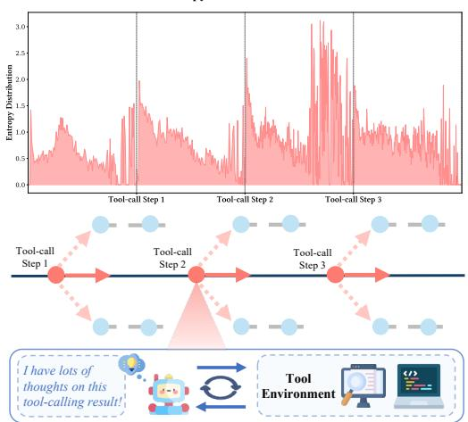
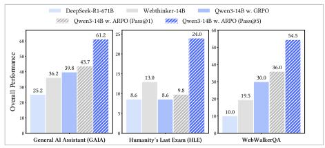
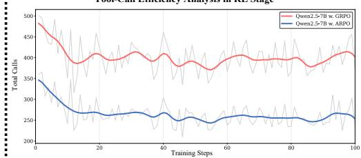
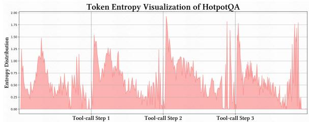
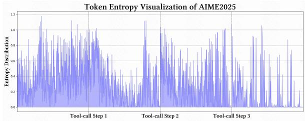
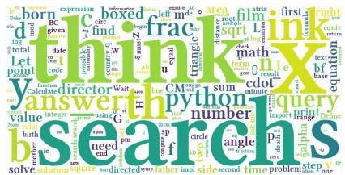
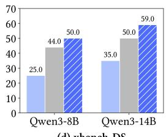
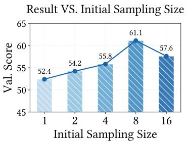
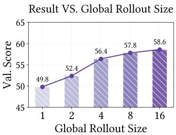

# AGENTIC REINFORCED POLICY OPTIMIZATION

Guanting Dong<sup>1∗</sup>, Hangyu Mao<sup>2</sup>, Kai Ma<sup>2</sup>, Licheng Bao<sup>2∗</sup>, Yifei Chen<sup>1</sup>, Zhongyuan Wang<sup>2∗</sup>   
Zhongxia Chen<sup>2</sup>, Jiazhen Du<sup>2</sup>, Huiyang Wang<sup>2∗</sup>, Fuzheng Zhang<sup>2</sup>, Guorui Zhou<sup>2†</sup>   
Yutao Zhu<sup>1</sup>, Ji-Rong Wen<sup>1</sup>, Zhicheng Dou<sup>1†</sup>   
<sup>1</sup>Renmin University of China, <sup>2</sup>Kuaishou Technology   
{dongguanting, dou}@ruc.edu.cn

‡ GitHub: https://github.com/dongguanting/ARPO

## ABSTRACT

Large-scale reinforcement learning with verifiable rewards (RLVR) has demonstrated its effectiveness in harnessing the potential of large language models (LLMs) for single-turn reasoning tasks. In realistic reasoning scenarios, LLMs can often utilize external tools to assist in task-solving processes. However, current RL algorithms inadequately balance the models’ intrinsic long-horizon reasoning capabilities and their proficiency in multi-turn tool interactions. To bridge this gap, we propose Agentic Reinforced Policy Optimization (ARPO), a novel agentic RL algorithm tailored for training multi-turn LLM-based agents. Through preliminary experiments, we observe that LLMs tend to exhibit highly uncertain behavior, characterized by an increase in the entropy distribution of generated tokens, immediately following interactions with external tools. Motivated by this observation, ARPO incorporates an entropy-based adaptive rollout mechanism, dynamically balancing global trajectory sampling and step-level sampling, thereby promoting exploration at steps with high uncertainty after tool usage. By integrating an advantage attribution estimation, ARPO enables LLMs to internalize advantage differences in stepwise tool-use interactions. Our experiments across 13 challenging benchmarks in computational reasoning, knowledge reasoning, and deep search domains demonstrate ARPO’s superiority over trajectory-level RL algorithms. Remarkably, ARPO achieves improved performance using only half of the tool-use budget required by existing methods, offering a scalable solution for aligning LLM-based agents with real-time dynamic environments.

Token Entropy Visualization of GAIA  


Performance on Deepsearch Benchmarks  


Tool-Call Efficiency Analysis in RL Stage  
  
Figure 1: Overview of tool-use token entropy exploration and ARPO algorithm performance. Left: High entropy observed in the LLM following tool usage. Right: LLM performance comparison on deep search tasks using only 1k RL samples, along with a comparison of training tool-use budgets.

## 1 INTRODUCTION

Recently, large-scale Reinforcement Learning with Verifiable Rewards (RLVR) has demonstrated strong potential in unleashing the capabilities of frontier large language models (LLMs), showcasing impressive performance across various single-turn reasoning tasks (OpenAI, 2024; DeepSeek-AI et al., 2025; Team et al., 2025; Qwen et al., 2024; Yang et al., 2025; Yuan et al., 2023; He et al., 2025). However, in open-ended reasoning scenarios (Putta et al., 2024; Shridhar et al., 2020; Qin et al., 2024; Mialon et al., 2024), LLMs should not only cultivate long-horizon planning and adaptive decisionmaking skills, but also engage in dynamic, multi-turn interactions with external tool environments. To address these challenges, Agentic Reinforcement Learning (Agentic RL) (Singh et al., 2025b; Mai et al., 2025)<sup>1</sup> has emerged as a promising training paradigm, shifting LLMs training from a static task-solving to the landscape of dynamic agent-environment reasoning (Silver et al., 2017; Dong et al., 2025; Wen et al., 2024; Feng et al., 2025a; Qian et al., 2025a; Jin et al., 2025a).

Current agentic reinforcement learning (RL) methods typically employ trajectory-level algorithms like GRPO or DAPO (Shao et al., 2024; Yu et al., 2025; Li et al., 2025f;c; Wu et al., 2025a; Song et al., 2025). These approaches independently sample complete tool-use trajectories using predefined special tokens and provide reward signals based on the final output. To address tool overuse and sparse reward issues (Qian et al., 2025b), several studies have attempted to design elegant reward functions to better align tool-use behavior (Wang et al., 2025b; Sha et al., 2025; Bai et al., 2025; Wang et al., 2025a). Despite some progress, these optimizations often overlook a crucial aspect of training LLMbased agents: the multi-turn interaction loops between the LLM and the tool environment (Wang et al., 2025e; Mai et al., 2025; Feng et al., 2025b). Unlike the single-turn reasoning paradigm, multi turn tool-use loops offer LLMs diverse and informative feedback in real-time. This characteristic underscores the necessity of discovering effective stepwise tool-use behaviors.

To gain an insight into the step-level tool-use behavior of LLMs, we draw inspiration from a series of entropy-based RL studies (Wang et al., 2025c;d; Cheng et al., 2025; Zheng et al., 2025) and quantify the token entropy distribution of LLM-based search agents during deep search tasks. As illustrated in Figure 1 (left), the initial tokens generated by the LLM after receiving each round of tool-call feedback consistently exhibit a high entropy. This indicates that external tool-call significantly introduces uncertainty into the LLM’s reasoning process, uncovering latent behaviors that remain under-explored by LLM-based agents (Ruan et al., 2023; Kong et al., 2024; Li et al., 2025g; Feng et al., 2025b; Chen et al., 2025c). Unfortunately, current trajectory-level RL methods often overemphasize complete roll-out sampling comparisons, neglecting the exploration of fine-grained behavior at each tool-use step (Xiong et al., 2024; Yu et al., 2024; Zhang et al., 2025). This oversight limits the diversity and scope necessary for aligning better tool-use behaviors. Consequently, it is essential to develop an agentic RL algorithm that aligns with agent-environment interaction characteristics to fully realize the potential of LLM-based agents.

To bridge this gap, we propose Agentic Reinforced Policy Optimization (ARPO), an agentic RL algorithm tailored for training multi-turn LLM-based agent. The core principle of ARPO is to encourage the policy model to adaptively branch sampling during high-entropy tool-call rounds, thereby efficiently aligning step-level tool-use behaviors. In detail, we propose an entropy-based adaptive rollout mechanism that integrates both global and partial sampling perspectives. In the rollout phase, the LLM initially performs multiple global samplings , recording the initial entropy distribution of each sample. After each tool-calling, we further monitor the real-time token entropy variation, regarding them as branching criteria. If the entropy change exceeds a predefined threshold, the model performs additional partial sampling to explore more diverse tool-integrated reasoning behaviors. This design allows ARPO to effectively expand the original sampling space while balancing global and step-level tool-use behavior learning.

To fully exploit the benefits of adaptive sampling, we introduce the advantage attribution estimation. Specifically, we explores both hard and soft advantage settings of ARPO, assigning shared advantage values to tokens along the same source reasoning path, while tokens on branched paths receive distinct advantage values. This mechanism encourages the model to internalize advantage differences in stepwise tool-use behaviors.

In our experiments, we comprehensively evaluate 13 datasets across computational reasoning, knowledge reasoning, and deep search domains. Figure 1 (right) provides an overview of the results for the deep search tasks. ARPO consistently surpasses traditional sample-level RL algorithms in agentic training. Remarkably, ARPO achieves this with only half the tool-call budget required by trajectory-level RL methods, striking an optimal balance between accuracy and efficiency. Further scaling analyses validate ARPO’s capacity to enhance LLM’s agentic reasoning in a scalable manner.

In summary, the key contributions of this work are as follows:

• We quantify the token entropy variation of LLM during agentic reasoning, revealing the inherent limitations of trajectory-level RL algorithms for aligning LLM-based agents.

• We propose the ARPO algorithm, which integrates an entropy-based adaptive rollout mechanism to balances global sampling while encouraging branch sampling during high-entropy tool-use steps. Furthermore, ARPO employs Advantage Attribution Estimation to assist the LLM in better internalizing advantage differences in stepwise tool-use behaviors.

• Beyond heuristic motivation, we also theoretically demonstrate the rationale of applying the ARPO algorithm in LLM-based agent training.

• Experiments across 13 challenging benchmarks consistently demonstrate ARPO’s superiority over mainstream RL algorithms, requiring only half the tool-use training budgets, thereby offering practical insights for exploring agentic RL algorithms.

## 2 PRELIMINARY

Before introducing ARPO, we first provide a brief overview of key concepts and review preliminary entropy-based experiments on LLM reasoning with tools.

## 2.1 AGENTIC REINFORCEMENT LEARNING

In this section, we formulate the agentic RL training objective as:

$$
\operatorname* { m a x } _ { \pi _ { \theta } } \mathbb { E } _ { x \sim \mathcal { D } , y \sim \pi _ { \theta } ( \cdot | x ; T ) } [ r _ { \phi } ( x , y ) ] - \beta \mathbb { D } _ { \mathrm { K L } } [ \pi _ { \theta } ( y \mid x ; T ) ] \mid \pi _ { \mathrm { r e f } } ( y \mid x ; T ) ] ,\tag{1}
$$

where $T$ denotes the set of available tools, π<sub>θ</sub> represents the policy LLM, $\pi _ { \mathrm { r e f } }$ is the reference LLM, $r _ { \phi }$ and $\mathbb { D } _ { \mathrm { K L } }$ denotes the reward function and KL divergence respectively. The input x is sampled from dataset $\mathcal { D } ,$ , and $y$ is the corresponding output, possibly interleaved with tool-call feedback.

Unlike conventional RL methods that rely solely on LLM rollouts, agentic RL incorporates tool-call feedback during the reasoning process (Chen et al., 2023; Gou et al., 2024; Li et al., 2025f; Wu et al., 2025c; Li et al., 2024a). The rollout sampling can be decomposed as:

$$
P _ { \theta } ( \mathcal { R } , y \mid x ; T ) = \underbrace { \prod _ { t = 1 } ^ { t _ { \mathcal { R } } } P _ { \theta } ( \mathcal { R } _ { t } \mid \mathcal { R } _ { < t } , x ; T ) } _ { \mathrm { A g e n t i c ~ R e a s o n i n g } } \cdot \underbrace { \prod _ { t = 1 } ^ { t _ { y } } P _ { \theta } ( y _ { t } \mid y _ { < t } , \mathcal { R } , x ; T ) } _ { \mathrm { A n s w e r ~ G e n e r a t i o n } } ,\tag{2}
$$

where $\mathcal { R }$ is the reasoning trajectory of length $t _ { \mathcal { R } }$ , interleaved with tool-call feedback, and y is the final answer with length $t _ { y } .$ . Our ARPO is built upon rule-based RL algorithm (e.g. GRPO (Shao et al., 2024), Reinforce++ (Hu, 2025)) designed to optimize LLM-based agents.

## 2.2 ANALYZING TOKEN ENTROPY IN AGENTIC REASONING

Token Entropy Calculation. Following recent entropy-based RL studies (Wang et al., 2025c;d; Cheng et al., 2025; Zheng et al., 2025), we compute the token-level generation entropy at step t as:

$$
H _ { t } = - \sum _ { j = 1 } ^ { V } p _ { t , j } \log p _ { t , j } , \quad \mathrm { w h e r e } p _ { t } = \pi _ { \theta } \left( \cdot \mid \mathcal { R } _ { < t } , x ; T \right) = \mathrm { S o f t m a x } \left( \frac { z _ { t } } { \tau } \right) .\tag{3}
$$

Here, V is the vocabulary size, $z _ { t } \in \mathbb { R } ^ { V }$ is the pre-softmax logits, and τ is the decoding temperature. Note that this entropy reflects the uncertainty in the token generation distribution, rather than the uncertainty of any particular token.



  
(a) Frequent tokens with the highest average entropy

  
Figure 2: Analysis of token entropy variations and token frequency statistics of LLM-based tool-use agent across different datasets.

  
(b) Frequent tokens with the lowest average entropy

Pilot Experiment on Token Entropy. To gain deeper insights into the reasoning process of LLMbased tool-use agents, we conduct a pilot study with two types of agents: one using a search engine for knowledge-intensive tasks and another using a Python interpreter for computational tasks. We measure token entropy variations throughout the reasoning process to assess uncertainty.

As shown in Figure 2, our key observations are: (1) Entropy rises sharply in the first 10–50 tokens following each tool call; (2) Entropy tends to increase during early reasoning stages, but remains lower than after receiving tool-call feedback; (3) Search feedback introduces more uncertainty than Python feedback.

We attribute these effects to the distributional shift between external feedback and the model’s internal reasoning (Ob.1), which introduces uncertainty often exceeding that of the original input (Ob.2). Furthermore, search engines typically return informative textual content, whereas Python outputs consist of deterministic numbers, resulting in greater entropy fluctuations in the former case (Ob.3).

These findings highlight a limitation of trajectory-level RL methods, which focus on initial reasoning while overlooking the uncertainty introduced by tool-call feedback. Our proposed ARPO algorithm addresses this by incorporating entropy-based exploration tailored to LLM agent training.

## 2.3 AGENTIC TOOL DESIGN

In this work, we mainly focus on optimizing the training algorithms of LLM-based tool-use agents. After a comprehensive review of agentic RL studies (Dong et al., 2025; Feng et al., 2025a; Jin et al., 2025a), we identify three representative tools to empirically evaluate the effectiveness of ARPO:

• Search Engine: Retrieves relevant information by executing queries across the web.

• Web Browser Agent: Accesses and parses relevant web links returned by the search engine, extracting and summarizing key content.

• Code Interpreter: Automatically executes code generated by the language model, returning execution results if successful, or compiler error messages otherwise.

## 3 AGENTIC REINFORCE POLICY OPTIMIZATION

In this section, we propose the ARPO algorithm, designed to guide LLMs in exploring step-wise tool-use behaviors under entropy-based guidance, as illustrated in Figures 3 and 4:

• Entropy-based Adaptive Rollout (§3.1): Inspired by the entropy variations observed in preliminary experiments (§2.2), ARPO extends the traditional rollout process by performing not only

  
Figure 3: The overview of ARPO algorithm.

trajectory-level sampling but also branching at high-entropy tool-use steps. By striking a balance between global and partial sampling, ARPO encourages broader exploration of tool-use behaviors.

• Advantage Attribution Estimation (§3.2): To better accommodate the adaptive rollout mechanism, we propose the advantage attribution estimation, enabling the model to more effectively internalize the advantage differences in stepwise tool-use behaviors.

• Theoretical Analysis (§3.3): To establish the theoretical foundation of ARPO, we provide a formal analysis showing that ARPO offers good adaptability in multi-turn training scenario for LLM-based agents.

Below, we will delve into the specifics of our approach.

## 3.1 ENTROPY-BASED ADAPTIVE ROLLOUT.

Inspired by preliminary experiments (§2.2), we incorporate both trajectory-level sampling and entropy-based partial sampling during the rollout phase to cover a more comprehensive sampling scope. The design of this mechanism involves the following four core steps:

(1) Rollout Initialization: Given a global rollout size of M , the LLM first generates N trajectories via trajectory-level sampling based on the input question q, while the remaining M − N trajectories budgets are reserved for partial sampling. We then compute the entropy of the first tokens k in each trajectory using Equation 3, forming the initial entropy matrix denoted as $H _ { \mathrm { i n i t i a l } } \in \mathbb { R } ^ { 1 \times k }$

(2) Entropy Variation Monitoring: After recording the initial entropy, the model perform agentic reasoning with tools, as defined in Equation 2. To continuously monitor the entropy dynamics following each tool invocation, we allow the model to generate k additional tokens after concatenating the response from the tool call. For the tool-call step t, we compute a step-level entropy matrix denoted as $H _ { t } \in \mathbb { R } ^ { 1 \times k }$ . We then quantify the normalized change in entropy relative to the initial state using the following formulation:

$$
\Delta H _ { t } = \mathrm { N o r m a l i z e } ( H _ { t } - H _ { \mathrm { i n i t i a l } } )\tag{4}
$$

where normalization means summing all the values of $\Delta H$ in dividing by the vocab size V . A positive $\Delta H$ indicates an increase in uncertainty after tool-call step k, whereas a negative value reflects a reduction in uncertainty.

(3) Entropy-based Adaptive Beaming: To encourage adaptive exploration along tool-use paths that exhibit beneficial entropy variations, we define the partial sampling probability at the tool-call step t as follow:

$$
P _ { t } = \alpha + \beta \cdot \Delta H _ { t } , \quad \mathrm { A c t i o n } ( P _ { t } ) = \left\{ \begin{array} { l l } { \mathrm { B r a n c h } ( Z ) , } & { \mathrm { i f ~ } P _ { t } > \tau } \\ { \mathrm { C o n t i n u e , } } & { \mathrm { o t h e r w i s e } } \end{array} \right.\tag{5}
$$

where α is a base sampling probability, $\beta$ is a stability entropy value. As shown in Figure 4(a), the model uses $P _ { t }$ to determine its branching behavior: when $P _ { t }$ exceeds a predefined threshold τ , it initiates Branch(Z), branching $Z$ partial reasoning paths from the current node; otherwise, it continues along the current trajectory.

This mechanism enables the model to adaptively allocate exploration resources to regions of the reasoning space where rising entropy indicates a higher potential for informative outcomes.

(4) Termination: The process iterates until one of the conditions is satisfied: (1) if the total number of forked paths $\hat { Z }$ reaches the partial sampling budget $M - N$ , branching stops and sampling continues until a final answer is produced; (2) if all paths terminate before reaching $M - N$ , we supplement with $M - N - \hat { Z }$ additional trajectory-level samples to satisfy condition (1).

  
Figure 4: llustration of two core components: Entropy-Based Adaptive Rollout and Advantage Attribution Estimation. Left: Principle of Entropy-Based Adaptive Beaming. Right: ARPO assigns different advantages to shared and individual token parts in inter-group samples.

By leveraging this efficient rollout mechanism, ARPO facilitates uncertainty-aware exploration, allowing LLMs to more effectively identify step-level tool-calling behavior. Meanwhile, assuming the global expansion size and the number of tokens per trajectory are $n , \mathrm { A R P O }$ reduces the computational complexity of each rollout from the trajectory-level RL’s ${ \dot { O ( n ^ { 2 } ) } }$ to between $O ( n \log n )$ and $O ( n ^ { 2 } ) { } ^ { 2 }$

## 3.2 ADVANTAGE ATTRIBUTION ESTIMATION

Our entropy-based adaptive rollout mechanism naturally produces trajectories containing both shared reasoning token segments and distinct beam paths (Figure 4), which motivates us to explore a more principled agentic RL policy update strategy. To this end, we consider the following two advantage assignment settings:

Hard Advantage Estimation: As shown in Figure 4(b), a straightforward approach is to explicitly distinguish the shared and individual parts of each trajectory at the advantage level, thereby encouraging the model to capture step-level tool-use behaviors. Given d trajectories that share certain tokens while diverging in others, we compute the advantage for the individual tokens using the normalized reward $\begin{array} { r } { R _ { i } \colon \hat { \boldsymbol { A } } _ { i , t } = \frac { r _ { i } - \operatorname* { m e a n } ( \{ R _ { i } \} _ { i = 1 } ^ { G } ) } { \operatorname* { s t d } ( \{ R _ { i } \} _ { i = 1 } ^ { G } ) } } \end{array}$ . For the shared tokens, we assign the average advantage across d trajectories that contain the shared segment: $\begin{array} { r } { \hat { A } _ { i , t } ^ { \mathrm { s h a r e d } } = \frac { 1 } { d } \sum _ { i = 1 } ^ { d } \hat { A } _ { i , t } } \end{array}$

Soft Advantage Estimation: An elegant alternative to hard advantage assignment is to integrate the distinction between shared and individual token segments latently during policy optimization. Specifically, for each input question x, the Group Relative Policy Optimization (GRPO) (Shao et al., 2024) enables the reference policy $\pi _ { \mathrm { r e f } }$ to generate a set of responses $\left\{ y _ { 1 } , y _ { 2 } , \ldots , y _ { G } \right\}$ and optimizes the policy by maximizing:

$$
\begin{array} { r l } & { J _ { \mathrm { G R P O } } ( \theta ) = \mathbb { E } _ { ( q , a ) \sim D , \{ y _ { i } \} _ { i = 1 } ^ { G } \sim \pi _ { \theta _ { 0 d } } ( \cdot | q ) } \left[ \displaystyle \frac { 1 } { G } \sum _ { i = 1 } ^ { G } \frac { 1 } { | y _ { i } | } \sum _ { t = 1 } ^ { | y _ { i } | } \operatorname* { m i n } \left( r _ { i , t } ( \theta ) \hat { A } _ { i , t } , \right. \right. } \\ & { \left. \left. \mathrm { c l i p } \left( r _ { i , t } ( \theta ) , 1 - \epsilon , 1 + \epsilon \right) \hat { A } _ { i , t } \right) - \beta D _ { \mathrm { K L } } ( \pi _ { \theta } \parallel \pi _ { \mathrm { r e f } } ) \right] . } \end{array}\tag{6}
$$

Notably, the GRPO objective incorporates the distinction between shared and individual tokens through importance sampling ratio $r _ { i , t } ( \theta )$

$$
\boldsymbol { r } _ { i , t } ( \theta ) = \frac { \pi _ { \theta } ( y _ { i , t } \mid x , y _ { i , < t } ) } { \pi _ { \mathrm { r e f } } ( y _ { i , t } \mid x , y _ { i , < t } ) } , \ : \ : \left\{ \boldsymbol { r } _ { i , t } ( \theta ) = \boldsymbol { r } _ { j , t } ( \theta ) , \ : \ : \ : \mathrm { i f } \ : y _ { i , < t } = y _ { j , < t } \ : ( \mathrm { i . e . , s h a r e d ~ t o k e n s } ) \right.\tag{7}
$$

As indicated by the above equation, when trajectories $y _ { i }$ and $y _ { j }$ undergo a partial rollout at token t, they share the same response prefix tokens, i.e., $y _ { i , < t } ~ = ~ y _ { j , < t }$ Consequently, the shared prefix tokens in both trajectories are assigned the same importance weight $r _ { i , t } ( \theta )$ . In the GRPO formulation, the mathematical interpretation is that the policy update is guided by the average advantage of tokens within each group, which serves as the loss signal.

Since shared tokens have identical $r _ { i , t } ( \theta )$ „ their advantage contributions are effectively aligned and closely approximate the advantage $\hat { A } _ { i , t } ^ { \mathrm { s h a r e d } }$ in a hard estimation setting. Although we adopt the GRPO loss formulation, our unique partial rollout design explicitly differentiates the update strategies for shared versus individual tokens. we also provide a detailed proof for the above argument in Appendix D.1.

  
Figure 5: Comparison of different advantage estimation method: Hard vs. Soft setting.

In practice, we further compare the reward variations between hard and soft advantage estimation in RL training. As shown in Figure 5, the soft setting achieves consistently higher rewards with greater

stability during ARPO training. Consequently, our ARPO defaults to using the soft setting for advantage estimation.

Hierarchical Reward Design. The reward function serves as the optimization objective, guiding the policy model’s behavior during training. We follow Tool-Star (Dong et al., 2025), considering both correctness and format rewards, along with a multi-tool collaboration reward mechanism. Notably, an additional reward $r _ { M }$ is given when the model generates the correct answer, follows the correct tool invocation format, and uses multiple tools (i.e., <search> and <python> ) during reasoning. The overall reward R is formally defined as:

$$
R = \left\{ \begin{array} { l l } { \operatorname* { m a x } ( A c c . + r _ { \mathrm { M } } , A c c . ) } & { \mathrm { I f ~ F o r m a t ~ i s ~ G o o d ~ \& ~ A c c . > 0 ~ } } \\ { 0 } & { \mathrm { I f ~ F o r m a t ~ i s ~ G o o d ~ \& ~ A c c . = 0 ~ } \ , r _ { \mathrm { M } } = \left\{ 0 . 1 \quad \mathrm { H } \ \exists ( [ \mathrm { - s e a r c h } > ] \backslash \measuredangle \ [ \mathrm { - p y t h o n s } ] ) \right\} } \\ { - 1 } & { \mathrm { O t h e r w i s e } } \end{array} \right.\tag{8}
$$

The detailed flowchart for the ARPO algorithm can be found in Algorithm 1.

## 3.3 THEORETICAL FOUNDATION

Our approach leverages the adaptive partial rollout mechanism, which involves branching at highentropy tool-use steps. Here, we elucidate the rationale behind this mechanism.

As depicted in Figure 4, the adaptive partial rollout mechanism dynamically segments the Transformerbased policy’s output tokens $< \ O T _ { 1 } , O T _ { 2 } , . . . , O T _ { | o u t p u t | } \ >$ into K segments. Each segment is defined as a macro action, $M A _ { i } \ \stackrel { \Delta } { = } < \ O T _ { m } , O T _ { m + 1 } , . . . , O T _ { m + n } >$ . The corresponding macro states are defined as $M S _ { 1 } \triangleq < I T _ { 1 } , I T _ { 2 } , . . . , I T _ { | i n p u t | } >$ and $M S _ { i } \triangleq < M S _ { i - 1 } , M A _ { i - 1 } >$ . This segmentation allows us to derive the Generalized Policy Gradient (GPG) Theorem applicable to all Transformer-based policies:

$$
\nabla _ { \theta } J ( \theta ) { = } \mathbb { E } _ { \tau \sim \pi _ { \theta } } \{ \sum _ { T = 1 } ^ { K } [ \nabla _ { \theta } \log \pi _ { \theta } ( M A _ { T } | M S _ { T } ) A _ { T } ( \tau ) ] \}\tag{9}
$$

In this equation, $T$ represents the macro step, and $A _ { T } ( \tau )$ denotes the advantage of trajectory τ . The GPG Theorem asserts that for any differentiable Transformer-based policy $\pi _ { \theta }$ and any objective function $J ( \theta )$ , optimization can be effectively conducted using macro actions (i.e., partial rollout segments). This generalization encompasses the traditional Policy Gradient Theorem (Sutton et al., 1999), $\begin{array} { r } { \nabla _ { \theta } J ( \theta ) = \mathbb { E } _ { \tau \sim \pi _ { \theta } } \{ \sum _ { t = 1 } ^ { H } [ \nabla _ { \theta } \log \pi _ { \theta } ( a _ { t } | s _ { t } ) A _ { t } ( \tau ) ] \} } \end{array}$ , which operates on single-token actions (where $a _ { t }$ is a single output token of the Transformer), as a specific instance of our broader GPG framework. Consequently, ARPO as an advanced implementation of the GPG Theorem provides a robust theoretical foundation. Tthe formal proof of the GPG Theorem is presented in Appendix D.2.

## 4 EXPERIMENT

## 4.1 DATASETS.

To comprehensively evaluate the effectiveness of our ARPO algorithm in training LLM-based toolusing agents, we conduct experiments on the following three types of long-horizon reasoning tasks:

(1) Mathematical Reasoning: including AIME2024, AIME2025<sup>3</sup>, MATH500 (Lightman et al., 2024), MATH (Hendrycks et al., 2021), and GSM8K.

(2) Knowledge-Intensive Reasoning: including WebWalker (Wu et al., 2025b); as well as three Wikipedia-based open-domain QA tasks: HotpotQA (Yang et al., 2018), 2WikiMultihopQA (Ho et al., 2020), and Musique (Trivedi et al., 2022) and bamboogle (Press et al., 2023).

(3) Deep Search: including General AI Assistant (GAIA) (Mialon et al., 2024), WebWalker (Wu et al., 2025b), Humanity’s Last Exam (HLE) (Phan et al., 2025), and xbench (Chen et al., 2025a). Notably, we follow the Websailor (Li et al., 2025c) setting by testing the xbench-DeepSearch split.

To maintain consistency with existing work, we use the Tool-Star (Dong et al., 2025) test set split for the mathematical and knowledge reasoning benchmarks, and for the deep search benchmarks, we follow Webthinker and HIRA (Li et al., 2025e; Jin et al., 2025b) for the Deepsearch test set split.

## 4.2 BASELINES.

To effectively evaluate the efficacy of ARPO, we consider the following three baselines:

1. Direct Reasoning: For mathematical and knowledge reasoning benchmarks, we evaluate the instruct versions of the Qwen2.5 (Qwen et al., 2024) and Llama3.1 (Dubey et al., 2024) series. Given the superior mathematical performance of the Qwen3 series (Yang et al., 2025), we use the Deepsearch task to test RL algorithms on this model’s backbone. We also reference strong reasoning models, including QwQ (Team, 2024b), DeepSeek-R1 (DeepSeek-AI et al., 2025), GPT-4o (Hurst et al., 2024), and o1-preview (Hurst et al., 2024).

2. Trajectory-level RL Algorithms: We compare ARPO with common trajectory-level RL algorithms for training LLM-based tool-use agents, including GRPO (Shao et al., 2024), DAPO (Yu et al., 2025), and REINFORCE++ (Hu, 2025).

3. LLM-based Search Agent: For the deep search benchmark, we include GRPO and a series of open-source workflow-based search agents as references, such as vanilla RAG (Lewis et al., 2020), Search o1 (Li et al., 2025d), Webthinker (Li et al., 2025e), and ReAct (Yao et al., 2022). Detailed introductions are in Appendix B.

## 4.3 TRAINING GUIDELINE

Our study aims to validate the effectiveness of ARPO at the algorithmic level compared to traditional RL in training LLM agents, rather than merely pursuing performance improvements. To ensure reproducibility, all training frameworks and datasets are sourced from open-access resources. Specifically, our experiments adhere to the cold-start SFT with RL paradigm (Song et al., 2025; Dong et al., 2025) to mitigate reward collapse during the initial RL training phases.

1. Cold-Start Finetuning Phase: Utilizing the LLaMAFactory (Zheng et al., 2024) framework, we leverage Tool-Star’s open-source dataset of 54K training samples. To enrich the quality of mathematical reasoning data, we incorporate the STILL dataset (0.8K), drawing inspiration from CORT (Li et al., 2025a).

2. RL Phase: To assess ARPO across various scenarios, we explore the following domains:

• Deep Reasoning Tasks: This includes computational reasoning (e.g., AIME24, MATH500) and multi-hop knowledge-based reasoning (e.g., HotpotQA, Bamboogle). We utilize Tool-Star’s 10K open-source RL training samples for algorithmic comparison.

• Deep Search Tasks: These tasks require extensive web exploration and information integration, necessitating longer contexts and frequent tool interactions. We use only 1K mixed hard search samples from SimpleDeepSearcher (Sun et al., 2025b) and WebSailor (Li et al., 2025c) for training.

To expedite the RL training phase, we incorporate top-10 snippets from the Bing search engine as search results, employ a Python compiler within a sandbox environment, and use token-level F1 scores as the correctness signal.

Table 1: Overall performance on 10 challenging reasoning tasks are presented. The top two outcomes are bolded and underlined. Dataset abbreviations are as follows: HQA (HotpotQA), 2Wiki. (2wiki-MultiHopQA), MuSi. (MuSiQue), and Bamb (Bamboogle).
<table><tr><td rowspan="2">Method</td><td colspan="4">Mathematical Reasoning</td><td colspan="6">Knowledge-Intensive Reasoning</td><td rowspan="2">Avg.</td></tr><tr><td>AIME24 AIME25 MATH500 GSM8K MATH WebWalker HQA 2Wiki. MuSiQ. Bamb.</td><td></td><td></td><td></td><td></td><td></td><td></td><td></td><td></td><td></td></tr><tr><td>Qwen2.5-3B-Instruct</td><td>10.0</td><td>6.7</td><td>63.0</td><td>75.0</td><td>71.6</td><td>0.5</td><td>9.7</td><td>9.4</td><td>3.6</td><td>11.7</td><td>26.1</td></tr><tr><td>+ TIR Prompting</td><td>6.7</td><td>6.7</td><td>52.2</td><td>56.6</td><td>62.8</td><td>14.0</td><td>15.4</td><td>14.1</td><td>6.1</td><td>16.4</td><td>25.1</td></tr><tr><td>+ GRPO</td><td>20.0</td><td>13.3</td><td>72.0</td><td>86.0</td><td>81.0</td><td>21.0</td><td>56.5</td><td>64.5</td><td>24.7</td><td>65.2</td><td>50.4</td></tr><tr><td>+ Reinforce ++</td><td>16.7</td><td>13.3</td><td>70.4</td><td>85.0</td><td>80.2</td><td>19.5</td><td>55.9</td><td>62.3</td><td>27.9</td><td>65.7</td><td>49.7</td></tr><tr><td>+ DAPO</td><td>20.0</td><td>16.7</td><td>71.2</td><td>85.0</td><td>81.2</td><td>19.5</td><td>54.8</td><td>62.5</td><td>30.0</td><td>64.8</td><td>50.6</td></tr><tr><td>+ ARPO</td><td>23.3</td><td>20.0</td><td>71.4</td><td>85.0</td><td>82.5</td><td>24.5</td><td>58.5</td><td>67.4</td><td>28.7</td><td>66.8</td><td>52.8</td></tr><tr><td>Llama3.1-8B-Instruct</td><td>3.3</td><td>0.0</td><td>43.3</td><td>81.4</td><td>60.6</td><td>3.0</td><td>24.3</td><td>24.6</td><td>10.4</td><td>40.0</td><td>28.8</td></tr><tr><td>+ TIR Prompting</td><td>3.3</td><td>3.3</td><td>39.4</td><td>73.8</td><td>58.2</td><td>15.0</td><td>48.5</td><td>47.5</td><td>15.5</td><td></td><td>58.4 36.3</td></tr><tr><td>+ GRPO</td><td>13.3</td><td>13.3</td><td>62.4</td><td>87.4</td><td>79.2</td><td>26.5</td><td>57.8</td><td>71.8</td><td>31.0</td><td>68.2</td><td>51.1</td></tr><tr><td>+ Reinforce ++</td><td>13.3</td><td>16.7</td><td>61.4</td><td>87.0</td><td>77.2</td><td>27.5</td><td>57.1</td><td>71.6</td><td>29.9</td><td>69.1</td><td>51.1</td></tr><tr><td>+ DAPO</td><td>16.7</td><td>13.3</td><td>61.2</td><td>87.4</td><td>76.4</td><td>25.5</td><td>56.6</td><td>70.3</td><td>29.2</td><td>67.3</td><td>50.4</td></tr><tr><td>+ ARPO</td><td>23.3</td><td>16.7</td><td>64.6</td><td>88.0</td><td>80.2</td><td>30.5</td><td>65.4</td><td>75.5</td><td>34.8</td><td>73.8</td><td>55.3</td></tr><tr><td>Qwen2.5-7B-Instruct</td><td>10.0</td><td>10.0</td><td>70.6</td><td>90.2</td><td>82.0</td><td>2.0</td><td>12.2</td><td>12.6</td><td>6.6</td><td>24.0</td><td>32.0</td></tr><tr><td>+ TIR Prompting</td><td>6.7</td><td>10.0</td><td>68.2</td><td>64.6</td><td>78.2</td><td>15.5</td><td>14.8</td><td>18.3</td><td>9.5</td><td>23.6</td><td>31.0</td></tr><tr><td>+ GRPO</td><td>23.3</td><td>26.7</td><td>78.0</td><td>92.8</td><td>87.8</td><td>22.0</td><td>59.0</td><td>76.1</td><td>30.6</td><td>68.4</td><td>56.5</td></tr><tr><td>+ Reinforce ++</td><td>26.7</td><td>23.3</td><td>78.0</td><td>92.2</td><td>88.8</td><td>26.0</td><td>55.1</td><td>68.9</td><td>25.2</td><td>64.9</td><td>54.9</td></tr><tr><td>+ DAPO</td><td>20.0</td><td>23.3</td><td>80.4</td><td>91.0</td><td>88.8</td><td>24.0</td><td>57.7</td><td>68.4</td><td>28.6</td><td>65.5</td><td>54.8</td></tr><tr><td>+ ARPO</td><td>30.0</td><td>30.0</td><td>78.8</td><td>92.2</td><td>88.8</td><td>26.0</td><td>58.8</td><td>76.1</td><td>31.1</td><td>71.5</td><td>58.3</td></tr></table>

## 4.4 EVALUATION METRIC

In evaluation phrase, we use a search engine with browser capabilities to align with standard reasoning performance. For accuracy, we use F1 scores as the metric for four QA tasks in Knowledge-Intensive Reasoning, while other tasks are evaluated using Qwen2.5-72B-instruct under the LLM-as-Judge setting. We adopt pass@1 evaluation with non-zero temperature, setting the temperature and top-p to 0.6 and 0.95, respectively.For all tasks, we follow previous work (Li et al., 2025d) and extract answers from the model output enclosed in \box{}.

## 4.5 MAIN RESULTS

Results on Mathematical & Knowledge-Intensive Reasoning. Our main results are shown in Table 1. In a fair setting, ARPO consistently outperforms all trajectory-level RL algorithms, firmly establishing its superiority. Moreover, we highlight the following insights:

• Ineffectiveness of Prompting Methods: The Tool-integrated prompting (TIR) method (Li et al., 2025d) fails to effectively explore superior tool-use behaviors. For both Qwen and Llama series models, performance improvements with TIR prompts are limited and even lower than direct reasoning. This suggests that relying solely on prompt engineering is insufficient for guiding LLMs toward optimal tool behaviors and may disrupt their inherent reasoning capabilities.

• Limitations of Trajectory-Level RL: Compared to ARPO, three classic trajectory-level RL algorithms do not effectively harness the potential for tool-integrated reasoning. While the DAPO algorithm excels in single-turn reasoning tasks, it underperforms in multi-turn tool-call interaction, especially in knowledge-intensive scenarios. This aligns with our preliminary observations that trajectory-level RL algorithms struggle to stimulate step-level tool-use behavior learning in LLMs.

• Robust Performance of ARPO: In the same experimental setup, ARPO consistently outperforms other RL algorithms across 10 datasets, achieving an average accuracy improvement of 4% while maintaining competitive result on individual domains. Notably, it shows significant enhancements across different backbone models, including both Qwen and Llama series. These results underscore ARPO’s efficiency, and strong adaptability across various model backbones and tasks.

Table 2: Overall performance on various deep search tasks, with accuracy results for each dataset obtained using llm-as-judge. The best results are indicated in bold, and the second-best results are underlined. Results from larger or closed-source models are presented in gray for reference.
<table><tr><td rowspan="2">Method</td><td colspan="4">General AI Assistant</td><td colspan="4">WebWalkerQA</td><td colspan="4">Humanity&#x27;s Last Exam</td><td>XBench</td></tr><tr><td>Lv.1</td><td>Lv.2</td><td>Lv.3</td><td>Avg.</td><td>Easy</td><td>Med.</td><td>Hard</td><td>Avg.</td><td>NS</td><td>CE</td><td>SF</td><td>Avg.</td><td>Avg.</td></tr><tr><td colspan="10">Direct Reasoning (&gt;=32B)</td><td colspan="7"></td></tr><tr><td>Qwen3-32B-thinking</td><td>26.2</td><td>12.1</td><td>0</td><td>14.9</td><td>6.9</td><td>1.1</td><td>2.9</td><td>3.1</td><td>14.6</td><td>9.8</td><td>8.4</td><td></td><td>12.6</td><td>14.0</td></tr><tr><td>DeepSeek-R1-32B</td><td>21.5</td><td>13.6</td><td>0.0</td><td>14.2</td><td>7.5</td><td>1.4</td><td>4.2</td><td>3.8</td><td>6.6</td><td>5.1</td><td></td><td>6.5</td><td>6.4</td><td>10.0</td></tr><tr><td>QwQ-32B</td><td>30.9</td><td>6.5</td><td>5.2</td><td>18.9</td><td>7.5</td><td>2.1</td><td>4.6</td><td>4.3</td><td></td><td>11.5</td><td>7.3</td><td>5.2</td><td>9.6</td><td>10.7</td></tr><tr><td>GPT-40</td><td>23.1</td><td>15.4</td><td>8.3</td><td>17.5</td><td>6.7</td><td>6.0</td><td>4.2</td><td>5.5</td><td>2.7</td><td></td><td>1.2</td><td>3.2</td><td>2.6</td><td>18.0</td></tr><tr><td>DeepSeek-R1-671B</td><td>40.5</td><td>21.2</td><td>5.2</td><td>25.2</td><td>5.0</td><td>11.8</td><td>11.3</td><td>10.0</td><td>8.5</td><td></td><td>8.1</td><td>9.3</td><td>8.6</td><td>32.7</td></tr><tr><td>o1-preview†</td><td></td><td></td><td></td><td></td><td>11.9</td><td>10.4</td><td>7.9</td><td>9.9</td><td>12.9</td><td></td><td>8.1</td><td>6.6</td><td>11.1</td><td></td></tr><tr><td colspan="10">Single-Enhanced Method (Qwen3-8B)</td><td colspan="7"></td></tr><tr><td>Vanilla RAG</td><td>28.2</td><td>15.4</td><td>16.7</td><td>20.4</td><td>8.9</td><td>10.7</td><td>9.9</td><td></td><td>10.0</td><td>5.1</td><td>1.6</td><td>12.9</td><td>5.8</td><td>8.0</td></tr><tr><td>Search-o1</td><td>35.9</td><td>15.4</td><td>0.0</td><td>21.4</td><td>6.7</td><td>15.5</td><td>9.7</td><td>11.5</td><td>7.6</td><td>2.7</td><td></td><td>5.3</td><td>6.4</td><td>10.0</td></tr><tr><td>WebThinker</td><td>43.6</td><td>11.5</td><td>0.0</td><td>22.3</td><td>6.7</td><td>13.1</td><td>16.9</td><td>13.0</td><td>7.3</td><td></td><td>4.0</td><td>6.3</td><td>6.6</td><td>13.0</td></tr><tr><td>ReAct</td><td>35.9</td><td>17.3</td><td>8.3</td><td>23.3</td><td>8.9</td><td>16.7</td><td>18.3</td><td>15.5</td><td>4.2</td><td></td><td>4.0</td><td>6.3</td><td>4.6</td><td>16.0</td></tr><tr><td colspan="10">RL-based Method (Qwen3-8B)</td><td colspan="7"></td></tr><tr><td>Qwen3-8B</td><td>28.1</td><td>15.4</td><td>16.7</td><td>20.4</td><td>0.0</td><td>2.4</td><td>2.8</td><td></td><td>2.0</td><td>3.9</td><td>2.7</td><td>8.4</td><td>4.6</td><td>9.0</td></tr><tr><td>+ GRPO</td><td>48.7</td><td>25.0</td><td>8.3</td><td>32.0</td><td>24.4</td><td>33.3</td><td>26.8</td><td>29.0</td><td></td><td>7.9</td><td>4.0</td><td>10.5</td><td>7.8</td><td>20.0</td></tr><tr><td>+ ARPO</td><td>53.9</td><td>32.7</td><td>16.7</td><td>38.8</td><td>26.7</td><td>33.3</td><td>29.6</td><td>30.5</td><td>7.3</td><td></td><td>6.7</td><td>15.8</td><td>8.8</td><td>25.0</td></tr><tr><td colspan="10">Single-Enhanced Method (Qwen3-14B)</td><td colspan="7"></td></tr><tr><td>Vanilla RAG</td><td>38.5</td><td>19.2</td><td>8.3</td><td>25.2</td><td>17.8</td><td>13.1</td><td>11.3</td><td>13.5</td><td></td><td>5.5</td><td>6.3</td><td>9.4</td><td>6.0</td><td>15.0</td></tr><tr><td>Search-o1</td><td>48.7</td><td>23.1</td><td>0.0</td><td>30.1</td><td>11.1</td><td>21.4</td><td>16.9</td><td>17.5</td><td>6.4</td><td></td><td>4.0</td><td>10.5</td><td>6.8</td><td>21.0</td></tr><tr><td>WebThinker</td><td>48.7</td><td>26.9</td><td>8.3</td><td>33.0</td><td>13.3</td><td>23.8</td><td>18.3</td><td>19.5</td><td>7.0</td><td></td><td>4.0</td><td>9.5</td><td>7.0</td><td>23.0</td></tr><tr><td>ReAct</td><td>48.7</td><td>25.0</td><td>8.3</td><td>32.0</td><td>11.1</td><td>20.2</td><td>12.7</td><td>15.5</td><td></td><td>5.8</td><td>5.3</td><td>10.5</td><td>6.6</td><td>20.0</td></tr><tr><td colspan="10">RL-based Method (Qwen3-14B)</td><td colspan="7"></td></tr><tr><td>Qwen3-14B</td><td>33.3</td><td>13.5</td><td>0.0</td><td>19.4</td><td>6.7</td><td>2.4</td><td>4.2</td><td>4.0</td><td></td><td>5.5</td><td>6.7</td><td>11.6</td><td>6.8</td><td>14.0</td></tr><tr><td>+ GRPO</td><td>51.3</td><td>34.6</td><td>0.0</td><td>36.9</td><td>28.9</td><td>33.3</td><td>26.8</td><td>30.0</td><td></td><td>7.9</td><td>6.7</td><td>12.6</td><td>8.6</td><td>27.0</td></tr><tr><td>+ ARPO</td><td>56.4</td><td>40.4</td><td>16.7</td><td>43.7</td><td>31.1</td><td>42.9</td><td>31.0</td><td>36.0</td><td>10.3</td><td>10.7</td><td></td><td>13.7</td><td>10.0</td><td>32.0</td></tr></table>

Results on Deep Search Tasks. To further verify the effectiveness of our ARPO in challenging deep search scenarios, we compare the performance of the Qwen3 series models, trained with only 1k RL samples, against a series of strong baseline methods. Our observations are as follows:

• Generalization of ARPO in Deep Search Domain: In deep search scenarios, even the most advanced LLMs like GPT-4o and DeepSeek-R1-671B achieve limited performance, scoring only 2% and 8.6% on the HLE benchmark respectively. In contrast, ARPO demonstrates exceptional performance using only the Qwen3-8 and 14B models, achieving pass@1 scores of 10.0% and 43.2% on the HLE and GAIA benchmarks. Notably, during the RL phase, ARPO is trained with just 1K samples from an open-source web search dataset, showcasing its efficiency in leveraging tool-integrated reasoning capabilities.

• Importance of Step-Level Tool Use Behavior Exploration: ARPO consistently outperforms GRPO in both average performance and individual benchmarks, with a notable 6% improvement on the GAIA and WebwalkerQA benchmarks. This highlights the importance of ARPO’s algorithmic design, which balances global and step-level sampling. This balance promotes diverse behavior exploration by LLMs during high-entropy tool-use steps, crucial for deep search scenarios involving frequent tool invocation.

## 4.6 QUANTITATIVE ANALYSIS

Analyzing Sampling at Scale. Due to the dynamic and multi-round interaction characteristics of Deepsearch evaluation, Pass@1 is insufficient to capture the model’s potential for tool usage. Consequently, we conducted further sampling analysis on Pass@3 and Pass@5, as illustrated in Figure 6. Both the 8B and 14B models demonstrated consistent improvements and a scaling trend in Pass@3 and Pass@5 following the ARPO alignment stage. Notably, our Qwen-14B with ARPO achieved remarkable performance on Pass@5, particularly with GAIA at 61.2%, HLE at 24.0% and xbench-DR at 59%. This stable enhancement in Pass@K is primarily attributed to ARPO’s ability to explore fine-grained tool-use behaviors more efficiently, thereby expanding the sampling space and achieving both inference efficiency and sampling diversity.


  
(a) GAIA

  
(d) xbench-DS  
Figure 6: Analysis of Qwen3-8B and Qwen3-14B using ARPO across Pass@1 to Pass@5 metrics.

Tool-Call Efficiency Analysis. In agentic RL training, increasing the number of tool calls often results in substantial financial costs. Therefore, an effective agentic RL algorithm must ensure efficient tool usage. To assess the tool usage efficiency of ARPO during training, we compare it with GRPO on Qwen2.5-7B. As shown in Figure 7, ARPO achieves superior overall accuracy compared to GRPO while using only half the number of tool calls. This efficiency is attributed to ARPO’s unique entropy-based adaptive rollout mechanism, which selectively explores branches only during high-entropy tool-call steps. This approach significantly expands the exploration space for tool behavior while greatly reducing the number of tool calls.

  
Figure 7: Comparison of Tool-Call Efficiency for Qwen2.5-7B: GRPO vs. ARPO

Ablations of Browser Agents. To further investigate the importance of the browser agent in the Deepsearch task, we designed three browser settings, ranked from weakest to strongest in terms of capability: (1) no browser with only snippets; (2) a browser agent with a similar scale to the reasoning model, and (3) a larger-parameter browser agent.

As shown in Table 3, results show that the setting without a browser exhibits the worst performance consistency, indicating that relying solely on rule-generated web snippet summaries is insufficient to provide the necessary information support in deep search tasks. This highlights the necessity of web content fetching and browsing. As the capability of the browser agent increases, model performance also improves significantly, demonstrating that a more powerful search agent can more effectively integrate information and extract key details relevant to the question. In summary, the capability of the external browser agent is highly correlated with the accuracy of the Deepsearch task and shows a clear upward trend as its scale increases.

Table 3: Ablation studies of the backbone model of browser agents in deep search tasks.
<table><tr><td colspan="5">Method GAIA HLE WebWalk.. Avg.</td></tr><tr><td colspan="5">Qwen3-8B</td></tr><tr><td>+ Snippet only</td><td>33.0 38.8</td><td>7.5 8.8</td><td>29.0 30.5</td><td>23.2 26.0</td></tr><tr><td>+ Qwen3-8B Browser + QWQ-32B Browser</td><td>38.8</td><td>8.2</td><td>33.0</td><td>26.6</td></tr><tr><td colspan="5">Qwen3-14B</td></tr><tr><td>+ Snippet only</td><td>35.0</td><td>8.4</td><td>31.0</td><td>24.8</td></tr><tr><td>+ Qwen3-14B Browser</td><td>43.7</td><td>10.0</td><td>36.0</td><td>29.9</td></tr><tr><td>+ QWQ-32B Browser</td><td>47.6</td><td>32.3</td><td>38.4</td><td>39.4</td></tr></table>




  
Figure 8: Scaling analysis of different Hyper-parameters in Qwen2.5-7B with ARPO. The detailed setting can be found in Appendix C.4.

## 4.7 SCALING ANALYSIS OF ARPO

To verify the scalability of ARPO and gain deeper insights into its characteristics, we use the Qwen2.5- 7B model as the backbone for a scaling analysis of three core parameters: entropy value, global rollout size, and initial sampling size. Our observations are as follows:

Entropy Value (∆H<sub>t</sub>): As shown in Figure 8 (left), model performance increases with rising entropy values, peaking at 0.4. This indicates that integrating a moderate amount of entropy as a clue for partial sampling substantially enhances the model’s ability to explore rare tool-use behaviors, thereby improving training outcomes. However, as entropy reaches 1.0, performance declines, suggesting a trade-off in the weight of entropy in sampling. Over-reliance on entropy may reduce sampling diversity, confirming the necessity of balancing base sampling probabilities α with entropy in ARPO.

Initial Sampling Size (N ): Figure 8 (middle) illustrates that as the initial sampling size increases, model performance improves, peaking at 8. Notably, with a global rollout size of 16, increasing the initial sampling size from 0 to 8 shifts the global-to-partial sampling ratio from 1:15 to 1:1. This underscores the importance of balancing sampling proportions for imrpoving performance. As anticipated, increasing the size to 16 results in a great performance decline. This is because it leads to complete global sampling, which disrupts the dynamic sampling balance.

Global Rollout Size (M ): As depicted in the Figure 8 (right), increasing the global rollout size enhances model performance, indicating that the ARPO algorithm is scalable and can improve generalization performance with larger sizes.

## 5 RELATED WORK

Reinforcement Learning with Verifiable Reward. Recently, Reinforcement Learning with Verifiable Rewards (RLVR) (Lambert et al., 2024; Kaufmann et al., 2025) has become a leading approach in Reinforcement Learning through Human Feedback (RLHF), particularly excelling in enhancing mathematical and programming reasoning (Shao et al., 2024; DeepSeek-AI et al., 2025; Yang et al., 2025; 2024; Team, 2024b;a; Dong et al., 2024c; Qiao et al., 2024). OpenAI o1 (OpenAI, 2024) first showcased RL’s effectiveness in large-scale reasoning tasks. Building on this, models like DeepSeek R1 (DeepSeek-AI et al., 2025), QwQ (Team, 2024c), and Kimi k1.5 (Team et al., 2025) aim to replicate and surpass its performance. To improve RL algorithms’ performance and stability, researchers have developed models like DAPO (Yu et al., 2025) and SimpleRLZoo (Zeng et al., 2025), exploring algorithm design across various RL modules(Hu et al., 2025; Yue et al., 2025; Feng et al., 2025b; Liu et al., 2025; Kool et al., 2019; Ahmadian et al., 2024; Dong et al., 2024a; Hu, 2025). Lin et al. identified key tokens affecting errors and showed that replacing them can alter model behavior. Studies (Gandhi et al., 2025; Li et al., 2025b) found RLVR primarily learns format over content, while several works (Vassoyan et al., 2025; Wang et al., 2025c; Cheng et al., 2025; Wang et al., 2025d) pointed out key tokens to high-entropy tokens to explore RL learning’s essence. However, RLVR algorithms specifically for LLM agents remain underexplored. This paper uses entropy as a criterion to investigate reinforcement learning algorithms suited for LLM agent behavior.

Agentic Reinforcement Learning. Reinforcement learning (RL) is essential for enabling LLM agents to adapt to dynamic and open environments (Lù et al., 2025; Shridhar et al., 2020; Mialon et al., 2024). Foundational works like DQN (Mnih et al., 2015) and AlphaZero (Silver et al., 2017) demonstrate that self-play-based RL can equip agents with capabilities from natural language understanding to strategic gameplay (Narasimhan et al., 2015). Building on this, value-based RL approaches have been employed to enhance embodied intelligence in hardware control and complex gaming tasks (Tan et al., 2024; Zhai et al., 2024; Bai et al., 2024; Wang et al., 2024; Schulman et al., 2017; Peng et al., 2019). Recent efforts, exemplified by RAGEN (Wang et al., 2025e; Zhou et al., 2024), integrates reasoning states and environmental interactions into turn-level responses using trajectory-level RL. To improve tool-integrated reasoning, studies (Jin et al., 2025a; Feng et al., 2025a; Song et al., 2025; Jin et al., 2025a; Chen et al., 2025b; Feng et al., 2025a; Li et al., 2025f; Sun et al., 2025a; Li et al., 2025e; Singh et al., 2025a) employ rule-based RL to teach LLMs how to autonomously invoke external tools (e.g. search engines, Python compilers) to boost reasoning accuracy. Further research, including ToolRL (Qian et al., 2025a), Tool-Star (Dong et al., 2025), and OTC (Wang et al., 2025b) explores multi-tool integration and tool-use efficiency. A series of works led by Kimi Deepresearcher <sup>5</sup> and Websailor (Li et al., 2025c) optimize RL algorithms to better adapt to deepsearch’s long context scenarios. While most works improve tool invocation through reward shaping and rollout mechanisms, simply applying trajectory-level RL fails to effectively capture the multi-turn, long-horizon characteristics of LLM-based agent behavior. This motivates the proposal of ARPO to attempt learning step-level tool-use behavior patterns.

## 6 CONCLUSION

In conclusion, we present Agentic Reinforced Policy Optimization (ARPO), an innovative reinforcement learning algorithm tailored for training multi-turn, LLM-based agents. Our experiments reveal that LLMs exhibit high token entropy after tool usage. ARPO leverages this by incorporating an entropy-based adaptive rollout mechanism, balancing global and step-level sampling to encourage diverse exploration in high-entropy tool-use phases. By integrating Advantage Attribution Estimation, ARPO enables LLMs to internalize advantage differences in stepwise tool-use interactions. Across 13 challenging benchmarks in computational reasoning, knowledge reasoning, and deep search domains, ARPO consistently outperforms traditional trajectory-level RL algorithms. Remarkably, it achieves great performance with only half the tool-use budget of other methods, offering a scalable solution for aligning LLM-based agents with dynamic environments.

## REFERENCES

Arash Ahmadian, Chris Cremer, Matthias Gallé, Marzieh Fadaee, Julia Kreutzer, Olivier Pietquin, Ahmet Üstün, and Sara Hooker. Back to basics: Revisiting reinforce-style optimization for learning from human feedback in llms. In Lun-Wei Ku, Andre Martins, and Vivek Srikumar (eds.), Proceedings of the 62nd Annual Meeting of the Association for Computational Linguistics (Volume 1: Long Papers), ACL 2024, Bangkok, Thailand, August 11-16, 2024, pp. 12248–12267. Association for Computational Linguistics, 2024. doi: 10.18653/V1/2024.ACL-LONG.662. URL https://doi.org/10.18653/v1/2024.acl-long.662.

Fei Bai, Yingqian Min, Beichen Zhang, Zhipeng Chen, Wayne Xin Zhao, Lei Fang, Zheng Liu, Zhongyuan Wang, and Ji-Rong Wen. Towards effective code-integrated reasoning. CoRR, abs/2505.24480, 2025. doi: 10.48550/ARXIV.2505.24480. URL https://doi.org/10.48550/ arXiv.2505.24480.

Hao Bai, Yifei Zhou, Jiayi Pan, Mert Cemri, Alane Suhr, Sergey Levine, and Aviral Kumar. Digirl: Training in-the-wild device-control agents with autonomous reinforcement learning. In Amir Globersons, Lester Mackey, Danielle Belgrave, Angela Fan, Ulrich Paquet, Jakub M. Tomczak, and Cheng Zhang (eds.), Advances in Neural Information Processing Systems 38: Annual Conference on Neural Information Processing Systems 2024, NeurIPS 2024, Vancouver, BC, Canada, December 10 - 15, 2024, 2024. URL http://papers.nips.cc/paper\_files/paper/2024/hash/ 1704ddd0bb89f159dfe609b32c889995-Abstract-Conference.html.

Kaiyuan Chen, Yixin Ren, Yang Liu, Xiaobo Hu, Haotong Tian, Tianbao Xie, Fangfu Liu, Haoye Zhang, Hongzhang Liu, Yuan Gong, et al. xbench: Tracking agents productivity scaling with profession-aligned real-world evaluations. arXiv preprint arXiv:2506.13651, 2025a.

Mingyang Chen, Tianpeng Li, Haoze Sun, Yijie Zhou, Chenzheng Zhu, Haofen Wang, Jeff Z. Pan, Wen Zhang, Huajun Chen, Fan Yang, Zenan Zhou, and Weipeng Chen. Research: Learning to reason with search for llms via reinforcement learning, 2025b. URL https://arxiv.org/abs/ 2503.19470.

Xinghao Chen, Anhao Zhao, Heming Xia, Xuan Lu, Hanlin Wang, Yanjun Chen, Wei Zhang, Jian Wang, Wenjie Li, and Xiaoyu Shen. Reasoning beyond language: A comprehensive survey on latent chain-of-thought reasoning. CoRR, abs/2505.16782, 2025c. doi: 10.48550/ARXIV.2505.16782. URL https://doi.org/10.48550/arXiv.2505.16782.

Zhipeng Chen, Kun Zhou, Beichen Zhang, Zheng Gong, Xin Zhao, and Ji-Rong Wen. Chatcot: Tool-augmented chain-of-thought reasoning on chat-based large language models. In Houda Bouamor, Juan Pino, and Kalika Bali (eds.), Findings of the Association for Computational Linguistics: EMNLP 2023, Singapore, December 6-10, 2023, pp. 14777–14790. Association for Computational Linguistics, 2023. doi: 10.18653/V1/2023.FINDINGS-EMNLP.985. URL https://doi.org/10.18653/v1/2023.findings-emnlp.985.

Daixuan Cheng, Shaohan Huang, Xuekai Zhu, Bo Dai, Wayne Xin Zhao, Zhenliang Zhang, and Furu Wei. Reasoning with exploration: An entropy perspective. CoRR, abs/2506.14758, 2025. doi: 10.48550/ARXIV.2506.14758. URL https://doi.org/10.48550/arXiv.2506.14758.

Karl Cobbe, Vineet Kosaraju, Mohammad Bavarian, Mark Chen, Heewoo Jun, Lukasz Kaiser, Matthias Plappert, Jerry Tworek, Jacob Hilton, Reiichiro Nakano, Christopher Hesse, and John Schulman. Training verifiers to solve math word problems. arXiv preprint arXiv:2110.14168, 2021.

Tri Dao. Flashattention-2: Faster attention with better parallelism and work partitioning. CoRR, 2023.

DeepSeek-AI, Daya Guo, Dejian Yang, Haowei Zhang, Junxiao Song, Ruoyu Zhang, Runxin Xu, Qihao Zhu, Shirong Ma, Peiyi Wang, Xiao Bi, Xiaokang Zhang, Xingkai Yu, Yu Wu, Z. F. Wu, Zhibin Gou, Zhihong Shao, Zhuoshu Li, Ziyi Gao, Aixin Liu, Bing Xue, Bingxuan Wang, Bochao Wu, Bei Feng, Chengda Lu, Chenggang Zhao, Chengqi Deng, Chenyu Zhang, Chong Ruan, Damai Dai, Deli Chen, Dongjie Ji, Erhang Li, Fangyun Lin, Fucong Dai, Fuli Luo, Guangbo Hao, Guanting Chen, Guowei Li, H. Zhang, Han Bao, Hanwei Xu, Haocheng Wang, Honghui Ding, Huajian Xin, Huazuo Gao, Hui Qu, Hui Li, Jianzhong Guo, Jiashi Li, Jiawei Wang, Jingchang Chen, Jingyang Yuan, Junjie Qiu, Junlong Li, J. L. Cai, Jiaqi Ni, Jian Liang, Jin Chen, Kai Dong, Kai Hu, Kaige Gao, Kang Guan, Kexin Huang, Kuai Yu, Lean Wang, Lecong Zhang, Liang Zhao, Litong Wang, Liyue Zhang, Lei Xu, Leyi Xia, Mingchuan Zhang, Minghua Zhang, Minghui Tang, Meng Li, Miaojun Wang, Mingming Li, Ning Tian, Panpan Huang, Peng Zhang, Qiancheng Wang, Qinyu Chen, Qiushi Du, Ruiqi Ge, Ruisong Zhang, Ruizhe Pan, Runji Wang, R. J. Chen, R. L. Jin, Ruyi Chen, Shanghao Lu, Shangyan Zhou, Shanhuang Chen, Shengfeng Ye, Shiyu Wang, Shuiping Yu, Shunfeng Zhou, Shuting Pan, S. S. Li, Shuang Zhou, Shaoqing Wu, Shengfeng Ye, Tao Yun, Tian Pei, Tianyu Sun, T. Wang, Wangding Zeng, Wanjia Zhao, Wen Liu, Wenfeng Liang, Wenjun Gao, Wenqin Yu, Wentao Zhang, W. L. Xiao, Wei An, Xiaodong Liu, Xiaohan Wang, Xiaokang Chen, Xiaotao Nie, Xin Cheng, Xin Liu, Xin Xie, Xingchao Liu, Xinyu Yang, Xinyuan Li, Xuecheng Su, Xuheng Lin, X. Q. Li, Xiangyue Jin, Xiaojin Shen, Xiaosha Chen, Xiaowen Sun, Xiaoxiang Wang, Xinnan Song, Xinyi Zhou, Xianzu Wang, Xinxia Shan, Y. K. Li, Y. Q. Wang, Y. X. Wei, Yang Zhang, Yanhong Xu, Yao Li, Yao Zhao, Yaofeng Sun, Yaohui Wang, Yi Yu, Yichao Zhang, Yifan Shi, Yiliang Xiong, Ying He, Yishi Piao, Yisong Wang, Yixuan Tan, Yiyang Ma, Yiyuan Liu, Yongqiang Guo, Yuan Ou, Yuduan Wang, Yue Gong, Yuheng Zou, Yujia He, Yunfan Xiong, Yuxiang Luo, Yuxiang You, Yuxuan Liu, Yuyang Zhou, Y. X. Zhu, Yanhong Xu, Yanping Huang, Yaohui Li, Yi Zheng, Yuchen Zhu, Yunxian Ma, Ying Tang, Yukun Zha, Yuting Yan, Z. Z. Ren, Zehui Ren, Zhangli Sha, Zhe Fu, Zhean Xu, Zhenda Xie, Zhengyan Zhang, Zhewen Hao, Zhicheng Ma, Zhigang Yan, Zhiyu Wu, Zihui Gu, Zijia Zhu, Zijun Liu, Zilin Li, Ziwei Xie, Ziyang Song, Zizheng Pan, Zhen Huang, Zhipeng Xu, Zhongyu Zhang, and Zhen Zhang. Deepseek-r1: Incentivizing reasoning capability in llms via reinforcement learning, 2025. URL https://arxiv.org/abs/2501.12948.

Guanting Dong, Keming Lu, Chengpeng Li, Tingyu Xia, Bowen Yu, Chang Zhou, and Jingren Zhou. Self-play with execution feedback: Improving instruction-following capabilities of large

language models. CoRR, abs/2406.13542, 2024a. doi: 10.48550/ARXIV.2406.13542. URL https://doi.org/10.48550/arXiv.2406.13542.

Guanting Dong, Xiaoshuai Song, Yutao Zhu, Runqi Qiao, Zhicheng Dou, and Ji-Rong Wen. Toward general instruction-following alignment for retrieval-augmented generation. CoRR, abs/2410.09584, 2024b. doi: 10.48550/ARXIV.2410.09584. URL https://doi.org/10.48550/ arXiv.2410.09584.

Guanting Dong, Hongyi Yuan, Keming Lu, Chengpeng Li, Mingfeng Xue, Dayiheng Liu, Wei Wang, Zheng Yuan, Chang Zhou, and Jingren Zhou. How abilities in large language models are affected by supervised fine-tuning data composition. In Lun-Wei Ku, Andre Martins, and Vivek Srikumar (eds.), Proceedings of the 62nd Annual Meeting of the Association for Computational Linguistics (Volume 1: Long Papers), ACL 2024, Bangkok, Thailand, August 11-16, 2024, pp. 177–198. Association for Computational Linguistics, 2024c. doi: 10.18653/V1/2024.ACL-LONG.12. URL https://doi.org/10.18653/v1/2024.acl-long.12.

Guanting Dong, Chenghao Zhang, Mengjie Deng, Yutao Zhu, Zhicheng Dou, and Ji-Rong Wen. Progressive multimodal reasoning via active retrieval. arXiv preprint arXiv:2412.14835, 2024d.

Guanting Dong, Yutao Zhu, Chenghao Zhang, Zechen Wang, Zhicheng Dou, and Ji-Rong Wen. Understand what LLM needs: Dual preference alignment for retrieval-augmented generation. CoRR, abs/2406.18676, 2024e. doi: 10.48550/ARXIV.2406.18676. URL https://doi.org/10. 48550/arXiv.2406.18676.

Guanting Dong, Yifei Chen, Xiaoxi Li, Jiajie Jin, Hongjin Qian, Yutao Zhu, Hangyu Mao, Guorui Zhou, Zhicheng Dou, and Ji-Rong Wen. Tool-star: Empowering llm-brained multi-tool reasoner via reinforcement learning. CoRR, abs/2505.16410, 2025. doi: 10.48550/ARXIV.2505.16410. URL https://doi.org/10.48550/arXiv.2505.16410.

Abhimanyu Dubey, Abhinav Jauhri, Abhinav Pandey, Abhishek Kadian, Ahmad Al-Dahle, Aiesha Letman, Akhil Mathur, Alan Schelten, Amy Yang, Angela Fan, et al. The llama 3 herd of models. arXiv preprint arXiv:2407.21783, 2024.

Jiazhan Feng, Shijue Huang, Xingwei Qu, Ge Zhang, Yujia Qin, Baoquan Zhong, Chengquan Jiang, Jinxin Chi, and Wanjun Zhong. Retool: Reinforcement learning for strategic tool use in llms, 2025a. URL https://arxiv.org/abs/2504.11536.

Lang Feng, Zhenghai Xue, Tingcong Liu, and Bo An. Group-in-group policy optimization for LLM agent training. CoRR, abs/2505.10978, 2025b. doi: 10.48550/ARXIV.2505.10978. URL https://doi.org/10.48550/arXiv.2505.10978.

Kanishk Gandhi, Ayush Chakravarthy, Anikait Singh, Nathan Lile, and Noah D Goodman. Cognitive behaviors that enable self-improving reasoners, or, four habits of highly effective stars. arXiv preprint arXiv:2503.01307, 2025.

Zhibin Gou, Zhihong Shao, Yeyun Gong, Yelong Shen, Yujiu Yang, Minlie Huang, Nan Duan, and Weizhu Chen. Tora: A tool-integrated reasoning agent for mathematical problem solving. In The Twelfth International Conference on Learning Representations, ICLR 2024, Vienna, Austria, May 7-11, 2024. OpenReview.net, 2024. URL https://openreview.net/forum?id=Ep0TtjVoap.

Jujie He, Jiacai Liu, Chris Yuhao Liu, Rui Yan, Chaojie Wang, Peng Cheng, Xiaoyu Zhang, Fuxiang Zhang, Jiacheng Xu, Wei Shen, Siyuan Li, Liang Zeng, Tianwen Wei, Cheng Cheng, Bo An, Yang Liu, and Yahui Zhou. Skywork open reasoner 1 technical report. CoRR, abs/2505.22312, 2025. doi: 10.48550/ARXIV.2505.22312. URL https://doi.org/10.48550/arXiv.2505.22312.

Dan Hendrycks, Collin Burns, Saurav Kadavath, Akul Arora, Steven Basart, Eric Tang, Dawn Song, and Jacob Steinhardt. Measuring mathematical problem solving with the MATH dataset. In Joaquin Vanschoren and Sai-Kit Yeung (eds.), Proceedings of the Neural Information Processing Systems Track on Datasets and Benchmarks 1, NeurIPS Datasets and Benchmarks 2021, December 2021, virtual, 2021. URL https://datasets-benchmarks-proceedings.neurips.cc/paper/ 2021/hash/be83ab3ecd0db773eb2dc1b0a17836a1-Abstract-round2.html.

Xanh Ho, Anh-Khoa Duong Nguyen, Saku Sugawara, and Akiko Aizawa. Constructing A multihop QA dataset for comprehensive evaluation of reasoning steps. In Donia Scott, Núria Bel, and Chengqing Zong (eds.), Proceedings of the 28th International Conference on Computational Linguistics, COLING 2020, Barcelona, Spain (Online), December 8-13, 2020, pp. 6609–6625. Inter national Committee on Computational Linguistics, 2020. doi: 10.18653/V1/2020.COLING-MAIN. 580. URL https://doi.org/10.18653/v1/2020.coling-main.580.

Jian Hu. Reinforce++: A simple and efficient approach for aligning large language models. arXiv preprint arXiv:2501.03262, 2025.

Jingcheng Hu, Yinmin Zhang, Qi Han, Daxin Jiang, Xiangyu Zhang, and Heung-Yeung Shum. Open-reasoner-zero: An open source approach to scaling up reinforcement learning on the base model. CoRR, abs/2503.24290, 2025. doi: 10.48550/ARXIV.2503.24290. URL https://doi. org/10.48550/arXiv.2503.24290.

Aaron Hurst, Adam Lerer, Adam P Goucher, Adam Perelman, Aditya Ramesh, Aidan Clark, AJ Ostrow, Akila Welihinda, Alan Hayes, Alec Radford, et al. Gpt-4o system card. arXiv preprint arXiv:2410.21276, 2024.

Bowen Jin, Hansi Zeng, Zhenrui Yue, Dong Wang, Hamed Zamani, and Jiawei Han. Searchr1: Training llms to reason and leverage search engines with reinforcement learning. CoRR, abs/2503.09516, 2025a. doi: 10.48550/ARXIV.2503.09516. URL https://doi.org/10.48550/ arXiv.2503.09516.

Jiajie Jin, Yutao Zhu, Xinyu Yang, Chenghao Zhang, and Zhicheng Dou. Flashrag: A modular toolkit for efficient retrieval-augmented generation research. CoRR, abs/2405.13576, 2024. doi: 10.48550/ARXIV.2405.13576. URL https://doi.org/10.48550/arXiv.2405.13576.

Jiajie Jin, Xiaoxi Li, Guanting Dong, Yuyao Zhang, Yutao Zhu, Yang Zhao, Hongjin Qian, and Zhicheng Dou. Decoupled planning and execution: A hierarchical reasoning framework for deep search, 2025b. URL https://arxiv.org/abs/2507.02652.

Timo Kaufmann, Paul Weng, Viktor Bengs, and Eyke Hüllermeier. A survey of reinforcement learning from human feedback. Trans. Mach. Learn. Res., 2025, 2025. URL https://openreview.net/ forum?id=f7OkIurx4b.

Yilun Kong, Jingqing Ruan, Yihong Chen, Bin Zhang, Tianpeng Bao, Shi Shiwei, Du Qing, Xiaoru Hu, Hangyu Mao, Ziyue Li, et al. Tptu-v2: Boosting task planning and tool usage of large language model-based agents in real-world industry systems. In Proceedings of the 2024 Conference on Empirical Methods in Natural Language Processing: Industry Track, pp. 371–385, 2024.

Wouter Kool, Herke van Hoof, and Max Welling. Buy 4 REINFORCE samples, get a baseline for free! In Deep Reinforcement Learning Meets Structured Prediction, ICLR 2019 Workshop, New Orleans, Louisiana, United States, May 6, 2019. OpenReview.net, 2019. URL https: //openreview.net/forum?id=r1lgTGL5DE.

Nathan Lambert, Jacob Morrison, Valentina Pyatkin, Shengyi Huang, Hamish Ivison, Faeze Brahman, Lester James V. Miranda, Alisa Liu, Nouha Dziri, Shane Lyu, Yuling Gu, Saumya Malik, Victoria Graf, Jena D. Hwang, Jiangjiang Yang, Ronan Le Bras, Oyvind Tafjord, Chris Wilhelm, Luca Soldaini, Noah A. Smith, Yizhong Wang, Pradeep Dasigi, and Hannaneh Hajishirzi. Tülu 3: Pushing frontiers in open language model post-training. CoRR, abs/2411.15124, 2024. doi: 10.48550/ARXIV.2411.15124. URL https://doi.org/10.48550/arXiv.2411.15124.

Patrick Lewis, Ethan Perez, Aleksandra Piktus, Fabio Petroni, Vladimir Karpukhin, Naman Goyal, Heinrich Küttler, Mike Lewis, Wen-tau Yih, Tim Rocktäschel, Sebastian Riedel, and Douwe Kiela. Retrieval-augmented generation for knowledge-intensive NLP tasks. In Hugo Larochelle, Marc’Aurelio Ranzato, Raia Hadsell, Maria-Florina Balcan, and Hsuan-Tien Lin (eds.), Advances in Neural Information Processing Systems 33: Annual Conference on Neural Information Processing Systems 2020, NeurIPS 2020, December 6-12, 2020, virtual, 2020. URL https://proceedings.neurips.cc/paper/2020/hash/ 6b493230205f780e1bc26945df7481e5-Abstract.html.

Chengpeng Li, Guanting Dong, Mingfeng Xue, Ru Peng, Xiang Wang, and Dayiheng Liu. Dotamath: Decomposition of thought with code assistance and self-correction for mathematical reasoning. CoRR, abs/2407.04078, 2024a. doi: 10.48550/ARXIV.2407.04078. URL https://doi.org/10. 48550/arXiv.2407.04078.

Chengpeng Li, Zhengyang Tang, Ziniu Li, Mingfeng Xue, Keqin Bao, Tian Ding, Ruoyu Sun, Benyou Wang, Xiang Wang, Junyang Lin, and Dayiheng Liu. Cort: Code-integrated reasoning within thinking. CoRR, abs/2506.09820, 2025a. doi: 10.48550/ARXIV.2506.09820. URL https://doi.org/10.48550/arXiv.2506.09820.

Dacheng Li, Shiyi Cao, Tyler Griggs, Shu Liu, Xiangxi Mo, Eric Tang, Sumanth Hegde, Kourosh Hakhamaneshi, Shishir G. Patil, Matei Zaharia, Joseph E. Gonzalez, and Ion Stoica. Llms can easily learn to reason from demonstrations structure, not content, is what matters! CoRR, abs/2502.07374, 2025b. doi: 10.48550/ARXIV.2502.07374. URL https://doi.org/10.48550/arXiv.2502. 07374.

Kuan Li, Zhongwang Zhang, Huifeng Yin, Liwen Zhang, Litu Ou, Jialong Wu, Wenbiao Yin, Baixuan Li, Zhengwei Tao, Xinyu Wang, Weizhou Shen, Junkai Zhang, Dingchu Zhang, Xixi Wu, Yong Jiang, Ming Yan, Pengjun Xie, Fei Huang, and Jingren Zhou. Websailor: Navigating super-human reasoning for web agent, 2025c. URL https://arxiv.org/abs/2507.02592.

Xiaoxi Li, Jiajie Jin, Yujia Zhou, Yongkang Wu, Zhonghua Li, Qi Ye, and Zhicheng Dou. Retrollm: Empowering large language models to retrieve fine-grained evidence within generation. CoRR, abs/2412.11919, 2024b. doi: 10.48550/ARXIV.2412.11919. URL https://doi.org/10.48550/ arXiv.2412.11919.

Xiaoxi Li, Guanting Dong, Jiajie Jin, Yuyao Zhang, Yujia Zhou, Yutao Zhu, Peitian Zhang, and Zhicheng Dou. Search-o1: Agentic search-enhanced large reasoning models. CoRR, abs/2501.05366, 2025d. doi: 10.48550/ARXIV.2501.05366. URL https://doi.org/10.48550/ arXiv.2501.05366.

Xiaoxi Li, Jiajie Jin, Guanting Dong, Hongjin Qian, Yutao Zhu, Yongkang Wu, Ji-Rong Wen, and Zhicheng Dou. Webthinker: Empowering large reasoning models with deep research capability. arXiv preprint arXiv:2504.21776, 2025e.

Xuefeng Li, Haoyang Zou, and Pengfei Liu. Torl: Scaling tool-integrated RL. CoRR, abs/2503.23383, 2025f. doi: 10.48550/ARXIV.2503.23383. URL https://doi.org/10.48550/arXiv.2503. 23383.

Zhicong Li, Hangyu Mao, Jiangjin Yin, Mingzhe Xing, Zhiwei Xu, Yuanxing Zhang, and Yang Xiao. Ngent: Next-generation ai agents must integrate multi-domain abilities to achieve artificial general intelligence. arXiv preprint arXiv:2504.21433, 2025g.

Hunter Lightman, Vineet Kosaraju, Yuri Burda, Harrison Edwards, Bowen Baker, Teddy Lee, Jan Leike, John Schulman, Ilya Sutskever, and Karl Cobbe. Let’s verify step by step. In The Twelfth International Conference on Learning Representations, ICLR 2024, Vienna, Austria, May 7-11, 2024. OpenReview.net, 2024. URL https://openreview.net/forum?id=v8L0pN6EOi.

Zicheng Lin, Tian Liang, Jiahao Xu, Xing Wang, Ruilin Luo, Chufan Shi, Siheng Li, Yujiu Yang, and Zhaopeng Tu. Critical tokens matter: Token-level contrastive estimation enhances llm’s reasoning capability. CoRR, abs/2411.19943, 2024. doi: 10.48550/ARXIV.2411.19943. URL https://doi.org/10.48550/arXiv.2411.19943.

Xiangyan Liu, Jinjie Ni, Zijian Wu, Chao Du, Longxu Dou, Haonan Wang, Tianyu Pang, and Michael Qizhe Shieh. Noisyrollout: Reinforcing visual reasoning with data augmentation. CoRR, abs/2504.13055, 2025. doi: 10.48550/ARXIV.2504.13055. URL https://doi.org/10.48550/ arXiv.2504.13055.

Xing Han Lù, Amirhossein Kazemnejad, Nicholas Meade, Arkil Patel, Dongchan Shin, Alejandra Zambrano, Karolina Stanczak, Peter Shaw, Christopher J. Pal, and Siva Reddy. Agentrewardbench: Evaluating automatic evaluations of web agent trajectories. CoRR, abs/2504.08942, 2025. doi: 10.48550/ARXIV.2504.08942. URL https://doi.org/10.48550/arXiv.2504.08942.

Xinji Mai, Haotian Xu, Weinong Wang, Yingying Zhang, Wenqiang Zhang, et al. Agent rl scaling law: Agent rl with spontaneous code execution for mathematical problem solving. arXiv preprint arXiv:2505.07773, 2025.

Grégoire Mialon, Clémentine Fourrier, Thomas Wolf, Yann LeCun, and Thomas Scialom. GAIA: a benchmark for general AI assistants. In The Twelfth International Conference on Learning Representations, ICLR 2024, Vienna, Austria, May 7-11, 2024. OpenReview.net, 2024. URL https://openreview.net/forum?id=fibxvahvs3.

Volodymyr Mnih, Koray Kavukcuoglu, David Silver, Andrei A. Rusu, Joel Veness, Marc G. Bellemare, Alex Graves, Martin A. Riedmiller, Andreas Fidjeland, Georg Ostrovski, Stig Petersen, Charles Beattie, Amir Sadik, Ioannis Antonoglou, Helen King, Dharshan Kumaran, Daan Wierstra, Shane Legg, and Demis Hassabis. Human-level control through deep reinforcement learning. Nat., 518(7540):529–533, 2015. doi: 10.1038/NATURE14236. URL https://doi.org/10.1038/nature14236.

Karthik Narasimhan, Tejas D. Kulkarni, and Regina Barzilay. Language understanding for textbased games using deep reinforcement learning. In Lluís Màrquez, Chris Callison-Burch, Jian Su, Daniele Pighin, and Yuval Marton (eds.), Proceedings of the 2015 Conference on Empirical Methods in Natural Language Processing, EMNLP 2015, Lisbon, Portugal, September 17-21, 2015, pp. 1–11. The Association for Computational Linguistics, 2015. doi: 10.18653/V1/D15-1001. URL https://doi.org/10.18653/v1/d15-1001.

OpenAI. Learning to reason with llms, September 2024. URL https://openai.com/index/ learning-to-reason-with-llms.

Xue Bin Peng, Aviral Kumar, Grace Zhang, and Sergey Levine. Advantage-weighted regression: Simple and scalable off-policy reinforcement learning. CoRR, abs/1910.00177, 2019. URL http://arxiv.org/abs/1910.00177.

Long Phan, Alice Gatti, Ziwen Han, Nathaniel Li, Josephina Hu, Hugh Zhang, Sean Shi, Michael Choi, Anish Agrawal, Arnav Chopra, Adam Khoja, Ryan Kim, Jason Hausenloy, Oliver Zhang, Mantas Mazeika, Daron Anderson, Tung Nguyen, Mobeen Mahmood, Fiona Feng, Steven Y. Feng, Haoran Zhao, Michael Yu, Varun Gangal, Chelsea Zou, Zihan Wang, Jessica P. Wang, Pawan Kumar, Oleksandr Pokutnyi, Robert Gerbicz, Serguei Popov, John-Clark Levin, Mstyslav Kazakov, Johannes Schmitt, Geoff Galgon, Alvaro Sanchez, Yongki Lee, Will Yeadon, Scott Sauers, Marc Roth, Chidozie Agu, Søren Riis, Fabian Giska, Saiteja Utpala, Zachary Giboney, Gashaw M. Goshu, Joan of Arc Xavier, Sarah-Jane Crowson, Mohinder Maheshbhai Naiya, Noah Burns, Lennart Finke, Zerui Cheng, Hyunwoo Park, Francesco Fournier-Facio, John Wydallis, Mark Nandor, Ankit Singh, Tim Gehrunger, Jiaqi Cai, Ben McCarty, Darling Duclosel, Jungbae Nam, Jennifer Zampese, Ryan G. Hoerr, Aras Bacho, Gautier Abou Loume, Abdallah Galal, Hangrui Cao, Alexis C. Garretson, Damien Sileo, Qiuyu Ren, Doru Cojoc, Pavel Arkhipov, Usman Qazi, Lianghui Li, Sumeet Motwani, Christian Schröder de Witt, Edwin Taylor, Johannes Veith, Eric Singer, Taylor D. Hartman, Paolo Rissone, Jaehyeok Jin, Jack Wei Lun Shi, Chris G. Willcocks, Joshua Robinson, Aleksandar Mikov, Ameya Prabhu, Longke Tang, Xavier Alapont, Justine Leon Uro, Kevin Zhou, Emily de Oliveira Santos, Andrey Pupasov Maksimov, Edward Vendrow, Kengo Zenitani, Julien Guillod, Yuqi Li, Joshua Vendrow, Vladyslav Kuchkin, and Ng Ze-An. Humanity’s last exam. CoRR, abs/2501.14249, 2025. doi: 10.48550/ARXIV.2501.14249. URL https://doi.org/10.48550/arXiv.2501.14249.

Ofir Press, Muru Zhang, Sewon Min, Ludwig Schmidt, Noah A. Smith, and Mike Lewis. Measuring and narrowing the compositionality gap in language models. In Houda Bouamor, Juan Pino, and Kalika Bali (eds.), Findings of the Association for Computational Linguistics: EMNLP 2023, Singapore, December 6-10, 2023, pp. 5687–5711. Association for Computational Linguistics, 2023. doi: 10.18653/V1/2023.FINDINGS-EMNLP.378. URL https://doi.org/10.18653/v1/ 2023.findings-emnlp.378.

Pranav Putta, Edmund Mills, Naman Garg, Sumeet Motwani, Chelsea Finn, Divyansh Garg, and Rafael Rafailov. Agent Q: advanced reasoning and learning for autonomous AI agents. CoRR, abs/2408.07199, 2024. doi: 10.48550/ARXIV.2408.07199. URL https://doi.org/10.48550 arXiv.2408.07199.

Cheng Qian, Emre Can Acikgoz, Qi He, Hongru Wang, Xiusi Chen, Dilek Hakkani-Tür, Gokhan Tur, and Heng Ji. Toolrl: Reward is all tool learning needs. arXiv preprint arXiv:2504.13958, 2025a.

Cheng Qian, Emre Can Acikgoz, Hongru Wang, Xiusi Chen, Avirup Sil, Dilek Hakkani-Tür, Gokhan Tur, and Heng Ji. SMART: self-aware agent for tool overuse mitigation. CoRR, abs/2502.11435, 2025b. doi: 10.48550/ARXIV.2502.11435. URL https://doi.org/10.48550/arXiv.2502. 11435.

Runqi Qiao, Qiuna Tan, Guanting Dong, Minhui Wu, Chong Sun, Xiaoshuai Song, Zhuoma Gongque, Shanglin Lei, Zhe Wei, Miaoxuan Zhang, Runfeng Qiao, Yifan Zhang, Xiao Zong, Yida Xu, Muxi Diao, Zhimin Bao, Chen Li, and Honggang Zhang. We-math: Does your large multimodal model achieve human-like mathematical reasoning? CoRR, abs/2407.01284, 2024. doi: 10.48550/ ARXIV.2407.01284. URL https://doi.org/10.48550/arXiv.2407.01284.

Yujia Qin, Shihao Liang, Yining Ye, Kunlun Zhu, Lan Yan, Yaxi Lu, Yankai Lin, Xin Cong, Xiangru Tang, Bill Qian, Sihan Zhao, Lauren Hong, Runchu Tian, Ruobing Xie, Jie Zhou, Mark Gerstein, Dahai Li, Zhiyuan Liu, and Maosong Sun. Toolllm: Facilitating large language models to master 16000+ real-world apis. In The Twelfth International Conference on Learning Representations, ICLR 2024, Vienna, Austria, May 7-11, 2024. OpenReview.net, 2024. URL https://openreview.net/forum?id=dHng2O0Jjr.

Qwen, :, An Yang, Baosong Yang, Beichen Zhang, Binyuan Hui, Bo Zheng, Bowen Yu, Chengyuan Li, Dayiheng Liu, Fei Huang, Haoran Wei, Huan Lin, Jian Yang, Jianhong Tu, Jianwei Zhang, Jianxin Yang, Jiaxi Yang, Jingren Zhou, Junyang Lin, Kai Dang, Keming Lu, Keqin Bao, Kexin Yang, Le Yu, Mei Li, Mingfeng Xue, Pei Zhang, Qin Zhu, Rui Men, Runji Lin, Tianhao Li, Tingyu Xia, Xingzhang Ren, Xuancheng Ren, Yang Fan, Yang Su, Yichang Zhang, Yu Wan, Yuqiong Liu, Zeyu Cui, Zhenru Zhang, and Zihan Qiu. Qwen2.5 technical report, 2024. URL https://arxiv.org/abs/2412.15115.

Jeff Rasley, Samyam Rajbhandari, Olatunji Ruwase, and Yuxiong He. Deepspeed: System optimizations enable training deep learning models with over 100 billion parameters. KDD ’20, 2020.

Jingqing Ruan, Yihong Chen, Bin Zhang, Zhiwei Xu, Tianpeng Bao, Hangyu Mao, Ziyue Li, Xingyu Zeng, Rui Zhao, et al. Tptu: Task planning and tool usage of large language model-based ai agents. In NeurIPS 2023 Foundation Models for Decision Making Workshop, 2023.

John Schulman, Filip Wolski, Prafulla Dhariwal, Alec Radford, and Oleg Klimov. Proximal policy optimization algorithms. CoRR, abs/1707.06347, 2017. URL http://arxiv.org/abs/1707. 06347.

Zeyang Sha, Shiwen Cui, and Weiqiang Wang. SEM: reinforcement learning for search-efficient large language models. CoRR, abs/2505.07903, 2025. doi: 10.48550/ARXIV.2505.07903. URL https://doi.org/10.48550/arXiv.2505.07903.

Zhihong Shao, Peiyi Wang, Qihao Zhu, Runxin Xu, Junxiao Song, Mingchuan Zhang, Y. K. Li, Y. Wu, and Daya Guo. Deepseekmath: Pushing the limits of mathematical reasoning in open language models. CoRR, abs/2402.03300, 2024. doi: 10.48550/ARXIV.2402.03300. URL https://doi.org/10.48550/arXiv.2402.03300.

Guangming Sheng, Chi Zhang, Zilingfeng Ye, Xibin Wu, Wang Zhang, Ru Zhang, Yanghua Peng, Haibin Lin, and Chuan Wu. Hybridflow: A flexible and efficient rlhf framework. arXiv preprint arXiv: 2409.19256, 2024.

Mohit Shridhar, Xingdi Yuan, Marc-Alexandre Côté, Yonatan Bisk, Adam Trischler, and Matthew Hausknecht. Alfworld: Aligning text and embodied environments for interactive learning. arXiv preprint arXiv:2010.03768, 2020.

David Silver, Thomas Hubert, Julian Schrittwieser, Ioannis Antonoglou, Matthew Lai, Arthur Guez, Marc Lanctot, Laurent Sifre, Dharshan Kumaran, Thore Graepel, Timothy P. Lillicrap, Karen Simonyan, and Demis Hassabis. Mastering chess and shogi by self-play with a general reinforcement learning algorithm. CoRR, abs/1712.01815, 2017. URL http://arxiv.org/abs/ 1712.01815.

Joykirat Singh, Raghav Magazine, Yash Pandya, and Akshay Nambi. Agentic reasoning and tool integration for llms via reinforcement learning. arXiv preprint arXiv:2505.01441, 2025a.

Joykirat Singh, Raghav Magazine, Yash Pandya, and Akshay Nambi. Agentic reasoning and tool integration for llms via reinforcement learning. CoRR, abs/2505.01441, 2025b. doi: 10.48550/ ARXIV.2505.01441. URL https://doi.org/10.48550/arXiv.2505.01441.

Huatong Song, Jinhao Jiang, Yingqian Min, Jie Chen, Zhipeng Chen, Wayne Xin Zhao, Lei Fang, and Ji-Rong Wen. R1-searcher: Incentivizing the search capability in llms via reinforcement learning. CoRR, abs/2503.05592, 2025. doi: 10.48550/ARXIV.2503.05592. URL https://doi.org/10. 48550/arXiv.2503.05592.

Hao Sun, Zile Qiao, Jiayan Guo, Xuanbo Fan, Yingyan Hou, Yong Jiang, Pengjun Xie, Yan Zhang, Fei Huang, and Jingren Zhou. Zerosearch: Incentivize the search capability of llms without searching, 2025a. URL https://arxiv.org/abs/2505.04588.

Shuang Sun, Huatong Song, Yuhao Wang, Ruiyang Ren, Jinhao Jiang, Junjie Zhang, Fei Bai, Jia Deng, Wayne Xin Zhao, Zheng Liu, Lei Fang, Zhongyuan Wang, and Ji-Rong Wen. Simpledeepsearcher: Deep information seeking via web-powered reasoning trajectory synthesis. 2025b. URL https: //github.com/RUCAIBox/SimpleDeepSearcher.

Richard S Sutton, David McAllester, Satinder Singh, and Yishay Mansour. Policy gradient methods for reinforcement learning with function approximation. Advances in neural information processing systems, 12, 1999.

Weihao Tan, Wentao Zhang, Shanqi Liu, Longtao Zheng, Xinrun Wang, and Bo An. True knowledge comes from practice: Aligning large language models with embodied environments via reinforcement learning. In The Twelfth International Conference on Learning Representations, ICLR 2024, Vienna, Austria, May 7-11, 2024. OpenReview.net, 2024. URL https://openreview.net/forum?id=hILVmJ4Uvu.

Kimi Team, Angang Du, Bofei Gao, Bowei Xing, Changjiu Jiang, Cheng Chen, Cheng Li, Chenjun Xiao, Chenzhuang Du, Chonghua Liao, et al. Kimi k1. 5: Scaling reinforcement learning with llms. arXiv preprint arXiv:2501.12599, 2025.

Qwen Team. Qwen2.5: A party of foundation models, September 2024a. URL https://qwenlm. github.io/blog/qwen2.5/.

Qwen Team. Qwq: Reflect deeply on the boundaries of the unknown. Hugging Face, 2024b.

Qwen Team. Qwq: Reflect deeply on the boundaries of the unknown, November 2024c. URL https://qwenlm.github.io/blog/qwq-32b-preview/.

Harsh Trivedi, Niranjan Balasubramanian, Tushar Khot, and Ashish Sabharwal. Musique: Multihop questions via single-hop question composition. Transactions of the Association for Computational Linguistics, 10:539–554, 2022.

Jean Vassoyan, Nathanaël Beau, and Roman Plaud. Ignore the kl penalty! boosting exploration on critical tokens to enhance rl fine-tuning. arXiv preprint arXiv:2502.06533, 2025.

Hongru Wang, Cheng Qian, Wanjun Zhong, Xiusi Chen, Jiahao Qiu, Shijue Huang, Bowen Jin, Mengdi Wang, Kam-Fai Wong, and Heng Ji. Acting less is reasoning more! teaching model to act efficiently. arXiv preprint arXiv:2504.14870, 2025a.

Hongru Wang, Cheng Qian, Wanjun Zhong, Xiusi Chen, Jiahao Qiu, Shijue Huang, Bowen Jin, Mengdi Wang, Kam-Fai Wong, and Heng Ji. Otc: Optimal tool calls via reinforcement learning. arXiv preprint arXiv:2504.14870, 2025b.

Shenzhi Wang, Le Yu, Chang Gao, Chujie Zheng, Shixuan Liu, Rui Lu, Kai Dang, Xionghui Chen, Jianxin Yang, Zhenru Zhang, Yuqiong Liu, An Yang, Andrew Zhao, Yang Yue, Shiji Song, Bowen Yu, Gao Huang, and Junyang Lin. Beyond the 80/20 rule: High-entropy minority tokens drive effective reinforcement learning for LLM reasoning. CoRR, abs/2506.01939, 2025c. doi: 10.48550/ARXIV.2506.01939. URL https://doi.org/10.48550/arXiv.2506.01939.

Taiyi Wang, Zhihao Wu, Jianheng Liu, Jianye Hao, Jun Wang, and Kun Shao. Distrl: An asynchronous distributed reinforcement learning framework for on-device control agents. CoRR, abs/2410.14803, 2024. doi: 10.48550/ARXIV.2410.14803. URL https://doi.org/10.48550/arXiv.2410. 14803.

Yiping Wang, Qing Yang, Zhiyuan Zeng, Liliang Ren, Lucas Liu, Baolin Peng, Hao Cheng, Xuehai He, Kuan Wang, Jianfeng Gao, Weizhu Chen, Shuohang Wang, Simon Shaolei Du, and Yelong Shen. Reinforcement learning for reasoning in large language models with one training example. arXiv preprint arXiv:2504.20571, 2025d.

Zihan Wang, Kangrui Wang, Qineng Wang, Pingyue Zhang, Linjie Li, Zhengyuan Yang, Kefan Yu, Minh Nhat Nguyen, Licheng Liu, Eli Gottlieb, Monica Lam, Yiping Lu, Kyunghyun Cho, Jiajun Wu, Li Fei-Fei, Lijuan Wang, Yejin Choi, and Manling Li. Ragen: Understanding self-evolution in llm agents via multi-turn reinforcement learning, 2025e. URL https://arxiv.org/abs/2504. 20073.

Muning Wen, Ziyu Wan, Jun Wang, Weinan Zhang, and Ying Wen. Reinforcing llm agents via policy optimization with action decomposition. Advances in Neural Information Processing Systems, 37: 103774–103805, 2024.

Jialong Wu, Baixuan Li, Runnan Fang, Wenbiao Yin, Liwen Zhang, Zhengwei Tao, Dingchu Zhang, Zekun Xi, Yong Jiang, Pengjun Xie, Fei Huang, and Jingren Zhou. Webdancer: Towards autonomous information seeking agency, 2025a. URL https://arxiv.org/abs/2505.22648.

Jialong Wu, Wenbiao Yin, Yong Jiang, Zhenglin Wang, Zekun Xi, Runnan Fang, Linhai Zhang, Yulan He, Deyu Zhou, Pengjun Xie, and Fei Huang. Webwalker: Benchmarking llms in web traversal. CoRR, abs/2501.07572, 2025b. doi: 10.48550/ARXIV.2501.07572. URL https: //doi.org/10.48550/arXiv.2501.07572.

Junde Wu, Jiayuan Zhu, and Yuyuan Liu. Agentic reasoning: Reasoning llms with tools for the deep research. arXiv preprint arXiv:2502.04644, 2025c.

Weimin Xiong, Yifan Song, Xiutian Zhao, Wenhao Wu, Xun Wang, Ke Wang, Cheng Li, Wei Peng, and Sujian Li. Watch every step! LLM agent learning via iterative step-level process refinement. In Yaser Al-Onaizan, Mohit Bansal, and Yun-Nung Chen (eds.), Proceedings of the 2024 Conference on Empirical Methods in Natural Language Processing, EMNLP 2024, Miami, FL, USA, November 12-16, 2024, pp. 1556–1572. Association for Computational Linguistics, 2024. doi: 10.18653/V1/ 2024.EMNLP-MAIN.93. URL https://doi.org/10.18653/v1/2024.emnlp-main.93.

An Yang, Baosong Yang, Binyuan Hui, Bo Zheng, Bowen Yu, Chang Zhou, Chengpeng Li, Chengyuan Li, Dayiheng Liu, Fei Huang, Guanting Dong, Haoran Wei, Huan Lin, Jialong Tang, Jialin Wang, Jian Yang, Jianhong Tu, Jianwei Zhang, Jianxin Ma, Jianxin Yang, Jin Xu, Jingren Zhou, Jinze Bai, Jinzheng He, Junyang Lin, Kai Dang, Keming Lu, Keqin Chen, Kexin Yang, Mei Li, Mingfeng Xue, Na Ni, Pei Zhang, Peng Wang, Ru Peng, Rui Men, Ruize Gao, Runji Lin, Shijie Wang, Shuai Bai, Sinan Tan, Tianhang Zhu, Tianhao Li, Tianyu Liu, Wenbin Ge, Xiaodong Deng, Xiaohuan Zhou, Xingzhang Ren, Xinyu Zhang, Xipin Wei, Xuancheng Ren, Xuejing Liu, Yang Fan, Yang Yao, Yichang Zhang, Yu Wan, Yunfei Chu, Yuqiong Liu, Zeyu Cui, Zhenru Zhang, Zhifang Guo, and Zhihao Fan. Qwen2 technical report. CoRR, abs/2407.10671, 2024. doi: 10.48550/ARXIV.2407.10671. URL https://doi.org/10.48550/arXiv.2407.10671.

An Yang, Anfeng Li, Baosong Yang, Beichen Zhang, Binyuan Hui, Bo Zheng, Bowen Yu, Chang Gao, Chengen Huang, Chenxu Lv, Chujie Zheng, Dayiheng Liu, Fan Zhou, Fei Huang, Feng Hu, Hao Ge, Haoran Wei, Huan Lin, Jialong Tang, Jian Yang, Jianhong Tu, Jianwei Zhang, Jian Yang, Jiaxi Yang, Jingren Zhou, Jingren Zhou, Junyang Lin, Kai Dang, Keqin Bao, Kexin Yang, Le Yu, Lianghao Deng, Mei Li, Mingfeng Xue, Mingze Li, Pei Zhang, Peng Wang, Qin Zhu, Rui Men, Ruize Gao, Shixuan Liu, Shuang Luo, Tianhao Li, Tianyi Tang, Wenbiao Yin, Xingzhang Ren, Xinyu Wang, Xinyu Zhang, Xuancheng Ren, Yang Fan, Yang Su, Yichang Zhang, Yinger Zhang, Yu Wan, Yuqiong Liu, Zekun Wang, Zeyu Cui, Zhenru Zhang, Zhipeng Zhou, and Zihan Qiu. Qwen3 technical report. CoRR, abs/2505.09388, 2025. doi: 10.48550/ARXIV.2505.09388. URL https://doi.org/10.48550/arXiv.2505.09388.

Zhilin Yang, Peng Qi, Saizheng Zhang, Yoshua Bengio, William Cohen, Ruslan Salakhutdinov, and Christopher D. Manning. HotpotQA: A dataset for diverse, explainable multi-hop question answering. In EMNLP, pp. 2369–2380, Brussels, Belgium, October-November 2018. Association for Computational Linguistics. doi: 10.18653/v1/D18-1259. URL https://aclanthology.org/ D18-1259.

Shunyu Yao, Jeffrey Zhao, Dian Yu, Nan Du, Izhak Shafran, Karthik Narasimhan, and Yuan Cao. React: Synergizing reasoning and acting in language models. arXiv preprint arXiv:2210.03629, 2022.

Qiying Yu, Zheng Zhang, Ruofei Zhu, Yufeng Yuan, Xiaochen Zuo, Yu Yue, Weinan Dai, Tiantian Fan, Gaohong Liu, Lingjun Liu, et al. Dapo: An open-source llm reinforcement learning system at scale. arXiv preprint arXiv:2503.14476, 2025.

Yuanqing Yu, Zhefan Wang, Weizhi Ma, Shuai Wang, Chuhan Wu, Zhiqiang Guo, and Min Zhang. Steptool: Enhancing multi-step tool usage in llms through step-grained reinforcement learning. arXiv preprint arXiv:2410.07745, 2024.

Zheng Yuan, Hongyi Yuan, Chengpeng Li, Guanting Dong, Chuanqi Tan, and Chang Zhou. Scaling re lationship on learning mathematical reasoning with large language models. CoRR, abs/2308.01825, 2023. doi: 10.48550/ARXIV.2308.01825. URL https://doi.org/10.48550/arXiv.2308. 01825.

Yu Yue, Yufeng Yuan, Qiying Yu, Xiaochen Zuo, Ruofei Zhu, Wenyuan Xu, Jiaze Chen, Cheng-Xiang Wang, Tiantian Fan, Zhengyin Du, Xiangpeng Wei, Xiangyu Yu, Gaohong Liu, Juncai Liu, Lingjun Liu, Haibin Lin, Zhiqi Lin, Bole Ma, Chi Zhang, Mofan Zhang, Wang Zhang, Hang Zhu, Ru Zhang, Xin Liu, Mingxuan Wang, Yonghui Wu, and Lin Yan. VAPO: efficient and reliable reinforcement learning for advanced reasoning tasks. CoRR, abs/2504.05118, 2025. doi: 10.48550/ARXIV.2504.05118. URL https://doi.org/10.48550/arXiv.2504.05118.

Weihao Zeng, Yuzhen Huang, Qian Liu, Wei Liu, Keqing He, Zejun Ma, and Junxian He. Simplerlzoo: Investigating and taming zero reinforcement learning for open base models in the wild. CoRR, abs/2503.18892, 2025. doi: 10.48550/ARXIV.2503.18892. URL https://doi.org/10.48550/ arXiv.2503.18892.

Simon Zhai, Hao Bai, Zipeng Lin, Jiayi Pan, Peter Tong, Yifei Zhou, Alane Suhr, Saining Xie, Yann LeCun, Yi Ma, and Sergey Levine. Fine-tuning large vision-language models as decision-making agents via reinforcement learning. In Amir Globersons, Lester Mackey, Danielle Belgrave, Angela Fan, Ulrich Paquet, Jakub M. Tomczak, and Cheng Zhang (eds.), Advances in Neural Information Processing Systems 38: Annual Conference on Neural Information Processing Systems 2024, NeurIPS 2024, Vancouver, BC, Canada, December 10 - 15, 2024, 2024. URL http://papers.nips.cc/paper\_files/paper/2024/hash/ c848b7d3adc08fcd0bf1df3101ba6728-Abstract-Conference.html.

Jingyi Zhang, Jiaxing Huang, Huanjin Yao, Shunyu Liu, Xikun Zhang, Shijian Lu, and Dacheng Tao. R1-vl: Learning to reason with multimodal large language models via step-wise group relative policy optimization. arXiv preprint arXiv:2503.12937, 2025.

Tianyu Zheng, Tianshun Xing, Qingshui Gu, Taoran Liang, Xingwei Qu, Xin Zhou, Yizhi Li, Zhoufutu Wen, Chenghua Lin, Wenhao Huang, et al. First return, entropy-eliciting explore. arXiv preprint arXiv:2507.07017, 2025.

Yaowei Zheng, Richong Zhang, Junhao Zhang, Yanhan Ye, Zheyan Luo, Zhangchi Feng, and Yongqiang Ma. Llamafactory: Unified efficient fine-tuning of 100+ language models. In Proceedings of the 62nd Annual Meeting of the Association for Computational Linguistics (Volume 3: System Demonstrations), Bangkok, Thailand, 2024. Association for Computational Linguistics. URL http://arxiv.org/abs/2403.13372.

Yifei Zhou, Andrea Zanette, Jiayi Pan, Sergey Levine, and Aviral Kumar. Archer: Training language model agents via hierarchical multi-turn rl. arXiv preprint arXiv:2402.19446, 2024.

## APPENDIX

A Datasets 23   
A.1 Mathematical Reasoning Benchmarks 23   
A.2 Knowledge-Intensive reasoning benchmarks . 24   
A.3 Deep Search Benchmarks . 24   
B Baselines 24   
B.1 Direct Reasoning 25   
B.2 Trajectory-level RL Algorithms . 25   
B.3 LLM-based Search Agent . 26   
C Implementation Details 26   
C.1 Supervised Fine-Tuning . 26   
C.2 Reinforcement Learning 26   
C.3 Details of Search 27   
C.4 Scaling Experiment Setup . 27   
C.5 C.3 27   
D Theoretical Analysis and Proofs 27   
D.1 Theoretical Analysis of Soft Advantage Estimation 27   
D.2 Theoretical Proof of GPG Theorem 29   
D.2.1 Transformer-based Policy 29   
D.2.2 Derivation of the GPG Theorem 30   
E The Algorithm Workflow of ARPO 32   
F Case Study 32

## A DATASETS

In this section, we provide a detailed introduction to the datasets used in ARPO’s experiments.

## A.1 MATHEMATICAL REASONING BENCHMARKS

• AIME24 <sup>6</sup> is a dataset in evaluating the mathematical reasoning ability of models. It consists of 30 challenging math problems. All of them are from the American Invitational Mathematics Examination. The problems in the AIME24 dataset cover a wide variety of mathematical fields such as algebraic equations and geometric puzzles. Due to the difficulty characteristics and the richness of question types, it has become a popular benchmark for evaluating the reasoning performance of models, and is widely used in multiple related research experiments.

• AIME25 <sup>7</sup> consists of 30 challenging math problems. It is directly composed of the real questions from the American Invitational Mathematics Examination (AIME I & II) newly released in February 2025. AIME25’s knowledge areas are extremely wide. It deeply covers core mathematical sections such as algebra, geometry, number theory, and combinatorial mathematics. This characteristic enables the AIME25 dataset to effectively distinguish the mathematical reasoning abilities of different models.

• MATH500 (Lightman et al., 2024) is selected by OpenAI from the MATH evaluation dataset. It contains 500 high-difficulty math problems. These problems cover multiple mathematical fields such as algebra, geometry, calculus, and number theory. The difficulty is close to or exceeds the college level. In academic research, MATH500 dataset is often used to evaluate the performance of various reasoning models.

• MATH (Hendrycks et al., 2021) is a significant academic dataset. It is designed to test and enhance models’ mathematical reasoning skills. It covers a wide range of mathematical fields, including abstract algebra, calculus, and discrete mathematics. The dataset divides training data into three levels, which helps effectively evaluate model performance at different stages.

• GSM8K (Cobbe et al., 2021) is an elementary school math problem dataset released by OpenAI. These problems require 2 to 8 steps to solve, mainly through a series of basic calculations to obtain the final answer. This dataset is primarily used to test the logical and mathematical abilities of models and has been applied in multiple benchmark tests.

## A.2 KNOWLEDGE-INTENSIVE REASONING BENCHMARKS

• HotPotQA (Yang et al., 2018) is a question-answering dataset for multi-hop. All the documents are sourced from Wikipedia, which provides the dataset with a rich knowledge base and relatively structured information. It is an important benchmark for evaluating the ability of LLMs to understand complex search tasks.

• 2WikiMultihopQA (Ho et al., 2020) is a dataset specifically designed for the multi-hop questionanswering task. It aims to test and evaluate the ability of natural language processing models to answer questions that require multi-step reasoning and the integration of information from different documents.

• Musique (Trivedi et al., 2022) is a question-answering dataset specifically designed for the multi-hop question-answering task. Musique aims to be a challenging benchmark for evaluating models’ multi-hop question-answering ability. It promotes the development of models from simple information retrieval to deeper semantic understanding and logical reasoning.

## A.3 DEEP SEARCH BENCHMARKS

• GAIA (Mialon et al., 2024) is designed to evaluate the comprehensive capabilities of LLMs in real world tasks. The dataset contains 466 carefully designed questions to test the performance of AI systems in basic capabilities. It contains tasks such as reasoning, web browsing, and tool use. The proposal of GAIA provides a new framework for the evaluation of general artificial intelligence assistants.

• HLE (Phan et al., 2025) is an emerging and highly challenging benchmark dataset. It aims to deeply evaluate the performance of LLMs when faced with complex questions requiring deep understanding and complex reasoning. This dataset covers a large number of marginal, interdisciplinary problems that demand highly abstract thinking to solve. Different from traditional benchmarks, HLE aims to simulate an ultimate test of AI intelligence.

• WebWalker (Wu et al., 2025b) is a dataset used to evaluate the performance of LLMs in web traversal tasks. This dataset contains 680 question-answer pairs. It aims to address the limitations of LLMs when dealing with complex information. Additionally, it improves the models’ capabilities in multi-hop reasoning and dynamic web page structures.

• xbench-DeepSearch (Chen et al., 2025a) is an evaluation set for assessing the deep search capabilities of AI agents. This dataset takes full consideration of the breadth of the search space and the depth of reasoning. Different from existing knowledge search benchmarks, xbench-DeepSearch is more capable of examining the high-order capabilities of agents.

## B BASELINES

In this section, we introduce baselines used in our work.

## B.1 DIRECT REASONING

• Qwen2.5 Series (Qwen et al., 2024) is a series of LLMs developed by the Alibaba team. It includes the general-purpose language model Qwen2.5, the programming-specific model Qwen2.5-Coder, and the mathematics-specific model Qwen2.5-Math. The Qwen2.5 series of models have been pretrained on large scale datasets. Compared with past Qwen series of models, the Qwen2.5 series have a richer knowledge reserve. In addition, it has good performance in various tasks such a programming, mathematics, and instruction following.

• Llama3.1 Series (Dubey et al., 2024) is a series of natural language generation model launched by Meta. It includes three specifications: 8B, 70B, and 405B. These models can handle longer text inputs and generate more coherent long-text outputs. This series of models also performs well in multilingual tasks. The Llama 3.1 series of models have undergone performance tests on more than 150 benchmark datasets. Its large scale model is competitive with leading base models in a series of tasks. The smaller 8B and 70B models also perform well in comparisons with closed-source and open-source models with a similar number of parameters.

• Qwen 3 Series (Yang et al., 2025) is a series of open-source model developed by Alibaba. The Qwen3 series of models includes 2 Mixture-of-Experts (MoE) models and 6 Dense models, with the number of parameters ranging from 0.6B to 235B. Qwen3 natively supports the thinking mode and non-thinking mode. In the thinking mode, the model reasons step by step and is suitable for handling complex problems. The non-thinking mode can provide a fast, nearly instant response and is suitable for simple problems. Qwen3 builds a training corpus based on approximately 36 trillion tokens, ensuring the model’s powerful capabilities and flexibility.

• QwQ (Team, 2024b) is an open-source inference model launched by Alibaba team. It focuses on enhancing AI’s capabilities in mathematics, programming, and complex logical reasoning. The QwQ-32B is a dense model with 32 billion parameters. It surpasses most existing models in core tasks such as mathematical reasoning and code-generation ability. The QwQ-32B achieves breakthroughs through innovative multi-stage reinforcement learning. Its core training approach lies in gradually expanding general capabilities while consolidating specialized advantages.

• DeepSeek-R1 (DeepSeek-AI et al., 2025) is a reasoning model developed by DeepSeek-AI. DeepSeek-R1 is trained using reinforcement learning. The inference process involves a large amount of reflection and verification, and the length of the thought chain can reach tens of thousands of tokens. It performs outstandingly in tasks such as mathematics, code, and various complex logical reasoning.

• GPT-4o (Hurst et al., 2024) is a multimodal LLM released by OpenAI. GPT-4o can accept any combination of text, audio, and images as input. In addition, it can generate any combination of text, audio, and images as output. GPT-4o has achieved performance comparable to that of GPT-4 Turbo in aspects such as text, reasoning, and coding. Moreover, it has also set new highs in performance scores for multilingual, audio, and visual functions.

• o1-preview (Hurst et al., 2024) is a preview version model in the o1 series of LLMs launched by OpenAI. It represents an important breakthrough in the field of reasoning. o1-preview is based on the GPT-4 architecture and trained through reinforcement learning. It aims to enhance the reasoning ability for complex tasks and the ability to solve practical problems. It can exhibit powerful abilities in tasks that require in-depth reasoning.

## B.2 TRAJECTORY-LEVEL RL ALGORITHMS

• GRPO (Shao et al., 2024) is a reinforcement learning algorithm based on policy optimization. It aims to address the balance issue among stability, sample efficiency, and theoretical guarantees in traditional policy optimization methods. By introducing the concept of relative advantage, it simplifies the calculation while maintaining the theoretical guarantee of policy improvement. The GRPO algorithm is applicable to reinforcement learning tasks in both continuous and discrete action spaces.

• DAPO (Yu et al., 2025) is a LLM reinforcement learning algorithm developed by ByteDance Labs. It aims to address the key challenges of large-scale RL training. It performs outstandingly in complex tasks such as mathematical reasoning and code generation. The Clip-Higher strategy proposed by DAPO effectively increases the entropy value, facilitating the generation of more diverse samples. In addition, it introduces mechanisms such as dynamic sampling, Token-Level Policy Gradient Loss calculation, and Overlong Reward Shaping to stabilize the training process.

• REINFORCE++ (Hu, 2025) is a new algorithm for improved versions of the classic REINFORCE algorithm. Its core objective is to address the limitations of the original REINFORCE, and enhance performance by integrating multiple optimization strategies. REINFORCE++ typically incorporates a baseline function to reduce variance by subtracting the baseline. Through the baseline and TD estimation, REINFORCE++ makes the gradient update more stable. It doesn’t need to wait for a complete trajectory and supports incremental updates. In addition, it avoids premature policy rigidity through entropy regularization.

## B.3 LLM-BASED SEARCH AGENT

• RAG (Lewis et al., 2020) (Retrieval-Augmented Generation) is a technical approach that combines information retrieval with generative model. It aims to improve the accuracy, reliability, and timeliness of the output of generative models. Its core idea is: before generating an answer, first retrieve information related to the question from an external knowledge base, and then let the model generate a response based on the retrieved content. This can solve the problem of internal knowledge deficiency or hallucination within the model to some extent.

• Search-o1 (Li et al., 2025d) is an Agentic search-enhanced reasoning model framework. It is mainly designed to address the knowledge deficiency problem existing in the reasoning process. By integrating the Agentic RAG mechanism and the Reason-in-Documents module, it improves the accuracy, coherence, and reliability of model reasoning. Experiments show that Search-o1 outperforms native reasoning and traditional RAG methods in complex reasoning tasks.

• WebThinker (Li et al., 2025e) is an open-source in-depth research framework launched by Renmin University of China. It endows LRMs with the ability to autonomously search, deeply explore web pages, and write research reports. WebThinker has developed a training strategy based on direct preference optimization. It uses training with preference data through iterative synthesis tools to enhance the tool utilization ability of LRMs.

• ReAct (Yao et al., 2022) is an artificial intelligence method that combines reasoning and acting. It aims to enable models to solve complex tasks more effectively through a “thinking while doing” mode similar to human thinking. Its core idea is to break the limitation of the traditional model, allowing the model to actively generate reasoning steps and call external tools (such as search engines, databases, etc.) during the decision-making process, and finally obtain the answer through iterative optimization.

## C IMPLEMENTATION DETAILS

## C.1 SUPERVISED FINE-TUNING

As mentioned in Section 4.3, during the supervised fine-tuning phase, we train the Qwen2.5-3B-Instruct model using the Llama Factory framework with a learning rate of $7 \times 1 0 ^ { - 6 }$ . We employ DeepSpeed ZeRO-3 (Rasley et al., 2020) and FlashAttention2 (Dao, 2023) for optimization. The batch size is set to 128, with a weight decay of 0.1, and the model is trained for 3 epochs. We use BF16 mixed precision with a maximum input length of 4096 tokens.

## C.2 REINFORCEMENT LEARNING

In the ARPO phase, we implement the ARPO algorithm based on the VERL framework (Sheng et al., 2024). Notably, all tool invocation results are excluded from loss calculation to prevent bias towards tool outputs. The loss computation only considers tokens involved in text reasoning and tool requests. We differentiate settings for Deep Reasoning Tasks and Deep Search Tasks:

1. Deep Reasoning Tasks: For models with 7B parameters, whether using ARPO or other trajectorylevel RL methods, our standard setup includes a total training batch size of 128, a PPO mini-batch size of 16, a global rollout size of 16, and an initial sampling size of 8. Each interaction response length is capped at 4096 tokens. For ARPO rollouts, we set the entropy weight to 0.2, the parameter a to 0.5, and the threshold to 0.5. To stabilize training, the KL divergence coefficient in GRPO is set to 0. The reinforcement learning phase spans 2 epochs, conducted on 8 NVIDIA H800 GPUs.

2. Deep Search Tasks: For models with 8B parameters, we maintain the same settings as in the Deep Reasoning Tasks, except that each interaction response length is extended to 8192 tokens. For 14B models, the same parameters are used, but experiments are conducted on 16 NVIDIA H800 GPUs. Due to a limited dataset of 1K samples, the reinforcement learning phase lasts for 5 epochs.

## C.3 DETAILS OF SEARCH

During the training and testing phases, we used the Bing Web Search API as the retriever, configured with the US-English (US-EN) locale. Following a series of related works on RAG (Jin et al., 2024; Li et al., 2024b; Dong et al., 2024e;b;d), we retrieved 10 web pages as supporting documents for each query.

For mathematical and knowledge reasoning, we evaluated using only the top 10 snippets. However, for deep search tasks, we fetched each page with up to 6000 tokens from the URLs and used a model of the same size as the reasoning model as a browser agent to refine the information.

## C.4 SCALING EXPERIMENT SETUP

In our scaling experiments, we align with the aforementioned settings: a total training batch size of 128, a PPO mini-batch size of 16, a global rollout size of 16, and an initial sampling size of 8. For ARPO rollouts, the entropy weight is 0.2, a is 0.5, and the threshold is 0.5. We vary specific parameters for targeted experiments while keeping others constant.

## C.5 C.3

## D THEORETICAL ANALYSIS AND PROOFS

## D.1 THEORETICAL ANALYSIS OF SOFT ADVANTAGE ESTIMATION

In this section, we conduct a detailed theoretical analysis of Soft Advantage Estimation. First, we present the classic GRPO optimization objective:

$$
\begin{array} { r l } & { J _ { \mathrm { G R P O } } ( \theta ) = \mathbb { E } _ { ( q , a ) \sim D , \{ \sigma _ { i } \} _ { i = 1 } ^ { G } \sim \pi _ { \theta _ { \mathrm { o d d } } } ( \cdot | q ) } \Bigg [ \frac { 1 } { G } \sum _ { i = 1 } ^ { G } \frac { 1 } { | \sigma _ { i } | } \sum _ { t = 1 } ^ { | \sigma _ { i } | } \operatorname* { m i n } \left( r _ { i , t } ( \theta ) \hat { A } _ { i , t } , \right. } \\ & { \left. \mathrm { c l i p } \left( r _ { i , t } ( \theta ) , 1 - \epsilon , 1 + \epsilon \right) \hat { A } _ { i , t } \right) - \beta D _ { \mathrm { K L } } ( \pi _ { \theta } \parallel \pi _ { \mathrm { r e f } } ) \Bigg ] } \end{array}\tag{10}
$$

For each individual problem, we define the optimization objective as:

$$
J _ { \mathrm { G R P O } } ^ { q } ( \theta ) = \frac { 1 } { G } \sum _ { i = 1 } ^ { G } \frac { 1 } { | o _ { i } | } \sum _ { t = 1 } ^ { | o _ { i } | } \operatorname* { m i n } \left( r _ { i , t } ( \theta ) , \mathrm { c l i p } \left( r _ { i , t } ( \theta ) , 1 \pm \epsilon \right) \right) \hat { A } _ { i , t } - \beta D _ { \mathrm { K L } } \left( \pi _ { \theta } \parallel \pi _ { \mathrm { r e f } } \right) ,\tag{11}
$$

Therefore, the classical GRPO optimization objective can be expressed as:

$$
J _ { \mathrm { G R P O } } ( \theta ) = \mathbb { E } _ { ( q , a ) \sim D , \{ o _ { i } \} _ { i = 1 } ^ { G } \sim \pi _ { \theta _ { \mathrm { o l d } } } ( \cdot | q ) } [ J _ { \mathrm { G R P O } } ^ { q } ( \theta ) ]\tag{12}
$$

Subsequently, we focus on analyzing $J _ { \mathrm { G R P O } } ^ { q } ( \theta )$ . Assume that for the inference of problem $q ,$ the partial rollout operation starts from the l-th token. We define two importance sampling ratios:

$$
r _ { i , t } ( \theta ) ^ { < l } = \frac { \pi _ { \theta } \left( y _ { i , t } \mid x , y _ { i , < t } \right) } { \pi _ { \mathrm { r e f } } \left( y _ { i , t } \mid x , y _ { i , < t } \right) } ,\tag{13}
$$

$$
r _ { i , t } ( \theta ) ^ { > l } = \frac { \pi _ { \theta } ( p \mid x , q ) } { \pi _ { \mathrm { r e f } } ( p \mid x , q ) } \frac { \pi _ { \theta } ( y _ { i , t } \mid x , q , p , y _ { i , < t } ) } { \pi _ { \mathrm { r e f } } ( y _ { i , t } \mid x , q , p , y _ { i , < t } ) } ,\tag{14}
$$

where $r _ { i , t } ( \theta ) ^ { < l }$ and $r _ { i , t } ( \theta ) ^ { > l }$ represent the importance sampling ratios before and after the l-th token, respectively, q represents the input question, $p$ represents shared tokens, and $y _ { i , < t }$ in 14 represents the sequence from shared tokens to before the t-th token. In addition, we define $o _ { l } ^ { \ i }$ as the l-th token of the i-th sequence. Then $J _ { \mathrm { G R P O } } ^ { q } ( \theta )$ can be expressed as:

$$
\begin{array} { r l } { \int _ { \Omega } \left( \frac { 1 } { \omega } - \omega \right) _ { \infty } d x } & { \leq \frac { 1 } { \omega } \left( \frac { 1 } { \omega } \right) _ { \infty } \left( \sin \omega + \sin \omega \right) _ { \infty } d x } \\ & { \qquad \quad \frac { 1 } { \omega } \left( \sin ^ { 2 } \omega + \sin ^ { 2 } \omega \right) _ { \infty } d x + \sin ^ { 2 } \omega } \\ & { \qquad \quad \sin ^ { 2 } \omega } \\ & { = \frac { 1 } { \omega } \left( \frac { 1 } { \omega } \left( \sin ^ { 2 } \omega + \sin ^ { 2 } \omega \right) _ { \infty } - \sin ^ { 2 } \omega \right) _ { \infty } d x } \\ & { \qquad \quad - \frac { \sin ^ { 2 } \omega } { \omega } \left( \frac { 1 } { \omega } - \sin ^ { 2 } \omega \right) _ { \infty } d x } \\ & { \qquad \quad - \frac { \sin ^ { 2 } \omega } { \omega } \left( \frac { 1 } { \omega } - \sin ^ { 2 } \omega \right) _ { \infty } d x } \\ & { \qquad \quad \sin ^ { 2 } \omega } \\ & { = \frac { 1 } { \omega } \left( \frac { 1 } { \omega } \left( \sin ^ { 2 } \omega + \sin ^ { 2 } \omega \right) _ { \infty } \right) _ { \infty } d x } \\ & { \qquad \quad \sin ^ { 2 } \omega } \\ & { = \frac { 1 } { \omega } \left( \frac { 1 } { \omega } \left( \sin ^ { 2 } \omega + \sin ^ { 2 } \omega \right) _ { \infty } \right) _ { \infty } \left( \sin ^ { 2 } \omega + \sin ^ { 2 } \omega \right) _ { \infty } } \\ & { \qquad \quad \sin ^ { 2 } \omega } \\ & { = \frac { 1 } { \omega } \left( \frac { 1 } { \omega } \left( \sin ^ { 2 } \omega + \sin ^ { 2 } \omega \right) _ { \infty } \right) _ { \infty } d x } \\ & { \qquad \quad \sin ^ { 2 } \omega } \\ &  = \frac { 1 } { \omega } \left( \frac { 1 } { \omega } - \sin ^ { 2 } \omega \right) _ { \infty } d x + \sin ^  \end{array}\tag{15}
$$

We make the following definitions:

$$
J _ { i } ^ { < l } = \frac { 1 } { \left| o _ { l } \right| } \sum _ { t = 1 } ^ { | o _ { l } ^ { i } | } \operatorname* { m i n } \left( r _ { i , t } ( \theta ) ^ { < l } , \operatorname { c l i p } \left( r _ { i , t } ^ { < l } ( \theta ) , 1 \pm \epsilon \right) \right) \hat { A } _ { i , t } ,\tag{16}
$$

$$
J _ { i } ^ { > l } = \frac { 1 } { | o _ { l : i } | } \sum _ { t = | o _ { l } ^ { i } | } ^ { | o _ { i } | } \operatorname* { m i n } \left( r _ { i , t } ^ { > l } ( \theta ) , \mathrm { c l i p } \left( r _ { i , t } ^ { > l } ( \theta ) , 1 \pm \epsilon \right) \right) \hat { A } _ { i , t } ,\tag{17}
$$

$$
J _ { \mathrm { G R P O } } ^ { > l } = \frac { 1 } { G } \sum _ { i = 1 } ^ { G } \frac { 1 } { | o _ { l : i } | } \left[ \sum _ { t = | o _ { l } ^ { i } | } ^ { | o _ { i } | } \operatorname* { m i n } \left( r _ { i , t } ^ { > l } ( \theta ) , \mathrm { c l i p } \left( r _ { i , t } ^ { > l } ( \theta ) , 1 \pm \epsilon \right) \right) \hat { A } _ { i , t } \right] ,\tag{18}
$$

where $J _ { i } ^ { < l }$ represents the optimization objective of the shared tokens part of the i-th chain, $J _ { i } ^ { > l }$ represents the optimization objective after partial rollout of the i-th chain, and $J _ { \mathrm { G R P O } } ^ { > l }$ represents the optimization objective of directly performing the classical GRPO sampling operation starting from the l-th position. Then, the original optimization objective $J _ { \mathrm { G R P O } } ( \theta )$ can be expressed as:

$$
J _ { \mathrm { G R P O } } ( \theta ) = \frac { 1 } { G } \sum _ { i = 1 } ^ { G } \frac { \lvert o _ { l } \rvert } { \lvert o _ { i } \rvert } [ J _ { i } ^ { < l } - J _ { i } ^ { > l } ] + J _ { \mathrm { G R P O } } ^ { > l } - \beta D _ { \mathrm { K L } } ( \pi _ { \theta } \parallel \pi _ { \mathrm { r e f } } )\tag{19}
$$

In this case, GRPO optimization objective under Soft Advantage Estimation can be expressed as the sum of a standard GRPO objective from the partial rollout position, and the weighted difference between the objectives before and after that point. The weight of each difference is closely related to the length of its corresponding reasoning chain.

## D.2 THEORETICAL PROOF OF GPG THEOREM

## D.2.1 TRANSFORMER-BASED POLICY

The Transformer-based policy $\pi _ { \boldsymbol { \theta } } ( a _ { t } | \boldsymbol { s } _ { t } )$ , by applying the chain rules, we have the following:

$$
\begin{array} { r l } & { ~ \pi _ { \theta } ( O T _ { 1 } \mid T _ { 1 } , I T _ { 2 } , . . . , I T _ { | i n p u t | } ) \times } \\ & { ~ \pi _ { \theta } ( O T _ { 2 } \mid T _ { 1 } , I T _ { 2 } , . . . , I T _ { | i n p u t | } , O T _ { 1 } ) \times } \\ & { ~ \pi _ { \theta } ( O T _ { 3 } \mid I T _ { 1 } , I T _ { 2 } , . . . , I T _ { | i n p u t | } , O T _ { 1 } , O T _ { 2 } ) \times } \\ & { ~ . . . } \\ & { ~ \pi _ { \theta } ( O T _ { | o u t p u t | } \mid I T _ { 1 } , . . . , I T _ { | i n p u t | } , O T _ { 1 } , . . . , O T _ { | o u t p u t | - 1 } ) } \\ & { = \pi _ { \theta } ( O T _ { 1 } , O T _ { 2 } , . . . , O T _ { | o u t p u t | } \mid I T _ { 1 } , I T _ { 2 } , . . . , I T _ { | i n p u t | } ) } \\ & { = \pi _ { \theta } ( M A \mid M S _ { 1 } ) } \end{array}\tag{20}
$$

where $I T _ { i }$ and $O T _ { i }$ are input tokens and output tokens, respectively; $\begin{array} { r l } { M S _ { 1 } } & { { } \triangleq < } \end{array}$ $I T _ { 1 } , I T _ { 2 } , . . . , I T _ { | i n p u t | } \ >$ and $M A \ { \stackrel { \triangle } { = } } { < } \ O T _ { 1 } , O T _ { 2 } , . . . , O T _ { | o u t p u t | } >$ can be token as the macro state and the macro action, respectively.

In a more general form, we can split the complete output $O T _ { 1 } , O T _ { 2 } , . . . , O T _ { | o u t p u t | }$ into K segments, and get the generalized macro states and macro actions, i.e., $M S _ { i } \triangleq { \cal M } S _ { i - 1 } , M A _ { i - 1 } >$ and $M A _ { i } \triangleq < O T _ { m } , O T _ { m + 1 } , . . . , O T _ { m + n } >$ . In this case, we have the following:

$$
\begin{array} { r l } & { \pi _ { \vartheta } ( M A \ | \ M S _ { 1 } ) } \\ & { = \pi _ { \vartheta } ( M A \ | \ M S _ { 1 } ) \times } \\ & { \pi _ { \vartheta } ( M A _ { 2 } \ | \ M S _ { 1 } , M A _ { 1 } ) \times } \\ & { \quad \ldots } \\ & { \pi _ { \vartheta } ( M A _ { K } \ | \ M S _ { 1 } , M A _ { 1 } , M A _ { 2 } , \ldots , M A _ { K - 1 } ) } \\ & { = \pi _ { \vartheta } ( M A _ { 1 } \ | \ M S _ { 1 } ) \times } \\ & { \pi _ { \vartheta } ( M A _ { 2 } \ | \ M S _ { 2 } ) \times } \\ & { \quad \ldots } \\ & { \pi _ { \vartheta } ( M A _ { K } \ | \ M S _ { K } ) } \\ & { = \displaystyle \prod _ { T = 1 } ^ { K } \pi _ { \vartheta } ( M A _ { T } \ | \ M S _ { T } ) } \end{array}\tag{21}
$$

where T represents the macro timestep.

## D.2.2 DERIVATION OF THE GPG THEOREM

Given the macro states and macro actions defined above, we can get the Generalized Policy Gradient Theorem (for Transformer-based policies):

$$
\nabla _ { \boldsymbol { \theta } } J ( \boldsymbol { \theta } ) = \mathbb { E } _ { \tau \sim \pi _ { \boldsymbol { \theta } } } \{ \sum _ { T = 1 } ^ { K } [ \nabla _ { \boldsymbol { \theta } } \log \pi _ { \boldsymbol { \theta } } ( M A _ { T } | M S _ { T } ) \Phi _ { T } ] \}\tag{22}
$$

A key advantage of the GPG Theorem is that it allows macro-action segmentation of arbitrary length. This flexibility makes the theorem highly practical: for instance, enabling trajectory splitting based on special tokens.

The proof is as follows:

$$
\nabla _ { \boldsymbol { \theta } } J ( \boldsymbol { \theta } )\tag{23}
$$

$$
= \nabla _ { \boldsymbol { \theta } } \mathbb { E } _ { \tau \sim \pi _ { \boldsymbol { \theta } } } [ R ( \tau ) ]\tag{24}
$$

$$
{ } = \nabla _ { \theta } \sum _ { \tau } P ( \tau ; \theta ) R ( \tau )\tag{25}
$$

$$
= \sum _ { \tau } \nabla _ { \boldsymbol { \theta } } P ( \tau ; \boldsymbol { \theta } ) R ( \tau )\tag{26}
$$

$$
= \sum _ { \tau } P ( \tau ; \theta ) \frac { \nabla _ { \theta } P ( \tau ; \theta ) } { P ( \tau ; \theta ) } R ( \tau )\tag{27}
$$

$$
= \sum _ { \tau } P ( \tau ; \theta ) \nabla _ { \theta } \log P ( \tau ; \theta ) R ( \tau )\tag{28}
$$

$$
= \sum _ { \tau } P ( \tau ; \theta ) \nabla _ { \theta } [ \log \mu ( s _ { 1 } ) \prod _ { t = 1 } ^ { H } \pi _ { \theta } ( a _ { t } | s _ { t } ) P ( s _ { t + 1 } | s _ { t } , a _ { t } ) ] R ( \tau )\tag{29}
$$

$$
= \sum _ { \tau } P ( \tau ; \theta ) \nabla _ { \theta } [ \log \prod _ { t = 1 } ^ { H } \pi _ { \theta } ( a _ { t } | s _ { t } ) P ( s _ { t + 1 } | s _ { t } , a _ { t } ) ] R ( \tau )\tag{30}
$$

$$
= \sum _ { \tau } P ( \tau ; \theta ) \nabla _ { \theta } [ \log \prod _ { t = 1 } ^ { H } \pi _ { \theta } ( a _ { t } | s _ { t } ) ] R ( \tau )\tag{31}
$$

$$
= \sum _ { \tau } P ( \tau ; \theta ) \nabla _ { \theta } [ \log \prod _ { T = 1 } ^ { K } \pi _ { \theta } ( M A _ { T } | M S _ { T } ) ] R ( \tau )\tag{32}
$$

$$
= \sum _ { \tau } P ( \tau ; \theta ) [ \sum _ { T = 1 } ^ { K } \nabla _ { \theta } \log \pi _ { \theta } ( M A _ { T } | M S _ { T } ) ] R ( \tau )\tag{33}
$$

$$
= \sum _ { \tau } P ( \tau ; \theta ) [ \sum _ { T = 1 } ^ { K } \nabla _ { \theta } \log \pi _ { \theta } ( M A _ { T } | M S _ { T } ) R ( \tau ) ]\tag{34}
$$

$$
= \mathbb { E } _ { \tau \sim \pi _ { \theta } } \{ \sum _ { T = 1 } ^ { K } [ \nabla _ { \theta } \log \pi _ { \theta } ( M A _ { T } | M S _ { T } ) R ( \tau ) ] \}\tag{35}
$$

$$
= \mathbb { E } _ { \tau \sim \pi _ { \theta } } \{ \sum _ { T = 1 } ^ { K } [ \nabla _ { \theta } \log \pi _ { \theta } ( M A _ { T } | M S _ { T } ) \Phi _ { T } ] \}\tag{36}
$$

Key steps in the proof are presented below:

1. From Equation (30) to Equation (31), this is because $s _ { t + 1 } = [ s _ { t } , a _ { t } ]$ for Transformer-based policy, so we have $P ( s _ { t + 1 } | s _ { t } , a _ { t } ) \bar { = } 1$

2. From Equation (31) to Equation (32), this is because $s _ { t + 1 } = [ s _ { t } , a _ { t } ]$ for Transformer-based policy, so we have the following derivation:

$$
\begin{array} { r l } & { \displaystyle \prod _ { t = 1 } ^ { H } \pi _ { \theta } ( a _ { t } | s _ { t } ) } \\ & { = \nu _ { t } ( a _ { t } | s _ { t } ) \times \pi _ { \theta } ( a _ { t } | s _ { t } ) \times \dots \times \pi _ { \theta } ( a _ { t } | s _ { t } ) } \\ & { = \nu _ { \theta } ( a _ { t } | s _ { t } ) \times \pi _ { \theta } ( a _ { t } | s _ { t _ { 1 } } , a _ { t } ) \times \dots \times \pi _ { \theta } ( a _ { t } | s _ { t } ) } \\ & { = \nu _ { \theta } ( a _ { t } , a _ { t } , \dots , a _ { t } | s _ { t _ { 1 } } ) } \\ & { = \pi _ { \theta } ( a _ { t } , a _ { t } , \dots , a _ { t } | s _ { t _ { 1 } } ) } \\ & { = \pi _ { \theta } ( M A _ { 1 } \mid M S _ { 1 } ) } \\ & { \pi _ { \theta } ( M A _ { 2 } \mid M S _ { 1 } , M A _ { 1 } ) \times } \\ & { \dots } \\ & { \pi _ { \theta } ( M A _ { 1 } \mid M S _ { 1 } , M A _ { 1 } , M A _ { 2 } , \dots , M A _ { K - 1 } ) } \\ & { = \displaystyle \prod _ { t = 1 } ^ { K } \pi _ { \theta } ( M A _ { T } \mid M S _ { T } ) } \end{array}\tag{37}
$$

3. From Equation (35) to Equation (36), this is similar to the transition from Policy Gradient Theorem to the general form of Policy Gradient Theorem (i.e., from traditinal advantage function to GAE).

## E THE ALGORITHM WORKFLOW OF ARPO

In this section, we provide a detailed flowchart of the ARPO algorithm in diagram 1.

Algorithm 1 Agentic Reinforce Policy Optimization   
Input initial policy model $\pi _ { \theta _ { \mathrm { i n i t } } } ;$ ; reward models $r _ { \phi } ;$ task prompts $\mathcal { D } ;$ hyperparameters ϵ, α, β, µ, τ , M, N, Z, k   
1: policy model π<sub>θ</sub> $ \pi _ { \theta _ { \mathrm { i n i t } } }$   
2: for iteration $\mathbf { \tau } = 1 , \dots , \mathbf { I }$ do   
3: reference model $\pi _ { r e f }  \pi _ { \theta }$   
4: for $\mathrm { s t e p } = 1 , . . . , S$ do   
5: Sample a batch $\mathcal { D } _ { b }$ from $\mathcal { D }$   
6: Update the old policy model $\pi _ { \theta _ { o l d } }  \pi _ { \theta }$   
7: Sample N reasoning 1-step paths $\{ y _ { i } \} _ { i = 1 } ^ { N } \sim \pi _ { \theta _ { o l d } } ( \cdot \mid q )$ for each question $q \in \mathcal { D } _ { b }$   
8: Compute initial entropy $\bar { H _ { i , i n i t i a l } }$ of the first k tokens in each outputs   
9: let all rollouts $\{ r o l l o u t _ { i } \} \gets \{ y _ { i } \} _ { i = 1 } ^ { N }$   
10: tool-call step $t \gets 1$   
11: while Any unfinished $y _ { i }$ do   
12: Parse unfinished $y _ { i } ,$ execute tools and obtain result $d _ { i } = T ( y _ { i } )$   
13: Insert d into rollout $y _ { i }  y _ { i } + d _ { i }$   
14: Generate k additional tokens based on inserted $y _ { i }$ to compute step-level entropy $H _ { i , t }$   
15: Compute normalized change in entropy $\Delta H _ { i , t } \stackrel { \cdot } { = } N$ ormalize $( \hat { H } _ { i , t } - H _ { i }$ <sub>,inintial</sub>) for each $y _ { i }$   
16: Compute partial sampling probability $P _ { i , t } = \dot { \alpha } + \beta \cdot \Delta H _ { i , t }$   
17: if $\bar { P _ { i , t } } > \bar { \tau }$ then   
18: Branch out Z additional rollouts $\{ y _ { i } \} _ { i } ^ { Z }$ and add them to {rollout<sub>i</sub>}   
19: if $| y _ { i } | = M$ then   
20: Sample {y<sub>i</sub>} until $y _ { i }$ produce the final answer   
21: else   
22: Sample $\{ y _ { i } \}$ to produce new reasoning step   
23: $t \gets \bar { t } + \bar { 1 }$   
24: if $| y _ { i } | < M$ then   
25: Sample $M - | y _ { i } |$ additional independent rollouts and add them to $\{ r o l l o u t _ { i } \}$   
26: Compute rewards $\{ r _ { i } \} _ { i = 1 } ^ { M }$ for each sampled rollouts $y _ { i }$ by running $r _ { \phi }$   
27: Compute $\hat { A } _ { i , t }$ for the t-th token of $o _ { i }$ through group relative advantage estimation.   
28: for GRPO iteration $= 1 , \ldots , \mu$ do   
29: Update the policy model π<sub>θ</sub> by maximizing the GRPO objective (Equation 6)   
30: Update $r _ { \phi }$ through continuous training using a replay mechanism.   
Output π<sub>θ</sub>

## F CASE STUDY

Model Output by ARPO(14B)

```haskell
import math
# Initialize the counter for the number of solutions
count = 0
# Iterate over all possible values of x1 , x2 , x3 , x4
for x1 in range (45) :
for x2 in range (45) :
for x3 in range (45) :
for x4 in range (45) :
# Calculate the remaining value for x5 ^2
remaining = 2024 - ( x1 **2 + x2 **2 + x3 **2 + x4 **2)
# Check if the remaining value is a perfect square
if remaining >= 0:
x5 = int ( math . isqrt ( remaining ) )
if x5 **2 == remaining :
count += 1
print ( count )
</python>
<result>
29010
</result>
<answer>
The number of non-negative integer solutions to the equation x $\mathrm { \ddot { 1 } } + x _ { 2 } ^ { 2 } + x _ { 3 } ^ { 2 } + x _ { 4 } ^ { 2 } + x _ { 5 } ^ { 2 } = 2 0 2 4 \mathrm { \mathrm { i s } } { \sqrt { 2 9 0 1 0 } } \Big ] .$
</answer>
```

Table 4: An example from ARPO on HLE dataset, with special symbols used in think content, search queries, Python codes, returned results and final answer highlighted with purple box , green box blue box and red box , respectively.  
Example #1 from HLE Dataset   
Question:   
How many non-negative integer solutions are there to the Diophantine equation x<sup>2</sup><sub>1</sub> $+ x _ { 2 } ^ { 2 } + x _ { 3 } ^ { 2 } + x _ { 4 } ^ { 2 } + x _ { 5 } ^ { 2 } = 2 0 2 4 ,$   
where x<sub>1</sub>, x<sub>2</sub>, x<sub>3</sub>, x<sub>4</sub>, x<sub>5</sub> ∈ <sup>Z</sup><sub>≥0</sub>?   
Labeled Answer:   
29010

<think> To solve the problem of finding the number of non-negative integer solutions to the equation ${ \overline { { x _ { 1 } ^ { 2 } + x _ { 2 } ^ { 2 } } } } + x _ { 3 } ^ { 2 } + x _ { 4 } ^ { 2 } + x _ { 5 } ^ { 2 } = 2 0 2 4 .$ , we can use a brute-force approach with some optimizations. We will iterate over all possible values of $x _ { 1 } , x _ { 2 } , x _ { 3 } , x _ { 4 }$ , and $x _ { 5 }$ and count the number of times the equation holds true. Here’s the Python code to achieve this: 1. We will iterate over all possible values of $x _ { 1 } , x _ { 2 } , x _ { 3 } , x _ { 4 } ,$ and x from 0 to ⌊ 2024⌋, which is 44. 2. For each combination of $x _ { 1 } , x _ { 2 } , x _ { 3 }$ , and x , we will compute x<sub>5</sub> as $\sqrt { 2 0 2 4 - ( x _ { 1 } ^ { 2 } + x _ { 2 } ^ { 2 } + x _ { 3 } ^ { 2 } + x _ { 4 } ^ { 2 } ) }$ and check if it is an integer. Let’s write the code to find the solution. </think>   
<python>

Table 5: An example from ARPO on GAIA dataset, with special symbols used in think content, search queries, Python codes, returned results and final answer highlighted with purple box , green box blue box and red box , respectively.

## Example #1 from GAIA Dataset

## Question:

I’m researching species that became invasive after people who kept them as pets released them. There’s a certain species of fish that was popularized as a pet by being the main character of the movie Finding Nemo. According to the USGS, where was this fish found as a nonnative species, before the year 2020? I need the answer formatted as the five-digit zip codes of the places the species was found, separated by commas if there is more than one place.

Labeled Answer:

34689

## Model Output by ARPO(14B)

<think> Okay, let’s tackle this question step by step. The user wants to know the five-digit ZIP codes of locations where a particular fish species, which became invasive after being released from pets, was found as a non-native species before 2020. The key clue here is that the fish was the main character in Finding<sup>¨</sup> Nemoänd was popularized as a pet because of that movie. First, I need to identify which fish that is. The main character in Finding Nemo is Nemo himself, a clownfish (Amphiprion ocellaris). (\*\*\*More reasoning contentare omitted here\*\*\*) Let me start by performing a search to verify the species and its invasive status. First, confirm whether clownfish have indeed become invasive outside their native range due to releases from aquariums. Then check the USGS records for their presence in different regions. So my first search query would be: </think>

<search> Finding Nemo main character invasive fish USGS </search>

<result>

The USGS Nonindigenous Aquatic Species (NAS) database tracks invasive species occurrences, including non-native fish like the clownfish (\*Amphiprion ocellaris\*), which is the main character in \*Finding Nemo\*. While the specific ZIP codes for clownfish sightings before 2020 are not explicitly listed in the provided web pages, the following information is relevant: 1. \*\*Clownfish as Invasive Species\*\*: Clownfish are commonly sold as pets and have been released into non-native environments, such as the Florida Keys (mentioned in Web Page 4). 2. \*\*USGS NAS Database\*\*: The database (Web Pages 1, 2, 6) is the primary resource to query for spatial records of non-native species, including ZIP codes. For example, Web Page 4 notes that ornamental fish releases in Florida have led to invasive species sightings, though specific ZIP codes for clownfish are not provided here. 3. \*\*Florida as a Likely Location\*\*: The Florida Keys National Marine Sanctuary (Web Page 4) has documented non-native fish releases, suggesting ZIP codes in Florida (e.g., 33040 for Key Largo, 33141 for Miami) might be relevant. To proceed, the NAS database should be queried for \*Amphiprion ocellaris\* records with dates before 2020 to extract precise ZIP codes.

</result>

## \*\*\*Seven search steps omitted here\*\*\*

<think> Oh! Wait a minute, this changes things. My previous assumption was wrong. The park is actually in Tarpon Springs, FL, which has ZIP code 34689. So the correct ZIP code here is 34689 instead of 33760 or 33761. That’s important because using the right ZIP code ensures accuracy. Let me cross-verify this with another source to make sure. Ninth search query: </think>

<search> Tarpon Springs Fred Howard Park ZIP code USGS report </search>

<result>

The non-native \*Amphiprion ocellaris\* (clownfish) was documented at Fred Howard Park in Tarpon Springs, Florida, in July 2018, according to the USGS Nonindigenous Aquatic Species (NAS) database. The specific ZIP code associated with Fred Howard Park is \*\*34689\*\*, as confirmed by multiple sources including the park’s official address (1700 Sunset Dr, Tarpon Springs, FL 34689) and local ZIP code listings. No other ZIP codes were reported for this species in the USGS records before 2020. \*\*Five-digit ZIP code:\*\* 34689

</result>

<think> Yes, now I’m confident. The correct ZIP code is 34689. The earlier confusion came from assuming Clearwater, but the park is actually in Tarpon Springs. Therefore, the answer should be 34689. The user asked for five-digit zip codes, and since only one location is found, that’s the sole entry. If there were others, we’d list them comma-separated, but according to the latest search, it’s just this one. </think>

<answer>

So the final answer is the ZIP code 34689. 34689

</answer>

Table 6: An example from ARPO on GAIA dataset, with special symbols used in think content, search queries, Python codes, returned results and final answer highlighted with purple box , green box blue box and red box , respectively.

## Example #2 from GAIA Dataset

## Question:

In terms of geographical distance between capital cities, which 2 countries are the furthest from each other within the ASEAN bloc according to wikipedia? Answer using a comma separated list, ordering the countries by alphabetical order.

## Labeled Answer:

Indonesia, Myanmar

## Model Output by ARPO(14B)

<think> Okay, so I need to figure out which two ASEAN member countries have their capital cities that are the furthest apart geographically. And then present them in alphabetical order, comma-separated. Let me start by recalling what ASEAN stands for—it’s the Association of Southeast Asian Nations. The current members include Brunei, Cambodia, Indonesia, Laos, Malaysia, Myanmar (Burma), Philippines, Singapore, Thailand, Vietnam, and maybe others like East Timor or Papua New Guinea? Wait, no, actually I think it’s those ten countries. Let me confirm that first. (\*\*\*More reasoning contentare omitted here\*\*\*) First, let me gather the list of capitals and their coordinates. I should search for ÄSEAN member countries and their capitals¨to ensure accuracy. Also, maybe check each country’s Wikipedia page for their capital’s coordinates. Alternatively, look up a list that includes both names and coordinates. Let me try a search query first. </think> <search> List of ASEAN countries with capitals and geographic coordinates </search>

The searched web pages provide the list of ASEAN member countries along with their capitals but do not include geographic coordinates for the capitals. For example: - \*\*Brunei\*\*: Capital is \*\*Bandar Seri Begawan\*\*. - \*\*Cambodia\*\*: Capital is \*\*Phnom Penh\*\*. - \*\*Indonesia\*\*: Capital is \*\*Jakarta\*\*. - \*\*Laos\*\*: Capital is \*\*Vientiane\*\*. - \*\*Malaysia\*\*: Capital is \*\*Kuala Lumpur\*\*. - \*\*Myanmar\*\*: Capital is \*\*Naypyidaw\*\*. - \*\*Philippines\*\*: Capital is \*\*Manila\*\*. - \*\*Singapore\*\*: Capital is \*\*Singapore\*\*. - \*\*Thailand\*\*: Capital is \*\*Bangkok\*\*. - \*\*Vietnam\*\*: Capital is \*\*Hanoi\*\*. To proceed with calculating distances between capitals, geographic coordinates (latitude and longitude) for each capital would need to be obtained from an external source.

</result>

## \*\*\*Two search steps omitted here\*\*\*

<think> So yes, exactly 10 countries. Therefore, the number of pairs is C(10,2)=45. Computing all 45 isn’t too bad for a script.(\*\*\*More reasoning contentare omitted here\*\*\*) Given all these calculations, I’m confident that the furthest pair is Indonesia and Myanmar. Their capitals are Jakarta and Naypyidaw respectively. Sorting alphabetically, Indonesia comes before Myanmar. Hence the answer should be Indonesia,Myanmar. To determine the two ASEAN member countries with the furthest apart capitals, I first identified the capitals and their geographic coordinates from reliable sources. Using the Haversine formula, I calculated the distances between all pairs of capitals. After performing these calculations, the maximum distance was found between \*\*Jakarta (Indonesia)\*\* and \*\*Naypyidaw (Myanmar)\*\*. When sorted alphabetically, the countries are \*\*Indonesia\*\* and \*\*Myanmar\*\*. </think>

<answer>

Indonesia, M yanmar

</answer>

Table 7: An example from ARPO on HLE dataset, with special symbols used in think content, search queries, Python codes, returned results and final answer highlighted with purple box , green box blue box and red box , respectively.
<table><tr><td>Example #2 from HLE Dataset</td></tr><tr><td>Question: How long was the Second Great War in StarCraft Lore (in years, rounded up) Labeled Answer: 1</td></tr><tr><td>Model Output by ARPO(14B) &lt;think&gt;Okay, so I need to figure out how long the Second Great War lasted in StarCraft lore, right? Let me</td></tr><tr><td>start by recalling what I know about StarCraft&#x27;s timeline. (***More reasoning contentare omitted here***) So if it starts in 2500 and ends in 2506, that&#x27;s seven years. But maybe the core conflict is counted until 2505, making it five years. Alternatively, some sources might consider the entire period from the first signs of the Zerg resurgence up to the final battles as spanning six years.&lt;/think&gt; &lt;search&gt;starcraft second great war duration years&lt;/search&gt; &lt;result&gt; The Second Great War in *StarCraft* is generally considered to have occurred from **2504 to 2505**,</td></tr><tr><td>spanning **one year**. This timeline aligns with the events of *StarCraft II: Wings of Liberty* (2504) and *Heart of the Swarm* (2505). However, some sources, such as NamuWiki, specify that the war Xasted for half a year until April 2505,suggesting the **core conflict** may have been shorter (six months), though the broader war period is recorded as one year. The war followed the end of the Brood War (2500) and preceded the *Legacy of the Void* campaign. &lt;/result&gt; ***Two search steps omitted here***</td></tr><tr><td>think&gt; Okay, so the official StarCraft Wiki states it&#x27;s one year. Even if parts of it were shorter, the overall duration is considered a full year. Therefore, rounding up wouldn&#x27;t change it since it&#x27;s already a whole number. But just to be thorough, maybe there&#x27;s a different interpretation. Let me see if any other sources say otherwise.Alternatively, perhaps the Second Great War includes the events leading up to the main games. For example, if the war started in late 2503 and ended in mid-2505, that would be almost two years. But according to the wiki, it&#x27;s 2504-2505. Given that the user specified řounded up,ëven if it were, say, 1.5 years, we&#x27;d round to 2. But based on the search results, especially the official wiki, it&#x27;s one year. So the answer should be 1 year. Wait, but the first search had conflicting info. Let me recheck the exact wording from the</td></tr></table>

Table 8: An example from ARPO on AIME24 dataset, with special symbols used in think content, search queries, Python codes, returned results and final answer highlighted with purple box , green box blue box and red box , respectively.  
Example #1 from AIME24 Dataset   
Question:   
Let $p$ be the least prime number for which there exists a positive integer n such that $n ^ { 4 } + 1$ is divisible by $p ^ { 2 }$   
Find the least positive integer m such that $m ^ { 4 } \textrm { - }$ + 1 is divisible by $p ^ { 2 }$   
Labeled Answer:   
110

## Model Output by ARPO(8B)

<think> To solve this problem, we need to find the smallest prime p such that there exists a positive integer n for which $n ^ { 4 } + 1$ is divisible by $p ^ { 2 }$ . Then, we need to find the smallest positive integer m such that $m ^ { 4 } + 1$ is divisible by $p ^ { 2 } .$ . We will start by checking small prime numbers one by one to find the smalles $p$ that satisfies the condition. We’ll use Python to automate this process. First, let’s write a function to check if $n ^ { 4 } + 1$ is divisible by $p ^ { 2 }$ . We’ll iterate over the first few values of n to find such an n for each prime $p .$ We’ll start with the smallest prime number and move upwards until we find the required $p .$ Here’s the plan: 1. Iterate over the first few prime numbers. 2. For each prime $p ,$ check if there exists an n such that $n ^ { 4 } + 1 \equiv 0$ (mod $p ^ { 2 } )$ . 3. Once we find the smallest prime p that satisfies the condition, we’ll find the smallest m such that $m ^ { 4 } + 1 \equiv 0$ (mod $p ^ { 2 } )$ . Let’s implement this in Python. </think>

```python
from sympy import isprime , primerange
# Function to check if there exists an n such that n^4 + 1 is divisible
by p^2
def find_n_for_p ( p ) :
for n in range (1 , p **2 + 1) :
if ( n **4 + 1) % ( p **2) == 0:
return n
return None
# Iterate over the first few prime numbers to find the smallest p
primes = list ( primerange (2 , 100) )
# We 'll start checking from the first few primes
for p in primes :
n = find_n_for_p ( p )
if n is not None :
# Now we need to find the smallest m such that m^4 + 1 is
divisible by p^2
for m in range (1 , p **2 + 1) :
if ( m **4 + 1) % ( p **2) == 0:
result = m
break
else :
continue
break
print (( p , result ) )
```

</python>   
<think> The smallest prime p for which there exists a positive integer n such that $n ^ { 4 } + 1$ is divisible by $p ^ { 2 }$   
is 17. The least positive integer m such that $m ^ { 4 } + 1$ is divisible by $1 7 ^ { 2 }$ is 110. Thus, the final answer is:   
</think>   
<answer>   
110   
</answer>

<think> I need to determine which of two playwrights, Edward Albee and J. M. Barrie, lived a longer life. To   
do this, I will: 1. Find the birth date of Edward Albee. 2. Find the death date of Edward Albee. 3. Calculate   
how long Edward Albee lived. 4. Find the birth date of J. M. Barrie. 5. Find the death date of J. M. Barrie. 6.   
Calculate how long J. M. Barrie lived. 7. Compare the lifespans. I will use web search for steps 1-5. </think>   
<search> Edward Albee birth death dates </search>   
<result>   
Page 1: Sep 16, 2016 · Edward Albee was born Edward Harvey in Washington, D.C. At the age of two weeks,   
he was adopted by Mr. and Mrs. Reed Albee of Larchmont, New York, and renamed Edward Franklin Albee   
III. From an early age, . . .   
Page 2: Explore Edward Albee’s biography, personal life, family and cause of death. Discover the real story,   
facts, and details of Edward Albee.   
Page 3: Sep 17, 2016 · Edward Albee was a Pulitzer Prize winning American playwright. His popular works   
include The Zoo Story, and Who’s Afraid of Virginia Wolf? Albee was born Edward Harvey on March 12,   
1928 in Washington, D.C. (\*\*\*More search results omitted here\*\*\*)   
</result>   
<think> From the search results: - Edward Albee was born on March 12, 1928. - Edward Albee died on   
September 16, 2016. Now I need to find J. M. Barrie’s birth and death dates. </think>   
\*\*\*One search step omitted here\*\*\*   
<think> From the search results:- J. M. Barrie was born on May 9, 1860. - J. M. Barrie died on June 19, 1937.   
Now I have both sets of dates:   
Edward Albee: - Born: March 12, 1928 - Died: September 16, 2016   
J. M. Barrie: - Born: May 9, 1860 - Died: June 19, 1937   
Next, I will calculate how long each playwright lived. For Edward Albee: 2016 - 1928 = 88 years. For J. M.   
Barrie: 1937 - 1860 = 77 years. So, Edward Albee lived 88 years and J. M. Barrie lived 77 years. Therefore,   
Edward Albee lived a longer life. </think>

Table 9: An example from ARPO on HLE dataset, with special symbols used in think content, search queries, Python codes, returned results and final answer highlighted with purple box green box blue box and red box , respectively.

Example #1 from HotpotQA Dataset   
Question:   
Which playwright lived a longer life, Edward Albee or J. M. Barrie?   
Labeled Answer:   
Edward Franklin Albee III

# Calculate lifespan for Edward Albee   
albee\_birth\_year = 1928   
albee\_death\_year = 2016   
albee\_lifespan = albee\_death\_year - albee\_birth\_year   
print ( f" Edward Albee lived for { albee\_lifespan } years .")   
# Calculate lifespan for J. M. Barrie   
barrie\_birth\_year = 1860   
barrie\_death\_year = 1937   
barrie\_lifespan = barrie\_death\_year - barrie\_birth\_year   
print ( f"J. M. Barrie lived for { barrie\_lifespan } years .")   
# Compare lifespans   
if albee\_lifespan > barrie\_lifespan :   
print (" Edward Albee lived a longer life .")   
else :   
print ("J. M. Barrie lived a longer life .")

</python>   
<result>   
Edward Albee lived for 88 years. J. M. Barrie lived for 77 years. Edward Albee lived a longer life.   
</result>   
<answer>   
Edward Albee   
</answer>