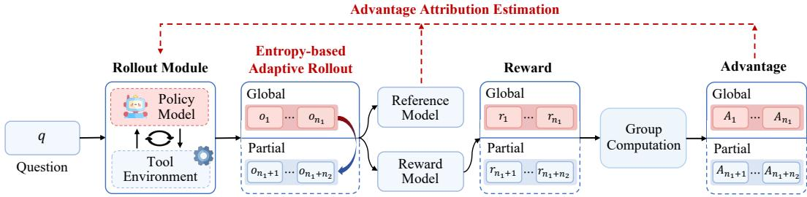
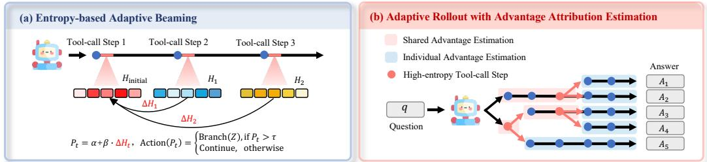
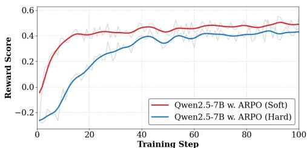

[← 返回 README](../README.md)

# 3 Agentic Reinforce Policy Optimization

## 📌 预览

ARPO 的核心算法章节，包含三个子模块：Entropy-based Adaptive Rollout（3.1 + Figure 3/4a）、Advantage Attribution Estimation（3.2 + Figure 4b/5）、Theoretical Foundation / GPG Theorem（3.3）。整体数据流：全局采样 N 条轨迹 → 记录初始熵 → 每轮工具调用后监控熵变化 → 超阈值则分支 → 软 advantage 估计 → GRPO 更新。

---

## 3 AGENTIC REINFORCE POLICY OPTIMIZATION

In this section, we propose the ARPO algorithm, designed to guide LLMs in exploring step-wise tool-use behaviors under entropy-based guidance, as illustrated in Figures 3 and 4:

- **Entropy-based Adaptive Rollout (3.1)**: Inspired by the entropy variations observed in preliminary experiments (2.2), ARPO extends the traditional rollout process by performing not only trajectory-level sampling but also branching at high-entropy tool-use steps. By striking a balance between global and partial sampling, ARPO encourages broader exploration of tool-use behaviors.

- **Advantage Attribution Estimation (3.2)**: To better accommodate the adaptive rollout mechanism, we propose the advantage attribution estimation, enabling the model to more effectively internalize the advantage differences in stepwise tool-use behaviors.

- **Theoretical Analysis (3.3)**: To establish the theoretical foundation of ARPO, we provide a formal analysis showing that ARPO offers good adaptability in multi-turn training scenario for LLM-based agents.

Below, we will delve into the specifics of our approach.

*Figure 3: The overview of ARPO algorithm.*

> 💡 **Figure 3 批读**：
> - 上图是 ARPO 算法的全景概览。从左到右展示了 ARPO 的完整工作流程：
>   1. **Input Prompt**：输入问题 q 和可用工具 T。
>   2. **Initial Sampling**：生成 N 条全局轨迹，计算初始熵矩阵。
>   3. **Tool-Call + Entropy Monitoring**：每轮工具调用后监控熵变化 $\Delta H$。
>   4. **Branching Decision**：若 $\Delta H \gt \tau$，分叉 Z 条路径继续探索。
>   5. **Advantage Attribution**：区分共享 token 和分支 token 的 advantage。
>   6. **GRPO Update**：基于分组 advantage 进行策略更新。
> - 注意图中不同颜色的节点代表不同的处理阶段，分支路径用不同颜色区分。

---

## 3.1 ENTROPY-BASED ADAPTIVE ROLLOUT

Inspired by preliminary experiments (2.2), we incorporate both trajectory-level sampling and entropy-based partial sampling during the rollout phase to cover a more comprehensive sampling scope. The design of this mechanism involves the following four core steps:

**(1) Rollout Initialization**: Given a global rollout size of $M$, the LLM first generates $N$ trajectories via trajectory-level sampling based on the input question $q$, while the remaining $M - N$ trajectories budgets are reserved for partial sampling. We then compute the entropy of the first tokens $k$ in each trajectory using Equation 3, forming the initial entropy matrix denoted as $H _ { \mathrm { i n i t i a l } } \in \mathbb { R } ^ { 1 \times k }$.

**(2) Entropy Variation Monitoring**: After recording the initial entropy, the model perform agentic reasoning with tools, as defined in Equation 2. To continuously monitor the entropy dynamics following each tool invocation, we allow the model to generate $k$ additional tokens after concatenating the response from the tool call. For the tool-call step $t$, we compute a step-level entropy matrix denoted as $H _ { t } \in \mathbb { R } ^ { 1 \times k }$. We then quantify the normalized change in entropy relative to the initial state using the following formulation:

$$
\Delta H _ { t } = \mathrm { N o r m a l i z e } ( H _ { t } - H _ { \mathrm { i n i t i a l } } )
$$

where normalization means summing all the values of $\Delta H$ in dividing by the vocab size $V$. A positive $\Delta H$ indicates an increase in uncertainty after tool-call step $k$, whereas a negative value reflects a reduction in uncertainty.

> 💡 **公式批读**：
> - Eq. 4 是 ARPO 的核心信号：**归一化的熵变化量**。归一化方法是用所有 $\Delta H$ 的和除以词表大小 $V$，使得不同模型、不同词表大小的熵变化具有可比性。
> - 关键设计取舍：只监控工具调用后的**前 k 个 token** 的熵，而不是整条轨迹。这是因为实验表明熵增最显著的是前 10-50 token。这个设计大大减少了计算开销。
> - $\Delta H \gt 0$ 表示工具调用引入了新不确定性（需要探索），$\Delta H \lt 0$ 表示工具结果消除了不确定性（可以继续）。

**(3) Entropy-based Adaptive Beaming**: To encourage adaptive exploration along tool-use paths that exhibit beneficial entropy variations, we define the partial sampling probability at the tool-call step $t$ as follow:

$$
P _ { t } = \alpha + \beta \cdot \Delta H _ { t } , \quad \mathrm { A c t i o n } ( P _ { t } ) = \left\{ \begin{array} { l l } { \mathrm { B r a n c h } ( Z ) , } & { \mathrm { i f ~ } P _ { t } \gt \tau } \\ { \mathrm { C o n t i n u e , } } & { \mathrm { o t h e r w i s e } } \end{array} \right.
$$

where $\alpha$ is a base sampling probability, $\beta$ is a stability entropy value. As shown in Figure 4(a), the model uses $P _ { t }$ to determine its branching behavior: when $P _ { t }$ exceeds a predefined threshold $\tau$, it initiates Branch(Z), branching $Z$ partial reasoning paths from the current node; otherwise, it continues along the current trajectory.

This mechanism enables the model to adaptively allocate exploration resources to regions of the reasoning space where rising entropy indicates a higher potential for informative outcomes.

> 💡 **机制拆解**：
> - Eq. 5 的分支决策 = 基础概率 + 熵信号驱动：
>   - $\alpha$（基础概率）：即使熵没有变化，也有一定概率分支（防止完全忽略低熵但重要的步骤）。
>   - $\beta$（熵权重）：控制熵变化信号的放大程度。实验显示 $\beta = 0.2$ 时效果最好。
>   - $\tau$（分支阈值）：当 $P_t \gt \tau$ 时执行分支操作 Branch(Z)。默认设置 $\alpha = 0.5$, $\tau = 0.5$。
> - 这个机制的巧妙之处：它不是简单地根据 $\Delta H$ 的大小来选择分支，而是通过 $P_t$ 概率化地决定，保留了随机性，避免了过早陷入局部最优。

**(4) Termination**: The process iterates until one of the conditions is satisfied: (1) if the total number of forked paths $\hat { Z }$ reaches the partial sampling budget $M - N$, branching stops and sampling continues until a final answer is produced; (2) if all paths terminate before reaching $M - N$, we supplement with $M - N - \hat { Z }$ additional trajectory-level samples to satisfy condition (1).

By leveraging this efficient rollout mechanism, ARPO facilitates uncertainty-aware exploration, allowing LLMs to more effectively identify step-level tool-calling behavior. Meanwhile, assuming the global expansion size and the number of tokens per trajectory are $n$, ARPO reduces the computational complexity of each rollout from the trajectory-level RL's $O ( n ^ { 2 } )$ to between $O ( n \log n )$ and $O ( n ^ { 2 } )$.

> 💡 **机制拆解**：
> - 终止条件的两个保障：(1) 预算用满则停止分支，所有路径继续直到答案生成；(2) 预算没用完就追加独立 trajectory-level 采样确保 M 条完整轨迹。
> - 计算复杂度的分析：虽然上界仍是 $O(n^2)$，但实际中由于只在部分高熵步骤分支，复杂度更接近 $O(n \log n)$——这是 ARPO 效率优于全量扩大 rollout 的关键数学依据。

---

## 3.2 ADVANTAGE ATTRIBUTION ESTIMATION

Our entropy-based adaptive rollout mechanism naturally produces trajectories containing both shared reasoning token segments and distinct beam paths (Figure 4), which motivates us to explore a more principled agentic RL policy update strategy. To this end, we consider the following two advantage assignment settings:

*Figure 4: Illustration of two core components: Entropy-Based Adaptive Rollout and Advantage Attribution Estimation. Left: Principle of Entropy-Based Adaptive Beaming. Right: ARPO assigns different advantages to shared and individual token parts in inter-group samples.*

> 💡 **Figure 4 批读**：
> - **左图 (Entropy-Based Adaptive Beaming)**：展示了分支采样的树形结构。从根节点（初始采样）出发，在工具调用步骤（不同颜色节点代表不同的 tool）检查熵变化，高熵步骤触发多个分支。注意分支后的路径各自独立发展到终点。
> - **右图 (Advantage Attribution Estimation)**：展示了两组轨迹（Group A 和 Group B），每组有共享的 prefix token（蓝色）和分叉后的独立 token（绿色和红色）。ARPO 对不同部分赋予不同的 advantage 信号。
> - 这两张图精要地解释了 ARPO 的完整设计：(1) 什么条件下分叉（左图）；(2) 分叉后怎么更新策略（右图）。

**Hard Advantage Estimation**: As shown in Figure 4(b), a straightforward approach is to explicitly distinguish the shared and individual parts of each trajectory at the advantage level, thereby encouraging the model to capture step-level tool-use behaviors. Given $d$ trajectories that share certain tokens while diverging in others, we compute the advantage for the individual tokens using the normalized reward $R_i$: $\hat { \boldsymbol { A } } _ { i , t } = \frac { r _ { i } - \operatorname* { m e a n } ( \{ R _ { i } \} _ { i = 1 } ^ { G } ) } { \operatorname* { s t d } ( \{ R _ { i } \} _ { i = 1 } ^ { G } ) }$. For the shared tokens, we assign the average advantage across $d$ trajectories that contain the shared segment: $\hat { A } _ { i , t } ^ { \mathrm { s h a r e d } } = \frac { 1 } { d } \sum _ { i = 1 } ^ { d } \hat { A } _ { i , t }$.

> 💡 **机制拆解**：
> - Hard Estimation 直截了当：共享 token 拿所有相关轨迹的平均 advantage，分叉 token 拿各自的独立 advantage。这种显式区分便于分析和调试，但在实践中不够平滑——共享 token 接收的是"平均信号"，可能丢失 fine-grained 信息。

**Soft Advantage Estimation**: An elegant alternative to hard advantage assignment is to integrate the distinction between shared and individual token segments latently during policy optimization. Specifically, for each input question $x$, the Group Relative Policy Optimization (GRPO) (Shao et al., 2024) enables the reference policy $\pi _ { \mathrm { r e f } }$ to generate a set of responses $\left\{ y _ { 1 } , y _ { 2 } , \ldots , y _ { G } \right\}$ and optimizes the policy by maximizing:

$$
\begin{array} { r l } & { J _ { \mathrm { G R P O } } ( \theta ) = \mathbb { E } _ { ( q , a ) \sim D , \{ y _ { i } \} _ { i = 1 } ^ { G } \sim \pi _ { \theta _ { 0 l d } } ( \cdot | q ) } \left[ \displaystyle \frac { 1 } { G } \sum _ { i = 1 } ^ { G } \frac { 1 } { | y _ { i } | } \sum _ { t = 1 } ^ { | y _ { i } | } \operatorname* { m i n } \left( r _ { i , t } ( \theta ) \hat { A } _ { i , t } , \right. \right. } \\ & { \left. \left. \mathrm { c l i p } \left( r _ { i , t } ( \theta ) , 1 - \epsilon , 1 + \epsilon \right) \hat { A } _ { i , t } \right) - \beta D _ { \mathrm { K L } } ( \pi _ { \theta } \parallel \pi _ { \mathrm { r e f } } ) \right] } \end{array}
$$

Notably, the GRPO objective incorporates the distinction between shared and individual tokens through importance sampling ratio $r _ { i , t } ( \theta )$:

$$
\boldsymbol { r } _ { i , t } ( \theta ) = \frac { \pi _ { \theta } ( y _ { i , t } \mid x , y _ { i , \lt t } ) } { \pi _ { \mathrm { r e f } } ( y _ { i , t } \mid x , y _ { i , \lt t } ) } , \quad \left\{ \boldsymbol { r } _ { i , t } ( \theta ) = \boldsymbol { r } _ { j , t } ( \theta ) , \quad \mathrm { i f } \ y _ { i , \lt t } = y _ { j , \lt t } \ ( \mathrm { i . e . , s h a r e d ~ t o k e n s } ) \right.
$$

As indicated by the above equation, when trajectories $y _ { i }$ and $y _ { j }$ undergo a partial rollout at token $t$, they share the same response prefix tokens, i.e., $y _ { i , \lt t } = y _ { j , \lt t }$. Consequently, the shared prefix tokens in both trajectories are assigned the same importance weight $r _ { i , t } ( \theta )$. In the GRPO formulation, the mathematical interpretation is that the policy update is guided by the average advantage of tokens within each group, which serves as the loss signal.

Since shared tokens have identical $r _ { i , t } ( \theta )$, their advantage contributions are effectively aligned and closely approximate the advantage $\hat { A } _ { i , t } ^ { \mathrm { s h a r e d } }$ in a hard estimation setting. Although we adopt the GRPO loss formulation, our unique partial rollout design explicitly differentiates the update strategies for shared versus individual tokens. We also provide a detailed proof for the above argument in Appendix D.1.

> 💡 **机制拆解**：
> - Soft Estimation 的精妙之处：**不需要显式区分共享/分叉 token**，GRPO 的 importance sampling ratio 天然实现了这一区分。原理是：共享 prefix 的 token 拥有完全相同的条件历史 $y_{i,\lt t} = y_{j,\lt t}$，因此 $r_{i,t}(\theta)$ 完全相同，他们的更新信号通过组内平均自然对齐。
> - 与 Hard 的对比：Hard 通过人工均值实现对齐，Soft 通过 GRPO 的数学结构自然实现。Soft 的优势在于：(1) 更稳定（不需要手动设定 averaging 范围）；(2) 证明见 Appendix D.1。

*Figure 5: Comparison of different advantage estimation method: Hard vs. Soft setting.*

> 💡 **Figure 5 批读**：
> - 该图对比了 Soft 和 Hard 两种 advantage estimation 在 RL 训练过程中的 reward 变化曲线。
> - Soft 设置（蓝线）在训练全过程中 reward 显著且稳定地高于 Hard 设置（红线），且方差更小。这说明隐式的 advantage 对齐比显式均值化更有利于训练稳定性。
> - 基于此实验结果，ARPO **默认使用 Soft 设置**。

In practice, we further compare the reward variations between hard and soft advantage estimation in RL training. As shown in Figure 5, the soft setting achieves consistently higher rewards with greater stability during ARPO training. Consequently, our ARPO defaults to using the soft setting for advantage estimation.

**Hierarchical Reward Design**. The reward function serves as the optimization objective, guiding the policy model's behavior during training. We follow Tool-Star (Dong et al., 2025), considering both correctness and format rewards, along with a multi-tool collaboration reward mechanism. Notably, an additional reward $r _ { M }$ is given when the model generates the correct answer, follows the correct tool invocation format, and uses multiple tools (i.e., `<search>` and `<python>`) during reasoning. The overall reward $R$ is formally defined as:

$$
R = \left\{ \begin{array} { l l } { \operatorname* { m a x } ( A c c . + r _ { \mathrm { M } } , A c c . ) } & { \mathrm { I f ~ F o r m a t ~ i s ~ G o o d ~ \& ~ A c c . \gt 0 ~ } } \\ { 0 } & { \mathrm { I f ~ F o r m a t ~ i s ~ G o o d ~ \& ~ A c c . = 0 ~ } } \\ { - 1 } & { \mathrm { O t h e r w i s e } } \end{array} \right.
$$

with $r _ { \mathrm { M } } = \left\{ 0.1 \quad \mathrm { i f } \ \exists ( [ \mathrm { s e a r c h } ] \land [ \mathrm { p y t h o n } ] ) \right\}$

> 💡 **机制拆解**：
> - 层次化 Reward 设计的三个层次：
>   - **格式错误** → -1（硬惩罚，强制模型遵守工具调用格式）。
>   - **格式正确但答案错误** → 0（中性，不惩罚探索）。
>   - **格式正确且答案正确** → 基础分 + 多工具协作加分 $r_M = 0.1$（鼓励同时使用搜索和 Python）。
> - 注意 $r_M$ 的设计：只有当 `[search]` 和 `[python]` **同时出现**时才给加分，这是从 Tool-Star 借鉴的多工具协作激励。这种设计鼓励模型在需要时灵活组合工具，而非只用一种。

The detailed flowchart for the ARPO algorithm can be found in Algorithm 1.

---

## 3.3 THEORETICAL FOUNDATION

Our approach leverages the adaptive partial rollout mechanism, which involves branching at high-entropy tool-use steps. Here, we elucidate the rationale behind this mechanism.

As depicted in Figure 4, the adaptive partial rollout mechanism dynamically segments the Transformer-based policy's output tokens $\lt OT_1, OT_2, ..., OT_{|output|} \gt$ into $K$ segments. Each segment is defined as a macro action, $MA_i \triangleq \lt OT_m, OT_{m+1}, ..., OT_{m+n} \gt$. The corresponding macro states are defined as $MS_1 \triangleq \lt IT_1, IT_2, ..., IT_{|input|} \gt$ and $MS_i \triangleq \lt MS_{i-1}, MA_{i-1} \gt$. This segmentation allows us to derive the Generalized Policy Gradient (GPG) Theorem applicable to all Transformer-based policies:

$$
\nabla _ { \theta } J ( \theta ) = \mathbb { E } _ { \tau \sim \pi _ { \theta } } \{ \sum _ { T = 1 } ^ { K } [ \nabla _ { \theta } \log \pi _ { \theta } ( M A _ { T } | M S _ { T } ) A _ { T } ( \tau ) ] \}
$$

In this equation, $T$ represents the macro step, and $A _ { T } ( \tau )$ denotes the advantage of trajectory $\tau$. The GPG Theorem asserts that for any differentiable Transformer-based policy $\pi _ { \theta }$ and any objective function $J ( \theta )$, optimization can be effectively conducted using macro actions (i.e., partial rollout segments). This generalization encompasses the traditional Policy Gradient Theorem (Sutton et al., 1999), $\nabla _ { \theta } J ( \theta ) = \mathbb { E } _ { \tau \sim \pi _ { \theta } } \{ \sum _ { t = 1 } ^ { H } [ \nabla _ { \theta } \log \pi _ { \theta } ( a _ { t } | s _ { t } ) A _ { t } ( \tau ) ] \}$, which operates on single-token actions (where $a _ { t }$ is a single output token of the Transformer), as a specific instance of our broader GPG framework. Consequently, ARPO as an advanced implementation of the GPG Theorem provides a robust theoretical foundation. The formal proof of the GPG Theorem is presented in Appendix D.2.

> 💡 **公式批读**：
> - **GPG Theorem 的核心贡献**：将传统 Policy Gradient Theorem 从单 token action $a_t$ 推广到任意长度的宏动作 $MA_T$（即 partial rollout 段）。传统 PG 中 $a_t$ 是单个 token，GPG 中 $MA_T$ 是多个连续 token 组成的语义完整段。
> - **为什么需要 GPG**：ARPO 的分支采样天然地将轨迹分割为不同段（共享 prefix + 分叉后缀），GPG 保证了这种分割在数学上是合法的——即按工具调用边界分割后，仍然可以正确计算策略梯度。
> - **与传统 PG 的关系**：当宏动作长度 = 1 时，GPG 退化为标准 PG Theorem。因此 GPG 是 PG 的严格推广（generalization），不是近似。
> - 完整证明见 Appendix D.2。

---

> 💡 **Section 3 总结**：
> - **关键数字**：M=16（全局 rollout），N=8（初始采样），α=0.5，β=0.2，τ=0.5。
> - **核心流程**：全局采样 N 条轨迹 → 计算初始熵 → 工具调用 → 监控熵变化 ΔH → ΔH \gt τ 则分叉 Z 条 → Soft advantage estimation → GRPO 更新。
> - **核心洞察**：
>   1. 熵自适应分支机制将有限的探索资源集中于高不确定性步骤。
>   2. Soft Advantage Estimation 利用 GRPO 的数学结构，无需显式区分共享/分叉 token 即可实现优势对齐。
>   3. GPG Theorem 为任意粒度轨迹分割提供了严格理论保证。
> - **可追问点**：为什么 Soft 比 Hard 更稳定？M、N、Z 这些超参数之间需要满足什么约束关系？
