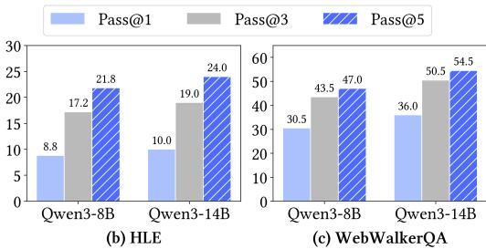
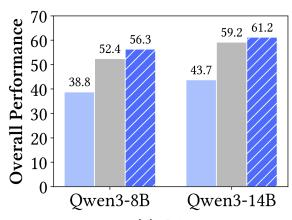
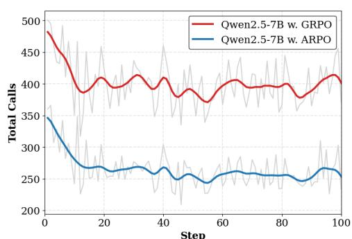
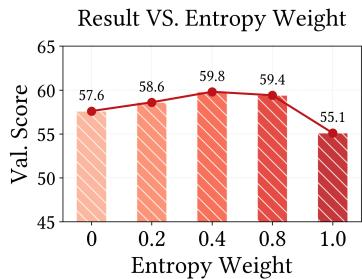

[← 返回 README](../README.md)

# 4 Experiments

## 📌 预览

实验部分覆盖 13 个 benchmark、3 大类任务、多 backbone。核心发现：(1) ARPO 在所有设置下全面超越 trajectory-level RL（GRPO/DAPO/Reinforce++）；(2) Deep Search 任务上仅用 1K 样本即取得显著提升；(3) 工具调用效率是 GRPO 的 2 倍；(4) Scaling 分析验证了超参数的合理设计。

---

## 4 EXPERIMENT

### 4.1 DATASETS

To comprehensively evaluate the effectiveness of our ARPO algorithm in training LLM-based toolusing agents, we conduct experiments on the following three types of long-horizon reasoning tasks:

**(1) Mathematical Reasoning**: including AIME2024, AIME2025, MATH500 (Lightman et al., 2024), MATH (Hendrycks et al., 2021), and GSM8K.

**(2) Knowledge-Intensive Reasoning**: including WebWalker (Wu et al., 2025b); as well as three Wikipedia-based open-domain QA tasks: HotpotQA (Yang et al., 2018), 2WikiMultihopQA (Ho et al., 2020), and Musique (Trivedi et al., 2022) and bamboogle (Press et al., 2023).

**(3) Deep Search**: including General AI Assistant (GAIA) (Mialon et al., 2024), WebWalker (Wu et al., 2025b), Humanity's Last Exam (HLE) (Phan et al., 2025), and xbench (Chen et al., 2025a). Notably, we follow the Websailor (Li et al., 2025c) setting by testing the xbench-DeepSearch split.

To maintain consistency with existing work, we use the Tool-Star (Dong et al., 2025) test set split for the mathematical and knowledge reasoning benchmarks, and for the deep search benchmarks, we follow Webthinker and HIRA (Li et al., 2025e; Jin et al., 2025b) for the Deepsearch test set split.

> 💡 **问题动机**：
> - 三类任务的设计逻辑：数学推理（需要代码工具验证）、知识密集推理（需要搜索引擎检索）、Deep Search（需要搜索引擎+浏览器+代码解释器联合）。任务类型越复杂，工具调用越频繁，ARPO 的理论优势应该越明显。
> - 特别关注 Deep Search：仅用 1K 训练样本，但涉及 HLE 这种极难 benchmark（甚至 GPT-4o 和 DeepSeek-R1-671B 也只拿了 2%-8.6%）。

---

### 4.2 BASELINES

To effectively evaluate the efficacy of ARPO, we consider the following three baselines:

1. **Direct Reasoning**: For mathematical and knowledge reasoning benchmarks, we evaluate the instruct versions of the Qwen2.5 (Qwen et al., 2024) and Llama3.1 (Dubey et al., 2024) series. Given the superior mathematical performance of the Qwen3 series (Yang et al., 2025), we use the Deepsearch task to test RL algorithms on this model's backbone. We also reference strong reasoning models, including QwQ (Team, 2024b), DeepSeek-R1 (DeepSeek-AI et al., 2025), GPT-4o (Hurst et al., 2024), and o1-preview (Hurst et al., 2024).

2. **Trajectory-level RL Algorithms**: We compare ARPO with common trajectory-level RL algorithms for training LLM-based tool-use agents, including GRPO (Shao et al., 2024), DAPO (Yu et al., 2025), and REINFORCE++ (Hu, 2025).

3. **LLM-based Search Agent**: For the deep search benchmark, we include GRPO and a series of open-source workflow-based search agents as references, such as vanilla RAG (Lewis et al., 2020), Search o1 (Li et al., 2025d), Webthinker (Li et al., 2025e), and ReAct (Yao et al., 2022). Detailed introductions are in Appendix B.

---

### 4.3 TRAINING GUIDELINE

Our study aims to validate the effectiveness of ARPO at the algorithmic level compared to traditional RL in training LLM agents, rather than merely pursuing performance improvements. To ensure reproducibility, all training frameworks and datasets are sourced from open-access resources. Specifically, our experiments adhere to the cold-start SFT with RL paradigm (Song et al., 2025; Dong et al., 2025) to mitigate reward collapse during the initial RL training phases.

1. **Cold-Start Finetuning Phase**: Utilizing the LLaMAFactory (Zheng et al., 2024) framework, we leverage Tool-Star's open-source dataset of 54K training samples. To enrich the quality of mathematical reasoning data, we incorporate the STILL dataset (0.8K), drawing inspiration from CORT (Li et al., 2025a).

2. **RL Phase**: To assess ARPO across various scenarios, we explore the following domains:

- **Deep Reasoning Tasks**: This includes computational reasoning (e.g., AIME24, MATH500) and multi-hop knowledge-based reasoning (e.g., HotpotQA, Bamboogle). We utilize Tool-Star's 10K open-source RL training samples for algorithmic comparison.

- **Deep Search Tasks**: These tasks require extensive web exploration and information integration, necessitating longer contexts and frequent tool interactions. We use only 1K mixed hard search samples from SimpleDeepSearcher (Sun et al., 2025b) and WebSailor (Li et al., 2025c) for training.

To expedite the RL training phase, we incorporate top-10 snippets from the Bing search engine as search results, employ a Python compiler within a sandbox environment, and use token-level F1 scores as the correctness signal.

> 💡 **机制拆解**：
> - 训练分为两阶段：(1) Cold-Start SFT（避免 RL 初期 reward collapse）；(2) RL 阶段对比不同算法。
> - Deep Reasoning 用 10K 样本，Deep Search 仅用 1K 样本——后者更能体现 ARPO 的样本效率优势。
> - 训练环境使用 Bing 搜索 + Python 沙箱 + F1 评分。注意 F1 用于知识密集型 QA，其他任务用 LLM-as-Judge。

---

### 4.4 EVALUATION METRIC

In evaluation phase, we use a search engine with browser capabilities to align with standard reasoning performance. For accuracy, we use F1 scores as the metric for four QA tasks in Knowledge-Intensive Reasoning, while other tasks are evaluated using Qwen2.5-72B-instruct under the LLM-as-Judge setting. We adopt pass@1 evaluation with non-zero temperature, setting the temperature and top-p to 0.6 and 0.95, respectively. For all tasks, we follow previous work (Li et al., 2025d) and extract answers from the model output enclosed in `\box{}`.

---

### 4.5 MAIN RESULTS

Results on Mathematical & Knowledge-Intensive Reasoning. Our main results are shown in Table 1. In a fair setting, ARPO consistently outperforms all trajectory-level RL algorithms, firmly establishing its superiority. Moreover, we highlight the following insights:

- **Ineffectiveness of Prompting Methods**: The Tool-integrated prompting (TIR) method (Li et al., 2025d) fails to effectively explore superior tool-use behaviors. For both Qwen and Llama series models, performance improvements with TIR prompts are limited and even lower than direct reasoning. This suggests that relying solely on prompt engineering is insufficient for guiding LLMs toward optimal tool behaviors and may disrupt their inherent reasoning capabilities.

- **Limitations of Trajectory-Level RL**: Compared to ARPO, three classic trajectory-level RL algorithms do not effectively harness the potential for tool-integrated reasoning. While the DAPO algorithm excels in single-turn reasoning tasks, it underperforms in multi-turn tool-call interaction, especially in knowledge-intensive scenarios. This aligns with our preliminary observations that trajectory-level RL algorithms struggle to stimulate step-level tool-use behavior learning in LLMs.

- **Robust Performance of ARPO**: In the same experimental setup, ARPO consistently outperforms other RL algorithms across 10 datasets, achieving an average accuracy improvement of 4% while maintaining competitive result on individual domains. Notably, it shows significant enhancements across different backbone models, including both Qwen and Llama series. These results underscore ARPO's efficiency, and strong adaptability across various model backbones and tasks.

> 💡 **Table 1 批读**：
> - 三个核心发现对应三个 baseline 类别：
>   1. **TIR Prompting vs. Direct Reasoning**：Prompt 工程不仅无效，甚至会扰乱模型的固有推理能力（"disrupt their inherent reasoning capabilities"），说明工具使用行为的学习需要 RL 训练而非简单的 prompt 引导。
>   2. **Trajectory-level RL 局限**：DAPO 在单轮推理任务上表现出色，但在多轮工具交互（尤其是知识密集型任务）中效果不佳，佐证了 Section 2.2 的熵分析——单轮 RL 无法捕捉工具交互后的行为不确定性。
>   3. **ARPO 的鲁棒性**：跨 3 个 backbone 模型家族（Qwen2.5-3B/7B、Llama3.1-8B）、10 个数据集，平均+4%——这不是偶然波动，而是稳定的算法优势。
> - Qwen2.5-7B + ARPO 的平均分 (58.3) 领先于 GRPO (56.5)，DAPO (54.8)，Reinforce++ (54.9)。

Results on Deep Search Tasks. To further verify the effectiveness of our ARPO in challenging deep search scenarios, we compare the performance of the Qwen3 series models, trained with only 1k RL samples, against a series of strong baseline methods. Our observations are as follows:

- **Generalization of ARPO in Deep Search Domain**: In deep search scenarios, even the most advanced LLMs like GPT-4o and DeepSeek-R1-671B achieve limited performance, scoring only 2% and 8.6% on the HLE benchmark respectively. In contrast, ARPO demonstrates exceptional performance using only the Qwen3-8 and 14B models, achieving pass@1 scores of 10.0% and 43.2% on the HLE and GAIA benchmarks. Notably, during the RL phase, ARPO is trained with just 1K samples from an open-source web search dataset, showcasing its efficiency in leveraging tool-integrated reasoning capabilities.

- **Importance of Step-Level Tool Use Behavior Exploration**: ARPO consistently outperforms GRPO in both average performance and individual benchmarks, with a notable 6% improvement on the GAIA and WebwalkerQA benchmarks. This highlights the importance of ARPO's algorithmic design, which balances global and step-level sampling. This balance promotes diverse behavior exploration by LLMs during high-entropy tool-use steps, crucial for deep search scenarios involving frequent tool invocation.

> 💡 **Table 2 批读**：
> - **ARPO 的惊人效率**：Qwen3-14B + ARPO 在 GAIA 上拿到 43.7%（vs GRPO 36.9%），在 WebWalkerQA 上拿到 36.0%（vs GRPO 30.0%），在 HLE 上拿到 10.0%（vs GRPO 8.6%）。训练只用了 1K 样本，对比之下 GRPO 用了同样的样本但效果更差。
> - **ARPO vs Large Models**：Qwen3-8B + ARPO 甚至在某些指标上接近或超过 GPT-4o 和 DeepSeek-R1-671B（如 GAIA Lv.3 上 ARPO 16.7% vs R1 5.2%），虽然绝对分数仍低于 o1-preview，但考虑到模型规模和训练样本量，效率极为突出。
> - 特别值得注意的是，Deep Search 场景下工具调用非常频繁（与 Section 2.2 的熵增现象高度吻合），ARPO 的优势在这里最大化。

---

### 4.6 QUANTITATIVE ANALYSIS

**Analyzing Sampling at Scale**. Due to the dynamic and multi-round interaction characteristics of Deepsearch evaluation, Pass@1 is insufficient to capture the model's potential for tool usage. Consequently, we conducted further sampling analysis on Pass@3 and Pass@5, as illustrated in Figure 6. Both the 8B and 14B models demonstrated consistent improvements and a scaling trend in Pass@3 and Pass@5 following the ARPO alignment stage. Notably, our Qwen-14B with ARPO achieved remarkable performance on Pass@5, particularly with GAIA at 61.2%, HLE at 24.0% and xbench-DR at 59%. This stable enhancement in Pass@K is primarily attributed to ARPO's ability to explore fine-grained tool-use behaviors more efficiently, thereby expanding the sampling space and achieving both inference efficiency and sampling diversity.

*Figure 6: Analysis of Qwen3-8B and Qwen3-14B using ARPO across Pass@1 to Pass@5 metrics.*

> 💡 **Figure 6 批读**：
> - Pass@K 分析展示了 ARPO 的采样效率：随采样次数增加 (K=1→5)，ARPO 的性能稳定提升而非饱和。这说明 ARPO 的分支采样策略不仅提升了单次精度，更扩大了有效采样空间。
> - Qwen3-14B + ARPO 在 GAIA 上从 Pass@1 的 43.7% 提升到 Pass@5 的 61.2%，提升幅度高达 +17.5%。对比之下，纯 trajectory-level RL 的 Pass@K 提升通常较小，因为它们的采样空间更同质化。

**Tool-Call Efficiency Analysis**. In agentic RL training, increasing the number of tool calls often results in substantial financial costs. Therefore, an effective agentic RL algorithm must ensure efficient tool usage. To assess the tool usage efficiency of ARPO during training, we compare it with GRPO on Qwen2.5-7B. As shown in Figure 7, ARPO achieves superior overall accuracy compared to GRPO while using only half the number of tool calls. This efficiency is attributed to ARPO's unique entropy-based adaptive rollout mechanism, which selectively explores branches only during high-entropy tool-call steps. This approach significantly expands the exploration space for tool behavior while greatly reducing the number of tool calls.

*Figure 7: Comparison of Tool-Call Efficiency for Qwen2.5-7B: GRPO vs. ARPO*

> 💡 **Figure 7 批读**：
> - 这张图可能是本文最具实际价值的结果：x 轴是训练阶段的总工具调用次数，y 轴是准确率。ARPO 曲线（橙色）始终在 GRPO 曲线（蓝色）上方，且在 GRPO 一半的调用次数时就达到了 GRPO 的峰值准确率。
> - 经济学意义：在实际部署中，API 调用（搜索、代码执行等）是主要成本。ARPO 通过只在关键步骤分支，大幅减少了无意义的工具调用。

**Ablations of Browser Agents**. To further investigate the importance of the browser agent in the Deepsearch task, we designed three browser settings, ranked from weakest to strongest in terms of capability: (1) no browser with only snippets; (2) a browser agent with a similar scale to the reasoning model; and (3) a larger-parameter browser agent.

> 💡 **消融解读**：
> - 浏览器 Agent 的消融揭示了 ARPO 的一个重要特征：**外部工具能力是 ARPO 效果的上限**。浏览器 Agent 越强，能提取的信息越丰富，ARPO 的高熵分支机制就越能发挥作用。
> - Snippet only 设置下性能最低，证明 Deep Search 不仅需要搜索，还需要网页获取和浏览能力。

---

### 4.7 SCALING ANALYSIS OF ARPO

To verify the scalability of ARPO and gain deeper insights into its characteristics, we use the Qwen2.5-7B model as the backbone for a scaling analysis of three core parameters: entropy value, global rollout size, and initial sampling size. Our observations are as follows:

**Entropy Value ($\Delta H_t$)**: As shown in Figure 8 (left), model performance increases with rising entropy values, peaking at 0.4. This indicates that integrating a moderate amount of entropy as a clue for partial sampling substantially enhances the model's ability to explore rare tool-use behaviors, thereby improving training outcomes. However, as entropy reaches 1.0, performance declines, suggesting a trade-off in the weight of entropy in sampling. Over-reliance on entropy may reduce sampling diversity, confirming the necessity of balancing base sampling probabilities $\alpha$ with entropy in ARPO.

**Initial Sampling Size ($N$)**: Figure 8 (middle) illustrates that as the initial sampling size increases, model performance improves, peaking at 8. Notably, with a global rollout size of 16, increasing the initial sampling size from 0 to 8 shifts the global-to-partial sampling ratio from 1:15 to 1:1. This underscores the importance of balancing sampling proportions for improving performance. As anticipated, increasing the size to 16 results in a great performance decline. This is because it leads to complete global sampling, which disrupts the dynamic sampling balance.

**Global Rollout Size ($M$)**: As depicted in the Figure 8 (right), increasing the global rollout size enhances model performance, indicating that the ARPO algorithm is scalable and can improve generalization performance with larger sizes.

*Figure 8: Scaling analysis of different Hyper-parameters in Qwen2.5-7B with ARPO. The detailed setting can be found in Appendix C.4.*

> 💡 **Figure 8 批读 / 消融解读**：
> - **左图 (Entropy Value $\Delta H_t$)**：性能随熵值先升后降，峰值在 0.4。这是典型的"适度熵引导"现象——熵权重太低则不足以触发有效分支（欠探索），太高则过度依赖熵信号导致采样多样性损失（过探索）。
> - **中图 (Initial Sampling Size $N$)**：峰值在 $N=8$，此时全局:局部 = 1:1 的平衡比例。$N=0$（完全无全局采样）和 $N=16$（完全无局部分支）都导致性能下降——证明 **ARPO 的核心价值在于全局和局部采样的平衡**，而非单纯的某一种采样策略。
> - **右图 (Global Rollout Size $M$)**：$M$ 增大性能单调提升，证明 ARPO 算法在规模上可扩展（scalable）。
> - 三个消融共同传达了 ARPO 的设计哲学：**balance**（平衡全局/局部）、**moderation**（适度熵引导）、**scalability**（可扩展性）。

---

> 💡 **Section 4 总结**：
> - **关键数字**：13 个 benchmark、3 类任务、4 个 backbone 模型家族、平均 +4% 提升、50% 工具预算节省、1K Deep Search 训练样本。
> - **核心洞察**：
>   1. ARPO 在数学推理、知识密集推理、Deep Search 三类任务上全面超越 GRPO/DAPO/Reinforce++。
>   2. 工具调用效率是 GRPO 的 2x，证明熵自适应分支机制在节约成本方面的实际价值。
>   3. Scaling 分析揭示了三个超参数的 trade-off：$\Delta H_t$ 峰值在 0.4，$N$ 峰值在 8（1:1 平衡），$M$ 可继续扩展。
>   4. 浏览器 Agent 能力直接影响 ARPO 表现，外部工具是 Agent RL 系统的瓶颈。
> - **可追问点**：为什么 Entropy Value 峰值在 0.4 而不是其他值？全局和局部采样比例 1:1 是否是通用最优？
